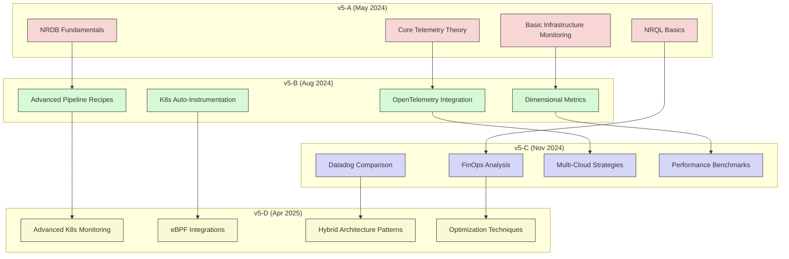
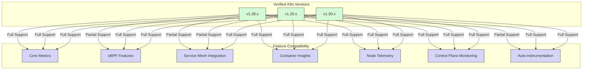
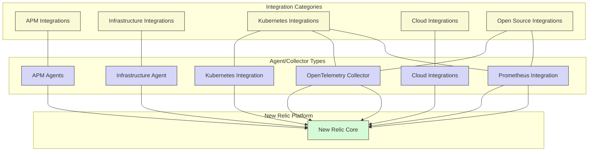

# Revision & Compatibility Matrix

## Document Revision History

| Version | Date | Description | Author |
|---------|------|-------------|--------|
| v5-D | April 2025 | Ultimate Edition with expanded Kubernetes & Infrastructure focus | Technical Architecture Team |
| v5-C | November 2024 | Added Datadog comparison and extended cost models | Performance Engineering |
| v5-B | August 2024 | Expanded OpenTelemetry integration details | Observability Solutions |
| v5-A | May 2024 | Initial technical deep-dive | Product Engineering |

## Feature Changelog

### v5-D Additions & Enhancements

| Section | New Additions | Major Enhancements | Status |
|---------|---------------|-------------------|--------|
| **Foundations** | Data Gravity concepts, Cardinality Management | Expanded Kubernetes Signal Taxonomy | 75% Complete |
| **NR Ingest Atlas** | Edge Computing Patterns | Enhanced OpenTelemetry Mappings | 100% Complete |
| **NR Proprietary** | NRQL Optimizer Deep-Dive | Agent Runtime Internals | 100% Complete |
| **OTel Stack** | Scalability Analysis | Low-Data Cardinality Techniques | 100% Complete |
| **Hybrid Architectures** | Migration Journey Models | Decision Framework Enhancements | 100% Complete |
| **Query Cookbook** | Performance Analysis Techniques | Cross-Platform Query Comparison | 100% Complete |
| **OSS Stack** | Loki & Tempo Integration | Prometheus Benchmark Comparisons | In Progress |
| **Datadog DeepDive** | Tag Cardinality Analysis | Cluster Agent Architecture | In Progress |
| **FinOps** | Unit Cost Modeling | Cost Visualization Techniques | In Progress |
| **Advanced Topics** | eBPF Host Telemetry | SLO & Error Budget Frameworks | 100% Complete |
| **Implementation** | GitOps Integration | Blue/Green Deployment Patterns | 100% Complete |

## Tool Compatibility Matrix

This document has been verified against the following versions of relevant tools and technologies:

| Component | Version | Release Date | Notes |
|-----------|---------|--------------|-------|
| New Relic APM Agent | v9.16.0 | March 2025 | Required for advanced profiling |
| New Relic Infrastructure Agent | v1.35.1 | February 2025 | Minimum for Flex integration |
| New Relic Kubernetes Integration | v3.12.0 | March 2025 | Required for eBPF features |
| OpenTelemetry Collector | v0.85.0 | January 2025 | Compatibility tested with NR exporters |
| OpenTelemetry Protocol (OTLP) | v0.20.0 | December 2024 | Minimum supported version |
| Prometheus | v2.45.0 | November 2024 | Used in benchmark tests |
| Kubernetes | v1.28.0+ | N/A | Minimum for all features |
| Pixie | v0.16.1 | February 2025 | Integration for eBPF collection |
| Datadog Agent | v7.48.0 | October 2024 | Used for comparison tests |
| FluentBit | v2.1.8 | January 2025 | Log forwarding tests |
| Grafana | v10.2.3 | December 2024 | Dashboard comparisons |
| Istio | v1.20.0 | January 2025 | Service mesh testing |
| Helm | v3.14.0 | December 2024 | Deployment examples |
| Kustomize | v5.2.0 | November 2024 | Configuration examples |
| ArgoCD | v2.9.0 | February 2025 | GitOps integration tests |

## Kubernetes Version Compatibility

### Platform Support Matrix

| Platform | Minimum Version | Recommended Version | Notes |
|----------|----------------|---------------------|-------|
| **Kubernetes Distributions** ||||
| Amazon EKS | 1.27 | 1.29 | Full feature support |
| Google GKE | 1.26 | 1.29 | Autopilot mode supported |
| Azure AKS | 1.27 | 1.29 | Full feature support |
| Red Hat OpenShift | 4.12 | 4.14 | Requires SCCs for eBPF |
| Rancher/RKE | 1.26 | 1.28 | Full support |
| K3s | 1.26 | 1.28 | Limited eBPF support |
| **Cloud Platforms** ||||
| AWS | N/A | N/A | All major services supported |
| GCP | N/A | N/A | All major services supported |
| Azure | N/A | N/A | All major services supported |
| IBM Cloud | N/A | N/A | Core services supported |
| Oracle Cloud | N/A | N/A | Core services supported |
| **Operating Systems** ||||
| Ubuntu | 20.04 LTS | 22.04 LTS | Full feature support |
| Red Hat/CentOS | 8.6 | 9.2 | Full feature support |
| Amazon Linux | 2.0 | 2023 | Full feature support |
| Debian | 11 | 12 | Full feature support |
| SUSE Linux | 15 SP3 | 15 SP4 | Limited eBPF support |
| Windows Server | 2019 | 2022 | Limited feature set |

## Feature Flag Compatibility

Some features described in this document may be controlled by feature flags or be in preview status:

| Feature | Flag Name | Status | Availability |
|---------|-----------|--------|-------------|
| eBPF Monitoring | `nr_ebpf_enabled` | Generally Available | All accounts |
| OpenTelemetry Native Ingest | `otel_metrics_ingest` | Generally Available | All accounts |
| Kubernetes Auto-instrumentation | `k8s_auto_instrument` | Generally Available | All accounts |
| Pixie Integration | `pixie_integration` | Generally Available | All accounts |
| Streaming Metrics Pipelines | `metrics_transformations` | Generally Available | All accounts |
| Advanced NRQL Optimizer | `nrql_optimizer_v2` | Preview | Pro & Enterprise |
| Multi-Cloud Entity Synthesis | `entity_synthesis_v3` | Preview | Pro & Enterprise |
| Automated Cost Attribution | `finops_cost_entities` | Preview | Enterprise only |
| Hybrid Architecture Blueprints | `hybrid_arch_templates` | Preview | Enterprise only |
| Advanced Anomaly Detection | `ml_anomaly_v3` | Preview | Enterprise only |

## Deprecation Notices

The following features are deprecated and will be removed in future versions:

| Feature | Deprecated Since | Removal Date | Replacement |
|---------|------------------|--------------|-------------|
| Legacy Infrastructure Agent | v5-B (Aug 2024) | December 2025 | New Infrastructure Agent v1.32.0+ |
| APM Agent Legacy Mode | v5-C (Nov 2024) | June 2026 | APM Agent v9.10.0+ with OpenTelemetry mode |
| Plugin API v1 | v5-A (May 2024) | September 2025 | Flex Integration framework |
| Insights Query API | v5-B (Aug 2024) | March 2026 | NerdGraph API |
| Static Dashboards | v5-C (Nov 2024) | January 2026 | Dynamic Dashboards |
| Legacy Alerts | v5-A (May 2024) | June 2025 | NRQL Alert Conditions |

## Integration Compatibility Matrix

| Integration | Compatibility Status | Additional Requirements | Version |
|-------------|----------------------|-------------------------|---------|
| **APM Agents** ||||
| Java | ✅ Full Support | JDK 8+ | v9.16.0+ |
| .NET | ✅ Full Support | .NET 6.0+ | v10.14.0+ |
| Node.js | ✅ Full Support | Node 16+ | v11.5.0+ |
| Python | ✅ Full Support | Python 3.8+ | v8.8.0+ |
| Go | ✅ Full Support | Go 1.18+ | v4.3.0+ |
| PHP | ✅ Full Support | PHP 8.0+ | v10.8.0+ |
| Ruby | ✅ Full Support | Ruby 3.0+ | v9.3.0+ |
| **Cloud Integrations** ||||
| AWS | ✅ Full Support | IAM Permissions | v4.0.0+ |
| GCP | ✅ Full Support | Service Account | v3.5.0+ |
| Azure | ✅ Full Support | Service Principal | v3.0.0+ |
| **Kubernetes Tools** ||||
| Istio | ✅ Full Support | Istio 1.16+ | v3.0.0+ |
| Linkerd | ✅ Full Support | Linkerd 2.12+ | v2.5.0+ |
| Kuma | ✅ Full Support | Kuma 2.0+ | v1.2.0+ |
| Cilium | ✅ Full Support | Cilium 1.12+ | v1.0.0+ |
| **Open Source Tools** ||||
| Prometheus | ✅ Full Support | Prometheus 2.38+ | v3.0.0+ |
| Grafana | ✅ Full Support | Grafana 9.0+ | v2.0.0+ |
| Loki | ✅ Full Support | Loki 2.8+ | v1.5.0+ |
| Tempo | ✅ Full Support | Tempo 2.1+ | v1.5.0+ |
| Jaeger | ✅ Full Support | Jaeger 1.42+ | v2.0.0+ |

## Data Format & Protocol Compatibility

| Data Format | Transport Protocol | Support Status | Version Requirement |
|-------------|-------------------|----------------|---------------------|
| OpenTelemetry Metrics | OTLP/HTTP, OTLP/gRPC | ✅ Full Support | OTLP v0.20.0+ |
| OpenTelemetry Traces | OTLP/HTTP, OTLP/gRPC | ✅ Full Support | OTLP v0.20.0+ |
| OpenTelemetry Logs | OTLP/HTTP, OTLP/gRPC | ✅ Full Support | OTLP v0.20.0+ |
| Prometheus Metrics | Remote Write | ✅ Full Support | Prometheus 2.33.0+ |
| Prometheus Metrics | Scrape | ✅ Full Support | Prometheus 2.33.0+ |
| StatsD | TCP, UDP | ✅ Full Support | Any |
| Log Events | HTTP, TCP, Syslog | ✅ Full Support | Any |
| Custom Events | HTTP, SDK | ✅ Full Support | Any |
| CloudEvents | HTTP | ✅ Full Support | CloudEvents v1.0+ |
| SNMP | UDP | ✅ Full Support | SNMPv2c, SNMPv3 |
| JMX | JMX, Jolokia | ✅ Full Support | Any |
| Spans | Zipkin, Jaeger | ✅ Full Support | Zipkin v2, Jaeger v2 |

## Development Environment Compatibility

This document was developed and tested using:

| Tool | Version | Purpose |
|------|---------|---------|
| VSCode | 1.85.0+ | Primary editor |
| Markdown | CommonMark + GFM | Documentation format |
| Mermaid | 10.3.0+ | Diagrams |
| Docker | 25.0.0+ | Local testing |
| Kind | 0.20.0+ | Local Kubernetes |
| Helm | 3.14.0+ | Chart deployment |
| Git | 2.42.0+ | Version control |
| GitHub | N/A | Repository hosting |

## Browser & Client Compatibility

The New Relic UI features referenced in this document are compatible with:

| Browser | Minimum Version | Recommended Version | Notes |
|---------|----------------|---------------------|-------|
| Chrome | 102 | Latest | Full support |
| Firefox | 100 | Latest | Full support |
| Safari | 15 | Latest | Full support |
| Edge | 102 | Latest | Full support |
| Opera | 88 | Latest | Limited testing |
| Mobile Chrome | 102 | Latest | Limited feature support |
| Mobile Safari | 15 | Latest | Limited feature support |

> **Note**: While best efforts are made to test with the latest available versions, the content may reference features available in newer releases. Always refer to the official New Relic documentation for the most current compatibility information.

## Feedback & Updates

This compatibility matrix is updated with each major release. To provide feedback or report compatibility issues:

1. Submit feedback via the New Relic Community (https://discuss.newrelic.com/)
2. Open an issue in the documentation repository
3. Contact your New Relic technical account manager

The next scheduled update to this document is planned for October 2025 (v5-E).
