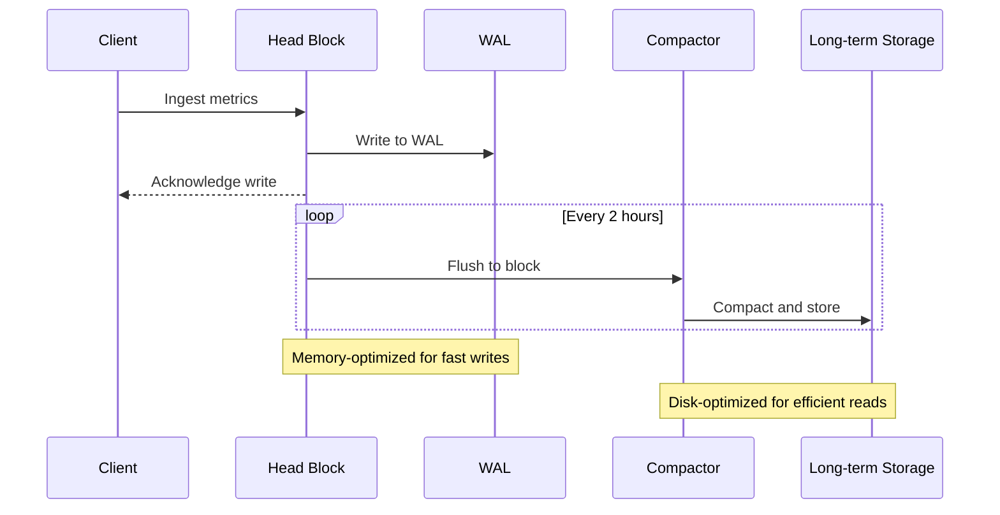

# Telemetry Theory Deep-Dive

## Introduction

Modern observability platforms face a fundamental tension between collected data fidelity and system scalability. This chapter examines the theoretical foundations of telemetry collection, with specific focus on the mathematical and architectural principles that govern the behavior of large-scale observability systems.

## Cardinality Fundamentals

Cardinality represents the number of unique metric time series or events generated by a monitoring system. It is a critical factor in system performance and cost, particularly in highly dimensional environments like Kubernetes.

### The Cardinality Explosion Problem

Dimensional metrics provide powerful query flexibility but can lead to exponential growth in storage and computational requirements. The relationship can be expressed as:

```
Total series = metrics × cardinality₁ × cardinality₂ × ... × cardinalityₙ
```

For example, a single metric with three label dimensions (service, instance, endpoint) having 10, 100, and 50 unique values respectively would generate:

```
1 × 10 × 100 × 50 = 50,000 unique time series
```

This multiplication effect, known as the "cardinality explosion," is frequently the root cause of observability system performance degradation.

## Data Encoding and Compression

### Gorilla XOR Encoding

The Gorilla time series compression algorithm (Facebook, 2015) revolutionized time series storage efficiency through XOR-based delta encoding. The algorithm achieves 10-14× compression by exploiting the temporal locality of metrics data.

```go
// Gorilla XOR Encoding Micro-Benchmark
package compression

import (
	"testing"
	"time"
	"math/rand"
)

// Point represents a single time series data point
type Point struct {
	Timestamp int64
	Value     float64
}

// XOREncoder implements Gorilla's compression algorithm
type XOREncoder struct {
	prevTimestamp int64
	prevValue     float64
	// Additional fields for bit buffer management omitted for brevity
}

func (e *XOREncoder) Encode(p Point) {
	// Encode timestamp delta-of-delta
	deltaT := p.Timestamp - e.prevTimestamp
	
	// XOR the value with the previous value if the XOR is smaller
	xorValue := math.Float64bits(p.Value) ^ math.Float64bits(e.prevValue)
	
	// Store the compressed representation
	// Implementation details omitted for brevity
	
	e.prevTimestamp = p.Timestamp
	e.prevValue = p.Value
}

func BenchmarkXOREncode(b *testing.B) {
	encoder := &XOREncoder{}
	rnd := rand.New(rand.NewSource(time.Now().UnixNano()))
	
	// Generate sample data with slight variations (typical for metrics)
	base := float64(100)
	timestamp := time.Now().Unix()
	
	points := make([]Point, b.N)
	for i := 0; i < b.N; i++ {
		points[i] = Point{
			Timestamp: timestamp + int64(i),
			Value:     base + rnd.Float64()*0.1, // Small variations
		}
	}
	
	b.ResetTimer()
	for i := 0; i < b.N; i++ {
		encoder.Encode(points[i])
	}
}
```

This benchmark demonstrates the high-performance encoding algorithm used by time series databases like Prometheus, VictoriaMetrics, and New Relic's dimensional metric store.

### Write-Ahead Log Architecture

Time series databases typically employ a Write-Ahead Log (WAL) architecture to ensure durability while maintaining high ingest rates.



The WAL architecture provides:
1. Durability guarantees (data can be recovered after crashes)
2. High write throughput (batch processing)
3. Efficient compaction and retrieval

## Statistical Sampling Theory

### Sampling Error Bounds

When employing sampling techniques to reduce data volume, the error bounds can be estimated using the standard error formula:

```
Sampling error = 1 / √n
```

Where n is the sample size.

This formula demonstrates why increasing sample sizes yields diminishing returns. For example:
- Sample size 100: Error ≈ 10%
- Sample size 10,000: Error ≈ 1%
- Sample size 1,000,000: Error ≈ 0.1%

The practical implication is that beyond a certain threshold, increasing sampling rates provides minimal additional accuracy while significantly increasing storage and computational costs.

### Sampling Strategies in Observability

| Strategy | Description | Ideal Use Case | Trade-offs |
|----------|-------------|----------------|------------|
| Random Sampling | Select events at a fixed probability | High-volume, homogeneous data | May miss rare anomalies |
| Tail-based Sampling | Keep events exceeding thresholds | Performance monitoring | Requires buffering |
| Stratified Sampling | Sample different groups at different rates | Heterogeneous traffic patterns | Configuration complexity |
| Priority Sampling | Assign importance weights and sample accordingly | Mixed criticality services | Requires context knowledge |

## Retention Strategies and Data Lifecycle

Effective observability requires balancing resolution against retention. A common pattern is to implement tiered aggregation:

| Retention Period | Resolution | Storage Type | Query Use Case |
|------------------|------------|-------------|---------------|
| 0-2 hours | Raw data | Memory | Real-time debugging |
| 2-24 hours | 10s aggregation | Local disk | Incident response |
| 1-7 days | 1min aggregation | Hot storage | Performance analysis |
| 7-30 days | 5min aggregation | Warm storage | Trend detection |
| 30+ days | 1hour aggregation | Cold storage | Capacity planning |

This tiered approach can reduce storage requirements by orders of magnitude while preserving query capabilities appropriate to each time horizon.

## Practical Implementation

In subsequent chapters, we'll explore how these theoretical foundations manifest in practical implementations across the New Relic platform and other observability solutions. Key points to remember:

1. Cardinality management is the most critical factor in system scalability
2. Compression techniques dramatically impact storage efficiency
3. Strategic sampling can provide accurate insights with reduced overhead
4. Tiered retention aligns storage costs with data value over time