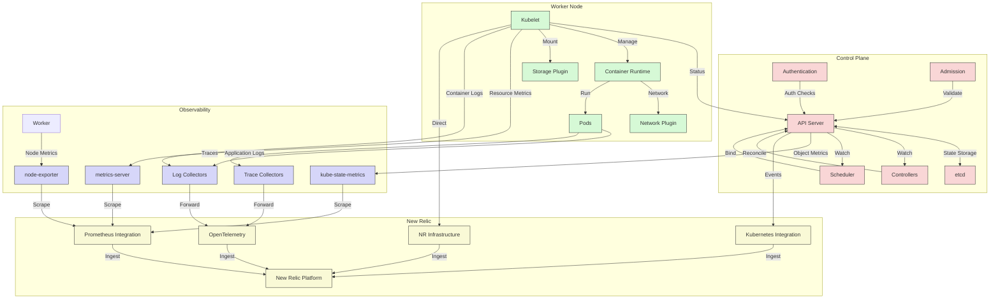
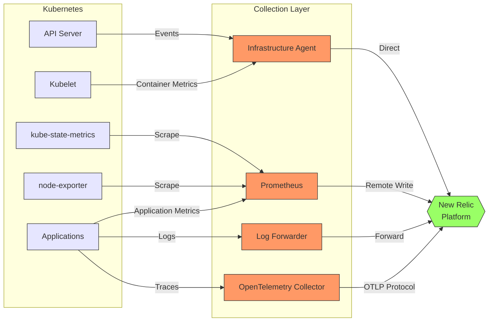

# Kubernetes Signal Taxonomy

## Executive Summary

Kubernetes produces a vast ecosystem of observability signals, from low-level infrastructure metrics to high-level application telemetry. This chapter provides a comprehensive taxonomy of these signals, mapping them to their sources and explaining their significance for monitoring modern containerized environments. Understanding this signal landscape is essential for designing effective observability strategies with New Relic and OpenTelemetry.

The complexity of Kubernetes environments creates monitoring challenges that require a structured approach to signal collection and analysis. By categorizing signals by type, source, and collection method, organizations can implement monitoring strategies that balance coverage with resource efficiency. This taxonomy serves as a foundation for subsequent chapters, establishing a common language for discussing observability patterns throughout the book.

## Signal Categories

Kubernetes observability signals can be classified into six primary categories, each providing different perspectives on system behavior:

```mermaid
flowchart TD
    K[Kubernetes] --> M[Metrics]
    K --> E[Events]
    K --> L[Logs]
    K --> T[Traces]
    K --> S[State]
    K --> C[Configuration]
    
    subgraph "Metrics"
        M1[Resource Utilization]
        M2[Application Performance]
        M3[Control Plane Health]
        M4[Network Traffic]
        M5[Storage Performance]
    end
    
    subgraph "Events"
        E1[Lifecycle Events]
        E2[Error Events]
        E3[Scaling Events]
        E4[Update Events]
        E5[Security Events]
    end
    
    subgraph "Logs"
        L1[Application Logs]
        L2[System Logs]
        L3[Control Plane Logs]
        L4[Audit Logs]
        L5[Security Logs]
    end
    
    subgraph "Traces"
        T1[Service-to-Service]
        T2[API Request Flows]
        T3[Database Queries]
        T4[External Calls]
    end
    
    subgraph "State"
        S1[Object Status]
        S2[Health Checks]
        S3[Conditions]
        S4[Phase]
    end
    
    subgraph "Configuration"
        C1[Resource Definitions]
        C2[Spec Changes]
        C3[Annotations]
        C4[Labels]
    end
    
    M --> M1 & M2 & M3 & M4 & M5
    E --> E1 & E2 & E3 & E4 & E5
    L --> L1 & L2 & L3 & L4 & L5
    T --> T1 & T2 & T3 & T4
    S --> S1 & S2 & S3 & S4
    C --> C1 & C2 & C3 & C4
    
    classDef category fill:#f96,stroke:#333,stroke-width:2px
    classDef subcategory fill:#9cf,stroke:#333,stroke-width:1px
    
    class K category
    class M,E,L,T,S,C category
    class M1,M2,M3,M4,M5,E1,E2,E3,E4,E5,L1,L2,L3,L4,L5,T1,T2,T3,T4,S1,S2,S3,S4,C1,C2,C3,C4 subcategory
```



### 1. Metrics

Metrics provide numerical measurements of system and application performance, typically collected at regular intervals:

- **Resource Metrics**: CPU, memory, disk, and network utilization
- **Control Plane Metrics**: Performance and health of Kubernetes components
- **State Metrics**: Counts and status of Kubernetes objects
- **Application Metrics**: Custom metrics from workloads
- **Service-Level Indicators**: Key performance indicators derived from metrics

### 2. Events

Events represent discrete occurrences in the Kubernetes cluster:

- **Lifecycle Events**: Creation, modification, and deletion of resources
- **Error Events**: Failures, crashes, and exceptions
- **Scaling Events**: Pod scaling, autoscaling, and resource adjustments
- **System Events**: Node conditions, resource pressure, and capacity changes
- **Security Events**: Authentication, authorization, and policy violations

### 3. Logs

Logs provide detailed textual records of component activity:

- **Application Logs**: Output from containerized applications
- **System Logs**: Node operating system and kernel logs
- **Control Plane Logs**: Kubernetes component detailed logs
- **Audit Logs**: Record of API server requests and actions
- **Security Logs**: Authentication attempts, authorization decisions

### 4. Traces

Traces track the path of requests through distributed systems:

- **Service-to-Service**: Communication between microservices
- **API Request Flows**: External requests through ingress to backend services
- **Database Interactions**: Database queries and transactions
- **External Service Calls**: Communication with systems outside the cluster

### 5. State

State signals represent the current condition of Kubernetes objects:

- **Object Status**: Current observed state of resources
- **Health Checks**: Liveness, readiness, and startup probe results
- **Conditions**: Standard status conditions (Ready, Available, etc.)
- **Phase**: Lifecycle phase of pods and other resources

### 6. Configuration

Configuration signals capture the intended state of the system:

- **Resource Definitions**: YAML/JSON specifications of Kubernetes objects
- **Spec Changes**: Modifications to desired state
- **Annotations**: Metadata for tools and extensions
- **Labels**: Identifying metadata for resources

## Object-to-Signal Mapping

The following table maps Kubernetes objects to their primary observable signals and recommended collection methods:

| Kubernetes Object | Metrics | Events | Logs | Traces | Recommended Collection |
|-------------------|---------|--------|------|--------|------------------------|
| **Pod** | CPU/memory usage, network I/O, disk I/O | Creation, deletion, OOM, eviction | Container logs, init container logs | Service-to-service communication | kube-state-metrics, kubelet metrics |
| **Node** | CPU/memory usage, disk space, network throughput | NodeNotReady, pressure conditions | kubelet, kernel, system logs | N/A | node-exporter, infrastructure agent |
| **Deployment** | Replica count, available pods, update status | ScalingReplicaSet, FailedCreate | Controller logs | N/A | kube-state-metrics |
| **ReplicaSet** | Current/desired replicas, ready pods | FailedCreate, SuccessfulCreate | Controller logs | N/A | kube-state-metrics |
| **Service** | Connection count, request rate, error rate | EndpointsUpdated | kube-proxy logs | Incoming/outgoing requests | service monitors, network policies |
| **Ingress** | Request rate, latency, error rate, SSL expiry | CREATE, UPDATE, DELETE | Ingress controller logs | External-to-service communication | ingress controller metrics |
| **PersistentVolume** | Capacity, used space, I/O metrics | FailedMount, FailedRecycle | Volume provisioner logs | N/A | storage class metrics, PV/PVC metrics |
| **Namespace** | Aggregate resource usage, object counts | NamespaceNotFound | N/A | N/A | kube-state-metrics, resource quotas |
| **API Server** | Request rate, latency, etcd interaction | ServiceUnavailable, TooManyRequests | API server logs | Request traces | control plane metrics |
| **Scheduler** | Scheduling rate, latency, failures | FailedScheduling, Preempted | Scheduler logs | Scheduling decisions | control plane metrics |
| **etcd** | Transaction rate, latency, DB size | LeaderElection, DataCorruption | etcd logs | N/A | etcd metrics |
| **ConfigMap/Secret** | Reference count, size | CREATE, UPDATE, DELETE | N/A | N/A | kube-state-metrics |
| **Job/CronJob** | Completion time, success rate, active count | JobFailed, JobComplete | Job logs | Task execution | kube-state-metrics, job controller |
| **HPA** | Current/target metrics, scale events | ScalingReplicaSet | Controller logs | N/A | kube-state-metrics, metrics-server |

## Signal Flow Architecture

Understanding signal flow through the Kubernetes architecture is essential for effective monitoring. The following diagram illustrates how different signal types propagate through the Kubernetes components:



## Signal Collection Strategies

### 1. Control Plane Monitoring

Control plane components expose metrics that are critical for understanding cluster health and performance:

| Component | Key Metrics | Cardinality Concerns | Collection Method |
|-----------|------------|---------------------|-------------------|
| **API Server** | `apiserver_request_total`, `apiserver_request_duration_seconds`, `apiserver_client_certificate_expiration_seconds` | High cardinality on resource and verb labels | Prometheus /metrics endpoint |
| **Controller Manager** | `workqueue_depth`, `workqueue_adds_total`, `workqueue_queue_duration_seconds` | Medium cardinality on queue names | Prometheus /metrics endpoint |
| **Scheduler** | `scheduler_e2e_scheduling_duration_seconds`, `scheduler_pending_pods`, `scheduler_pod_scheduling_attempts` | Low cardinality | Prometheus /metrics endpoint |
| **etcd** | `etcd_server_leader_changes_seen_total`, `etcd_mvcc_db_total_size_in_bytes`, `etcd_network_client_grpc_received_bytes_total` | Low cardinality | Prometheus /metrics endpoint |
| **kubelet** | `kubelet_runtime_operations_duration_seconds`, `kubelet_pod_worker_duration_seconds`, `kubelet_cgroup_manager_duration_seconds` | High cardinality on pod and namespace | cAdvisor /metrics endpoint |

### 2. Workload Monitoring

Workload metrics provide insights into application performance and resource utilization:

| Resource | Key Metrics | Cardinality Concerns | Collection Method |
|----------|------------|---------------------|-------------------|
| **Node** | `node_cpu_seconds_total`, `node_memory_MemAvailable_bytes`, `node_filesystem_avail_bytes` | Medium cardinality on CPU, device | node-exporter |
| **Pod** | `kube_pod_container_resource_requests/limits`, `container_cpu_usage_seconds_total`, `container_memory_working_set_bytes` | Very high cardinality on pod, container, namespace | cAdvisor, kube-state-metrics |
| **Service** | `kube_service_info`, `kube_service_spec_type`, custom app metrics | Medium cardinality on service, namespace | kube-state-metrics, Prometheus ServiceMonitors |
| **Deployment** | `kube_deployment_spec_replicas`, `kube_deployment_status_replicas_available`, `kube_deployment_status_condition` | Medium cardinality on deployment, namespace | kube-state-metrics |
| **StatefulSet** | `kube_statefulset_replicas`, `kube_statefulset_status_replicas_ready`, `kube_statefulset_status_observed_generation` | Medium cardinality on statefulset, namespace | kube-state-metrics |

### 3. State Monitoring

State metrics provide insights into the operational status of Kubernetes objects:

| Metric Type | Example Metrics | Value | Collection Method |
|-------------|----------------|-------|-------------------|
| **Phase** | `kube_pod_status_phase` | Running, Pending, Failed, Succeeded, Unknown | kube-state-metrics |
| **Conditions** | `kube_node_status_condition` | Ready, DiskPressure, MemoryPressure, NetworkUnavailable | kube-state-metrics |
| **Readiness** | `kube_pod_status_ready` | True, False, Unknown | kube-state-metrics |
| **Generation** | `kube_deployment_metadata_generation` | Integer value | kube-state-metrics |
| **Status Reason** | `kube_pod_status_reason` | Evicted, NodeLost, UnexpectedAdmissionError | kube-state-metrics |

### 4. Event Monitoring

Kubernetes events provide a timeline of important changes and activities in the cluster:

| Event Type | Examples | Importance | Collection Method |
|------------|----------|------------|-------------------|
| **Warning Events** | OOMKilled, FailedScheduling, FailedMount | High - Indicate immediate issues | Kubernetes API, event exporter |
| **Normal Events** | Created, Started, Killing, Scheduled | Medium - Informational state changes | Kubernetes API, event exporter |
| **Scaling Events** | ScalingReplicaSet, HorizontalPodAutoscaler | Medium - Resource adjustments | Kubernetes API, event exporter |
| **Lifecycle Events** | SuccessfulCreate, SuccessfulDelete | Low - Expected operations | Kubernetes API, event exporter |
| **System Events** | NodeNotReady, NodeReady | High - Infrastructure issues | Kubernetes API, event exporter |

## Telemetry Collection Components

Kubernetes environments typically use several specialized components to collect and process telemetry:

### Metrics Collection

1. **kube-state-metrics**
   - Purpose: Generates metrics about Kubernetes object state
   - Focus: Deployments, pods, nodes, etc. counts and status
   - Data Type: Prometheus-formatted metrics
   - Deployment: Single instance Deployment

2. **metrics-server**
   - Purpose: Collects resource metrics from kubelets
   - Focus: Pod and node CPU/memory usage
   - Data Type: Metrics API format (used by HPA)
   - Deployment: Single instance Deployment

3. **node-exporter**
   - Purpose: Collects hardware and OS metrics from nodes
   - Focus: CPU, memory, disk, network at node level
   - Data Type: Prometheus-formatted metrics
   - Deployment: DaemonSet (one per node)

4. **Prometheus**
   - Purpose: Scrapes, stores, and queries metrics
   - Focus: Time-series metrics
   - Data Type: Prometheus-formatted metrics
   - Deployment: Statefulset with persistent storage

### Log Collection

1. **Fluent Bit / Fluentd**
   - Purpose: Collects, processes, and forwards logs
   - Focus: Container logs from pods
   - Data Type: Structured or unstructured logs
   - Deployment: DaemonSet (one per node)

2. **Vector / Logstash**
   - Purpose: Advanced log processing and routing
   - Focus: Log transformation, filtering, enrichment
   - Data Type: Structured logs
   - Deployment: DaemonSet or Deployment

3. **Loki**
   - Purpose: Log aggregation and storage
   - Focus: Log querying and retention
   - Data Type: Labeled logs
   - Deployment: Deployment or Statefulset

### Trace Collection

1. **OpenTelemetry Collector**
   - Purpose: Collects, processes, and exports traces
   - Focus: Distributed trace data
   - Data Type: OTLP format
   - Deployment: DaemonSet or Deployment

2. **Jaeger Agent**
   - Purpose: Collects and forwards trace data
   - Focus: Application traces
   - Data Type: Jaeger format
   - Deployment: DaemonSet or Sidecar

## Signal Coverage Matrix

Implementing comprehensive Kubernetes monitoring requires balancing coverage with resource consumption. The following matrix provides a tiered approach to signal collection:

| Signal Category | Essential (Tier 1) | Standard (Tier 2) | Comprehensive (Tier 3) |
|-----------------|-------------------|-------------------|------------------------|
| **Control Plane Metrics** | API Server health<br>etcd health<br>Controller Manager queues | API Server detailed metrics<br>Scheduler metrics<br>etcd detailed metrics | All control plane components<br>Detailed queue metrics<br>API request breakdowns |
| **Node Metrics** | CPU usage<br>Memory usage<br>Disk usage | Network metrics<br>Load averages<br>Filesystem details | Detailed syscalls<br>Process metrics<br>Hardware stats |
| **Pod Metrics** | CPU/memory usage<br>Status/phase<br>Restarts | Network I/O<br>Resource requests/limits<br>Probe success | Volume metrics<br>Startup timing<br>Init containers |
| **Workload Metrics** | Replica counts<br>Available pods<br>Failed pods | Rolling update status<br>Generation delays<br>Scaling events | StatefulSet ordinals<br>Job completion times<br>Custom resource statuses |
| **Network Metrics** | Service availability<br>Basic connectivity | Ingress request rates<br>Service latency<br>DNS resolution | Detailed traffic patterns<br>TCP connection states<br>Network policies |
| **Storage Metrics** | PV/PVC status<br>Available space | I/O operations<br>Latency<br>Throughput | Volume queue metrics<br>Provisioner metrics<br>CSI detailed metrics |
| **Application Metrics** | Error rates<br>Request counts<br>Basic latency | Detailed latency<br>Circuit breaker status<br>Queue depths | Business metrics<br>Custom SLIs<br>Dependency health |
| **Logs** | Error logs<br>Warning logs<br>Crash logs | Info logs<br>Control plane logs<br>System logs | Debug logs<br>Audit logs<br>Security logs |
| **Events** | Warning events<br>Error events | Normal events<br>Scaling events | All events<br>Detailed annotations |
| **Traces** | Critical paths<br>Error traces | Service mesh traces<br>Database calls | 100% sampling<br>Custom attributes |

## New Relic Signal Integration

New Relic integrates with Kubernetes signals through several collection mechanisms:

1. **Infrastructure Agent**
   - Deployment: DaemonSet
   - Collects: Node metrics, container metrics, Kubernetes events
   - Integration: Direct reporting to New Relic

2. **Prometheus Integration**
   - Deployment: Remote write or OpenTelemetry collector
   - Collects: kube-state-metrics, node-exporter, application metrics
   - Integration: Prometheus remote write or OTLP

3. **OpenTelemetry Collector**
   - Deployment: DaemonSet, Deployment, or Sidecar
   - Collects: Metrics, logs, and traces
   - Integration: OTLP to New Relic

4. **Kubernetes Integration**
   - Deployment: Infrastructure agent
   - Collects: Kubernetes resource metrics and events
   - Integration: Direct reporting to New Relic



## Signal Collection Configuration Examples

### Audit Log Configuration

Audit logs provide detailed records of all API server requests, essential for security and compliance monitoring.

```yaml
# audit-policy.yaml
apiVersion: audit.k8s.io/v1
kind: Policy
rules:
  # Log pod changes at RequestResponse level
  - level: RequestResponse
    resources:
    - group: ""
      resources: ["pods"]
  
  # Log configmaps and secrets at Metadata level
  - level: Metadata
    resources:
    - group: "" 
      resources: ["secrets", "configmaps"]
  
  # Log authentication at the Metadata level
  - level: Metadata
    resources:
    - group: "authentication.k8s.io"
      resources: ["*"]
  
  # Everything else at the Request level
  - level: Request
    resources:
    - group: "" 
      resources: ["*"]
```

### Prometheus ServiceMonitor Example

ServiceMonitors define how Prometheus should scrape application metrics.

```yaml
# service-monitor.yaml
apiVersion: monitoring.coreos.com/v1
kind: ServiceMonitor
metadata:
  name: example-app
  namespace: monitoring
spec:
  selector:
    matchLabels:
      app: example-app
  endpoints:
  - port: metrics
    interval: 15s
    path: /metrics
    scheme: http
    relabelings:
    - sourceLabels: [__meta_kubernetes_pod_label_app]
      targetLabel: application
    - sourceLabels: [__meta_kubernetes_namespace]
      targetLabel: namespace
  namespaceSelector:
    matchNames:
    - default
    - production
```

### OpenTelemetry Collector Configuration

```yaml
# otel-collector.yaml
receivers:
  otlp:
    protocols:
      grpc:
        endpoint: 0.0.0.0:4317
      http:
        endpoint: 0.0.0.0:4318
  
  prometheus:
    config:
      scrape_configs:
        - job_name: 'kubernetes-pods'
          kubernetes_sd_configs:
            - role: pod
          relabel_configs:
            - source_labels: [__meta_kubernetes_pod_annotation_prometheus_io_scrape]
              action: keep
              regex: true

processors:
  batch:
    send_batch_size: 10000
    timeout: 10s
  
  resource:
    attributes:
      - action: insert
        key: k8s.cluster.name
        value: "production-east"
  
  k8sattributes:
    auth_type: "serviceAccount"
    passthrough: false
    extract:
      metadata:
        - k8s.pod.name
        - k8s.namespace.name
        - k8s.deployment.name
        - k8s.node.name

exporters:
  otlp:
    endpoint: https://otlp.nr-data.net:4317
    headers:
      api-key: "${NEW_RELIC_LICENSE_KEY}"

service:
  pipelines:
    metrics:
      receivers: [otlp, prometheus]
      processors: [batch, resource, k8sattributes]
      exporters: [otlp]
    traces:
      receivers: [otlp]
      processors: [batch, resource, k8sattributes]
      exporters: [otlp]
    logs:
      receivers: [otlp]
      processors: [batch, resource, k8sattributes]
      exporters: [otlp]
```

## Advanced Signal Considerations

### Signal Correlation

Correlating signals across different telemetry types provides deeper insights:

1. **Labels/Tags Consistency**
   - Use consistent labels across metrics, logs, and traces
   - Include Kubernetes metadata (namespace, pod, deployment) in all signals
   - Establish naming conventions for custom attributes

2. **Trace Context**
   - Propagate trace IDs through service calls
   - Include trace IDs in relevant log entries
   - Link metrics to traces using exemplars

3. **Time Synchronization**
   - Ensure accurate timestamps across all signals
   - Consider clock skew between nodes
   - Use monotonic clocks for duration measurements

### Signal Transformation

Transforming signals before storage can improve usability and efficiency:

1. **Aggregation**
   - Pre-aggregate high-cardinality metrics
   - Use histogram buckets for latency distributions
   - Consolidate similar log patterns

2. **Enrichment**
   - Add Kubernetes context to application signals
   - Attach environment and team metadata
   - Include service ownership information

3. **Filtering**
   - Remove debug logs in production
   - Filter out high-volume, low-value metrics
   - Exclude sensitive information from traces

## Planning Signal Collection

When designing a Kubernetes monitoring strategy with New Relic, follow this tiered approach:

1. **Foundation Layer** (Start here)
   - Control plane health monitoring
   - Node resource utilization
   - Pod status and resource usage
   - Critical application metrics

2. **Operational Layer**
   - Workload-specific metrics
   - Service-level indicators
   - Error logs and events
   - Basic tracing for critical paths

3. **Optimization Layer**
   - Detailed performance metrics
   - Complete distributed tracing
   - Comprehensive logging
   - Custom business metrics

This layered approach ensures comprehensive coverage while managing complexity, resource utilization, and data volume.

## Conclusion

The Kubernetes signal taxonomy provides a framework for understanding the rich telemetry landscape of containerized environments. By mapping signals to their sources and understanding their collection methods, organizations can implement monitoring strategies that balance coverage with resource efficiency.

As we explore more advanced topics in subsequent chapters, this taxonomy will serve as a foundation for discussing observability patterns, data reduction techniques, and query optimization. The structured approach to signal categorization ensures that monitoring implementations can evolve alongside Kubernetes deployments, providing consistent visibility regardless of scale or complexity.

---

**Next Chapter**: [Cardinality Matrix](./03_Cardinality_Matrix.md)