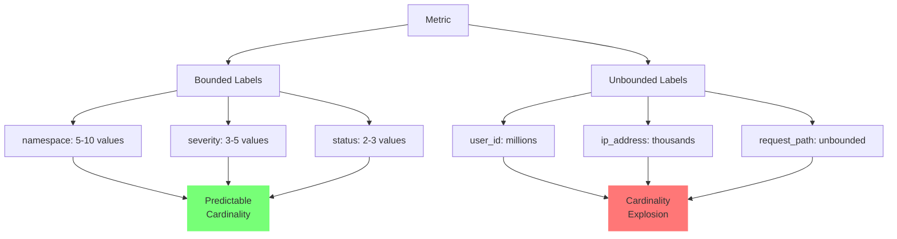

# Anti-Patterns & Cardinality Matrix

## Introduction

Cardinality explosion represents one of the most significant challenges in modern observability systems. This chapter examines common anti-patterns that lead to unmanageable cardinality and provides quantitative models for predicting and controlling the growth of unique time series in production environments.

## Understanding Cardinality Growth

Cardinality in observability refers to the number of unique time series or unique combinations of dimension values. While dimensions add analytical power, each new dimension multiplies rather than adds to the overall series count.

### The Multiplier Effect

The cardinality of a metric is determined by the product of the cardinalities of its labels:

```
Total series = metrics_count × cardinality(label₁) × cardinality(label₂) × ... × cardinality(labelₙ)
```

This multiplicative relationship results in exponential growth that can rapidly overwhelm observability systems.

## Cardinality Impact Matrix

The following table illustrates how different label combinations affect the total number of time series for a single metric:

<!-- TB-4A: Label Multiplier Effects -->

| Scenario | Base Labels | Additional Labels | Total Labels | Unique Values Per Label | Total Time Series | Memory Impact |
|----------|-------------|-------------------|--------------|-------------------------|-------------------|---------------|
| Minimal | cluster, namespace | - | 2 | 10 | 10² = 100 | ~120 KB |
| Standard | cluster, namespace, pod | - | 3 | 10 | 10³ = 1,000 | ~1.2 MB |
| Enhanced | cluster, namespace, pod, container | - | 4 | 10 | 10⁴ = 10,000 | ~12 MB |
| High-Cardinality | cluster, namespace, pod, container | user_id | 5 | 10 | 10⁵ = 100,000 | ~120 MB |
| Problematic | cluster, namespace, pod, container | user_id, session_id | 6 | 10 | 10⁶ = 1,000,000 | ~1.2 GB |
| Critical | cluster, namespace, pod, container | user_id, session_id, request_id | 7 | 10 | 10⁷ = 10,000,000 | ~12 GB |
| System Failure | cluster, namespace, pod, container | user_id, session_id, request_id, path | 8 | 10 | 10⁸ = 100,000,000 | ~120 GB |

Note: Memory impact is estimated based on approximately 1.2 KB per time series in a typical time series database.

## Memory Footprint Comparison

Different observability systems handle cardinality with varying efficiency. The table below compares memory usage across platforms for 1 million unique time series:

<!-- TB-4B: Memory Footprint per 1M Samples -->

| System | Memory Per 1M Series | Compression Ratio | Heap Requirement | Notes |
|--------|----------------------|-------------------|------------------|-------|
| Prometheus | 1.2 GB | 1:1 | 3-4 GB | In-memory TSDB with basic compression |
| VictoriaMetrics | 0.4 GB | 3:1 | 1-2 GB | Advanced compression algorithms |
| New Relic Dimensional Metrics | 0.6 GB | 2:1 | 2-3 GB | Cloud-optimized storage |
| New Relic NRDB (Events) | 2.5 GB | 0.5:1 | 6-8 GB | Higher overhead for flexible query |
| Datadog | 0.8 GB | 1.5:1 | 2-3 GB | Custom storage engine |
| Influx OSS | 1.8 GB | 0.7:1 | 4-5 GB | TSM engine overhead |
| Influx IOx | 0.7 GB | 1.7:1 | 2-3 GB | Newer columnar storage format |

## Common Anti-Patterns

### 1. High-Cardinality Labels

Avoid adding these high-cardinality dimensions to metrics:

- User IDs
- Session IDs
- Request/Transaction IDs
- Email addresses
- IP addresses
- Full URLs or paths with parameters
- Timestamps as label values

### 2. Unbounded Label Values

Labels with unbounded possible values create unpredictable cardinality:



### 3. Label Value Explosion

Even with proper labels, inconsistent formatting can cause unnecessary cardinality growth:

| Anti-Pattern | Issue | Better Approach |
|--------------|-------|----------------|
| Dynamic label names | `metric{region="us-west-2"}` vs `metric{zone="us-west-2"}` | Standardize on label names |
| Inconsistent casing | `metric{status="success"}` vs `metric{status="SUCCESS"}` | Normalize to lowercase |
| Trailing/leading spaces | `metric{service=" api "}` | Trim whitespace |
| Inconsistent formatting | `metric{latency="100ms"}` vs `metric{latency="0.1s"}` | Standardize units and formats |

### 4. Label Value Concatenation

Combining multiple pieces of information in a single label creates unnecessary uniqueness:

```
# Anti-pattern
http_requests_total{endpoint="/api/users/v2/createUser?source=mobile&region=eu"}

# Better approach
http_requests_total{
    path="/api/users", 
    version="v2", 
    action="createUser", 
    source="mobile", 
    region="eu"
}
```

## Cardinality Calculation Formula

For estimating total cardinality accurately:

<!-- EQ-4A: Series Calculation -->

$$Series = Metrics \times \prod_{i=1}^{n} cardinality(label_i)$$

Where:
- Metrics is the count of metric names
- $\prod$ represents the product of all label cardinalities
- $cardinality(label_i)$ is the number of unique values for label i

## Practical Cardinality Management

### 1. Label Allowlists

Implement strict allowlists for metric dimensions:

```yaml
metric_relabel_configs:
  - source_labels: [__name__]
    regex: 'http_requests_total'
    action: keep
  - source_labels: [pod, namespace, container]
    regex: '.+'
    action: keep
  # Drop all other labels
  - regex: '(pod|namespace|container|job|instance)'
    action: labeldrop
```

### 2. Strategic Label Grouping

Instead of high-cardinality dimensions, use bucketing or grouping:

| High Cardinality | Transformed |
|------------------|-------------|
| `user_id="u123456"` | `user_type="premium"` |
| `response_time_ms="1237"` | `response_time_bucket="1000_2000"` |
| `url="/user/12345/profile"` | `endpoint="/user/{id}/profile"` |

### 3. Separate Patterns for Metrics vs. Logs/Traces

| Data Type | Cardinality Approach |
|-----------|----------------------|
| Metrics | Low cardinality, pre-aggregated |
| Logs | High cardinality, sampled |
| Traces | High cardinality, heavily sampled |

By keeping high-cardinality dimensions in logs and traces rather than metrics, you can maintain analytical capabilities while controlling storage and processing costs.

## Implementation Recommendations

1. **Instrumentation Review Process**: Establish governance for instrumenting new services, requiring cardinality impact analysis.

2. **Cardinality Monitoring**: Implement monitors on series growth:

```nrql
SELECT cardinality(metricName) FROM Metric FACET metricName LIMIT 100
```

3. **Emergency Circuit Breakers**: Prepare runbooks for cardinality explosions:

```yaml
# Example OTel Collector circuit breaker
processors:
  filter:
    metrics:
      include:
        match_type: strict
        metric_names:
          - allowed_metric_1
          - allowed_metric_2
```

4. **Regular Cardinality Audits**: Schedule monthly reviews of top cardinality contributors.

## Conclusion

Cardinality management requires deliberate design and ongoing governance. By understanding the multiplicative nature of dimensions and implementing proper controls, organizations can maintain the analytical power of dimensional metrics while avoiding the performance and cost impacts of uncontrolled cardinality growth.

The next chapter explores data-gravity considerations and egress economics, providing further guidance on optimizing observability data placement and movement.
