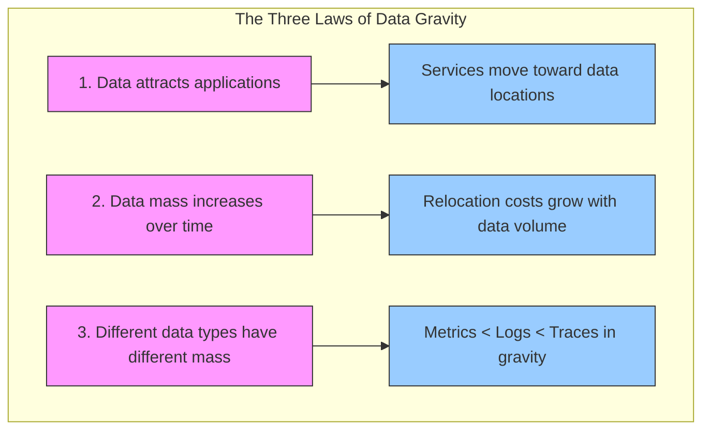
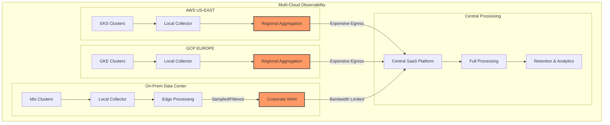
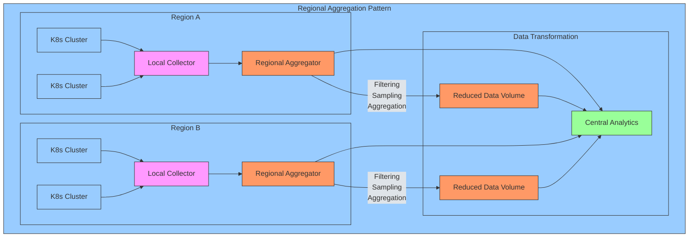
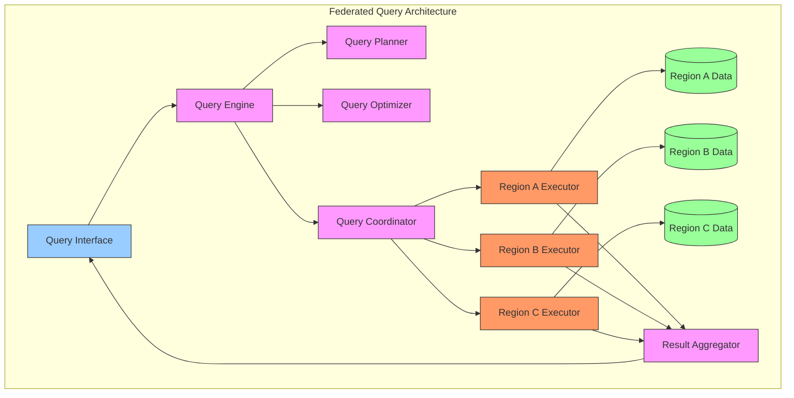
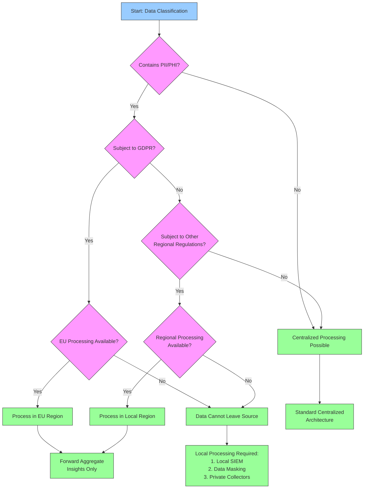
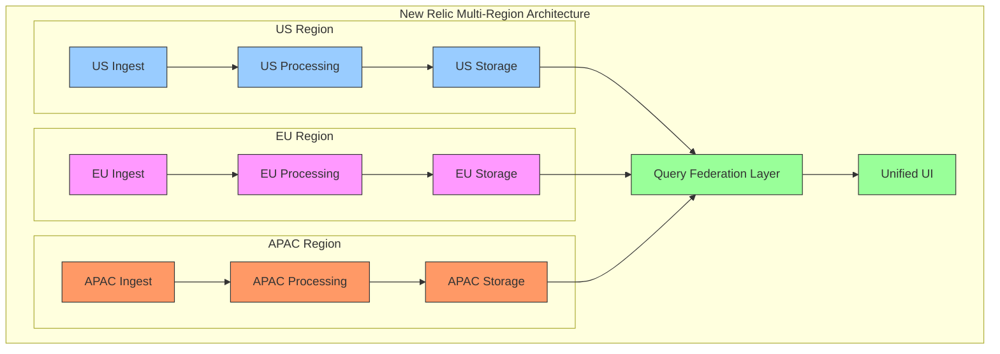

# Data Gravity & Egress Economics

## Executive Summary

In distributed observability architectures, the concept of "data gravity" plays a critical role in system design. This chapter explores how data gravity—the tendency for services and applications to move toward where data resides—affects Kubernetes observability strategies. We examine the economic, performance, and regulatory factors that determine optimal telemetry processing and storage locations, with particular focus on multi-cloud and hybrid environments. By understanding data gravity principles, architects can design more cost-effective, performant, and compliant observability solutions.

As organizations distribute their infrastructure across multiple clouds, regions, and on-premises environments, the traditional centralized monitoring approach faces growing challenges. Cloud egress costs can quickly become a dominant expense in observability budgets, while regulatory requirements like GDPR may impose strict data movement limitations. This chapter provides a framework for making strategic decisions about telemetry routing, processing, and storage locations to optimize for cost, performance, and compliance.

## Data Gravity Fundamentals

Data gravity operates by three fundamental principles in observability architectures:



### Data Gravity in Multi-Environment Architectures



## Egress Economics

Cloud providers typically charge for data leaving their infrastructure (egress), but not for data entering (ingress). This asymmetrical pricing model creates economic incentives that significantly impact observability architecture decisions.

### Cloud Provider Egress Cost Comparison

| Provider | Intra-Region | Inter-Region | Internet Egress | Notes |
|----------|--------------|--------------|----------------|-------|
| AWS | Free | $0.02/GB | $0.08-0.09/GB | First 100TB, tiered pricing |
| GCP | Free | $0.01/GB | $0.08-0.12/GB | Varies by destination |
| Azure | Free | $0.02/GB | $0.05-0.08/GB | Zone redundancy included |
| Digital Ocean | Free | N/A | $0.01/GB | Flat pricing |
| Oracle Cloud | Free | $0.01/GB | $0.0085-0.085/GB | Tiered pricing |
| New Relic SaaS | N/A | N/A | Free | Ingest-based pricing only |

### Egress Cost Calculation Model

```
Monthly Egress Cost = Daily Telemetry Volume × 30 × Compression Ratio × Egress Rate

Where:
- Daily Telemetry Volume = Metrics + Logs + Traces (GB/day)
- Compression Ratio = Compressed size / Raw size (typically 0.1-0.2)
- Egress Rate = Cost per GB from cloud provider
```

For a typical medium-sized Kubernetes cluster:

```
Given:
- 500 nodes generating 25GB/day of raw telemetry
- Compression ratio of 0.15 (85% reduction)
- AWS egress cost of $0.09/GB

Monthly Egress Cost = 25GB × 30 days × 0.15 × $0.09/GB = $10.13/day = $304/month
```

## Architectural Patterns for Data Gravity

Several architectural patterns have emerged to address data gravity challenges in observability:

### Regional Aggregation Pattern



Deploy collectors and aggregators in each cloud region to perform initial filtering, sampling, and aggregation before forwarding data to a central location. This approach reduces egress costs and improves data locality.

### OTel Collector Regional Configuration Example

```yaml
receivers:
  otlp:
    protocols:
      grpc:
        endpoint: 0.0.0.0:4317
      http:
        endpoint: 0.0.0.0:4318

processors:
  batch:
    send_batch_size: 10000
    timeout: 10s
  
  # Regional sampling to reduce egress
  probabilistic_sampler:
    hash_seed: 22
    sampling_percentage: 25
  
  # Filter out low-value data
  filter:
    metrics:
      include:
        match_type: regexp
        metric_names:
          - "system\\..*"
          - "k8s\\..*"
      exclude:
        match_type: strict
        metric_names:
          - "system.cpu.interrupt"
          - "system.disk.io_time"

exporters:
  otlp:
    endpoint: central-collector.newrelic.com:4317
    tls:
      insecure: false
    headers:
      api-key: ${NEWRELIC_LICENSE_KEY}
  
  # Local storage for compliance/audit
  file:
    path: /data/compliance/traces.json

service:
  pipelines:
    traces:
      receivers: [otlp]
      processors: [batch, probabilistic_sampler]
      exporters: [otlp, file]
    metrics:
      receivers: [otlp]
      processors: [batch, filter]
      exporters: [otlp]
```

### Federated Query Pattern

Rather than centralizing all data, this pattern keeps telemetry close to its source and uses a federated query system to analyze across boundaries. This approach minimizes egress costs but requires sophisticated query federation.



### Edge-Processing Pattern

Process telemetry at the edge, extracting key insights and forwarding only high-value or summarized data to central systems. This approach is particularly valuable for bandwidth-constrained environments.

### Edge Buffer Sizing Formula

```
Buffer Size (GB) = Ingest Rate (GB/hr) × Outage Tolerance (hr)

Where:
- Ingest Rate = Raw telemetry generation rate
- Outage Tolerance = Acceptable delay before data must be forwarded or discarded
```

With a 6GB/hr ingest rate and 6-hour outage tolerance during connectivity issues:

```
Buffer Size = 6GB/hr × 6hr = 36GB minimum edge buffer capacity
```

## Compliance and Data Sovereignty

Beyond cost considerations, regulatory requirements create "hard gravity wells" that cannot be overcome through economic optimization alone.

### Regulatory Impact on Telemetry Data

| Regulation | Geography | Data Types | Impact on Observability |
|------------|-----------|------------|-------------------------|
| GDPR | EU/EEA | PII in logs, traces | May require EU-hosted processing |
| HIPAA | US | PHI in healthcare apps | Encryption, access controls, BAAs |
| SOC2 | Global | Security event logs | Retention requirements, access restrictions |
| FedRAMP | US Gov | All telemetry from gov systems | US-based processing, personnel restrictions |
| LGPD | Brazil | Brazilian customer data | Similar to GDPR for Brazilian data |
| CCPA/CPRA | California | California resident data | Deletion rights, special handling |

### Data Sovereignty Decision Tree



### Air-Gapped Environment Considerations

Some industries (defense, critical infrastructure, banking) operate air-gapped environments with no direct internet connectivity. These environments require specialized observability approaches:

#### Air-Gapped Observability Runbook

1. **Discovery Phase**
   - Map all network boundaries and data flow restrictions
   - Document retention requirements per data classification
   - Identify access requirements and permitted data movement

2. **Architecture Design**
   - Deploy full observability stack within secured network
   - Implement data classification at collection time
   - Establish unidirectional data flow mechanisms if needed

3. **Implementation**
   - Configure data retention aligned with security requirements
   - Implement automated scrubbing of sensitive information
   - Establish backup and disaster recovery procedures

4. **Validation**
   - Verify no external connections are established
   - Confirm compliance with security standards
   - Test recovery procedures

## New Relic's Multi-Cloud & Data Sovereignty Solutions

New Relic has developed several capabilities to address data gravity challenges:

### Regional Data Centers

New Relic operates telemetry ingest endpoints in multiple regions (US, EU, APAC) to support data sovereignty requirements. Customers can specify which data center processes and stores their telemetry.



### Private Collectors

For organizations with strict data locality requirements, New Relic offers capabilities to deploy dedicated processing resources within a customer's environment to handle sensitive telemetry while still connecting to the broader New Relic platform.

### Hierarchical Collection Architecture

Multiple layers of OTel collectors can filter, transform, and route telemetry based on data classification and compliance requirements:

```yaml
# New Relic K8s regional configuration
apiVersion: v1
kind: ConfigMap
metadata:
  name: nri-kubernetes-config
  namespace: newrelic
data:
  config.yaml: |
    cluster_name: production-eu-central
    sinks:
      newrelic:
        licenseKey: ${NEWRELIC_LICENSE_KEY}
        # EU data center for GDPR compliance
        endpoint: https://metric-api.eu.newrelic.com/metric/v1
        timeout: 5s
    low_data_mode: true
    regionCode: "eu"
```

## Practical Implementation Strategies

### Data Classification Framework

| Data Category | Examples | Sensitivity | Location Strategy | Processing Requirements |
|---------------|----------|-------------|-------------------|-------------------------|
| **System Metrics** | CPU, memory, disk | Low | Centralized | Minimal pre-processing |
| **Application Metrics** | Request rates, latency | Low-Medium | Regional then Central | Aggregation, sampling |
| **Business Metrics** | Transactions, revenue | Medium | Regional | Anonymization for central |
| **Logs without PII** | System logs, app errors | Low-Medium | Regional then Central | Filtering, sampling |
| **Logs with PII** | User activity, IPs | High | Local/Regional | Masking, aggregation only |
| **Traces without PII** | Service dependencies | Medium | Regional | Sampling, pruning |
| **Traces with PII** | User session traces | High | Local only | Aggressive sampling, masking |

### Egress Optimization Techniques

1. **Selective Forwarding**: Only send critical data across region boundaries
2. **Adaptive Sampling**: Dynamically adjust sampling rates based on system behavior
3. **Dimensional Reduction**: Remove high-cardinality dimensions before transmission
4. **Time Resolution Adjustment**: Decrease temporal resolution for historical data
5. **Compression Optimization**: Apply domain-specific compression techniques

## Case Study: Global Financial Institution

A global bank with operations in 30+ countries implemented a data gravity-aware observability architecture:

### Challenge:
- Strict data sovereignty requirements in EU, Asia, and South America
- High cloud egress costs from multi-cloud environment (AWS, Azure, GCP)
- Need for unified observability across all regions

### Solution:
1. **Regional Collection Tier**:
   - OpenTelemetry collectors deployed in each cloud region
   - Data classification and filtering at ingest
   - PII detection and masking

2. **Regional Processing Tier**:
   - Region-specific New Relic accounts
   - Local retention of sensitive data
   - Aggregation of metrics for cross-region analysis

3. **Centralized Analytics Tier**:
   - Global dashboards using cross-account queries
   - Non-sensitive telemetry centralized for correlation
   - Business metrics aggregated at source

### Results:
- 68% reduction in cloud egress costs
- Complete compliance with regional regulations
- 99.99% monitoring coverage with no data sovereignty violations
- Unified operational view despite distributed data storage

## Conclusion

Data gravity must be a primary consideration in observability architecture, not an afterthought. When designing monitoring for Kubernetes environments that span multiple regions or clouds, consider:

1. The economic impact of telemetry egress costs
2. Regulatory requirements that may dictate data residency
3. Performance implications of centralized vs. distributed processing
4. Future growth and how it will affect architectural choices

By planning with data gravity in mind, organizations can build sustainable, compliant, and cost-effective observability systems that scale with their infrastructure. The principles outlined in this chapter form the foundation for the advanced architectural patterns discussed in later sections.

---

**Next Chapter**: [NR Ingest Topology](../02_NR_Ingest_Atlas/01_Ingest_Topology.md)
