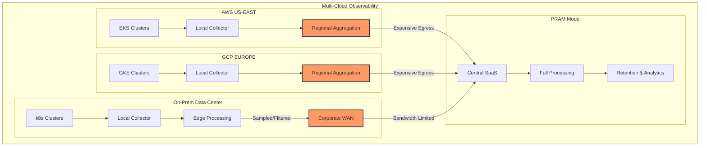

# Data-Gravity & Egress Economics

## Introduction

§ In distributed observability architectures, the concept of "data gravity" is crucial yet often overlooked. Coined by Dave McCrory in 2010, data gravity describes how data accumulates mass and pulls services and applications toward it - similar to physical gravity. In the context of Kubernetes monitoring, this phenomenon affects where metrics, traces, and logs should be processed, stored, and analyzed. This chapter explores the implications of data gravity on observability architecture, with special focus on economic factors like egress costs, compliance requirements, and data sovereignty.

§ As organizations expand their infrastructure across multiple clouds, regions, and on-premises environments, the traditional centralized monitoring approach becomes increasingly untenable. Cross-region and cross-cloud data transfer (egress) costs can quickly dominate observability budgets, while regulatory frameworks like GDPR and industry-specific compliance needs may prohibit certain data movements entirely.

## Data Gravity Fundamentals

### The Three Laws of Data Gravity

§ Just as Newton's laws describe physical gravity, observability architectures operate under these data gravity principles:

1. **Data attracts applications**: Services that frequently access telemetry data should be located close to where that data is stored
2. **Data mass increases over time**: As telemetry volume grows, the gravitational pull becomes stronger, making relocation more costly
3. **Different data types have different gravitational constants**: Metrics typically have lower gravity than logs or traces due to their compact nature

### DG-5A: Data Gravity Visualization



## Egress Economics

§ Cloud providers typically charge for data leaving their infrastructure (egress), but not for data entering (ingress). This asymmetrical pricing model creates economic pressure that significantly impacts observability architecture decisions.

### TB-5A: Comparative Egress Costs (2025)

| Provider | Intra-Region | Inter-Region | Internet Egress | Notes |
|----------|--------------|--------------|----------------|-------|
| AWS | Free | $0.02/GB | $0.08-0.09/GB | First 100TB, tiered pricing |
| GCP | Free | $0.01/GB | $0.08-0.12/GB | Varies by destination |
| Azure | Free | $0.02/GB | $0.05-0.08/GB | Zone redundancy included |
| Digital Ocean | Free | N/A | $0.01/GB | Flat pricing |
| Equinix Metal | Free | Varies | $0.03/GB | Discounts for high volume |
| New Relic SaaS | N/A | N/A | Free | Ingest-based pricing only |

### EQ-5A: Monthly Egress Cost

```
Monthly Egress Cost = Daily Telemetry Volume × 30 × Compression Ratio × Egress Rate

Where:
- Daily Telemetry Volume = Metrics + Logs + Traces (GB/day)
- Compression Ratio = Raw data size / Compressed size (typically 0.1-0.2)
- Egress Rate = Cost per GB from cloud provider
```

Example calculation for a mid-sized Kubernetes cluster sending telemetry to New Relic:

```
Given:
- 500 nodes generating 20GB/day of raw telemetry
- Compression ratio of 0.15 (85% reduction)
- AWS egress cost of $0.09/GB

Monthly Egress Cost = 20GB × 30 days × 0.15 × $0.09/GB = $8.10/day = $243/month
```

## Architectural Patterns for Data Gravity

§ Several architectural patterns have emerged to address data gravity challenges in observability:

### 1. Regional Aggregation

§ Deploy collectors/aggregators in each cloud region to perform initial filtering, sampling, and aggregation before forwarding data to a central location. This approach reduces egress costs and improves data locality.

### CF-5A: OTel Collector Regional Aggregation Configuration

```yaml
receivers:
  otlp:
    protocols:
      grpc:
        endpoint: 0.0.0.0:4317
      http:
        endpoint: 0.0.0.0:4318

processors:
  batch:
    send_batch_size: 10000
    timeout: 10s
  
  # Regional sampling to reduce egress
  probabilistic_sampler:
    hash_seed: 22
    sampling_percentage: 25

exporters:
  otlp:
    endpoint: central-collector.newrelic.com:4317
    tls:
      insecure: false
    headers:
      api-key: ${NEWRELIC_LICENSE_KEY}
  
  # Local storage for compliance/audit
  file:
    path: /data/compliance/traces.json

service:
  pipelines:
    traces:
      receivers: [otlp]
      processors: [batch, probabilistic_sampler]
      exporters: [otlp, file]
    metrics:
      receivers: [otlp]
      processors: [batch]
      exporters: [otlp]
```

### 2. Federated Query Model

§ Rather than centralizing all data, keep telemetry close to its source and use a federated query system to analyze across boundaries. This approach minimizes egress costs but requires sophisticated query federation.

### 3. Edge-Processing Filter

§ Process telemetry at the edge, extracting key insights and forwarding only high-value or summarized data to central systems.

### EQ-5B: Edge Buffer Sizing

```
Buffer Size (GB) = Ingest Rate (GB/hr) × Latency Tolerance (hr)

Where:
- Ingest Rate = Raw telemetry generation rate
- Latency Tolerance = Acceptable delay before data must be forwarded or discarded
```

For example, with a 5GB/hr ingest rate and 4-hour latency tolerance during connectivity issues:

```
Buffer Size = 5GB/hr × 4hr = 20GB minimum edge buffer capacity
```

## Compliance and Data Sovereignty

§ Beyond cost considerations, regulatory requirements create "hard gravity wells" that cannot be overcome. Key considerations include:

### TB-5B: Regulatory Impact on Telemetry Data

| Regulation | Geography | Data Types | Impact on Observability |
|------------|-----------|------------|-------------------------|
| GDPR | EU/EEA | PII in logs, traces | May require EU-hosted processing |
| HIPAA | US | PHI in healthcare apps | Encryption, access controls, BAAs |
| SOC2 | Global | Security event logs | Retention requirements, access restrictions |
| FedRAMP | US Gov | All telemetry from gov systems | US-based processing, personnel restrictions |
| LGPD | Brazil | Brazilian customer data | Similar to GDPR for Brazilian data |
| CCPA/CPRA | California | California resident data | Deletion rights, special handling |

### Air-Gapped Environments

§ Some industries (defense, critical infrastructure, banking) operate air-gapped environments with no direct internet connectivity. These environments require specialized observability approaches:

### RB-5A: Air-Gapped Observability Runbook

1. **Discovery Phase**
   - Map all network boundaries and data flow restrictions
   - Document retention requirements per data classification

2. **Architecture Design**
   - Deploy full observability stack within secured network
   - Implement data classification at collection time
   - Establish unidirectional data flow mechanisms if needed

3. **Implementation**
   - Configure data retention aligned with security requirements
   - Implement automated scrubbing of sensitive information
   - Establish backup and disaster recovery procedures

4. **Validation**
   - Verify no external connections are established
   - Confirm compliance with security standards
   - Test recovery procedures

## New Relic's Multi-Cloud & Data Sovereignty Solutions

§ New Relic has developed several capabilities to address data gravity challenges:

### 1. Regional Data Centers

New Relic operates telemetry ingest endpoints in multiple regions (US, EU, APAC) to support data sovereignty requirements. Customers can specify which data center processes and stores their telemetry.

### 2. Private Minions

For organizations with strict data locality requirements, New Relic offers "Private Minions" - dedicated processing resources deployed within a customer's environment to handle sensitive telemetry while still connecting to the broader New Relic platform.

### 3. Hierarchical Collectors

Multiple layers of OTel collectors can filter, transform, and route telemetry based on data classification and compliance requirements.

### CF-5B: New Relic Regional Configuration Example

```yaml
# nri-kubernetes-config.yaml
apiVersion: v1
kind: ConfigMap
metadata:
  name: nri-kubernetes-config
  namespace: newrelic
data:
  config.yaml: |
    cluster_name: production-eu-central
    sinks:
      newrelic:
        licenseKey: ${NEWRELIC_LICENSE_KEY}
        endpoint: https://metric-api.eu.newrelic.com/metric/v1
        timeout: 5s
    low_data_mode: true
    # EU data center for GDPR compliance
    regionCode: "eu"
```

## Conclusion

§ Data gravity must be a primary consideration in observability architecture, not an afterthought. When designing monitoring for Kubernetes environments that span multiple regions or clouds, consider:

1. The economic impact of telemetry egress costs
2. Regulatory requirements that may dictate data residency
3. Performance implications of centralized vs. distributed processing
4. Future growth and how it will affect architectural choices

By planning with data gravity in mind, organizations can build sustainable, compliant, and cost-effective observability systems that scale with their infrastructure.

---

**Next Chapter**: [NR Ingest Topology Overview](../02_NR_Ingest_Atlas/09_Ingest_Topology.md)