# New Relic Ingest Topology Overview

## Executive Summary

New Relic's ingest topology represents one of the most advanced and scalable observability data pipelines in the industry. This chapter provides a comprehensive analysis of the architecture, components, data flows, and integration points across the entire observability lifecycle. By understanding this topology in depth, architects can make optimal decisions for instrumenting Kubernetes environments and effectively managing telemetry at scale.

## Nine-Plane Reference Architecture

New Relic's ingest architecture is structured as a nine-plane model, with each plane handling a specific function in the observability pipeline. This architecture enables both flexibility in deployment patterns and consistent handling of telemetry data across diverse environments.

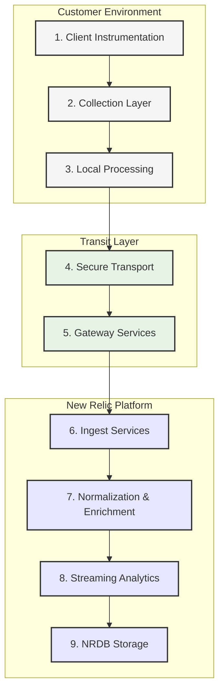

## Detailed Plane Analysis

### 1. Client Instrumentation Plane

The instrumentation plane represents the initial point of telemetry collection, capturing data directly from applications, services, and infrastructure components.

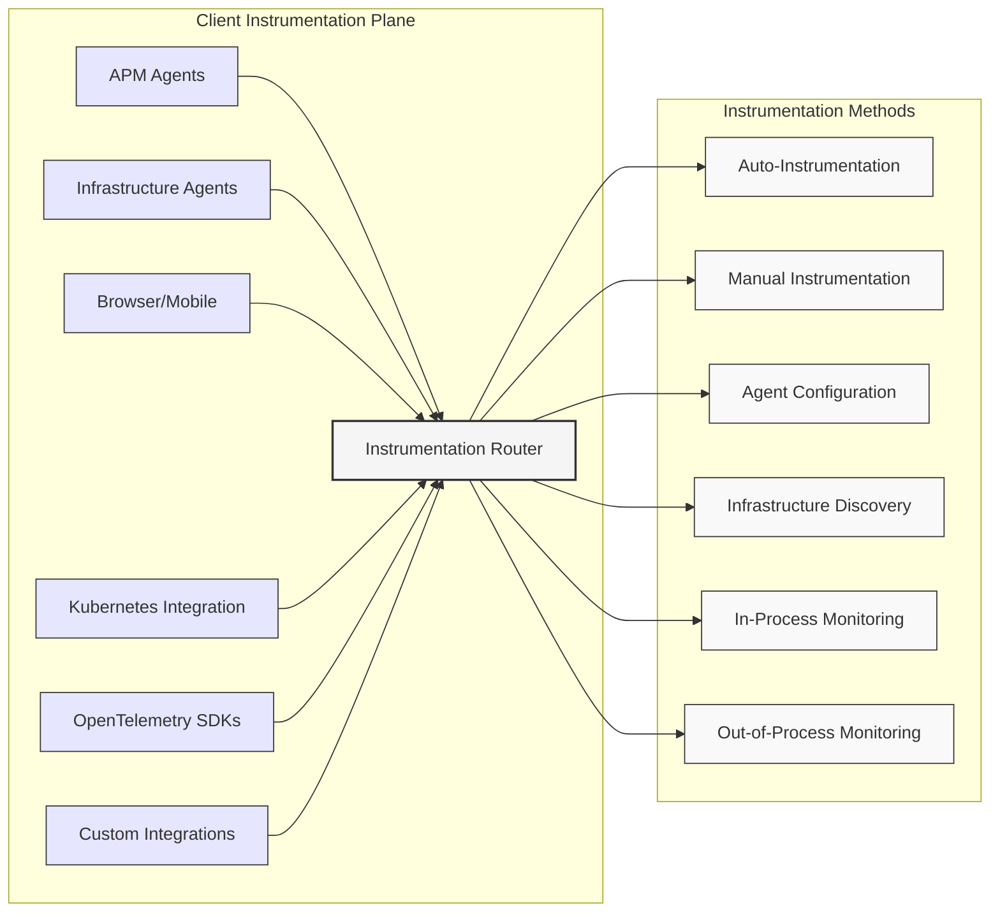

#### Instrumentation Options by Signal Type

| Signal Type | Instrumentation Options | Data Format | K8s-Specific Considerations | 
|-------------|-------------------------|-------------|----------------------------|
| **Metrics** | Infrastructure Agent Prometheus Integration OpenTelemetry SDK Kubernetes Integration | Dimensional OTLP Prometheus Exposition | High-cardinality pod/container labels Resource metrics vs custom metrics Scrape vs push models |
| **Logs** | Infrastructure Agent Fluent Bit/Fluentd OpenTelemetry Collector Kubernetes Event API | JSON Plain text Structured logging | Container stdout/stderr DaemonSet vs Sidecar patterns Log volume management |
| **Traces** | APM Agents OpenTelemetry SDK OpenTracing (legacy) Manual API Calls | W3C TraceContext OTLP Zipkin Jaeger | Service mesh integration Cross-namespace tracing Sampling strategies |
| **Events** | Infrastructure Agent Direct API OpenTelemetry SDK Kubernetes Events | JSON OTLP | Control plane events Deployment events Custom K8s lifecycle events |
| **Synthetic** | Containerized monitors In-cluster checks External checks | API results Check outputs | Intra-cluster connectivity Ingress/service checks Cross-cluster validation |

### 2. Collection Layer

The collection layer aggregates and prepares telemetry before transmission, often running within the Kubernetes cluster itself.

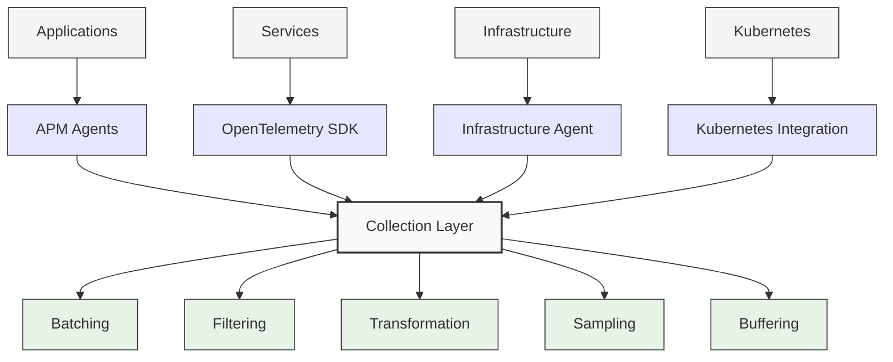

#### Kubernetes Collection Patterns

| Pattern | Implementation | Pros | Cons | Best For |
|---------|----------------|------|------|----------|
| **DaemonSet** | Agent on every node | Complete node visibility Low network overhead | Resource impact on nodes Requires node privileges | Infrastructure metrics Node-level logs |
| **Sidecar** | Per-pod agent container | Isolation of concerns Namespace-level permissions | Resource overhead Deployment complexity | Application logs Service-specific metrics |
| **Cluster Agent** | Centralized collection | Efficient resource usage Simplified maintenance | Potential bottleneck Less isolation | Cluster-level metrics Control plane monitoring |
| **Out-of-Cluster** | External collector | Zero in-cluster overhead Independent failure domain | Network dependency Limited access to internal data | Synthetic checks External availability monitoring |
| **Operator-Managed** | Custom resource definitions | Kubernetes-native management GitOps compatibility | Additional CRDs required Operator overhead | Production environments Multi-cluster deployments |

### 3. Local Processing Plane

Before transmitting data to New Relic, local processing optimizes telemetry for efficient transport and reduces unnecessary data volume.

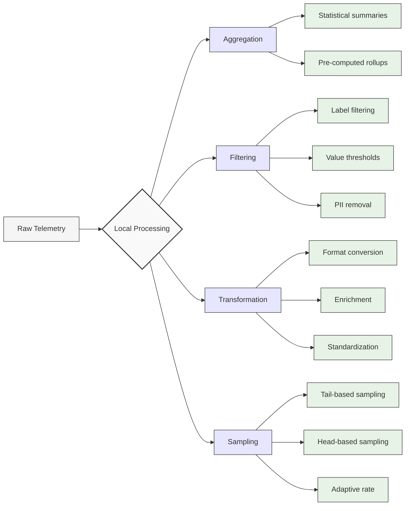

#### Local Processing Optimization Strategies

| Strategy | Technique | Typical Reduction | Use Cases | K8s Implementation |
|----------|-----------|-------------------|-----------|-------------------|
| **Metric Aggregation** | Pre-compute statistics | 90-99% | High-frequency metrics System-level metrics | ConfigMap-based aggregation rules OTel Collector processors |
| **Dimensional Filtering** | Drop unnecessary labels | 30-70% | High-cardinality metrics Auto-generated labels | Label allow/deny lists Relabeling configurations |
| **Log Filtering** | Pattern-based exclusion | 40-80% | Container logs System logs | Fluent Bit filters Vector transforms |
| **Log Parsing** | Extract structured data | 10-30% | Unstructured logs Multi-line logs | Parser configurations Regex extraction rules |
| **Trace Sampling** | Head/tail-based decisions | 90-99% | High-volume services Background processes | Sampling processors Service-level configuration |
| **Semantic Conventions** | Standardize naming | N/A (quality) | Cross-team observability Service correlation | OTel semantic conventions Custom resource attributes |

### 4. Secure Transport Plane

The transport layer ensures secure, reliable transmission of telemetry data to New Relic's ingest endpoints.

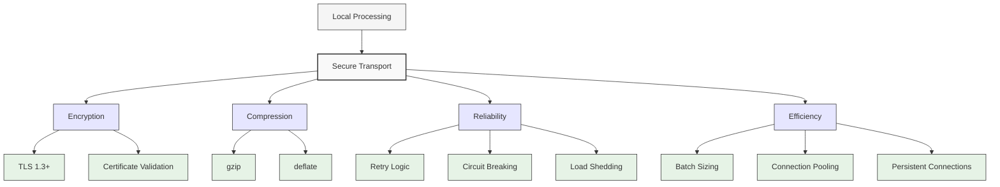

#### Transport Optimization Matrix

| Transport Parameter | Optimal Value | Impact on Performance | Tradeoffs | K8s Consideration |
|--------------------|---------------|----------------------|-----------|-------------------|
| **Batch Size** | 1-5 MB | 5-10× efficiency gain | Memory usage Data freshness | Container memory limits Resource requests |
| **Compression Level** | 6-7 (gzip) | 5-10× bandwidth reduction | CPU usage Latency | CPU limits QoS class |
| **Connection Pooling** | 5-10 connections | Reduced connection overhead | Resource consumption | Network policies Egress traffic |
| **Retry Strategy** | Exp. backoff + jitter | Resilience during instability | Potential data delay | Pod disruption budgets Graceful termination |
| **Send Frequency** | 5-15 seconds | Balance of freshness vs efficiency | Burst potential Battery/resource usage | Liveness/readiness probes Resource limits |
| **Payload Protocol** | Protobuf/OTLP | 30-50% more efficient than JSON | Tooling compatibility Debugging difficulty | Protocol support in collectors |

### 5. Gateway Services Plane

Gateway services represent the first contact point within New Relic's infrastructure, handling authentication, validation, and initial routing.

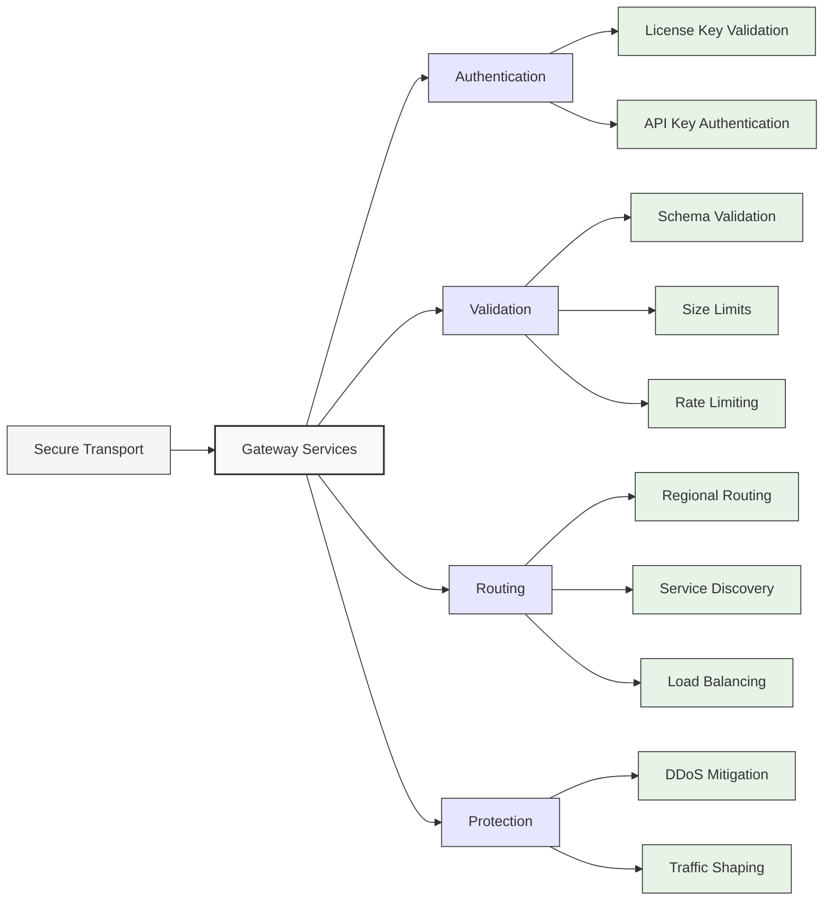

#### Gateway Regional Distribution

New Relic maintains global gateway infrastructure to minimize latency and provide regional compliance options:

| Region | Location | Endpoints | Compliance Certifications | Best For |
|--------|----------|-----------|---------------------------|----------|
| **US East** | Virginia | metrics-api.newrelic.com log-api.newrelic.com trace-api.newrelic.com | SOC 2 ISO 27001 GDPR | North American workloads |
| **US West** | Oregon | collector.newrelic.com insights-collector.newrelic.com | SOC 2 ISO 27001 FedRAMP | US West Coast Gov Cloud |
| **EU** | Frankfurt | eu01-metrics-api.newrelic.com eu01-log-api.newrelic.com | SOC 2 ISO 27001 GDPR Schrems II | European workloads GDPR requirements |
| **Asia Pacific** | Singapore | ap01-metrics-api.newrelic.com ap01-log-api.newrelic.com | SOC 2 ISO 27001 | APAC workloads |
| **Dedicated** | Customer-specific | custom endpoints | Custom certifications | Air-gapped environments Special compliance needs |

### 6. Ingest Services Plane

Specialized services process different types of telemetry, with dedicated pipelines optimized for each data type.

```mermaid
flowchart TD
    A[Gateway Services] --> B[Ingest Services]
    
    B --> C1[Metric Pipeline]
    C1 --> D1[Dimensional Metrics]
    C1 --> D2[Time-Series Metrics]
    
    B --> C2[Event Pipeline]
    C2 --> D3[Structured Events]
    C2 --> D4[Custom Events]
    C2 --> D5[APM Events]
    
    B --> C3[Log Pipeline]
    C3 --> D6[Structured Logs]
    C3 --> D7[Plain Text Logs]
    C3 --> D8[System Logs]
    
    B --> C4[Trace Pipeline]
    C4 --> D9[Distributed Traces]
    C4 --> D10[Span Events]
    C4 --> D11[Trace Context]
    
    B --> C5[Entity Pipeline]
    C5 --> D12[Entity Synthesis]
    C5 --> D13[Relationship Mapping]
    
    style A fill:#f5f5f5,stroke:#333
    style B fill:#f9f9f9,stroke:#333,stroke-width:2px
    style C1 fill:#e6e6ff,stroke:#333
    style C2 fill:#e6e6ff,stroke:#333
    style C3 fill:#e6e6ff,stroke:#333
    style C4 fill:#e6e6ff,stroke:#333
    style C5 fill:#e6e6ff,stroke:#333
    style D1 fill:#e6f3e6,stroke:#333
    style D2 fill:#e6f3e6,stroke:#333
    style D3 fill:#e6f3e6,stroke:#333
    style D4 fill:#e6f3e6,stroke:#333
    style D5 fill:#e6f3e6,stroke:#333
    style D6 fill:#e6f3e6,stroke:#333
    style D7 fill:#e6f3e6,stroke:#333
    style D8 fill:#e6f3e6,stroke:#333
    style D9 fill:#e6f3e6,stroke:#333
    style D10 fill:#e6f3e6,stroke:#333
    style D11 fill:#e6f3e6,stroke:#333
    style D12 fill:#e6f3e6,stroke:#333
    style D13 fill:#e6f3e6,stroke:#333
```

#### Signal-Specific Ingest Endpoints

| Signal Type | Endpoint | Protocol | Format | K8s Relevance |
|-------------|----------|----------|--------|---------------|
| **Metrics** | metrics-api.newrelic.com | HTTP/S | JSON, Protobuf | Container metrics Node metrics Service metrics |
| **Events** | insights-collector.newrelic.com | HTTP/S | JSON | Deployment events Scaling events Pod lifecycle |
| **Logs** | log-api.newrelic.com | HTTP/S | JSON, Text | Container logs Application logs Control plane logs |
| **Traces** | trace-api.newrelic.com | HTTP/S | JSON, Protobuf | Service-to-service communication Microservice interactions |
| **Infrastructure** | infra-api.newrelic.com | HTTP/S | JSON | Host metrics Container lifecycle Kubernetes events |
| **OpenTelemetry** | otlp.nr-data.net | gRPC, HTTP/S | Protobuf, JSON | Full K8s telemetry Cross-cutting concerns |

### 7. Normalization & Enrichment Plane

Raw telemetry is enhanced with contextual information, improving query capabilities and analysis.

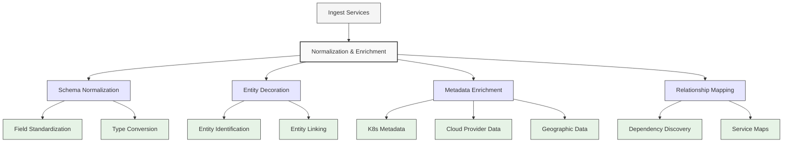

#### Kubernetes Metadata Enrichment

New Relic automatically enhances telemetry with Kubernetes context:

| K8s Dimension | Added Automatically | Source | Benefits | Query Example |
|---------------|---------------------|--------|----------|---------------|
| **Cluster Name** | Yes | Kube API/Config | Cross-cluster analysis | `FROM K8sContainerSample WHERE clusterName = 'prod-east'` |
| **Namespace** | Yes | Kube API | Multi-tenant isolation | `FROM Metric WHERE namespaceName = 'staging'` |
| **Pod Name** | Yes | Kube API | Pod-level correlation | `FROM Log WHERE podName LIKE 'web-frontend-%'` |
| **Container Name** | Yes | Kube API | Container-specific analysis | `FROM ProcessSample WHERE containerName = 'api-server'` |
| **Node Name** | Yes | Kube API | Node-based correlation | `FROM K8sNodeSample WHERE nodeName = 'worker-12'` |
| **Deployment** | Yes | Kube API | Deployment-level aggregation | `FROM Metric WHERE deploymentName = 'payment-service'` |
| **Service** | Yes | Kube API | Service-level metrics | `FROM K8sContainerSample WHERE serviceName = 'checkout'` |
| **Labels** | Configurable | Kube API | Custom organization | `FROM Metric WHERE labels.app = 'inventory'` |
| **Annotations** | Configurable | Kube API | Custom metadata | `FROM Metric WHERE annotations.version = 'v2.3.4'` |

### 8. Streaming Analytics Plane

Real-time processing occurs before final storage, enabling alerting, anomaly detection, and derived metrics.

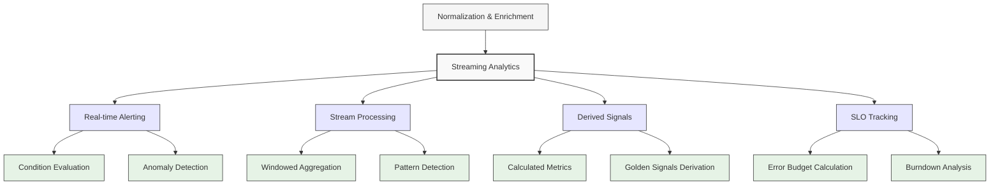

#### Streaming Analytics Use Cases for Kubernetes

| Analytics Type | Implementation | K8s Use Case | Benefits |
|----------------|----------------|-------------|----------|
| **Container Health** | CPU/Memory outlier detection | Identify problematic containers | Proactive resource management |
| **Pod Lifecycle** | Restart pattern detection | Spot crash loops and instability | Faster debugging of deployment issues |
| **Service Latency** | Percentile tracking + baselines | Track service degradation | Early warning of performance issues |
| **Resource Contention** | Cross-metric correlation | Identify noisy neighbors | Better workload placement |
| **Scale Event Analysis** | Event sequence detection | Validate autoscaling effectiveness | Optimization of HPA configurations |
| **Control Plane Health** | API server latency monitoring | Ensure cluster responsiveness | Prevent cluster-wide issues |
| **Deployment Success** | Rolling update tracking | Verify deployment health | Automatic rollback triggers |

### 9. NRDB Storage Plane

The final destination for all telemetry data, optimized for analytical queries and long-term storage.

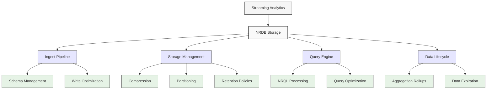

#### NRDB Event Types for Kubernetes

| Event Type | Content | Retention | K8s Use Cases |
|------------|---------|-----------|---------------|
| **K8sContainerSample** | Container metrics | 13 months | Container resource utilization Application performance Resource planning |
| **K8sPodSample** | Pod-level metrics | 13 months | Pod health Scheduling effectiveness Workload analysis |
| **K8sNodeSample** | Node metrics | 13 months | Cluster capacity Node performance Hardware issues |
| **K8sClusterSample** | Cluster metrics | 13 months | Control plane health API server performance Overall cluster health |
| **K8sEvent** | Kubernetes events | 7 days | Deployment events Pod scheduling System warnings |
| **SystemSample** | Host-level metrics | 13 months | Node-level performance OS metrics Hardware utilization |
| **Log** | Container/system logs | 30 days (configurable) | Application logs System logs Control plane logs |
| **Span** | Distributed traces | 8 days | Service interactions Request flows Performance bottlenecks |
| **ProcessSample** | Process metrics | 8 days | Detailed process monitoring Container internals Resource utilization |

## Kubernetes-Specific Integration Patterns

New Relic's ingest topology includes specialized patterns for Kubernetes environments:

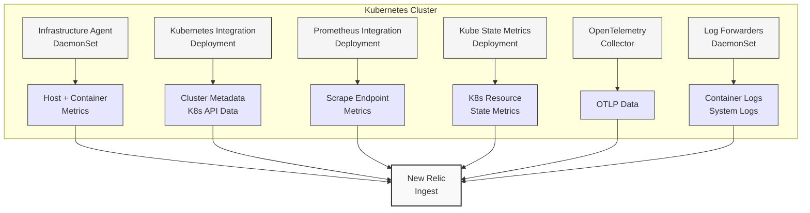

### Kubernetes Integration Components

| Component | Deployment Method | Data Collection | Required Permissions | Resource Impact |
|-----------|-------------------|----------------|---------------------|----------------|
| **Infrastructure Agent** | DaemonSet | Host metrics Container metrics Kubernetes events | privileged hostNetwork | 100-200MB RAM 5-15% CPU per node |
| **Kubernetes Integration** | Config in Infra Agent | Kubernetes API data Cluster metrics Resource metadata | cluster-admin or custom RBAC | Minimal (uses existing agent) |
| **Prometheus Integration** | Config in Infra Agent | Scrape Prometheus endpoints Convert to NR format | Basic pod permissions | Depends on scrape targets Usually 50-100MB RAM |
| **OpenTelemetry Collector** | Deployment or DaemonSet | OTLP data Multiple data types Custom configuration | Depends on collectors Usually namespace-scoped | 100-300MB RAM 5-20% CPU per instance |
| **Kube State Metrics** | Deployment | K8s object states Resource counts State transitions | read-only to cluster API | 50-100MB RAM Minimal CPU |
| **Log Forwarder** | DaemonSet | Container logs Node logs Application logs | Access to log paths Usually privileged | 50-150MB RAM 5-10% CPU per node |

## Performance Characteristics

The ingest topology is designed for high throughput, low latency, and exceptional reliability:

| Metric | Capability | K8s Cluster Support | Scaling Factors |
|--------|------------|---------------------|----------------|
| **Ingest Rate** | >25M data points/second/account | 1000+ node clusters | Container count Metric cardinality Collection frequency |
| **End-to-End Latency** | <10 seconds (p95) <30 seconds (p99) | Real-time monitoring | Network latency Batch size Processing complexity |
| **Query Performance** | Sub-second for common queries 1-5s for complex queries | Interactive troubleshooting | Query complexity Time range Cardinality of results |
| **Reliability** | 99.99% uptime commitment | Production-grade SLA | Region redundancy Client-side buffering |
| **Global Distribution** | 15+ regions worldwide | Data sovereignty compliance | Regional deployment Latency requirements |
| **Data Compression** | 10-20× reduction from raw data | Cost-efficient monitoring | Data types Signal repetitiveness |

## Multi-Signal Correlation

One of the key advantages of New Relic's unified ingest topology is the ability to correlate across different signal types:

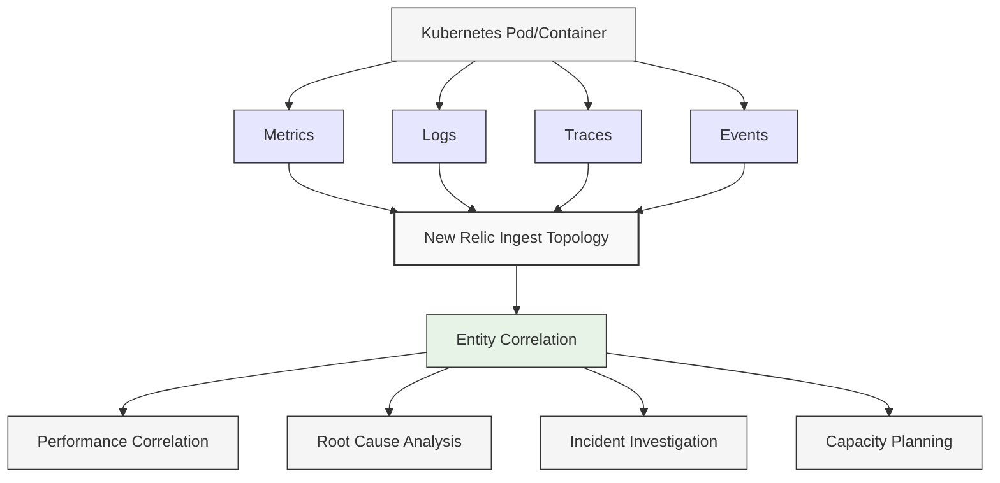

### Cross-Signal Correlation Examples

| Correlation Type | NRQL Example | K8s Use Case | Business Value |
|------------------|--------------|--------------|---------------|
| **Metric-to-Log** | `FROM Metric, Log SELECT Metric.value, Log.message WHERE Metric.podId = Log.podId AND Metric.value > threshold` | Identify log entries when pod CPU spikes | Faster debugging of resource issues |
| **Trace-to-Metric** | `FROM Span, K8sContainerSample SELECT Span.duration, K8sContainerSample.cpuUsedCores WHERE Span.containerId = K8sContainerSample.containerId` | Correlate service latency with container performance | Identify resource-constrained services |
| **Event-to-Log** | `FROM K8sEvent, Log SELECT * WHERE K8sEvent.involvedObjectName = Log.podName AND K8sEvent.reason = 'Failed'` | Connect pod failures with log errors | Complete picture of failure scenarios |
| **Metric-to-Event** | `FROM Metric, Deployment SELECT Metric.value WHERE Metric.deploymentName = Deployment.entityName TIMESERIES` | View metrics during deployment events | Validate deployment impact |
| **Trace-to-Log** | `FROM Span, Log SELECT Span.duration, Log.message WHERE Span.traceId = Log.traceId AND Span.duration > 1` | Find error logs for slow traces | End-to-end transaction visibility |

## Implementation Decision Framework

When designing a New Relic implementation for Kubernetes, several factors should guide your ingest topology decisions:

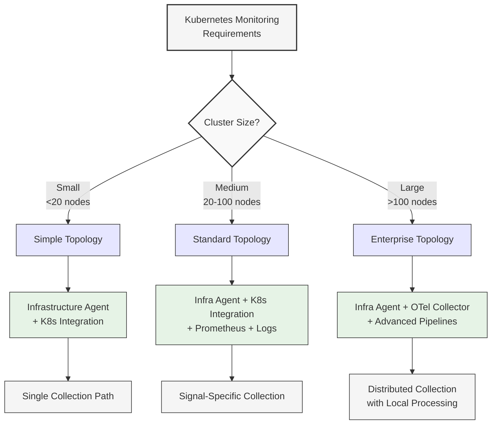

### Implementation Decision Matrix

Use this matrix to guide your implementation decisions:

| Factor | Simple Topology | Standard Topology | Enterprise Topology |
|--------|----------------|-------------------|---------------------|
| **Cluster Size** | <20 nodes | 20-100 nodes | >100 nodes |
| **Collection Approach** | Infrastructure Agent + integrations | Agent + specialized collectors | Distributed collection with local processing |
| **Deployment Method** | Manual/basic Helm | Helm with custom values | Operator with CRDs |
| **Data Volume** | <1M events/minute | 1-10M events/minute | >10M events/minute |
| **Cardinality Strategy** | Default settings | Selective filtering | Advanced dimensional management |
| **Local Processing** | Minimal | Basic aggregation and filtering | Advanced pipeline processing |
| **Resource Requirements** | Low | Medium | High but optimized |
| **Management Complexity** | Minimal | Moderate | Complex but automated |
| **Ideal Use Cases** | Development Small production Quick setup | Standard production Multi-app clusters | Large enterprise Multi-cluster Regulated environments |

## Best Practices for Kubernetes Implementations

### Topology Optimization

1. **Right-size agent deployments**
   - Use resource limits and requests appropriate for cluster size
   - Consider node resource utilization in DaemonSet deployment

2. **Optimize collection frequency**
   - Standard metrics: 15-30 seconds
   - Critical metrics: 5-10 seconds
   - Long-term trends: 60 seconds

3. **Implement hierarchical monitoring**
   - Cluster-level golden signals
   - Namespace-level health metrics
   - Pod/container detailed telemetry

### Data Management

1. **Control metric cardinality**
   - Filter high-cardinality labels before transmission
   - Group metrics by relevant dimensions (namespace, deployment)
   - Sample high-volume, low-value signals

2. **Implement intelligent log management**
   - Use log pattern recognition to reduce volume
   - Sample debug/verbose logs in production
   - Retain error logs longer than informational logs

3. **Apply appropriate sampling strategies**
   - Infrastructure: Minimal sampling, focus on aggregation
   - Traces: Adaptive sampling based on service importance
   - Logs: Pattern-based and level-based sampling

## Conclusion

New Relic's ingest topology provides a comprehensive framework for monitoring Kubernetes environments at any scale. By understanding each of the nine planes and their interactions, you can design an observability implementation that balances completeness, performance, and cost-effectiveness.

The modular nature of the architecture allows for flexible adoption, from simple single-cluster monitoring to complex multi-cluster enterprise deployments with specialized requirements. The unified data model enables powerful cross-signal correlations that provide deeper insights than siloed monitoring approaches.

When implementing New Relic for Kubernetes, consider your specific requirements around scale, data volume, and analysis needs to select the appropriate components and configuration. The decision frameworks and best practices in this chapter will guide you toward an optimal implementation for your specific needs.