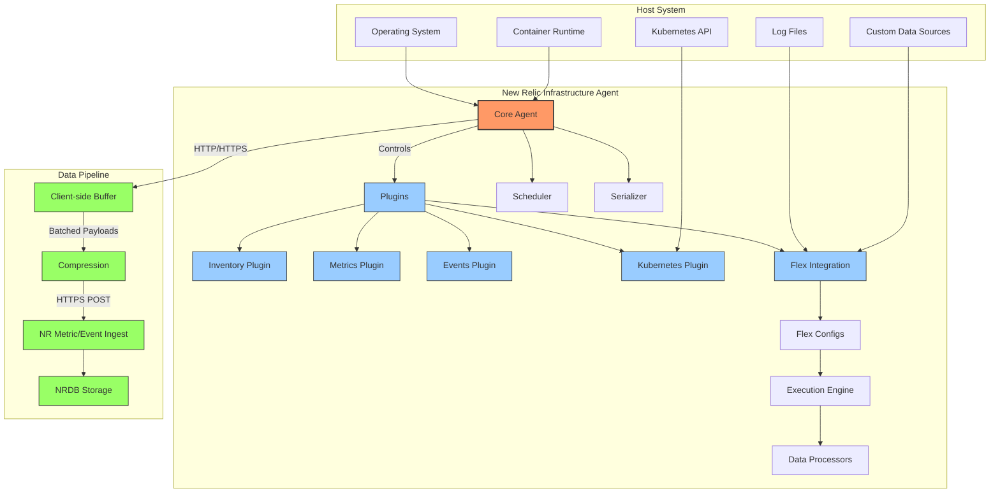
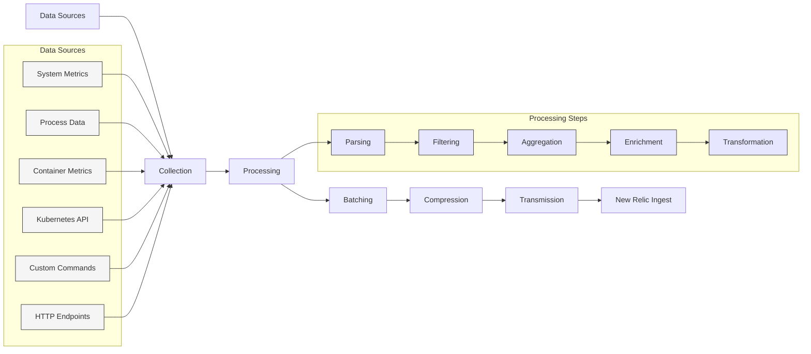
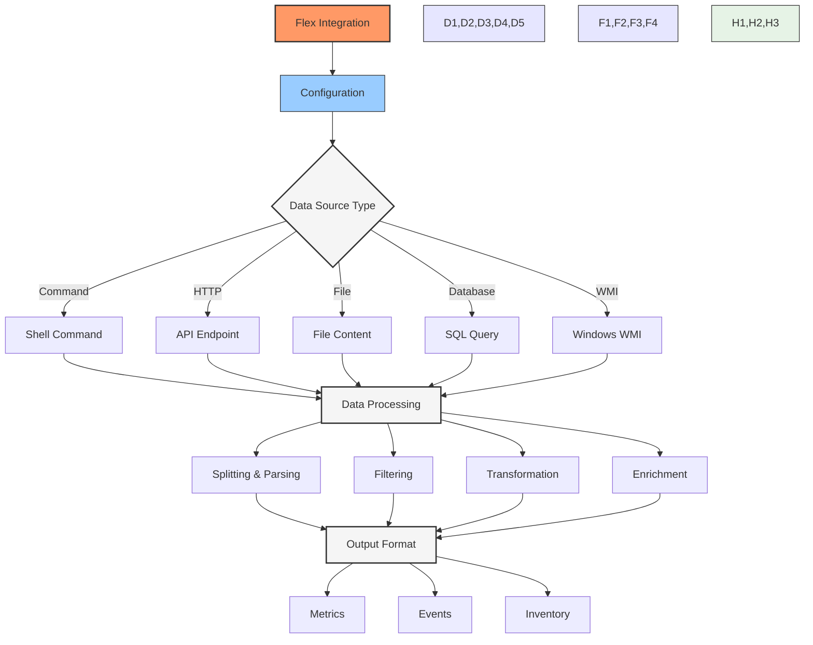
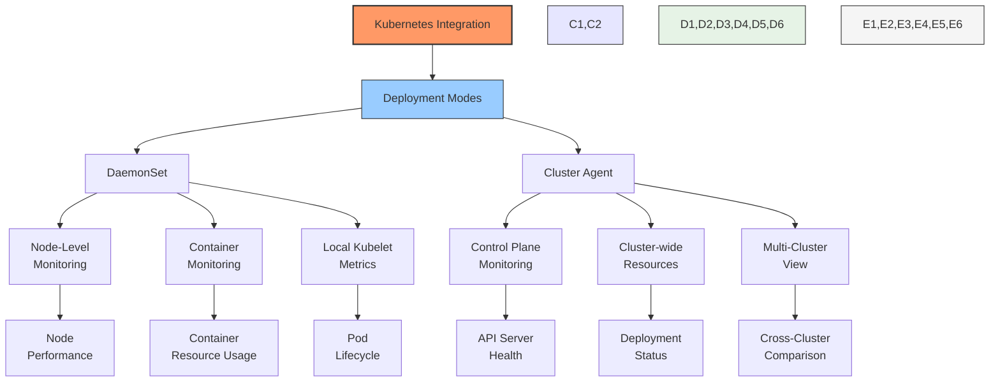
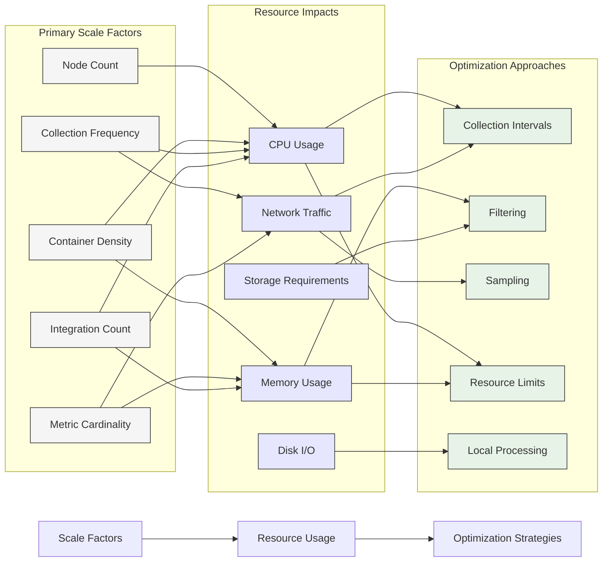
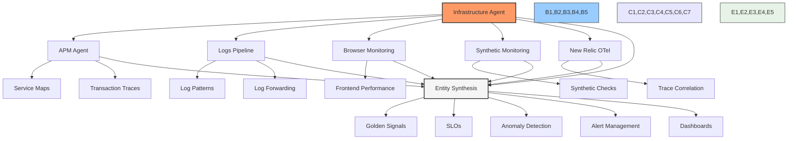
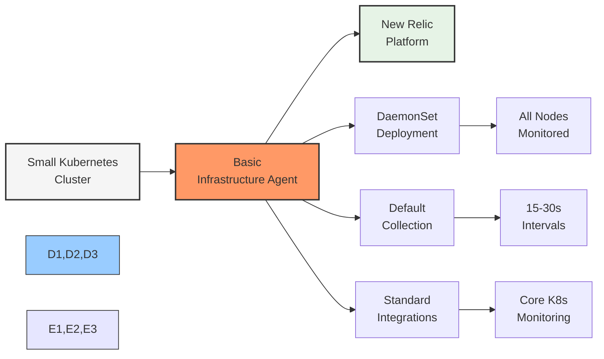
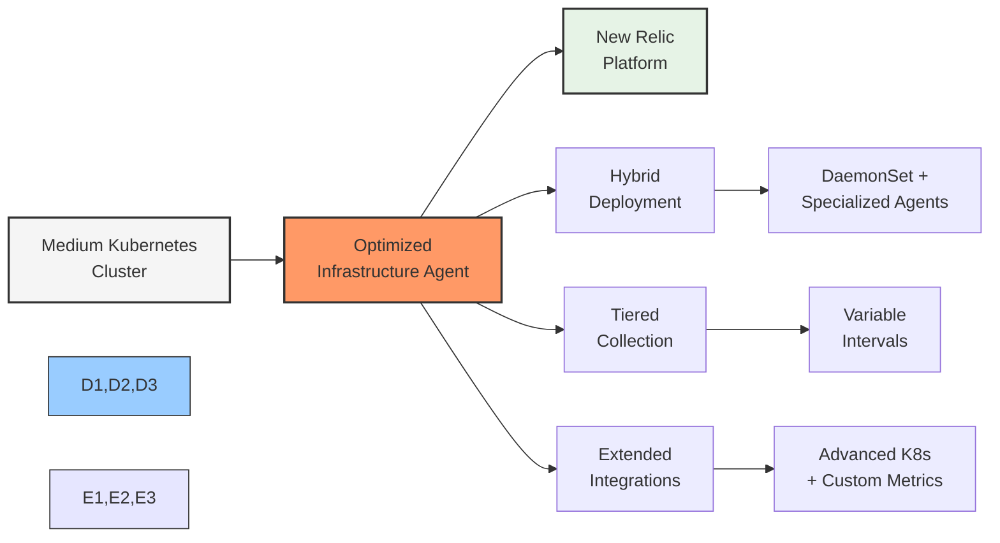
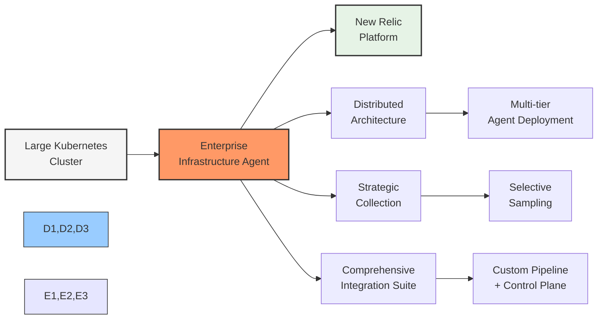

# Infrastructure & Flex Agents: Core Components

## Executive Summary

New Relic's Infrastructure agent represents a foundational component of the New Relic observability platform, providing comprehensive system-level telemetry with an emphasis on Kubernetes environments. This chapter explores the internal architecture, data flow patterns, and configuration strategies for the Infrastructure agent and the Flex integration framework. Understanding these components is critical for implementing effective, resource-efficient monitoring in modern containerized environments.

The Infrastructure agent, built in Go for performance and cross-platform compatibility, employs a modular architecture that can be extended through integrations. The Flex framework transforms this agent into a universal data collector capable of monitoring virtually any technology without requiring code changes. Together, these components provide the foundation for New Relic's Kubernetes monitoring capabilities.

## Agent Architecture

The New Relic Infrastructure agent is designed as a lightweight, high-performance monitoring service that runs across various operating systems and deployment patterns. Its architecture enables efficient telemetry collection from both traditional infrastructure and modern containerized environments.



### Core Components

The Infrastructure agent consists of several key components that work together to collect, process, and transmit telemetry:

1. **Core Agent**: The central coordinator responsible for:
   - Plugin lifecycle management
   - Collection scheduling
   - Data serialization
   - Communication with New Relic backends
   - Client-side buffering
   - Error handling and retries

2. **Plugin Manager**: Loads and orchestrates various integration plugins:
   - Built-in plugins for system metrics
   - On-demand discovery integrations
   - Custom plugins for specialized monitoring
   - Version compatibility management

3. **Inventory Collector**: Gathers comprehensive system configuration data:
   - Installed packages and versions
   - System configuration files
   - Hardware specifications
   - Network configuration
   - Service discovery

4. **Metric Harvester**: Collects system-level performance metrics:
   - CPU utilization (overall and per-core)
   - Memory usage and paging activity
   - Disk I/O and storage utilization
   - Network throughput and connection states
   - Process resource consumption

5. **Event Processor**: Captures system events and state changes:
   - Process starts and stops
   - Container creation and termination
   - Service state transitions
   - System alerts and notifications
   - Custom defined events

6. **Kubernetes Integration**: Specialized plugin for Kubernetes environments:
   - Pod and container metrics
   - Node resource utilization
   - Control plane component monitoring
   - Kubernetes events
   - Label and annotation capture

7. **Flex Integration Framework**: Extensible system for custom monitoring:
   - Command execution and parsing
   - HTTP/API data collection
   - Structured data parsing
   - Custom metric generation
   - Inventory enrichment

### Agent Internals

The Infrastructure agent is built with efficiency and reliability as core design principles:

| Component | Implementation | Purpose | Kubernetes Considerations |
|-----------|----------------|---------|--------------------------|
| **Core Runtime** | Go with minimal dependencies | Cross-platform compatibility, low resource usage | Container-aware, cgroup v1/v2 compatible |
| **Plugin System** | Dynamic loading with standardized interfaces | Extension without core changes | Auto-detection of container environments |
| **Data Buffer** | Persistent disk-backed queue | Reliability during network issues | EmptyDir volume for state persistence |
| **Protocol** | Protocol Buffers over HTTPS | Efficient, secure data transport | Network policy considerations |
| **Scheduler** | Adaptive timing with jitter | Prevent thundering herd, control resource usage | Pod QoS implications, resource limits |
| **Resource Limits** | Self-monitoring and rate control | Prevent resource exhaustion | Container resource limits, CPU throttling awareness |
| **Security** | Minimal privilege operation | Reduce attack surface | Security context, read-only filesystems, capabilities |

## Data Flow & Processing

Data flows through the Infrastructure agent in a well-defined path designed for efficiency, reliability, and minimizing operational impact:



### Collection Process

The collection process begins with scheduled data gathering from various system interfaces:

1. **System Metrics Collection**:
   - Direct OS metrics via system APIs
   - Virtual file system interfaces (/proc, /sys)
   - Performance counters (Windows)
   - System Management Interface (SMI)

2. **Container Detection**:
   - Docker socket monitoring
   - containerd integration
   - cgroup filesystem analysis
   - Container runtime detection

3. **Kubernetes Integration**:
   - In-cluster API access
   - Kubelet metrics endpoints
   - Control plane component metrics
   - Resource state monitoring

4. **Flex Collection**:
   - Command execution and output parsing
   - HTTP API polling
   - Structured file reading
   - Database queries

### Batch Processing Optimization

The agent implements sophisticated batching strategies to balance data freshness against transmission efficiency:

```
Optimal Batch Size = min(
    max_batch_size,
    throughput_rate × target_latency
)

Where:
- max_batch_size = Maximum allowed batch size (default: 1MB)
- throughput_rate = Data collection rate (KB/s)
- target_latency = Acceptable delay before data transmission (s)
```

For example, with a throughput of 50KB/s and target latency of 10s:
```
Optimal Batch Size = min(1024KB, 50KB/s × 10s) = min(1024KB, 500KB) = 500KB
```

This formula helps balance network efficiency against data freshness.

### Transmission Reliability

The agent ensures reliable data delivery through a multi-layered approach:

| Strategy | Implementation | Purpose | Configuration |
|----------|----------------|---------|--------------|
| **Client-side Buffering** | Persistent disk queue | Survive network outages | `payload_queue_size` |
| **Compression** | gzip with tunable levels | Reduce bandwidth usage | `compress_payload_level` |
| **Exponential Backoff** | Progressive retry delays | Avoid overwhelming recovery | `backoff_max_seconds` |
| **Jittered Retries** | Random delay variation | Prevent retry storms | Built-in |
| **Circuit Breaking** | Temporary suspension after failures | Prevent resource waste | `retry_count_max` |
| **Payload Chunking** | Split oversized payloads | Handle large data volumes | Automatic |
| **Regional Failover** | Alternative endpoints | Survive regional outages | `override_host_root` |

## Flex Integration Framework

The Flex integration framework transforms the Infrastructure agent into a universal data collector capable of monitoring virtually any technology without requiring code changes. This extensibility is particularly valuable in heterogeneous Kubernetes environments.



### YAML-Based Configuration

Flex integrations are defined using YAML configuration files that specify:

1. **Integration Metadata**:
   - Name and description
   - Version information
   - Integration identifier

2. **Collection Configuration**:
   - Execution interval
   - Timeout settings
   - Retry behavior

3. **Data Source Definition**:
   - Command, API, file, or database connection
   - Authentication details
   - Query parameters

4. **Data Processing Rules**:
   - Parsing instructions
   - Field mappings
   - Value transformations

5. **Output Configuration**:
   - Metric or event definitions
   - Dimensional data modeling
   - Unit specifications

### Sample Flex Configuration

```yaml
---
# Basic metrics collection using Flex
name: system-metrics-flex
description: Additional system metrics collected via Flex
integration_name: com.newrelic.metrics

# Collection interval in seconds
interval: 30

# Data sources and metrics definition
apis:
  - name: SystemMetricsAPI
    # Command-based metric collection
    commands:
      # CPU metrics collection via `vmstat`
      - run: vmstat 1 2 | tail -1
        split: horizontal
        split_by: \s+
        set_header: [skip, skip, swap_in, swap_out, io_in, io_out, system_interrupts, system_context_switches, user_cpu, system_cpu, idle_cpu, wait_cpu, steal_cpu, cache_memory]
        metric_parser:
          system_interrupts:
            metric_type: gauge
            metric_name: system.interrupts
            metric_value: ${system_interrupts}
          system_context_switches:
            metric_type: gauge
            metric_name: system.contextSwitches
            metric_value: ${system_context_switches}
          user_cpu:
            metric_type: gauge
            metric_name: system.cpu.userPercent
            metric_value: ${user_cpu}
          system_cpu:
            metric_type: gauge
            metric_name: system.cpu.systemPercent
            metric_value: ${system_cpu}
          idle_cpu:
            metric_type: gauge
            metric_name: system.cpu.idlePercent
            metric_value: ${idle_cpu}
      
      # Memory usage via `free`
      - run: free | grep Mem
        split: horizontal
        split_by: \s+
        set_header: [name, total, used, free, shared, cache, available]
        metric_parser:
          total:
            metric_type: gauge
            metric_name: memory.totalBytes
            metric_value: ${total}
          used:
            metric_type: gauge
            metric_name: memory.usedBytes
            metric_value: ${used}
          free:
            metric_type: gauge
            metric_name: memory.freeBytes
            metric_value: ${free}
          available:
            metric_type: gauge
            metric_name: memory.availableBytes
            metric_value: ${available}
        
      # Disk space via `df`
      - run: df -PT -x tmpfs -x devtmpfs | grep -v Filesystem
        split: horizontal
        split_by: \s+
        set_header: [device, type, total, used, available, percentUsed, mountPoint]
        metric_parser:
          device:
            metric_type: attribute
            metric_name: device
          mountPoint:
            metric_type: attribute
            metric_name: mountPoint
          total:
            metric_type: gauge
            metric_name: disk.totalBytes
            metric_value: ${total}
            multiply_by: 1024 # Convert KB to bytes
          used:
            metric_type: gauge
            metric_name: disk.usedBytes
            metric_value: ${used}
            multiply_by: 1024 # Convert KB to bytes
          available:
            metric_type: gauge 
            metric_name: disk.availableBytes
            metric_value: ${available}
            multiply_by: 1024 # Convert KB to bytes
```

### Flex Processing Capabilities

Flex provides extensive data processing capabilities for transforming raw output into structured metrics and events:

| Processing Feature | Description | Example Use Case | Kubernetes Application |
|-------------------|-------------|------------------|------------------------|
| **Text Splitting** | Parse structured and unstructured text | Command output parsing | Parse kubectl output |
| **Regular Expressions** | Pattern matching and extraction | Log file analysis | Extract data from pod logs |
| **JSON/XML Processing** | Structured data parsing | API response processing | Parse Kubernetes API responses |
| **Mathematical Operations** | Value transformations | Unit conversions | Convert container resource metrics |
| **Lookup Tables** | Value mapping and enrichment | Status code translation | Map Kubernetes status phases |
| **Conditional Logic** | Data-dependent processing | Error state detection | Handle varying pod conditions |
| **Variable References** | Dynamic value substitution | Template-based monitoring | Namespace-specific monitoring |
| **Dimensional Data** | Attribute attachment | Enhanced metric context | Label-based metric enrichment |

### Flex Integration Use Cases

Flex is particularly valuable for extending Kubernetes monitoring beyond standard metrics:

| Use Case | Implementation | Value | Query Example |
|----------|----------------|-------|--------------|
| **Custom Resource Metrics** | Monitor CRDs via API | Visibility into specialized workloads | `FROM Metric SELECT average(customResource.status) FACET resourceName` |
| **Extended Control Plane** | Access etcd and API metrics | Deeper cluster health insights | `FROM Metric SELECT average(etcd.diskWrites) TIMESERIES` |
| **Certificate Monitoring** | Check cert expiration dates | Prevent authentication failures | `FROM Metric SELECT min(certificate.daysUntilExpiration) WHERE name = 'api-server'` |
| **DNS Performance** | Test resolution time | Detect service discovery issues | `FROM Metric SELECT average(dns.resolutionTimeMs) FACET serviceName` |
| **Custom Application Health** | Application-specific health checks | Business-relevant monitoring | `FROM Metric SELECT average(application.healthStatus) FACET podName` |
| **External Dependencies** | Monitor external APIs/services | Complete dependency visibility | `FROM Metric SELECT average(external.responseTime) FACET endpoint` |
| **Storage Performance** | PVC/PV performance metrics | Storage optimization | `FROM Metric SELECT average(storage.latencyMs) FACET persistentVolumeName` |

## Kubernetes Integration

The Kubernetes integration is a specialized plugin that extends the Infrastructure agent to provide comprehensive monitoring for Kubernetes environments. It offers unique capabilities designed for container orchestration systems:



### Deployment Patterns

The Kubernetes integration can be deployed in multiple patterns depending on cluster size and monitoring requirements:

| Deployment Pattern | Implementation | Best For | Limitations |
|-------------------|----------------|----------|-------------|
| **DaemonSet** | Agent on every node | Complete node and container visibility | Resource usage on every node |
| **Cluster Agent** | Single/few central agents | Small clusters, control plane focus | Limited container-level detail |
| **Sidecar** | Agent container in pods | Application-specific deep monitoring | High resource overhead |
| **Hybrid** | DaemonSet + specialized collectors | Large production environments | Complex configuration |
| **Operator-Managed** | Custom resource definitions | GitOps workflows, multi-cluster | Additional CRD complexity |

### Configuration Options

The Kubernetes integration offers extensive configuration options for fine-tuning monitoring coverage:

```yaml
# Infrastructure agent Kubernetes configuration
cat << EOF > /etc/newrelic-infra/integrations.d/kubernetes-config.yml
integration_name: com.newrelic.kubernetes

instances:
  - name: kubernetes-metrics
    command: metrics
    arguments:
      # Control Plane monitoring
      cluster_name: production-east
      
      # Discovery configuration
      discovery:
        # Namespaces to monitor (empty means "all")
        namespaces: []
        
      # Container metrics configuration  
      container_metrics:
        enabled: true
        
      # Kubernetes state metrics
      etcd:
        enabled: true
        endpoint: https://127.0.0.1:2379
        ca_file: /etc/kubernetes/pki/etcd/ca.crt
        cert_file: /etc/kubernetes/pki/etcd/server.crt
        key_file: /etc/kubernetes/pki/etcd/server.key
      
      # API Server metrics
      api_server:
        enabled: true
        endpoint: https://kubernetes.default.svc
        
      # Scheduler metrics
      scheduler:
        enabled: true
        
      # Controller Manager metrics
      controller_manager:
        enabled: true
      
      # Node metrics
      kubelet:
        enabled: true
        
      # Horizontal Pod Autoscaler metrics
      hpa:
        enabled: true
EOF
```

### Data Collection Coverage

The Kubernetes integration collects a comprehensive set of metrics and metadata:

| Component | Metrics Collected | Events Captured | Metadata |
|-----------|-------------------|----------------|----------|
| **Node** | CPU, Memory, Disk, Network<br>Load, Filesystem | Node status changes<br>Condition transitions | Labels, Taints<br>Capacity, Allocatable |
| **Container** | CPU, Memory limits/usage<br>Throttling, Restarts | Container starts/stops<br>OOM kills | Image, Runtime<br>Ports, Commands |
| **Pod** | Resource usage<br>Status, Phase | Scheduling events<br>Lifecycle transitions | Labels, Annotations<br>QoS Class, Priority |
| **Deployment** | Desired/Available replicas<br>Update strategy | Rollout events<br>Scaling events | Strategy, Selectors<br>Conditions |
| **Service** | Endpoint count<br>Session affinity | Endpoint changes<br>Load balancer events | Type, Selector<br>Ports, ClusterIP |
| **ReplicaSet** | Replica count<br>Match status | Scaling events | Owner references<br>Selectors |
| **DaemonSet** | Desired/Current nodes<br>Update strategy | Rollout events | Update strategy<br>Selector |
| **StatefulSet** | Replica count<br>Update status | Volume claims<br>Scaling events | Service name<br>Update strategy |
| **PersistentVolume** | Capacity, Usage<br>Phase | Claim events<br>Status transitions | Storage class<br>Access modes |
| **Namespace** | Resource quotas<br>Active status | Creation/deletion events | Labels, Annotations |
| **Control Plane** | API request rate<br>Etcd performance<br>Scheduler binding time | Component state changes<br>Leader elections | Version, Flags<br>Endpoints |

## Performance Optimization

Optimizing the Infrastructure agent's performance is crucial for minimizing resource consumption while maintaining comprehensive monitoring coverage.

### Resource Usage Patterns

The agent's resource consumption follows predictable patterns based on scale and configuration:



### Performance Tuning Options

The Infrastructure agent offers various configuration options for balancing telemetry completeness against resource usage:

| Configuration | Default | Low-Resource Setting | High-Volume Setting | Description |
|---------------|---------|---------------------|---------------------|-------------|
| `interval_sec` | 30 | 60 | 15 | Collection interval in seconds |
| `payload_queue_size` | 1000 | 500 | 5000 | Max number of payloads to buffer |
| `max_procs` | auto | 1 | 4+ | Go runtime thread limit |
| `verbose` | 0 | 0 | 1 | Logging verbosity (0-4) |
| `http_timeout` | 30 | 60 | 15 | HTTP timeout in seconds |
| `compress_payload` | true | true | true | Enable payload compression |
| `disable_all_plugins` | false | false | selective | Disable unneeded plugins |
| `include_matching_metrics` | * | selective | selective | Metric inclusion patterns |
| `pass_through_environment` | selective | minimal | selective | Environment variables to include |
| `disable_zero_metrics` | false | true | false | Skip zero-valued metrics |

### Kubernetes-Specific Optimizations

Special considerations apply when running the Infrastructure agent in Kubernetes environments:

| Optimization | Implementation | Resource Impact | Tradeoffs |
|--------------|----------------|----------------|-----------|
| **Resource Limits** | Set container resource limits | Prevent node resource exhaustion | May limit peak monitoring capability |
| **Pod Anti-Affinity** | Prevent multiple agents on same node | Distribute monitoring load | Requires multiple nodes |
| **Topology Scheduling** | Align with hardware profile | Optimize for CPU/memory balance | More complex deployment |
| **PriorityClass** | Set appropriate scheduling priority | Ensure monitoring during contention | May preempt application pods |
| **Collection Filtering** | Namespace/label-based inclusion | Reduce processing overhead | Potential monitoring gaps |
| **Low-Data Mode** | Reduced metric set collection | 40-60% lower resource usage | Less detailed monitoring |
| **Integration Selection** | Disable unnecessary integrations | Linear reduction with each removal | Feature reduction |
| **Custom Resource Profile** | Size-based configuration templates | Predictable scaling | Regular tuning required |

## Kubernetes Deployment & Configuration

Proper deployment configuration ensures the Infrastructure agent can effectively monitor Kubernetes environments while operating efficiently.

### Optimized Kubernetes DaemonSet

```yaml
apiVersion: apps/v1
kind: DaemonSet
metadata:
  name: newrelic-infrastructure
  namespace: monitoring
spec:
  selector:
    matchLabels:
      name: newrelic-infrastructure
  template:
    metadata:
      labels:
        name: newrelic-infrastructure
    spec:
      serviceAccountName: newrelic-infrastructure
      containers:
        - name: newrelic-infrastructure
          image: newrelic/infrastructure-k8s:latest
          resources:
            limits:
              memory: 256Mi
              cpu: 200m
            requests:
              memory: 128Mi
              cpu: 100m
          securityContext:
            privileged: false
            allowPrivilegeEscalation: false
            runAsUser: 1000
            readOnlyRootFilesystem: true
            capabilities:
              add:
                - SYS_PTRACE
          env:
            - name: NRIA_LICENSE_KEY
              valueFrom:
                secretKeyRef:
                  name: newrelic-license
                  key: license
            - name: CLUSTER_NAME
              value: "production-east"
            - name: NRIA_VERBOSE
              value: "0"
            - name: NRIA_HTTP_TIMEOUT
              value: "30"
            - name: NRIA_PAYLOAD_COMPRESSION_LEVEL
              value: "6"
            - name: NRIA_CUSTOM_ATTRIBUTES
              value: '{"dataCenter":"us-east","environment":"production"}'
            - name: NRIA_LOW_DATA_MODE
              value: "false"
          volumeMounts:
            - mountPath: /var/run/docker.sock
              name: docker-socket
              readOnly: true
            - mountPath: /host
              name: host-volume
              readOnly: true
            - mountPath: /var/db/newrelic-infra
              name: agent-state
            - mountPath: /etc/newrelic-infra
              name: config-volume
      volumes:
        - name: docker-socket
          hostPath:
            path: /var/run/docker.sock
        - name: host-volume
          hostPath:
            path: /
        - name: agent-state
          emptyDir: {}
        - name: config-volume
          configMap:
            name: newrelic-infrastructure-config
      tolerations:
        - key: node-role.kubernetes.io/master
          effect: NoSchedule
          operator: Exists
```

### Deployment Best Practices

When deploying the Infrastructure agent in Kubernetes:

1. **Security Considerations**:
   - Use a dedicated service account with minimal permissions
   - Implement non-root execution with appropriate security context
   - Configure network policies to limit communication paths
   - Use read-only root filesystem and volume mounts
   - Limit capabilities to only those required

2. **Resource Management**:
   - Set appropriate CPU and memory limits
   - Configure requests to ensure proper scheduling
   - Implement Pod Disruption Budgets for availability
   - Use node anti-affinity for high-availability setups
   - Configure appropriate QoS class (typically Burstable)

3. **Volume Configuration**:
   - Mount host paths as read-only when possible
   - Use emptyDir for agent state with appropriate sizing
   - Implement persistent volumes for long-term buffering if needed
   - Configure appropriate permissions for volume access
   - Consider security implications of host path mounts

4. **Network Configuration**:
   - Define explicit egress rules for New Relic endpoints
   - Configure appropriate DNS settings
   - Set cluster-appropriate proxy configuration
   - Implement TLS for all communications
   - Configure appropriate timeouts and keepalives

5. **Lifecycle Hooks**:
   - Implement proper preStop hooks for graceful termination
   - Configure appropriate terminationGracePeriodSeconds
   - Set up liveness and readiness probes
   - Implement proper initialization sequence
   - Handle pod eviction gracefully

### Infrastructure Agent RBAC Configuration

Proper RBAC configuration is essential for the Infrastructure agent to access Kubernetes resources:

```yaml
apiVersion: v1
kind: ServiceAccount
metadata:
  name: newrelic-infrastructure
  namespace: monitoring
---
apiVersion: rbac.authorization.k8s.io/v1
kind: ClusterRole
metadata:
  name: newrelic-infrastructure
rules:
- apiGroups: [""]
  resources: ["nodes", "pods", "services", "endpoints", "namespaces", "limitranges", "replicationcontrollers", "persistentvolumes", "persistentvolumeclaims", "resourcequotas", "events"]
  verbs: ["get", "list", "watch"]
- apiGroups: ["apps"]
  resources: ["deployments", "replicasets", "statefulsets", "daemonsets"]
  verbs: ["get", "list", "watch"]
- apiGroups: ["batch"]
  resources: ["jobs", "cronjobs"]
  verbs: ["get", "list", "watch"]
- apiGroups: ["autoscaling"]
  resources: ["horizontalpodautoscalers"]
  verbs: ["get", "list", "watch"]
- apiGroups: ["networking.k8s.io"]
  resources: ["ingresses"]
  verbs: ["get", "list", "watch"]
- apiGroups: ["storage.k8s.io"]
  resources: ["storageclasses"]
  verbs: ["get", "list", "watch"]
- apiGroups: ["metrics.k8s.io"]
  resources: ["pods", "nodes"]
  verbs: ["get", "list", "watch"]
---
apiVersion: rbac.authorization.k8s.io/v1
kind: ClusterRoleBinding
metadata:
  name: newrelic-infrastructure
roleRef:
  apiGroup: rbac.authorization.k8s.io
  kind: ClusterRole
  name: newrelic-infrastructure
subjects:
- kind: ServiceAccount
  name: newrelic-infrastructure
  namespace: monitoring
```

## Troubleshooting & Diagnostics

The Infrastructure agent includes comprehensive diagnostic capabilities to help identify and resolve issues.

### Common Issues & Resolution

| Issue | Symptoms | Potential Causes | Resolution Steps |
|-------|----------|------------------|-----------------|
| **Connection Failures** | No data in UI<br>Connection errors in logs | Network restrictions<br>Proxy issues<br>License key problems | Verify network connectivity<br>Check license key validity<br>Configure proxy if needed |
| **High CPU Usage** | Node performance impact<br>CPU throttling | Too many integrations<br>Collection frequency too high<br>Resource contention | Increase collection interval<br>Disable unused integrations<br>Increase CPU limits |
| **Memory Leaks** | Growing memory usage<br>OOMKilled pods | Faulty integration<br>High metric cardinality<br>Configuration issues | Update to latest version<br>Filter high cardinality data<br>Increase memory limits |
| **Missing Kubernetes Data** | Incomplete K8s metrics<br>Missing pod/container data | RBAC permissions<br>API server connectivity<br>Integration configuration | Verify RBAC permissions<br>Check API server health<br>Validate integration config |
| **Delayed Data Reporting** | Data appearing with lag<br>Inconsistent timestamps | Network congestion<br>Buffering due to connectivity<br>Resource constraints | Check network connectivity<br>Verify time synchronization<br>Adjust resource limits |
| **Agent Not Starting** | CrashLoopBackOff status<br>Init container failures | Missing volumes<br>Permission issues<br>Invalid configuration | Check pod events<br>Verify volume permissions<br>Validate configuration |
| **Incomplete Metrics** | Missing specific metrics<br>Partial data | Filtering rules<br>Collection configuration<br>Version compatibility | Check metric inclusion rules<br>Verify integration config<br>Check version compatibility |

### Diagnostic Process

When troubleshooting Infrastructure agent issues in Kubernetes environments:

1. **Check Agent Status**:
   ```bash
   kubectl get pods -n monitoring -l name=newrelic-infrastructure
   kubectl describe pod -n monitoring newrelic-infrastructure-xyz
   ```

2. **Examine Agent Logs**:
   ```bash
   kubectl logs -n monitoring newrelic-infrastructure-xyz
   ```

3. **Verify Connectivity**:
   ```bash
   kubectl exec -it -n monitoring newrelic-infrastructure-xyz -- curl -v https://metric-api.newrelic.com/metric/v1/infra
   ```

4. **Inspect Agent Configuration**:
   ```bash
   kubectl describe configmap -n monitoring newrelic-infrastructure-config
   ```

5. **Validate RBAC Permissions**:
   ```bash
   kubectl auth can-i --list --as=system:serviceaccount:monitoring:newrelic-infrastructure
   ```

6. **Check Resource Usage**:
   ```bash
   kubectl top pods -n monitoring -l name=newrelic-infrastructure
   ```

7. **Debug Agent Internals**:
   ```bash
   kubectl exec -it -n monitoring newrelic-infrastructure-xyz -- /var/db/newrelic-infra/newrelic-infra -debug
   ```

### Log Level Configuration

Setting appropriate log levels helps diagnose issues while managing log volume:

```yaml
env:
  - name: NRIA_VERBOSE
    value: "3"  # 0=Error, 1=Warning, 2=Info, 3=Debug, 4=Trace
```

## Integration with Other New Relic Components

The Infrastructure agent integrates with other New Relic components to create a comprehensive observability solution.



### Cross-Component Correlation

The Infrastructure agent enables cross-component correlation through:

1. **Entity Correlation**:
   - Infrastructure entities linked to applications
   - Container to service mapping
   - Host to service relationships
   - Kubernetes resource hierarchy

2. **Data Enrichment**:
   - Infrastructure context on APM transactions
   - Host attributes on logs
   - Container context on traces
   - Kubernetes metadata on all telemetry

3. **Unified Monitoring**:
   - Golden signals across all telemetry
   - SLO measurement across components
   - Alert correlation
   - Root cause analysis

### Integration Patterns

| Integration | Pattern | Kubernetes Implementation | Value |
|-------------|---------|---------------------------|-------|
| **APM Integration** | Entity relationship mapping | Service discovery via K8s metadata | Correlate infrastructure issues with service performance |
| **Logs Integration** | Forwarding & enrichment | Container log collection with metadata | Infrastructure context on application logs |
| **Browser Integration** | Entity correlation | Service-to-frontend mapping | End-to-end user journey visibility |
| **Synthetic Integration** | Performance correlation | In-cluster & external checks | Proactive monitoring with infrastructure context |
| **OpenTelemetry** | Data source integration | OTel collector deployment | Unified data model with infrastructure context |

## Implementation Scenarios

The Infrastructure agent and Flex framework can be adapted for various Kubernetes implementation scenarios:

### Small Cluster Deployment

For clusters with less than 20 nodes:



**Configuration Highlights:**
- Standard DaemonSet deployment
- Default collection intervals (30s)
- Core Kubernetes integration
- Basic resource limits (100m CPU, 128Mi memory)
- Standard log level (info)
- Minimal customization required

### Medium Cluster Deployment

For clusters with 20-100 nodes:



**Configuration Highlights:**
- DaemonSet with additional specialized deployments
- Variable collection intervals (15-60s based on priority)
- Extended integrations with Flex
- Advanced resource tuning (150m CPU, 200Mi memory)
- Cardinality management configured
- Custom attributes for better organization
- Namespace filtering for focused monitoring

### Large Cluster Deployment

For clusters with more than 100 nodes:



**Configuration Highlights:**
- Multi-tier deployment architecture
- Operator-managed deployment
- Selective monitoring based on workload priority
- Advanced filtering and sampling
- Dedicated control plane monitoring
- Custom Flex integrations for specific components
- High-performance tuning (200m+ CPU, 256Mi+ memory)
- Advanced buffering configuration
- Fine-grained RBAC with namespace-specific permissions

## Comparison with Alternative Solutions

Understanding how New Relic's Infrastructure agent compares to alternatives helps with platform selection and migration planning:

| Feature | New Relic Infrastructure | Datadog Agent | Prometheus Node Exporter | Dynatrace OneAgent |
|---------|--------------------------|---------------|--------------------------|-------------------|
| **Agent Type** | Unified agent | Unified agent | Specialized exporters | Unified agent |
| **Programming Language** | Go | Go/Python | Go | C/C++ |
| **Memory Footprint** | 100-256MB | 150-300MB | 10-50MB (per exporter) | 200-500MB |
| **CPU Usage** | 0.1-0.3 cores | 0.1-0.4 cores | 0.01-0.1 cores (per exporter) | 0.2-0.5 cores |
| **Kubernetes Integration** | Native | Native | Requires additional components | Native |
| **Data Protocol** | Proprietary HTTPS | Proprietary HTTPS | Prometheus exposition | Proprietary HTTPS |
| **Local Processing** | Moderate | Extensive | Limited | Extensive |
| **Extensibility** | Flex framework | Check framework | Additional exporters | Extension SDK |
| **Container Visibility** | Deep | Deep | Basic | Deep |
| **Control Plane Monitoring** | Native | Native | Requires additional setup | Native |
| **Security Requirements** | Moderate privileges | Moderate privileges | Minimal privileges | Extensive privileges |
| **Offline Operation** | Limited buffering | Limited buffering | Fully capable | Limited buffering |
| **Update Mechanism** | Container image | Container image | Container image | Self-updating |

### Migration Considerations

When migrating between platforms:

1. **Data Model Translation**:
   - Map metric naming conventions
   - Translate dimensional data models
   - Align entity relationships

2. **Feature Parity Verification**:
   - Identify coverage gaps
   - Implement compensating monitoring
   - Validate alerting equivalence

3. **Resource Impact Assessment**:
   - Benchmark before and after
   - Validate scaling characteristics
   - Test peak throughput handling

4. **Operational Process Updates**:
   - Update runbooks and procedures
   - Retrain operations staff
   - Modify automation tooling

## Conclusion

New Relic's Infrastructure agent and Flex integration framework provide a robust foundation for monitoring Kubernetes environments. The agent's modular architecture, combined with the extensibility of Flex, enables comprehensive monitoring across diverse infrastructure components.

Key advantages include:

1. **Unified Monitoring Approach**: The Infrastructure agent provides a single collection point for metrics, events, logs, and traces, simplifying deployment and management.

2. **Kubernetes-Native Design**: Purpose-built for container orchestration, the Infrastructure agent understands Kubernetes concepts and automatically enriches telemetry with relevant metadata.

3. **Extensible Architecture**: The Flex framework enables monitoring of virtually any component or application without requiring code changes, making it ideal for heterogeneous environments.

4. **Scalable Performance**: From small development clusters to large enterprise deployments, the agent can be configured to balance telemetry completeness against resource consumption.

5. **Cross-Component Correlation**: Integration with other New Relic components enables sophisticated correlation across infrastructure, applications, and user experience.

By understanding the architecture, configuration options, and deployment patterns of the Infrastructure agent and Flex framework, organizations can implement effective, scalable monitoring for their Kubernetes environments.

---

**Next Chapter**: [OpenTelemetry in NR](./03_OpenTelemetry.md)