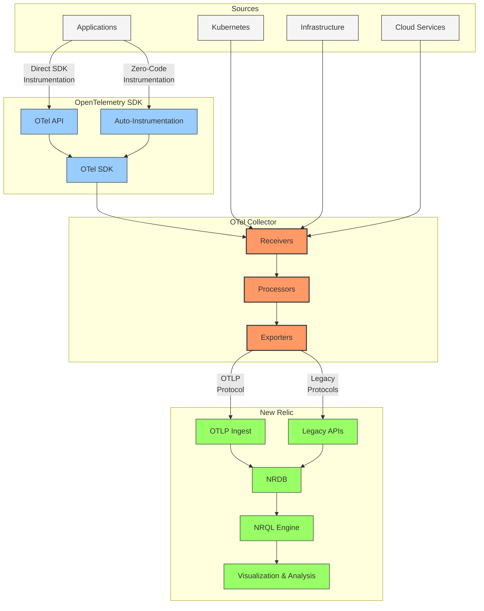
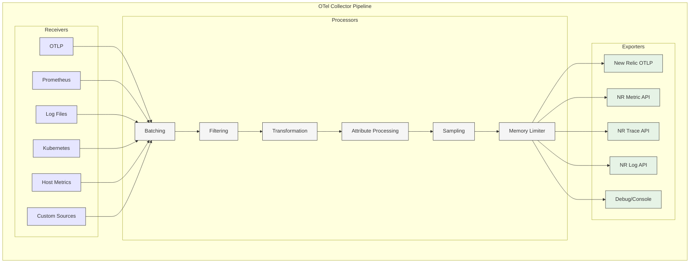
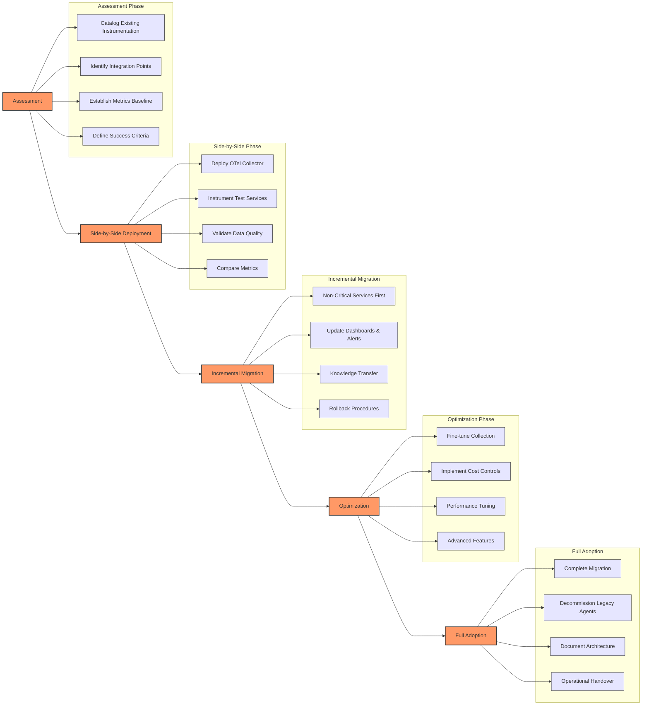
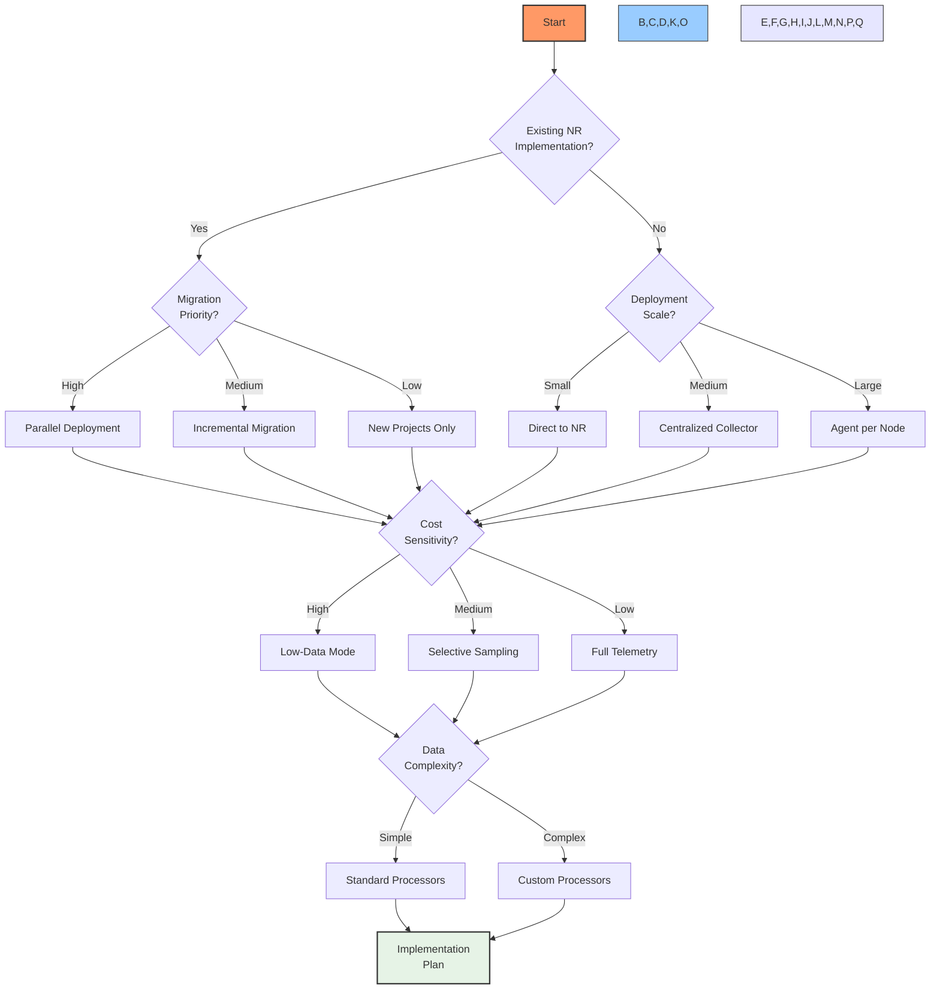

# OpenTelemetry Integration: The Future of New Relic Ingest

## Executive Summary

OpenTelemetry (OTel) has emerged as the industry standard for observability instrumentation, representing a paradigm shift in how telemetry data is collected, processed, and transmitted. This chapter explores New Relic's comprehensive integration with the OpenTelemetry ecosystem, examining the architectural components, implementation patterns, and operational considerations for enterprise Kubernetes environments.

New Relic's investment in OpenTelemetry goes beyond merely supporting the protocol—the platform has embraced OTel as a strategic direction, providing native OTLP (OpenTelemetry Protocol) ingestion endpoints, contributing actively to the OTel open-source community, and developing optimized exporters and integrations. This chapter will help practitioners understand how to leverage OpenTelemetry within the New Relic ecosystem while maximizing performance and controlling costs.

## OpenTelemetry Architecture

OpenTelemetry provides a vendor-neutral, unified approach to instrumentation and telemetry collection. When integrated with New Relic, it creates a flexible, extensible observability pipeline.



### Core Components

The OpenTelemetry integration with New Relic consists of several key components that work together to provide a complete observability solution:

1. **OTel Instrumentation**: Libraries and agents that capture telemetry from applications and infrastructure
2. **OTel Collector**: Central processing component that receives, transforms, and exports telemetry data
3. **OTLP Ingest API**: New Relic's native endpoint for receiving OpenTelemetry Protocol data
4. **Data Mapping Layer**: Translates between OTel and New Relic data models
5. **Query & Visualization**: New Relic tools for analyzing and visualizing OTel-sourced data

### Collector Architecture

The OpenTelemetry Collector serves as a critical intermediary in the telemetry pipeline, providing powerful capabilities for processing data before it reaches New Relic.



## Data Model Mapping

OpenTelemetry and New Relic use different data models and conventions for representing telemetry data. Understanding this mapping is essential for effective integration.

| OTel Data Type | New Relic Data Type | Mapping Details |
|----------------|---------------------|-----------------|
| **Metrics** | | |
| Gauge | Gauge Metric | Direct mapping with attribute preservation |
| Sum | Count Metric | Cumulative to delta conversion for non-monotonic sums |
| Histogram | Distribution Metrics | Maps to multiple metrics with percentile attributes |
| Summary | Summary Metrics | Direct mapping with count, sum, and quantile values |
| **Traces** | | |
| Span | Span | Direct mapping with attribute conversion |
| SpanLinks | Span Links | Direct mapping |
| Events | Span Events | Direct mapping with timestamp preservation |
| **Logs** | | |
| LogRecord | Log Event | Direct mapping with attribute preservation |
| **Context** | | |
| Resource | Entity + tags | Maps to New Relic entity with attributes |
| Scope | Instrumentation | Maps to source and library information |
| Attributes | Attributes | Conversion based on semantic conventions |

### Semantic Convention Conversion

OpenTelemetry defines standard semantic conventions for attributes that are automatically mapped to New Relic equivalents:

| OTel Semantic Convention | New Relic Attribute | Example Value |
|--------------------------|---------------------|---------------|
| service.name | service.name | "payment-processor" |
| service.namespace | service.namespace | "finance" |
| deployment.environment | environment | "production" |
| k8s.pod.name | kubernetes.podName | "payment-5d87f7c66-xjlw2" |
| k8s.namespace.name | kubernetes.namespaceName | "finance" |
| k8s.cluster.name | kubernetes.clusterName | "prod-east" |
| host.name | hostname | "ip-10-0-0-123" |
| host.id | hostId | "i-1234567890abcdef0" |
| cloud.provider | cloud.provider | "aws" |
| cloud.region | cloud.region | "us-east-1" |
| http.method | request.method | "POST" |
| http.status_code | response.status | 200 |
| db.system | db.system | "postgresql" |
| db.statement | db.statement | "SELECT * FROM users" |
| exception.type | error.class | "NullPointerException" |
| exception.message | error.message | "Object reference not set..." |

## Deployment Models

There are several patterns for deploying OpenTelemetry with New Relic, each with different tradeoffs:

```mermaid
flowchart TD
    subgraph "Direct-to-New Relic"
        directapp[Applications] -->|OTLP| directnr[New Relic OTLP Endpoint]
    end
    
    subgraph "Centralized Collector"
        centapp[Applications] -->|OTLP| centcol[Centralized Collector]
        centcol -->|OTLP| centnr[New Relic OTLP Endpoint]
    end
    
    subgraph "Agent-per-Node"
        nodeapp[Applications] -->|OTLP| nodecol[Node Collectors]
        nodecol -->|OTLP| gateway[Gateway Collector]
        gateway -->|OTLP| nodenr[New Relic OTLP Endpoint]
    end
    
    subgraph "Hierarchical Collection"
        teamapp[Team Applications] -->|OTLP| teamcol[Team Collectors]
        infraapp[Infrastructure] -->|OTLP| infracol[Infra Collectors]
        appsapp[Applications] -->|OTLP| appscol[App Collectors]
        
        teamcol & infracol & appscol -->|OTLP| regional[Regional Gateway]
        regional -->|OTLP| hiernr[New Relic OTLP Endpoint]
    end
    
    classDef apps fill:#e6e6ff,stroke:#333,stroke-width:1px
    classDef collectors fill:#f96,stroke:#333,stroke-width:2px
    classDef nr fill:#9f6,stroke:#333,stroke-width:1px
    
    class directapp,centapp,nodeapp,teamapp,infraapp,appsapp apps
    class centcol,nodecol,gateway,teamcol,infracol,appscol,regional collectors
    class directnr,centnr,nodenr,hiernr nr
```



### Deployment Pattern Comparison

| Deployment Pattern | Advantages | Disadvantages | Best For |
|-------------------|------------|--------------|-----------|
| **Direct-to-New Relic** | Simple setup<br>No infrastructure to manage<br>Lower latency | No local processing<br>No buffering during outages<br>Higher data volume to New Relic | Development environments<br>Small applications<br>Simple use cases |
| **Centralized Collector** | Single configuration point<br>Simplified management<br>Centralized processing | Single point of failure<br>May become a bottleneck<br>Network-intensive | Small to medium deployments<br>Environments with stable network<br>Initial OTel adoption |
| **Agent-per-Node** | Local data processing<br>Reduced network traffic<br>Better failure isolation | More complex deployment<br>Multiple configurations<br>Higher resource usage | Large Kubernetes clusters<br>High-volume telemetry<br>Multi-tenant environments |
| **Hierarchical Collection** | Domain-specific processing<br>Flexible collection topologies<br>Advanced filtering/sampling | Most complex architecture<br>Requires careful coordination<br>More components to manage | Enterprise deployments<br>Multi-cluster environments<br>Organizations with specialized teams |

## Kubernetes Implementation

Deploying OpenTelemetry in Kubernetes requires careful consideration of resource allocation, configuration management, and operational concerns.

### Kubernetes Manifest Example

Below is a reference implementation for deploying the OpenTelemetry Collector as a DaemonSet in Kubernetes:

```yaml
# otel-collector-daemonset.yaml
apiVersion: v1
kind: ConfigMap
metadata:
  name: otel-collector-conf
  namespace: monitoring
data:
  collector.yaml: |
    receivers:
      otlp:
        protocols:
          grpc:
            endpoint: 0.0.0.0:4317
          http:
            endpoint: 0.0.0.0:4318
      
      # Kubernetes metrics
      kubeletstats:
        collection_interval: 30s
        auth_type: "serviceAccount"
        endpoint: "${env:K8S_NODE_NAME}:10250"
        metric_groups:
          - container
          - pod
          - node
    
    processors:
      # Add Kubernetes metadata
      k8sattributes:
        auth_type: "serviceAccount"
        passthrough: false
        extract:
          metadata:
            - k8s.pod.name
            - k8s.pod.uid
            - k8s.deployment.name
            - k8s.namespace.name
            - k8s.node.name
            - k8s.container.name
      
      # Filter out unnecessary metrics
      filter:
        metrics:
          exclude:
            match_type: regexp
            metric_names:
              - go_.*
              - process_.*
      
      # Batch data for efficient transmission
      batch:
        send_batch_size: 10000
        timeout: 10s
      
      # Prevent memory issues
      memory_limiter:
        check_interval: 5s
        limit_percentage: 80
        spike_limit_percentage: 25
    
    exporters:
      # Send to New Relic via OTLP
      otlp:
        endpoint: https://otlp.nr-data.net:4317
        headers:
          api-key: ${env:NEW_RELIC_LICENSE_KEY}
      
      # Debug output for troubleshooting
      logging:
        verbosity: basic
    
    service:
      pipelines:
        metrics:
          receivers: [otlp, kubeletstats]
          processors: [k8sattributes, filter, batch, memory_limiter]
          exporters: [otlp, logging]
        
        traces:
          receivers: [otlp]
          processors: [k8sattributes, batch, memory_limiter]
          exporters: [otlp]
        
        logs:
          receivers: [otlp]
          processors: [k8sattributes, batch, memory_limiter]
          exporters: [otlp]
---
apiVersion: apps/v1
kind: DaemonSet
metadata:
  name: otel-collector
  namespace: monitoring
  labels:
    app: opentelemetry
    component: collector
spec:
  selector:
    matchLabels:
      app: opentelemetry
      component: collector
  template:
    metadata:
      labels:
        app: opentelemetry
        component: collector
    spec:
      serviceAccountName: otel-collector
      containers:
      - name: collector
        image: otel/opentelemetry-collector-contrib:latest
        resources:
          limits:
            cpu: 500m
            memory: 500Mi
          requests:
            cpu: 100m
            memory: 200Mi
        env:
          - name: K8S_NODE_NAME
            valueFrom:
              fieldRef:
                fieldPath: spec.nodeName
          - name: NEW_RELIC_LICENSE_KEY
            valueFrom:
              secretKeyRef:
                name: newrelic-secret
                key: license
        ports:
          - containerPort: 4317 # OTLP gRPC
          - containerPort: 4318 # OTLP HTTP
        volumeMounts:
          - name: config
            mountPath: /etc/otel/config.yaml
            subPath: collector.yaml
      volumes:
        - name: config
          configMap:
            name: otel-collector-conf
---
apiVersion: v1
kind: Service
metadata:
  name: otel-collector
  namespace: monitoring
  labels:
    app: opentelemetry
    component: collector
spec:
  ports:
  - name: otlp-grpc
    port: 4317
    protocol: TCP
    targetPort: 4317
  - name: otlp-http
    port: 4318
    protocol: TCP
    targetPort: 4318
  selector:
    app: opentelemetry
    component: collector
```

### Resource Allocation Guidelines

Proper resource allocation is critical for the OpenTelemetry Collector. The following table provides guidelines based on telemetry volume:

| Workload Size | CPU Request | CPU Limit | Memory Request | Memory Limit | Batch Size | Collection Interval |
|---------------|-------------|-----------|----------------|--------------|------------|---------------------|
| Small (<10 nodes) | 100m | 500m | 200Mi | 500Mi | 1000 | 30s |
| Medium (10-50 nodes) | 200m | 1000m | 400Mi | 800Mi | 5000 | 30s |
| Large (50-100 nodes) | 500m | 1500m | 800Mi | 1.5Gi | 10000 | 30s-60s |
| X-Large (>100 nodes) | 1000m | 2000m | 1.5Gi | 3Gi | 15000 | 60s |

### Performance Tuning

The following configuration options can significantly impact the performance and resource usage of the OpenTelemetry Collector:

| Configuration | Purpose | Recommendation |
|---------------|---------|----------------|
| **Memory Limiter** | Prevents OOM situations | Enable with 80% limit and 25% spike |
| **Batch Size** | Controls transmission efficiency | Balance between latency and throughput |
| **Collection Interval** | Affects data resolution and volume | Increase for larger environments |
| **Processors Pipeline** | Order of data processing | Put filtering before resource-intensive processors |
| **Queue Size** | Controls backpressure handling | Set based on expected traffic spikes |
| **Number of Workers** | Parallel processing capacity | Typically 2-4× available CPU cores |
| **Timeout Settings** | Prevents resource exhaustion | Add timeouts to all external communications |

## Advanced Configurations

### Tail-Based Sampling

Tail sampling makes sampling decisions based on complete traces, allowing for intelligent data reduction while preserving critical information:

```yaml
processors:
  tail_sampling:
    decision_wait: 10s
    num_traces: 50000
    expected_new_traces_per_sec: 1000
    
    # Sampling policies - each defines criteria for keeping traces
    policies:
      # Keep all traces with errors
      - name: error-policy
        type: status_code
        status_code:
          status_codes: [ERROR]
      
      # Keep slow traces (>1s)
      - name: latency-policy
        type: latency
        latency:
          threshold_ms: 1000
      
      # Keep traces for critical operations
      - name: important-routes
        type: string_attribute
        string_attribute:
          key: http.route
          values:
            - /api/payment
            - /api/checkout
            - /api/authentication
          enabled_regex: true
      
      # Sample remaining traces at 5%
      - name: probabilistic-policy
        type: probabilistic
        probabilistic:
          sampling_percentage: 5
```

### Attribute Transformation

The OpenTelemetry Transformation Language (OTTL) provides powerful capabilities for manipulating attributes before they reach New Relic:

```yaml
processors:
  transform:
    # Span transformations
    trace_statements:
      - context: span
        statements:
          # Convert OTel error attributes to New Relic format
          - set(attributes["error.class"], attributes["exception.type"]) where attributes["exception.type"] != nil
          - set(attributes["error.message"], attributes["exception.message"]) where attributes["exception.message"] != nil
          
          # Add custom categorization
          - set(attributes["tier"], "web") where attributes["http.route"] matches "^/api/.*$"
          - set(attributes["tier"], "service") where attributes["rpc.service"] != nil
          - set(attributes["tier"], "db") where attributes["db.system"] != nil
      
    # Metric transformations
    metric_statements:
      - context: metric
        statements:
          # Rename metrics to match New Relic conventions
          - set(name, Concat("custom.", name)) where name startswith "app_"
          
      - context: datapoint
        statements:
          # Add application context to all datapoints
          - set(attributes["application"], "payment-service")
          # Convert units
          - set(attributes["unit"], "seconds") where metric.name == "http.server.duration" and attributes["unit"] == "s"
```

### Low-Data Mode for Cost Optimization

For environments with cost constraints, a low-data configuration can significantly reduce ingested data volume:

```yaml
processors:
  # Targeted metric filtering
  filter:
    metrics:
      include:
        match_type: regexp
        metric_names:
          # Core system metrics
          - ^system\.cpu\..*
          - ^system\.memory\..*
          - ^system\.disk\..*
          - ^system\.network\..*
          # Key application metrics
          - ^http\.server\.duration$
          - ^http\.server\.request\.count$
          - ^db\.client\..*\.duration$
          - error\.count
  
  # Aggressive trace sampling
  probabilistic_sampler:
    sampling_percentage: 5
  
  # Log filtering
  filter/logs:
    logs:
      include:
        match_type: regexp
        record_attributes:
          - key: severity
            value: "(error|critical|alert|emergency)"
```

## Migrating to OpenTelemetry

Many organizations are gradually transitioning from New Relic's proprietary agents to OpenTelemetry. The following migration framework provides a structured approach:



### Migration Decision Framework

| Consideration | Keep NR Agent | Migrate to OTel | Hybrid Approach |
|---------------|---------------|-----------------|-----------------|
| **Data Model Complexity** | Simple data model with standard metrics | Complex custom metrics and attributes | Gradual transition with mapping layer |
| **Organization Maturity** | Limited DevOps resources | Strong engineering culture | Center of Excellence approach |
| **Application Architecture** | Legacy monoliths | Modern microservices | Mixed environment |
| **Vendor Strategy** | Single-vendor commitment | Multi-vendor or OSS strategy | Phased vendor evaluation |
| **Operational Overhead** | Minimal maintenance preferred | Willing to manage collector infrastructure | Managed collectors with some customization |
| **Technical Roadmap** | Stability over innovation | Embracing industry standards | Controlled evolution |
| **Cost Sensitivity** | Fixed predictable costs | Willing to optimize with engineering effort | Cost-based segmentation |

### Feature Parity Considerations

When migrating, it's important to verify feature parity between New Relic agents and OpenTelemetry:

| Feature | NR Agent | OTel Solution | Migration Notes |
|---------|----------|--------------|-----------------|
| Basic Metrics | ✅ Built-in | ✅ Various receivers | Direct replacement |
| Distributed Tracing | ✅ Automatic | ✅ Manual context propagation | Verify context propagation |
| Auto-Instrumentation | ✅ Comprehensive | ✅ Language-dependent | Check language support |
| Custom Attributes | ✅ Agent API | ✅ OTel API | Map attribute names |
| Error Tracking | ✅ Automatic capture | ⚠️ Manual in some cases | Add error processing |
| Database Monitoring | ✅ Automatic details | ⚠️ Basic in some languages | Verify DB visibility |
| External Services | ✅ Automatic detection | ⚠️ Requires configuration | Add HTTP client instrumentation |
| Custom Metrics | ✅ Agent API | ✅ OTel Metrics API | Adapt custom instrumentation |
| Serverless Support | ✅ Native support | ⚠️ Emerging support | Test thoroughly |
| Browser Monitoring | ✅ Integrated | ❌ Separate solution | Maintain NR Browser|

## Troubleshooting

### Common Issues

| Issue | Symptoms | Potential Causes | Resolution Steps |
|-------|----------|------------------|-----------------|
| **Missing Data** | Metrics/traces not appearing in NR | Collector configuration errors<br>Network issues<br>Incorrect API key | Verify collector logs<br>Check network connectivity<br>Validate API key |
| **Data Mapping Issues** | Incorrect attribute names<br>Missing entity correlation | Semantic convention differences<br>Missing required attributes | Add transformation processors<br>Ensure service.name is set<br>Add required entity attributes |
| **Collector Performance** | High memory usage<br>CPU spikes<br>Data drops | Insufficient resources<br>Improper batch sizing<br>Memory limits too low | Increase resource allocation<br>Adjust batch settings<br>Configure memory_limiter properly |
| **Duplicate Data** | Same metrics appearing twice<br>Double-counting | Simultaneous agent & OTel instrumentation<br>Multiple collector instances | Ensure single source of truth<br>Check collector configurations<br>Use filtering to deduplicate |
| **High Data Volume** | Excessive ingest<br>Increased costs | Missing filters<br>Too many dimensions<br>No sampling configured | Implement filtering<br>Reduce high-cardinality attributes<br>Add appropriate sampling |
| **Context Propagation** | Broken trace context<br>Disconnected spans | Missing propagators<br>Inconsistent header usage<br>Mixed instrumentation | Verify propagator configuration<br>Standardize context headers<br>Check cross-service tracing |

### Diagnostic Tools

| Tool | Purpose | Usage |
|------|---------|-------|
| **Collector Logging** | View processing details | Enable debug logging for troubleshooting |
| **Collector Metrics** | Monitor collector health | Deploy with telemetry enabled |
| **Collector Health Check** | Verify collector status | Use /health endpoint |
| **NRQL Queries** | Analyze ingested data | Track data volume and patterns |
| **NR Workloads** | Monitor collector entities | Group collectors for unified visibility |
| **OTel Protocol Buffer Debugging** | Inspect raw data | Use protobuf debugging tools |

### Diagnostic Process

When troubleshooting OpenTelemetry issues with New Relic:

1. **Check Collector Logs**:
   ```bash
   kubectl logs -n monitoring -l app=opentelemetry,component=collector
   ```

2. **Verify Connectivity**:
   ```bash
   kubectl exec -it -n monitoring otel-collector-xyz -- curl -v https://otlp.nr-data.net:4317
   ```

3. **Inspect Collector Metrics**:
   ```bash
   kubectl port-forward -n monitoring svc/otel-collector 8888:8888
   curl localhost:8888/metrics
   ```

4. **Test OTLP Endpoint**:
   ```bash
   grpcurl -H "api-key: YOUR_LICENSE_KEY" -d '{"resource": {}}' otlp.nr-data.net:4317 opentelemetry.proto.collector.trace.v1.TraceService/Export
   ```

5. **Analyze Data in New Relic**:
   ```sql
   -- Check for incoming OTLP data
   FROM Metric SELECT count(*) WHERE instrumentation.provider = 'opentelemetry' FACET service.name TIMESERIES
   
   -- Look for missing attributes
   FROM Span SELECT count(*) WHERE instrumentation.provider = 'opentelemetry' AND service.name IS NULL
   ```

## Future Directions

As OpenTelemetry and New Relic continue to evolve, several emerging trends and features are worth monitoring:

### 1. Unified Agent Strategy

New Relic is increasingly embracing OpenTelemetry as its primary instrumentation strategy, with future agent versions likely to be built on OTel foundations.

### 2. Enhanced OTTL Support

Advanced transformation capabilities using OTTL will enable more sophisticated data processing within the collector pipeline.

### 3. Entity Catalog Integration

Deeper integration between OTel resource attributes and New Relic's entity catalog will improve correlation and context.

### 4. Collector as a Gateway

The OTel Collector is evolving into a full observability gateway with additional capabilities beyond collection and processing.

### 5. eBPF Integration

Combining OpenTelemetry with eBPF for kernel-level monitoring will provide deeper infrastructure insights with minimal overhead.

## Implementation Decision Framework

When implementing OpenTelemetry with New Relic, consider the following decision points:



## Conclusion

OpenTelemetry represents a strategic shift in New Relic's approach to observability, providing customers with a vendor-neutral, standards-based path for instrumentation and telemetry collection. By embracing OpenTelemetry while maintaining compatibility with existing systems, New Relic offers organizations flexibility in their observability journey.

For Kubernetes environments, OpenTelemetry provides particularly compelling benefits, including:

1. **Standardized Instrumentation**: Consistent telemetry across heterogeneous services and infrastructure
2. **Local Processing**: Efficient data handling before transmission to New Relic
3. **Cost Control**: Granular filtering and sampling to optimize data ingest
4. **Enhanced Kubernetes Context**: Rich metadata integration from the Kubernetes API
5. **Vendor Flexibility**: Freedom to adapt observability strategy over time

As the OpenTelemetry ecosystem continues to mature, we can expect even deeper integration with New Relic and additional capabilities that further enhance the observability experience.

---

**Next Chapter**: [Advanced Pipelines](../04_NR_OTel_Stack/01_Advanced_Pipelines.md)