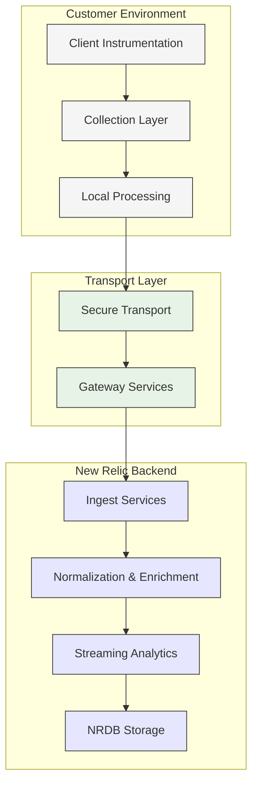

# Ingest Topology Overview

## Nine-Plane Architecture

New Relic's ingest architecture consists of nine distinct planes, each responsible for specific aspects of the observability pipeline. This architecture is designed to provide flexibility, scalability, and reliability at global scale.

### 1. Client Instrumentation Plane

The instrumentation plane consists of various mechanisms that capture telemetry data directly from applications, services, and infrastructure components:

- **APM Agents**: Language-specific agents (Java, .NET, Node.js, etc.) that instrument application code
- **Browser Agents**: JavaScript-based monitoring for web applications
- **Mobile Agents**: iOS and Android SDKs for mobile application monitoring
- **Infrastructure Agents**: System-level monitoring of hosts and containers
- **Kubernetes Integration**: kube-state-metrics, kubelet metrics, and control plane monitoring
- **Serverless Integrations**: AWS Lambda layers, Azure Functions, and Google Cloud Functions instrumentation

### 2. Collection Layer

The collection layer aggregates and buffers telemetry data before transmission:

- **Flex Integration Framework**: Extensible plugin architecture for custom integrations
- **OpenTelemetry Collectors**: Standards-based collection of metrics, traces, and logs
- **Log Forwarders**: Fluentd, Fluent Bit, and Vector configurations
- **On-premises Proxy**: Edge collection for air-gapped or restricted environments
- **Infinite Tracing Edge**: Head-based sampling for distributed traces

### 3. Local Processing Plane

Before transmitting data to New Relic, local processing occurs to optimize for bandwidth and relevance:

- **Aggregation**: Local statistical summaries to reduce data volume
- **Filtering**: Removal of irrelevant or sensitive information
- **Transformation**: Standardization of data formats and structures
- **Batching**: Efficient grouping of related telemetry
- **Sampling**: Intelligent reduction of high-volume data streams

### 4. Secure Transport Plane

All communication with New Relic is secured through:

- **TLS 1.3+**: Encrypted communications
- **Certificate Pinning**: Protection against MITM attacks
- **Compression**: gzip/deflate payload optimization
- **Retry Logic**: Exponential backoff and jitter for resilience
- **Circuit Breaking**: Failure detection and isolation

### 5. Gateway Services Plane

The first contact point within New Relic's infrastructure:

- **Regional Endpoints**: Global edge presence for reduced latency
- **Load Balancing**: Traffic distribution across ingest clusters
- **Rate Limiting**: Protection against traffic spikes
- **Authentication**: License key validation and account mapping
- **Initial Validation**: Schema and payload verification

### 6. Ingest Services Plane

Specialized services process different types of telemetry:

- **Metric API**: Dimensional metric ingestion
- **Event API**: Custom and structured events
- **Log API**: Log message processing
- **Trace API**: Distributed trace collection
- **Entity Synthesis**: Automatic entity discovery and correlation

### 7. Normalization & Enrichment Plane

Raw telemetry is enhanced with contextual information:

- **Entity Decoration**: Linking telemetry to entities (applications, services, hosts)
- **Metadata Tagging**: Addition of account, environment, and location context
- **Standardization**: Conversion to common naming conventions
- **Deduplication**: Removal of redundant telemetry
- **Schema Enforcement**: Validation against expected data structures

### 8. Streaming Analytics Plane

Real-time processing occurs before final storage:

- **Anomaly Detection**: Identification of unusual patterns
- **Alerting Evaluation**: Assessment against alert conditions
- **Stream Processing**: Continuous aggregation and transformation
- **Derived Metrics**: Calculation of higher-level indicators
- **SLO Tracking**: Continuous evaluation of service level objectives

### 9. NRDB Storage Plane

The final destination for all telemetry data:

- **High-speed Ingestion**: Parallel write paths for different data types
- **Columnar Storage**: Optimized for analytical queries
- **Index Management**: Efficient search capability
- **Retention Policies**: Time-based data lifecycle management
- **Query Engine**: High-performance analytical processing

## Integration Points

The nine-plane architecture provides several key integration points where customers can insert or extract data:

| Integration Point | Protocols | Use Cases |
|-------------------|-----------|-----------|
| **Client SDKs** | OpenTelemetry, New Relic API | Direct instrumentation of custom applications |
| **Collection Layer** | OTLP, Prometheus, Statsd, FluentD | Aggregation from multiple sources |
| **Transport Layer** | HTTP/HTTPS, gRPC | Custom forwarders or proxies |
| **API Endpoints** | REST, JSON | External systems pushing telemetry |
| **Query Interface** | NRQL, GraphQL | Extracting data for external systems |

## Performance Characteristics

The ingest architecture is designed for high throughput and low latency:

- **Ingest Capacity**: >20M data points per second per account
- **End-to-End Latency**: <10 seconds for 99th percentile
- **Query Performance**: Sub-second p95 for common queries over 30-day windows
- **Availability**: 99.99% uptime commitment
- **Global Distribution**: 15+ regions worldwide

## Key Considerations

When designing New Relic ingestion workflows:

1. **Batching Efficiency**: Group related telemetry to reduce HTTP overhead (optimal batch size ≈ 1MB)
2. **Cardinality Management**: Apply label filtering before transmission to control unique combinations
3. **Background Transmission**: Implement asynchronous sending to avoid impacting application performance
4. **Buffering Strategy**: Size local buffers based on expected transmission interruptions
5. **Transport Compression**: Enable compression for all payloads to reduce bandwidth by 5-10×

The nine-plane architecture provides a comprehensive foundation for understanding how telemetry flows through the New Relic ecosystem, which we'll explore in more detail in subsequent chapters.