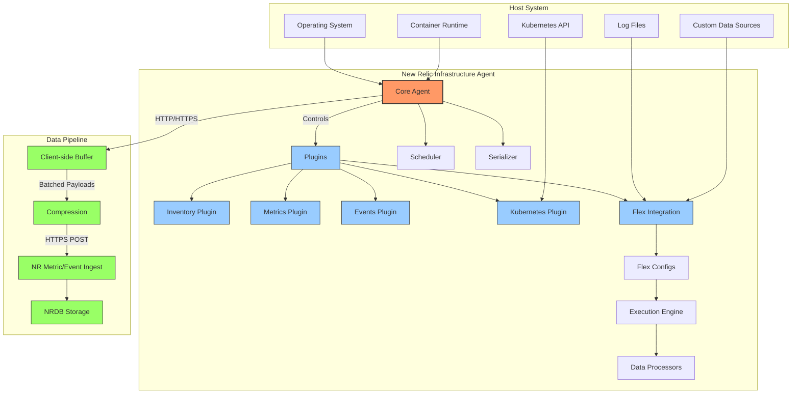

# Infra & Flex Agents

## Overview

§ New Relic Infrastructure agent serves as the foundation for platform-level observability in New Relic's ecosystem. This chapter explores the internal architecture of the Infrastructure agent, with special focus on the Flex integration framework that enables extensible monitoring capabilities. We'll examine the agent's data flow, configuration options, performance characteristics, and best practices for Kubernetes environments.

§ The Infrastructure agent is designed as a lightweight, modular monitor that collects system metrics, inventory data, and events from hosts and containers. Written in Go for cross-platform compatibility and performance, it uses a plugin-based architecture where the Core agent manages the lifecycle of various integrations, including the Kubernetes integration and Flex.

## Agent Architecture

### DG-10A: Infrastructure Agent Stack Architecture



### Core Components

§ The Infrastructure agent is composed of several key components:

1. **Core Agent**: Manages lifecycle, scheduling, and communication with New Relic backends
2. **Plugin Manager**: Loads and coordinates various integrations
3. **Inventory Collector**: Gathers system configuration and package information
4. **Metric Harvester**: Collects and processes system metrics
5. **Event Processor**: Captures system events (e.g., process starts, container creation)
6. **Kubernetes Integration**: Specialized plugin for Kubernetes metadata and metrics
7. **Flex Integration Framework**: Extensible system for custom metric collection

### Data Flow & Processing

§ Data flows through the Infrastructure agent in a well-defined path:

1. Raw data is collected from various sources (OS, K8s, Docker, etc.)
2. Data is normalized into New Relic's data model
3. Metrics and events are batched for efficient transmission
4. Batches are compressed and transmitted via HTTPS to New Relic's ingest APIs
5. Client-side buffering handles temporary connectivity issues

### EQ-10A: Batch Size Optimization

```
Optimal Batch Size = min(
    max_batch_size,
    throughput_rate × target_latency
)

Where:
- max_batch_size = Maximum allowed batch size (default: 1MB)
- throughput_rate = Data collection rate (KB/s)
- target_latency = Acceptable delay before data transmission (s)
```

For example, with a throughput of 50KB/s and target latency of 10s:
```
Optimal Batch Size = min(1024KB, 50KB/s × 10s) = min(1024KB, 500KB) = 500KB
```

This formula helps balance network efficiency against data freshness.

## Flex Integration Framework

§ The Flex integration is a versatile subsystem within the Infrastructure agent that enables custom data collection without requiring code changes. Flex uses YAML configuration files to define data sources, collection intervals, and transformation rules.

### CF-10B: Sample Flex YAML Configuration

```yaml
---
# Basic metrics collection using Flex
name: system-metrics-flex
description: Additional system metrics collected via Flex
integration_name: com.newrelic.metrics

# Collection interval in seconds
interval: 30

# Data sources and metrics definition
apis:
  - name: SystemMetricsAPI
    # Command-based metric collection
    commands:
      # CPU metrics collection via `vmstat`
      - run: vmstat 1 2 | tail -1
        split: horizontal
        split_by: \s+
        set_header: [skip, skip, swap_in, swap_out, io_in, io_out, system_interrupts, system_context_switches, user_cpu, system_cpu, idle_cpu, wait_cpu, steal_cpu, cache_memory]
        metric_parser:
          system_interrupts:
            metric_type: gauge
            metric_name: system.interrupts
            metric_value: ${system_interrupts}
          system_context_switches:
            metric_type: gauge
            metric_name: system.contextSwitches
            metric_value: ${system_context_switches}
          user_cpu:
            metric_type: gauge
            metric_name: system.cpu.userPercent
            metric_value: ${user_cpu}
          system_cpu:
            metric_type: gauge
            metric_name: system.cpu.systemPercent
            metric_value: ${system_cpu}
          idle_cpu:
            metric_type: gauge
            metric_name: system.cpu.idlePercent
            metric_value: ${idle_cpu}
      
      # Memory usage via `free`
      - run: free | grep Mem
        split: horizontal
        split_by: \s+
        set_header: [name, total, used, free, shared, cache, available]
        metric_parser:
          total:
            metric_type: gauge
            metric_name: memory.totalBytes
            metric_value: ${total}
          used:
            metric_type: gauge
            metric_name: memory.usedBytes
            metric_value: ${used}
          free:
            metric_type: gauge
            metric_name: memory.freeBytes
            metric_value: ${free}
          available:
            metric_type: gauge
            metric_name: memory.availableBytes
            metric_value: ${available}
        
      # Disk space via `df`
      - run: df -PT -x tmpfs -x devtmpfs | grep -v Filesystem
        split: horizontal
        split_by: \s+
        set_header: [device, type, total, used, available, percentUsed, mountPoint]
        metric_parser:
          device:
            metric_type: attribute
            metric_name: device
          mountPoint:
            metric_type: attribute
            metric_name: mountPoint
          total:
            metric_type: gauge
            metric_name: disk.totalBytes
            metric_value: ${total}
            multiply_by: 1024 # Convert KB to bytes
          used:
            metric_type: gauge
            metric_name: disk.usedBytes
            metric_value: ${used}
            multiply_by: 1024 # Convert KB to bytes
          available:
            metric_type: gauge 
            metric_name: disk.availableBytes
            metric_value: ${available}
            multiply_by: 1024 # Convert KB to bytes
```

### Key Flex Capabilities

1. **Multiple Data Source Types:**
   - Commands (shell execution)
   - HTTP endpoints (API calls)
   - Files (structured and unstructured)
   - WMI queries (Windows)
   - SQL databases

2. **Data Processing Functions:**
   - Text splitting and extraction
   - Numeric conversions
   - Mathematical operations
   - Regex pattern matching
   - JSON/XML/CSV parsing

3. **Output Formatting:**
   - Metric generation
   - Event creation
   - Inventory updates
   - Dimensional data modeling

## Kubernetes Integration

§ The Kubernetes integration is a specialized component of the Infrastructure agent designed to collect comprehensive telemetry from Kubernetes clusters. It operates in two deployment modes:

1. **DaemonSet Mode**: An agent runs on each node, collecting node-level and pod-level metrics
2. **Cluster Agent Mode**: A centralized agent collects cluster-wide resources and control plane metrics

### CF-10C: Kubernetes Integration Configuration

```yaml
# Infrastructure agent Kubernetes configuration
cat << EOF > /etc/newrelic-infra/integrations.d/kubernetes-config.yml
integration_name: com.newrelic.kubernetes

instances:
  - name: kubernetes-metrics
    command: metrics
    arguments:
      # Control Plane monitoring
      cluster_name: production-east
      
      # Discovery configuration
      discovery:
        # Namespaces to monitor (empty means "all")
        namespaces: []
        
      # Container metrics configuration  
      container_metrics:
        enabled: true
        
      # Kubernetes state metrics
      etcd:
        enabled: true
        endpoint: https://127.0.0.1:2379
        ca_file: /etc/kubernetes/pki/etcd/ca.crt
        cert_file: /etc/kubernetes/pki/etcd/server.crt
        key_file: /etc/kubernetes/pki/etcd/server.key
      
      # API Server metrics
      api_server:
        enabled: true
        endpoint: https://kubernetes.default.svc
        
      # Scheduler metrics
      scheduler:
        enabled: true
        
      # Controller Manager metrics
      controller_manager:
        enabled: true
      
      # Node metrics
      kubelet:
        enabled: true
        
      # Horizontal Pod Autoscaler metrics
      hpa:
        enabled: true
EOF
```

## Common Issues & Troubleshooting

### RB-10A: Infrastructure Agent Connection Issues Runbook

#### Symptoms
- Agent appears in CONNECTING state persistently
- No data flowing to New Relic
- Agent logs show connection errors

#### Diagnostic Steps

1. **Verify Network Connectivity**
   ```bash
   # Test connectivity to New Relic endpoints
   curl -v https://metric-api.newrelic.com/metric/v1/infra
   ```

2. **Check Agent Status**
   ```bash
   # Linux
   systemctl status newrelic-infra
   
   # Review logs
   tail -f /var/log/newrelic-infra/newrelic-infra.log
   ```

3. **Verify License Key Configuration**
   ```bash
   grep -r "license_key" /etc/newrelic-infra/
   ```

4. **Check Proxy Configuration**
   ```bash
   grep -r "proxy" /etc/newrelic-infra/
   ```

5. **Test DNS Resolution**
   ```bash
   nslookup metric-api.newrelic.com
   ```

#### Resolution Steps

1. **Network Issues**
   - Configure proxy settings if required
   - Allow outbound connectivity on ports 443/80
   - Check firewall rules

2. **License Key Issues**
   - Verify license key is correct
   - Ensure no whitespace in configuration

3. **Agent Stuck**
   ```bash
   # Force agent restart
   systemctl stop newrelic-infra
   rm -f /var/db/newrelic-infra/newrelic-infra.db
   systemctl start newrelic-infra
   ```

4. **Data Volume Issues**
   - Check if hitting rate limits
   - Verify disk space for agent buffer

### Performance Tuning

§ Infrastructure agent performance can be optimized based on host resources and expected telemetry volume:

#### TB-10B: Infrastructure Agent Performance Settings

| Configuration | Default | Low-Resource Host | High-Volume Host | Description |
|---------------|---------|-------------------|------------------|-------------|
| `interval_sec` | 30 | 60 | 15 | Collection interval in seconds |
| `payload_queue_size` | 1000 | 500 | 5000 | Max number of payloads to buffer |
| `max_procs` | auto | 1 | 4+ | Go runtime thread limit |
| `verbose` | 0 | 0 | 1 | Logging verbosity (0-4) |
| `http_timeout` | 30 | 60 | 15 | HTTP timeout in seconds |
| `compress_payload` | true | true | true | Enable payload compression |

## Kubernetes Best Practices

§ When deploying the Infrastructure agent in Kubernetes environments, consider these best practices:

1. **Resource Limits**
   - Set reasonable CPU/memory limits to prevent node resource exhaustion
   - Typical limits: 200m CPU, 256Mi memory per agent

2. **Toleration Configuration**
   - Configure tolerations to ensure agents run on all nodes, including control plane
   - Add tolerations for tainted nodes

3. **Volume Mounts**
   - Mount necessary host paths (/var/run/docker.sock, /sys, /proc) as read-only
   - Use projected volume mounts for sensitive credentials

4. **Security Context**
   - Run with minimal permissions using security contexts
   - Use read-only root filesystem where possible

5. **Network Policy**
   - Implement network policies to restrict agent communication
   - Allow only necessary egress traffic

### CF-10D: Optimized Kubernetes Deployment

```yaml
apiVersion: apps/v1
kind: DaemonSet
metadata:
  name: newrelic-infrastructure
  namespace: monitoring
spec:
  selector:
    matchLabels:
      name: newrelic-infrastructure
  template:
    metadata:
      labels:
        name: newrelic-infrastructure
    spec:
      serviceAccountName: newrelic-infrastructure
      containers:
        - name: newrelic-infrastructure
          image: newrelic/infrastructure-k8s:latest
          resources:
            limits:
              memory: 256Mi
              cpu: 200m
            requests:
              memory: 128Mi
              cpu: 100m
          securityContext:
            privileged: false
            allowPrivilegeEscalation: false
            runAsUser: 1000
            readOnlyRootFilesystem: true
            capabilities:
              add:
                - SYS_PTRACE
          env:
            - name: NRIA_LICENSE_KEY
              valueFrom:
                secretKeyRef:
                  name: newrelic-license
                  key: license
            - name: CLUSTER_NAME
              value: "production-east"
            - name: NRIA_VERBOSE
              value: "0"
            - name: NRIA_HTTP_TIMEOUT
              value: "30"
            - name: NRIA_PAYLOAD_COMPRESSION_LEVEL
              value: "6"
            - name: NRIA_CUSTOM_ATTRIBUTES
              value: '{"dataCenter":"us-east","environment":"production"}'
            - name: NRIA_LOW_DATA_MODE
              value: "false"
          volumeMounts:
            - mountPath: /var/run/docker.sock
              name: docker-socket
              readOnly: true
            - mountPath: /host
              name: host-volume
              readOnly: true
            - mountPath: /var/db/newrelic-infra
              name: agent-state
            - mountPath: /etc/newrelic-infra
              name: config-volume
      volumes:
        - name: docker-socket
          hostPath:
            path: /var/run/docker.sock
        - name: host-volume
          hostPath:
            path: /
        - name: agent-state
          emptyDir: {}
        - name: config-volume
          configMap:
            name: newrelic-infrastructure-config
      tolerations:
        - key: node-role.kubernetes.io/master
          effect: NoSchedule
          operator: Exists
```

## Integration with Other Systems

§ The Infrastructure agent can integrate with several other monitoring and management systems:

1. **Prometheus** - Scrape and forward Prometheus metrics
2. **Istio** - Collect service mesh telemetry
3. **Log Forwarding** - Forward logs to Logging endpoints
4. **APM Correlation** - Link infrastructure data with application telemetry
5. **Ansible/Chef/Puppet** - Automated deployment and configuration

## Conclusion

§ New Relic's Infrastructure agent provides a robust foundation for infrastructure monitoring, particularly in Kubernetes environments. The Flex integration framework extends its capabilities to cover virtually any telemetry source, making it a versatile component in New Relic's observability stack. By understanding its architecture, configuration options, and best practices, teams can implement effective, scalable monitoring for their infrastructure.

---

**Next Chapter**: [OpenTelemetry in NR](./13_OpenTelemetry_NR.md)