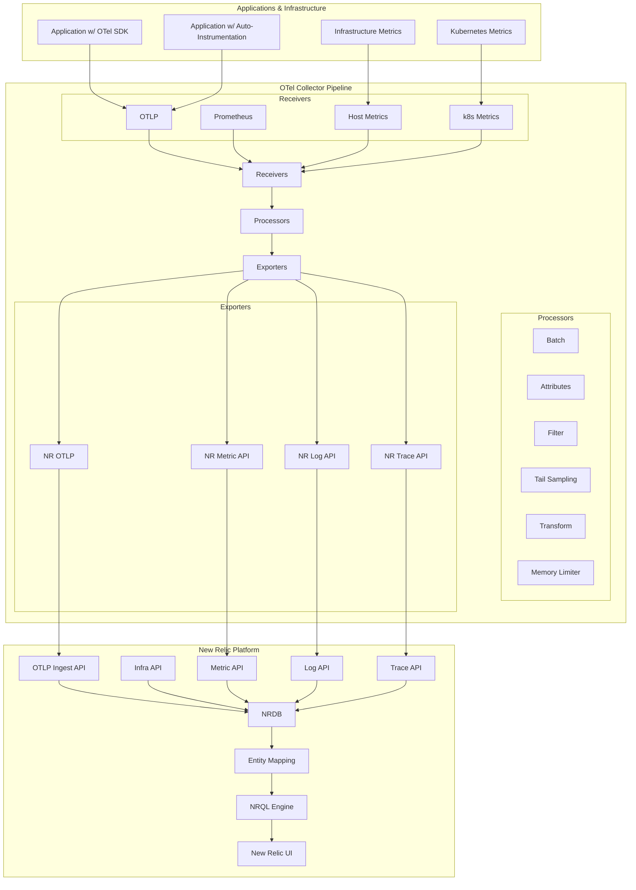

# OpenTelemetry in NR

## Overview

§ OpenTelemetry (OTel) has emerged as the open-source standard for telemetry collection across the industry, with New Relic becoming a leading contributor and adopter of the framework. This chapter explores the deep integration between OpenTelemetry and New Relic, covering architecture, implementation patterns, and advanced configurations. We'll examine how New Relic has adapted its platform to embrace the OTel ecosystem while maintaining compatibility with proprietary protocols.

§ OpenTelemetry provides a vendor-neutral framework for instrumenting applications and systems, collecting metrics, traces, and logs, and exporting them to various backends. New Relic's support for OTel spans multiple layers - from SDKs and auto-instrumentation, through the Collector pipeline, to native OTLP ingestion and storage. This comprehensive approach allows teams to adopt OTel standards without sacrificing the advanced analytics capabilities of New Relic's platform.

## OpenTelemetry Architecture in New Relic

### DG-13A: OpenTelemetry Integration Flow



### Core Components

§ The OpenTelemetry integration with New Relic consists of several key components:

1. **OTel SDKs and Auto-Instrumentation**: Libraries for manual or automatic instrumentation of applications
2. **OTel Collector**: Central component for processing telemetry before forwarding to New Relic
3. **OTel Protocol (OTLP) Endpoint**: New Relic's native OTLP ingestion service
4. **Backward Compatibility Layers**: Mapping OTel data models to New Relic's existing schemas
5. **Semantic Convention Mapping**: Translation between OTel and New Relic attribute conventions

## OpenTelemetry Data Model in New Relic

§ The OpenTelemetry data model maps to New Relic's data types in specific ways:

### TB-13A: OTel to New Relic Data Mapping

| OTel Data Type | New Relic Data Type | Notes |
|----------------|---------------------|-------|
| Metrics - Gauge | Metric | Direct mapping |
| Metrics - Sum | Metric | Direct mapping |
| Metrics - Histogram | Metric | Maps to multiple metrics with percentile suffixes |
| Traces - Span | Span | Direct mapping |
| Traces - SpanEvent | SpanEvent | Direct mapping |
| Logs - LogRecord | Log | Direct mapping |
| Resources | Entity + tags | Maps to New Relic entity with attributes |

### TB-13B: Semantic Conventions Mapping

| OTel Attribute | New Relic Attribute | Example Value |
|----------------|---------------------|---------------|
| service.name | service.name | "payment-service" |
| service.namespace | service.namespace | "shop" |
| k8s.pod.name | kubernetes.podName | "payment-5d87f7c66-xjlw2" |
| k8s.namespace.name | kubernetes.namespaceName | "production" |
| host.name | host | "ip-10-0-0-123" |
| http.method | request.method | "POST" |
| http.status_code | response.status | 200 |
| db.system | db.system | "postgresql" |
| db.statement | db.statement | "SELECT * FROM users" |
| exception.type | error.class | "NullPointerException" |
| exception.message | error.message | "Object reference not set..." |

## OTel Collector for New Relic

§ The OpenTelemetry Collector serves as a critical intermediary in the telemetry pipeline, providing powerful capabilities for processing data before it reaches New Relic. When configured for New Relic, the Collector can:

1. Filter unnecessary metrics to reduce ingest costs
2. Transform attributes to match New Relic conventions
3. Apply tail-based sampling for traces
4. Add contextual metadata like Kubernetes labels
5. Batch telemetry for efficient transmission

### CF-13A: Basic OTel Collector Configuration for New Relic

```yaml
# otel-collector-config.yaml
receivers:
  otlp:
    protocols:
      grpc:
        endpoint: 0.0.0.0:4317
      http:
        endpoint: 0.0.0.0:4318
  
  # K8s metrics collection
  kubeletstats:
    collection_interval: 20s
    auth_type: "serviceAccount"
    endpoint: "${env:K8S_NODE_NAME}:10250"
    metric_groups:
      - container
      - pod
      - node
    extra_metadata_labels:
      - container.id
      - k8s.pod.name
      - k8s.pod.uid
      - k8s.namespace.name

processors:
  batch:
    send_batch_size: 10000
    timeout: 10s
  
  memory_limiter:
    check_interval: 5s
    limit_mib: 1000
    spike_limit_mib: 200
  
  # Add k8s metadata to telemetry
  k8sattributes:
    auth_type: "serviceAccount"
    passthrough: false
    filter:
      node_from_env_var: K8S_NODE_NAME
    extract:
      metadata:
        - k8s.pod.name
        - k8s.pod.uid
        - k8s.deployment.name
        - k8s.namespace.name
        - k8s.node.name
        - k8s.container.name
      annotations:
        - tag.app
        - tag.component
        - tag.team

  # Drop high-cardinality metrics
  filter:
    metrics:
      exclude:
        match_type: strict
        metric_names:
          - go_gc_duration_seconds
          - go_goroutines
          - go_threads

exporters:
  otlp:
    endpoint: https://otlp.nr-data.net:4317
    headers:
      api-key: ${env:NEW_RELIC_LICENSE_KEY}
  
  logging:
    verbosity: detailed

service:
  pipelines:
    metrics:
      receivers: [otlp, kubeletstats]
      processors: [k8sattributes, filter, batch, memory_limiter]
      exporters: [otlp, logging]
    
    traces:
      receivers: [otlp]
      processors: [k8sattributes, batch, memory_limiter]
      exporters: [otlp]
    
    logs:
      receivers: [otlp]
      processors: [k8sattributes, batch, memory_limiter]
      exporters: [otlp]
```

### CF-13B: Kubernetes Deployment Example

```yaml
# otel-collector.yaml
apiVersion: v1
kind: ConfigMap
metadata:
  name: otel-collector-conf
  namespace: monitoring
data:
  config.yaml: |
    # OTel Collector configuration from CF-13A
---
apiVersion: apps/v1
kind: Deployment
metadata:
  name: otel-collector
  namespace: monitoring
  labels:
    app: opentelemetry
    component: collector
spec:
  replicas: 1
  selector:
    matchLabels:
      app: opentelemetry
      component: collector
  template:
    metadata:
      labels:
        app: opentelemetry
        component: collector
    spec:
      serviceAccountName: otel-collector
      containers:
      - name: collector
        image: otel/opentelemetry-collector-contrib:0.85.0
        env:
          - name: K8S_NODE_NAME
            valueFrom:
              fieldRef:
                fieldPath: spec.nodeName
          - name: NEW_RELIC_LICENSE_KEY
            valueFrom:
              secretKeyRef:
                name: newrelic-secret
                key: license
        resources:
          limits:
            cpu: 1000m
            memory: 1024Mi
          requests:
            cpu: 200m
            memory: 400Mi
        ports:
        - containerPort: 4317 # OTLP gRPC
        - containerPort: 4318 # OTLP HTTP
        - containerPort: 55680 # Legacy Receiver
        volumeMounts:
        - name: config-vol
          mountPath: /etc/otel/config.yaml
          subPath: config.yaml
      volumes:
        - name: config-vol
          configMap:
            name: otel-collector-conf
---
apiVersion: v1
kind: Service
metadata:
  name: otel-collector
  namespace: monitoring
  labels:
    app: opentelemetry
    component: collector
spec:
  ports:
  - name: otlp-grpc
    port: 4317
    protocol: TCP
    targetPort: 4317
  - name: otlp-http
    port: 4318
    protocol: TCP
    targetPort: 4318
  selector:
    app: opentelemetry
    component: collector
```

## Advanced Collector Configurations

### Tail-Based Sampling

§ Tail-based sampling is a powerful technique for reducing the volume of trace data sent to New Relic while retaining the most valuable traces. Unlike head-based sampling (which makes decisions at instrumentation time), tail sampling uses the collector to evaluate complete traces before deciding what to keep.

### CF-13C: Tail Sampling Configuration

```yaml
# tail-sampling.yaml
processors:
  batch:
    send_batch_size: 100
    timeout: 10s
    
  # Configure tail sampling
  tail_sampling:
    decision_wait: 10s
    num_traces: 100000
    expected_new_traces_per_sec: 1000
    
    # Sampling policies - each defines criteria for keeping traces
    policies:
      # Keep all traces with errors
      - name: error-policy
        type: status_code
        status_code:
          status_codes: [ERROR]
      
      # Keep slow traces (>500ms)
      - name: latency-policy
        type: latency
        latency:
          threshold_ms: 500
      
      # Keep traces for important endpoints
      - name: route-policy
        type: string_attribute
        string_attribute:
          key: http.route
          values:
            - /api/payment
            - /api/checkout
            - /api/user/details
          enabled_regex: true
          inverse_match: false
      
      # Sample remaining traces at 10%
      - name: probabilistic-policy
        type: probabilistic
        probabilistic:
          sampling_percentage: 10

service:
  pipelines:
    traces:
      receivers: [otlp]
      processors: [tail_sampling, batch]
      exporters: [otlp]
```

### OTTL Transformations

§ The OpenTelemetry Transformation Language (OTTL) provides powerful capabilities for manipulating telemetry data in the collector pipeline. This is particularly useful for adapting OTel data to New Relic's data model.

### LB-13A: OTTL Filter Lab

#### Lab Setup Instructions:
1. Create a test directory for the lab:
   ```bash
   mkdir -p ~/otel-lab/config
   cd ~/otel-lab
   ```

2. Create the OTTL configuration file:
   ```bash
   cat << EOF > config/ottl-transform.yaml
   receivers:
     otlp:
       protocols:
         grpc:
           endpoint: 0.0.0.0:4317
         http:
           endpoint: 0.0.0.0:4318

   processors:
     transform:
       # Metric transformations
       metric_statements:
         - context: metric
           statements:
             # Rename metric to match New Relic naming convention
             - set(name, Concat("custom.", name)) where name startswith "app_"
             
         - context: datapoint
           statements:
             # Add application attribute to all datapoints
             - set(attributes["application"], "payment-service")
             # Convert units to match New Relic
             - set(attributes["unit"], "milliseconds") where metric.name == "http.server.duration" and attributes["unit"] == "ms"
             
       # Span transformations
       span_statements:
         - context: span
           statements:
             # Map OTel error attributes to New Relic error.* format
             - set(attributes["error.class"], attributes["exception.type"]) where attributes["exception.type"] != nil
             - set(attributes["error.message"], attributes["exception.message"]) where attributes["exception.message"] != nil
             # Ensure New Relic agent identification
             - set(attributes["collector.name"], "opentelemetry-collector")
             - set(attributes["instrumentation.provider"], "opentelemetry")

   exporters:
     logging:
       verbosity: detailed
     otlp:
       endpoint: https://otlp.nr-data.net:4317
       headers:
         api-key: "${NEW_RELIC_LICENSE_KEY}"

   service:
     pipelines:
       metrics:
         receivers: [otlp]
         processors: [transform]
         exporters: [logging, otlp]
       traces:
         receivers: [otlp]
         processors: [transform]
         exporters: [logging, otlp]
   EOF
   ```

3. Create a test generator script:
   ```bash
   cat << EOF > test-data.js
   const { trace, metrics } = require('@opentelemetry/api');
   const { Resource } = require('@opentelemetry/resources');
   const { SemanticResourceAttributes } = require('@opentelemetry/semantic-conventions');
   const { NodeTracerProvider } = require('@opentelemetry/sdk-trace-node');
   const { OTLPTraceExporter } = require('@opentelemetry/exporter-trace-otlp-http');
   const { OTLPMetricExporter } = require('@opentelemetry/exporter-metrics-otlp-http');
   const { registerInstrumentations } = require('@opentelemetry/instrumentation');
   const { MeterProvider } = require('@opentelemetry/sdk-metrics');
   const { BatchSpanProcessor } = require('@opentelemetry/sdk-trace-base');

   // Configure resource
   const resource = new Resource({
     [SemanticResourceAttributes.SERVICE_NAME]: 'lab-service',
     [SemanticResourceAttributes.SERVICE_VERSION]: '1.0.0',
   });

   // Configure trace provider
   const traceProvider = new NodeTracerProvider({ resource });
   const traceExporter = new OTLPTraceExporter({
     url: 'http://localhost:4318/v1/traces',
   });
   traceProvider.addSpanProcessor(new BatchSpanProcessor(traceExporter));
   traceProvider.register();

   // Configure metrics
   const metricExporter = new OTLPMetricExporter({
     url: 'http://localhost:4318/v1/metrics',
   });
   const meterProvider = new MeterProvider({ resource });
   meterProvider.addMetricReader(metricExporter);
   metrics.setGlobalMeterProvider(meterProvider);

   // Create test data
   const tracer = trace.getTracer('lab-tracer');
   const meter = metrics.getMeter('lab-meter');
   
   // Create metrics
   const appCounter = meter.createCounter('app_request_count', {
     description: 'Count of requests',
     unit: 'requests',
   });
   
   const httpDuration = meter.createHistogram('http.server.duration', {
     description: 'Duration of HTTP requests',
     unit: 'ms',
   });

   // Generate test data
   function generateTestData() {
     // Record metrics
     appCounter.add(1, { path: '/api/test', method: 'GET' });
     httpDuration.record(Math.random() * 1000, { path: '/api/test', status_code: '200' });
     
     // Create span with error
     const span = tracer.startSpan('processRequest');
     span.setAttribute('http.method', 'POST');
     span.setAttribute('http.route', '/api/payment');
     
     // Add error to 20% of spans
     if (Math.random() < 0.2) {
       span.setAttribute('exception.type', 'PaymentException');
       span.setAttribute('exception.message', 'Payment processing failed');
       span.setStatus({ code: 2, message: 'ERROR' });
     }
     
     span.end();
     
     console.log('Generated test data');
   }

   // Generate data every 2 seconds
   setInterval(generateTestData, 2000);
   generateTestData(); // Initial generation
   EOF
   ```

4. Create a Docker Compose file:
   ```bash
   cat << EOF > docker-compose.yml
   version: '3'
   services:
     collector:
       image: otel/opentelemetry-collector-contrib:0.85.0
       command: ["--config=/etc/otel-collector-config.yaml"]
       volumes:
         - ./config/ottl-transform.yaml:/etc/otel-collector-config.yaml
       ports:
         - "4317:4317"
         - "4318:4318"
       environment:
         - NEW_RELIC_LICENSE_KEY=YOUR_LICENSE_KEY
       networks:
         - otel-net

     node-app:
       image: node:18
       working_dir: /app
       volumes:
         - ./test-data.js:/app/test-data.js
       command: >
         bash -c "npm init -y &&
                  npm install @opentelemetry/api @opentelemetry/sdk-node @opentelemetry/exporter-trace-otlp-http @opentelemetry/exporter-metrics-otlp-http @opentelemetry/resources @opentelemetry/semantic-conventions @opentelemetry/sdk-metrics @opentelemetry/sdk-trace-node @opentelemetry/sdk-trace-base @opentelemetry/instrumentation &&
                  node test-data.js"
       depends_on:
         - collector
       networks:
         - otel-net

   networks:
     otel-net:
   EOF
   ```

5. Run the lab:
   ```bash
   export NEW_RELIC_LICENSE_KEY=your_license_key_here
   sed -i "s/YOUR_LICENSE_KEY/$NEW_RELIC_LICENSE_KEY/g" docker-compose.yml
   docker-compose up
   ```

6. Expected Output:
   The collector logs should show:
   - Metrics with renamed "custom." prefix
   - Spans with "error.class" and "error.message" attributes
   - All telemetry with "application" attribute added
   
7. Verify in New Relic:
   - Check for metrics beginning with "custom.app_request_count"
   - Verify spans include error details in New Relic format
   - Confirm transformation of units from "ms" to "milliseconds"

## New Relic OTel Integration Best Practices

### TB-13C: OTel Integration Patterns

| Integration Pattern | Use Case | Benefits | Considerations |
|--------------------|----------|----------|----------------|
| Direct OTLP to New Relic | Simple deployments, low-volume telemetry | Low operational overhead, no additional components | Limited preprocessing, higher ingest volume |
| Single Collector | Small-to-medium clusters, general telemetry needs | Centralized configuration, simple architecture | Single point of failure, scaling limitations |
| Agent per Node | Large clusters, high telemetry volume | Efficient local processing, reduced network traffic | More complex deployment, higher resource usage |
| Gateway Deployment | Multi-cluster, multi-region setups | Cross-cluster aggregation, centralized control | More complex architecture, requires careful scaling |
| Hierarchical Collectors | Enterprise deployments with segmented concerns | Domain-specific processing, flexible routing | Most complex setup, requires careful coordination |

### DG-13B: Deployment Models

```mermaid
flowchart TD
    subgraph "Direct OTLP"
        app1[Application] -->|OTLP| nrapi1[New Relic API]
    end
    
    subgraph "Single Collector"
        app2[Applications] -->|OTLP| coll1[Centralized Collector]
        coll1 -->|OTLP| nrapi2[New Relic API]
    end
    
    subgraph "Agent per Node"
        app3[Applications] -->|OTLP| nodeAgent[Node Collectors]
        nodeAgent -->|OTLP| gateway1[Gateway Collector]
        gateway1 -->|OTLP| nrapi3[New Relic API]
    end
    
    subgraph "Hierarchical Collectors"
        app4[Applications] -->|OTLP| nodeAgent2[Node Collectors]
        nodeAgent2 -->|OTLP| teamCollector[Team Collectors]
        nodeAgent2 -->|OTLP| typeCollector[Type-specific Collectors]
        teamCollector -->|OTLP| gateway2[Regional Gateway]
        typeCollector -->|OTLP| gateway2
        gateway2 -->|OTLP| nrapi4[New Relic API]
    end
```



### Memory Management

§ The OTel Collector can consume significant memory when handling high volumes of telemetry. Proper memory management is critical for stable operation:

#### CF-13D: Memory Limiter Configuration

```yaml
processors:
  memory_limiter:
    # Check memory usage on this interval
    check_interval: 1s
    # Hard limit - collector will drop data when exceeded
    limit_mib: 1800
    # Spike limit - when memory increases by this amount, trigger aggressive action
    spike_limit_mib: 500
    # Actions to take under memory pressure - drop metrics by sampling
    # Under memory pressure, only ingest 20% of traffic
    # As memory pressure eases, gradually return to 100%
    sampling:
      initial: 100
      under_limit: 100
      spike: 20
      steady: 20
      recover: 30
```

### Low-Data Mode

§ For environments concerned with ingest costs, New Relic offers a "Low-Data Mode" that can be implemented using OTel Collector configurations:

#### CF-13E: Low-Data Mode Configuration

```yaml
processors:
  filter:
    metrics:
      # Keep only essential metrics
      include:
        match_type: regexp
        metric_names:
          - cpu\..*
          - memory\..*
          - disk\..*
          - network\..*
          - kubernetes\.pod_phase
          - http\.server\..*
          - application\.error_rate
  
  # Sample traces at 10%
  probabilistic_sampler:
    hash_seed: 42
    sampling_percentage: 10
```

## Migrating from New Relic Agents to OTel

§ Many organizations are gradually transitioning from New Relic's proprietary agents to OpenTelemetry. This section outlines strategies for a smooth migration:

### RB-13B: Migration Runbook

#### Phase 1: Side-by-Side Deployment
1. Deploy OTel Collector alongside existing NR agents
2. Configure OTel Collector to forward to New Relic
3. Instrument a few non-critical services with OTel SDK or auto-instrumentation
4. Validate data appears correctly in New Relic UI
5. Compare metrics between OTel and NR agent implementations

#### Phase 2: Expanded OTel Coverage
1. Instrument additional services with OTel
2. Implement custom OTel processors for any unique requirements
3. Configure advanced sampling and filtering
4. Update dashboards and alerts to work with both data sources

#### Phase 3: Complete Migration
1. Migrate critical services to OTel
2. Remove NR agents where redundant
3. Optimize OTel collector configuration
4. Update all documentation and runbooks

### TB-13D: Feature Comparison

| Feature | New Relic Agent | OTel | Migration Approach |
|---------|----------------|------|-------------------|
| Basic Metrics | Full support | Full support | Direct replacement |
| Distributed Tracing | Full support | Full support | Ensure proper context propagation |
| Custom Instrumentation | Agent API | OTel API | Rewrite using OTel SDK |
| Custom Attributes | Full support | Full support | Map attribute names |
| Error Tracking | Automatic | Manual in some cases | Add error handling instrumentation |
| Database Monitoring | Automatic | Varies by language | Verify DB visibility |
| External Services | Automatic | Requires instrumentation | Add HTTP client instrumentation |
| Browser Monitoring | Integrated | Separate solution | Consider W3C Trace Context |

## OpenTelemetry Gotchas and Troubleshooting

§ Common issues when working with OpenTelemetry and New Relic:

### 1. Duplicate Data

When migrating, it's common to accidentally send the same data through both the New Relic agent and OTel. To troubleshoot:

- Check for metrics with similar names but different prefixes
- Look for services reporting identical traces through different collectors
- Use NR Query API to identify duplicate entities

### 2. Missing Attributes

OTel data sometimes appears in New Relic with incomplete context due to mapping differences:

- Verify semantic convention usage follows OTel standards
- Check for dropped attributes in collector configurations
- Ensure required New Relic attributes are present

### 3. Collector Scalability

OTel Collectors may struggle under high load:

- Monitor collector memory usage and CPU
- Implement proper resource limits
- Consider horizontal scaling for high-volume environments

### 4. Version Compatibility

OTel is rapidly evolving, which can cause compatibility issues:

- Document OTel SDK and Collector versions
- Test updates in non-production before rolling out
- Follow the OTel stability release matrix

## Advanced Topics

### Exemplars

§ Exemplars link metrics to traces, providing deep context for performance analysis. New Relic supports exemplars from OTel sources:

#### CF-13F: Exemplar Configuration

```yaml
receivers:
  prometheus:
    config:
      scrape_configs:
        - job_name: 'prometheus'
          scrape_interval: 15s
          static_configs:
            - targets: ['localhost:9090']

processors:
  batch:
    send_batch_size: 1000
    timeout: 10s

exporters:
  otlp:
    endpoint: https://otlp.nr-data.net:4317
    headers:
      api-key: ${NEW_RELIC_LICENSE_KEY}
    sending_queue:
      enabled: true
      num_consumers: 4
      queue_size: 100
    retry_on_failure:
      enabled: true
      initial_interval: 5s
      max_interval: 30s
      max_elapsed_time: 300s

service:
  extensions: []
  pipelines:
    metrics:
      receivers: [prometheus]
      processors: [batch]
      exporters: [otlp]
```

### Custom Collector Components

§ For specialized requirements, custom OTel Collector components can be developed:

#### CF-13G: Custom Component Example

```go
// Example of a custom OTel processor in Go
package mycustom

import (
    "context"

    "go.opentelemetry.io/collector/component"
    "go.opentelemetry.io/collector/consumer"
    "go.opentelemetry.io/collector/processor/processorhelper"
    "go.opentelemetry.io/collector/pdata/pmetric"
)

type myProcessor struct {
    nextConsumer consumer.Metrics
    // configuration and state
}

func newProcessor(nextConsumer consumer.Metrics) *myProcessor {
    return &myProcessor{
        nextConsumer: nextConsumer,
    }
}

func (p *myProcessor) processMetrics(ctx context.Context, md pmetric.Metrics) (pmetric.Metrics, error) {
    // Custom processing logic here
    // Example: Add a custom attribute to all metrics
    rms := md.ResourceMetrics()
    for i := 0; i < rms.Len(); i++ {
        rms.At(i).Resource().Attributes().UpsertString("custom.attribution", "my-value")
    }
    return md, nil
}

// Factory function to create the processor
func createMetricsProcessor(ctx context.Context, params processorhelper.CreateSettings, cfg component.Config, nextConsumer consumer.Metrics) (processor.Metrics, error) {
    proc := newProcessor(nextConsumer)
    return processorhelper.NewMetricsProcessor(
        ctx,
        params,
        cfg,
        nextConsumer,
        proc.processMetrics,
    )
}
```

## Conclusion

§ OpenTelemetry represents a strategic direction for New Relic's observability platform, offering customers a standardized, vendor-neutral approach to telemetry collection. By fully embracing OTel while maintaining compatibility with existing systems, New Relic provides a flexible path for organizations at any stage of their observability journey. As OTel continues to mature, we can expect even deeper integration and enhanced capabilities in the New Relic platform.

---

**Next Chapter**: [NR Proprietary (Event-Sample)](../03_NR_Proprietary/17_Agent_Runtime_Internals.md)