# New Relic Agent Runtime Architecture

## Executive Summary

The New Relic agent architecture represents a sophisticated technical foundation that enables reliable, efficient telemetry collection across diverse infrastructure environments. This chapter examines the design principles, runtime behavior, and performance characteristics of New Relic's agent ecosystem with particular focus on their implementation within Kubernetes ecosystems. By understanding these internals, operators can make informed decisions about agent deployment strategies, troubleshoot complex issues, and optimize agent performance at scale.

New Relic agents operate as distributed observers within target systems, employing advanced techniques to minimize overhead while maximizing telemetry coverage. From low-level resource management to sophisticated error handling, the agent architecture balances numerous competing concerns: stability, resource efficiency, data fidelity, security, and adaptability. This chapter provides a technical deep dive into how these agents function across diverse environments, with special attention to Kubernetes-specific optimizations and deployment patterns that maximize observability while minimizing impact.

## Agent Architecture Overview

The New Relic agent ecosystem follows a modular architecture that balances flexibility with performance:

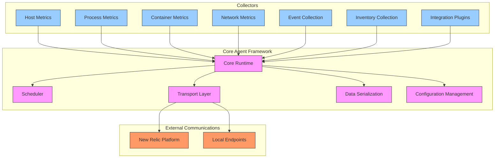

### Agent Types and Specializations

New Relic's agent portfolio is designed to provide targeted telemetry for different system components:

| Agent Type | Primary Focus | Language | Deployment Method | Kubernetes Integration |
|------------|--------------|----------|-------------------|------------------------|
| **Infrastructure Agent** | System metrics, inventory | Go | Package, container | DaemonSet |
| **APM Agents** | Application performance | Various (Java, .NET, etc.) | Library, SDK | Pod sidecar or in-app |
| **Kubernetes Integration** | Cluster visibility | Go | Container | DaemonSet, Deployment |
| **Prometheus Integration** | Metrics forwarding | Go | Container | StatefulSet |
| **OpenTelemetry Collector** | Standard telemetry pipeline | Go | Container | Deployment |
| **Flex Integrations** | Custom data sources | YAML + various | Configuration | ConfigMap |
| **Pixie Integration** | eBPF-based observability | Go | Operator | CRD + Controllers |

### Core Architectural Principles

New Relic agents are engineered around several foundational principles:

1. **Distributed Observer Pattern**: Agents act as independent observers that collect and forward data
2. **Low Overhead by Design**: Resource usage is carefully managed to minimize impact
3. **Graceful Degradation**: Agents adapt to resource constraints and failures
4. **Defense in Depth**: Multiple safeguards prevent agent issues from affecting hosts
5. **Extensibility**: Plugin architectures allow for customized data collection

## Agent Lifecycle Management

The New Relic agent lifecycle follows a well-defined state machine to ensure resilient operation:

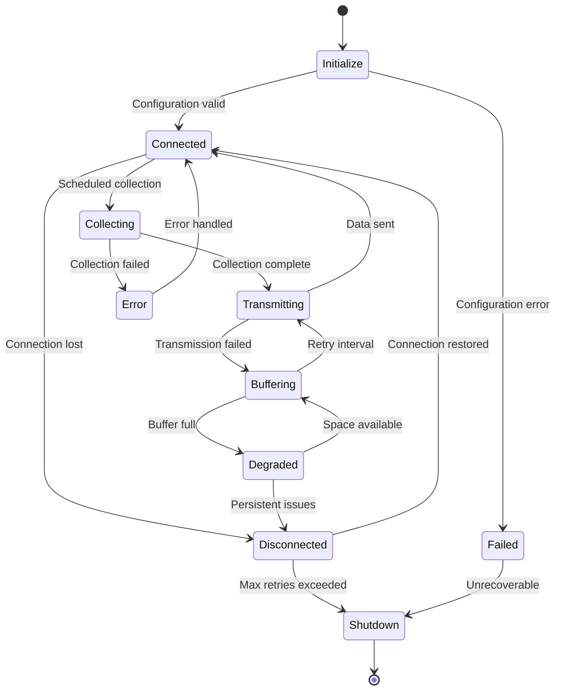

### Initialization Sequence

The agent initialization process establishes the foundation for reliable operation:

1. **Configuration Loading**: Parse environment variables, configuration files, and command-line arguments
2. **License Validation**: Verify license format and prepare for authentication
3. **System Information**: Gather host metadata and capabilities
4. **Resource Allocation**: Set up memory limits and goroutine pools
5. **Plugin Initialization**: Load and initialize collection plugins
6. **Connectivity Check**: Establish initial connection to New Relic
7. **Collection Scheduler**: Initialize collection timers with jitter
8. **Self-Monitoring**: Set up internal observability metrics

### Configuration Management

Agent configuration follows a hierarchical precedence model:

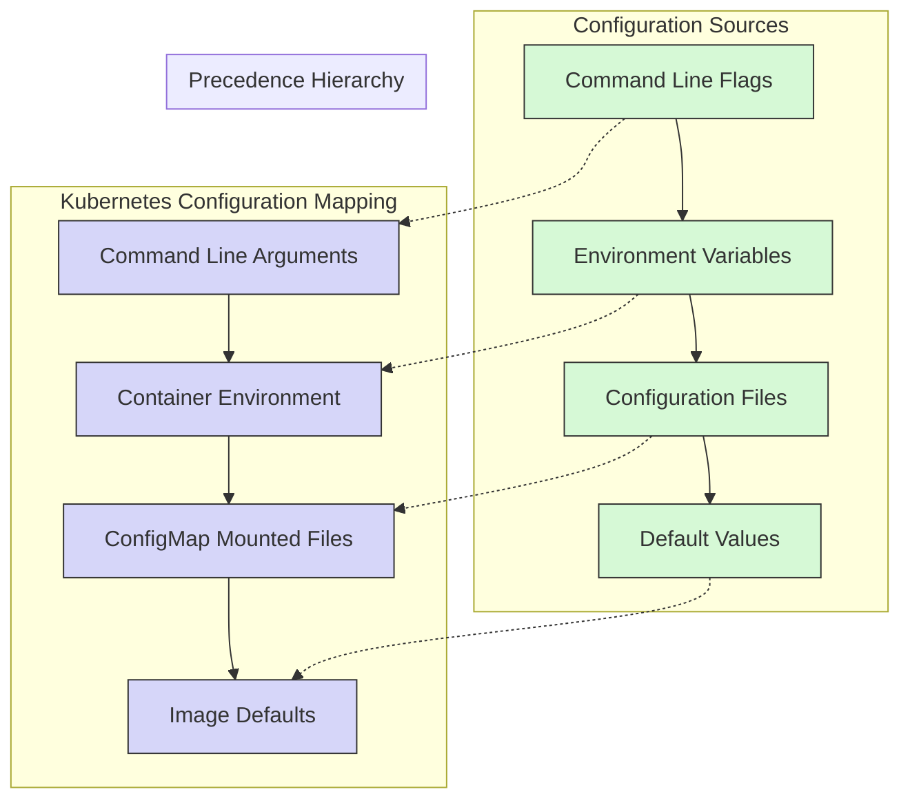

## Concurrency and Resource Management

New Relic agents implement sophisticated concurrency and resource management to maintain stability and minimize impact.

### Goroutine Architecture

The Infrastructure Agent (written in Go) utilizes a controlled concurrency model:

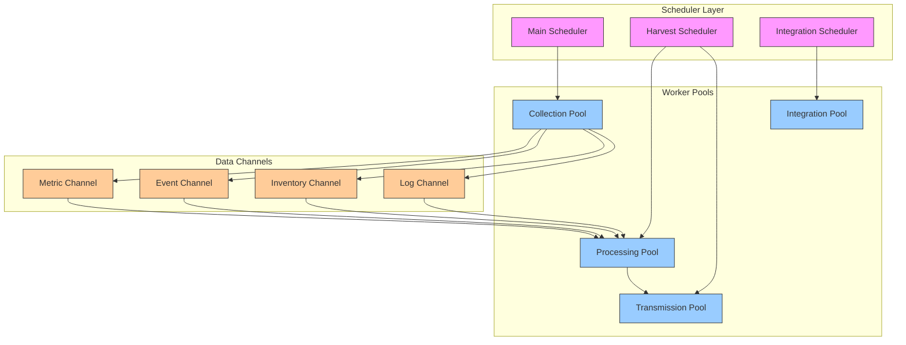

### Memory Management Strategies

The agents employ several techniques to control memory usage and prevent leaks:

1. **Bounded Buffers**: Fixed-size in-memory buffers with overflow handling
2. **Object Pooling**: Pre-allocated object pools for frequent allocations
3. **Incremental Processing**: Chunked processing of large datasets
4. **Scheduled Garbage Collection**: Controlled GC scheduling during idle periods
5. **Memory Ballast**: Stable GC behavior through reserved memory blocks

### Resource Usage Profiles

Agent resource consumption varies by role and configuration:

| Agent Type | CPU Usage (typical) | Memory Usage (typical) | Disk I/O | Network I/O |
|------------|---------------------|------------------------|----------|-------------|
| Infrastructure | 0.1-0.3 CPU cores | 50-150 MB | Low (~5 MB/min) | ~1-5 MB/min |
| APM (Java) | 0.05-0.2 CPU cores | 50-100 MB | Minimal | ~0.5-3 MB/min |
| Kubernetes Integration | 0.1-0.5 CPU cores | 80-200 MB | Low (~2 MB/min) | ~2-10 MB/min |
| Prometheus Integration | 0.2-0.8 CPU cores | 100-500 MB | Medium (~10 MB/min) | ~5-50 MB/min |
| OpenTelemetry | 0.1-0.6 CPU cores | 100-300 MB | Low (~5 MB/min) | ~2-20 MB/min |

### Resource Limits in Kubernetes

```yaml
# Recommended resource configurations for Kubernetes deployments
resources:
  # Infrastructure Agent (DaemonSet)
  infrastructure:
    requests:
      cpu: 100m
      memory: 100Mi
    limits:
      cpu: 300m
      memory: 300Mi
  
  # Kubernetes Integration
  kubernetes:
    requests:
      cpu: 100m 
      memory: 150Mi
    limits:
      cpu: 500m
      memory: 400Mi
  
  # Prometheus Integration (varies by cluster size)
  prometheus:
    small:  # <100 node clusters
      requests:
        cpu: 200m
        memory: 200Mi
      limits:
        cpu: 800m
        memory: 800Mi
    large:  # >100 node clusters
      requests:
        cpu: 500m
        memory: 500Mi
      limits:
        cpu: 2000m
        memory: 2Gi
```

## Data Collection Architecture

The agent's data collection system follows a modular, extensible architecture:

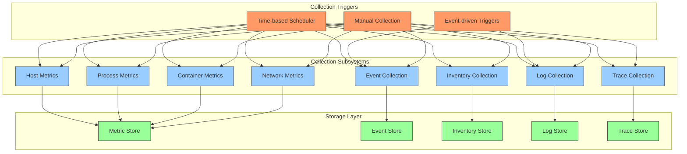

### Collection Frequency and Jitter

The agent uses adaptive collection frequencies with jitter to prevent thundering herd problems:

| Data Type | Base Collection Frequency | Jitter Range | Adaptive Behavior |
|-----------|---------------------------|--------------|-------------------|
| System Metrics | 15 seconds | ±10% | Increases to 30s under CPU pressure |
| Process Metrics | 30 seconds | ±15% | Increases to 60s under CPU pressure |
| Container Metrics | 15 seconds | ±10% | Increases to 30s when >1000 containers |
| Network Metrics | 30 seconds | ±15% | Increases to 60s under load |
| Inventory | 6 hours | ±5% | Sends deltas on significant changes |
| Events | Real-time | N/A | Batched every 5 seconds |
| Logs | Real-time | N/A | Batch size and frequency vary by volume |
| Traces | Real-time | N/A | Adaptive sampling based on volume |

### Sample Collection Flow for Kubernetes Metrics

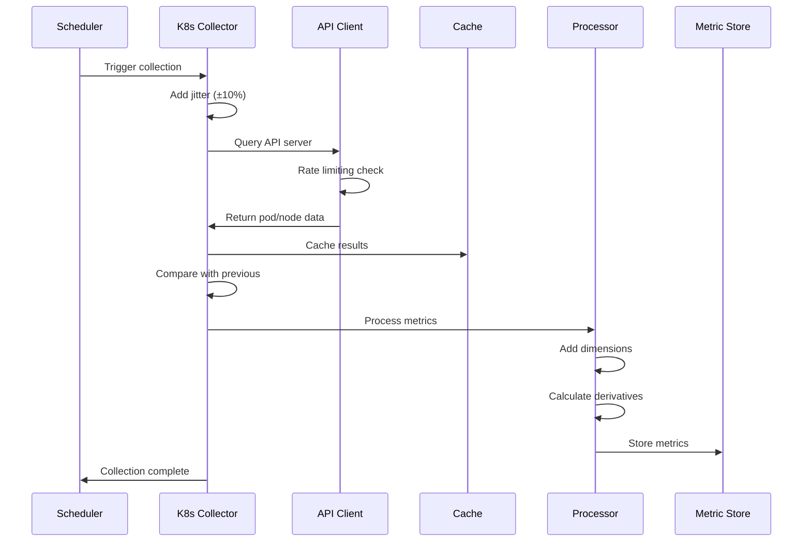

## Data Transport and Security

The agent employs a robust data transport system to ensure secure, reliable delivery of telemetry.

### Transport Architecture

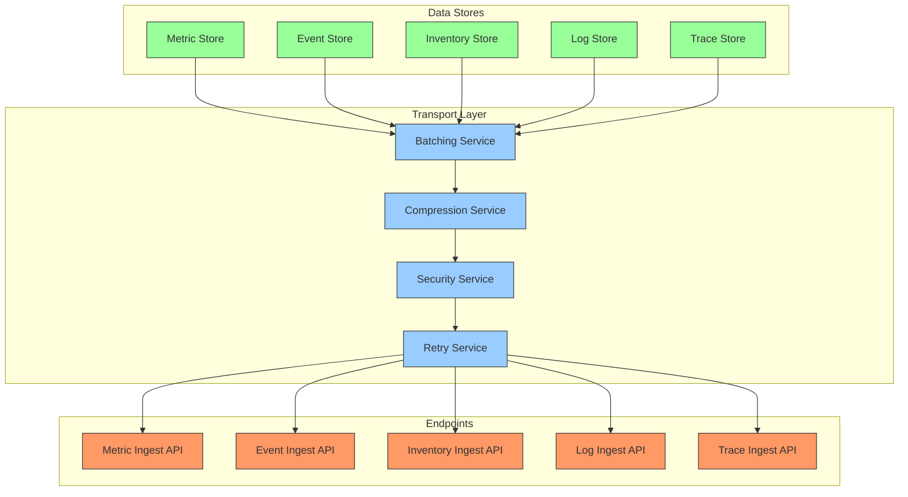

### Security Features

The agent implements multiple security measures:

1. **TLS Encryption**: All data is transmitted using TLS 1.2+
2. **License Key Authentication**: API access restricted by license key
3. **Certificate Pinning**: Optional pinning for high-security environments
4. **Data Redaction**: Sensitive data automatically redacted
5. **Minimal Permissions**: Following principle of least privilege

### Transport Protocols

| Protocol | Usage | Advantages | Disadvantages |
|----------|-------|------------|--------------|
| **HTTPS POST** | Primary data delivery | Widely compatible, encrypted | Higher overhead for small payloads |
| **Persistent HTTPS** | High-volume metric streams | Reduced connection overhead | Requires stable connection |
| **Compression** | All data types | 5:1 to 10:1 size reduction | Small CPU overhead |
| **Batching** | All data types | Reduced network overhead | Slight increase in latency |
| **Protobuf** | Metrics, traces | Compact binary format | Less human-readable for debugging |
| **JSON** | Events, inventory | Human-readable, flexible | Larger payload size |

### Resilience Mechanisms

The transport layer employs multiple resilience techniques:

1. **Exponential Backoff**: Retry intervals increase with consecutive failures
2. **Circuit Breaking**: Temporary suspension after persistent failures
3. **In-Memory Buffering**: Temporary storage of data during outages
4. **Disk Persistence**: Optional persistence of critical data to disk
5. **Payload Prioritization**: Critical data prioritized during recovery

## Error Handling and Self-Healing

The agent architecture incorporates sophisticated error handling and self-healing capabilities.

### Error Categorization and Response

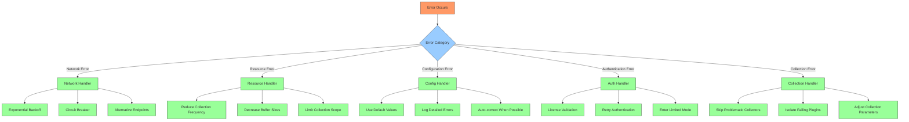

### Self-Healing Capabilities

The agent implements multiple mechanisms for self-recovery and stability:

1. **Watchdog Process**: Monitors and restarts crashed components
2. **Resource Throttling**: Automatically reduces activity under resource pressure
3. **Faulty Plugin Isolation**: Problematic plugins are isolated from core functions
4. **Automatic Configuration Correction**: Some configuration issues are auto-corrected
5. **Gradual Recovery**: Staged restoration of functionality after failures

### Health Monitoring Metrics

The agent continuously monitors its own health:

| Metric Category | Key Metrics | Threshold | Auto-Recovery Action |
|-----------------|------------|-----------|----------------------|
| **Memory** | Heap usage, GC frequency | >80% memory limit | Reduce buffer sizes, force GC |
| **CPU** | CPU usage, collection duration | >70% CPU limit | Increase collection intervals |
| **Disk** | Disk usage, I/O errors | >90% disk usage | Purge oldest buffered data |
| **Collection** | Success rate, duration | <90% success rate | Skip problematic collectors |
| **Transmission** | Success rate, retry count | >3 consecutive failures | Implement backoff strategy |
| **Error Rate** | Errors per minute | >10 errors/minute | Enter degraded mode |

## Kubernetes-Specific Optimizations

New Relic agents include specialized optimizations for Kubernetes environments.

### Kubernetes-Aware Architecture

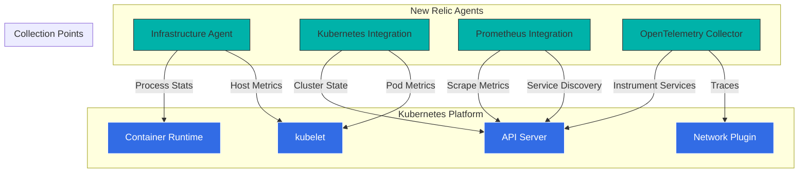

### Pod Lifecycle Integration

The agents include specialized handling for Kubernetes pod lifecycle events:

1. **Pod Startup Detection**: Identifies new pods for immediate monitoring
2. **Graceful Shutdown**: Clean agent shutdown during pod termination
3. **Resource Pressure Response**: Adapts to node pressure conditions
4. **Label-based Filtering**: Dynamic configuration based on pod labels
5. **Namespace Awareness**: Respects namespace boundaries for collection

### Kubernetes-Specific Metrics

The Infrastructure agent and Kubernetes integration collect specialized metrics:

| Metric Type | Examples | Collection Method | Value |
|-------------|----------|-------------------|-------|
| **Node Capacity** | CPU, memory, pods capacity | kubelet API | Capacity planning |
| **Node Conditions** | Ready, PIDPressure, DiskPressure | API server | Node health assessment |
| **Pod Resource Usage** | CPU usage, memory usage | CGroups | Resource utilization |
| **Container Status** | Waiting, running, terminated | Container runtime | Container lifecycle |
| **Workload Status** | Desired vs available replicas | API server | Deployment health |
| **Control Plane** | etcd, API server, scheduler metrics | API server | Control plane health |
| **Custom Resources** | CRD status, conditions | API server | Extension health |

### Deployment Patterns

The agents support multiple deployment patterns in Kubernetes:

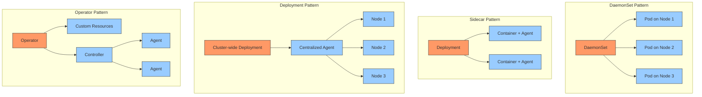

## Advanced Integration Patterns

The agent architecture supports sophisticated integration patterns for complex environments.

### Multi-Cluster Collection

The agents can be configured for efficient multi-cluster monitoring:

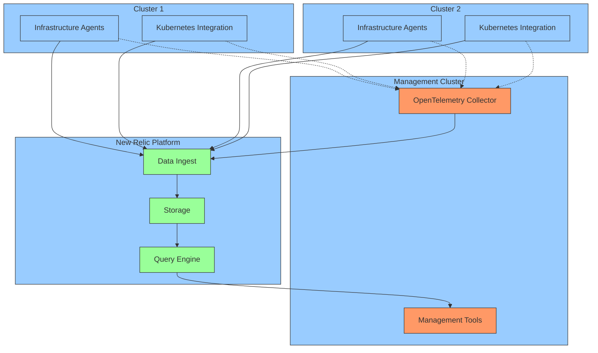

### Edge Integration Pattern

The agents support edge deployments with limited connectivity:

1. **Local Buffering**: Extended data buffering during disconnected periods
2. **Selective Transmission**: Prioritized data transmission during limited connectivity
3. **Compression Optimization**: Increased compression for low-bandwidth scenarios
4. **Batch Size Control**: Adaptive batch sizes based on connection quality
5. **Local Alerting**: Optional local alerting during disconnected periods

### On-Premise and Air-Gapped Environments

The agents can be configured for restrictive network environments:

| Feature | Air-Gapped Implementation | Value |
|---------|---------------------------|-------|
| **Proxy Support** | HTTPS, SOCKS5 proxies with authentication | Compliance with network policies |
| **Custom Endpoints** | Configurable API endpoints | Integration with internal systems |
| **Custom CA Certificates** | Support for internal PKI | Security compliance |
| **Package Mirroring** | Internal package repositories | Simplified deployment |
| **Offline Licensing** | License key validation without connectivity | Air-gapped operation |
| **Local Forwarding** | Forward to internal collectors | Data sovereignty |

## Performance Benchmarks

Comparative performance of New Relic agents in various environments:

### Resource Consumption by Environment Type

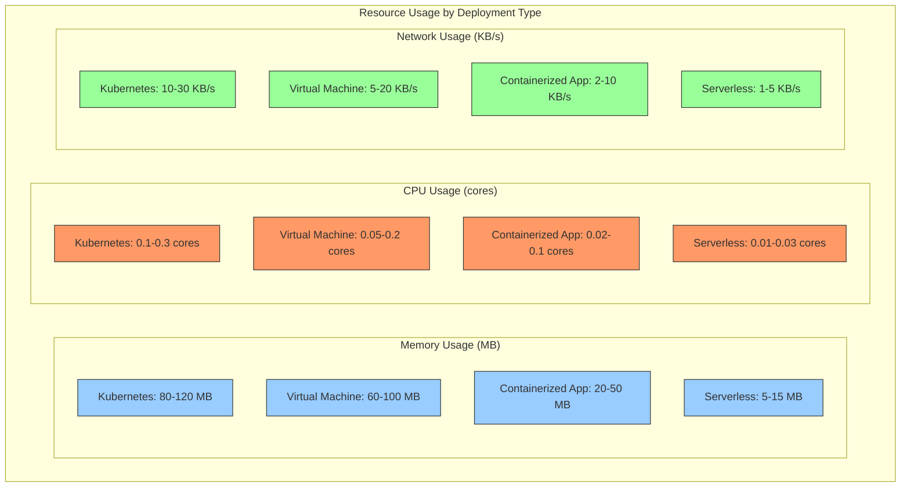

### Scaling Characteristics

New Relic agent performance scales with environment complexity:

| Environment Scale | Infrastructure Agent CPU | Infrastructure Agent Memory | Network Bandwidth | Recommended Deployment |
|------------------|--------------------------|----------------------------|-------------------|------------------------|
| Small (<50 nodes) | 0.05-0.1 cores per node | 50-100 MB per node | 1-5 MB/min per node | DaemonSet, default config |
| Medium (50-500 nodes) | 0.1-0.2 cores per node | 100-150 MB per node | 5-10 MB/min per node | DaemonSet, optimized sampling |
| Large (500-2000 nodes) | 0.2-0.3 cores per node | 150-200 MB per node | 10-20 MB/min per node | DaemonSet, increased limits |
| Very Large (2000+ nodes) | 0.3-0.5 cores per node | 200-300 MB per node | 15-30 MB/min per node | DaemonSet, reduced collection |

### Agent Comparison Table

Comparative metrics across different New Relic agent types:

| Agent Type | CPU Efficiency | Memory Efficiency | Collection Scope | Deployment Complexity | Best Use Case |
|------------|----------------|-------------------|------------------|----------------------|---------------|
| Infrastructure | ★★★★☆ | ★★★★☆ | ★★★★★ | ★★★★☆ | Core system monitoring |
| APM | ★★★☆☆ | ★★★★☆ | ★★★★☆ | ★★★☆☆ | Application tracing |
| Kubernetes | ★★★☆☆ | ★★★☆☆ | ★★★★★ | ★★★★☆ | Cluster monitoring |
| Prometheus | ★★☆☆☆ | ★★☆☆☆ | ★★★★☆ | ★★★☆☆ | Metric consolidation |
| OpenTelemetry | ★★★☆☆ | ★★★☆☆ | ★★★★★ | ★★☆☆☆ | Standardized collection |
| Flex | ★★★★☆ | ★★★★★ | ★★★☆☆ | ★★☆☆☆ | Custom integrations |

## Troubleshooting and Diagnostics

The agent architecture includes comprehensive diagnostics capabilities to aid troubleshooting.

### Diagnostic Tools

The Infrastructure agent includes several diagnostic capabilities:

1. **Verbose Logging**: Configurable log levels for detailed troubleshooting
2. **Status API**: Local HTTP endpoint exposing agent status
3. **Self-Diagnostics**: Built-in troubleshooting commands
4. **Status Uploads**: Automatic upload of diagnostic information
5. **Metric Collection**: Self-monitoring metrics

### Common Issues and Solutions

| Issue | Symptoms | Common Causes | Resolution |
|-------|----------|--------------|------------|
| **High CPU Usage** | Agent using >0.5 cores consistently | Too many integrations, excessive collection frequency | Reduce collection frequency, disable non-critical integrations |
| **Memory Leaks** | Steadily increasing memory use | Plugin leaks, excessive buffering | Upgrade agent, reduce buffer sizes, isolate problematic plugins |
| **Connection Failures** | Failed to connect errors, no data in UI | Network issues, proxy configuration, license issues | Verify network connectivity, check proxy settings, validate license key |
| **Missing Data** | Gaps in metrics, incomplete coverage | Collection errors, resource constraints | Check logs for collection errors, ensure sufficient resources |
| **Container Detection Issues** | Missing container metrics | Mount point issues, permissions | Verify docker.sock is mounted, check container runtime compatibility |
| **Kubernetes Integration Failures** | Missing cluster metrics | RBAC issues, API connectivity | Verify RBAC permissions, check connectivity to API server |

### Logging Configuration

The agent supports flexible logging configurations:

```yaml
# Example logging configuration
logging:
  # Log level: debug, info, warn, error
  level: info
  
  # Log format: text, json
  format: json
  
  # Output destinations
  file:
    enabled: true
    path: /var/log/newrelic-infra.log
    max_size_mb: 50
    max_files: 5
  
  stdout:
    enabled: true
  
  # Component-specific levels
  components:
    kubernetes:
      level: debug
    network:
      level: warn
    integrations:
      level: info
```

## Best Practices for Kubernetes Deployments

Recommended deployment patterns for New Relic agents in Kubernetes environments.

### Infrastructure Agent DaemonSet

```yaml
# Infrastructure Agent DaemonSet optimized for Kubernetes
apiVersion: apps/v1
kind: DaemonSet
metadata:
  name: newrelic-infrastructure
  namespace: monitoring
spec:
  selector:
    matchLabels:
      name: newrelic-infrastructure
  template:
    metadata:
      labels:
        name: newrelic-infrastructure
    spec:
      serviceAccountName: newrelic-infrastructure
      hostNetwork: true
      dnsPolicy: ClusterFirstWithHostNet
      containers:
        - name: newrelic-infrastructure
          image: newrelic/infrastructure:latest
          resources:
            limits:
              memory: "256Mi"
              cpu: "200m"
            requests:
              memory: "128Mi"
              cpu: "100m"
          securityContext:
            privileged: false
            runAsUser: 1000
            allowPrivilegeEscalation: false
            readOnlyRootFilesystem: true
            capabilities:
              add:
                - SYS_PTRACE
          env:
            - name: NRIA_LICENSE_KEY
              valueFrom:
                secretKeyRef:
                  name: newrelic-license
                  key: license
            - name: NRIA_DISPLAY_NAME
              valueFrom:
                fieldRef:
                  fieldPath: spec.nodeName
            # Performance optimizations
            - name: NRIA_METRICS_STORAGE_SAMPLE_RATE
              value: "0.5"
            - name: NRIA_METRICS_SYSTEM_SAMPLE_RATE
              value: "15"
            - name: NRIA_MEMORY_BALLAST_SIZE_MB
              value: "50"
            - name: NRIA_MAX_PROCS
              value: "2"
          volumeMounts:
            - mountPath: /var/run/docker.sock
              name: docker-socket
              readOnly: true
            - mountPath: /host
              name: host-volume
              readOnly: true
            - mountPath: /var/db/newrelic-infra
              name: agent-state
            - mountPath: /etc/newrelic-infra/integrations.d
              name: integration-config
      volumes:
        - name: docker-socket
          hostPath:
            path: /var/run/docker.sock
        - name: host-volume
          hostPath:
            path: /
        - name: agent-state
          emptyDir: {}
        - name: integration-config
          configMap:
            name: newrelic-integrations-config
```

### Optimization Recommendations

| Aspect | Recommendation | Impact |
|--------|---------------|--------|
| **Resource Limits** | Set memory limits 2x typical usage | Prevents OOM kills during spikes |
| **CPU Requests** | Set to ~50% of observed peak | Ensures scheduling priority |
| **Collection Frequency** | 15s for critical metrics, 30s for others | Balances detail vs. overhead |
| **Inventory Collection** | Reduce to once per hour | Minimizes metadata overhead |
| **Log Level** | Info for normal operation | Reduces disk I/O |
| **Integration Selection** | Enable only required integrations | Reduces resource usage |
| **Container Labels** | Use labels for targeted monitoring | Focuses collection on important services |
| **Metric Filtering** | Filter low-value metrics | Reduces data volume |
| **Persistent Storage** | Use emptyDir with size limits | Prevents disk pressure |

### Scaling Strategy

As cluster size increases, adjust agent configuration accordingly:

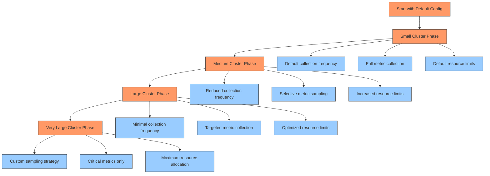

## Future Directions

New Relic's agent architecture continues to evolve with emerging technologies and use cases.

### Emerging Trends

1. **eBPF Integration**: Enhanced kernel-level telemetry without modules
2. **Serverless Agents**: Ultra-lightweight agents for serverless environments
3. **Edge Computing**: Optimized agents for edge deployments
4. **AIops Integration**: ML-enhanced anomaly detection at the agent level
5. **Zero-Config Operations**: Self-optimizing collection strategies
6. **OpenTelemetry Convergence**: Increased alignment with open standards

### Roadmap Priorities

| Focus Area | Description | Timeline | Impact |
|------------|-------------|----------|--------|
| **Resource Efficiency** | Further reduction in agent footprint | Near-term | Lower operational costs |
| **Auto-Instrumentation** | Zero-code instrumentation | Near-term | Simplified deployment |
| **Kubernetes Operator** | Enhanced Kubernetes-native experience | Near-term | Improved manageability |
| **eBPF Enhancements** | Expanded eBPF-based telemetry | Mid-term | Deeper system visibility |
| **Edge Deployment** | Specialized agents for edge computing | Mid-term | Extended monitoring reach |
| **Autonomous Operation** | Self-configuring, self-healing capabilities | Long-term | Reduced operational overhead |

## Conclusion

The New Relic agent architecture represents a sophisticated blend of design principles that balance comprehensive telemetry collection with minimal system impact. By understanding the internal mechanisms—from concurrency management to error handling to data transport—operators can deploy, configure, and troubleshoot agents more effectively.

In Kubernetes environments specifically, the agent architecture provides specialized capabilities that integrate with container orchestration, enabling deep visibility into cluster operations while respecting the ephemeral and dynamic nature of containerized workloads. The deployment patterns and optimization strategies outlined in this chapter provide a foundation for effective Kubernetes monitoring that scales from development environments to production clusters with thousands of nodes.

As cloud-native architectures continue to evolve, New Relic's agent ecosystem adapts to provide consistent, reliable telemetry collection across increasingly diverse and complex environments, maintaining the core principle of comprehensive observability with minimal operational overhead.

---

**Next Chapter**: [NRDB Column Store](02_NRDB_Column.md)
