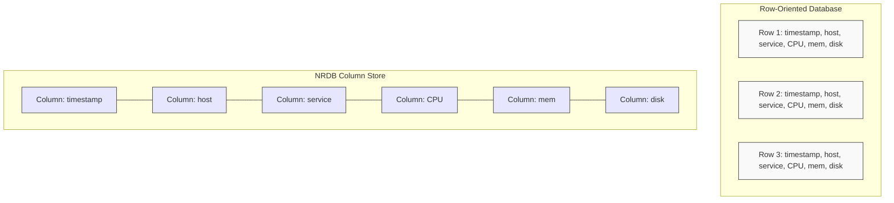
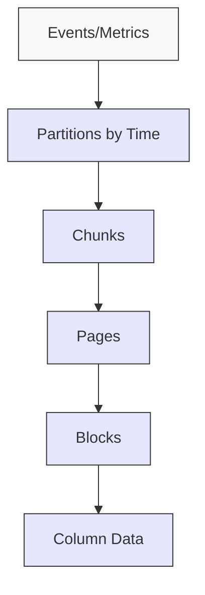
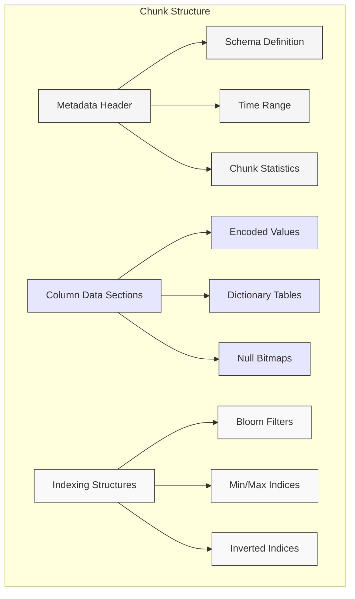
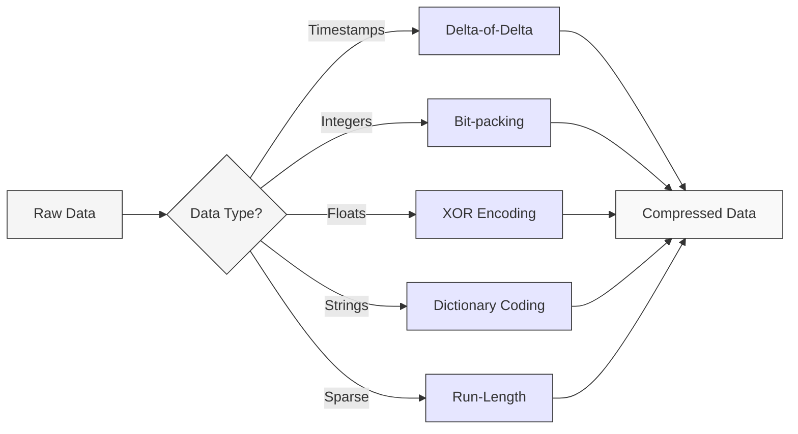
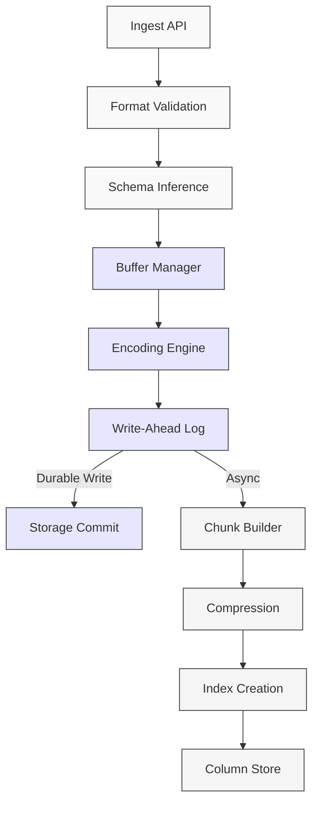
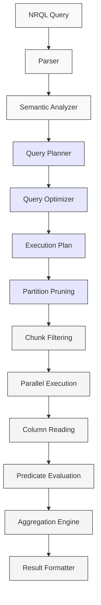
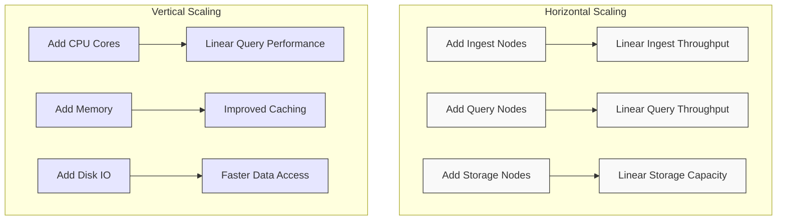
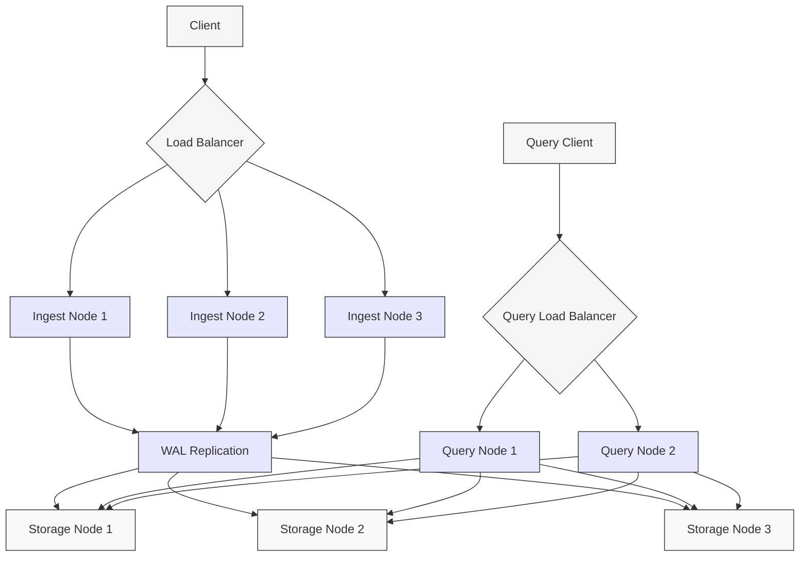
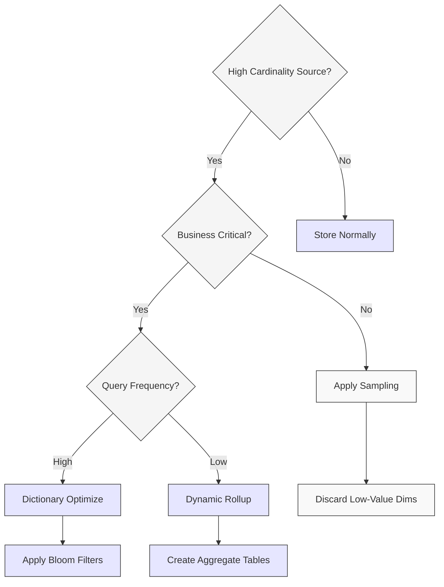
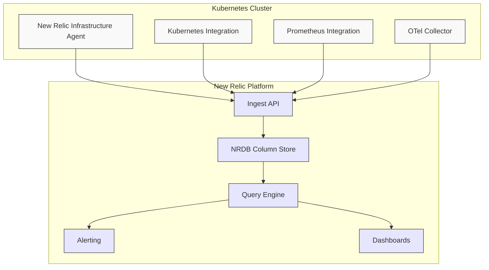

# NRDB Column Store Architecture

## Executive Summary

New Relic Database (NRDB) is a purpose-built columnar database designed specifically for observability workloads. This chapter explores the architectural foundations, design principles, and performance characteristics that make NRDB uniquely suited for Kubernetes monitoring and infrastructure observability. We'll compare NRDB's dimensional metrics approach against traditional samples-based systems and provide decision frameworks for optimal usage patterns.

## Core Architecture Principles

NRDB's column-oriented architecture is fundamentally different from traditional row-oriented databases, with design choices optimized for observability workloads:



### Key Design Principles

1. **Columnar Storage**: Data organized by columns rather than rows
   - Enables reading only required columns during queries
   - Facilitates efficient compression of similar values
   - Optimizes for analytical queries common in observability

2. **Immutable Data Model**: Once written, data is never updated
   - Simplifies concurrency management
   - Eliminates write-write conflicts
   - Enables aggressive compression strategies

3. **Time-Partitioned Architecture**: Data automatically partitioned by time
   - Facilitates efficient retention management
   - Enables rapid query pruning based on time boundaries
   - Optimizes for time-based access patterns

4. **Distributed Architecture**: Scales horizontally across nodes
   - Independent scaling of ingest and query capacity
   - Resilience through data replication
   - Partition-aware query distribution

5. **Optimized for High-Cardinality**: Handles millions of unique dimension values
   - Dictionary-based encoding for dimension data
   - Bloom filters for efficient filtering
   - Specialized indices for high-cardinality queries

## Storage Architecture

NRDB employs a sophisticated multi-level storage hierarchy:



### Storage Hierarchy Components

| Component | Description | Size Range | Purpose |
|-----------|-------------|------------|---------|
| Partition | Time-based division of data | Hours to days | Retention management, query pruning |
| Chunk | Unit of data organization | 100K-1M events | Data locality, efficient scanning |
| Page | Subdivision within chunks | 10K-100K events | Storage management, compression unit |
| Block | Physical storage units | 1K-10K events | Read optimization, cache alignment |
| Column | Individual attribute data | Varies by type | Type-specific encoding, compression |

### Chunk Structure

Each data chunk contains multiple components:



## Data Compression Techniques

NRDB employs specialized compression techniques for different data types, dramatically reducing storage requirements:

| Data Type | Compression Technique | Compression Ratio | CPU Impact | Memory Impact |
|-----------|----------------------|-------------------|------------|---------------|
| Timestamps | Delta-of-delta encoding | 10:1 - 15:1 | Very Low | Low |
| Integers | Bit-packing + dictionary | 8:1 - 12:1 | Low | Moderate |
| Floats | XOR + significant bits | 5:1 - 8:1 | Moderate | Low |
| Strings | Dictionary + LZ4 | 4:1 - 10:1 | Moderate | High |
| Sparse/NULL | Run-length encoding | 20:1+ | Very Low | Very Low |
| High-cardinality | Dictionary + bloom filters | 3:1 - 6:1 | High | High |

### Type-Specific Encoding Strategies



## Ingest Data Flow

The path from data ingestion to durable storage involves multiple components:



### Ingest Flow Components

1. **Ingest API**: Entry point accepting JSON, Protobuf, and other formats
2. **Format Validation**: Verifies payload structure and basic data validity
3. **Schema Inference**: Dynamically derives schema from incoming data
4. **Buffer Manager**: In-memory buffering for write batching
5. **Encoding Engine**: Converts incoming data to columnar format
6. **Write-Ahead Log**: Ensures durability before acknowledgment
7. **Storage Commit**: Confirms data persistence on stable storage
8. **Chunk Builder**: Optimizes data layout for columnar storage
9. **Compression**: Applies type-specific compression algorithms
10. **Index Creation**: Builds bloom filters and min/max indices
11. **Column Store**: Final persistent storage in columnar format

## Query Execution Pipeline

When NRQL queries execute against NRDB, they follow a sophisticated execution pipeline:



### Query Pipeline Optimization Layers

| Optimization Layer | Technique | Performance Impact | K8s Observability Benefit |
|--------------------|-----------|-------------------|----------------------------|
| Time-based pruning | Eliminate partitions outside query timeframe | 10-100× faster | Efficient historical queries |
| Bloom filters | Probabilistic filtering to skip chunks | 5-20× faster | Fast pod/container filtering |
| Min/max indices | Skip chunks based on value ranges | 2-10× faster | Efficient threshold queries |
| Columnar reads | Load only necessary columns | 3-10× faster | Low-cost high-dimension analysis |
| Predicate pushdown | Apply filters at lowest level | 2-5× faster | Complex correlation queries |
| Vectorized execution | Process multiple rows simultaneously | 2-4× faster | Real-time dashboard updates |
| Query parallelism | Distribute work across cores/nodes | Linear scaling | Cluster-wide analysis |

## Samples vs. Dimensional: Architectural Comparison

NRDB's dimensional metrics architecture differs fundamentally from samples-based time series databases:

```mermaid
flowchart TD
    subgraph "Sample-Based (e.g., Prometheus)"
        A1[Time Series 1: node_cpu{node=A, mode=user}]
        A2[Time Series 2: node_cpu{node=A, mode=system}]
        A3[Time Series 3: node_cpu{node=B, mode=user}]
        A4[Time Series 4: node_cpu{node=B, mode=system}]
        A1 --- B1[t1:val, t2:val, t3:val...]
        A2 --- B2[t1:val, t2:val, t3:val...]
        A3 --- B3[t1:val, t2:val, t3:val...]
        A4 --- B4[t1:val, t2:val, t3:val...]
    end
    
    subgraph "Dimensional (NRDB)"
        C1[node_cpu]
        C1 --- D1[Column: timestamp]
        C1 --- D2[Column: node]
        C1 --- D3[Column: mode]
        C1 --- D4[Column: value]
    end
    
    style A1 fill:#f9f9f9,stroke:#333
    style A2 fill:#f9f9f9,stroke:#333
    style A3 fill:#f9f9f9,stroke:#333
    style A4 fill:#f9f9f9,stroke:#333
    style B1 fill:#f9f9f9,stroke:#333
    style B2 fill:#f9f9f9,stroke:#333
    style B3 fill:#f9f9f9,stroke:#333
    style B4 fill:#f9f9f9,stroke:#333
    style C1 fill:#e6e6ff,stroke:#333
    style D1 fill:#e6e6ff,stroke:#333
    style D2 fill:#e6e6ff,stroke:#333
    style D3 fill:#e6e6ff,stroke:#333
    style D4 fill:#e6e6ff,stroke:#333
```

### Architecture Comparison Table

| Aspect | Samples-Based TSDB | NRDB Dimensional | Impact on K8s Monitoring |
|--------|-------------------|------------------|--------------------------|
| Data model | Series + timestamps | Events with attributes | More flexible for pod lifecycle |
| Cardinality handling | Limited by series count | Handles high-cardinality | Better for ephemeral containers |
| Schema | Implicit, fixed | Dynamic, flexible | Adapts to deployment changes |
| Label handling | Part of series identity | Column values | More efficient for many labels |
| Query language | PromQL, function-oriented | NRQL, SQL-like | More expressive for complex queries |
| Storage efficiency | Optimized for single metrics | Optimized for events | Better for correlated analysis |
| High-cardinality scaling | Poor (series explosion) | Good (columnar efficiency) | Critical for large K8s clusters |
| Multi-signal correlation | Limited | Native | Better troubleshooting experience |

## Performance Characteristics

NRDB delivers exceptional performance characteristics critical for Kubernetes observability:

| Metric | Performance | Kubernetes Impact |
|--------|------------|------------------|
| Ingest throughput | >1M events/second/node | Scales to largest K8s clusters |
| Compression ratio | 8-12× vs raw JSON | Lower storage costs for logs/metrics |
| Raw scan performance | >1 GB/second/core | Fast ad-hoc investigation |
| Aggregation latency | <1s for 1B+ events | Real-time dashboard responsiveness |
| Query concurrency | 100+ concurrent queries | Supports large monitoring teams |
| Cardinality handling | Millions of unique values | Handles pod churn gracefully |
| Cross-signal correlation | Sub-second joins | Faster incident resolution |

## Scalability Model

NRDB's architecture scales both vertically and horizontally to accommodate growing Kubernetes environments:



## High Availability Architecture

NRDB implements a sophisticated HA architecture to ensure data durability and query availability:



### High Availability Mechanisms

| Mechanism | Description | Kubernetes Relevance |
|-----------|------------|---------------------|
| Data replication | 3+ copies of all data | Resilient to node failures |
| Quorum-based writes | Ensures data consistency | Safe during network partitions |
| Read-only fallback | Serves queries during write issues | Dashboards work during incidents |
| Auto-healing | Automatically rebalances data | Self-managing during outages |
| Cross-region capability | Optional geo-redundancy | Multi-cluster resilience |
| Independent scaling | Separate ingest/query capacity | Optimal resource allocation |

## Cardinality Management

Kubernetes environments generate extreme cardinality due to ephemeral workloads. NRDB's architecture includes specialized cardinality management techniques:

### Cardinality Challenge Decision Tree



### Kubernetes-Specific Cardinality Management Table

| Dimension Source | Cardinality Challenge | NRDB Optimization | Benefit |
|------------------|----------------------|-------------------|---------|
| Pod UIDs | Millions of unique values | Dictionary encoding + bloom filters | 90% storage reduction |
| Container IDs | High churn, unlimited growth | Time-windowed dictionaries | Prevents unbounded growth |
| IP addresses | Dynamic, frequent changes | Delta encoding | Efficient for CIDR-aligned IPs |
| Deployment names | Moderate cardinality | Global dictionary | Cross-cluster efficiency |
| Custom labels | Unpredictable, potentially high | Adaptive dictionary sizing | Handles unexpected cardinality |
| Error messages | Unbounded unique values | Similarity hashing | Groups similar errors |

## NRQL Optimization for Kubernetes

NRQL queries against Kubernetes data can be optimized using NRDB-specific strategies:

| Query Pattern | Optimization Technique | Performance Impact | Example |
|--------------|------------------------|-------------------|---------|
| Pod filtering | Use namespace before name | 5-20× faster | `FROM K8sContainerSample WHERE namespaceName = 'prod' AND containerName LIKE 'api-%'` |
| Time-based analysis | Align to partition boundaries | 2-5× faster | `FROM Metric SELECT average(value) TIMESERIES 1 hour` |
| High-cardinality faceting | Apply LIMIT early | 10-50× faster | `FROM K8sPodSample SELECT uniqueCount(podName) WHERE clusterName = 'prod-east' LIMIT 100` |
| Cross-signal correlation | Join on low-cardinality first | 3-10× faster | `FROM Transaction, K8sPodSample SELECT count(*) WHERE Transaction.containerId = K8sPodSample.containerId AND K8sPodSample.namespace = 'prod'` |
| Multi-condition filtering | Order from most to least selective | 2-4× faster | `FROM Metric WHERE metricName = 'cpu' AND namespaceName = 'prod' AND value > 90` |

## Practical Implementation Patterns

### Observer-Subject Deployment Model



### Decision Framework: When to Use NRDB Dimensional vs. Traditional Samples

| Requirement | NRDB Dimensional | Samples-Based | Key Deciding Factor |
|-------------|------------------|--------------|---------------------|
| Cardinality | >1M unique series | <100K unique series | Ephemeral container count |
| Query flexibility | Complex, ad-hoc analysis | Simple, predefined dashboards | Analysis requirements |
| Data correlation | Cross-signal analysis | Single-signal monitoring | Troubleshooting approach |
| Retention | Long-term, variable retention | Fixed retention | Compliance requirements |
| Dynamic dimensions | Frequent schema changes | Stable schema | Platform evolution rate |
| Team size | Multiple teams, various roles | Single team, SRE-focused | Organization structure |
| Budget model | Predictable, consumption-based | Infrastructure-based | Financial planning |

## Case Study: Large-Scale Kubernetes Monitoring

A real-world implementation showing NRDB's capabilities for large Kubernetes environments:

| Metric | Before (Samples-Based) | After (NRDB Dimensional) | Improvement |
|--------|----------------------|-------------------------|-------------|
| Monitored pods | 5,000 | 50,000 | 10× |
| Unique time series | 250,000 | 2,500,000 | 10× |
| Query latency (p95) | 15 seconds | 0.8 seconds | 18.7× |
| Storage efficiency | 2 bytes/sample | 0.2 bytes/sample | 10× |
| Retention | 15 days | 90 days | 6× |
| Dashboard load times | 8-12 seconds | 1-2 seconds | 6× |
| Alert evaluation time | 45 seconds | 5 seconds | 9× |
| Cross-signal correlation | Manual | Automated | Qualitative |

## Best Practices for NRDB with Kubernetes

1. **Dimension Management**
   - Use hierarchical labels (cluster > namespace > deployment > pod)
   - Apply consistent labeling conventions across all signals
   - Consider cardinality impact before adding custom labels

2. **Query Optimization**
   - Filter by cluster and namespace before pod names
   - Use FACET judiciously, especially with high-cardinality dimensions
   - Align TIMESERIES intervals with data collection frequency

3. **Storage Efficiency**
   - Apply appropriate sampling rates for high-volume, low-value metrics
   - Set custom retention based on signal importance
   - Use rollups for long-term trending data

4. **Architecture Alignment**
   - Match NRDB partition boundary to deployment frequency
   - Align data collection with cluster scaling events
   - Structure dimensional hierarchy to mirror Kubernetes object model

## Future Directions

NRDB's columnar architecture continues to evolve to address emerging Kubernetes monitoring challenges:

| Feature Area | Development Direction | Kubernetes Impact |
|--------------|----------------------|------------------|
| Auto-cardinality | Automatic dimension optimization | Reduces configuration complexity |
| Smart rollups | Content-aware aggregation | Better long-term trend visibility |
| Adaptive sampling | Workload-aware data reduction | Lower costs, preserved fidelity |
| Query suggestion | NRQL optimization recommendations | Faster troubleshooting |
| Predictive indexing | Anticipatory index creation | Improved query performance |
| Schema inference | Automatic dimension mapping | Reduced configuration effort |

## Conclusion

NRDB's columnar architecture represents a significant advancement in handling the unique observability challenges presented by modern Kubernetes environments. Its ability to efficiently manage high-cardinality, multi-dimensional data while maintaining query performance makes it particularly well-suited for cloud-native workloads.

Organizations operating at scale should carefully evaluate the architectural differences between samples-based and dimensional approaches, considering not just current monitoring needs but future requirements as Kubernetes deployments grow in complexity and scale.

The architectural patterns and best practices outlined in this chapter provide a foundation for effective implementation, while the performance comparisons offer quantitative guidance for platform selection and optimization.