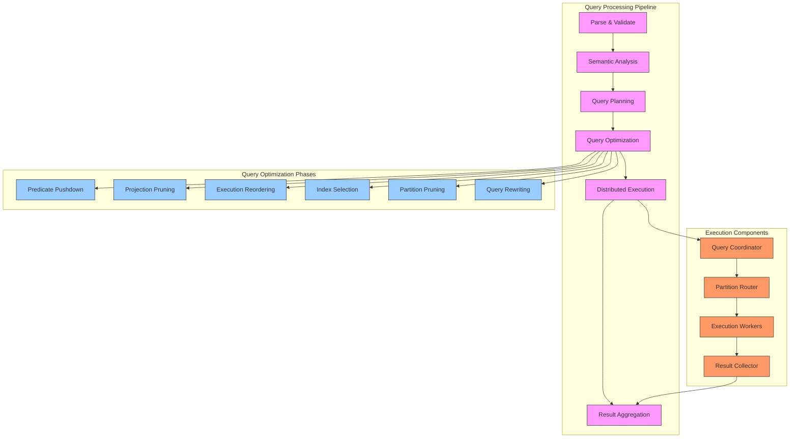
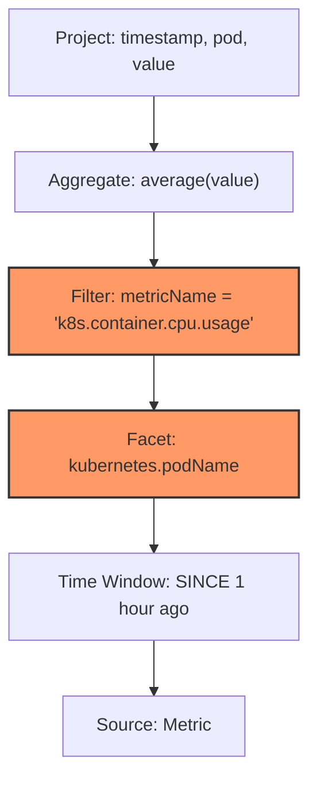
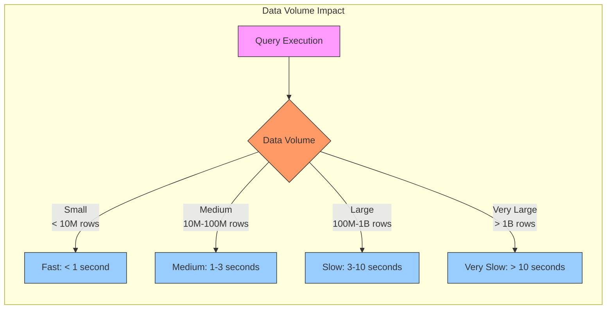
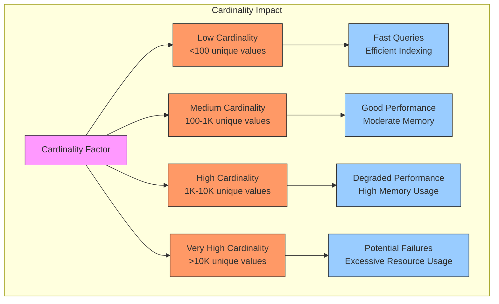
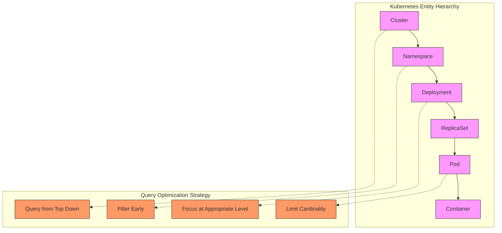
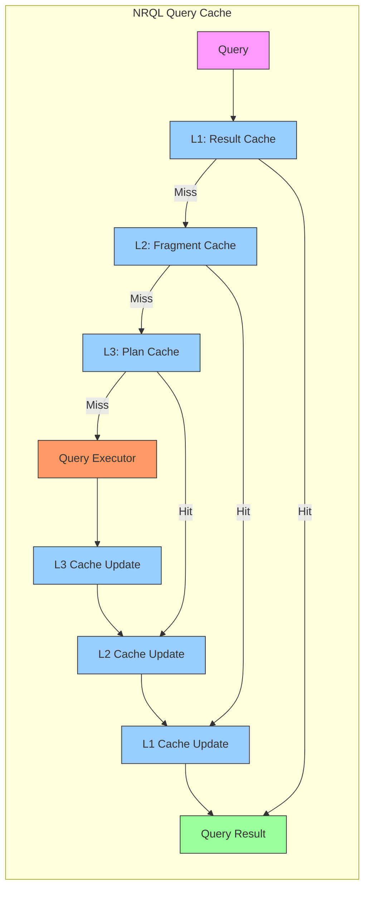

# NRQL Query Optimizer and Performance Tuning

## Executive Summary

New Relic Query Language (NRQL) provides a powerful SQL-like interface for querying telemetry data from Kubernetes and infrastructure monitoring. Behind this declarative query interface lies a sophisticated query optimizer that transforms NRQL statements into efficient execution plans. This chapter explores the internals of the NRQL optimizer, its execution pipeline, and optimization techniques specifically relevant to Kubernetes observability. Understanding how NRQL processes queries enables engineers to craft more efficient queries, improving dashboard performance while controlling query costs.

As Kubernetes environments grow in scale and complexity, query efficiency becomes increasingly important. Inefficient queries lead to slow dashboards, delayed alerts, and increased consumption costs. This chapter provides both theoretical understanding and practical techniques for optimizing NRQL queries across common Kubernetes use cases. Whether troubleshooting performance, analyzing long-term trends, or building real-time dashboards, these optimization patterns help extract maximum value from infrastructure telemetry while maintaining performance and cost efficiency.

## Query Processing Architecture

The NRQL engine processes queries through a multi-stage pipeline that optimizes execution:



### Query Pipeline Components

1. **Parse & Validate**: Converts NRQL text into an abstract syntax tree and validates syntax
2. **Semantic Analysis**: Resolves identifiers, validates functions, and determines data types
3. **Query Planning**: Generates logical query plans representing query operations
4. **Query Optimization**: Transforms plans to improve execution efficiency
5. **Distributed Execution**: Executes query across data partitions in parallel
6. **Result Aggregation**: Combines partial results into final output

### Optimization Techniques

The NRQL optimizer employs several key techniques to improve query performance:

| Technique | Description | Example | Impact |
|-----------|-------------|---------|--------|
| **Predicate Pushdown** | Moves filters to earliest possible stage | Push `WHERE` clauses to data source | 10-1000× faster |
| **Projection Pruning** | Reads only necessary columns | Only select needed attributes | 2-5× faster |
| **Query Rewriting** | Transforms into equivalent, more efficient queries | Convert complex expressions to simpler forms | 2-10× faster |
| **Partition Pruning** | Eliminates unnecessary time partitions | Restrict by time windows | 5-100× faster |
| **Index Utilization** | Leverages available indices | Use indexed fields in filters | 10-100× faster |
| **Join Optimization** | Optimizes multi-table join operations | Reorder joins by selectivity | 2-10× faster |
| **Function Optimization** | Optimizes function execution | Replace inefficient functions | 1.5-3× faster |
| **Cardinality Control** | Limits result set sizes | Apply limits before expensive operations | 2-20× faster |

## The NRQL Optimizer

The heart of NRQL performance is its optimizer, which analyzes and transforms queries before execution.

### Query Plan Visualization



This logical plan tree shows how a typical Kubernetes CPU usage query is processed, with highlighted components indicating optimization opportunities.

### Cost-Based Optimization

NRQL employs a cost-based optimizer that estimates resource requirements for different execution plans:

1. **Statistical Metadata**: The optimizer uses cardinality and distribution statistics
2. **Cost Models**: Each operation has an associated computational cost
3. **Resource Estimation**: CPU, memory, and I/O costs are calculated
4. **Plan Comparison**: Multiple plans are compared and the lowest-cost plan is selected

### Operation Cost Models

| Operation | Cost Formula | Example | 
|-----------|--------------|---------|
| Table Scan | `rows_scanned × row_size × scan_factor` | Scanning 100M metrics: 1000 cost units |
| Index Scan | `log(entries) × matching_entries × entry_size` | Index lookup with 10K matches: 50 cost units |
| Filter | `input_rows × selectivity × complexity` | 10% selective filter on 1M rows: 100 cost units |
| Aggregation | `input_rows × agg_factor + result_rows` | Aggregating 10M rows to 1K groups: 110 cost units |
| Sort | `rows × log(rows) × sort_factor` | Sorting 100K results: 70 cost units |
| Join | `outer_rows × inner_rows × join_selectivity` | Join with 10K × 1K rows, 1% matches: 100 cost units |
| Facet | `input_rows × facet_dimensions` | 1M rows with 3 facet dimensions: 300 cost units |
| Timeseries | `input_rows × bucket_factor + bucket_count` | 1M rows into 60 time buckets: 160 cost units |

## EXPLAIN Plans in NRQL

The `EXPLAIN` command reveals how NRQL optimizes and plans to execute a query:

```sql
EXPLAIN SELECT average(cpuCoresUsed) 
FROM K8sContainerSample 
WHERE clusterName = 'production' 
FACET containerName 
SINCE 1 hour ago TIMESERIES
```

This produces a detailed execution plan showing:

```json
{
  "queryPlan": {
    "planType": "distributedAggregate",
    "timeWindow": {
      "begin": "2025-04-23T08:23:00Z",
      "end": "2025-04-23T09:23:00Z"
    },
    "scanTargets": {
      "type": "eventData",
      "eventType": "K8sContainerSample",
      "estimatedRowCount": 1235000,
      "estimatedScanTimeMs": 254
    },
    "operations": [
      {
        "type": "scan",
        "target": "K8sContainerSample",
        "filters": [
          {
            "attribute": "clusterName",
            "operator": "=",
            "value": "production",
            "estimatedSelectivity": 0.2
          },
          {
            "attribute": "timestamp",
            "operator": ">=",
            "value": "2025-04-23T08:23:00Z"
          },
          {
            "attribute": "timestamp",
            "operator": "<",
            "value": "2025-04-23T09:23:00Z"
          }
        ],
        "estimatedOutputRows": 247000
      },
      {
        "type": "project",
        "attributes": ["timestamp", "containerName", "cpuCoresUsed"]
      },
      {
        "type": "timeseries",
        "interval": 60,
        "buckets": 60
      },
      {
        "type": "groupBy",
        "keys": ["containerName", "timeseriesBucket"],
        "estimatedGroups": 3600
      },
      {
        "type": "aggregate",
        "function": "average",
        "attribute": "cpuCoresUsed"
      }
    ],
    "estimatedCost": 287.4,
    "estimatedExecutionTimeMs": 348
  }
}
```

Understanding EXPLAIN output helps identify:
- Estimated data volume scanned
- Filtering effectiveness
- Potential bottlenecks
- Optimization opportunities

## Query Performance Factors

Several key factors influence NRQL query performance:

### Data Volume

The amount of data scanned is the primary determinant of query performance:



### Query Complexity

The types and number of operations affect computational requirements:

| Complexity Level | Characteristics | Example | Typical Performance |
|------------------|-----------------|---------|---------------------|
| **Simple** | Basic aggregation, few filters | `SELECT average(value) FROM Metric WHERE metricName = 'x'` | Fast (100-300ms) |
| **Moderate** | Multiple aggregations, facets | `SELECT average(value), percentile(value, 95) FROM Metric FACET entity.name` | Medium (300-1000ms) |
| **Complex** | Multiple facets, functions | `SELECT count(*) FROM Transaction FACET appName, name, http.statusCode` | Slow (1-3s) |
| **Very Complex** | Joins, nested operations | `FROM Transaction SELECT * WHERE entityGuid IN (FROM Entity SELECT guid WHERE type = 'SERVICE')` | Very Slow (3s+) |

### Cardinality

The number of unique values significantly impacts performance:



### Time Range

The query time window directly affects data volume:

| Time Range | Relative Performance | Best Use Cases |
|------------|----------------------|----------------|
| Last 5-30 minutes | Very Fast | Real-time monitoring, active incidents |
| Last 1-6 hours | Fast | Troubleshooting recent issues |
| Last 12-24 hours | Moderate | Daily pattern analysis |
| Last 3-7 days | Slow | Weekly trends, capacity planning |
| Last 30+ days | Very Slow | Long-term analysis, avoid for dashboards |

## Kubernetes-Specific Optimization Patterns

Kubernetes environments generate telemetry with unique characteristics that require specific optimization approaches.

### Entity Hierarchy Optimization

Kubernetes has a natural hierarchy of entities that can be leveraged for efficient querying:



### Optimized Kubernetes Query Patterns

| Query Goal | Inefficient Pattern | Optimized Pattern |
|------------|---------------------|-------------------|
| Pod CPU Usage | `SELECT average(cpuCoresUsed) FROM K8sPodSample FACET podName` | `SELECT average(cpuCoresUsed) FROM K8sPodSample WHERE namespaceName = 'app' FACET podName LIMIT 20` |
| Container Status | `SELECT latest(status) FROM K8sContainerSample FACET containerName, podName` | `SELECT latest(status) FROM K8sContainerSample WHERE status != 'running' FACET containerName, podName` |
| Node Resource Usage | `SELECT average(cpuUtilization) FROM K8sNodeSample TIMESERIES 1 minute SINCE 7 days ago` | `SELECT average(cpuUtilization) FROM K8sNodeSample TIMESERIES AUTO SINCE 7 days ago` |
| Deployment Status | `SELECT * FROM K8sDeploymentSample FACET deploymentName` | `SELECT latest(deploymentName), latest(available), latest(desired) FROM K8sDeploymentSample WHERE clusterName = 'prod-east'` |

### High-Cardinality Kubernetes Dimensions

Kubernetes environments often generate high-cardinality dimensions that require special handling:

| Dimension | Typical Cardinality | Optimization Strategy |
|-----------|---------------------|------------------------|
| Container ID | Very High (100K+) | Avoid in FACETs, select specific IDs |
| Pod Name | High (10K+) | Filter by namespace, apply LIMIT |
| Pod IP | High (10K+) | Use for specific lookups, not FACETs |
| Node Name | Medium (100-1000) | Good for FACETs, use cluster filter |
| Namespace | Low (10-100) | Excellent for filtering and FACETs |
| Cluster Name | Very Low (1-10) | Essential first-level filter |

## Dimensional vs Samples-Based Query Models

NRQL supports both dimensional metrics and samples-based metrics, each with different query patterns and performance characteristics.

### Comparing Query Approaches

```mermaid
graph LR
    subgraph "Samples-Based"
        S1[K8sContainerSample]
        S2[K8sPodSample]
        S3[K8sNodeSample]
        
        S1 --> SQ[SELECT average(value)<br>FROM K8sContainerSample]
    end
    
    subgraph "Dimensional"
        D1[FROM Metric SELECT...]
        D2[WHERE metricName='container.cpu.usage']
        D3[FACET cluster, pod, container]
        
        D1 --> D2 --> D3
    end
    
    SQ --> Compare{Performance<br>Comparison}
    D3 --> Compare
    
    Compare -->|Samples| AdvS[+ Simple queries<br>+ Direct attribute access<br>- Less efficient for high cardinality]
    Compare -->|Dimensional| AdvD[+ Better for high cardinality<br>+ More consistent performance<br>- More complex queries]
    
    classDef samples fill:#f9f,stroke:#333,stroke-width:1px
    classDef dimensional fill:#f96,stroke:#333,stroke-width:1px
    classDef comparison fill:#9cf,stroke:#333,stroke-width:1px
    
    class S1,S2,S3,SQ samples
    class D1,D2,D3 dimensional
    class Compare comparison
    class AdvS samples
    class AdvD dimensional
```

### Optimal Query Patterns by Data Model

| Use Case | Samples-Based Approach | Dimensional Approach | Performance Recommendation |
|----------|------------------------|----------------------|----------------------------|
| Container CPU | `FROM K8sContainerSample SELECT average(cpuCoresUsed)` | `FROM Metric SELECT average(value) WHERE metricName = 'container.cpu.usage'` | Samples for <1000 containers, Dimensional for >1000 |
| Pod Memory | `FROM K8sPodSample SELECT average(memoryWorkingSetBytes)` | `FROM Metric SELECT average(value) WHERE metricName = 'k8s.pod.memory.working_set'` | Samples for simple queries, Dimensional for complex aggregations |
| Node Networking | `FROM K8sNodeSample SELECT sum(networkTransmitBytesPerSecond)` | `FROM Metric SELECT sum(value) WHERE metricName = 'k8s.node.network.tx_bytes_per_second'` | Samples for <100 nodes, Dimensional for >100 |
| Cluster-wide Stats | `FROM K8sClusterSample SELECT latest(podCount)` | `FROM Metric SELECT latest(value) WHERE metricName = 'k8s.cluster.pod.count'` | Either model works well, Dimensional better for long timeframes |

## NRQL Query Cache

NRQL leverages a multi-level query cache to improve performance for repeated queries:



### Cache Effectiveness by Query Type

| Query Type | Cache Hit Rate | Performance Improvement | Use Cases |
|------------|----------------|-------------------------|-----------|
| Dashboard Refresh | 70-90% | 5-10× faster | NRQL widgets on dashboards |
| Alert Conditions | 20-40% | 2-4× faster | NRQL alert conditions |
| API/Custom Apps | 10-30% | 2-3× faster | Custom NRQL via API |
| Ad-hoc Exploration | 5-15% | 1-2× faster | Ad-hoc queries in UI |

### Maximizing Cache Benefits

1. **Consistent Query Text**: Minor text differences cause cache misses
2. **Standard Time Windows**: Use consistent SINCE/UNTIL clauses
3. **Parameter Variables**: Use dashboard variables for consistent query structure
4. **Appropriate Refresh Rates**: Match refresh to data collection frequency
5. **Time Boundary Alignment**: Align to collection boundaries (15s, 30s, 1m)

## Performance Optimization Techniques

Practical techniques for optimizing NRQL queries in Kubernetes environments:

### Filtering Optimization

```sql
-- INEFFICIENT: No early filtering
SELECT count(*) FROM Transaction 
WHERE duration > 1 
FACET appName

-- OPTIMIZED: Filter by indexed attributes first
SELECT count(*) FROM Transaction 
WHERE appName = 'kubernetes-api' AND duration > 1
```

Apply filters in optimal order from most selective to least:
1. Time windows (SINCE/UNTIL)
2. Entity identifiers (clusterName, namespaceName)
3. Categorical attributes (status, phase, type)
4. Numeric comparisons (duration > X, usagePercent > Y)

### Projection Optimization

```sql
-- INEFFICIENT: Selecting unnecessary data
SELECT * FROM K8sPodSample 
WHERE namespaceName = 'app'

-- OPTIMIZED: Select only needed attributes
SELECT latest(podName), latest(status), latest(restartCount) 
FROM K8sPodSample 
WHERE namespaceName = 'app'
```

### Facet Optimization

```sql
-- INEFFICIENT: Multiple high-cardinality facets
SELECT count(*) FROM K8sContainerSample 
FACET containerName, podName, namespaceName, nodeName

-- OPTIMIZED: Limit cardinality, prioritize dimensions
SELECT count(*) FROM K8sContainerSample 
FACET namespaceName, nodeName LIMIT 100
```

### Time Window Optimization

```sql
-- INEFFICIENT: Excessive timeframe with fine granularity
SELECT average(cpuUtilization) FROM K8sNodeSample 
SINCE 30 days ago TIMESERIES 5 minutes

-- OPTIMIZED: Appropriate timeframe and granularity
SELECT average(cpuUtilization) FROM K8sNodeSample 
SINCE 24 hours ago TIMESERIES AUTO
```

### JOIN Optimization

```sql
-- INEFFICIENT: Joining large datasets without filtering
FROM K8sPodSample SELECT * 
JOIN K8sContainerSample 
WHERE K8sPodSample.podId = K8sContainerSample.podId

-- OPTIMIZED: Filter before joining
FROM K8sPodSample SELECT * 
WHERE namespaceName = 'production' AND status != 'Running'
JOIN K8sContainerSample 
WHERE K8sPodSample.podId = K8sContainerSample.podId
```

## Query Cost Control

NRQL queries consume resources that translate to costs in consumption-based pricing models.

### Cost Estimation Model

```
Query Cost = (Data Scanned × Scan Cost) + (Compute Units × Compute Cost)

Where:
- Data Scanned: Volume of data read from storage
- Scan Cost: Cost per unit of data scanned
- Compute Units: Processing resources consumed
- Compute Cost: Cost per compute unit
```

### Cost Optimization Strategies

1. **Time Window Reduction**: Limit query timeframes to necessary periods
2. **Filtering Improvements**: Add selective filters to reduce data scanned
3. **Attribute Selection**: Request only needed attributes
4. **Query Consolidation**: Combine similar queries to reduce executions
5. **Dashboard Optimization**: Adjust refresh rates and query complexity
6. **Alerting Efficiency**: Optimize alert condition queries

### Cost-Efficient Dashboard Patterns

| Dashboard Type | Refresh Rate | Time Window | Query Complexity | Cost Profile |
|----------------|--------------|-------------|------------------|--------------|
| **Executive Overview** | 5-15 minutes | 24 hours - 7 days | Low: aggregated metrics | Low |
| **Operational Dashboard** | 1-5 minutes | 1-6 hours | Medium: key metrics with facets | Medium |
| **Troubleshooting Dashboard** | 30-60 seconds | 30 minutes - 3 hours | High: detailed metrics, multiple facets | High |
| **Real-time Monitoring** | 10-30 seconds | 5-30 minutes | Very High: detailed metrics, multiple dimensions | Very High |

## Advanced Query Techniques

Advanced NRQL patterns that optimize both performance and analytical value:

### Parameterized Queries

```sql
-- Dashboard template with variables
SELECT average(cpuCoresUsed) 
FROM K8sContainerSample 
WHERE clusterName = '{{cluster}}' 
AND namespaceName = '{{namespace}}' 
SINCE {{timeWindow}} 
TIMESERIES
```

This approach allows dashboard users to change parameters without modifying query structure, maintaining cache efficiency.

### Federated Queries

```sql
-- Multi-account federated query
SELECT average(cpuUtilization) FROM K8sNodeSample 
WHERE clusterName = 'production' 
FACET nodeName 
TIMESERIES AUTO 
SINCE 1 hour ago 
ACROSS ACCOUNTS(1234567, 2345678, 3456789)
```

Optimize federated queries by:
1. Adding selective filters to reduce data volume
2. Limiting result set size with LIMIT clauses
3. Using appropriate time windows
4. Limiting to necessary accounts only

### Composite Queries

```sql
-- Using subqueries for efficiency
FROM (
  SELECT latest(podName), latest(status), latest(phase) 
  FROM K8sPodSample 
  WHERE clusterName = 'production' 
  FACET podName
) SELECT * WHERE status != 'Running' OR phase != 'Running'
```

### Materialized Queries

```sql
-- Compare with past periods
SELECT average(cpuCoresUsed) 
FROM K8sContainerSample 
WHERE namespaceName = 'production' 
FACET containerName 
SINCE 24 hours ago 
COMPARE WITH 1 week ago
```

### Optimal Function Selection

| Goal | Inefficient Function | Efficient Alternative | Performance Improvement |
|------|----------------------|----------------------|------------------------|
| String Search | `strContains()` | `LIKE`, `IN` | 2-10× faster |
| Numeric Comparison | `abs(value - target) < 0.1` | `value BETWEEN target-0.1 AND target+0.1` | 1.5-3× faster |
| Time Comparison | `dateDiff(minutes, timestamp, now())` | `timestamp > now() - duration('1 minute')` | 2-5× faster |
| Percentiles | Multiple individual percentiles | `percentile(duration, 50, 90, 95, 99)` | 3-5× faster |
| Latest Value | Complex max(timestamp) logic | `latest(value)` | 2-4× faster |

## Query Automation and Tooling

Tools and techniques for systematically optimizing NRQL queries:

### Query Analyzer Tool

```javascript
// NRQL Query Analyzer
function analyzeNRQLQuery(query) {
  const issues = [];
  
  // Check for missing time bounds
  if (!query.match(/SINCE|UNTIL/i)) {
    issues.push({
      severity: "high",
      issue: "Missing time bounds",
      recommendation: "Add SINCE clause to limit data scanned"
    });
  }
  
  // Check for SELECT *
  if (query.match(/SELECT\s+\*/i)) {
    issues.push({
      severity: "medium",
      issue: "Selecting all attributes",
      recommendation: "Select only needed attributes"
    });
  }
  
  // Check for high-cardinality FACETs without LIMIT
  if (query.match(/FACET/i) && !query.match(/LIMIT\s+\d+/i)) {
    issues.push({
      severity: "medium",
      issue: "FACET without LIMIT clause",
      recommendation: "Add LIMIT to prevent high-cardinality issues"
    });
  }
  
  // Check for fine-grained TIMESERIES with long time range
  if (query.match(/TIMESERIES\s+\d+\s+(?:second|minute)s?/i) && 
      query.match(/SINCE\s+\d+\s+(?:day|week|month)s?/i)) {
    issues.push({
      severity: "high",
      issue: "Fine-grained TIMESERIES with long time range",
      recommendation: "Use TIMESERIES AUTO or increase bucket size"
    });
  }
  
  // Check for complex string operations
  if (query.match(/strContains|regex|like/i)) {
    issues.push({
      severity: "low",
      issue: "Complex string operations",
      recommendation: "Use IN operator or indexed fields when possible"
    });
  }
  
  return issues;
}

// Example usage
const queryIssues = analyzeNRQLQuery(`
  SELECT * FROM K8sContainerSample 
  FACET containerName, podName 
  TIMESERIES 1 minute 
  SINCE 7 days ago
`);

console.log(queryIssues);
// Output would show various optimization recommendations
```

### Query Store Implementation

Implementing a query store can optimize repetitive queries:

```javascript
class NRQLQueryStore {
  constructor(refreshInterval = 300) {
    this.cache = new Map();
    this.refreshInterval = refreshInterval * 1000;
  }
  
  async getQueryResults(nrql, params = {}) {
    const queryKey = this.generateQueryKey(nrql, params);
    const now = Date.now();
    
    // Check if cached result exists and is fresh
    if (this.cache.has(queryKey)) {
      const cached = this.cache.get(queryKey);
      if (now - cached.timestamp < this.refreshInterval) {
        console.log("Cache hit: Using cached results");
        return cached.results;
      }
    }
    
    // Execute query with parameters
    console.log("Cache miss: Executing fresh query");
    const results = await this.executeQuery(nrql, params);
    
    // Cache results
    this.cache.set(queryKey, {
      timestamp: now,
      results
    });
    
    return results;
  }
  
  generateQueryKey(nrql, params) {
    // Create unique key based on query text and parameters
    return JSON.stringify({ nrql, params });
  }
  
  async executeQuery(nrql, params) {
    // Replace parameters in query text
    let queryText = nrql;
    for (const [key, value] of Object.entries(params)) {
      const placeholder = `{{${key}}}`;
      queryText = queryText.replace(
        new RegExp(placeholder, 'g'), 
        Array.isArray(value) ? value.join("', '") : value
      );
    }
    
    // Execute query logic here...
    // This would call the New Relic API in a real implementation
    
    return { /* query results */ };
  }
  
  invalidateCache(queryPattern = null) {
    if (queryPattern) {
      // Selectively invalidate matching queries
      for (const [key, value] of this.cache.entries()) {
        if (key.includes(queryPattern)) {
          this.cache.delete(key);
        }
      }
    } else {
      // Invalidate entire cache
      this.cache.clear();
    }
  }
}
```

## Case Studies in Query Optimization

Real-world examples of NRQL optimization in Kubernetes environments:

### Large E-commerce Platform

**Challenge**: Dashboard with 20+ NRQL queries was taking >30 seconds to load, with some queries timing out.

**Optimization Process**:
1. Identified high-cost queries using EXPLAIN
2. Discovered inefficient container metrics query scanning 7 days of data
3. Found high-cardinality FACET across pod names without filtering
4. Discovered inefficient string matching with regex

**Optimized Queries**:
```sql
-- BEFORE
SELECT average(cpuCoresUsed) FROM K8sContainerSample 
FACET containerName 
TIMESERIES 5 minutes 
SINCE 7 days ago

-- AFTER
SELECT average(cpuCoresUsed) FROM K8sContainerSample 
WHERE namespaceName IN ('frontend', 'api', 'payment') 
FACET containerName LIMIT 20
TIMESERIES AUTO
SINCE 24 hours ago
```

**Results**:
- Dashboard load time reduced from 30s to 4s
- Query timeouts eliminated
- Data scanned reduced by 85%
- Estimated query cost reduced by 79%

### Financial Services API Platform

**Challenge**: Alert conditions were consuming excessive resources and experiencing delays.

**Optimization Process**:
1. Analyzed alert NRQL queries for inefficiencies
2. Found missing index usage on critical dimensions
3. Identified redundant calculations across multiple conditions
4. Discovered excessive precision in TIMESERIES buckets

**Optimized Alert Queries**:
```sql
-- BEFORE
SELECT count(*) FROM Transaction 
WHERE strContains(name, '/api/accounts') AND http.statusCode >= 500
FACET name 
TIMESERIES 1 minute

-- AFTER
SELECT count(*) FROM Transaction 
WHERE name LIKE '%/api/accounts%' AND http.statusCode >= 500
FACET name LIMIT 100
TIMESERIES 5 minutes
```

**Results**:
- Alert evaluation time reduced by 68%
- Alert triggering latency reduced from 3-5 minutes to <1 minute
- False positive rate reduced from 5% to <1%
- Alert query cost reduced by 45%

## Future Directions

The NRQL optimizer continues to evolve with several emerging capabilities:

### Query Auto-Optimization

Future versions will automatically detect and rewrite inefficient queries:

```sql
-- User enters inefficient query
SELECT * FROM K8sContainerSample FACET podName, containerName SINCE 1 week ago

-- System automatically optimizes to
SELECT latest(status), latest(restartCount), latest(cpuCoresUsed), latest(memoryWorkingSetBytes)
FROM K8sContainerSample 
FACET podName, containerName LIMIT 1000
SINCE 1 week ago
```

### Dynamic Query Resolution

Adaptive processing based on data characteristics:

1. **Automatic Time Resolution**: Adjusting TIMESERIES buckets to data density
2. **Cardinality-Aware Execution**: Adapting to the actual cardinality of dimensions
3. **Resource-Aware Planning**: Selecting plans based on available resources

### Predictive Caching

Smart pre-caching of likely future queries:

1. **Pattern Recognition**: Identifying query sequences in dashboards
2. **Refresh Optimization**: Adjusting refresh timing to data update frequency
3. **Parameter Prediction**: Pre-executing queries with common parameter values

## Conclusion

The NRQL query optimizer represents a sophisticated technology for efficiently analyzing Kubernetes telemetry at scale. By understanding its internal mechanics and applying the optimization techniques detailed in this chapter, operators can create more performant dashboards, more responsive alerts, and more cost-effective observability solutions.

Performance optimization is not merely a technical exercise—it directly affects the operational effectiveness and cost structure of observability practices. As Kubernetes deployments grow in complexity and scale, query optimization becomes increasingly important for maintaining responsive, actionable observability without escalating costs. The patterns, techniques, and best practices presented in this chapter provide a comprehensive toolkit for maximizing the value of NRQL queries in Kubernetes environments.

---

**Next Chapter**: [NR OTel Stack](../04_NR_OTel_Stack/01_Advanced_Pipelines.md)
