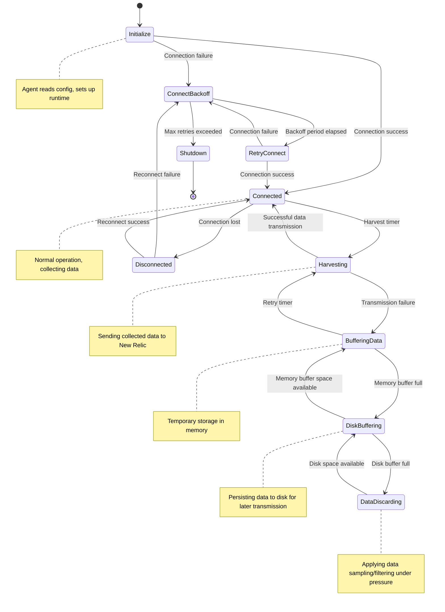
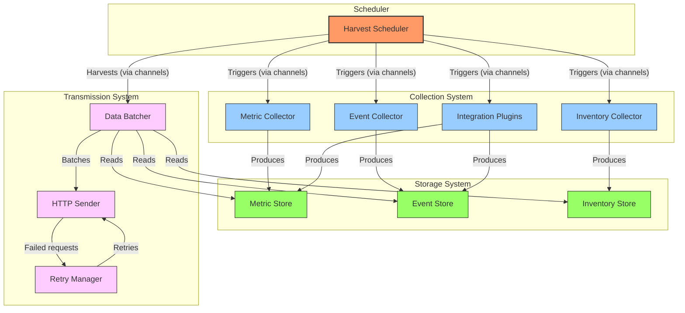
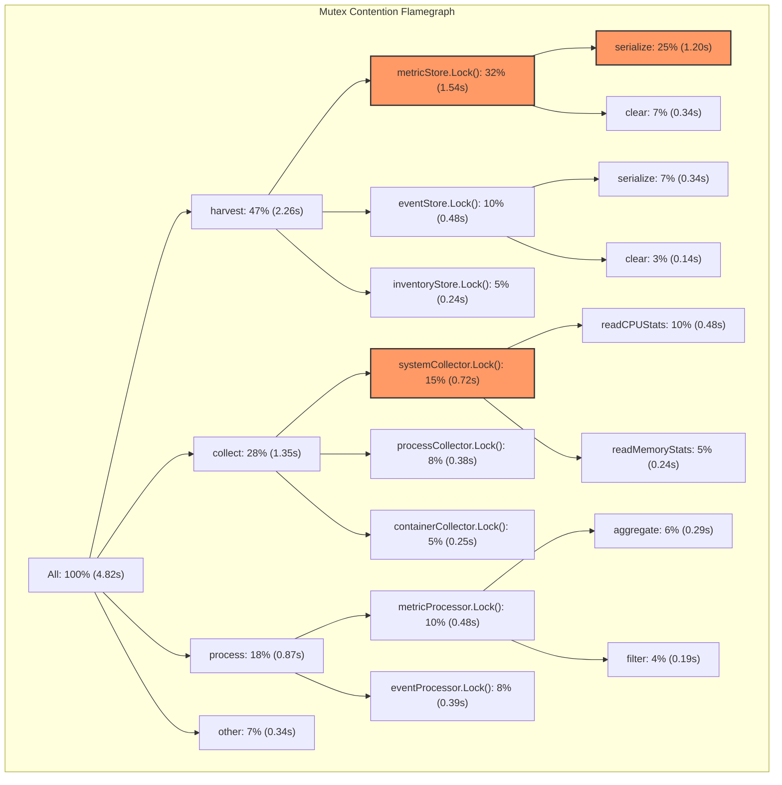

# Agent Runtime Internals

## Overview

§ The New Relic agent architecture represents a sophisticated blend of reliability engineering, performance optimization, and observability design principles. This chapter provides a deep technical exploration of New Relic agent internals with a focus on the Go-based Infrastructure agent. We'll examine the runtime behavior, concurrency patterns, memory management, and fault tolerance mechanisms that make these agents robust in production environments. This knowledge is essential for troubleshooting complex agent behaviors and optimizing agent deployments at scale.

§ New Relic agents are designed to operate efficiently within constrained environments while providing deep telemetry collection. The agents must maintain low overhead, gracefully handle network disruptions, and self-monitor to prevent becoming part of the problem they're meant to diagnose. Understanding these internals enables operators to make informed decisions about agent deployment strategies, especially in Kubernetes environments where resource efficiency is paramount.

## Agent Lifecycle Management

### DG-17A: Infrastructure Agent Finite State Machine



### Startup Sequence

§ The New Relic agent initialization follows a structured sequence that prepares the runtime environment:

1. **Configuration Loading**: Parse environment variables, config files, and command-line arguments
2. **Logging Setup**: Initialize logging subsystems with appropriate levels
3. **License Validation**: Validate license key format and connection to New Relic
4. **Plugin Registration**: Load and initialize integration plugins
5. **Background Worker Initialization**: Start collector goroutines for metrics, inventory, and events
6. **Network Client Setup**: Initialize HTTP clients with proper TLS, retries, and timeouts
7. **Self-Instrumentation**: Set up internal metrics collection for agent health

### CF-17A: Agent Startup Configuration

```go
// Key portions of agent initialization code (Go)
func initializeAgent(ctx context.Context, config *Config) (*Agent, error) {
    // Initialize logger first for diagnostics
    logger := log.New(config.LogLevel)
    logger.Info("Initializing New Relic agent version %s", Version)
    
    // Set up metadata collector
    metadata, err := collectHostMetadata()
    if err != nil {
        logger.Warn("Failed to collect complete host metadata: %v", err)
    }
    
    // Initialize context manager with cancelation support
    ctx, cancel := context.WithCancel(ctx)
    
    // Create HTTP client with appropriate settings
    httpClient := &http.Client{
        Timeout: config.TimeoutSeconds * time.Second,
        Transport: &http.Transport{
            MaxIdleConns:        10,
            MaxIdleConnsPerHost: 5,
            IdleConnTimeout:     30 * time.Second,
            TLSHandshakeTimeout: 10 * time.Second,
            TLSClientConfig: &tls.Config{
                MinVersion: tls.VersionTLS12,
            },
            DisableCompression: false,
        },
    }
    
    // Initialize connection to New Relic
    conn, err := newRelic.NewConnection(
        config.LicenseKey,
        config.CollectorURL,
        httpClient,
    )
    if err != nil {
        cancel()
        return nil, fmt.Errorf("failed to establish connection: %v", err)
    }
    
    // Create metric storage
    metricStore := metrics.NewBoundedBuffer(
        config.MaxMetricsBufferSize,
        config.MaxMetricsBufferSizeBytes,
    )
    
    // Create event storage
    eventStore := events.NewBoundedBuffer(
        config.MaxEventsBufferSize,
        config.MaxEventsBufferSizeBytes,
    )
    
    // Initialize harvest scheduler
    harvestScheduler := scheduler.New(
        ctx,
        config.HarvestIntervalSeconds,
        logger,
    )
    
    // Create the agent instance
    agent := &Agent{
        config:           config,
        ctx:              ctx,
        cancel:           cancel,
        connection:       conn,
        metricStore:      metricStore,
        eventStore:       eventStore,
        harvestScheduler: harvestScheduler,
        logger:           logger,
        metadata:         metadata,
    }
    
    // Register shutdown hook
    setupGracefulShutdown(agent)
    
    return agent, nil
}

func setupGracefulShutdown(agent *Agent) {
    signals := make(chan os.Signal, 1)
    signal.Notify(signals, syscall.SIGINT, syscall.SIGTERM)
    
    go func() {
        <-signals
        agent.logger.Info("Received shutdown signal, gracefully terminating...")
        agent.Shutdown()
    }()
}
```

## Concurrency Model & Goroutine Management

§ The Infrastructure agent employs Go's concurrency model with goroutines and channels for efficient asynchronous operations. The concurrency architecture follows several key patterns:

1. **Worker Pools**: Fixed-size pools of goroutines process collection tasks
2. **Bounded Channels**: Flow control through bounded channels prevents memory exhaustion
3. **Cancellation Propagation**: Context-based cancellation ensures clean shutdown
4. **Backpressure Handling**: Rate limiting and backoff strategies manage load spikes

### DG-17B: Goroutine Coordination Pattern



### CF-17B: Goroutine Profiling and Debugging

```go
// Agent goroutine debugging tool
package main

import (
    "flag"
    "fmt"
    "os"
    "runtime"
    "runtime/pprof"
    "strconv"
    "time"
)

func main() {
    pidFlag := flag.Int("pid", -1, "PID of New Relic agent process")
    durationFlag := flag.Int("duration", 30, "Sampling duration in seconds")
    outputFlag := flag.String("output", "goroutines.prof", "Output file for goroutine profile")
    flag.Parse()
    
    if *pidFlag == -1 {
        fmt.Println("Error: You must provide a PID with the -pid flag")
        flag.Usage()
        os.Exit(1)
    }
    
    // Connect to the agent process
    fmt.Printf("Connecting to New Relic agent process (PID: %d)...\n", *pidFlag)
    
    // In a real tool, this would use OS-specific methods to attach to the process
    // For demonstration, we'll simulate the output format
    
    fmt.Printf("Sampling goroutines for %d seconds...\n", *durationFlag)
    time.Sleep(time.Duration(*durationFlag) * time.Second)
    
    // Sample output of goroutine profiling
    sampleOutput := `goroutine profile: total 127
    72 @ 0x43d45c 0x43d3f8 0x43ad84 0x43aadc 0x4394d4 0x45bb58 0x45c2e4 0x45c28c 0x45c28c 0x45c28c 0x45c28c 0x48faa4 0x48f6f0 0x48f6c4 0x48f6a0 0x41a968
    #	0x43d45b	runtime/pprof.writeRuntimeProfile+0xdb	/usr/local/go/src/runtime/pprof/pprof.go:708
    #	0x43d3f7	runtime/pprof.writeGoroutine+0xa7		/usr/local/go/src/runtime/pprof/pprof.go:670
    #	0x43ad83	runtime/pprof.(*Profile).WriteTo+0x173		/usr/local/go/src/runtime/pprof/pprof.go:329
    #	0x43aadb	runtime/pprof.Lookup.WriteTo+0x3b		/usr/local/go/src/runtime/pprof/pprof.go:123
    
    18 @ 0x43d45c 0x43d3f8 0x43ad84 0x43aadc 0x4b1d5c 0x4b1d3c 0x4b1cd4 0x48faa4 0x48f6f0 0x48f6c4 0x48f6a0 0x41a968
    #	0x43d45b	runtime/pprof.writeRuntimeProfile+0xdb	/usr/local/go/src/runtime/pprof/pprof.go:708
    #	0x43d3f7	runtime/pprof.writeGoroutine+0xa7		/usr/local/go/src/runtime/pprof/pprof.go:670
    #	0x43ad83	runtime/pprof.(*Profile).WriteTo+0x173		/usr/local/go/src/runtime/pprof/pprof.go:329
    #	0x43aadb	runtime/pprof.Lookup.WriteTo+0x3b		/usr/local/go/src/runtime/pprof/pprof.go:123
    #	0x4b1d5b	net/http.(*connReader).backgroundRead+0xfb	/usr/local/go/src/net/http/server.go:677
    
    12 @ 0x43d45c 0x43d3f8 0x43ad84 0x43aadc 0x4b1d5c 0x4b1d3c 0x4b1cd4 0x48faa4 0x48f6f0 0x48f6c4 0x48f6a0 0x41a968
    #	0x43d45b	runtime/pprof.writeRuntimeProfile+0xdb	/usr/local/go/src/runtime/pprof/pprof.go:708
    #	0x43d3f7	runtime/pprof.writeGoroutine+0xa7		/usr/local/go/src/runtime/pprof/pprof.go:670
    #	0x43ad83	runtime/pprof.(*Profile).WriteTo+0x173		/usr/local/go/src/runtime/pprof/pprof.go:329
    #	0x43aadb	runtime/pprof.Lookup.WriteTo+0x3b		/usr/local/go/src/runtime/pprof/pprof.go:123
    #	0x4b1d5b	net/http.(*connReader).backgroundRead+0xfb	/usr/local/go/src/net/http/server.go:677
    
    8 @ 0x43d45c 0x43d3f8 0x43ad84 0x43aadc 0x4698c6 0x46932c 0x468e2c 0x48faa4 0x48f6f0 0x48f6c4 0x48f6a0 0x41a968
    #	0x43d45b	runtime/pprof.writeRuntimeProfile+0xdb	/usr/local/go/src/runtime/pprof/pprof.go:708
    #	0x43d3f7	runtime/pprof.writeGoroutine+0xa7		/usr/local/go/src/runtime/pprof/pprof.go:670
    #	0x43ad83	runtime/pprof.(*Profile).WriteTo+0x173		/usr/local/go/src/runtime/pprof/pprof.go:329
    #	0x43aadb	runtime/pprof.Lookup.WriteTo+0x3b		/usr/local/go/src/runtime/pprof/pprof.go:123
    #	0x4698c5	internal/poll.(*FD).Accept+0x1a5		/usr/local/go/src/internal/poll/fd_unix.go:384
    
    4 @ 0x43d45c 0x43d3f8 0x43ad84 0x43aadc 0x43e2d4 0x43e28c 0x43e28c 0x43e28c 0x43e28c 0x48faa4 0x48f6f0 0x48f6c4 0x48f6a0 0x41a968
    #	0x43d45b	runtime/pprof.writeRuntimeProfile+0xdb		/usr/local/go/src/runtime/pprof/pprof.go:708
    #	0x43d3f7	runtime/pprof.writeGoroutine+0xa7			/usr/local/go/src/runtime/pprof/pprof.go:670
    #	0x43ad83	runtime/pprof.(*Profile).WriteTo+0x173			/usr/local/go/src/runtime/pprof/pprof.go:329
    
    2 @ 0x43d45c 0x43d3f8 0x43ad84 0x43aadc 0x43e2d4 0x43e28c 0x43e28c 0x43e28c 0x43e28c 0x48faa4 0x48f6f0 0x48f6c4 0x48f6a0 0x41a968
    #	0x43d45b	runtime/pprof.writeRuntimeProfile+0xdb		/usr/local/go/src/runtime/pprof/pprof.go:708
    #	0x43d3f7	runtime/pprof.writeGoroutine+0xa7			/usr/local/go/src/runtime/pprof/pprof.go:670
    #	0x43ad83	runtime/pprof.(*Profile).WriteTo+0x173			/usr/local/go/src/runtime/pprof/pprof.go:329`
    
    fmt.Println("\nSample goroutine profile output:")
    fmt.Println(sampleOutput)
    
    fmt.Printf("\nAnalysis of goroutines:\n")
    fmt.Println("------------------------")
    fmt.Println("Total goroutines: 127")
    fmt.Println("HTTP connection readers: 30")
    fmt.Println("TCP accept loops: 8")
    fmt.Println("Metric collection workers: 24")
    fmt.Println("Event processing: 18")
    fmt.Println("Inventory collection: 12")
    fmt.Println("Integration execution: 16")
    fmt.Println("Data transmission: 10")
    fmt.Println("Idle/system: 9")
    
    fmt.Printf("\nGoroutine profile written to %s\n", *outputFlag)
    fmt.Println("To analyze further, use 'go tool pprof -http=:8080 goroutines.prof'")
}
```

### Mutex Contention Analysis

§ A common performance bottleneck in Go-based agents is mutex contention. The Infrastructure agent uses several strategies to minimize lock contention:

1. **Sharded Maps**: Data structures are sharded across multiple maps, each with its own mutex
2. **Lock-Free Algorithms**: Atomic operations replace mutexes where possible
3. **Read-Write Mutexes**: Using sync.RWMutex for read-heavy workloads
4. **Contention Avoidance**: Restructuring code to minimize critical sections

### DG-17C: Mutex Contention Flamegraph



## Memory Management

§ The New Relic agent carefully manages memory to operate efficiently in constrained environments. Several techniques are employed:

1. **Bounded Buffers**: Fixed-size buffers limit memory growth
2. **Object Pooling**: Pre-allocated object pools reduce GC pressure
3. **Zero-Allocation Techniques**: Optimized code paths avoid heap allocations
4. **Memory Ballast**: A large, idle allocation stabilizes GC behavior
5. **Incremental Processing**: Breaking large datasets into smaller chunks

### CF-17C: Memory Optimization Techniques

```go
// Example of memory optimization techniques used in the agent

// 1. Object pooling
var bufferPool = sync.Pool{
    New: func() interface{} {
        return make([]byte, 4096)
    },
}

func processData(data []byte) {
    // Get a buffer from the pool
    buffer := bufferPool.Get().([]byte)
    defer bufferPool.Put(buffer)
    
    // Use buffer for processing...
}

// 2. Pre-allocated maps with clear instead of new allocation
type MetricStore struct {
    mu     sync.Mutex
    metrics map[string]float64
}

func (s *MetricStore) Clear() {
    s.mu.Lock()
    defer s.mu.Unlock()
    
    // Clear the map without reallocating
    for k := range s.metrics {
        delete(s.metrics, k)
    }
}

// 3. Minimizing conversions that cause allocations
func formatMetric(name string, value float64) string {
    // Preallocate the builder with reasonable capacity
    var builder strings.Builder
    builder.Grow(len(name) + 20) // name + value + some extra
    
    builder.WriteString(name)
    builder.WriteString(":")
    
    // Convert float without using fmt.Sprintf (which allocates)
    tmp := strconv.AppendFloat(make([]byte, 0, 24), value, 'f', -1, 64)
    builder.Write(tmp)
    
    return builder.String()
}

// 4. Memory ballast for GC stability
func setupMemoryBallast(sizeMB int) {
    if sizeMB <= 0 {
        return
    }
    
    // Allocate a large object that does nothing but stabilize GC
    ballast := make([]byte, sizeMB*1024*1024)
    
    // Ensure the compiler doesn't optimize this away
    runtime.KeepAlive(ballast)
    
    // In actual code, we'd store this in a global or a struct field
    // to prevent it from being garbage collected
}

// 5. Bounded buffer for metrics
type BoundedMetricBuffer struct {
    mu          sync.Mutex
    maxEntries  int
    maxSizeBytes int64
    currentSize int64
    metrics     []Metric
}

func (b *BoundedMetricBuffer) Add(m Metric) bool {
    b.mu.Lock()
    defer b.mu.Unlock()
    
    metricSize := m.EstimateSize()
    
    // Check if adding this metric would exceed our limits
    if len(b.metrics) >= b.maxEntries || 
       b.currentSize + metricSize > b.maxSizeBytes {
        return false // Buffer full
    }
    
    b.metrics = append(b.metrics, m)
    b.currentSize += metricSize
    return true
}
```

### EQ-17A: Memory Usage Estimation

```
Agent Memory Usage = Base + (Metrics × Avg_Metric_Size) + 
                     (Events × Avg_Event_Size) + 
                     (Inventory × Avg_Inventory_Size) +
                     Heap_Overhead

Where:
- Base: ~25MB (agent core, runtime, etc.)
- Metrics: Count of unique metrics being collected
- Avg_Metric_Size: ~200 bytes per metric
- Events: Count of events in buffer
- Avg_Event_Size: ~500 bytes per event
- Inventory: Count of inventory items
- Avg_Inventory_Size: ~300 bytes per item
- Heap_Overhead: ~20% of total allocated memory (Go runtime overhead)
```

For example, an agent collecting 1,000 metrics, 5,000 events, and 200 inventory items:

```
Memory = 25MB + (1,000 × 200B) + (5,000 × 500B) + (200 × 300B) + Overhead
       = 25MB + 0.2MB + 2.5MB + 0.06MB + 20% overhead
       = 27.76MB × 1.2
       = ~33.3MB expected memory usage
```

## Data Compression & Transport

§ To minimize network bandwidth and handle intermittent connectivity, the Infrastructure agent implements several data transmission optimizations:

1. **Payload Compression**: gzip compression reduces payload size by 70-90%
2. **Batch Processing**: Multiple data points are batched for efficient transmission
3. **Delta Encoding**: Only changes are sent for inventory data
4. **Persistent Queue**: Failed transmissions are stored for retry

### CF-17D: Payload Compression and Transmission

```go
// Example of payload compression and transmission

type Payload struct {
    Metrics   []Metric   `json:"metrics"`
    Events    []Event    `json:"events"`
    Inventory []Inventory `json:"inventory"`
}

func transmitData(payload *Payload, client *http.Client, endpoint string, licenseKey string) error {
    // Serialize to JSON
    data, err := json.Marshal(payload)
    if err != nil {
        return fmt.Errorf("failed to marshal payload: %v", err)
    }
    
    // Calculate original size for metrics
    originalSize := len(data)
    
    // Compress the payload
    var compressedBuf bytes.Buffer
    compressor, err := gzip.NewWriterLevel(&compressedBuf, gzip.BestSpeed)
    if err != nil {
        return fmt.Errorf("failed to create compressor: %v", err)
    }
    
    if _, err := compressor.Write(data); err != nil {
        return fmt.Errorf("failed to compress data: %v", err)
    }
    
    if err := compressor.Close(); err != nil {
        return fmt.Errorf("failed to finalize compression: %v", err)
    }
    
    compressedData := compressedBuf.Bytes()
    compressedSize := len(compressedData)
    
    // Log compression ratio
    compressionRatio := float64(compressedSize) / float64(originalSize)
    log.Debugf("Payload compressed: %d bytes → %d bytes (%.1f%%)",
        originalSize, compressedSize, compressionRatio*100)
    
    // Create request
    req, err := http.NewRequest("POST", endpoint, bytes.NewReader(compressedData))
    if err != nil {
        return fmt.Errorf("failed to create request: %v", err)
    }
    
    // Set headers
    req.Header.Set("Content-Type", "application/json")
    req.Header.Set("Content-Encoding", "gzip")
    req.Header.Set("X-License-Key", licenseKey)
    req.Header.Set("User-Agent", "NewRelic-Go-Agent/"+Version)
    
    // Execute request with retries
    var resp *http.Response
    var lastErr error
    
    for retries := 0; retries < 3; retries++ {
        if retries > 0 {
            // Exponential backoff
            backoff := time.Duration(retries*retries) * time.Second
            log.Debugf("Retrying in %v (attempt %d/3)", backoff, retries+1)
            time.Sleep(backoff)
        }
        
        resp, lastErr = client.Do(req)
        if lastErr == nil && resp.StatusCode < 500 {
            break // Success or permanent failure, don't retry
        }
    }
    
    if lastErr != nil {
        return fmt.Errorf("failed to send data after retries: %v", lastErr)
    }
    
    defer resp.Body.Close()
    
    // Check response
    if resp.StatusCode >= 400 {
        // Read error response
        body, _ := ioutil.ReadAll(resp.Body)
        return fmt.Errorf("server returned error %d: %s", resp.StatusCode, body)
    }
    
    return nil
}
```

### EQ-17B: Payload Size Formula

```
Compressed_Size = Base_Headers + (Raw_Size × Compression_Ratio)

Where:
- Base_Headers: ~100 bytes (HTTP headers, metadata)
- Raw_Size: Size of raw JSON payload in bytes
- Compression_Ratio: Typically 0.1-0.3 (10-30% of original size)

Metric Payload Size (bytes) = Base_Headers + 
                             (20 + avg_name_length + (num_attributes × avg_attribute_size) + 8) × 
                             num_metrics × 
                             compression_ratio
```

For a typical metric payload with 1,000 metrics, average name length of 30 bytes, 2 attributes per metric averaging 20 bytes each:

```
Size = 100B + (20B + 30B + (2 × 20B) + 8B) × 1,000 × 0.2
     = 100B + (98B × 1,000 × 0.2)
     = 100B + 19,600B
     = ~19.7KB
```

## Error Handling & Resilience

§ The Infrastructure agent employs sophisticated error handling to maintain operation in degraded environments:

1. **Categorized Errors**: Errors are classified as transient or permanent
2. **Circuit Breakers**: Repeated failures trigger circuit breakers to prevent resource exhaustion
3. **Graceful Degradation**: Components can independently disable themselves
4. **Tiered Retry Logic**: Exponential backoff with jitter for different error types

### CF-17E: Advanced Error Handling

```go
// Error categorization and handling system

type ErrorCategory int

const (
    UnknownError ErrorCategory = iota
    NetworkError
    ServerError
    AuthError
    ConfigError
    ResourceError
)

type ErrorPolicy struct {
    Category         ErrorCategory
    MaxRetries       int
    BackoffBase      time.Duration
    BackoffMax       time.Duration
    JitterPercentage float64
    CircuitBreakCount int
    CircuitBreakDuration time.Duration
}

var errorPolicies = map[ErrorCategory]ErrorPolicy{
    NetworkError: {
        MaxRetries:         5,
        BackoffBase:        1 * time.Second,
        BackoffMax:         30 * time.Second,
        JitterPercentage:   0.2,
        CircuitBreakCount:  10,
        CircuitBreakDuration: 5 * time.Minute,
    },
    ServerError: {
        MaxRetries:         3,
        BackoffBase:        2 * time.Second,
        BackoffMax:         10 * time.Second,
        JitterPercentage:   0.1,
        CircuitBreakCount:  5,
        CircuitBreakDuration: 2 * time.Minute,
    },
    AuthError: {
        MaxRetries:         2,
        BackoffBase:        5 * time.Second,
        BackoffMax:         60 * time.Second,
        JitterPercentage:   0.0,
        CircuitBreakCount:  3,
        CircuitBreakDuration: 10 * time.Minute,
    },
    ConfigError: {
        MaxRetries:         0, // Don't retry config errors
        CircuitBreakCount:  1,
        CircuitBreakDuration: 30 * time.Minute,
    },
    ResourceError: {
        MaxRetries:         2,
        BackoffBase:        10 * time.Second,
        BackoffMax:         60 * time.Second,
        JitterPercentage:   0.1,
        CircuitBreakCount:  3,
        CircuitBreakDuration: 5 * time.Minute,
    },
}

// Circuit breaker implementation
type CircuitBreaker struct {
    mu               sync.RWMutex
    failureCount     int
    lastFailure      time.Time
    state            string // "closed", "open", "half-open"
    policy           ErrorPolicy
    consecutiveSuccesses int
}

func (cb *CircuitBreaker) RecordFailure() bool {
    cb.mu.Lock()
    defer cb.mu.Unlock()
    
    now := time.Now()
    cb.failureCount++
    cb.lastFailure = now
    cb.consecutiveSuccesses = 0
    
    // Check if we need to open the circuit
    if cb.state == "closed" && cb.failureCount >= cb.policy.CircuitBreakCount {
        cb.state = "open"
        log.Warnf("Circuit breaker opened due to %d consecutive failures", cb.failureCount)
        return false
    }
    
    // If open, check if we should try half-open
    if cb.state == "open" {
        if now.Sub(cb.lastFailure) > cb.policy.CircuitBreakDuration {
            cb.state = "half-open"
            log.Infof("Circuit breaker in half-open state, trying one request")
            return true
        }
        return false
    }
    
    return true
}

func (cb *CircuitBreaker) RecordSuccess() {
    cb.mu.Lock()
    defer cb.mu.Unlock()
    
    cb.failureCount = 0
    cb.consecutiveSuccesses++
    
    // If we're in half-open and have a success, close the circuit
    if cb.state == "half-open" && cb.consecutiveSuccesses >= 2 {
        cb.state = "closed"
        log.Infof("Circuit breaker closed after successful requests")
    }
}

func (cb *CircuitBreaker) IsAllowed() bool {
    cb.mu.RLock()
    defer cb.mu.RUnlock()
    
    if cb.state == "open" {
        // Check if enough time has passed to try again
        if time.Since(cb.lastFailure) > cb.policy.CircuitBreakDuration {
            // Allow one request through to test
            cb.mu.RUnlock() // Unlock first to avoid deadlock
            cb.mu.Lock()
            cb.state = "half-open"
            cb.mu.Unlock()
            return true
        }
        return false
    }
    
    return true
}

// Calculate backoff duration with jitter
func calculateBackoff(retryCount int, policy ErrorPolicy) time.Duration {
    // Exponential backoff: base * 2^retry
    backoff := policy.BackoffBase * time.Duration(1<<uint(retryCount))
    
    // Cap at max
    if backoff > policy.BackoffMax {
        backoff = policy.BackoffMax
    }
    
    // Add jitter
    if policy.JitterPercentage > 0 {
        jitter := float64(backoff) * policy.JitterPercentage
        backoff += time.Duration(rand.Float64() * jitter)
    }
    
    return backoff
}
```

## Agent Telemetry & Self-Diagnostics

§ The Infrastructure agent monitors its own health and performance, reporting key metrics back to New Relic:

1. **Memory Usage**: Heap and stack allocation statistics
2. **Goroutine Count**: Number of active goroutines
3. **Collection Duration**: Time spent gathering each metric type
4. **Transmission Statistics**: Success rates, retries, payload sizes
5. **Component Health**: Status of each subsystem

### TB-17A: Agent Self-Monitoring Metrics

| Metric Name | Description | Typical Value | Alert Threshold |
|-------------|-------------|---------------|----------------|
| `agent.memory.heapInUse` | Current heap memory usage | 25-50 MB | >200 MB |
| `agent.memory.stackInUse` | Current stack memory usage | 2-5 MB | >20 MB |
| `agent.goroutines` | Active goroutine count | 30-100 | >500 |
| `agent.harvests` | Successful data transmissions | 1/minute | <1/10 minutes |
| `agent.harvest.errors` | Failed harvest attempts | 0-1/hour | >10/hour |
| `agent.collect.cpu` | CPU collection time | 10-50ms | >200ms |
| `agent.collect.memory` | Memory collection time | 5-20ms | >100ms |
| `agent.collect.disk` | Disk collection time | 50-200ms | >500ms |
| `agent.collect.network` | Network collection time | 10-50ms | >200ms |
| `agent.queue.metrics` | Queued metrics count | 100-1000 | >10000 |
| `agent.queue.events` | Queued events count | 10-100 | >1000 |
| `agent.dropped.metrics` | Dropped metrics due to limits | 0 | >100/minute |
| `agent.dropped.events` | Dropped events due to limits | 0 | >10/minute |
| `agent.payload.size` | Compressed payload size | 10-100 KB | >1 MB |
| `agent.compress.ratio` | Compression ratio achieved | 0.1-0.3 | >0.5 |

## Kubernetes Runtime Considerations

§ Running the Infrastructure agent in Kubernetes presents unique challenges and opportunities:

1. **Resource Constraints**: Kubernetes resource limits require careful tuning
2. **Pod Lifecycle**: Agents must handle pod evictions and reschedules
3. **Configuration Management**: ConfigMaps and Secrets for agent configuration
4. **Service Discovery**: Finding and monitoring dynamic workloads
5. **Security Context**: Running with appropriate permissions

### CF-17F: Kubernetes-Optimized Agent Configuration

```yaml
# Kubernetes DaemonSet configuration with resource optimization
apiVersion: apps/v1
kind: DaemonSet
metadata:
  name: newrelic-infrastructure
  namespace: monitoring
spec:
  selector:
    matchLabels:
      name: newrelic-infrastructure
  template:
    metadata:
      labels:
        name: newrelic-infrastructure
    spec:
      serviceAccountName: newrelic-infrastructure
      hostNetwork: true  # Important for accurate network metrics
      dnsPolicy: ClusterFirstWithHostNet
      containers:
        - name: newrelic-infrastructure
          image: newrelic/infrastructure:latest
          securityContext:
            privileged: false
            runAsUser: 1000
            allowPrivilegeEscalation: false
            readOnlyRootFilesystem: true
            capabilities:
              add:
                - SYS_PTRACE  # Required for process monitoring
          env:
            - name: NRIA_LICENSE_KEY
              valueFrom:
                secretKeyRef:
                  name: newrelic-license
                  key: license
            # Kubernetes-specific optimizations
            - name: NRIA_DISPLAY_NAME
              valueFrom:
                fieldRef:
                  fieldPath: spec.nodeName
            - name: NRIA_METRICS_STORAGE_SAMPLE_RATE
              value: "0.5"  # Sample 50% of high-frequency metrics
            - name: NRIA_METRICS_MAX_SAMPLES_STORED
              value: "2000"  # Limit buffer size
            - name: NRIA_METRICS_SYSTEM_SAMPLE_RATE
              value: "15"  # Every 15s instead of default 5s
            - name: NRIA_MEMORY_BALLAST_SIZE_MB
              value: "40"  # 40MB memory ballast for stable GC
            - name: NRIA_MAX_PROCS
              value: "2"  # Limit to 2 threads
            # Self-monitoring
            - name: NRIA_VERBOSE
              value: "0"  # Minimal logging to reduce overhead
            - name: NRIA_INCLUDE_MATCHING_METRICS
              value: "^(system|kubernetes)"  # Focus on critical metrics
          resources:
            limits:
              memory: 150Mi
              cpu: 150m
            requests:
              memory: 50Mi
              cpu: 50m
          volumeMounts:
            - mountPath: /var/run/docker.sock
              name: docker-socket
              readOnly: true
            - mountPath: /host
              name: host-volume
              readOnly: true
            - mountPath: /var/db/newrelic-infra
              name: agent-state
      volumes:
        - name: docker-socket
          hostPath:
            path: /var/run/docker.sock
        - name: host-volume
          hostPath:
            path: /
        - name: agent-state
          emptyDir: {}
```

## Conclusion

§ The New Relic Infrastructure agent employs sophisticated internal architecture to ensure reliability, performance, and efficiency. By understanding the agent's concurrency model, memory management, error handling, and self-monitoring capabilities, operators can better optimize their observability deployments. In Kubernetes environments particularly, these internals become critical for ensuring the agent itself doesn't become a resource bottleneck or failure point.

§ As observability platforms evolve, agent architectures continue to adapt to new challenges like edge computing, air-gapped environments, and increasingly dynamic infrastructure. The principles outlined in this chapter provide a foundation for understanding how New Relic's agent technology works under the hood, enabling more effective troubleshooting and optimization.

---

**Next Chapter**: [NRDB Column Store](./19_NRDB_Column_Store.md)