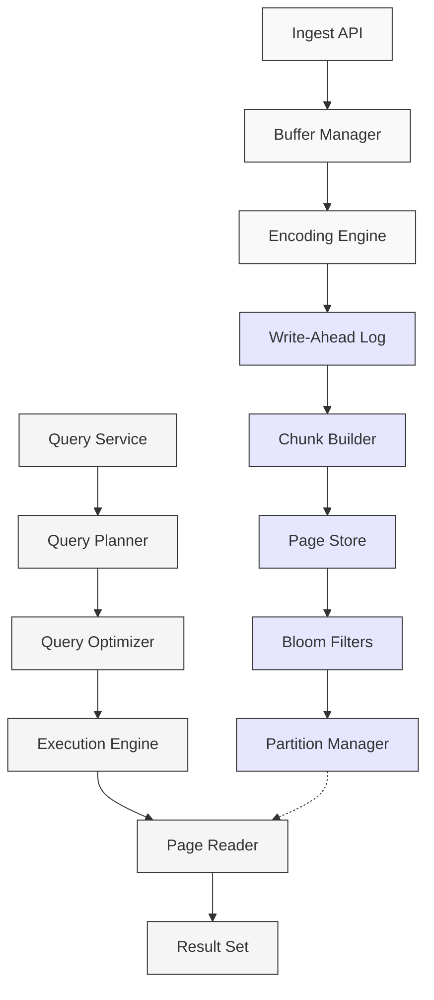

# NRDB Column Store

## Architecture Overview

New Relic Database (NRDB) is a purpose-built columnar store designed for high-speed ingestion and analytical queries across massive telemetry datasets. Unlike traditional row-oriented databases, NRDB's column-oriented structure enables efficient compression, faster aggregations, and better query performance for observability workloads.

### Key Design Principles

1. **Columnar Storage**: Data is organized by columns rather than rows, optimizing for analytical queries that typically access a subset of columns
2. **Immutable Data**: Once written, data is not modified, simplifying concurrency and enabling aggressive compression
3. **Time-Partitioned**: Data is automatically partitioned by time for efficient pruning during queries
4. **Distributed Architecture**: Scales horizontally across multiple nodes for both storage and compute
5. **Optimized for Append**: Designed for high-throughput, write-heavy workloads common in observability

## Data Flow Architecture

The following diagram illustrates the data flow from ingestion through storage to query:

## Storage Hierarchy

NRDB organizes data in a hierarchical structure:

1. **Chunks**: The primary unit of data organization, typically containing data for a specific time window
2. **Pages**: Subdivisions within chunks, storing columns of data with identical schemas
3. **Blocks**: Physical storage units containing compressed column data
4. **Partitions**: Logical groupings of chunks based on time boundaries
5. **Shards**: Horizontal partitions distributed across the cluster

### Chunk Structure

Each chunk in NRDB contains:

- **Metadata Header**: Schema information, time range, and chunk statistics
- **Column Data**: Encoded and compressed column values
- **Dictionary Tables**: Mappings for cardinality-optimized string columns
- **Bloom Filters**: Probabilistic data structures for efficient filtering
- **Min/Max Indices**: Range information for each column to enable pruning

## Compression Techniques

NRDB employs multiple compression strategies optimized for different data types:

| Data Type | Compression Method | Typical Ratio | Trade-offs |
|-----------|-------------------|---------------|------------|
| Timestamps | Delta-of-delta encoding | 10:1 | Low CPU, excellent for time series |
| Integers | Bit-packing + dictionary | 8:1 | Moderate CPU, great for cardinality |
| Floats | XOR + significant bits | 6:1 | Higher CPU, best for metrics |
| Strings | Dictionary + LZ4 | 4:1 | Memory-intensive, excellent for labels |
| Sparse columns | Run-length encoding | 20:1+ | Excellent for high-NULL columns |

The overall compression typically achieves 8-12× reduction in storage requirements compared to raw JSON representation, with minimal query-time decompression overhead.

## Query Execution

When a NRQL query is executed against NRDB:

1. **Time-based pruning** eliminates irrelevant partitions
2. **Bloom filters** quickly reject chunks that cannot contain matching data
3. **Min/max indices** allow further chunk elimination based on filter predicates
4. **Columnar reads** load only required columns into memory
5. **Vectorized execution** processes multiple rows simultaneously
6. **Partition-level parallelism** distributes work across available cores

This multi-tiered approach to query optimization enables NRDB to scan billions of events while returning results in seconds.

## Performance Characteristics

NRDB's columnar architecture delivers several key performance advantages:

- **Ingest rates**: >1M events per second per node
- **Compression efficiency**: 8-12× compared to raw JSON
- **Query latency**: Sub-second for aggregations over millions of events
- **Storage efficiency**: ~20 bytes per event (average, compressed)
- **Scan throughput**: >1GB/s per core for filtered queries

## High Availability Design

NRDB implements several mechanisms to ensure high availability:

1. **Replication**: Data is automatically replicated across multiple nodes
2. **Quorum writes**: Ensures data durability even with node failures
3. **Self-healing**: Automatic recovery and rebalancing when nodes return
4. **Read-only mode**: Continues serving queries even during write availability issues
5. **Cross-region replication**: Optional geographic redundancy for disaster recovery

## Optimization Best Practices

To maximize NRDB performance for Kubernetes observability:

1. **Attribute selection**: Include only necessary attributes in events to reduce storage overhead
2. **Cardinality management**: Limit high-cardinality dimensions to essential use cases
3. **Timestamp precision**: Use second-level precision when milliseconds aren't required
4. **Query patterns**: Leverage NRQL's optimized aggregate functions (`percentile()`, `latest()`, etc.)
5. **Event types**: Organize data logically into event types for efficient querying

Understanding NRDB's columnar architecture is essential for optimizing both ingest efficiency and query performance in Kubernetes observability workloads.