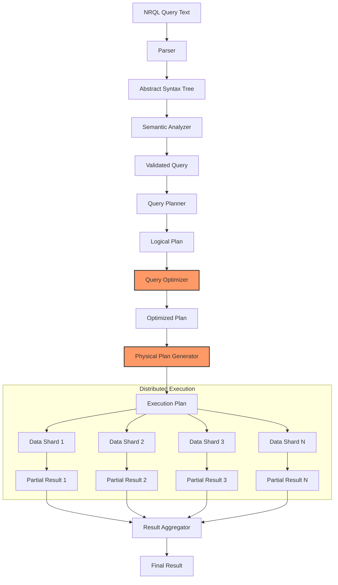
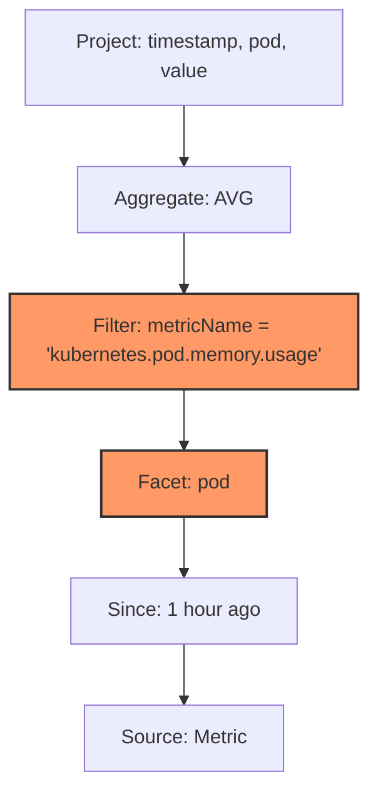

# NRQL Optimizer & Cost

## Overview

§ The New Relic Query Language (NRQL) provides a powerful SQL-like interface for querying telemetry data in NRDB. Behind this interface lies a sophisticated query optimizer and execution engine that transforms declarative queries into efficient execution plans. This chapter explores the internals of the NRQL optimizer, its cost model, and performance characteristics. Understanding how NRQL queries are processed and optimized is essential for writing efficient queries and managing query costs, especially in large-scale Kubernetes environments where query volume and data sizes can be substantial.

§ As organizations scale their observability practices, the efficiency of their queries becomes increasingly important. Inefficient queries not only impact user experience through slow dashboard refreshes and alert evaluations but can also drive up costs in consumption-based pricing models. This chapter provides deep technical insights into how the NRQL engine evaluates queries and offers practical strategies for query optimization across common Kubernetes observability use cases.

## NRQL Engine Architecture

§ The NRQL engine follows a distributed query processing architecture optimized for time-series and event data. Queries pass through several stages of processing:

1. **Parsing & Validation**: Converting SQL text to an abstract syntax tree (AST)
2. **Semantic Analysis**: Resolving data types and validating functions
3. **Query Planning**: Generating logical and physical execution plans
4. **Optimization**: Applying transformations to improve efficiency
5. **Distributed Execution**: Executing queries across data partitions
6. **Result Aggregation**: Combining partial results into final output

### DG-21A: NRQL Query Processing Pipeline



### DG-21B: Logical Plan Tree Example



## Query Optimizer

§ The NRQL optimizer transforms queries to improve execution efficiency using several key techniques:

1. **Predicate Pushdown**: Moving filters closer to data sources to reduce scan volume
2. **Projection Pruning**: Selecting only necessary columns to minimize data transfer
3. **Execution Order Optimization**: Reordering operations to minimize intermediate results
4. **Index Selection**: Choosing the most efficient indexes for data access
5. **Partition Pruning**: Eliminating unnecessary time partitions from scans
6. **Query Rewriting**: Transforming queries into semantically equivalent but more efficient forms

### CF-21A: Query Rewrite Examples

```sql
-- Original inefficient query:
SELECT * FROM Metric WHERE metricName = 'cpu.utilization' SINCE 1 day ago

-- Rewritten by optimizer:
SELECT timestamp, entityName, numeric.1.value FROM Metric WHERE metricName = 'cpu.utilization' SINCE 1 day ago LIMIT 10000

-- Original query with expensive functions:
SELECT * FROM Transaction WHERE strContains(name, '/api/users/')

-- Rewritten by optimizer:
SELECT * FROM Transaction WHERE name LIKE '%/api/users/%'

-- Original query with multiple facets:
SELECT count(*) FROM Transaction FACET name, http.statusCode, http.method

-- Rewritten for performance:
SELECT count(*) FROM Transaction FACET name LIMIT 100 FACET http.statusCode, http.method WHERE name IN {{previousFacetValues}}

-- Original query with inefficient window function:
SELECT latest(value), percentile(value, 95) FROM Metric WHERE metricName = 'memory.usage' FACET entityName TIMESERIES

-- Rewritten as separate queries:
-- Query 1: SELECT latest(value) FROM Metric WHERE metricName = 'memory.usage' FACET entityName TIMESERIES
-- Query 2: SELECT percentile(value, 95) FROM Metric WHERE metricName = 'memory.usage' FACET entityName TIMESERIES
```

### TB-21A: Optimizer Strategies

| Strategy | Description | When Applied | Performance Impact |
|----------|-------------|--------------|-------------------|
| Predicate Pushdown | Move filters to earliest possible stage | Queries with WHERE clauses | 10-1000x improvement |
| Projection Pruning | Select only needed columns | SELECT with specific attributes | 2-5x improvement |
| Join Reordering | Optimize join sequence | Queries with multiple JOINs | 2-10x improvement |
| LIMIT Pushdown | Apply limits before expensive operations | Queries with LIMIT clauses | 2-20x improvement |
| Function Inlining | Replace function calls with direct operations | Queries with simple functions | 1.5-3x improvement |
| Common Subexpression Elimination | Compute repeated expressions once | Complex arithmetic expressions | 1.2-2x improvement |
| Time-Based Partitioning | Restrict scans to relevant time partitions | Queries with SINCE/UNTIL | 5-100x improvement |
| Query Decomposition | Split complex queries into simpler ones | Multi-facet, multi-window queries | 2-10x improvement |

## Cost-Based Optimization

§ NRQL employs a cost-based optimizer that estimates the computational expense of different execution plans:

1. **Statistical Metadata**: The optimizer uses statistics about data distribution
2. **Cost Formulas**: Each operation has an associated cost formula
3. **Resource Modeling**: CPU, memory, and I/O costs are considered
4. **Cardinality Estimation**: The optimizer estimates result sizes at each step

### TB-21B: Operation Cost Models

| Operation Type | Cost Formula | Example | 
|----------------|--------------|---------|
| Table Scan | `rows_to_scan × row_size × scan_factor` | Full scan of 100M metrics ≈ 1000 cost units |
| Index Scan | `log(num_entries) × entries_to_scan × entry_size` | Index scan of 10K entries ≈ 5 cost units |
| Filter | `input_rows × filter_selectivity × filter_complexity` | 50% selective filter on 1M rows ≈ 50 cost units |
| Aggregation | `input_rows × aggregation_factor + output_rows` | Count by group on 10M rows with 1K groups ≈ 110 cost units |
| Sort | `input_rows × log(input_rows) × sort_factor` | Sorting 100K results ≈ 70 cost units |
| Join | `outer_rows × inner_rows × join_selectivity × join_factor` | Joining 10K × 100 rows with 1% match ≈ 10 cost units |
| FACET | `input_rows × num_facets × facet_factor` | 1M rows with 3 facet dimensions ≈ 300 cost units |
| TIMESERIES | `input_rows × timeseries_factor + num_buckets` | 1M rows into 60 time buckets ≈ 160 cost units |

### EQ-21A: NRQL Query Cost Estimation

```
Total Query Cost = Scan Cost + Processing Cost + Output Cost

Where:
- Scan Cost = Rows_Scanned × Row_Size × IO_Cost_Factor
- Processing Cost = Sum(Operation_Cost)
- Output Cost = Result_Size × Output_Factor

Operation_Cost = Base_Cost × Data_Volume × Operation_Complexity
```

Example calculation for a query scanning 100M metrics, filtering to 10M, aggregating to 1K groups:

```
Scan Cost = 100,000,000 × 200 bytes × 0.00001 = 200 units
Filter Cost = 100,000,000 × 0.1 × 0.001 = 10 units
Aggregation Cost = 10,000,000 × 0.01 + 1,000 = 101 units
Output Cost = 1,000 × 0.1 = 0.1 units

Total Cost = 200 + 10 + 101 + 0.1 = 311.1 cost units
```

## Query Execution 

§ Once optimized, queries are executed through a distributed execution framework:

1. **Query Coordinator**: Orchestrates the overall query execution
2. **Partition Router**: Determines which partitions to scan
3. **Execution Workers**: Perform the actual data processing
4. **Result Collector**: Aggregates partial results

### CF-21B: EXPLAIN Query Output

```sql
-- Example query
EXPLAIN SELECT average(numeric.1.value) FROM Metric 
WHERE metricName = 'container.cpu.usage' 
FACET kubernetes.containerName 
SINCE 1 hour ago TIMESERIES 5 minutes

-- EXPLAIN output
{
  "queryPlan": {
    "planType": "distributedTimeseries",
    "timeWindow": {
      "begin": "2025-04-23T08:23:00Z",
      "end": "2025-04-23T09:23:00Z"
    },
    "timeseriesInterval": 300,
    "scanTargets": {
      "type": "metricData",
      "metricName": "container.cpu.usage",
      "estimatedRowCount": 8753120,
      "estimatedScanTimeMs": 423
    },
    "operations": [
      {
        "type": "scan",
        "target": "Metric",
        "filters": [
          {
            "attribute": "metricName",
            "operator": "=",
            "value": "container.cpu.usage",
            "estimatedSelectivity": 0.002
          },
          {
            "attribute": "timestamp",
            "operator": ">=",
            "value": "2025-04-23T08:23:00Z"
          },
          {
            "attribute": "timestamp",
            "operator": "<",
            "value": "2025-04-23T09:23:00Z"
          }
        ],
        "estimatedOutputRows": 17506
      },
      {
        "type": "project",
        "attributes": ["timestamp", "kubernetes.containerName", "numeric.1.value"]
      },
      {
        "type": "timeseries",
        "interval": 300,
        "buckets": 12
      },
      {
        "type": "groupBy",
        "keys": ["kubernetes.containerName", "timeseriesBucket"],
        "estimatedGroups": 648
      },
      {
        "type": "aggregate",
        "function": "average",
        "attribute": "numeric.1.value"
      }
    ],
    "estimatedCost": 148.3,
    "estimatedExecutionTimeMs": 517
  }
}
```

### TB-21C: Common Performance Bottlenecks

| Bottleneck | Symptoms | Solution |
|------------|----------|----------|
| High Cardinality Facets | Slow query, high memory | Limit facet values, use LIMIT clause |
| Inefficient Date Functions | CPU-bound processing | Use simpler SINCE/UNTIL clauses |
| String Operations | Slow query, high CPU | Use indexed fields, LIKE or IN operators |
| Missing Constraints | Full table scan | Add time bounds, use indexed attributes |
| Complex Aggregations | Long compute time | Pre-aggregate, use simpler functions |
| Too Many Time Series | Slow rendering, memory pressure | Reduce granularity, limit facets |
| Regular Expressions | Linear scanning | Use LIKE when possible, limit scope |
| Sub-queries | Repeated execution | Join or union instead, materialize results |

## Query Latency & Cost

§ NRQL query latency is influenced by several factors:

1. **Data Volume**: Number of records scanned
2. **Query Complexity**: Types and number of operations
3. **Cardinality**: Number of unique groups or facet values
4. **Time Range**: Size of the time window
5. **Concurrency**: Number of simultaneous queries

### EQ-21B: Query Latency Modeling

```
Estimated Latency = Base_Latency + 
                    (Rows_Scanned / Scan_Throughput) +
                    (Operation_Complexity × Processing_Factor) +
                    (Result_Size × Output_Factor)

Where:
- Base_Latency: Fixed overhead (typically 50-100ms)
- Scan_Throughput: Row scanning speed (typically 10-50M rows/second)
- Operation_Complexity: Weighted sum of operation complexities
- Processing_Factor: CPU processing speed adjustment
- Result_Size: Number of output rows
- Output_Factor: Output formatting and transmission cost
```

For example, estimating latency for a query scanning 50M records with medium complexity:

```
Latency = 100ms + (50,000,000 / 20,000,000) + (5 × 50ms) + (1,000 × 0.1ms)
        = 100ms + 2,500ms + 250ms + 100ms
        = 2,950ms ≈ 3 seconds
```

### EQ-21C: NRQL Query Cost Formula

```
Query Cost ($) = Data_Scanned_GB × Scan_Cost_Per_GB + 
                  Compute_Units × Compute_Cost_Per_Unit

Where:
- Data_Scanned_GB: Volume of data scanned by the query
- Scan_Cost_Per_GB: Cost per GB of data scanned (e.g., $0.05/GB)
- Compute_Units: Computational resources consumed (CPU, memory)
- Compute_Cost_Per_Unit: Cost per compute unit (e.g., $0.01/CU)
```

For example, a query scanning 10GB with moderate computation needs:

```
Cost = 10GB × $0.05/GB + 20CU × $0.01/CU
     = $0.50 + $0.20
     = $0.70 per query execution
```

## Kubernetes-Specific Optimizations

§ Querying Kubernetes telemetry presents unique challenges due to high cardinality and complex nested data. Several specific optimizations are effective:

### CF-21C: Kubernetes-Optimized NRQL Patterns

```sql
-- ANTI-PATTERN: High cardinality faceting
SELECT average(numeric.1.value) FROM Metric 
WHERE metricName = 'kubernetes.container.memory.usage' 
FACET entity.name, kubernetes.podName, kubernetes.containerName
SINCE 1 day ago

-- BETTER: Facet with limits, use specific time window
SELECT average(numeric.1.value) FROM Metric 
WHERE metricName = 'kubernetes.container.memory.usage' 
FACET kubernetes.podName LIMIT 20
WHERE entity.name = 'production-cluster-01'
SINCE 3 hours ago UNTIL 30 minutes ago

-- ANTI-PATTERN: Querying all pods without filtering
SELECT count(*) FROM K8sPodSample 
FACET status SINCE 1 week ago

-- BETTER: Filter by namespace, recent window only
SELECT count(*) FROM K8sPodSample 
WHERE kubernetes.namespaceName IN ('app', 'monitoring')
FACET status SINCE 1 day ago

-- ANTI-PATTERN: Complex string operations
SELECT * FROM K8sContainerSample 
WHERE kubernetes.containerName LIKE '%api%' OR kubernetes.containerName LIKE '%web%'

-- BETTER: Use IN operator with explicit list
SELECT * FROM K8sContainerSample 
WHERE kubernetes.containerName IN ('api-server', 'api-worker', 'web-frontend', 'web-cache')

-- ANTI-PATTERN: Too fine-grained timeseries
SELECT average(cpuUsedCores) FROM K8sNodeSample 
FACET nodeName TIMESERIES 1 minute SINCE 7 days ago

-- BETTER: Adaptive timeseries resolution
SELECT average(cpuUsedCores) FROM K8sNodeSample 
FACET nodeName TIMESERIES AUTO SINCE 7 days ago
```

### TB-21D: K8s Entity NRQL Performance Impact

| Entity Type | Cardinality | Typical Query Latency | Optimization Notes |
|-------------|-------------|------------------------|-------------------|
| Cluster | Low (10s) | 50-200ms | Excellent for global views |
| Namespace | Low (10-100s) | 100-300ms | Good filtering dimension |
| Node | Medium (10-1000s) | 200-800ms | Filter by cluster or role |
| Deployment | Medium (100-1000s) | 300-1000ms | Good aggregation level |
| Pod | High (1000-100000s) | 1000-5000ms | Always filter by namespace |
| Container | Very High (10000+) | 2000-10000ms | Filter by pod or namespace |

## NRQL Query Cache

§ New Relic employs a multi-level query cache to speed up repeated queries and reduce costs:

1. **Result Cache**: Stores complete query results
2. **Fragment Cache**: Caches intermediate results
3. **Adaptive TTL**: Cache lifetime varies based on data volatility
4. **Consistency Guarantees**: Cache invalidation on data updates

### TB-21E: Cache Effectiveness

| Query Type | Cache Hit Rate | Latency Improvement | Notes |
|------------|----------------|---------------------|-------|
| Dashboard Refresh | 70-90% | 5-10x | High repetition, fixed intervals |
| Alert Conditions | 20-40% | 2-4x | Frequent, time-window shifts |
| Ad Hoc Exploration | 5-15% | 1-3x | Less repetition, variable params |
| Template Queries | 40-60% | 3-6x | Parameter substitution only |
| TIMESERIES | 60-80% | 4-8x | Cacheable by time bucket |
| FACET | 40-60% | 3-6x | Cacheable by dimension |

## NRQL Cost Optimization Strategies

§ Organizations can employ several strategies to optimize query costs while maintaining observability quality:

1. **Query Refinement**: Improve query efficiency through better filters and time bounds
2. **Data Summarization**: Pre-aggregate high-volume data
3. **Query Consolidation**: Combine similar queries to reduce execution count
4. **Strategic Sampling**: Apply sampling for high-volume, lower-importance data
5. **Caching Layers**: Implement application-level caching for repeated queries

### RB-21A: NRQL Cost Optimization Runbook

#### Identify Expensive Queries
1. Analyze query patterns with:
   ```sql
   SELECT count(*) as executions, 
          sum(duration)/1000 as totalDurationSec, 
          average(duration) as avgDurationMs, 
          latest(query) as sampleQuery
   FROM NrAuditEvent 
   WHERE actionIdentifier = 'query' AND targetType = 'nrql' 
   FACET actor.name
   LIMIT 100
   SINCE 7 days ago
   ```

2. Find the most time-consuming queries:
   ```sql
   SELECT query, 
          count(*) as executions, 
          average(duration) as avgDurationMs, 
          max(duration) as maxDurationMs, 
          sum(duration)/1000 as totalDurationSec
   FROM NrAuditEvent 
   WHERE actionIdentifier = 'query' AND targetType = 'nrql' 
   FACET query
   LIMIT 100
   SINCE 7 days ago
   ORDER BY totalDurationSec DESC
   ```

#### Analyze Each Expensive Query
1. Run EXPLAIN to analyze the query plan
2. Identify the following issues:
   - Full table scans
   - Missing filters
   - High-cardinality FACETs
   - Inefficient functions
   - Excessive time ranges

#### Apply Query Optimizations
1. Add appropriate time boundaries (SINCE/UNTIL)
2. Filter by relevant attributes early
3. Limit FACET cardinality with LIMIT clause
4. Replace expensive string operations
5. Consolidate similar queries

#### Implement Caching Strategies
1. Identify cacheable queries
2. Set appropriate refresh intervals for dashboards
3. Implement client-side caching for applications
4. Consider materialized views for complex reports

#### Monitor Improvements
1. Track query performance before/after changes
2. Monitor overall query costs
3. Balance performance and cost considerations

### CF-21D: Query Store Implementation

```python
# Python-based NRQL query store for caching results
import time
import hashlib
import json
import requests
from functools import lru_cache
from datetime import datetime, timedelta

class NRQLQueryStore:
    def __init__(self, account_id, api_key, cache_ttl=300):
        self.account_id = account_id
        self.api_key = api_key
        self.cache_ttl = cache_ttl
        self.cache = {}
        
    def query_key(self, nrql, params=None):
        """Generate a unique key for a query + parameters"""
        query_data = {
            'nrql': nrql,
            'params': params or {},
            'account_id': self.account_id
        }
        query_str = json.dumps(query_data, sort_keys=True)
        return hashlib.md5(query_str.encode()).hexdigest()
    
    def execute_query(self, nrql, params=None, force_refresh=False):
        """Execute a NRQL query with optional caching"""
        key = self.query_key(nrql, params)
        
        # Check cache if not forcing refresh
        if not force_refresh and key in self.cache:
            cache_entry = self.cache[key]
            if time.time() - cache_entry['timestamp'] < self.cache_ttl:
                print(f"Cache hit for query: {nrql[:60]}...")
                return cache_entry['results']
        
        # Format query with parameters
        formatted_query = nrql
        if params:
            for param_name, param_value in params.items():
                placeholder = f"{{{{{param_name}}}}}"
                if isinstance(param_value, list):
                    # Format lists for IN clauses
                    formatted_value = ", ".join(f"'{v}'" for v in param_value)
                    formatted_query = formatted_query.replace(placeholder, formatted_value)
                else:
                    formatted_query = formatted_query.replace(placeholder, str(param_value))
        
        print(f"Executing query: {formatted_query[:60]}...")
        
        # Call New Relic API
        url = f"https://api.newrelic.com/v2/accounts/{self.account_id}/query"
        headers = {
            "Api-Key": self.api_key,
            "Content-Type": "application/json"
        }
        payload = {
            "query": formatted_query
        }
        
        response = requests.post(url, headers=headers, json=payload)
        response.raise_for_status()
        
        results = response.json()
        
        # Cache the results
        self.cache[key] = {
            'timestamp': time.time(),
            'results': results
        }
        
        return results
    
    def clear_cache(self, query_pattern=None):
        """Clear cache entries, optionally filtered by query pattern"""
        if query_pattern is None:
            self.cache = {}
            print("Cache cleared")
        else:
            keys_to_remove = []
            for key, entry in self.cache.items():
                if query_pattern in entry.get('query', ''):
                    keys_to_remove.append(key)
            
            for key in keys_to_remove:
                del self.cache[key]
            
            print(f"Cleared {len(keys_to_remove)} cache entries matching '{query_pattern}'")
    
    @property
    def cache_stats(self):
        """Return statistics about the cache"""
        current_time = time.time()
        total_entries = len(self.cache)
        valid_entries = sum(1 for entry in self.cache.values() 
                           if current_time - entry['timestamp'] < self.cache_ttl)
        
        return {
            'total_entries': total_entries,
            'valid_entries': valid_entries,
            'expired_entries': total_entries - valid_entries,
            'memory_usage_estimate': sum(len(json.dumps(entry['results'])) 
                                        for entry in self.cache.values())
        }

# Example usage
query_store = NRQLQueryStore(
    account_id="12345678",
    api_key="NRAK-XXXXXXXXXXXXXXXXXXXXXXXXX",
    cache_ttl=300  # 5 minutes
)

# Parameterized query with caching
results = query_store.execute_query(
    nrql="SELECT average(cpuUsedCores) FROM K8sNodeSample WHERE clusterName = '{{cluster}}' FACET nodeName SINCE {{since}} UNTIL {{until}}",
    params={
        'cluster': 'production-east',
        'since': '1 hour ago',
        'until': '5 minutes ago'
    }
)

# Cache stats
print(query_store.cache_stats)
```

## Advanced NRQL Techniques

§ Beyond basic optimization, several advanced techniques can improve query performance:

### 1. Parameterized Queries

Using template variables to create reusable query patterns:

```sql
SELECT average(duration) FROM Transaction 
WHERE appName = '{{application}}' 
AND environment = '{{environment}}' 
SINCE {{timeWindow}} 
TIMESERIES
```

### 2. Composite Queries

Combining multiple queries into a single result set:

```sql
FROM (
  SELECT latest(status) AS 'podStatus', latest(restartCount) AS 'restarts' 
  FROM K8sPodSample 
  WHERE clusterName = 'production-east' 
  FACET kubernetes.podName
) SELECT * WHERE podStatus != 'Running' OR restarts > 5
```

### 3. Materialized Computations

Using `COMPARE WITH` for period-over-period analysis:

```sql
SELECT average(cpuUtilizationPercent) FROM SystemSample 
SINCE 1 day ago COMPARE WITH 1 week ago
```

### 4. Adaptive Time Windows

Dynamic time windowing based on data requirements:

```sql
SELECT average(duration) FROM Transaction SINCE 24 hours ago
WHERE actionName IS NOT NULL
TIMESERIES SLIDE BY IF(SINCE < 6 hours ago, 30 minutes, 5 minutes)
```

## Conclusion

§ The NRQL query engine and optimizer form the foundation of New Relic's analytics capabilities. By understanding how queries are processed, optimized, and executed, users can craft more efficient queries that deliver faster results at lower cost. In Kubernetes environments where observability data volumes grow rapidly, these optimizations become critical for maintaining affordable, responsive monitoring systems.

§ As telemetry volumes continue to expand and observability practices mature, query optimization becomes a key skill for SREs and platform engineers. The techniques outlined in this chapter provide a foundation for building cost-effective, high-performance observability solutions using New Relic's NRQL engine.

---

**Next Chapter**: [NR OTel / Dimensional-Metric Stack](../04_NR_OTel_Stack/24_Advanced_Pipeline_Recipes.md)