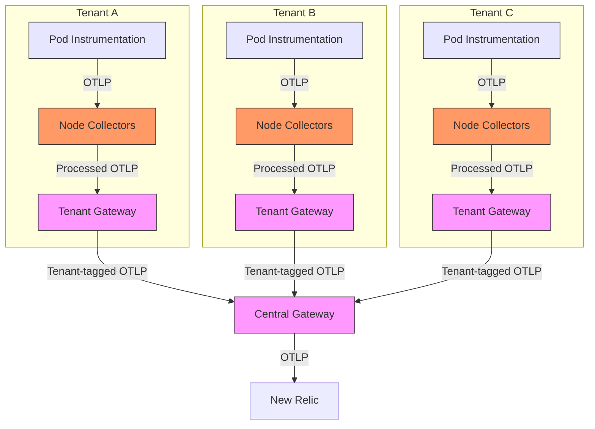
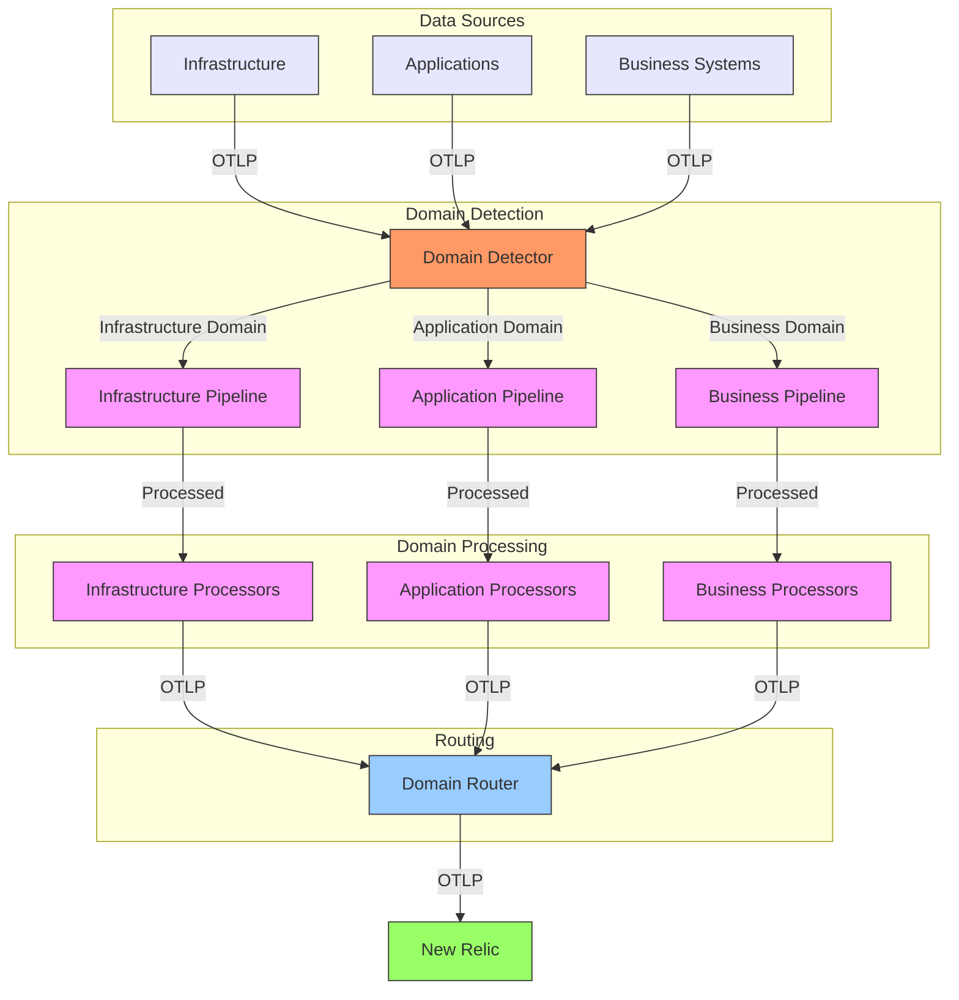
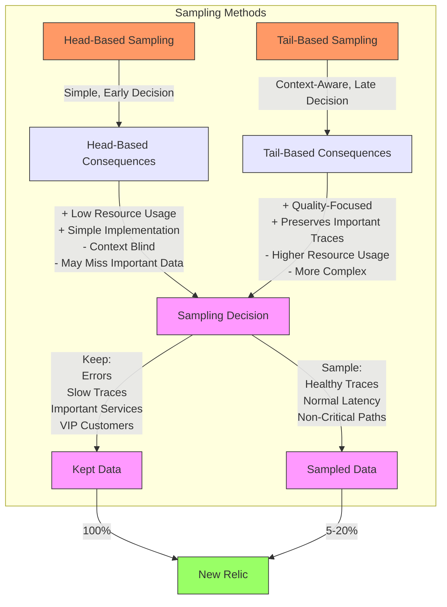
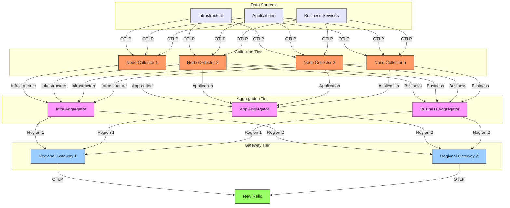

# Advanced OpenTelemetry Pipelines

## Executive Summary

OpenTelemetry collectors form the backbone of modern telemetry pipelines in the New Relic ecosystem, providing a flexible framework for ingesting, processing, and routing observability data. This chapter explores advanced pipeline configurations optimized for Kubernetes environments, with a particular focus on enterprise-scale deployments. These architectures represent production-tested approaches that balance performance, cost efficiency, and observability quality while taking full advantage of New Relic's data platform capabilities.

As Kubernetes deployments grow in scale and complexity, telemetry pipelines must evolve to handle increased data volumes, mitigate cardinality explosion, and deliver domain-specific views of system behavior. The configurations presented here leverage the full power of the OpenTelemetry Collector Contrib distribution, with specialized processors that enhance New Relic integration. Each pattern is designed to address specific Kubernetes observability challenges while conforming to cloud-native monitoring best practices.

## Pipeline Architectural Patterns

Several architectural patterns have emerged as best practices for OpenTelemetry deployments with New Relic. Each addresses different requirements for scale, resilience, and operational complexity.

```mermaid
flowchart TD
    subgraph "Pattern 1: Direct-to-New Relic"
        App1[Applications] -->|OTLP| NR1[New Relic Endpoint]
    end
    
    subgraph "Pattern 2: Centralized Collector"
        App2[Applications] -->|OTLP| CentralCollector[Centralized Collector]
        CentralCollector -->|OTLP| NR2[New Relic Endpoint]
    end
    
    subgraph "Pattern 3: Agent-per-Node"
        App3[Applications] -->|OTLP| NodeCollectors[Node Collectors]
        NodeCollectors -->|OTLP| Gateway[Gateway Collector]
        Gateway -->|OTLP| NR3[New Relic Endpoint]
    end
    
    subgraph "Pattern 4: Multi-Tenant"
        MTApps[Tenant Applications] -->|OTLP| TenantCollectors[Tenant Collectors]
        TenantCollectors -->|OTLP| MTGateway[Multi-Tenant Gateway]
        MTGateway -->|OTLP| NR4[New Relic Endpoint]
    end
    
    subgraph "Pattern 5: Domain-Oriented"
        DomainApps[Applications] -->|OTLP| DomainCollectors[Domain Collectors]
        DomainCollectors -->|OTLP| DomainGateway[Domain Router]
        DomainGateway -->|OTLP| NR5[New Relic Endpoint]
    end
    
    classDef apps fill:#e6e6ff,stroke:#333,stroke-width:1px
    classDef collectors fill:#f96,stroke:#333,stroke-width:2px
    classDef nr fill:#9f6,stroke:#333,stroke-width:1px
    
    class App1,App2,App3,MTApps,DomainApps apps
    class CentralCollector,NodeCollectors,Gateway,TenantCollectors,MTGateway,DomainCollectors,DomainGateway collectors
    class NR1,NR2,NR3,NR4,NR5 nr
```



### Pattern Comparison

| Pattern | Advantages | Disadvantages | Best For |
|---------|------------|---------------|----------|
| **Direct-to-New Relic** | Simplest setup<br>No infrastructure to manage<br>Lowest operational overhead | No local processing<br>No buffering during outages<br>Higher data volumes to New Relic | Development environments<br>Simple applications<br>Initial adoption |
| **Centralized Collector** | Single configuration point<br>Centralized processing<br>Simple management | Single point of failure<br>Limited scalability<br>Network congestion | Small-to-medium clusters<br>Homogeneous workloads<br>Initial production deployments |
| **Agent-per-Node** | Local data preprocessing<br>Resilient to cluster issues<br>Efficient network usage | More complex deployment<br>Resource overhead per node<br>Configuration management | Large clusters<br>High-volume telemetry<br>Production environments |
| **Multi-Tenant** | Tenant isolation<br>Cost attribution<br>Custom retention policies | Complex routing logic<br>Multiple configurations<br>Authorization complexity | Multi-team platforms<br>SaaS applications<br>Managed service providers |
| **Domain-Oriented** | Specialized processing<br>Domain-specific optimizations<br>Targeted data routing | Most complex architecture<br>Higher maintenance<br>Discovery challenges | Enterprise environments<br>Complex applications<br>Domain-specific teams |

## Multi-Tenant Pipeline Architecture

In multi-tenant Kubernetes environments, telemetry isolation between tenants is critical for security, cost allocation, and performance. This architecture implements a hierarchy of collectors that provides tenant-level isolation while maintaining central visibility.



### Implementation Considerations

1. **Tenant Identification**: Each tenant's telemetry is tagged with unique identifiers that follow through the entire pipeline
2. **Resource Isolation**: Tenant-specific collectors ensure noisy neighbors don't impact other tenants
3. **Cost Attribution**: Tenant tagging enables accurate cost allocation in New Relic billing
4. **Data Segregation**: Tenant-specific collectors can apply different retention and sampling policies
5. **Configuration Management**: Tenant-specific configurations managed through GitOps workflows

### Tenant Collector Configuration

```yaml
# tenant-collector.yaml (Per-Tenant Node Collector)
receivers:
  otlp:
    protocols:
      grpc:
        endpoint: 0.0.0.0:4317
      http:
        endpoint: 0.0.0.0:4318
  
  # Node-level metrics specific to this tenant's workloads
  kubeletstats:
    collection_interval: 30s
    auth_type: serviceAccount
    endpoint: "${env:K8S_NODE_NAME}:10250"
    metric_groups: ["pod", "container"]
    extra_metadata_labels:
      - container.id
      - k8s.pod.name
      - k8s.namespace.name
    pod_association:
      - sources:
          - from: connection
            name: kubernetes.pod.uid

processors:
  batch:
    send_batch_size: 8192
    timeout: 10s

  # Apply tenant tag to all telemetry
  resource:
    attributes:
      - action: insert
        key: tenant.id
        value: "${env:TENANT_ID}"
      - action: insert
        key: tenant.name
        value: "${env:TENANT_NAME}"
  
  # Add Kubernetes metadata
  k8sattributes:
    auth_type: serviceAccount
    passthrough: false
    extract:
      metadata:
        - k8s.pod.name
        - k8s.pod.uid
        - k8s.deployment.name
        - k8s.namespace.name
        - k8s.container.name
      annotations:
        - key: opentelem/component
          from: pod
        - key: opentelem/service
          from: pod
    filter:
      node_from_env_var: K8S_NODE_NAME
      namespace_regex: ^${env:TENANT_NAMESPACE}$
  
  # Drop tenant-specific metrics not needed
  filter:
    metrics:
      exclude:
        match_type: regexp
        metric_names:
          - ^go\..*
          - ^process\..*
          # Add tenant-specific exclusions

  # Memory limiter for stability
  memory_limiter:
    check_interval: 1s
    limit_mib: 900
    spike_limit_mib: 200

exporters:
  otlp:
    endpoint: "${env:TENANT_GATEWAY_SERVICE}:4317"
    tls:
      insecure: true   # Use TLS in production!

service:
  pipelines:
    metrics:
      receivers: [otlp, kubeletstats]
      processors: [k8sattributes, resource, filter, batch, memory_limiter]
      exporters: [otlp]
    traces:
      receivers: [otlp]
      processors: [k8sattributes, resource, batch, memory_limiter]
      exporters: [otlp]
    logs:
      receivers: [otlp]
      processors: [k8sattributes, resource, batch, memory_limiter]
      exporters: [otlp]
```

### Central Gateway Configuration

```yaml
# central-gateway.yaml
receivers:
  otlp:
    protocols:
      grpc:
        endpoint: 0.0.0.0:4317
      http:
        endpoint: 0.0.0.0:4318

processors:
  batch:
    send_batch_size: 16384
    timeout: 10s
  
  # Resource detection for cloud metadata
  resourcedetection:
    detectors: [env, system, gcp, aws, azure]
    timeout: 2s
    override: false
  
  # Add global metadata
  resource:
    attributes:
      - action: insert
        key: deployment.environment
        value: "${env:ENVIRONMENT}"
      - action: insert
        key: service.namespace
        value: "multi-tenant-platform"
  
  # Enforce global attribute naming standards
  attributes:
    actions:
      # Standardize different tenant label formats
      - key: tenant.id
        action: update
        new_key: nr.tenant.id
      - key: tenant_id
        action: update
        new_key: nr.tenant.id
      - key: tenant
        action: update
        new_key: nr.tenant.id
      
      # Convert legacy K8s attributes to OTel format
      - key: pod_name
        action: update
        new_key: k8s.pod.name
      - key: namespace
        action: update
        new_key: k8s.namespace.name
  
  # Advanced memory management
  memory_limiter:
    check_interval: 1s
    limit_mib: 3800
    spike_limit_mib: 800
    
  # Tenant-aware retention routing
  routing:
    attribute_source: resource
    from_attribute: nr.tenant.id
    table:
      # High-retention tenant
      premium: {exporters: ["newrelic/premium"]}
      # Standard-retention tenants
      standard-*: {exporters: ["newrelic/standard"]}
      # Default route
      "*": {exporters: ["newrelic/standard"]}

exporters:
  newrelic/premium:
    endpoint: "https://otlp.nr-data.net:4317"
    headers:
      api-key: "${env:PREMIUM_LICENSE_KEY}"
    timeout: 20s
    retry_on_failure:
      enabled: true
      initial_interval: 5s
      max_interval: 30s
      max_elapsed_time: 300s
    sending_queue:
      enabled: true
      num_consumers: 10
      queue_size: 5000
      
  newrelic/standard:
    endpoint: "https://otlp.nr-data.net:4317"
    headers:
      api-key: "${env:STANDARD_LICENSE_KEY}"
    timeout: 20s
    retry_on_failure:
      enabled: true
      initial_interval: 5s
      max_interval: 30s
      max_elapsed_time: 300s

service:
  pipelines:
    metrics:
      receivers: [otlp]
      processors: [resourcedetection, resource, attributes, routing, batch, memory_limiter]
      exporters: [newrelic/premium, newrelic/standard]
    traces:
      receivers: [otlp]
      processors: [resourcedetection, resource, attributes, routing, batch, memory_limiter]
      exporters: [newrelic/premium, newrelic/standard]
    logs:
      receivers: [otlp]
      processors: [resourcedetection, resource, attributes, routing, batch, memory_limiter]
      exporters: [newrelic/premium, newrelic/standard]
```

## Domain-Specific Processing Pipeline

Different observability domains often require specialized processing. This architecture provides a domain-oriented pipeline configuration that handles infrastructure, application, and business metrics differently to optimize both collection and visualization in New Relic.

### Domain Pipeline Architecture



### Domain-Specific Pipeline Configuration

```yaml
# domain-pipeline.yaml
receivers:
  otlp:
    protocols:
      grpc:
        endpoint: 0.0.0.0:4317
      http:
        endpoint: 0.0.0.0:4318

processors:
  batch:
    send_batch_size: 8192
    timeout: 10s
  
  # Domain detection processor using OTTL
  transform/domain:
    metric_statements:
      - context: metric
        statements:
          # Infrastructure domain
          - set(resource.attributes["telemetry.domain"], "infrastructure") where name matches "^(system|cpu|memory|disk|network|kubernetes|container|host|node).*"
          # Application domain
          - set(resource.attributes["telemetry.domain"], "application") where name matches "^(http|db|app|service|rpc|jvm|dotnet|python|nodejs|runtime).*"
          # Business domain
          - set(resource.attributes["telemetry.domain"], "business") where name matches "^(business|transaction|order|payment|user|session|cart|checkout).*"
          # Default domain
          - set(resource.attributes["telemetry.domain"], "other") where resource.attributes["telemetry.domain"] == nil
  
  # Infrastructure domain processing
  transform/infrastructure:
    metric_statements:
      - context: metric
        statements:
          # Standardize common units
          - set(unit, "percent") where name matches ".*utilization.*|.*percent.*"
          - set(unit, "bytes") where name matches ".*bytes.*|.*memory.*|.*size.*"
          - set(unit, "count") where unit == "" and name matches ".*count.*"
          
          # Enrich with metadata
          - set(resource.attributes["infrastructure.type"], "kubernetes") where name matches "^kubernetes.*"
          - set(resource.attributes["infrastructure.type"], "host") where name matches "^(system|cpu|memory|disk|network).*"
  
  # Application domain processing
  transform/application:
    metric_statements:
      - context: metric
        statements:
          # Derive service names from metric names when missing
          - set(resource.attributes["service.name"], SpanFromString(name, ".", 0)) where resource.attributes["service.name"] == nil and name matches "^[a-zA-Z0-9]+\\..*"
          
          # Map to standard OTel semantic conventions 
          - set(name, "http.server.request.duration") where name == "http.request.duration"
          - set(name, "http.server.request.count") where name == "http.request.count"
  
  # Business domain processing
  transform/business:
    metric_statements:
      - context: metric
        statements:
          # Add business unit attribution
          - set(resource.attributes["business.unit"], "retail") where name matches "^(order|cart|checkout).*"
          - set(resource.attributes["business.unit"], "accounts") where name matches "^(user|account|session).*"
          - set(resource.attributes["business.unit"], "payments") where name matches "^(payment|transaction).*"
          
          # Add KPI flag for important business metrics
          - set(resource.attributes["business.kpi"], true) where name matches ".*(revenue|conversion|retention).*"
  
  # Domain-specific routing
  routing:
    attribute_source: resource
    from_attribute: telemetry.domain
    table:
      infrastructure: {exporters: ["newrelic/infrastructure"]}
      application: {exporters: ["newrelic/application"]}
      business: {exporters: ["newrelic/business"]}
      "*": {exporters: ["newrelic/default"]}

exporters:
  # Different API keys for different domains
  newrelic/infrastructure:
    endpoint: "https://otlp.nr-data.net:4317"
    headers:
      api-key: "${env:INFRA_LICENSE_KEY}"
    timeout: 20s
  
  newrelic/application:
    endpoint: "https://otlp.nr-data.net:4317"
    headers:
      api-key: "${env:APM_LICENSE_KEY}"
    timeout: 20s
  
  newrelic/business:
    endpoint: "https://otlp.nr-data.net:4317"
    headers:
      api-key: "${env:BUSINESS_LICENSE_KEY}"
    timeout: 20s
  
  newrelic/default:
    endpoint: "https://otlp.nr-data.net:4317"
    headers:
      api-key: "${env:DEFAULT_LICENSE_KEY}"
    timeout: 20s

service:
  # Domain-specific processing pipeline
  pipelines:
    metrics:
      receivers: [otlp]
      processors: [transform/domain, routing, batch]
      exporters: [newrelic/infrastructure, newrelic/application, newrelic/business, newrelic/default]
    
    metrics/infrastructure:
      receivers: [otlp]
      processors: [transform/domain, transform/infrastructure, batch]
      exporters: [newrelic/infrastructure]
    
    metrics/application:
      receivers: [otlp]
      processors: [transform/domain, transform/application, batch]
      exporters: [newrelic/application]
    
    metrics/business:
      receivers: [otlp]
      processors: [transform/domain, transform/business, batch]
      exporters: [newrelic/business]
```

## Advanced Sampling Strategies

As telemetry volume increases, strategic sampling becomes critical for cost control while maintaining visibility. Modern sampling approaches focus on preserving important signals while reducing overall volume.



### Advanced Tail Sampling Configuration

```yaml
# tail-sampling.yaml
receivers:
  otlp:
    protocols:
      grpc:
        endpoint: 0.0.0.0:4317
      http:
        endpoint: 0.0.0.0:4318

processors:
  batch:
    send_batch_size: 8192
    timeout: 10s
  
  # Tail-based sampling for traces
  tail_sampling:
    decision_wait: 10s
    num_traces: 100000
    expected_new_traces_per_sec: 1000
    
    policies:
      # Keep all errors
      - name: error-policy
        type: status_code
        status_code:
          status_codes: [ERROR]
      
      # Keep slow transactions
      - name: latency-policy
        type: latency
        latency:
          threshold_ms: 500
      
      # Keep all transactions from critical services
      - name: critical-services
        type: string_attribute
        string_attribute:
          key: service.name
          values: [payment-service, authentication-service, checkout-service]
      
      # Keep all transactions for high-value customers
      - name: vip-customers
        type: string_attribute
        string_attribute:
          key: customer.tier
          values: [platinum, gold]
      
      # Sample remaining HTTP transactions at 10%
      - name: http-sampling
        type: and
        and:
          - name: http-filter
            type: string_attribute
            string_attribute:
              key: http.url
              values: ["http*"]
              enabled_regex: true
          - name: probabilistic-filter
            type: probabilistic
            probabilistic:
              sampling_percentage: 10
      
      # Sample everything else at 5%
      - name: default-policy
        type: probabilistic
        probabilistic:
          sampling_percentage: 5
  
  # Metrics aggregation and sampling
  aggregate:
    metrics:
      # Pre-aggregate high-volume metrics
      - name: http.*.request.duration
        aggregation: histogram
        temporality: delta
        keys:
          - service.name
          - http.route
        max_observations: 10000
      
      - name: system.cpu.utilization
        aggregation: average
        temporality: delta
        keys:
          - host.name
          - cpu.state
          - cpu.num
      
      - name: kubernetes.pod.memory.usage
        aggregation: sum
        temporality: delta
        keys:
          - k8s.pod.name
          - k8s.namespace.name
  
  # Probabilistic metrics sampling
  probabilistic_sampler:
    hash_seed: 42
    sampling_percentage: 100 # Default 100%
    sampling_table:
      # High-value metrics kept at 100%
      "cpu.utilization": 100
      "memory.utilization": 100
      "disk.utilization": 100
      "*.error.*": 100
      
      # Medium-value metrics sampled at 50%
      "http.server.*": 50
      "db.*": 50
      
      # Low-value metrics aggressively sampled
      "go.*": 10
      "process.*": 10
      "runtime.*": 10

exporters:
  newrelic:
    endpoint: "https://otlp.nr-data.net:4317"
    headers:
      api-key: "${env:NEW_RELIC_LICENSE_KEY}"
    timeout: 20s

service:
  pipelines:
    traces:
      receivers: [otlp]
      processors: [tail_sampling, batch]
      exporters: [newrelic]
    metrics:
      receivers: [otlp]
      processors: [aggregate, probabilistic_sampler, batch]
      exporters: [newrelic]
```

### Sampling Rate Optimization

Optimal sampling rates can be calculated based on different criteria:

| Criteria | Formula | Example |
|----------|---------|---------|
| **Cost-Based** | `Sampling Rate = Target Data Points / Estimated Total Data Points` | For 100M data points with 50M target limit:<br>Rate = 50,000,000 / 100,000,000 = 50% |
| **Value-Based** | `Different rates per priority tier` | Critical: 100%<br>Important: 50%<br>Standard: 10%<br>Debug: 1% |
| **Volume-Based** | `Sampling Rate = Base Rate × (Baseline Volume / Current Volume)` | For 20% base rate with 10x volume increase:<br>Rate = 20% × (1 / 10) = 2% |
| **Adaptive** | `Sampling Rate = Base Rate × (SLA Headroom / Standard Headroom)` | For 50% base rate with 2x headroom:<br>Rate = 50% × (2 / 1) = 100% (keep all) |

## Real-Time Analytics Pipeline

For operational dashboards and alerting, minimizing latency is critical. This configuration defines a low-latency pipeline optimized for New Relic's real-time visualization capabilities.

### Latency Optimization Principles

1. **Minimal Processing**: Only essential processors in the pipeline
2. **Small Batch Sizes**: Frequent transmission of smaller batches
3. **Parallel Processing**: Multiple exporters working simultaneously
4. **Efficient Retry**: Quick initial retries, limited exponential backoff
5. **Memory Management**: Aggressive limits to prevent OOM conditions

### Low-Latency Pipeline Configuration

```yaml
# low-latency-pipeline.yaml
receivers:
  otlp:
    protocols:
      grpc:
        endpoint: 0.0.0.0:4317
        keepalive:
          server_parameters:
            time: 30s
            timeout: 5s
            enforcement_policy:
              min_time: 10s
              permit_without_stream: true
      http:
        endpoint: 0.0.0.0:4318
        cors:
          allowed_origins: ["*"]
          allowed_headers: ["*"]

processors:
  batch:
    # Smaller batches for lower latency
    send_batch_size: 1024
    timeout: 1s  # Short timeout for frequent sends
  
  # Memory limiter configured for stability
  memory_limiter:
    check_interval: 0.5s
    limit_mib: 900
    spike_limit_mib: 100
    
  # Resource detection for cloud metadata
  resourcedetection:
    # Short timeout to avoid blocking
    timeout: 1s
    detectors: [env, system]
    override: false
  
  # Fast attribute processor with minimal operations
  attributes:
    actions:
      # Just essential transformations
      - key: host.name
        action: insert
        value: "${env:HOSTNAME}"
      - key: deployment.environment
        action: insert
        value: "${env:ENVIRONMENT}"

exporters:
  newrelic:
    endpoint: "https://otlp.nr-data.net:4317"
    headers:
      api-key: "${env:NEW_RELIC_LICENSE_KEY}"
    timeout: 5s  # Short timeout
    retry_on_failure:
      enabled: true
      initial_interval: 1s  # Start retrying quickly
      max_interval: 5s      # Cap retry interval
      max_elapsed_time: 30s # Don't retry forever
    sending_queue:
      enabled: true
      num_consumers: 8  # More consumers for parallelism
      queue_size: 1000  # Reasonable queue size
  
  # Debug logging for troubleshooting
  logging:
    verbosity: basic
    sampling_initial: 5
    sampling_thereafter: 200

service:
  # Telemetry for self-monitoring
  telemetry:
    logs:
      level: info
    metrics:
      address: localhost:8888
    
  extensions: []
  pipelines:
    # Critical metrics pipeline with minimal processing
    metrics/critical:
      receivers: [otlp]
      processors: [memory_limiter, batch]
      exporters: [newrelic]
    
    # Traces with slightly more processing
    traces:
      receivers: [otlp]
      processors: [memory_limiter, resourcedetection, attributes, batch]
      exporters: [newrelic, logging]
```

### Pipeline Latency Analysis

The total latency of a telemetry pipeline can be calculated using the following formula:

```
Pipeline Latency = Collection Interval + 
                   Processing Time + 
                   (Batching Delay / 2) + 
                   Network Latency +
                   Ingest Processing Time
```

For the low-latency pipeline:

| Component | Typical Value | Optimization |
|-----------|---------------|--------------|
| Collection Interval | 10s | Reduce to 5s for critical metrics |
| Processing Time | 50-100ms | Minimize processors, efficient transforms |
| Batching Delay | 1000ms | Reduce timeout to 500ms for critical paths |
| Network Latency | 50-200ms | Use regions closest to deployment |
| Ingest Processing Time | 200-500ms | Use optimized exporters |

Resulting in an average end-to-end latency of approximately 10.9 seconds for standard telemetry, and as low as 5.6 seconds for critical metrics with optimized collection intervals.

## Pipeline Performance Tuning

Optimizing OTel Collector performance is essential for reliable operation at scale. The following table provides guidelines for different scale scenarios:

| Scale | CPU Request | CPU Limit | Memory Request | Memory Limit | Batch Size | Queue Size | Workers |
|-------|-------------|-----------|----------------|--------------|------------|------------|---------|
| Small (<10K metrics/s) | 0.5 | 1.0 | 512Mi | 1Gi | 1000 | 1000 | 4 |
| Medium (10-50K metrics/s) | 1.0 | 2.0 | 1Gi | 2Gi | 5000 | 5000 | 8 |
| Large (50-200K metrics/s) | 2.0 | 4.0 | 2Gi | 4Gi | 10000 | 10000 | 16 |
| X-Large (>200K metrics/s) | 4.0+ | 8.0+ | 4Gi+ | 8Gi+ | 20000 | 20000 | 32 |

### Performance Impact of Processors

Different processors have varying performance impacts, which should be considered when building pipelines:

| Processor | CPU Impact | Memory Impact | Latency Impact | Usage Recommendation |
|-----------|------------|--------------|----------------|----------------------|
| Batch | Low | Medium | High | Always use, optimize timeout |
| Memory Limiter | Low | N/A | Low | Always use for stability |
| Resource Detection | Medium | Low | Medium | Use selectively, limit detectors |
| K8s Attributes | Medium | Medium | Medium | Limit attributes extracted |
| Filter | Low | Low | Low | Use early in pipeline |
| Transform (OTTL) | Medium-High | Medium | Medium | Minimize complex statements |
| Tail Sampling | High | High | Very High | Use for traces only when needed |
| Routing | Low | Low | Low | Efficient for multi-destination |
| Aggregate | Medium | High | Medium | Use for high-cardinality metrics |
| Load Balancing | Low | Low | Low | Use for horizontal scaling |

## Advanced Deployment Model

For enterprise environments, a comprehensive deployment model combines multiple architectural patterns to achieve resilience, scalability, and flexibility:



## Performance Tuning Best Practices

When optimizing OpenTelemetry pipelines for New Relic:

1. **Measure Before Optimizing**
   - Use OTel collector metrics to identify bottlenecks
   - Monitor memory usage, CPU utilization, queue depths, and dropped data
   - Analyze pipeline component latency contributions

2. **Batch Size Optimization**
   - For low latency: smaller batches (500-1000) with shorter timeouts (1-3s)
   - For throughput: larger batches (5000-20000) with longer timeouts (5-10s)
   - Balance between network efficiency and data freshness

3. **Resource Allocation**
   - Memory: Allocate 2-3x the expected working set size
   - CPU: Provision based on processing complexity and data volume
   - Allow for traffic spikes with appropriate resource limits

4. **Processor Ordering**
   - Place filters and data reduction processors early in the pipeline
   - Order processors by increasing complexity
   - Batch processor should be last before exporters

5. **Failure Handling**
   - Configure appropriate retry mechanisms
   - Implement persistent queuing for critical data
   - Consider circuit breaking for downstream failures

## Conclusion

Advanced OpenTelemetry pipelines provide a powerful foundation for enterprise observability with New Relic. By implementing the architectural patterns and configurations presented in this chapter, organizations can build scalable, efficient, and reliable telemetry pipelines that balance data quality with operational costs.

Key takeaways include:

1. Choose architectural patterns based on scale, organizational structure, and operational requirements
2. Implement multi-tenant or domain-specific pipelines for complex environments
3. Apply strategic sampling to control costs while preserving critical data
4. Optimize for latency in operational contexts where real-time insight is essential
5. Follow performance tuning best practices to ensure reliability at scale

As Kubernetes environments continue to grow in complexity, these advanced pipeline patterns will evolve to address new challenges in observability. The flexible nature of OpenTelemetry, combined with New Relic's powerful backend, provides a foundation that can adapt to changing requirements while delivering consistent value.

---

**Next Chapter**: [Low Data Cardinality](./02_Low_Data_Cardinality.md)