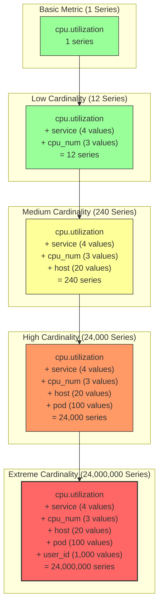
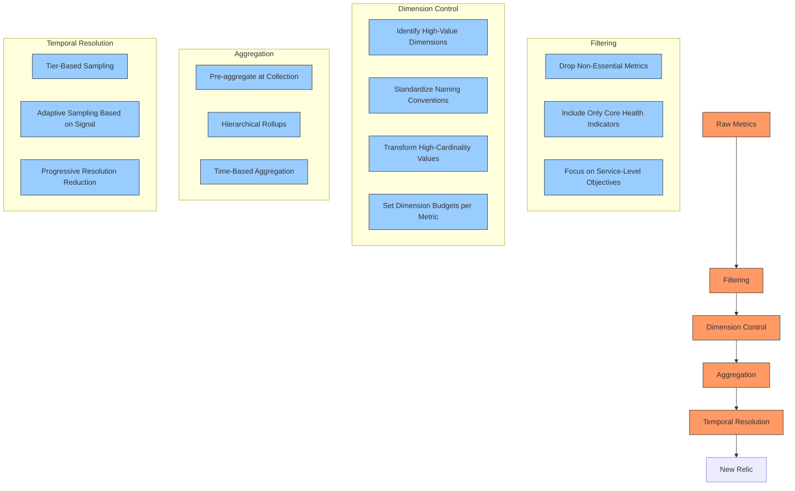

# Low Data Mode & Cardinality Management

## Executive Summary

In cloud-native environments, particularly Kubernetes deployments, the volume and complexity of telemetry data can quickly become overwhelming. This chapter examines strategies for implementing "Low-Data Mode" in New Relic deployments, focusing on cardinality management and intelligent data reduction techniques. By thoughtfully selecting which data to collect and how to structure it, organizations can dramatically reduce their telemetry footprint while maintaining comprehensive observability.

Cardinality management is particularly critical in Kubernetes environments, where ephemeral workloads and dynamic infrastructure can generate an explosion of unique time series. With dimensional metrics, each unique combination of metric name and attribute values creates a separate time series that must be stored, indexed, and queried—potentially leading to exponential growth in data volume and costs. This chapter provides concrete configurations, best practices, and implementation patterns to help teams optimize their New Relic observability deployments without sacrificing visibility into critical system behaviors.

## Understanding Cardinality and Its Impact

Cardinality in metrics refers to the number of unique time series generated by a given metric. While dimensions provide crucial context, they can lead to exponential growth in cardinality, resulting in significant performance and cost challenges.



### Common High-Cardinality Dimensions

Not all dimensions are equal when it comes to cardinality risk. The following table highlights dimensions that frequently cause cardinality issues in Kubernetes environments:

| Dimension | Cardinality Risk | Impact | Recommendation |
|-----------|------------------|--------|----------------|
| `user_id`, `customer_id` | Extreme | Millions of series | Avoid as a metric dimension; use for logs/traces |
| `pod_name` | High | Thousands of series | Use `deployment_name` for aggregation |
| `container_id` | High | Thousands of series | Use `container_name` instead |
| `ip_address` | High | Thousands of series | Group by subnet or use sparingly |
| `request_id`, `trace_id` | Extreme | Millions of series | Keep in traces, not metrics |
| `url`, `path` | High | Thousands of series | Use path templates or route names |
| `session_id` | Extreme | Millions of series | Aggregate by user type or tenant |
| `host_name` (ephemeral) | Medium | Hundreds of series | Use clusters or static metadata |
| `build_id`, `version` | Medium | Hundreds of series | Group minor versions if possible |
| Timestamp components | High | Thousands of series | Use bucketing or time windows |

### Cardinality Impact on Performance and Cost

The effects of high cardinality extend beyond simple storage costs, affecting multiple aspects of observability:

| Cardinality Level | Series Count | Storage Impact | Query Impact | Cost Impact | NRDB Implications |
|-------------------|--------------|----------------|--------------|-------------|-------------------|
| Low | <1,000 | Minimal | Fast queries | Low cost | Excellent performance |
| Medium | 1,000-10,000 | Moderate storage | Good performance | Moderate cost | Good performance |
| High | 10,000-100,000 | Significant storage | Degraded performance | High cost | Indexing pressure |
| Extreme | >100,000 | Severe storage demands | Very slow queries | Very high cost | May hit limits or failures |
| Explosion | >1,000,000 | Unsustainable | Timeout risk | Prohibitive cost | Service disruption risk |

## New Relic's Built-in Low-Data Mode

New Relic's Kubernetes integration offers a built-in Low-Data Mode that significantly reduces the volume of telemetry data while maintaining essential visibility. This feature provides an excellent starting point for organizations looking to control their observability costs.

### Enabling Low-Data Mode

Low-Data Mode can be enabled through the Helm chart configuration for New Relic's Kubernetes integration:

```yaml
# values.yaml for Helm chart
global:
  lowDataMode: true  # Enable Low-Data Mode

newrelic-infrastructure:
  lowDataMode: true
  
  config:
    # Additional Low-Data Mode tuning
    kubernetes_metadata_include_namespaces: "default,kube-system,monitoring"
    kubernetes_metadata_exclude_namespaces: ""
    kubernetes_metadata_include_labels: "app,deployment,service"
    kubernetes_metadata_exclude_labels: "hash,pod-template-hash"
    
    # Integration configuration
    integrations_config:
      # Drop specific metrics
      metric_api_drop_metrics: "go_*,jvm_*"
      # Drop specific attributes
      metric_api_drop_dimensions: "container_id,pod_uid"
```

### Data Reduction Techniques

The built-in Low-Data Mode employs multiple strategies to reduce data volume:

| Technique | Standard Mode | Low-Data Mode | Data Reduction |
|-----------|---------------|---------------|----------------|
| Sample rate | 15 seconds | 30 seconds | ~50% |
| Metric filtering | ~500 metrics | ~120 core metrics | ~75% |
| Dimension pruning | ~40 dimensions | ~15 essential dimensions | ~60% |
| Pod filtering | All pods | User configurable | 0-90% |
| Container metrics | All containers | User configurable | 0-80% |
| Control plane | Full metrics | Essential only | ~70% |
| Integration metrics | All enabled | Critical only | ~80% |
| Metadata | All metadata | Essential metadata | ~50% |
| **Overall reduction** | **100%** | **10-25%** | **75-90%** |

### Core Metrics Preserved

Even with Low-Data Mode enabled, critical metrics are still collected to ensure comprehensive monitoring:

| Category | Preserved Metrics | Purpose |
|----------|-------------------|---------|
| Cluster Health | `k8s.cluster.pod.phase`, `k8s.node.condition` | Overall cluster health |
| Node Resources | `k8s.node.cpu.utilization`, `k8s.node.memory.utilization`, `k8s.node.filesystem.usage` | Node resource usage |
| Pod Resources | `k8s.pod.cpu.utilization`, `k8s.pod.memory.usage`, `k8s.pod.restarts` | Pod resource consumption |
| Container Health | `k8s.container.cpu.utilization`, `k8s.container.memory.usage`, `k8s.container.status` | Container resource usage |
| Workload Status | `k8s.deployment.available`, `k8s.statefulset.ready` | Deployment health |
| Networking | `k8s.pod.network.receive_bytes`, `k8s.pod.network.transmit_bytes` | Network throughput |
| Storage | `k8s.persistentvolume.status`, `k8s.persistentvolumeclaim.status` | Storage health |
| API Server | `k8s.apiserver.request.duration`, `k8s.apiserver.request.count` | API server performance |
| Resource Quotas | `k8s.resourcequota.used`, `k8s.resourcequota.hard` | Quota consumption |

## Advanced Cardinality Management with OpenTelemetry

Beyond New Relic's built-in capabilities, OpenTelemetry provides powerful tools for implementing custom cardinality management strategies. These techniques can be applied to further optimize data volume while preserving critical insights.

### 1. Label Filtering and Transformation

Kubernetes labels and annotations often contain high-cardinality values that should be filtered or transformed before being used as dimensions.

```yaml
# otel-collector-config.yaml
processors:
  k8sattributes:
    auth_type: "serviceAccount"
    passthrough: false
    extract:
      metadata:
        # Include only these k8s metadata attributes
        - k8s.namespace.name
        - k8s.deployment.name
        - k8s.statefulset.name
        - k8s.daemonset.name
        - k8s.cronjob.name
        - k8s.node.name
      # Include only specific labels as dimensions
      labels:
        - key: app
          from: pod
        - key: component
          from: pod
        - key: tier
          from: pod
        - key: version
          from: pod
          regex: '(\d+\.\d+).*'
          regex_group_idx: 1  # Extract just major.minor version
      # Exclude high-cardinality labels
      exclude:
        labels:
          - pod-template-hash
          - controller-revision-hash
          - deployment.kubernetes.io/revision
```

### 2. Attribute Processor for Dimension Control

The attributes processor can enforce organization-wide naming conventions and limit dimensionality.

```yaml
# dimension-control.yaml
processors:
  attributes:
    actions:
      # Convert attributes to standard naming convention
      - key: label.app
        action: update
        new_key: service.name
      
      # Hash high-cardinality values
      - key: http.url
        action: update
        new_key: http.route_hash
        value: {{ if and (IsString .value) (MatchesRegexp `^/api/users/\d+/.*$` .value) }} "/api/users/{id}/{{index (Split .value "/") 4}}" {{ else }} {{.value}} {{ end }}
      
      # Drop unnecessary dimensions
      - key: k8s.pod.uid
        action: delete
      - key: container.id
        action: delete
      - key: process.pid
        action: delete
      
      # Keep only major.minor for version
      - key: service.version
        action: update
        value: {{ if and (IsString .value) (MatchesRegexp `^(\d+\.\d+).*$` .value) }} {{index (RegexpReplace `^(\d+\.\d+).*$` "${1}" .value) 0}} {{ else }} {{.value}} {{ end }}
      
      # Add environment grouping
      - key: deployment.environment
        action: insert
        value: "production"
```

### 3. Metric Aggregation

Pre-aggregating high-frequency metrics reduces cardinality while preserving the most valuable insights.

```yaml
# metric-aggregation.yaml
processors:
  aggregate:
    # Pre-aggregate high-volume metrics by minute
    metrics:
      - name: http.server.duration
        temporality: delta
        aggregation: histogram
        dimensions:
          - service.name
          - http.route_template
          - http.status_code
        aggregation_temporality: AGGREGATION_TEMPORALITY_CUMULATIVE
        report_temporality_as_delta: true
      
      - name: system.cpu.usage
        temporality: delta
        aggregation: sum
        dimensions:
          - host.name
          - mode
        aggregation_temporality: AGGREGATION_TEMPORALITY_CUMULATIVE
        report_temporality_as_delta: true
```

### 4. OpenTelemetry Transformation Language (OTTL)

OTTL provides powerful capabilities for complex dimension transformations:

```yaml
# transform-dimensions.yaml
processors:
  transform:
    metric_statements:
      # Hash user IDs into 100 buckets
      - context: datapoint
        statements:
          - set(attributes["user.bucket"], Hash(attributes["user.id"]) % 100) where attributes["user.id"] != nil
          - delete_key(attributes, "user.id")
      
      # Bucketize URL paths
      - context: datapoint
        statements:
          - set(attributes["http.route_template"], Substring(attributes["http.url"], 0, LastIndexOf(attributes["http.url"], "/")+1) + "{id}") where attributes["http.url"] != nil and MatchString("(/[a-zA-Z]+/[a-zA-Z]+/)[0-9]+(/.*)?", attributes["http.url"])
          - delete_key(attributes, "http.url") where attributes["http.route_template"] != nil
```

## Domain-Specific Cardinality Strategies

Different data types and use cases require tailored approaches to cardinality management. Here we examine strategies for specific observability domains.

### Metrics Cardinality Strategy



Key strategies for metrics cardinality management:

1. **Hierarchical Aggregation**
   - Aggregate metrics at multiple levels (pod → deployment → namespace)
   - Use aggregation processors to pre-summarize data

2. **Dimension Prioritization**
   - Rank dimensions by analytical value vs. cardinality risk
   - Strictly limit dimensions on high-frequency metrics
   - Be more permissive with dimensions on low-frequency metrics

3. **Temporal Resolution Management**
   - Adjust sampling frequency based on metric importance
   - Use longer intervals for baseline metrics

### Traces Cardinality Strategy

While traces don't have the same cardinality challenges as metrics, trace volume management is crucial:

1. **Intelligent Sampling**
   - Use tail-based sampling to keep important traces
   - Apply strict sampling for high-volume, low-value paths

2. **Span Filtering**
   - Drop internal spans that add minimal value
   - Focus on service boundaries and external calls

3. **Attribute Filtering**
   - Keep attributes needed for correlation and debugging
   - Limit high-cardinality attributes to critical spans only

### Logs Cardinality Strategy

Log data requires different approaches to volume management:

1. **Structured Logging**
   - Enforce consistent structured log formats
   - Limit indexable fields to essential dimensions

2. **Log Level Management**
   - Dynamic log levels based on service health
   - Increase verbosity only during incidents

3. **Pattern Recognition**
   - Convert repetitive logs into metrics
   - Use pattern extraction for similar log lines

## Handling Cardinality Spikes and Incidents

### Cardinality Surge Protection

During incidents, observability needs often increase, potentially leading to cardinality surges. The following configuration provides automatic protection against sudden cardinality explosions:

```yaml
# progressive-sampling.yaml
processors:
  # Memory-triggered dynamic sampling
  memory_limiter:
    check_interval: 1s
    limit_percentage: 80
    spike_limit_percentage: 90
  
  # Progressive sampling based on volume
  filter/progressive:
    metrics:
      # Custom filter expression
      expr: 'MetricName.StartsWith("system.") and Random() <= 
             (memory_usage > 85 ? 0.3 : 
              memory_usage > 75 ? 0.5 : 
              memory_usage > 65 ? 0.8 : 
              1.0)'
  
  # Progressive trace sampling
  probabilistic_sampler:
    sampling_percentage: ${env:SAMPLING_PERCENTAGE}
```

### Graduated Response System

A tiered approach to cardinality management provides automatic protection:

| Cardinality Level | Detection Threshold | Automated Response | Manual Response |
|-------------------|---------------------|-------------------|-----------------|
| Normal | <10K series per metric | Standard collection | Routine monitoring |
| Elevated | 10K-50K series per metric | Increase metrics interval | Review new dimensions |
| High | 50K-100K series per metric | Apply dimension filters | Investigate source |
| Critical | 100K-500K series per metric | 50% sampling, drop non-critical | Incident response |
| Emergency | >500K series per metric | 10% sampling, critical only | All-hands response |

### Incident Response Runbook

When cardinality issues are detected, a consistent response ensures quick resolution:

1. **Identify the source of cardinality explosion**
   ```sql
   SELECT count(*) FROM Metric FACET metricName LIMIT 20
   ```

2. **Analyze dimension distribution**
   ```sql
   SELECT uniqueCount(timestamp) AS numSeries, latest(timestamp) as freshness 
   FROM Metric 
   WHERE metricName = '{problematic_metric}' 
   FACET attribute1, attribute2
   LIMIT 100
   ```

3. **Apply emergency filtering**
   ```yaml
   processors:
     filter:
       metrics:
         exclude:
           match_type: strict
           metric_names:
             - "problematic.metric.name"
   ```

4. **Implement dimension filtering**
   ```yaml
   processors:
     transform:
       metric_statements:
         - context: datapoint
           statements:
             - keep_keys(attributes, ["service.name", "essential.dimension1"]) 
               where metric.name == "problematic.metric.name"
   ```

5. **Verify cardinality reduction**
   ```sql
   SELECT uniqueCount(timestamp) FROM Metric FACET metricName
   COMPARE WITH 12 HOURS AGO
   ```

## New Relic Platform-Specific Optimizations

New Relic's NRDB has specific characteristics that can be leveraged to optimize cardinality management and understand platform limits.

### New Relic Dimensional Metrics Limits

| Entity | Default Limit | Enterprise Limit | Impact of Exceeding |
|--------|---------------|------------------|---------------------|
| Dimensions per metric | 20 | 100 | Additional dimensions dropped |
| Unique time series | 20,000,000 | 50,000,000+ | Potential throttling |
| Ingest rate | Account-specific | Negotiable | Rate limiting |
| Queries per minute | 1,000 | 5,000+ | Query rejections |
| Facet cardinality | 50,000 | 100,000+ | Incomplete query results |

### Monitoring Cardinality in New Relic

The following NRQL queries help monitor and manage cardinality within your account:

1. **Monitor overall cardinality by metric name**
   ```sql
   SELECT uniqueCount(timestamp) AS numSeries, count(*) AS numSamples
   FROM Metric 
   FACET metricName 
   LIMIT 100
   ```

2. **Analyze dimension contribution to cardinality**
   ```sql
   FROM Metric SELECT uniqueCount(dimensionName) AS count
   WHERE metricName = 'high.cardinality.metric'
   FACET dimensionName
   LIMIT 50
   ```

3. **Track cardinality growth over time**
   ```sql
   SELECT uniqueCount(timestamp) AS totalSeries
   FROM Metric
   TIMESERIES 1 hour
   SINCE 7 days ago
   ```

4. **Identify newly introduced high-cardinality dimensions**
   ```sql
   SELECT uniqueCount(timestamp) AS seriesCount
   FROM Metric
   WHERE metricName = 'important.metric'
   FACET dimension1, dimension2
   LIMIT 100
   COMPARE WITH 7 DAYS AGO
   ```

## Case Study: Enterprise Kubernetes Monitoring

A global e-commerce company with 5,000+ Kubernetes nodes across multiple clusters implemented New Relic's low-data mode along with custom cardinality management. Their journey highlights the practical challenges and solutions in managing observability at scale.

### Initial Challenges

- Telemetry costs growing faster than infrastructure (~20% month-over-month)
- NRDB experiencing performance degradation from high cardinality
- 75% of data volume coming from 5% of metrics
- Alert evaluation delays during traffic spikes

### Implementation Strategy

1. **Phase 1: Assessment**
   - Measured baseline metrics (volume, cardinality, query performance)
   - Identified top cardinality contributors
   - Established cost and performance targets

2. **Phase 2: Standard Low-Data Mode**
   - Enabled New Relic's built-in low-data mode 
   - Observed 65% reduction in data volume
   - Minimal impact on operational visibility

3. **Phase 3: Custom Optimizations**
   - Implemented dimension standardization across services
   - Deployed selective high-resolution monitoring for critical services
   - Added cardinality circuit breakers

4. **Phase 4: Operational Integration**
   - Updated runbooks for cardinality management
   - Implemented cardinality budgets per team
   - Added automated reporting and alerting

### Results

- 82% reduction in overall telemetry volume
- 91% reduction in unique time series
- 68% reduction in monthly observability costs
- 47% improvement in query performance
- Zero reduction in incident detection capability
- Improved dashboard load times by 3.5x

## Measuring Low-Data Mode Effectiveness

To quantify the impact of low-data mode and cardinality management, several key metrics should be tracked before and after implementation.

| Metric | Calculation | Target Improvement | Monitoring Query |
|--------|-------------|-------------------|------------------|
| Ingestion Volume | GB/day | >50% reduction | `SELECT sum(bytesIngested)/1e9 FROM NrConsumption TIMESERIES 1 day SINCE 7 days ago` |
| Series Count | Unique time series | >70% reduction | `SELECT uniqueCount(timestamp) FROM Metric FACET metricName LIMIT 100` |
| Query Performance | p95 query time | >30% improvement | `SELECT percentile(duration, 95) FROM NrAuditEvent WHERE actionIdentifier = 'query'` |
| Cost Efficiency | $/container | >40% reduction | `SELECT sum(newRelicFeeCents)/(uniqueCount(entityId) WHERE entity.type = 'CONTAINER') FROM NrConsumption` |
| Dashboard Load | Dashboard load time | >25% improvement | `SELECT average(duration) FROM PageViewTiming WHERE pageUrl LIKE '%dashboards%'` |
| Alert Reliability | Alert evaluation delays | <10ms increase | `SELECT average(evaluationTimeMs) FROM NrAuditEvent WHERE actionIdentifier = 'alertConditionEvaluation'` |

## Conclusion

Low-data mode and cardinality management are not just cost-optimization strategies—they are essential practices for building sustainable observability at scale. By carefully selecting which data to collect, how to structure dimensions, and when to apply filtering and sampling, organizations can dramatically reduce their telemetry footprint while maintaining comprehensive visibility into their Kubernetes environments.

The techniques described in this chapter enable teams to make intentional decisions about their observability data, balancing the need for detailed insights against resource constraints. The combination of New Relic's built-in Low-Data Mode and OpenTelemetry's advanced processing capabilities creates a powerful toolkit for efficient observability that scales with your infrastructure while keeping costs predictable.

Key takeaways:

1. **Understand Cardinality**: Recognize high-cardinality dimensions and their impact on performance and cost
2. **Start with Built-in Tools**: New Relic's Low-Data Mode provides significant reductions with minimal effort
3. **Layer Custom Solutions**: Add OpenTelemetry processors for targeted cardinality management
4. **Implement Tiered Strategies**: Apply different approaches based on data type and importance
5. **Monitor and Adjust**: Continuously track effectiveness and refine your approach

By implementing these practices, teams can achieve more predictable costs, better query performance, and ultimately more effective observability—proving that sometimes less really is more.

---

**Next Chapter**: [Scalability & Tuning](./03_Scalability.md)
