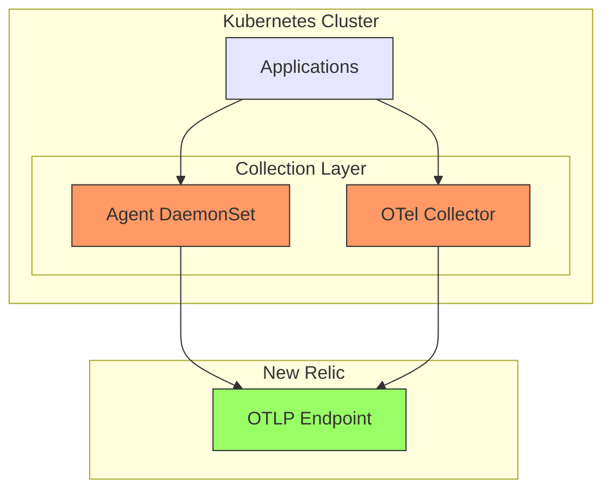
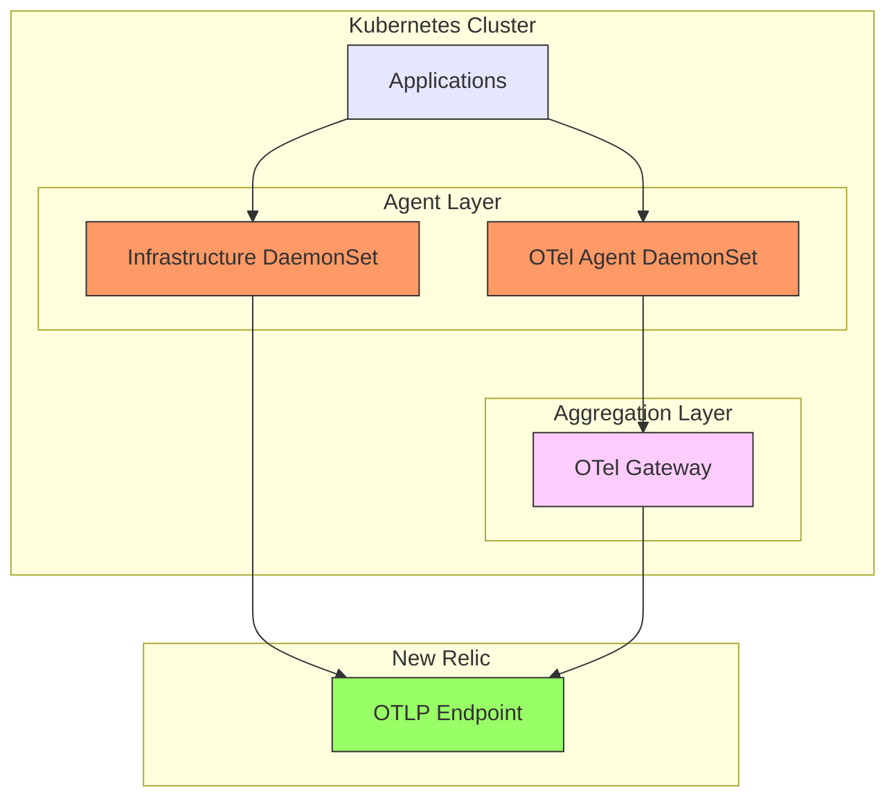
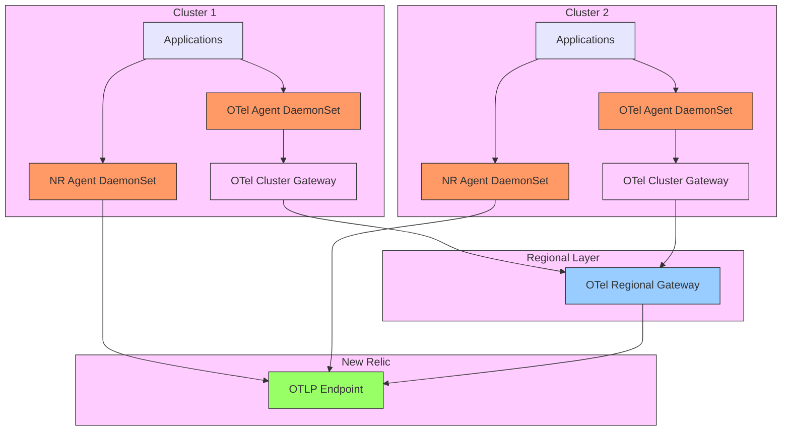

# Scalability & Performance Tuning

## Executive Summary

Scaling observability infrastructure alongside Kubernetes environments presents unique challenges that require thoughtful architecture and configuration. This chapter explores strategies for optimizing New Relic's OpenTelemetry-based observability stack to maintain performance and reliability at enterprise scale. From single-cluster deployments to global multi-cluster architectures, we examine the scalability considerations, performance bottlenecks, and optimization techniques for high-volume telemetry environments.

As Kubernetes deployments grow in size and complexity, traditional monitoring approaches often struggle with the increased telemetry volume and cardinality. The OpenTelemetry-based architecture provides powerful capabilities for addressing these challenges through hierarchical collection, intelligent data processing, and optimized data flow patterns. This chapter provides practical guidance for architecting, configuring, and maintaining high-performance observability systems that scale efficiently with your Kubernetes infrastructure.

## Scalability Dimensions

When scaling observability for Kubernetes, multiple dimensions must be considered simultaneously:

```mermaid
graph TD
    S[Scalability<br>Dimensions] --> V[Volume]
    S --> C[Cardinality]
    S --> L[Load Distribution]
    S --> F[Frequency]
    S --> R[Retention]
    
    subgraph "Volume Factors"
        V --> V1[Node Count]
        V --> V2[Pod Density]
        V --> V3[Application Count]
        V --> V4[Metric Types]
        V --> V5[Log Verbosity]
    end
    
    subgraph "Cardinality Factors"
        C --> C1[Label Count]
        C --> C2[Unique Values]
        C --> C3[Container Churn]
        C --> C4[Service Count]
        C --> C5[Dynamic Attributes]
    end
    
    subgraph "Load Distribution Factors"
        L --> L1[Workload Distribution]
        L --> L2[Geographic Spread]
        L --> L3[Network Topology]
        L --> L4[Cluster Boundaries]
        L --> L5[Multi-tenancy]
    end
    
    subgraph "Frequency Factors"
        F --> F1[Collection Interval]
        F --> F2[Scrape Concurrency]
        F --> F3[Batch Timing]
        F --> F4[Query Frequency]
        F --> F5[Alert Evaluation]
    end
    
    subgraph "Retention Factors"
        R --> R1[Storage Duration]
        R --> R2[Aggregation Policies]
        R --> R3[Downsampling]
        R --> R4[Data Lifecycle]
        R --> R5[Cost Management]
    end
    
    classDef root fill:#f96,stroke:#333,stroke-width:2px
    classDef dimension fill:#9cf,stroke:#333,stroke-width:1px
    classDef factor fill:#fcf,stroke:#333,stroke-width:1px
    
    class S root
    class V,C,L,F,R dimension
    class V1,V2,V3,V4,V5,C1,C2,C3,C4,C5,L1,L2,L3,L4,L5,F1,F2,F3,F4,F5,R1,R2,R3,R4,R5 factor
```



### Volume Scaling

Volume scaling addresses the increasing amount of data points as your environment grows:

| Scale Factor | Definition | Impact | Key Metrics |
|--------------|------------|--------|-------------|
| Node Count | Total Kubernetes nodes monitored | Linear increase in infrastructure metrics | Nodes × ~100-500 metrics per node |
| Pod Density | Average pods per node | Linear increase in container metrics | Pods × ~50-200 metrics per pod |
| Application Complexity | Depth of instrumentation | Exponential increase in application metrics | Services × endpoints × custom metrics |
| Log Verbosity | Log level and detail | Exponential impact on storage | GB per day based on verbosity |
| Custom Metrics | Business and application metrics | Additive to base infrastructure metrics | Variable based on instrumentation |

### Cardinality Scaling

Cardinality challenges often become the primary scaling bottleneck in large environments:

| Cardinality Factor | Definition | Impact | Mitigation Strategy |
|-------------------|------------|--------|---------------------|
| Label Proliferation | Number of dimensions | Multiplicative effect on time series | Standardize key labels, limit dimensions |
| High-cardinality Labels | Labels with many unique values | Explosive growth in time series | Avoid user IDs, request IDs as labels |
| Container Churn | Containers created/destroyed | Continuous growth in series count | Use stable identifiers, aggregation |
| Service Mesh Telemetry | Fine-grained service-to-service metrics | Quadratic growth with service count | Sample, filter, or aggregate |
| Dynamic Environments | Auto-scaling, ephemeral workloads | Unpredictable cardinality spikes | Implement circuit breakers, filtering |

### Geographic Distribution

Multi-region deployments introduce additional scaling considerations:

| Distribution Factor | Considerations | Architecture Impact |
|--------------------|----------------|---------------------|
| Multiple Clusters | Cross-cluster correlation, consistent identification | Hierarchical collection, global entity resolution |
| Multiple Regions | Network latency, data sovereignty | Regional collectors, selective forwarding |
| Edge Locations | Limited resources, intermittent connectivity | Local buffering, compressed transmission |
| Global Services | Cross-region dependencies, distributed transactions | Trace correlation, context propagation |
| Multiple Cloud Providers | Heterogeneous infrastructure, different metrics | Normalized data model, provider-specific collection |

## Scalable Collector Architectures

The OpenTelemetry Collector architecture must evolve as your environment scales. Here are key patterns for different scale points:

### Single Cluster Architecture

For small to medium clusters (up to ~50 nodes), a simplified architecture is often sufficient:



**Key Components:**
- New Relic Infrastructure Agent as DaemonSet
- Single OpenTelemetry Collector Deployment for application telemetry
- Direct transmission to New Relic OTLP endpoints

**Configuration Focus:**
- Simple processor pipeline
- Basic batching and queuing
- Standard collection intervals

### Medium Cluster Architecture

For larger clusters (50-200 nodes), introduce a layered collector approach:



**Key Components:**
- New Relic Infrastructure Agent as DaemonSet
- OTel Agent DaemonSet on each node
- OTel Gateway Deployment for aggregation
- Separation of collection and processing

**Configuration Focus:**
- Memory allocation for processing layers
- Load balancing across gateway instances
- Optimized batching and compression

### Enterprise Multi-Cluster Architecture

For large enterprises (200+ nodes, multiple clusters), implement a full hierarchical collection:



**Key Components:**
- New Relic Infrastructure Agent as DaemonSet per cluster
- OTel Agent DaemonSet on each node
- OTel Cluster Gateway per Kubernetes cluster
- OTel Regional Gateway (external to clusters)
- Domain-specific processing at appropriate levels

**Configuration Focus:**
- Cross-cluster correlation
- Regional data aggregation
- Specialized routing and processing
- High availability configuration
- Redundancy and fault tolerance

## Resource Allocation Guidelines

Proper resource allocation is critical for collector performance at scale:

### OpenTelemetry Agent (DaemonSet) Sizing

| Cluster Size | Pods per Node | CPU Request | CPU Limit | Memory Request | Memory Limit |
|--------------|---------------|-------------|-----------|----------------|--------------|
| Small (<50 nodes) | <20 | 100m | 500m | 128Mi | 512Mi |
| Medium (50-200 nodes) | 20-50 | 200m | 1000m | 256Mi | 1Gi |
| Large (>200 nodes) | >50 | 500m | 2000m | 512Mi | 2Gi |
| High-cardinality | Any | +100m | +500m | +256Mi | +1Gi |
| High log volume | Any | +100m | +500m | +512Mi | +2Gi |

### OpenTelemetry Gateway Sizing

| Environment | CPU Request | CPU Limit | Memory Request | Memory Limit | Replicas |
|-------------|-------------|-----------|----------------|--------------|----------|
| Single cluster (<50 nodes) | 500m | 2000m | 1Gi | 4Gi | 2 |
| Medium cluster (50-200 nodes) | 1000m | 4000m | 2Gi | 8Gi | 3-5 |
| Large cluster (>200 nodes) | 2000m | 8000m | 4Gi | 16Gi | 5-8 |
| Regional gateway | 4000m | 16000m | 8Gi | 32Gi | 3-5 |
| High-cardinality environment | +50% | +50% | +100% | +100% | +2 |

### Infrastructure Agent Sizing

| Environment | CPU Request | CPU Limit | Memory Request | Memory Limit |
|-------------|-------------|-----------|----------------|--------------|
| Default | 100m | 500m | 128Mi | 512Mi |
| With Kubernetes Integration | 200m | 1000m | 256Mi | 1Gi |
| With Prometheus Integration | 300m | 1500m | 512Mi | 2Gi |
| With Log Forwarding | 300m | 1500m | 512Mi | 2Gi |
| Full-featured | 500m | 2000m | 1Gi | 4Gi |

## Performance Tuning Strategies

Beyond architecture and resource allocation, configuration tuning is essential for optimal performance:

### Memory Management

```yaml
# OTel Collector memory management configuration
processors:
  memory_limiter:
    # Check memory usage frequently
    check_interval: 1s
    # Set limit below container limit to allow for overhead
    limit_mib: 3800  # For a 4Gi container
    # Allow for temporary spikes
    spike_limit_mib: 800
    # Behavior when limits exceeded
    limit_percentage: 80
    spike_limit_percentage: 20
```

Best practices:
- Set memory_limiter as one of the first processors in the pipeline
- Configure limit at 80-90% of container memory limit
- Adjust based on observed memory usage patterns
- Monitor for OOMKilled events and tune accordingly

### Batch Processing Optimization

```yaml
# OTel Collector batch processor configuration
processors:
  batch:
    # Balance between batch size and latency
    send_batch_size: 8192
    send_batch_max_size: 16384
    # Maximum time to wait for a full batch
    timeout: 5s
    # Maximum metrics per batch
    metrics_per_batch: 1000
    # Maximum spans per batch
    spans_per_batch: 1000
    # Maximum log records per batch
    export_timeout: 30s
```

Optimization guidelines:
- Increase batch size for higher throughput at the cost of latency
- Decrease timeout for lower latency at the cost of efficiency
- Adjust based on data volume and network conditions
- Consider data gravity and transmission costs

### Queue Management

```yaml
# OTel Gateway exporter queue configuration
exporters:
  otlp:
    endpoint: "https://otlp.nr-data.net:4317"
    headers:
      api-key: "${NEWRELIC_LICENSE_KEY}"
    sending_queue:
      enabled: true
      num_consumers: 10
      queue_size: 5000
    retry_on_failure:
      enabled: true
      initial_interval: 5s
      max_interval: 30s
      max_elapsed_time: 300s
```

Queue tuning:
- Increase queue size for handling bursts
- Adjust num_consumers based on available CPU
- Configure reasonable retry parameters
- Monitor queue backpressure with telemetry

### Load Balancing

For distributed collector deployments, implement load balancing:

```yaml
# OTel Agent config pointing to load-balanced gateway
exporters:
  otlp:
    endpoint: "otel-gateway.monitoring:4317"
    tls:
      insecure: true  # For internal cluster communication
    sending_queue:
      enabled: true
      queue_size: 1000
```

Kubernetes service configuration:
```yaml
apiVersion: v1
kind: Service
metadata:
  name: otel-gateway
  namespace: monitoring
spec:
  selector:
    app: otel-gateway
  ports:
  - port: 4317
    targetPort: 4317
    protocol: TCP
    name: otlp-grpc
  - port: 4318
    targetPort: 4318
    protocol: TCP
    name: otlp-http
  sessionAffinity: ClientIP
  sessionAffinityConfig:
    clientIP:
      timeoutSeconds: 300
```

## Collection Frequency Optimization

Balancing collection frequency with resource utilization:

| Metric Type | Low Scale Setting | Medium Scale Setting | High Scale Setting | Notes |
|-------------|-------------------|----------------------|--------------------|-------|
| Critical Metrics | 15s | 30s | 60s | SLI metrics, alerting triggers |
| Infrastructure Metrics | 30s | 60s | 120s | Node, container resources |
| Application Metrics | 15s | 30s | 60s | Service health indicators |
| Background Metrics | 60s | 120s | 300s | Capacity planning data |
| High-Cardinality Metrics | 60s | 120s | 300s | Detailed breakdowns |
| Debug Metrics | 10s | 30s | Disable | Temporary troubleshooting |

### Implementing Variable Collection Frequencies

For Prometheus-based metrics:
```yaml
# Prometheus scrape config with variable intervals
scrape_configs:
  - job_name: 'kubernetes-critical'
    scrape_interval: 15s
    kubernetes_sd_configs:
      - role: pod
    relabel_configs:
      - source_labels: [__meta_kubernetes_pod_annotation_prometheus_io_scrape_critical]
        action: keep
        regex: true

  - job_name: 'kubernetes-standard'
    scrape_interval: 30s
    kubernetes_sd_configs:
      - role: pod
    relabel_configs:
      - source_labels: [__meta_kubernetes_pod_annotation_prometheus_io_scrape]
        action: keep
        regex: true
      - source_labels: [__meta_kubernetes_pod_annotation_prometheus_io_scrape_critical]
        action: drop
        regex: true

  - job_name: 'kubernetes-background'
    scrape_interval: 120s
    kubernetes_sd_configs:
      - role: pod
    relabel_configs:
      - source_labels: [__meta_kubernetes_pod_annotation_prometheus_io_scrape_background]
        action: keep
        regex: true
```

For OpenTelemetry metrics:
```yaml
# OTel Collector with different receivers for different intervals
receivers:
  otlp/critical:
    protocols:
      grpc:
        endpoint: 0.0.0.0:4317
      http:
        endpoint: 0.0.0.0:4318

  prometheus/critical:
    config:
      scrape_configs:
        - job_name: 'critical-metrics'
          scrape_interval: 15s
          # Critical metrics config

  prometheus/standard:
    config:
      scrape_configs:
        - job_name: 'standard-metrics'
          scrape_interval: 30s
          # Standard metrics config

  prometheus/background:
    config:
      scrape_configs:
        - job_name: 'background-metrics'
          scrape_interval: 120s
          # Background metrics config

service:
  pipelines:
    metrics/critical:
      receivers: [otlp/critical, prometheus/critical]
      processors: [memory_limiter, batch/small]
      exporters: [otlp]
    metrics/standard:
      receivers: [prometheus/standard]
      processors: [memory_limiter, batch/medium]
      exporters: [otlp]
    metrics/background:
      receivers: [prometheus/background]
      processors: [memory_limiter, batch/large]
      exporters: [otlp]
```

## Data Volume Reduction Techniques

As scale increases, reducing data volume becomes essential:

### Filtering Strategies

Configure filtering at the collection layer:

```yaml
# OTel Collector with metric filtering
processors:
  filter/metrics:
    metrics:
      include:
        match_type: regexp
        metric_names:
          # Critical infrastructure metrics
          - ^system\.cpu\..*
          - ^system\.memory\..*
          - ^system\.disk\..*
          - ^system\.network\..*
          # Key application metrics
          - ^http\.server\..*
          - ^db\.client\..*
      exclude:
        match_type: regexp
        metric_names:
          # Verbose debug metrics
          - ^go\..*
          - ^process\..*
          - .*\.histogram\.bucket
```

### Attribute Filtering

Reduce cardinality through attribute filtering:

```yaml
# OTel Collector with attribute filtering
processors:
  filter/attributes:
    metrics:
      include:
        match_type: strict
        metric_names:
          - system.cpu.utilization
      attributes:
        - key: container.id
          action: delete
        - key: pod.uid
          action: delete
        - key: k8s.pod.ip
          action: delete
```

### Sampling

Implement intelligent sampling for high-volume telemetry:

```yaml
# Trace sampling based on service and status
processors:
  probabilistic_sampler:
    sampling_percentage: 10
  
  tail_sampling:
    decision_wait: 10s
    num_traces: 100000
    expected_new_traces_per_sec: 1000
    policies:
      - name: error-policy
        type: status_code
        status_code:
          status_codes: [ERROR]
      - name: service-policy
        type: string_attribute
        string_attribute:
          key: service.name
          values: [payment-service, authentication-service]
```

### Aggregation

Pre-aggregate metrics to reduce cardinality:

```yaml
# Metric aggregation in OTel Collector
processors:
  aggregate:
    metrics:
      - name: http.server.duration
        aggregation: histogram
        dimensions:
          - service.name
          - http.method
          - http.status_code
```

## Health Monitoring and Alerts

Monitor the observability pipeline itself:

| Component | Key Metrics | Warning Threshold | Critical Threshold | Alert Action |
|-----------|-------------|-------------------|-------------------|--------------|
| OTel Agent | Memory usage | 80% of limit | 90% of limit | Scale memory |
| OTel Agent | CPU usage | 70% of limit | 90% of limit | Scale CPU |
| OTel Agent | Queue length | 80% of capacity | 95% of capacity | Investigate backpressure |
| OTel Gateway | Export failures | >0 for 5m | >0 for 15m | Check New Relic connection |
| OTel Gateway | Dropped metrics | >0 | >100 | Increase capacity |
| OTel Gateway | Processing latency | >100ms | >1s | Performance tuning |
| New Relic API | Rate limiting | >0 | >100 | Optimize batch size |
| New Relic API | Response time | >500ms | >2s | Check network issues |

### Self-Monitoring Configuration

Configure the OpenTelemetry Collector to monitor itself:

```yaml
# OTel Collector self-monitoring
service:
  telemetry:
    metrics:
      level: detailed
      address: 0.0.0.0:8888
    logs:
      level: info
      development: false
      encoding: json
    traces:
      sampling_fraction: 0.1
```

### Health Check API

Implement health probes in Kubernetes:

```yaml
# Kubernetes deployment with health probes
apiVersion: apps/v1
kind: Deployment
metadata:
  name: otel-gateway
  namespace: monitoring
spec:
  # ... other specs
  template:
    spec:
      containers:
      - name: otel-gateway
        image: otel/opentelemetry-collector-contrib:latest
        ports:
        - containerPort: 4317
          name: otlp-grpc
        - containerPort: 4318
          name: otlp-http
        - containerPort: 8888
          name: metrics
        - containerPort: 13133
          name: health
        readinessProbe:
          httpGet:
            path: /
            port: 13133
          initialDelaySeconds: 5
          periodSeconds: 10
        livenessProbe:
          httpGet:
            path: /
            port: 13133
          initialDelaySeconds: 15
          periodSeconds: 20
```

## Performance Testing Methodology

Implement a systematic approach to performance testing:

1. **Baseline Measurement**
   - Capture current performance metrics
   - Establish normal operating parameters
   - Document resource utilization

2. **Incremental Load Testing**
   - Generate synthetic load with OTel Load Generator
   - Increase load until performance degradation
   - Identify bottlenecks

3. **Component Isolation**
   - Test individual components separately
   - Identify component-specific limits
   - Optimize component configurations

4. **End-to-End Testing**
   - Test full pipeline with realistic workloads
   - Measure latency across the pipeline
   - Verify data accuracy and completeness

5. **Failure Testing**
   - Simulate network partitions
   - Test node failures and restarts
   - Verify recovery behavior

### Load Testing Tool

```yaml
# OTel Load Generator configuration
apiVersion: apps/v1
kind: Deployment
metadata:
  name: otel-load-generator
  namespace: monitoring
spec:
  replicas: 1
  selector:
    matchLabels:
      app: otel-load-generator
  template:
    metadata:
      labels:
        app: otel-load-generator
    spec:
      containers:
      - name: load-generator
        image: ghcr.io/open-telemetry/opentelemetry-collector-contrib/otelcontribcol:latest
        args:
        - "--config=/conf/config.yaml"
        volumeMounts:
        - name: config
          mountPath: /conf
      volumes:
      - name: config
        configMap:
          name: otel-load-generator-config
---
apiVersion: v1
kind: ConfigMap
metadata:
  name: otel-load-generator-config
  namespace: monitoring
data:
  config.yaml: |
    extensions:
      pprof:
        endpoint: :1888
      zpages:
        endpoint: :55679

    receivers:
      otlp:
        protocols:
          grpc:
            endpoint: 0.0.0.0:4317
      
      # Synthetic load generator
      generator:
        metrics:
          system.cpu.time:
            description: System CPU time spent in various states
            unit: s
            gauge:
              value_type: double
            attributes:
              - key: state
                values: [user, system, idle, interrupt, nice, softirq, steal, wait]
              - key: cpu
                values: [0, 1, 2, 3, 4, 5, 6, 7]
              - key: host.name
                values: [host-01, host-02, host-03, host-04, host-05]
            generation_frequency: 1s
            metrics_per_second: 100
            attributes_per_metric: 3
            
          http.server.duration:
            description: HTTP server duration
            unit: ms
            histogram:
              value_type: double
            attributes:
              - key: service.name
                values: [frontend, backend, auth, payment, shipping]
              - key: http.method
                values: [GET, POST, PUT, DELETE]
              - key: http.status_code
                values: ["200", "201", "400", "401", "403", "404", "500"]
            generation_frequency: 500ms
            metrics_per_second: 500
            attributes_per_metric: 3

    processors:
      batch:
        send_batch_size: 10000
        timeout: 10s

    exporters:
      otlp:
        endpoint: "otel-gateway.monitoring:4317"
        tls:
          insecure: true

    service:
      extensions: [pprof, zpages]
      pipelines:
        metrics:
          receivers: [generator]
          processors: [batch]
          exporters: [otlp]
```

## Real-World Scaling Examples

### Case Study 1: E-commerce Platform

**Environment:**
- 4 Kubernetes clusters across 2 regions
- 500+ nodes total
- 5000+ pods
- 30+ microservices
- Peak traffic: 10,000 transactions per second

**Challenges:**
- High cardinality from user-specific metrics
- Seasonal traffic spikes (10x normal volume)
- Cost management during peak periods
- Cross-service transaction tracing

**Solution:**
- Hierarchical collection architecture
  - OTel Agent DaemonSet on each node
  - Cluster Gateways (3 replicas per cluster)
  - Regional Gateways (2 regions)
- Intelligent sampling
  - 100% sampling for errors
  - 100% sampling for high-value transactions
  - 10% sampling for normal transactions
  - 1% sampling for health checks
- Dynamic scaling
  - Horizontal Pod Autoscaler for Gateway components
  - Automatic batch size adjustment based on queue length
- Cost optimization
  - Tier-based collection frequency
  - Aggressive filtering of debug metrics
  - Pre-aggregation of high-cardinality metrics

**Results:**
- 70% reduction in telemetry volume
- 85% reduction in cardinality
- Reliable performance during 10x traffic spikes
- Full transaction visibility for business-critical flows
- 65% cost reduction compared to previous solution

### Case Study 2: Financial Services Platform

**Environment:**
- 10 Kubernetes clusters across 3 regions
- 1000+ nodes total
- 12,000+ pods
- Strict compliance requirements
- High availability requirements (99.999%)

**Challenges:**
- Data sovereignty requirements
- Complete audit trail needed
- Multi-region correlation
- High-security environment with limited network access

**Solution:**
- Region-specific collection with selective forwarding
  - Regional OTel Gateways with processor chains
  - Separate pipelines for different data classifications
  - Data masking for sensitive information
- Redundant collection paths
  - Active-active Gateway deployments
  - Cross-region fail-over capability
  - Local buffering for network interruptions
- Compliance-focused configuration
  - Complete metadata collection for audit trails
  - Separate long-term storage for compliance data
  - Secure transmission with mutual TLS
- Custom authentication and authorization
  - Service account-based collection
  - Namespace isolation
  - Role-based access to telemetry

**Results:**
- Met all compliance requirements
- Achieved 99.997% telemetry delivery SLA
- Cross-region visibility with appropriate data controls
- Reduced MTTR by 60% through correlated observability
- Zero data loss during regional outages

## Conclusion

Scaling OpenTelemetry with New Relic requires a thoughtful approach to architecture, configuration, and ongoing optimization. The strategies and patterns outlined in this chapter provide a comprehensive framework for building observability systems that scale efficiently with your Kubernetes infrastructure.

Key takeaways:
1. Implement a hierarchical collection architecture appropriate to your scale
2. Allocate sufficient resources at each layer of the collection pipeline
3. Apply targeted data reduction techniques to manage volume and cardinality
4. Tune collection frequency based on metric criticality and scale
5. Monitor the health of your observability pipeline
6. Continuously test and optimize as your environment grows

By applying these principles, organizations can achieve scalable, reliable observability that grows with their Kubernetes environments while maintaining performance and controlling costs.

---

**Next Chapter**: [Migration Journeys](../05_Hybrid_Architectures/01_Migration_Journeys.md)