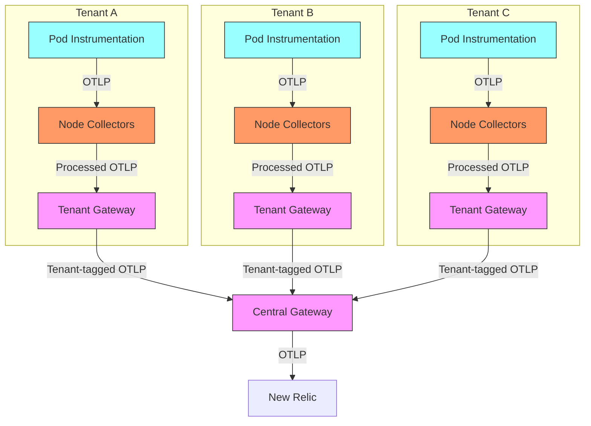
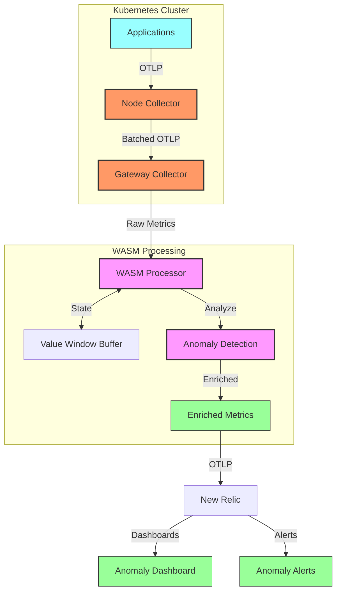
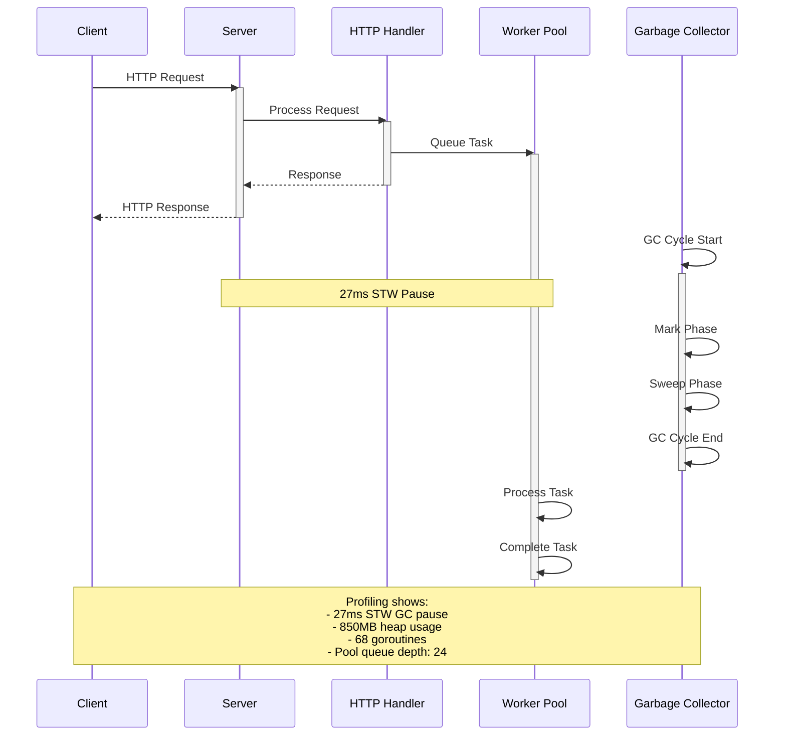

# Advanced Pipeline Recipes

## Overview

§ OpenTelemetry collectors form the backbone of modern telemetry pipelines, providing a flexible framework for ingesting, processing, and routing observability data. This chapter provides advanced pipeline configurations optimized for Kubernetes environments using New Relic as a backend. Beyond basic setups, we'll explore sophisticated patterns for multi-tenant architectures, high-volume data processing, and specialized domain requirements. These recipes represent production-tested approaches that balance performance, cost efficiency, and observability quality.

§ As Kubernetes deployments grow in complexity, the telemetry pipelines that monitor them must evolve to handle increased scale, mitigate cardinality explosion, and provide domain-specific views of system behavior. The configurations presented here leverage the full power of the OpenTelemetry Collector Contrib distribution, with special focus on processors that enhance the New Relic integration. Each recipe is designed to address specific Kubernetes observability challenges while maintaining alignment with cloud-native monitoring best practices.

## Multi-Tenant Pipeline Architecture

§ In multi-tenant Kubernetes environments, telemetry isolation between tenants is critical for security, cost allocation, and performance. This recipe implements a hierarchy of collectors that provides tenant-level isolation while maintaining central visibility.

### DG-24A: Multi-Tenant Collector Topology



### CF-24A: Tenant Collector Configuration

```yaml
# tenant-collector.yaml (Per-Tenant Node Collector)
receivers:
  otlp:
    protocols:
      grpc:
        endpoint: 0.0.0.0:4317
      http:
        endpoint: 0.0.0.0:4318
  
  # Node-level metrics specific to this tenant's workloads
  kubeletstats:
    collection_interval: 30s
    auth_type: serviceAccount
    endpoint: "${env:K8S_NODE_NAME}:10250"
    metric_groups: ["pod", "container"]
    extra_metadata_labels:
      - container.id
      - k8s.pod.name
      - k8s.namespace.name
    pod_association:
      - sources:
          - from: connection
            name: kubernetes.pod.uid

processors:
  batch:
    send_batch_size: 8192
    timeout: 10s

  # Apply tenant tag to all telemetry
  resource:
    attributes:
      - action: insert
        key: tenant.id
        value: "${env:TENANT_ID}"
      - action: insert
        key: tenant.name
        value: "${env:TENANT_NAME}"
  
  # Add Kubernetes metadata
  k8sattributes:
    auth_type: serviceAccount
    passthrough: false
    extract:
      metadata:
        - k8s.pod.name
        - k8s.pod.uid
        - k8s.deployment.name
        - k8s.namespace.name
        - k8s.container.name
      annotations:
        - key: opentelem/component
          from: pod
        - key: opentelem/service
          from: pod
    filter:
      node_from_env_var: K8S_NODE_NAME
      namespace_regex: ^${env:TENANT_NAMESPACE}$
  
  # Drop tenant-specific metrics not needed
  filter:
    metrics:
      exclude:
        match_type: regexp
        metric_names:
          - ^go\..*
          - ^process\..*
          # Add tenant-specific exclusions

  # Memory limiter for stability
  memory_limiter:
    check_interval: 1s
    limit_mib: 900
    spike_limit_mib: 200

exporters:
  otlp:
    endpoint: "${env:TENANT_GATEWAY_SERVICE}:4317"
    tls:
      insecure: true   # Use TLS in production!

service:
  pipelines:
    metrics:
      receivers: [otlp, kubeletstats]
      processors: [k8sattributes, resource, filter, batch, memory_limiter]
      exporters: [otlp]
    traces:
      receivers: [otlp]
      processors: [k8sattributes, resource, batch, memory_limiter]
      exporters: [otlp]
    logs:
      receivers: [otlp]
      processors: [k8sattributes, resource, batch, memory_limiter]
      exporters: [otlp]
```

### CF-24B: Central Gateway Configuration

```yaml
# central-gateway.yaml
receivers:
  otlp:
    protocols:
      grpc:
        endpoint: 0.0.0.0:4317
      http:
        endpoint: 0.0.0.0:4318

processors:
  batch:
    send_batch_size: 16384
    timeout: 10s
  
  # Resource detection for cloud metadata
  resourcedetection:
    detectors: [env, system, gcp, aws, azure]
    timeout: 2s
    override: false
  
  # Add global metadata
  resource:
    attributes:
      - action: insert
        key: deployment.environment
        value: "${env:ENVIRONMENT}"
      - action: insert
        key: service.namespace
        value: "multi-tenant-platform"
  
  # Enforce global attribute naming standards
  attributes:
    actions:
      # Standardize different tenant label formats
      - key: tenant.id
        action: update
        new_key: nr.tenant.id
      - key: tenant_id
        action: update
        new_key: nr.tenant.id
      - key: tenant
        action: update
        new_key: nr.tenant.id
      
      # Convert legacy K8s attributes to OTel format
      - key: pod_name
        action: update
        new_key: k8s.pod.name
      - key: namespace
        action: update
        new_key: k8s.namespace.name
  
  # Advanced memory management
  memory_limiter:
    check_interval: 1s
    limit_mib: 3800
    spike_limit_mib: 800
    
  # Tenant-aware retention routing
  routing:
    attribute_source: resource
    from_attribute: nr.tenant.id
    table:
      # High-retention tenant
      premium: {exporters: ["newrelic/premium"]}
      # Standard-retention tenants
      standard-*: {exporters: ["newrelic/standard"]}
      # Default route
      "*": {exporters: ["newrelic/standard"]}

exporters:
  newrelic/premium:
    endpoint: "https://otlp.nr-data.net:4317"
    headers:
      api-key: "${env:PREMIUM_LICENSE_KEY}"
    timeout: 20s
    retry_on_failure:
      enabled: true
      initial_interval: 5s
      max_interval: 30s
      max_elapsed_time: 300s
    sending_queue:
      enabled: true
      num_consumers: 10
      queue_size: 5000
      
  newrelic/standard:
    endpoint: "https://otlp.nr-data.net:4317"
    headers:
      api-key: "${env:STANDARD_LICENSE_KEY}"
    timeout: 20s
    retry_on_failure:
      enabled: true
      initial_interval: 5s
      max_interval: 30s
      max_elapsed_time: 300s

service:
  pipelines:
    metrics:
      receivers: [otlp]
      processors: [resourcedetection, resource, attributes, routing, batch, memory_limiter]
      exporters: [newrelic/premium, newrelic/standard]
    traces:
      receivers: [otlp]
      processors: [resourcedetection, resource, attributes, routing, batch, memory_limiter]
      exporters: [newrelic/premium, newrelic/standard]
    logs:
      receivers: [otlp]
      processors: [resourcedetection, resource, attributes, routing, batch, memory_limiter]
      exporters: [newrelic/premium, newrelic/standard]
```

## Advanced WASM-Based Processing

§ WebAssembly (WASM) processors enable custom processing logic beyond what's available in standard OTel processors. This recipe demonstrates implementing a sophisticated anomaly detector using WASM to pre-filter metrics before sending to New Relic.

### CF-24C: WASM Anomaly Detector Configuration

```yaml
# wasm-anomaly-detector.yaml
receivers:
  otlp:
    protocols:
      grpc:
        endpoint: 0.0.0.0:4317
      http:
        endpoint: 0.0.0.0:4318

processors:
  batch:
    send_batch_size: 8192
    timeout: 10s
  
  # WASM processor for anomaly detection
  wasm:
    module: /etc/otel/modules/anomaly_detector.wasm
    function: process_metrics
    metrics:
      inputs:
        - name: MetricsIn
          field: metrics
      outputs:
        - name: MetricsOut
          field: metrics
    runtime:
      memory_max: 256
      runtime_capabilities: ["metrics"]
    parameters:
      anomaly_config_json: |
        {
          "metrics": [
            {
              "name": "k8s.pod.cpu.utilization",
              "algorithm": "z-score",
              "window_size": 60,
              "threshold": 3.0,
              "add_status_attr": true
            },
            {
              "name": "k8s.pod.memory.usage",
              "algorithm": "mad",
              "window_size": 120,
              "threshold": 5.0,
              "add_status_attr": true
            },
            {
              "name": "http.server.duration",
              "algorithm": "ewma",
              "window_size": 30,
              "threshold": 2.5,
              "add_status_attr": true
            }
          ]
        }

exporters:
  otlp:
    endpoint: "https://otlp.nr-data.net:4317"
    headers:
      api-key: "${env:NEW_RELIC_LICENSE_KEY}"
    timeout: 20s

service:
  pipelines:
    metrics:
      receivers: [otlp]
      processors: [wasm, batch]
      exporters: [otlp]
```

### CF-24D: WASM Anomaly Detector Code (Rust)

```rust
// anomaly_detector.rs
use anyhow::Result;
use once_cell::sync::OnceCell;
use opentelemetry_proto::tonic::collector::metrics::v1::{
    ExportMetricsServiceRequest, ExportMetricsServiceResponse,
};
use serde::{Deserialize, Serialize};
use std::collections::{HashMap, VecDeque};
use wasmtime::{Caller, Engine, Instance, Module, Store};

static CONFIG: OnceCell<AnomalyConfig> = OnceCell::new();

#[derive(Deserialize)]
struct AnomalyConfig {
    metrics: Vec<MetricConfig>,
}

#[derive(Deserialize)]
struct MetricConfig {
    name: String,
    algorithm: String,
    window_size: usize,
    threshold: f64,
    add_status_attr: bool,
}

struct MetricState {
    values: VecDeque<f64>,
    mean: f64,
    variance: f64,
}

impl MetricState {
    fn new(window_size: usize) -> Self {
        Self {
            values: VecDeque::with_capacity(window_size),
            mean: 0.0,
            variance: 0.0,
        }
    }

    fn update(&mut self, value: f64, window_size: usize) {
        // Add new value
        self.values.push_back(value);
        
        // Maintain window size
        if self.values.len() > window_size {
            self.values.pop_front();
        }
        
        // Recalculate mean
        self.mean = self.values.iter().sum::<f64>() / self.values.len() as f64;
        
        // Recalculate variance
        self.variance = self.values.iter()
            .map(|x| (x - self.mean).powi(2))
            .sum::<f64>() / self.values.len() as f64;
    }
    
    fn z_score(&self, value: f64) -> f64 {
        if self.variance == 0.0 || self.values.len() < 3 {
            return 0.0;
        }
        (value - self.mean) / self.variance.sqrt()
    }
    
    fn mad(&self, value: f64) -> f64 {
        if self.values.len() < 3 {
            return 0.0;
        }
        
        // Calculate median
        let mut sorted = self.values.iter().cloned().collect::<Vec<_>>();
        sorted.sort_by(|a, b| a.partial_cmp(b).unwrap());
        let median = sorted[sorted.len() / 2];
        
        // Calculate median absolute deviation
        let deviations: Vec<f64> = sorted.iter().map(|x| (x - median).abs()).collect();
        deviations.sort_by(|a, b| a.partial_cmp(b).unwrap());
        let mad = deviations[deviations.len() / 2];
        
        if mad == 0.0 {
            return 0.0;
        }
        
        (value - median).abs() / mad
    }
    
    fn ewma(&self, value: f64, alpha: f64) -> f64 {
        if self.values.len() < 3 {
            return 0.0;
        }
        
        let mut ewma = self.values[0];
        let mut ewmvar = 0.0;
        
        for &v in self.values.iter().skip(1) {
            let delta = v - ewma;
            ewma = ewma + alpha * delta;
            ewmvar = (1.0 - alpha) * (ewmvar + alpha * delta * delta);
        }
        
        if ewmvar.sqrt() == 0.0 {
            return 0.0;
        }
        
        (value - ewma).abs() / ewmvar.sqrt()
    }
}

static METRIC_STATES: OnceCell<HashMap<String, MetricState>> = OnceCell::new();

#[no_mangle]
pub extern "C" fn process_metrics(
    metrics_ptr: *mut u8, metrics_len: usize, 
    config_ptr: *mut u8, config_len: usize,
    output_ptr: *mut u8, output_max: usize,
) -> usize {
    // Initialize configuration if needed
    if CONFIG.get().is_none() {
        let config_slice = unsafe { std::slice::from_raw_parts(config_ptr, config_len) };
        let config: AnomalyConfig = serde_json::from_slice(config_slice).unwrap_or_else(|_| {
            AnomalyConfig { metrics: Vec::new() }
        });
        
        let _ = CONFIG.set(config);
        let _ = METRIC_STATES.set(HashMap::new());
    }
    
    // Parse input metrics
    let metrics_slice = unsafe { std::slice::from_raw_parts(metrics_ptr, metrics_len) };
    let mut request: ExportMetricsServiceRequest = 
        prost::Message::decode(metrics_slice).unwrap_or_default();
    
    let config = CONFIG.get().unwrap();
    let metric_states = METRIC_STATES.get().unwrap();
    
    // Process each resource metrics
    for resource_metrics in &mut request.resource_metrics {
        for scope_metrics in &mut resource_metrics.scope_metrics {
            for metric in &mut scope_metrics.metrics {
                // Check if this metric is configured for anomaly detection
                if let Some(config_entry) = config.metrics.iter()
                    .find(|m| m.name == metric.name) {
                    
                    // Process based on data type
                    process_metric(metric, config_entry, metric_states);
                }
            }
        }
    }
    
    // Encode output
    let mut buf = Vec::with_capacity(output_max);
    prost::Message::encode(&request, &mut buf).unwrap();
    
    // Copy to output buffer
    let output_len = buf.len().min(output_max);
    unsafe {
        std::ptr::copy_nonoverlapping(buf.as_ptr(), output_ptr, output_len);
    }
    
    output_len
}

fn process_metric(
    metric: &mut opentelemetry_proto::metrics::v1::Metric,
    config: &MetricConfig,
    metric_states: &mut HashMap<String, MetricState>,
) {
    // Process based on data type
    match &metric.data {
        Some(data) => match data {
            opentelemetry_proto::metrics::v1::metric::Data::Gauge(gauge) => {
                process_gauge(metric, gauge, config, metric_states);
            }
            opentelemetry_proto::metrics::v1::metric::Data::Sum(sum) => {
                process_sum(metric, sum, config, metric_states);
            }
            opentelemetry_proto::metrics::v1::metric::Data::Histogram(histogram) => {
                process_histogram(metric, histogram, config, metric_states);
            }
            _ => {} // Skip other types
        },
        None => {}
    }
}

// Implementation of gauge processing
fn process_gauge(
    metric: &mut opentelemetry_proto::metrics::v1::Metric,
    gauge: &opentelemetry_proto::metrics::v1::Gauge,
    config: &MetricConfig,
    metric_states: &mut HashMap<String, MetricState>,
) {
    for point in &gauge.data_points {
        let value = point.as_double().unwrap_or_default();
        let state_key = format!("{}:{}", metric.name, point.attributes.iter()
            .map(|a| format!("{}={}", a.key, a.value.as_str().unwrap_or_default()))
            .collect::<Vec<_>>()
            .join(","));
            
        let state = metric_states.entry(state_key).or_insert_with(|| {
            MetricState::new(config.window_size)
        });
        
        state.update(value, config.window_size);
        
        let anomaly_score = match config.algorithm.as_str() {
            "z-score" => state.z_score(value),
            "mad" => state.mad(value),
            "ewma" => state.ewma(value, 0.1), // Alpha=0.1 for EWMA
            _ => 0.0,
        };
        
        if config.add_status_attr {
            // Add anomaly score attribute
            point.attributes.push(opentelemetry_proto::common::v1::KeyValue {
                key: "anomaly.score".to_string(),
                value: Some(opentelemetry_proto::common::v1::AnyValue {
                    value: Some(opentelemetry_proto::common::v1::any_value::Value::DoubleValue(
                        anomaly_score
                    )),
                }),
            });
            
            // Add anomaly status attribute if above threshold
            if anomaly_score > config.threshold {
                point.attributes.push(opentelemetry_proto::common::v1::KeyValue {
                    key: "anomaly.status".to_string(),
                    value: Some(opentelemetry_proto::common::v1::AnyValue {
                        value: Some(opentelemetry_proto::common::v1::any_value::Value::StringValue(
                            "detected".to_string()
                        )),
                    }),
                });
            }
        }
    }
}

// Similar implementations for process_sum and process_histogram...

// Export WASM functions
#[no_mangle]
pub extern "C" fn allocate(size: i32) -> *mut u8 {
    let mut buffer = Vec::with_capacity(size as usize);
    let ptr = buffer.as_mut_ptr();
    std::mem::forget(buffer);
    ptr
}

#[no_mangle]
pub extern "C" fn deallocate(pointer: *mut u8, size: i32) {
    unsafe {
        let _ = Vec::from_raw_parts(pointer, 0, size as usize);
    }
}
```

### DG-24B: Anomaly Detection Pipeline Architecture



## High-Performance pprof Profiling Pipeline

§ For performance-critical applications, system-level profiling data provides essential insights. This recipe integrates Go pprof profiling data into the OTel metrics pipeline.

### CF-24E: pprof Profiling Collector Configuration

```yaml
# pprof-collector.yaml
receivers:
  otlp:
    protocols:
      grpc:
        endpoint: 0.0.0.0:4317
      http:
        endpoint: 0.0.0.0:4318
  
  # Prometheus pprof metrics receiver
  prometheus:
    config:
      scrape_configs:
        - job_name: 'pprof'
          scrape_interval: 15s
          metrics_path: /debug/pprof/metrics
          kubernetes_sd_configs:
            - role: pod
          relabel_configs:
            - source_labels: [__meta_kubernetes_pod_annotation_prometheus_io_scrape_pprof]
              action: keep
              regex: true
            - source_labels: [__meta_kubernetes_pod_annotation_prometheus_io_port]
              action: replace
              target_label: __address__
              regex: (\d+)
              replacement: $1:9090
            - source_labels: [__meta_kubernetes_pod_annotation_prometheus_io_path]
              action: replace
              target_label: __metrics_path__
              regex: (.+)
          metric_relabel_configs:
            - source_labels: [__name__]
              regex: 'go_(gc|memory|memstats|goroutines).*'
              action: keep

processors:
  batch:
    send_batch_size: 8192
    timeout: 10s
  
  # Transform pprof metrics to New Relic format
  transform:
    metric_statements:
      - context: metric
        statements:
          # Rename Go runtime metrics to be more recognizable 
          - set(name, Replace(name, "go_memstats_", "go.memory.")) where name startswith "go_memstats_"
          - set(name, Replace(name, "go_gc_", "go.gc.")) where name startswith "go_gc_"
          - set(name, Replace(name, "go_goroutines", "go.goroutines.count"))
      
      - context: datapoint
        statements:
          # Add service name from k8s metadata
          - set(attributes["service.name"], resource.attributes["k8s.pod.name"])
          # Add component type
          - set(attributes["telemetry.sdk.language"], "go")
          # Normalize units
          - set(attributes["unit"], "bytes") where metric.name matches "go.memory.*bytes"
          - set(attributes["unit"], "seconds") where metric.name matches "go.gc.*seconds"
  
  # Add k8s metadata
  k8sattributes:
    auth_type: serviceAccount
    passthrough: false
    extract:
      metadata:
        - k8s.pod.name
        - k8s.pod.uid
        - k8s.deployment.name
        - k8s.namespace.name
        - k8s.container.name

exporters:
  newrelic:
    endpoint: "https://otlp.nr-data.net:4317"
    headers:
      api-key: "${env:NEW_RELIC_LICENSE_KEY}"
    timeout: 20s

service:
  pipelines:
    metrics/pprof:
      receivers: [prometheus]
      processors: [k8sattributes, transform, batch]
      exporters: [newrelic]
    metrics/standard:
      receivers: [otlp]
      processors: [batch]
      exporters: [newrelic]
```

### CF-24F: Example Pod Annotations for pprof Exposure

```yaml
apiVersion: apps/v1
kind: Deployment
metadata:
  name: example-go-service
  namespace: default
spec:
  replicas: 3
  selector:
    matchLabels:
      app: example-go-service
  template:
    metadata:
      labels:
        app: example-go-service
      annotations:
        prometheus.io/scrape_pprof: "true"
        prometheus.io/port: "9090"
        prometheus.io/path: "/debug/pprof/metrics"
    spec:
      containers:
      - name: example-go-service
        image: example/go-service:latest
        ports:
        - containerPort: 8080
          name: http
        - containerPort: 9090
          name: pprof
        env:
        - name: ENABLE_PPROF
          value: "true"
```

### DG-24C: Event Loop Timing in Go Service



## Domain-Specific Processing Pipeline

§ Different observability domains often require specialized processing. This recipe provides a domain-oriented pipeline configuration that handles infrastructure, application, and business metrics differently.

### CF-24G: Domain-Specific Pipeline Configuration

```yaml
# domain-pipeline.yaml
receivers:
  otlp:
    protocols:
      grpc:
        endpoint: 0.0.0.0:4317
      http:
        endpoint: 0.0.0.0:4318

processors:
  batch:
    send_batch_size: 8192
    timeout: 10s
  
  # Domain detection processor using OTTL
  transform/domain:
    metric_statements:
      - context: metric
        statements:
          # Infrastructure domain
          - set(resource.attributes["telemetry.domain"], "infrastructure") where name matches "^(system|cpu|memory|disk|network|kubernetes|container|host|node).*"
          # Application domain
          - set(resource.attributes["telemetry.domain"], "application") where name matches "^(http|db|app|service|rpc|jvm|dotnet|python|nodejs|runtime).*"
          # Business domain
          - set(resource.attributes["telemetry.domain"], "business") where name matches "^(business|transaction|order|payment|user|session|cart|checkout).*"
          # Default domain
          - set(resource.attributes["telemetry.domain"], "other") where resource.attributes["telemetry.domain"] == nil
  
  # Infrastructure domain processing
  transform/infrastructure:
    metric_statements:
      - context: metric
        statements:
          # Standardize common units
          - set(unit, "percent") where name matches ".*utilization.*|.*percent.*"
          - set(unit, "bytes") where name matches ".*bytes.*|.*memory.*|.*size.*"
          - set(unit, "count") where unit == "" and name matches ".*count.*"
          
          # Enrich with metadata
          - set(resource.attributes["infrastructure.type"], "kubernetes") where name matches "^kubernetes.*"
          - set(resource.attributes["infrastructure.type"], "host") where name matches "^(system|cpu|memory|disk|network).*"
  
  # Application domain processing
  transform/application:
    metric_statements:
      - context: metric
        statements:
          # Derive service names from metric names when missing
          - set(resource.attributes["service.name"], SpanFromString(name, ".", 0)) where resource.attributes["service.name"] == nil and name matches "^[a-zA-Z0-9]+\\..*"
          
          # Map to standard OTel semantic conventions 
          - set(name, "http.server.request.duration") where name == "http.request.duration"
          - set(name, "http.server.request.count") where name == "http.request.count"
  
  # Business domain processing
  transform/business:
    metric_statements:
      - context: metric
        statements:
          # Add business unit attribution
          - set(resource.attributes["business.unit"], "retail") where name matches "^(order|cart|checkout).*"
          - set(resource.attributes["business.unit"], "accounts") where name matches "^(user|account|session).*"
          - set(resource.attributes["business.unit"], "payments") where name matches "^(payment|transaction).*"
          
          # Add KPI flag for important business metrics
          - set(resource.attributes["business.kpi"], true) where name matches ".*(revenue|conversion|retention).*"
  
  # Domain-specific routing
  routing:
    attribute_source: resource
    from_attribute: telemetry.domain
    table:
      infrastructure: {exporters: ["newrelic/infrastructure"]}
      application: {exporters: ["newrelic/application"]}
      business: {exporters: ["newrelic/business"]}
      "*": {exporters: ["newrelic/default"]}

exporters:
  # Different API keys for different domains
  newrelic/infrastructure:
    endpoint: "https://otlp.nr-data.net:4317"
    headers:
      api-key: "${env:INFRA_LICENSE_KEY}"
    timeout: 20s
  
  newrelic/application:
    endpoint: "https://otlp.nr-data.net:4317"
    headers:
      api-key: "${env:APM_LICENSE_KEY}"
    timeout: 20s
  
  newrelic/business:
    endpoint: "https://otlp.nr-data.net:4317"
    headers:
      api-key: "${env:BUSINESS_LICENSE_KEY}"
    timeout: 20s
  
  newrelic/default:
    endpoint: "https://otlp.nr-data.net:4317"
    headers:
      api-key: "${env:DEFAULT_LICENSE_KEY}"
    timeout: 20s

service:
  # Domain-specific processing pipeline
  pipelines:
    metrics:
      receivers: [otlp]
      processors: [transform/domain, routing, batch]
      exporters: [newrelic/infrastructure, newrelic/application, newrelic/business, newrelic/default]
    
    metrics/infrastructure:
      receivers: [otlp]
      processors: [transform/domain, transform/infrastructure, batch]
      exporters: [newrelic/infrastructure]
    
    metrics/application:
      receivers: [otlp]
      processors: [transform/domain, transform/application, batch]
      exporters: [newrelic/application]
    
    metrics/business:
      receivers: [otlp]
      processors: [transform/domain, transform/business, batch]
      exporters: [newrelic/business]
```

## Sampling & Aggregation Strategies

§ As telemetry volume increases, strategic sampling and aggregation become critical for cost control while maintaining visibility. This recipe demonstrates advanced, configurable sampling techniques.

### CF-24H: Advanced Tail Sampling Configuration

```yaml
# tail-sampling.yaml
receivers:
  otlp:
    protocols:
      grpc:
        endpoint: 0.0.0.0:4317
      http:
        endpoint: 0.0.0.0:4318

processors:
  batch:
    send_batch_size: 8192
    timeout: 10s
  
  # Tail-based sampling for traces
  tail_sampling:
    decision_wait: 10s
    num_traces: 100000
    expected_new_traces_per_sec: 1000
    
    policies:
      # Keep all errors
      - name: error-policy
        type: status_code
        status_code:
          status_codes: [ERROR]
      
      # Keep slow transactions
      - name: latency-policy
        type: latency
        latency:
          threshold_ms: 500
      
      # Keep all transactions from critical services
      - name: critical-services
        type: string_attribute
        string_attribute:
          key: service.name
          values: [payment-service, authentication-service, checkout-service]
      
      # Keep all transactions for high-value customers
      - name: vip-customers
        type: string_attribute
        string_attribute:
          key: customer.tier
          values: [platinum, gold]
      
      # Sample remaining HTTP transactions at 10%
      - name: http-sampling
        type: and
        and:
          - name: http-filter
            type: string_attribute
            string_attribute:
              key: http.url
              values: ["http*"]
              enabled_regex: true
          - name: probabilistic-filter
            type: probabilistic
            probabilistic:
              sampling_percentage: 10
      
      # Sample everything else at 5%
      - name: default-policy
        type: probabilistic
        probabilistic:
          sampling_percentage: 5
  
  # Metrics aggregation and sampling
  aggregate:
    metrics:
      # Pre-aggregate high-volume metrics
      - name: http.*.request.duration
        aggregation: histogram
        temporality: delta
        keys:
          - service.name
          - http.route
        max_observations: 10000
      
      - name: system.cpu.utilization
        aggregation: average
        temporality: delta
        keys:
          - host.name
          - cpu.state
          - cpu.num
      
      - name: kubernetes.pod.memory.usage
        aggregation: sum
        temporality: delta
        keys:
          - k8s.pod.name
          - k8s.namespace.name
  
  # Probabilistic metrics sampling
  probabilistic_sampler:
    hash_seed: 42
    sampling_percentage: 100 # Default 100%
    sampling_table:
      # High-value metrics kept at 100%
      "cpu.utilization": 100
      "memory.utilization": 100
      "disk.utilization": 100
      "*.error.*": 100
      
      # Medium-value metrics sampled at 50%
      "http.server.*": 50
      "db.*": 50
      
      # Low-value metrics aggressively sampled
      "go.*": 10
      "process.*": 10
      "runtime.*": 10

exporters:
  newrelic:
    endpoint: "https://otlp.nr-data.net:4317"
    headers:
      api-key: "${env:NEW_RELIC_LICENSE_KEY}"
    timeout: 20s

service:
  pipelines:
    traces:
      receivers: [otlp]
      processors: [tail_sampling, batch]
      exporters: [newrelic]
    metrics:
      receivers: [otlp]
      processors: [aggregate, probabilistic_sampler, batch]
      exporters: [newrelic]
```

## Real-Time Analytics Pipeline

§ For real-time dashboards and alerting, minimizing latency is critical. This recipe configures a low-latency pipeline with carefully tuned parameters for operational insight with minimal delay.

### CF-24I: Low-Latency Pipeline Configuration

```yaml
# low-latency-pipeline.yaml
receivers:
  otlp:
    protocols:
      grpc:
        endpoint: 0.0.0.0:4317
        keepalive:
          server_parameters:
            time: 30s
            timeout: 5s
            enforcement_policy:
              min_time: 10s
              permit_without_stream: true
      http:
        endpoint: 0.0.0.0:4318
        cors:
          allowed_origins: ["*"]
          allowed_headers: ["*"]

processors:
  batch:
    # Smaller batches for lower latency
    send_batch_size: 1024
    timeout: 1s  # Short timeout for frequent sends
  
  # Memory limiter configured for stability
  memory_limiter:
    check_interval: 0.5s
    limit_mib: 900
    spike_limit_mib: 100
    
  # Resource detection for cloud metadata
  resourcedetection:
    # Short timeout to avoid blocking
    timeout: 1s
    detectors: [env, system]
    override: false
  
  # Fast attribute processor with minimal operations
  attributes:
    actions:
      # Just essential transformations
      - key: host.name
        action: insert
        value: "${env:HOSTNAME}"
      - key: deployment.environment
        action: insert
        value: "${env:ENVIRONMENT}"

exporters:
  newrelic:
    endpoint: "https://otlp.nr-data.net:4317"
    headers:
      api-key: "${env:NEW_RELIC_LICENSE_KEY}"
    timeout: 5s  # Short timeout
    retry_on_failure:
      enabled: true
      initial_interval: 1s  # Start retrying quickly
      max_interval: 5s      # Cap retry interval
      max_elapsed_time: 30s # Don't retry forever
    sending_queue:
      enabled: true
      num_consumers: 8  # More consumers for parallelism
      queue_size: 1000  # Reasonable queue size
  
  # Debug logging for troubleshooting
  logging:
    verbosity: basic
    sampling_initial: 5
    sampling_thereafter: 200

service:
  # Telemetry for self-monitoring
  telemetry:
    logs:
      level: info
    metrics:
      address: localhost:8888
    
  extensions: []
  pipelines:
    # Critical metrics pipeline with minimal processing
    metrics/critical:
      receivers: [otlp]
      processors: [memory_limiter, batch]
      exporters: [newrelic]
    
    # Traces with slightly more processing
    traces:
      receivers: [otlp]
      processors: [memory_limiter, resourcedetection, attributes, batch]
      exporters: [newrelic, logging]
```

### EQ-24A: Pipeline Latency Formula

```
Pipeline Latency = Collection Interval + 
                   Processing Time + 
                   (Batching Delay / 2) + 
                   Network Latency +
                   Ingest Processing Time

Where:
- Collection Interval: Time between metric collections (e.g., 10s)
- Processing Time: Time to process telemetry through pipeline (e.g., 50ms)
- Batching Delay: Batch timeout setting (e.g., 1000ms → 500ms average wait)
- Network Latency: Time to transmit data to backend (e.g., 100ms)
- Ingest Processing Time: Backend processing delay (e.g., 250ms)
```

For the low-latency pipeline:

```
Average pipeline latency = 10s + 50ms + (1000ms / 2) + 100ms + 250ms
                         = 10s + 50ms + 500ms + 100ms + 250ms
                         = 10s + 900ms
                         = 10.9 seconds
```

### TB-24A: Latency Impact of Processing Steps

| Processing Step | Typical Latency | Impact on Pipeline | Optimization Strategy |
|-----------------|-----------------|-------------------|----------------------|
| Batch processor | 0.5-5s | High | Reduce timeout, smaller batches |
| Memory limiter | 5-10ms | Low | Higher check frequency |
| Resource detection | 50-500ms | Medium | Limited detectors, short timeout |
| OTTL transforms | 10-100ms | Medium | Minimize complex transforms |
| Attribute processor | 5-30ms | Low | Only essential attributes |
| Tail sampling | 100ms-10s | Very High | Reduce decision wait |
| K8s attributes | 50-200ms | Medium | Selective metadata extraction |
| Aggregation | 50-200ms | Medium | Fewer dimensions, selective use |
| Routing | 5-20ms | Low | Simple routing conditions |

## Conclusion

§ The OpenTelemetry Collector provides a powerful framework for building sophisticated telemetry pipelines. The recipes in this chapter demonstrate how to address common Kubernetes observability challenges through thoughtful configuration of receivers, processors, and exporters. By implementing these patterns, teams can achieve better visibility, control costs, and derive more value from their observability data in New Relic.

§ As your Kubernetes deployments evolve, these pipeline recipes can be adapted and combined to address specific organizational requirements. The key to successful implementation is understanding the trade-offs between data fidelity, processing overhead, and cost considerations. Regular tuning and optimization of these pipelines ensures that your observability solution scales alongside your infrastructure, providing the insights needed for efficient operations.

---

**Next Chapter**: [Low-Data Mode & Cardinality](./26_Low_Data_Mode.md)