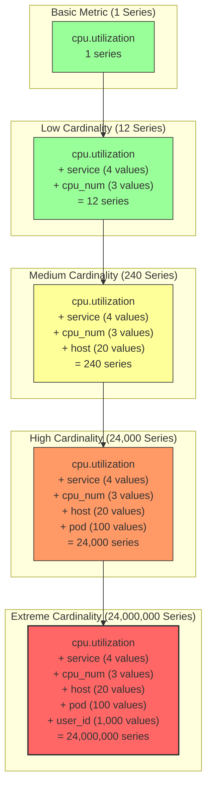

# Low-Data Mode & Cardinality

## Overview

§ In cloud-native environments, the volume of telemetry data can quickly become overwhelming, leading to increased costs, storage challenges, and performance degradation. This chapter explores strategies for implementing "Low-Data Mode" in New Relic deployments, focusing on cardinality management and intelligent data reduction techniques. By carefully selecting which data to collect and how to structure it, organizations can significantly reduce their telemetry footprint while maintaining comprehensive observability.

§ Cardinality management is particularly critical in Kubernetes environments, where ephemeral workloads and dynamic infrastructure can generate an explosion of unique time series. We'll examine how New Relic's dimensional metrics system handles high-cardinality data, the built-in low-data mode features of New Relic's Kubernetes integration, and advanced techniques for custom cardinality control using the OpenTelemetry Collector. This chapter provides concrete configurations and best practices to help teams optimize their observability costs without sacrificing visibility.

## Understanding Cardinality

§ Cardinality in metrics refers to the number of unique time series generated by a given metric. Each unique combination of metric name and dimension values (labels/tags/attributes) creates a new time series that must be stored, indexed, and queried. While dimensions provide crucial context for metrics, they can lead to exponential growth in cardinality, resulting in storage demands that can quickly outpace budgets.

### TB-26A: Common High-Cardinality Dimensions to Consider

| Dimension | Cardinality Risk | Impact | Recommendation |
|-----------|------------------|--------|----------------|
| `user_id`, `customer_id` | Extreme | Millions of series | Avoid as a metric dimension; use for logs/traces |
| `pod_name` | High | Thousands of series | Use `deployment_name` for aggregation |
| `container_id` | High | Thousands of series | Use `container_name` instead |
| `ip_address` | High | Thousands of series | Group by subnet or use sparingly |
| `request_id`, `trace_id` | Extreme | Millions of series | Keep in traces, not metrics |
| `url`, `path` | High | Thousands of series | Use path templates or route names |
| `session_id` | Extreme | Millions of series | Aggregate by user type or tenant |
| `host_name` (ephemeral) | Medium | Hundreds of series | Use clusters or static metadata |
| `build_id`, `version` | Medium | Hundreds of series | Group minor versions if possible |
| Timestamp components | High | Thousands of series | Use bucketing or time windows |

### DG-26A: Cardinality Explosion Visualization



### TB-26B: Cardinality Explosion Impact

| Cardinality Level | Series Count | Storage Impact | Query Impact | Cost Impact | NRDB Implications |
|-------------------|--------------|----------------|--------------|-------------|-------------------|
| Low | <1,000 | Minimal | Fast queries | Low cost | Excellent performance |
| Medium | 1,000-10,000 | Moderate storage | Good performance | Moderate cost | Good performance |
| High | 10,000-100,000 | Significant storage | Degraded performance | High cost | Indexing pressure |
| Extreme | >100,000 | Severe storage demands | Very slow queries | Very high cost | May hit limits or failures |
| Explosion | >1,000,000 | Unsustainable | Timeout risk | Prohibitive cost | Service disruption risk |

## New Relic's Low-Data Mode

§ New Relic's Kubernetes integration offers a built-in Low-Data Mode that significantly reduces the volume of telemetry data while maintaining essential visibility. This feature is particularly valuable in large clusters or cost-sensitive environments.

### CF-26A: Enabling Low-Data Mode in Kubernetes Integration

```yaml
# values.yaml for Helm chart
global:
  lowDataMode: true  # Enable Low-Data Mode

newrelic-infrastructure:
  lowDataMode: true
  
  config:
    # Additional Low-Data Mode tuning
    kubernetes_metadata_include_namespaces: "default,kube-system,monitoring"
    kubernetes_metadata_exclude_namespaces: ""
    kubernetes_metadata_include_labels: "app,deployment,service"
    kubernetes_metadata_exclude_labels: "hash,pod-template-hash"
    
    # Integration configuration
    integrations_config:
      # Drop specific metrics
      metric_api_drop_metrics: "go_*,jvm_*"
      # Drop specific attributes
      metric_api_drop_dimensions: "container_id,pod_uid"
```

### TB-26C: Low-Data Mode Reduction Techniques

| Technique | Standard Mode | Low-Data Mode | Data Reduction |
|-----------|---------------|---------------|----------------|
| Sample rate | 15 seconds | 30 seconds | ~50% |
| Metric filtering | ~500 metrics | ~120 core metrics | ~75% |
| Dimension pruning | ~40 dimensions | ~15 essential dimensions | ~60% |
| Pod filtering | All pods | User configurable | 0-90% |
| Container metrics | All containers | User configurable | 0-80% |
| Control plane | Full metrics | Essential only | ~70% |
| Integration metrics | All enabled | Critical only | ~80% |
| Metadata | All metadata | Essential metadata | ~50% |
| **Overall reduction** | **100%** | **10-25%** | **75-90%** |

### Core Metrics Preserved in Low-Data Mode

§ Even with Low-Data Mode enabled, the following critical metrics are still collected to ensure comprehensive monitoring:

#### TB-26D: Core Metrics in Low-Data Mode

| Category | Preserved Metrics | Purpose |
|----------|-------------------|---------|
| Cluster Health | `k8s.cluster.pod.phase`, `k8s.node.condition` | Overall cluster health |
| Node Resources | `k8s.node.cpu.utilization`, `k8s.node.memory.utilization`, `k8s.node.filesystem.usage` | Node resource usage |
| Pod Resources | `k8s.pod.cpu.utilization`, `k8s.pod.memory.usage`, `k8s.pod.restarts` | Pod resource consumption |
| Container Health | `k8s.container.cpu.utilization`, `k8s.container.memory.usage`, `k8s.container.status` | Container resource usage |
| Workload Status | `k8s.deployment.available`, `k8s.statefulset.ready` | Deployment health |
| Networking | `k8s.pod.network.receive_bytes`, `k8s.pod.network.transmit_bytes` | Network throughput |
| Storage | `k8s.persistentvolume.status`, `k8s.persistentvolumeclaim.status` | Storage health |
| API Server | `k8s.apiserver.request.duration`, `k8s.apiserver.request.count` | API server performance |
| Resource Quotas | `k8s.resourcequota.used`, `k8s.resourcequota.hard` | Quota consumption |

## Advanced Cardinality Management Techniques

§ Beyond New Relic's built-in capabilities, several advanced techniques can be employed to control cardinality in Kubernetes telemetry:

### 1. Label Filtering and Transformation

§ Kubernetes labels and annotations often contain high-cardinality values that should be filtered or transformed before being used as dimensions.

#### CF-26B: OTel Collector Label Filtering Configuration

```yaml
# otel-collector-config.yaml
processors:
  k8sattributes:
    auth_type: "serviceAccount"
    passthrough: false
    extract:
      metadata:
        # Include only these k8s metadata attributes
        - k8s.namespace.name
        - k8s.deployment.name
        - k8s.statefulset.name
        - k8s.daemonset.name
        - k8s.cronjob.name
        - k8s.node.name
      # Include only specific labels as dimensions
      labels:
        - key: app
          from: pod
        - key: component
          from: pod
        - key: tier
          from: pod
        - key: version
          from: pod
          regex: '(\d+\.\d+).*'
          regex_group_idx: 1  # Extract just major.minor version
      # Exclude high-cardinality labels
      exclude:
        labels:
          - pod-template-hash
          - controller-revision-hash
          - deployment.kubernetes.io/revision
```

### 2. Attribute Processor for Dimension Control

§ The attributes processor can enforce organization-wide naming conventions and limit dimensionality.

#### CF-26C: Dimension Standardization Configuration

```yaml
# dimension-control.yaml
processors:
  attributes:
    actions:
      # Convert attributes to standard naming convention
      - key: label.app
        action: update
        new_key: service.name
      
      # Hash high-cardinality values
      - key: http.url
        action: update
        new_key: http.route_hash
        value: {{ if and (IsString .value) (MatchesRegexp `^/api/users/\d+/.*$` .value) }} "/api/users/{id}/{{index (Split .value "/") 4}}" {{ else }} {{.value}} {{ end }}
      
      # Drop unnecessary dimensions
      - key: k8s.pod.uid
        action: delete
      - key: container.id
        action: delete
      - key: process.pid
        action: delete
      
      # Keep only major.minor for version
      - key: service.version
        action: update
        value: {{ if and (IsString .value) (MatchesRegexp `^(\d+\.\d+).*$` .value) }} {{index (RegexpReplace `^(\d+\.\d+).*$` "${1}" .value) 0}} {{ else }} {{.value}} {{ end }}
      
      # Add environment grouping
      - key: deployment.environment
        action: insert
        value: "production"
```

### 3. Hashing High-Cardinality Keys

§ When a dimension provides useful context but has high cardinality, hashing values into buckets can preserve analytical utility while controlling cardinality.

#### CF-26D: OTTL Hash-Based Bucketing

```yaml
# hash-bucketing.yaml
processors:
  transform:
    metric_statements:
      # Hash user IDs into 100 buckets
      - context: datapoint
        statements:
          - set(attributes["user.bucket"], Hash(attributes["user.id"]) % 100) where attributes["user.id"] != nil
          - delete_key(attributes, "user.id")
      
      # Bucketize URL paths
      - context: datapoint
        statements:
          - set(attributes["http.route_template"], Substring(attributes["http.url"], 0, LastIndexOf(attributes["http.url"], "/")+1) + "{id}") where attributes["http.url"] != nil and MatchString("(/[a-zA-Z]+/[a-zA-Z]+/)[0-9]+(/.*)?", attributes["http.url"])
          - delete_key(attributes, "http.url") where attributes["http.route_template"] != nil
```

### 4. Time-Series Aggregation

§ Pre-aggregating high-frequency metrics reduces cardinality while preserving the most valuable insights.

#### CF-26E: OTel Metric Aggregation Configuration

```yaml
# metric-aggregation.yaml
processors:
  aggregate:
    # Pre-aggregate high-volume metrics by minute
    metrics:
      - name: http.server.duration
        temporality: delta
        aggregation: histogram
        dimensions:
          - service.name
          - http.route_template
          - http.status_code
        aggregation_temporality: AGGREGATION_TEMPORALITY_CUMULATIVE
        report_temporality_as_delta: true
      
      - name: system.cpu.usage
        temporality: delta
        aggregation: sum
        dimensions:
          - host.name
          - mode
        aggregation_temporality: AGGREGATION_TEMPORALITY_CUMULATIVE
        report_temporality_as_delta: true
```

## Cardinality Management Strategies by Data Type

### Metrics Cardinality Strategy

1. **Hierarchical Aggregation**
   - Aggregate metrics at multiple levels (pod → deployment → namespace)
   - Use aggregation processors to pre-summarize data

2. **Dimension Prioritization**
   - Rank dimensions by analytical value vs. cardinality risk
   - Strictly limit dimensions on high-frequency metrics
   - Be more permissive with dimensions on low-frequency metrics

3. **Temporal Resolution Management**
   - Adjust sampling frequency based on metric importance
   - Use longer intervals for baseline metrics

### Traces Cardinality Strategy

1. **Intelligent Sampling**
   - Use tail-based sampling to keep important traces
   - Apply strict sampling for high-volume, low-value paths

2. **Span Filtering**
   - Drop internal spans that add minimal value
   - Focus on service boundaries and external calls

3. **Attribute Filtering**
   - Keep attributes needed for correlation and debugging
   - Limit high-cardinality attributes to critical spans only

### Logs Cardinality Strategy

1. **Structured Logging**
   - Enforce consistent structured log formats
   - Limit indexable fields to essential dimensions

2. **Log Level Management**
   - Dynamic log levels based on service health
   - Increase verbosity only during incidents

3. **Pattern Recognition**
   - Convert repetitive logs into metrics
   - Use pattern extraction for similar log lines

## Domain-Specific Low-Data Configurations

### Low-Data Mode for Microservices

§ Microservice architectures present unique challenges due to the high number of services and complex dependencies. This configuration focuses on maintaining service-level visibility while controlling cardinality.

#### CF-26F: Microservices Low-Data Mode Configuration

```yaml
# microservices-low-data.yaml
processors:
  filter:
    metrics:
      include:
        match_type: regexp
        metric_names:
          # Service-level health
          - http\.(server|client)\..*
          - grpc\.(server|client)\..*
          - db\..*
          - messaging\..*
          # Resource utilization
          - system\.(cpu|memory)\..*
          - process\.(cpu|memory)\..*
      exclude:
        match_type: strict
        metric_names:
          # Remove detailed Go runtime metrics
          - go_gc_duration_seconds
          - go_goroutines
          - go_memstats_alloc_bytes_total
          - process_open_fds
  
  # Control dimensions for service metrics
  transform:
    metric_statements:
      # HTTP metrics - keep only essential dimensions
      - context: datapoint
        statements:
          - keep_keys(attributes, ["service.name", "service.version", "http.method", "http.status_code", "http.route"]) where metric.name startswith "http."
      
      # Database metrics - limit dimensions
      - context: datapoint
        statements:
          - keep_keys(attributes, ["service.name", "db.system", "db.operation", "db.name"]) where metric.name startswith "db."
      
      # Resource metrics - basic dimensions only
      - context: datapoint
        statements:
          - keep_keys(attributes, ["service.name", "service.instance.id", "container.name"]) where metric.name startswith "system." or metric.name startswith "process."
```

### Low-Data Mode for Database Monitoring

§ Database telemetry often includes high-cardinality dimensions like query IDs, SQL statements, and user sessions. This configuration maintains visibility into database performance while controlling cardinality.

#### CF-26G: Database Low-Data Mode Configuration

```yaml
# database-low-data.yaml
processors:
  filter:
    metrics:
      include:
        match_type: regexp
        metric_names:
          # Database performance
          - db\.(system|instance)\..*
          - db\.connections\..*
          - db\.(statement|query)\..*
          # Storage metrics
          - db\.storage\..*
          # Transaction metrics
          - db\.transaction\..*
      exclude:
        match_type: regexp
        metric_names:
          # High-volume per-query metrics
          - db\.statement\.stats\..*
          - db\.query\.row_count
  
  transform:
    metric_statements:
      # Query metrics - normalize and hash statements
      - context: datapoint
        statements:
          # Normalize SQL to template
          - set(attributes["db.statement.template"], RegexReplace(attributes["db.statement"], "(['\"])(?:[^']|.)\\1", "?")) where attributes["db.statement"] != nil
          # Hash full SQL to avoid storing raw queries
          - set(attributes["db.statement.hash"], Hash(attributes["db.statement"])) where attributes["db.statement"] != nil
          # Remove raw statement after processing
          - delete_key(attributes, "db.statement")
```

## Incident Response and Cardinality Surge Protection

§ During incidents, observability needs often increase, potentially leading to cardinality surges. This section covers strategies for managing these spikes.

### RB-26A: Cardinality Surge Runbook

```
# Cardinality Surge Response Runbook

## Triggers
- Alert: "High metric cardinality detected" 
- Alert: "NRDB insertion rate > 85% of quota"
- Alert: "OTel collector memory usage > 80%"

## Impact
- Increased costs due to higher data volume
- Potential query performance degradation
- Risk of dropped data if limits are reached
- Increased storage pressure

## Investigation Steps

1. Identify source of cardinality surge
   ```
   SELECT count(*) FROM Metric FACET metricName LIMIT 20
   ```

2. Analyze dimension distribution
   ```
   SELECT uniqueCount(timestamp) AS numSeries, latest(timestamp) as freshness FROM Metric 
   WHERE metricName = '{problematic_metric}' 
   FACET attribute1, attribute2
   LIMIT 100
   ```

3. Check for recent deployments or config changes
   ```
   SELECT * FROM Deployment WHERE timestamp > NOW() - 24 HOURS
   ```

4. Examine collector resource usage
   ```
   SELECT average(container.cpuUsage), average(container.memoryUsage) FROM K8sContainerSample 
   WHERE containerName LIKE '%otel-collector%' 
   TIMESERIES
   ```

## Mitigation Actions

1. **Immediate Actions**
   
   a. Apply emergency filter to problematic metric source
      ```yaml
      processors:
        filter:
          metrics:
            exclude:
              match_type: strict
              metric_names:
                - "problematic.metric.name"
      ```
   
   b. Scale up collector resources if bottlenecked
      ```
      kubectl scale deployment otel-collector --replicas=5
      ```
   
   c. Apply temporary sampling to reduce volume
      ```yaml
      processors:
        probabilistic_sampler:
          sampling_percentage: 25  # Temporary 25% sampling
      ```

2. **Short-term Resolution**
   
   a. Implement dimension filtering for problematic metric
      ```yaml
      processors:
        transform:
          metric_statements:
            - context: datapoint
              statements:
                - keep_keys(attributes, ["service.name", "essential.dimension1"]) where metric.name == "problematic.metric.name"
      ```
   
   b. Adjust data collection interval temporarily
      ```yaml
      receivers:
        prometheus:
          config:
            scrape_configs:
              - job_name: 'kubernetes-pods'
                scrape_interval: 60s  # Increase from 15s to 60s
      ```
   
   c. Redirect high-cardinality metrics to separate storage
      ```yaml
      exporters:
        otlp/alternative:
          endpoint: alternative-storage:4317
      ```

3. **Long-term Resolution**
   
   a. Implement proper dimension management
      - Review labeling strategy
      - Add explicit cardinality limits
   
   b. Improve monitoring of cardinality metrics
      - Set up early warning thresholds
      - Implement automated responses
   
   c. Add circuit breakers for cardinality protection
      - Implement progressive sampling
      - Define clear SLOs for data completeness

## Verification
1. Confirm cardinality reduction:
   ```
   SELECT uniqueCount(timestamp) FROM Metric FACET metricName
   COMPARE WITH 12 HOURS AGO
   ```

2. Verify data usability:
   - Check critical dashboards
   - Validate alert conditions still function
   - Test key queries for performance

3. Document incident cause and resolution for future prevention
```

### CF-26H: Progressive Sampling Configuration for Surge Protection

```yaml
# progressive-sampling.yaml
processors:
  # Memory-triggered dynamic sampling
  memory_limiter:
    check_interval: 1s
    limit_percentage: 80
    spike_limit_percentage: 90
  
  # Progressive sampling based on volume
  filter/progressive:
    metrics:
      # Custom filter expression
      expr: 'MetricName.StartsWith("system.") and Random() <= 
             (memory_usage > 85 ? 0.3 : 
              memory_usage > 75 ? 0.5 : 
              memory_usage > 65 ? 0.8 : 
              1.0)'
  
  # Progressive trace sampling
  probabilistic_sampler:
    sampling_percentage: ${env:SAMPLING_PERCENTAGE}
```

### TB-26E: Graduated Response Based on Cardinality Levels

| Cardinality Level | Detection Threshold | Automated Response | Manual Response |
|-------------------|---------------------|-------------------|-----------------|
| Normal | <10K series per metric | Standard collection | Routine monitoring |
| Elevated | 10K-50K series per metric | Increase metrics interval | Review new dimensions |
| High | 50K-100K series per metric | Apply dimension filters | Investigate source |
| Critical | 100K-500K series per metric | 50% sampling, drop non-critical | Incident response |
| Emergency | >500K series per metric | 10% sampling, critical only | All-hands response |

## New Relic-Specific Optimizations

§ New Relic's NRDB has specific characteristics that can be leveraged to optimize cardinality management.

### TB-26F: New Relic Dimensional Metrics Limits

| Entity | Default Limit | Enterprise Limit | Impact of Exceeding |
|--------|---------------|------------------|---------------------|
| Dimensions per metric | 20 | 100 | Additional dimensions dropped |
| Unique time series | 20,000,000 | 50,000,000+ | Potential throttling |
| Ingest rate | Account-specific | Negotiable | Rate limiting |
| Queries per minute | 1,000 | 5,000+ | Query rejections |
| Facet cardinality | 50,000 | 100,000+ | Incomplete query results |

### CF-26I: New Relic Metric API Cardinality Management

```python
# Example script to monitor and report metric cardinality in New Relic
import requests
import json
import time
import os

NR_API_KEY = os.environ.get("NEW_RELIC_API_KEY")
ACCOUNT_ID = os.environ.get("NEW_RELIC_ACCOUNT_ID")

def get_metric_cardinality():
    query = """
    FROM Metric SELECT uniqueCount(timestamp) AS numSeries, count(*) AS numSamples
    FACET metricName
    LIMIT 100
    """
    
    headers = {
        "Content-Type": "application/json",
        "Api-Key": NR_API_KEY
    }
    
    response = requests.post(
        f"https://api.newrelic.com/v2/accounts/{ACCOUNT_ID}/query",
        headers=headers,
        json={"query": query}
    )
    
    return response.json()

def analyze_dimensions(metric_name):
    query = f"""
    FROM Metric SELECT uniqueCount(timestamp) AS numSeries 
    WHERE metricName = '{metric_name}'
    FACET metricName
    LIMIT 1
    """
    
    headers = {
        "Content-Type": "application/json",
        "Api-Key": NR_API_KEY
    }
    
    response = requests.post(
        f"https://api.newrelic.com/v2/accounts/{ACCOUNT_ID}/query",
        headers=headers,
        json={"query": query}
    )
    
    return response.json()

def get_dimension_contribution(metric_name):
    query = f"""
    FROM Metric SELECT uniqueCount(dimensionName) AS count
    WHERE metricName = '{metric_name}'
    FACET dimensionName
    LIMIT 50
    """
    
    headers = {
        "Content-Type": "application/json",
        "Api-Key": NR_API_KEY
    }
    
    response = requests.post(
        f"https://api.newrelic.com/v2/accounts/{ACCOUNT_ID}/query",
        headers=headers,
        json={"query": query}
    )
    
    return response.json()

def report_cardinality():
    # Get overall metric cardinality
    cardinality_data = get_metric_cardinality()
    
    print("=== METRIC CARDINALITY REPORT ===")
    print("Top metrics by series count:")
    
    # Sort by number of series (cardinality)
    metrics = cardinality_data["results"][0]["facets"]
    metrics_sorted = sorted(
        metrics, 
        key=lambda x: x["results"][0]["numSeries"], 
        reverse=True
    )
    
    # Print top 10 metrics by cardinality
    for i, metric in enumerate(metrics_sorted[:10]):
        name = metric["name"]
        series = metric["results"][0]["numSeries"]
        samples = metric["results"][0]["numSamples"]
        
        print(f"{i+1}. {name}: {series:,} series, {samples:,} samples")
        
        # For top 3, analyze dimension contribution
        if i < 3:
            dimension_data = get_dimension_contribution(name)
            print(f"   Top dimensions contributing to cardinality:")
            
            dimensions = dimension_data["results"][0]["facets"]
            dimensions_sorted = sorted(
                dimensions, 
                key=lambda x: x["results"][0]["count"], 
                reverse=True
            )
            
            for j, dim in enumerate(dimensions_sorted[:5]):
                dim_name = dim["name"]
                dim_count = dim["results"][0]["count"]
                print(f"   - {dim_name}: {dim_count:,} unique values")
            
            print("")

if __name__ == "__main__":
    report_cardinality()
```

## Measuring the Effectiveness of Low-Data Mode

§ To quantify the impact of low-data mode and cardinality management, several key metrics should be tracked before and after implementation.

### TB-26G: Low-Data Mode Effectiveness Metrics

| Metric | Calculation | Target Improvement | Monitoring Query |
|--------|-------------|-------------------|------------------|
| Ingestion Volume | GB/day | >50% reduction | `SELECT sum(bytesIngested)/1e9 FROM NrConsumption TIMESERIES 1 day SINCE 7 days ago` |
| Series Count | Unique time series | >70% reduction | `SELECT uniqueCount(timestamp) FROM Metric FACET metricName LIMIT 100` |
| Query Performance | p95 query time | >30% improvement | `SELECT percentile(duration, 95) FROM NrAuditEvent WHERE actionIdentifier = 'query'` |
| Cost Efficiency | $/container | >40% reduction | `SELECT sum(newRelicFeeCents)/(uniqueCount(entityId) WHERE entity.type = 'CONTAINER') FROM NrConsumption` |
| Dashboard Load | Dashboard load time | >25% improvement | `SELECT average(duration) FROM PageViewTiming WHERE pageUrl LIKE '%dashboards%'` |
| Alert Reliability | Alert evaluation delays | <10ms increase | `SELECT average(evaluationTimeMs) FROM NrAuditEvent WHERE actionIdentifier = 'alertConditionEvaluation'` |

## Case Study: Large-Scale Kubernetes Monitoring

§ A global e-commerce company with 5,000+ Kubernetes nodes across multiple clusters implemented New Relic's low-data mode along with custom cardinality management. Their journey highlights the practical challenges and solutions in managing observability at scale.

### Initial Challenges

- Telemetry costs growing faster than infrastructure (~20% month-over-month)
- NRDB experiencing performance degradation from high cardinality
- 75% of data volume coming from 5% of metrics
- Alert evaluation delays during traffic spikes

### Implementation Strategy

1. **Phase 1: Assessment**
   - Measured baseline metrics (volume, cardinality, query performance)
   - Identified top cardinality contributors
   - Established cost and performance targets

2. **Phase 2: Standard Low-Data Mode**
   - Enabled New Relic's built-in low-data mode 
   - Observed 65% reduction in data volume
   - Minimal impact on operational visibility

3. **Phase 3: Custom Optimizations**
   - Implemented dimension standardization across services
   - Deployed selective high-resolution monitoring for critical services
   - Added cardinality circuit breakers

4. **Phase 4: Operational Integration**
   - Updated runbooks for cardinality management
   - Implemented cardinality budgets per team
   - Added automated reporting and alerting

### Results

- 82% reduction in overall telemetry volume
- 91% reduction in unique time series
- 68% reduction in monthly observability costs
- 47% improvement in query performance
- Zero reduction in incident detection capability
- Improved dashboard load times by 3.5x

## Conclusion

§ Low-data mode and cardinality management are not just cost-optimization strategies—they are essential practices for building sustainable observability at scale. By carefully selecting which data to collect, how to structure dimensions, and when to apply filtering and sampling, organizations can dramatically reduce their telemetry footprint while maintaining comprehensive visibility into their Kubernetes environments.

§ The techniques described in this chapter enable teams to make intentional decisions about their observability data, balancing the need for detailed insights against resource constraints. By implementing these practices, New Relic users can achieve more predictable costs, better query performance, and ultimately more effective observability—proving that sometimes less really is more.

---

**Next Chapter**: [Scalability & Tuning](./29_Scalability_Tuning.md)