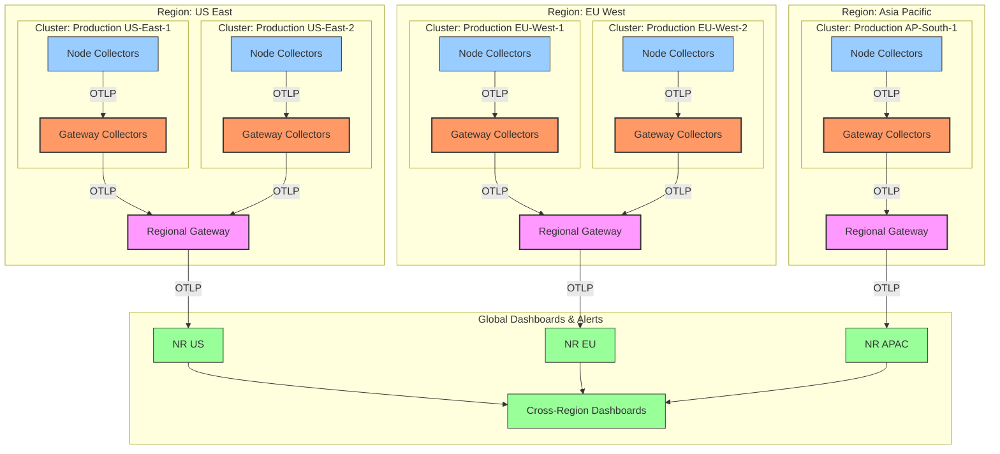
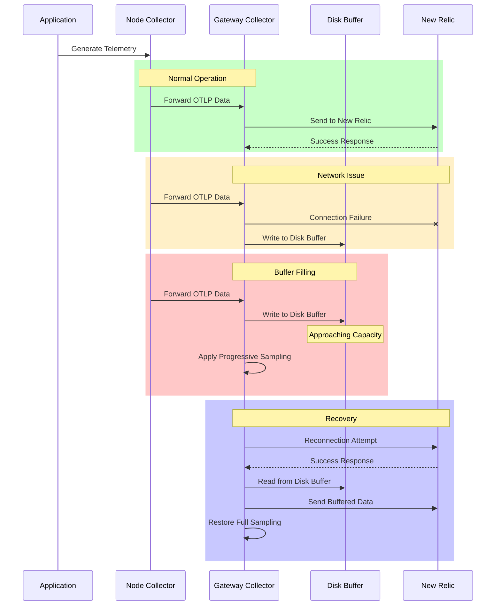

# Scalability & Tuning

## Overview

§ As Kubernetes deployments grow in size and complexity, scaling observability infrastructure becomes a critical challenge. This chapter explores advanced techniques for scaling and tuning the New Relic observability stack, with particular focus on OpenTelemetry collectors, agent deployments, and NRDB ingestion patterns. We'll examine real-world architectures that successfully monitor thousands of nodes while maintaining performance, reliability, and cost-efficiency.

§ The architectures and tuning parameters presented here address the key scalability challenges in enterprise Kubernetes environments: high-volume telemetry collection, efficient data routing, and optimal resource utilization. Whether you're operating a handful of clusters or a global fleet spanning multiple regions, these patterns provide a blueprint for scalable observability that grows with your infrastructure.

## Scaling Dimensions in Kubernetes Observability

§ When designing a scalable observability solution for Kubernetes, several dimensions of scale must be considered:

1. **Horizontal Scale**: Number of nodes, pods, and clusters
2. **Vertical Scale**: Depth and detail of telemetry per entity
3. **Geographic Scale**: Distribution across regions and data centers
4. **Organizational Scale**: Multiple teams, business units, and access patterns
5. **Temporal Scale**: Retention periods and historical analysis needs

### TB-29A: Scalability Factors and Considerations

| Scale Factor | Key Metrics | Scaling Challenges | Primary Bottlenecks |
|--------------|-------------|-------------------|---------------------|
| Cluster Size | Nodes per cluster | Agent deployment, control plane visibility | etcd performance, network saturation |
| Fleet Size | Total clusters | Configuration management, cross-cluster correlation | Management overhead, central visibility |
| Container Density | Pods per node | High-cardinality metrics, collection frequency | Memory pressure, CPU contention |
| Metric Volume | Metrics per second | Collector throughput, NRDB ingestion rates | Network bandwidth, processing capacity |
| Trace Volume | Spans per second | Sampling strategies, context propagation | Network bandwidth, storage costs |
| Log Volume | Log lines per second | Filtering, structured logging | Storage costs, indexing performance |
| Update Frequency | Deployment frequency | Configuration management, versioning | Deployment coordination, consistency |
| Query Patterns | Queries per minute | Query complexity, data organization | Query performance, dashboard load times |

## OpenTelemetry Collector Scaling Patterns

§ The OpenTelemetry Collector plays a central role in scalable observability architectures. Various deployment patterns offer different trade-offs between simplicity, performance, and resilience.

### DG-29A: Collector Deployment Patterns

```mermaid
graph TD
    subgraph "Pattern 1: Agent Per Node"
        N1[Node 1]
        N2[Node 2]
        N3[Node 3]
        C1[Collector 1]
        C2[Collector 2]
        C3[Collector 3]
        
        N1 --- C1
        N2 --- C2
        N3 --- C3
        
        C1 -->|OTLP| NR1[New Relic]
        C2 -->|OTLP| NR1
        C3 -->|OTLP| NR1
    end
    
    subgraph "Pattern 2: Sidecar Per Service"
        P1[Pod 1]
        P2[Pod 2]
        P3[Pod 3]
        CS1[Collector Sidecar 1]
        CS2[Collector Sidecar 2]
        CS3[Collector Sidecar 3]
        
        P1 --- CS1
        P2 --- CS2
        P3 --- CS3
        
        CS1 -->|OTLP| NR2[New Relic]
        CS2 -->|OTLP| NR2
        CS3 -->|OTLP| NR2
    end
    
    subgraph "Pattern 3: Gateway Deployment"
        P4[Pods...]
        P5[Pods...]
        P6[Pods...]
        
        P4 -->|OTLP| CG1[Gateway Collector 1]
        P5 -->|OTLP| CG1
        P6 -->|OTLP| CG1
        
        P4 -->|OTLP| CG2[Gateway Collector 2]
        P5 -->|OTLP| CG2
        P6 -->|OTLP| CG2
        
        CG1 -->|OTLP| NR3[New Relic]
        CG2 -->|OTLP| NR3
    end
    
    subgraph "Pattern 4: Hierarchical Deployment"
        N4[Node 1]
        N5[Node 2]
        N6[Node 3]
        
        CN1[Node Collector 1]
        CN2[Node Collector 2]
        CN3[Node Collector 3]
        
        AG[Aggregation Gateway]
        
        N4 --- CN1
        N5 --- CN2
        N6 --- CN3
        
        CN1 --> AG
        CN2 --> AG
        CN3 --> AG
        
        AG -->|OTLP| NR4[New Relic]
    end
    
    classDef node fill:#9ff,stroke:#333,stroke-width:1px
    classDef pod fill:#9cf,stroke:#333,stroke-width:1px
    classDef collector fill:#f96,stroke:#333,stroke-width:2px
    classDef gateway fill:#f9f,stroke:#333,stroke-width:2px
    
    class N1,N2,N3,N4,N5,N6 node
    class P1,P2,P3,P4,P5,P6 pod
    class C1,C2,C3,CS1,CS2,CS3,CN1,CN2,CN3 collector
    class CG1,CG2,AG gateway
```



### TB-29B: Collector Deployment Pattern Comparison

| Pattern | Pros | Cons | Best For |
|---------|------|------|----------|
| Agent Per Node | Local data processing, isolation, node-level visibility | Higher resource usage, management overhead | Large clusters, infrastructure-focused monitoring |
| Sidecar Per Service | Service isolation, workload-specific configurations | Resource overhead, proliferation of instances | Microservices, service-specific requirements |
| Gateway Deployment | Centralized management, efficient resource usage | Single point of failure, higher network traffic | Small-to-medium clusters, simpler deployments |
| Hierarchical Deployment | Optimized for scale, resilient, flexible processing | Complex setup, more components to manage | Large enterprises, multi-cluster, multi-region deployments |

### CF-29A: DaemonSet Collector Configuration

```yaml
# otel-collector-daemonset.yaml
apiVersion: apps/v1
kind: DaemonSet
metadata:
  name: otel-collector
  namespace: monitoring
  labels:
    app: opentelemetry
    component: collector
spec:
  selector:
    matchLabels:
      app: opentelemetry
      component: collector
  template:
    metadata:
      labels:
        app: opentelemetry
        component: collector
    spec:
      serviceAccountName: otel-collector
      hostNetwork: true  # Use host network for accessing node metrics
      dnsPolicy: ClusterFirstWithHostNet
      containers:
      - name: collector
        image: otel/opentelemetry-collector-contrib:0.85.0
        env:
          - name: K8S_NODE_NAME
            valueFrom:
              fieldRef:
                fieldPath: spec.nodeName
          - name: NR_LICENSE_KEY
            valueFrom:
              secretKeyRef:
                name: newrelic-license
                key: license
          - name: PIPELINE_TYPE
            value: "node"
        ports:
        - containerPort: 4317
          hostPort: 4317
          name: otlp-grpc
        - containerPort: 4318
          hostPort: 4318
          name: otlp-http
        - containerPort: 55679
          name: zpages
        resources:
          limits:
            cpu: 1000m
            memory: 2Gi
          requests:
            cpu: 200m
            memory: 400Mi
        volumeMounts:
        - name: config
          mountPath: /etc/otel/config.yaml
          subPath: config.yaml
        livenessProbe:
          httpGet:
            path: /
            port: 13133
          initialDelaySeconds: 10
          periodSeconds: 30
        readinessProbe:
          httpGet:
            path: /
            port: 13133
          initialDelaySeconds: 10
          periodSeconds: 30
      volumes:
      - name: config
        configMap:
          name: otel-collector-conf-node
          items:
          - key: config.yaml
            path: config.yaml
```

### CF-29B: Statefulset Gateway Collector Configuration

```yaml
# otel-collector-gateway.yaml
apiVersion: apps/v1
kind: StatefulSet
metadata:
  name: otel-collector-gateway
  namespace: monitoring
  labels:
    app: opentelemetry
    component: collector-gateway
spec:
  selector:
    matchLabels:
      app: opentelemetry
      component: collector-gateway
  serviceName: otel-collector-gateway
  replicas: 3  # Scale as needed
  podManagementPolicy: Parallel
  template:
    metadata:
      labels:
        app: opentelemetry
        component: collector-gateway
    spec:
      serviceAccountName: otel-collector
      affinity:
        podAntiAffinity:
          preferredDuringSchedulingIgnoredDuringExecution:
          - weight: 100
            podAffinityTerm:
              labelSelector:
                matchExpressions:
                - key: component
                  operator: In
                  values:
                  - collector-gateway
              topologyKey: kubernetes.io/hostname
      containers:
      - name: collector
        image: otel/opentelemetry-collector-contrib:0.85.0
        env:
          - name: PIPELINE_TYPE
            value: "gateway"
          - name: NR_LICENSE_KEY
            valueFrom:
              secretKeyRef:
                name: newrelic-license
                key: license
          - name: POD_NAME
            valueFrom:
              fieldRef:
                fieldPath: metadata.name
        ports:
        - containerPort: 4317
          name: otlp-grpc
        - containerPort: 4318
          name: otlp-http
        - containerPort: 55679
          name: zpages
        resources:
          limits:
            cpu: 2000m
            memory: 4Gi
          requests:
            cpu: 500m
            memory: 1Gi
        volumeMounts:
        - name: config
          mountPath: /etc/otel/config.yaml
          subPath: config.yaml
        - name: buffer-storage
          mountPath: /var/lib/otel
        livenessProbe:
          httpGet:
            path: /
            port: 13133
          initialDelaySeconds: 10
          periodSeconds: 30
        readinessProbe:
          httpGet:
            path: /
            port: 13133
          initialDelaySeconds: 10
          periodSeconds: 30
      volumes:
      - name: config
        configMap:
          name: otel-collector-conf-gateway
          items:
          - key: config.yaml
            path: config.yaml
  volumeClaimTemplates:
  - metadata:
      name: buffer-storage
    spec:
      accessModes: [ "ReadWriteOnce" ]
      resources:
        requests:
          storage: 10Gi
      storageClassName: standard
---
apiVersion: v1
kind: Service
metadata:
  name: otel-collector-gateway
  namespace: monitoring
  labels:
    app: opentelemetry
    component: collector-gateway
spec:
  type: ClusterIP
  selector:
    app: opentelemetry
    component: collector-gateway
  ports:
  - name: otlp-grpc
    port: 4317
    targetPort: 4317
  - name: otlp-http
    port: 4318
    targetPort: 4318
```

## Collector Performance Tuning

§ Optimizing collector performance requires careful tuning of various parameters based on workload characteristics and resource constraints.

### Queue Sizing and Backpressure

§ Properly configured queues are essential for handling telemetry bursts without data loss.

#### EQ-29A: Queue Size Formula

```
Optimal Queue Size = (Peak Ingest Rate × Max Processing Delay) + Buffer

Where:
- Peak Ingest Rate: Maximum expected telemetry items per second
- Max Processing Delay: Maximum acceptable processing delay in seconds
- Buffer: Additional capacity for unexpected spikes (typically 20-50%)
```

For example, with a peak rate of 100,000 items/sec and a max delay of 10 seconds:

```
Queue Size = (100,000 × 10) + (100,000 × 10 × 0.3)
          = 1,000,000 + 300,000
          = 1,300,000 items
```

#### EQ-29B: Memory Estimation Formula

```
Memory Required = Queue Size × Average Item Size × Memory Overhead Factor

Where:
- Queue Size: Calculated queue capacity in items
- Average Item Size: Typical size of a telemetry item in bytes
- Memory Overhead Factor: Additional memory for metadata (typically 1.2-1.5)
```

For example, with a queue size of 1,300,000 items and an average item size of 1KB:

```
Memory Required = 1,300,000 × 1KB × 1.3
                = 1,690,000 KB
                ≈ 1.7 GB
```

### CF-29C: Optimized Queue Configuration

```yaml
# optimized-queues.yaml
exporters:
  otlp/nr:
    endpoint: https://otlp.nr-data.net:4317
    headers:
      api-key: ${NR_LICENSE_KEY}
    sending_queue:
      enabled: true
      num_consumers: 10  # Parallel consumers
      queue_size: 10000  # Based on expected load
    retry_on_failure:
      enabled: true
      initial_interval: 5s
      max_interval: 30s
      max_elapsed_time: 300s

processors:
  batch:
    # Balance between latency and efficiency
    send_batch_size: 8192
    timeout: 5s
    send_batch_max_size: 16384
    
  # Memory protection
  memory_limiter:
    check_interval: 1s
    limit_percentage: 80
    spike_limit_percentage: 90
```

### TB-29C: Batch Processor Tuning Guidelines

| Metric Type | Batch Size | Timeout | Notes |
|-------------|------------|---------|-------|
| Metrics (normal) | 8,192 items | 5s | Balance between throughput and freshness |
| Metrics (high-volume) | 16,384 items | 10s | Optimize for throughput |
| Traces (normal) | 4,096 items | 5s | Balance between throughput and latency |
| Traces (high-volume) | 8,192 items | 10s | Consider tail sampling first |
| Logs (normal) | 1,024 items | 2s | Quick delivery for operational logs |
| Logs (high-volume) | 4,096 items | 5s | Apply filtering before batching |

### Worker Pool Optimization

§ Tuning worker pools is critical for maximizing throughput while maintaining stability.

#### TB-29D: Worker Pool Recommendations by Deployment Type

| Deployment Type | CPU Cores | Recommended Workers | Memory Per Worker | Notes |
|-----------------|-----------|---------------------|-------------------|-------|
| Node Agent | 0.5-1 core | 2-4 workers | 256-512 MB | Limited by node resources |
| Sidecar | 0.2-0.5 core | 1-2 workers | 128-256 MB | Keep lightweight |
| Gateway (small) | 1-2 cores | 4-8 workers | 512 MB | Shared resource |
| Gateway (medium) | 2-4 cores | 8-16 workers | 512-1024 MB | Dedicated resource |
| Gateway (large) | 4-8 cores | 16-32 workers | 1-2 GB | Horizontally scalable |

### Memory Management

§ Effective memory management prevents OOM conditions while maximizing throughput.

#### CF-29D: Advanced Memory Management Configuration

```yaml
# memory-management.yaml
extensions:
  health_check:
    endpoint: 0.0.0.0:13133
  memory_ballast:
    size_mib: 2048  # Allocate a 2GB ballast to stabilize GC
  
  # Extension to restart on OOM condition
  restart_check:
    interval: 30s
    memory_threshold_mib: 3800  # Restart if it reaches 3.8GB (out of 4GB limit)

processors:
  memory_limiter:
    check_interval: 1s
    limit_mib: 3800  # Hard limit to avoid OOM kills
    spike_limit_mib: 500  # Limit spikes to 500MB
    
    # Advanced settings
    limit_percentage: 80  # Percentage of total memory
    spike_limit_percentage: 15  # Percentage of total memory
```

## Multi-Cluster and Multi-Region Architectures

§ For enterprises with global infrastructure, multi-cluster and multi-region architectures provide scalability and reliability.

### DG-29B: Global Observability Architecture



### CF-29E: Regional Gateway Configuration

```yaml
# regional-gateway.yaml
receivers:
  otlp:
    protocols:
      grpc:
        endpoint: 0.0.0.0:4317
      http:
        endpoint: 0.0.0.0:4318
        cors:
          allowed_origins:
            - "*"

processors:
  batch:
    send_batch_size: 16384
    timeout: 10s
    
  memory_limiter:
    check_interval: 1s
    limit_mib: 7680
    spike_limit_mib: 1280

  # Add regional attribution
  resource:
    attributes:
      - action: insert
        key: region
        value: "us-east"
      - action: insert
        key: deployment.environment
        value: "production"
  
  # Handle temporary outages
  retry_on_failure:
    enabled: true
    initial_interval: 5s
    max_interval: 30s
    max_elapsed_time: 300s

exporters:
  otlp/newrelic:
    endpoint: https://otlp.nr-data.net:4317
    headers:
      api-key: ${NR_LICENSE_KEY}
    retry_on_failure:
      enabled: true
      initial_interval: 5s
      max_interval: 30s
      max_elapsed_time: 300s
    sending_queue:
      enabled: true
      num_consumers: 10
      queue_size: 10000
  
  # Persistent storage for outage recovery
  file/backupdata:
    path: /data/backup/
    rotation:
      max_megabytes: 100
      max_age: 24h
      max_backups: 3
    timeout: 10s

service:
  pipelines:
    traces:
      receivers: [otlp]
      processors: [memory_limiter, resource, batch]
      exporters: [otlp/newrelic, file/backupdata]
    metrics:
      receivers: [otlp]
      processors: [memory_limiter, resource, batch]
      exporters: [otlp/newrelic, file/backupdata]
    logs:
      receivers: [otlp]
      processors: [memory_limiter, resource, batch]
      exporters: [otlp/newrelic, file/backupdata]
```

### Cross-Region Consistency

§ For global deployments, maintaining consistent configuration across regions is essential.

#### CF-29F: GitOps-Based Configuration Management

```yaml
# fleet.yaml (using ArgoCD or Fleet)
apiVersion: fleet.cattle.io/v1alpha1
kind: GitRepo
metadata:
  name: otel-collector-config
  namespace: fleet-system
spec:
  repo: https://github.com/organization/otel-configs
  branch: main
  paths:
    - collectors
  targets:
    - name: us-east
      clusterSelector:
        matchLabels:
          region: us-east
      yaml:
        overlays:
          - files:
              - base/collectors/values.yaml
              - overlays/us-east/values.yaml
    
    - name: eu-west
      clusterSelector:
        matchLabels:
          region: eu-west
      yaml:
        overlays:
          - files:
              - base/collectors/values.yaml
              - overlays/eu-west/values.yaml
    
    - name: ap-south
      clusterSelector:
        matchLabels:
          region: ap-south
      yaml:
        overlays:
          - files:
              - base/collectors/values.yaml
              - overlays/ap-south/values.yaml
```

## Automated Scaling and Elasticity

§ For environments with variable workloads, automated scaling provides elasticity.

### CF-29G: Horizontal Pod Autoscaler Configuration

```yaml
# otel-collector-hpa.yaml
apiVersion: autoscaling/v2
kind: HorizontalPodAutoscaler
metadata:
  name: otel-collector-gateway
  namespace: monitoring
spec:
  scaleTargetRef:
    apiVersion: apps/v1
    kind: Deployment
    name: otel-collector-gateway
  minReplicas: 3
  maxReplicas: 10
  metrics:
  - type: Resource
    resource:
      name: cpu
      target:
        type: Utilization
        averageUtilization: 70
  - type: Resource
    resource:
      name: memory
      target:
        type: Utilization
        averageUtilization: 75
  behavior:
    scaleUp:
      stabilizationWindowSeconds: 60
      policies:
      - type: Percent
        value: 100
        periodSeconds: 60
    scaleDown:
      stabilizationWindowSeconds: 300
      policies:
      - type: Percent
        value: 10
        periodSeconds: 120
```

### CF-29H: Custom Metrics Autoscaler

```yaml
# custom-metrics-hpa.yaml
apiVersion: autoscaling/v2
kind: HorizontalPodAutoscaler
metadata:
  name: otel-collector-gateway
  namespace: monitoring
spec:
  scaleTargetRef:
    apiVersion: apps/v1
    kind: Deployment
    name: otel-collector-gateway
  minReplicas: 3
  maxReplicas: 15
  metrics:
  - type: Pods
    pods:
      metric:
        name: otel_collector_queue_size
      target:
        type: AverageValue
        averageValue: 8000
  - type: Pods
    pods:
      metric:
        name: otel_collector_processor_batch_timeout_count
      target:
        type: AverageValue
        averageValue: 10
  behavior:
    scaleUp:
      stabilizationWindowSeconds: 30
      policies:
      - type: Pods
        value: 2
        periodSeconds: 60
      - type: Percent
        value: 50
        periodSeconds: 60
      selectPolicy: Max
    scaleDown:
      stabilizationWindowSeconds: 300
      policies:
      - type: Percent
        value: 10
        periodSeconds: 300
```

## Load Shedding and Circuit Breaking

§ To maintain system stability under extreme load, load shedding and circuit breaking mechanisms are essential.

### CF-29I: Load Shedding Configuration

```yaml
# load-shedding.yaml
processors:
  # Primary defense: Memory limiter
  memory_limiter:
    check_interval: 1s
    limit_percentage: 80
    spike_limit_percentage: 90
    
  # Secondary defense: Probabilistic sampler with dynamic rate
  probabilistic_sampler:
    hash_seed: 42
    sampling_percentage: ${env:SAMPLING_RATE}
  
  # Circuit breaking for specific endpoints
  filter/circuit_breaker:
    metrics:
      include:
        match_type: strict
        expressions:
          - IsMatch(IsHealthy(), "true") # Custom function checking health status

  # Rate limiting for specific high-volume sources
  rate_limiter:
    spans_per_second: 1000
    metrics_per_second: 10000
    logs_per_second: 5000
```

### CF-29J: Dynamic Sampling Rate Script

```python
#!/usr/bin/env python3
# dynamic-sampling.py - Adjust sampling rate based on collector health
import os
import time
import requests
import json
import subprocess

# Configuration
COLLECTOR_METRICS_URL = "http://localhost:8888/metrics"
CONFIG_FILE = "/etc/otel/config.yaml"
DEFAULT_SAMPLING_RATE = 100.0  # 100% sampling by default
MIN_SAMPLING_RATE = 5.0  # Never go below 5% sampling
CHECK_INTERVAL = 30  # seconds

def get_collector_metrics():
    """Fetch metrics from the collector's own telemetry endpoint"""
    try:
        response = requests.get(COLLECTOR_METRICS_URL)
        if response.status_code == 200:
            return response.text
        else:
            print(f"Error fetching metrics: HTTP {response.status_code}")
            return None
    except Exception as e:
        print(f"Exception fetching metrics: {e}")
        return None

def parse_memory_usage(metrics_text):
    """Extract memory usage percentage from metrics"""
    if not metrics_text:
        return None
    
    # Look for runtime memory metrics
    for line in metrics_text.split('\n'):
        if 'process_runtime_heap_alloc_bytes' in line and not line.startswith('#'):
            parts = line.split()
            if len(parts) >= 2:
                try:
                    allocated_bytes = float(parts[1])
                    # Assume 4GB limit for calculation
                    return (allocated_bytes / (4 * 1024 * 1024 * 1024)) * 100
                except ValueError:
                    pass
    
    return None

def parse_queue_size(metrics_text):
    """Extract queue size from metrics"""
    if not metrics_text:
        return None
    
    for line in metrics_text.split('\n'):
        if 'otelcol_exporter_queue_size' in line and not line.startswith('#'):
            parts = line.split()
            if len(parts) >= 2:
                try:
                    return float(parts[1])
                except ValueError:
                    pass
    
    return None

def calculate_sampling_rate(memory_usage, queue_size):
    """Calculate appropriate sampling rate based on metrics"""
    if memory_usage is None or queue_size is None:
        return DEFAULT_SAMPLING_RATE
    
    # Start reducing sampling at 70% memory usage
    if memory_usage > 90:
        return MIN_SAMPLING_RATE
    elif memory_usage > 85:
        return 10.0
    elif memory_usage > 80:
        return 25.0
    elif memory_usage > 75:
        return 50.0
    elif memory_usage > 70:
        return 75.0
    else:
        return DEFAULT_SAMPLING_RATE

def update_sampling_rate(new_rate):
    """Update the environment variable controlling sampling rate"""
    os.environ["SAMPLING_RATE"] = str(new_rate)
    
    # For a simple implementation, we can just set the env var and restart
    # In a production setting, you'd want to use an API or config reload
    print(f"Updating sampling rate to {new_rate}%")
    
    # Signal the collector to reload its configuration
    try:
        subprocess.run(["kill", "-HUP", "1"], check=True)
        print("Sent SIGHUP to collector process")
    except subprocess.CalledProcessError as e:
        print(f"Failed to signal collector: {e}")

def main():
    """Main control loop"""
    print("Starting dynamic sampling rate controller")
    
    last_sampling_rate = DEFAULT_SAMPLING_RATE
    
    while True:
        metrics_text = get_collector_metrics()
        memory_usage = parse_memory_usage(metrics_text)
        queue_size = parse_queue_size(metrics_text)
        
        if memory_usage is not None:
            print(f"Current memory usage: {memory_usage:.1f}%")
        
        if queue_size is not None:
            print(f"Current queue size: {queue_size:.0f}")
        
        new_sampling_rate = calculate_sampling_rate(memory_usage, queue_size)
        
        # Only update if the rate has changed significantly
        if abs(new_sampling_rate - last_sampling_rate) >= 5.0:
            update_sampling_rate(new_sampling_rate)
            last_sampling_rate = new_sampling_rate
        
        time.sleep(CHECK_INTERVAL)

if __name__ == "__main__":
    main()
```

## Scaling and Performance Benchmarks

§ Benchmarking provides essential insight into scaling capabilities and performance characteristics.

### TB-29E: Collector Throughput Benchmarks

| Deployment Type | CPU | Memory | Metrics/s | Spans/s | Logs/s | Max Nodes | Notes |
|-----------------|-----|--------|----------|---------|--------|-----------|-------|
| Node Agent | 0.5 | 1 GB | 15,000 | 5,000 | 10,000 | 1 | Per-node deployment |
| Gateway (small) | 2 | 4 GB | 150,000 | 50,000 | 100,000 | 50 | Entry level gateway |
| Gateway (medium) | 4 | 8 GB | 400,000 | 120,000 | 250,000 | 100 | Mid-size cluster |
| Gateway (large) | 8 | 16 GB | 1,000,000 | 300,000 | 600,000 | 250 | Large cluster |
| Regional Gateway | 16 | 32 GB | 3,000,000 | 800,000 | 1,500,000 | 1,000 | Multi-cluster deployment |

### TB-29F: OTel Collector vs. Native Agent Performance

| Metric | New Relic Agent | OTel Collector | Notes |
|--------|-----------------|----------------|-------|
| CPU Usage | 50-100m | 100-200m | OTel higher due to more features |
| Memory Usage | 100-200 MB | 200-500 MB | OTel uses more memory for processing |
| Startup Time | 1-3s | 3-8s | OTel loads more components |
| Max Throughput | 50K items/s | 200K items/s | OTel scales better at high volumes |
| Kubernetes Integration | Built-in | Requires configuration | Agent has simpler setup |
| Configuration Flexibility | Limited | Highly configurable | OTel offers more control |
| Feature Set | Focused | Comprehensive | OTel supports more protocols |

## Fault Tolerance and Resilience 

§ A reliable observability stack must continue functioning even during partial failures.

### DG-29C: Resilience Architecture



### CF-29K: Resilient Collector Configuration

```yaml
# resilient-collector.yaml
receivers:
  otlp:
    protocols:
      grpc:
        endpoint: 0.0.0.0:4317
      http:
        endpoint: 0.0.0.0:4318

processors:
  batch:
    send_batch_size: 8192
    timeout: 10s
  
  # Resilience processors
  memory_limiter:
    check_interval: 1s
    limit_percentage: 80
    spike_limit_percentage: 90
  
  resource:
    attributes:
      - action: insert
        key: service.instance.id
        value: ${env:HOSTNAME}
      - action: insert
        key: deployment.environment
        value: ${env:ENVIRONMENT}

exporters:
  otlp:
    endpoint: ${env:OTLP_ENDPOINT}
    headers:
      api-key: ${env:NR_LICENSE_KEY}
    retry_on_failure:
      enabled: true
      initial_interval: 5s
      max_interval: 30s
      max_elapsed_time: 300s
    sending_queue:
      enabled: true
      num_consumers: 10
      queue_size: 5000
  
  # Backup storage for disaster recovery
  file:
    path: /var/lib/otel/backup/telemetry.json
    rotation:
      max_megabytes: 500
      max_age: 12h
      max_backups: 3

extensions:
  health_check:
    endpoint: 0.0.0.0:13133
  
  pprof:
    endpoint: 0.0.0.0:1777
  
  zpages:
    endpoint: 0.0.0.0:55679

service:
  extensions: [health_check, pprof, zpages]
  
  telemetry:
    logs:
      level: info
    metrics:
      address: 0.0.0.0:8888
  
  # Fault-tolerant pipelines with backup
  pipelines:
    metrics:
      receivers: [otlp]
      processors: [memory_limiter, resource, batch]
      exporters: [otlp, file]
    
    traces:
      receivers: [otlp]
      processors: [memory_limiter, resource, batch]
      exporters: [otlp, file]
    
    logs:
      receivers: [otlp]
      processors: [memory_limiter, resource, batch]
      exporters: [otlp, file]
```

## Operating Large-Scale Deployments

§ Day-to-day operation of large-scale observability deployments requires specialized tools and processes.

### RB-29A: Collector Scaling Runbook

```
# Collector Scaling Runbook

## Scaling Indicators

1. **CPU Saturation**
   - Alert: "OTel Collector CPU usage > 80% for 10 minutes"
   - Alert: "OTel Collector CPU throttling events > 10 per minute"

2. **Memory Pressure**
   - Alert: "OTel Collector memory usage > 85% for 5 minutes"
   - Alert: "OTel memory_limiter triggered > 5 times per hour"

3. **Queue Backpressure**
   - Alert: "OTel queue utilization > 80% for 5 minutes"
   - Alert: "OTel batch timeout events > 50 per minute"

4. **Data Loss Risk**
   - Alert: "OTel dropped data points > 0 in 5 minutes"
   - Alert: "OTel exporter failures > 10 per minute"

## Investigation Steps

1. **Assess Load Pattern**
   - Check if load increase is temporary or sustained
   - Verify if load is evenly distributed or localized to specific nodes
   - Command: `kubectl top pods -n monitoring -l app=opentelemetry`

2. **Identify Bottlenecks**
   - Check CPU and memory utilization
   - Command: `kubectl describe pod -n monitoring {collector-pod-name}`
   - Check for throttling or OOM events
   - Command: `kubectl logs -n monitoring {collector-pod-name} | grep -i "memory limit\|throttled"`

3. **Review Telemetry Patterns**
   - Analyze collector's self-metrics
   - Query: `FROM Metric SELECT average(otelcol_processor_batch_batch_size_trigger_send) FACET collector_name TIMESERIES`
   - Query: `FROM Metric SELECT average(otelcol_exporter_queue_size) FACET collector_name TIMESERIES`

## Scaling Actions

### Vertical Scaling
1. **Increase Resource Allocation**
   - Update CPU request/limit:
     ```
     kubectl patch deployment -n monitoring otel-collector-gateway -p \
       '{"spec":{"template":{"spec":{"containers":[{"name":"collector","resources":{"limits":{"cpu":"4"},"requests":{"cpu":"2"}}}]}}}}'
     ```
   - Update memory request/limit:
     ```
     kubectl patch deployment -n monitoring otel-collector-gateway -p \
       '{"spec":{"template":{"spec":{"containers":[{"name":"collector","resources":{"limits":{"memory":"8Gi"},"requests":{"memory":"4Gi"}}}]}}}}'
     ```

2. **Tune Batch Sizes**
   - Update ConfigMap with larger batch sizes
   - Command: `kubectl edit cm -n monitoring otel-collector-conf`
   - Change: `send_batch_size: 8192` → `send_batch_size: 16384`
   - Reload configuration: `kubectl rollout restart deployment -n monitoring otel-collector-gateway`

### Horizontal Scaling
1. **Scale Replica Count**
   - Command: `kubectl scale deployment -n monitoring otel-collector-gateway --replicas=5`

2. **Adjust Autoscaling**
   - Update HPA settings:
     ```
     kubectl patch hpa -n monitoring otel-collector-gateway -p \
       '{"spec":{"minReplicas":5,"maxReplicas":10,"targetCPUUtilizationPercentage":70}}'
     ```

3. **Implement Sharding** (for very large deployments)
   - Deploy additional collector instances with specialized configs
   - Use routing processor to split traffic by data type or source

### Emergency Actions
1. **Apply Temporary Sampling**
   - Update ConfigMap to add probabilistic sampler at reduced rate (e.g., 50%)
   - Command: `kubectl edit cm -n monitoring otel-collector-conf`

2. **Filter Non-Critical Data**
   - Update ConfigMap to exclude non-essential metrics/spans
   - Example: Filter debug logs, detailed runtime metrics

3. **Increase Queue Sizes**
   - Update sending_queue config to handle larger bursts
   - Increase queue_size and num_consumers

## Validation Steps
1. **Verify Resource Usage**
   - Command: `kubectl top pods -n monitoring -l app=opentelemetry`
   - Expect: CPU utilization < 70%, Memory utilization < 75%

2. **Check Error Rates**
   - Command: `kubectl logs -n monitoring {collector-pod-name} | grep -i "error\|dropped"`
   - Expect: No data dropping or pipeline errors

3. **Confirm Data Flow**
   - Query: `FROM Metric SELECT count(*) WHERE instrumentation.provider = 'opentelemetry' TIMESERIES`
   - Expect: Consistent data volume without drops
```

### CF-29L: Automated Horizontal Scaling Script

```python
#!/usr/bin/env python3
# autoscale-collectors.py - Dynamically adjust collector scaling based on load
import subprocess
import json
import time
import os
import requests
import yaml

# Configuration
NAMESPACE = "monitoring"
DEPLOYMENT = "otel-collector-gateway"
MIN_REPLICAS = 3
MAX_REPLICAS = 15
TARGET_CPU = 70
CHECK_INTERVAL = 60  # seconds
NR_API_KEY = os.environ.get("NEW_RELIC_API_KEY")
NR_ACCOUNT_ID = os.environ.get("NEW_RELIC_ACCOUNT_ID")

def get_current_metrics():
    """Get current CPU and memory usage for collector pods"""
    cmd = ["kubectl", "top", "pods", "-n", NAMESPACE, 
           "--selector=app=opentelemetry,component=collector-gateway", 
           "--use-protocol-buffers", "-o", "json"]
    
    try:
        result = subprocess.run(cmd, capture_output=True, text=True, check=True)
        data = json.loads(result.stdout)
        
        total_cpu = 0
        total_memory = 0
        pod_count = 0
        
        for pod in data["items"]:
            total_cpu += int(pod["cpu"].rstrip("m"))
            
            # Convert memory to MiB
            mem = pod["memory"]
            if mem.endswith("Mi"):
                total_memory += int(mem.rstrip("Mi"))
            elif mem.endswith("Gi"):
                total_memory += int(float(mem.rstrip("Gi")) * 1024)
            elif mem.endswith("Ki"):
                total_memory += int(mem.rstrip("Ki")) / 1024
            
            pod_count += 1
        
        if pod_count == 0:
            return None, None, 0
        
        avg_cpu = total_cpu / pod_count
        avg_memory = total_memory / pod_count
        
        return avg_cpu, avg_memory, pod_count
    except subprocess.CalledProcessError as e:
        print(f"Error getting metrics: {e}")
        return None, None, 0
    except json.JSONDecodeError as e:
        print(f"Error parsing JSON: {e}")
        return None, None, 0

def get_nr_queue_metrics():
    """Get queue metrics from New Relic"""
    query = """
    FROM Metric SELECT average(otelcol_exporter_queue_size) 
    WHERE instrumentation.provider = 'opentelemetry' 
    AND service.name = 'otel-collector-gateway'
    SINCE 5 minutes ago
    """
    
    headers = {
        "Content-Type": "application/json",
        "Api-Key": NR_API_KEY
    }
    
    try:
        response = requests.post(
            f"https://api.newrelic.com/v2/accounts/{NR_ACCOUNT_ID}/query",
            headers=headers,
            json={"query": query}
        )
        
        if response.status_code == 200:
            data = response.json()
            if "results" in data and len(data["results"]) > 0:
                return data["results"][0]["average"]
    except Exception as e:
        print(f"Error getting NR metrics: {e}")
    
    return None

def get_current_replicas():
    """Get current replica count for the deployment"""
    cmd = ["kubectl", "get", "deployment", "-n", NAMESPACE, DEPLOYMENT, 
           "-o", "jsonpath='{.spec.replicas}'"]
    
    try:
        result = subprocess.run(cmd, capture_output=True, text=True, check=True)
        return int(result.stdout.strip("'"))
    except Exception as e:
        print(f"Error getting current replicas: {e}")
        return None

def scale_deployment(replicas):
    """Scale the deployment to the specified number of replicas"""
    cmd = ["kubectl", "scale", "deployment", "-n", NAMESPACE, DEPLOYMENT, 
           f"--replicas={replicas}"]
    
    try:
        result = subprocess.run(cmd, capture_output=True, text=True, check=True)
        print(f"Scaled deployment to {replicas} replicas: {result.stdout}")
        return True
    except Exception as e:
        print(f"Error scaling deployment: {e}")
        return False

def calculate_desired_replicas(current_replicas, avg_cpu, avg_memory, queue_size):
    """Calculate desired replica count based on metrics"""
    if current_replicas is None or avg_cpu is None:
        return current_replicas
    
    # Start with CPU-based scaling
    cpu_desired = current_replicas * (avg_cpu / TARGET_CPU)
    
    # Factor in queue size if available
    if queue_size is not None:
        queue_factor = 1.0
        if queue_size > 8000:
            queue_factor = 1.5
        elif queue_size > 5000:
            queue_factor = 1.2
        
        cpu_desired *= queue_factor
    
    # Round to nearest whole number
    desired = round(cpu_desired)
    
    # Clamp to min/max values
    desired = max(MIN_REPLICAS, min(MAX_REPLICAS, desired))
    
    return desired

def main():
    """Main control loop"""
    print(f"Starting auto-scaler for {NAMESPACE}/{DEPLOYMENT}")
    
    while True:
        # Get current metrics
        avg_cpu, avg_memory, pod_count = get_current_metrics()
        queue_size = get_nr_queue_metrics()
        current_replicas = get_current_replicas()
        
        print(f"Current status: {pod_count} pods, {avg_cpu:.1f}m CPU, {avg_memory:.1f}Mi memory")
        if queue_size is not None:
            print(f"Queue size: {queue_size:.1f}")
        
        # Calculate desired replicas
        if current_replicas is not None and avg_cpu is not None:
            desired_replicas = calculate_desired_replicas(
                current_replicas, avg_cpu, avg_memory, queue_size)
            
            # Scale if needed
            if desired_replicas != current_replicas:
                print(f"Scaling from {current_replicas} to {desired_replicas} replicas")
                scale_deployment(desired_replicas)
            else:
                print(f"No scaling needed, maintaining {current_replicas} replicas")
        
        time.sleep(CHECK_INTERVAL)

if __name__ == "__main__":
    main()
```

## Monitoring the Monitors

§ Observing your observability stack is essential for reliability and performance optimization.

### TB-29G: Key Metrics for Monitoring Collectors

| Metric Category | Key Metrics | Recommended Alert Thresholds | Notes |
|-----------------|------------|----------------------------|-------|
| Resource Usage | CPU usage, memory usage | >80% sustained, >90% spike | Primary scaling indicators |
| Queue Health | Queue size, queue age | >80% capacity, >5s queue time | Early warning for backpressure |
| Processing | Batch size, batch timeouts | >50% timeouts, <50% batch fill | Indicates processing bottlenecks |
| Data Loss | Dropped records, send failures | Any dropped data, >1% failure rate | Critical to alert on any data loss |
| Latency | Export latency, processing time | >500ms export, >100ms processing | Impact on data freshness |
| Throughput | Records received/sec, sent/sec | Sustained delta between in/out | Indicates processing lag |
| Errors | Export errors, parsing errors | >0.1% error rate | Check for configuration or connectivity issues |

### CF-29M: Collector Monitoring Dashboard Query

```nrql
# Overview dashboard queries

# CPU Usage by Collector
FROM Metric SELECT average(cpu.utilization) 
WHERE service.name LIKE 'otel-collector%' 
FACET service.name, service.instance.id 
TIMESERIES AUTO

# Memory Usage by Collector
FROM Metric SELECT average(memory.utilization) 
WHERE service.name LIKE 'otel-collector%' 
FACET service.name, service.instance.id 
TIMESERIES AUTO

# Collector Queue Size
FROM Metric SELECT average(otelcol_exporter_queue_size) 
WHERE instrumentation.provider = 'opentelemetry' 
FACET service.name 
TIMESERIES AUTO

# Batch Size Distribution
FROM Metric SELECT histogram(otelcol_processor_batch_batch_size_trigger_send, 10) 
WHERE instrumentation.provider = 'opentelemetry' 
FACET service.name

# Collector Throughput
FROM Metric SELECT sum(otelcol_receiver_accepted_metric_points) AS 'Metrics Received', 
sum(otelcol_exporter_sent_metric_points) AS 'Metrics Sent' 
WHERE instrumentation.provider = 'opentelemetry' 
TIMESERIES AUTO

# Error Rates
FROM Metric SELECT count(otelcol_exporter_enqueue_failed_metric_points) AS 'Failed Enqueues', 
count(otelcol_exporter_send_failed_metric_points) AS 'Failed Sends' 
WHERE instrumentation.provider = 'opentelemetry' 
FACET service.name 
TIMESERIES AUTO

# Export Latency
FROM Metric SELECT average(otelcol_exporter_send_latency) 
WHERE instrumentation.provider = 'opentelemetry' 
FACET service.name 
TIMESERIES AUTO

# Collector Health Status
FROM Metric SELECT latest(up) 
WHERE service.name LIKE 'otel-collector%' 
AND instrumentation.provider = 'prometheus' 
FACET service.name, service.instance.id
```

## Conclusion

§ Scaling observability for Kubernetes requires thoughtful architecture, continuous tuning, and operational discipline. The patterns and configurations presented in this chapter provide a framework for building observability systems that scale from single clusters to global fleets. By understanding the performance characteristics of each component and applying the appropriate scaling techniques, organizations can achieve reliable, cost-effective monitoring of even the largest Kubernetes deployments.

§ As Kubernetes environments continue to grow in size and complexity, the approaches to scaling observability must evolve as well. The hierarchical collector model, with appropriate resource tuning and automated scaling, provides a flexible foundation that can adapt to changing requirements. By implementing these patterns with New Relic as the telemetry backend, teams can ensure their observability stack keeps pace with their infrastructure, providing the insights needed for effective operations at any scale.

---

**Next Chapter**: [Hybrid Architectures & Migration Journey](../05_Hybrid_Architectures/README.md)