# Migration Journeys to New Relic

## Executive Summary

Migrating observability platforms is a complex undertaking that extends beyond technical implementation to encompass organizational change management, cost analysis, and capability migration. This chapter presents proven migration patterns and implementation strategies specifically designed for organizations transitioning from legacy or alternative monitoring solutions to a New Relic-based observability platform. Rather than advocating for an immediate "lift and shift" approach, we explore methodical, phased migration journeys that minimize risk while maximizing early value realization.

Organizations face numerous challenges when migrating observability systems: maintaining operational visibility during transition, transferring historical data and baselines, retraining teams, and rebuilding dashboards and alerting rules. Each domain presents unique migration considerations for Kubernetes environments. This chapter provides practical guidance, migration patterns, and readiness assessment frameworks to navigate these challenges successfully. We examine real-world migration scenarios from various monitoring platforms to New Relic with specific focus on infrastructure and Kubernetes observability.

## Migration Journey Models

Successful migrations typically follow one of several proven journey models, each suited to different organizational contexts and risk tolerances:

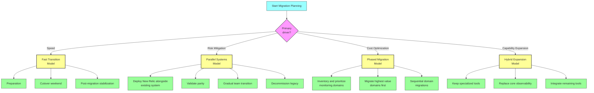

### Fast Transition Model

The Fast Transition Model is applicable when quick migration is the primary goal, often driven by imminent license renewals, vendor dissatisfaction, or major infrastructure changes.

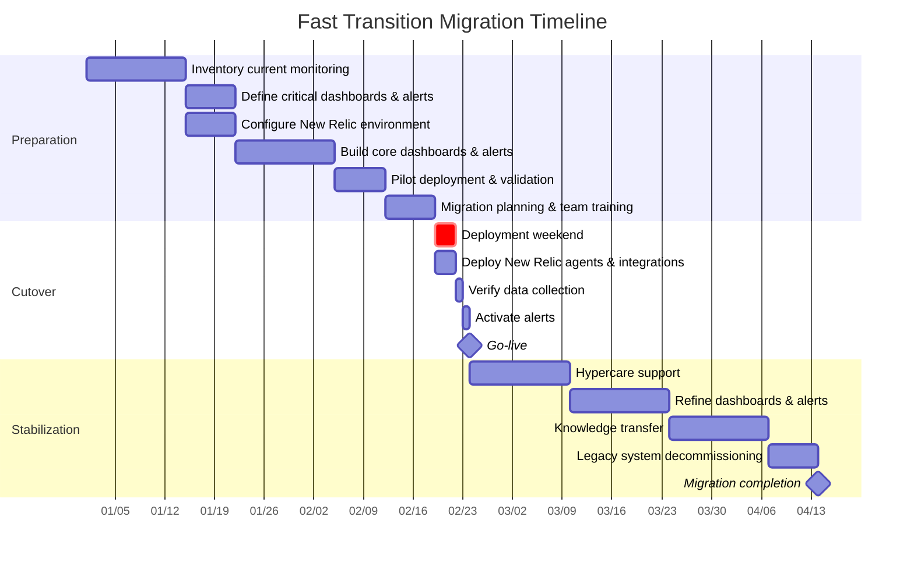

#### Fast Transition Checklist

| Phase | Key Activities | Success Criteria | Risk Mitigations |
|-------|---------------|------------------|------------------|
| **Preparation** | • Inventory current monitoring<br>• Identify critical dashboards<br>• Document alert thresholds<br>• Define migration success criteria | • Complete inventory of monitoring assets<br>• Prioritized dashboard migration list<br>• Executive approval of cutover plan | • Pre-build all critical dashboards<br>• Create test environments<br>• Identify rollback triggers and process |
| **Cutover** | • Deploy agents & integrations<br>• Verify data collection<br>• Activate alerts<br>• Update runbooks | • All critical services reporting data<br>• Alert verification tests passed<br>• On-call teams confident in new system | • Extended change window<br>• 24/7 vendor support engagement<br>• Parallel monitoring during cutover |
| **Stabilization** | • Hypercare support<br>• Dashboard refinement<br>• Knowledge transfer<br>• Legacy system decommissioning | • False positive rate at acceptable level<br>• Teams using New Relic for troubleshooting<br>• Legacy system safely decommissioned | • Delay legacy decommissioning<br>• Targeted training sessions<br>• Daily health check meetings |

#### When to Use Fast Transition

The Fast Transition model is ideal when:
- Existing monitoring contracts are expiring imminently
- Current monitoring is severely underperforming
- Organizational change windows align with migration timing
- Team capacity allows for intensive preparation and cutover
- Risk tolerance allows for potential short-term disruption

### Parallel Systems Model

The Parallel Systems Model minimizes risk by running both monitoring systems simultaneously for an extended period, allowing gradual migration and validation.

```mermaid
graph TD
    subgraph "Phase 1: Deployment & Validation"
        P1A[Deploy New Relic<br>Infrastructure]
        P1B[Deploy APM &<br>Integrations]
        P1C[Basic Dashboard<br>Creation]
        P1D[Validation against<br>Existing System]
        
        P1A --> P1B
        P1B --> P1C
        P1C --> P1D
    end
    
    subgraph "Phase 2: Team Transition"
        P2A[Recreate Critical<br>Dashboards]
        P2B[Implement Alerting<br>Rules]
        P2C[Team Training]
        P2D[Dual Monitoring<br>Period]
        
        P2A --> P2B
        P2B --> P2C
        P2C --> P2D
    end
    
    subgraph "Phase 3: Legacy Reduction"
        P3A[Shift Primary<br>Monitoring]
        P3B[Reduce Legacy<br>System Scope]
        P3C[Transfer Historical<br>Data if Needed]
        P3D[Maintain Critical<br>Legacy Components]
        
        P3A --> P3B
        P3B --> P3C
        P3C --> P3D
    end
    
    subgraph "Phase 4: Decommissioning"
        P4A[Final Validation<br>Period]
        P4B[Legacy System<br>Decommissioning]
        P4C[Cross-Team<br>Knowledge Sharing]
        P4D[Optimization<br>Phase]
        
        P4A --> P4B
        P4B --> P4C
        P4C --> P4D
    end
    
    P1D --> P2A
    P2D --> P3A
    P3D --> P4A
    
    classDef phase1 fill:#9ff,stroke:#333,stroke-width:1px
    classDef phase2 fill:#ff9,stroke:#333,stroke-width:1px
    classDef phase3 fill:#f9f,stroke:#333,stroke-width:1px
    classDef phase4 fill:#9f9,stroke:#333,stroke-width:1px
    
    class P1A,P1B,P1C,P1D phase1
    class P2A,P2B,P2C,P2D phase2
    class P3A,P3B,P3C,P3D phase3
    class P4A,P4B,P4C,P4D phase4
```

#### Parallel Systems Transition Timeline

| Phase | Duration | Key Activities | Success Metrics |
|-------|----------|---------------|-----------------|
| **Deployment & Validation** | 1-2 months | • Deploy New Relic agents & integrations<br>• Create basic dashboards<br>• Validate data collection accuracy<br>• Test basic alerting | • Data validation complete<br>• 100% coverage of critical systems<br>• Basic dashboards operational<br>• Key metrics validated against legacy |
| **Team Transition** | 2-3 months | • Recreate critical dashboards<br>• Implement complete alerting<br>• Train teams on New Relic<br>• Begin using New Relic for troubleshooting | • Teams actively using New Relic<br>• Critical dashboard parity achieved<br>• Alert configuration complete<br>• Initial positive feedback from teams |
| **Legacy Reduction** | 1-2 months | • Make New Relic primary monitoring system<br>• Reduce legacy system scope<br>• Transfer/reference historical data<br>• Maintain only critical legacy components | • >75% of teams using New Relic as primary<br>• Legacy system scope reduction plan approved<br>• Historical data access strategy implemented |
| **Decommissioning** | 1-2 months | • Final legacy validation<br>• Legacy system decommissioning<br>• Knowledge sharing across teams<br>• New Relic optimization initiatives | • Legacy system safely decommissioned<br>• Cost savings realized<br>• User satisfaction metrics positive<br>• Optimization initiatives identified |

#### When to Use Parallel Systems

The Parallel Systems model is ideal when:
- Risk mitigation is a primary concern
- Current monitoring is critical to operations
- Teams need time to adapt and build confidence
- Legacy contracts allow for extended parallel operation
- Historical data retention is important

### Phased Migration Model

The Phased Migration Model segments the migration by monitoring domain (infrastructure, APM, logs, etc.), allowing for prioritization of high-value components and incremental learning.

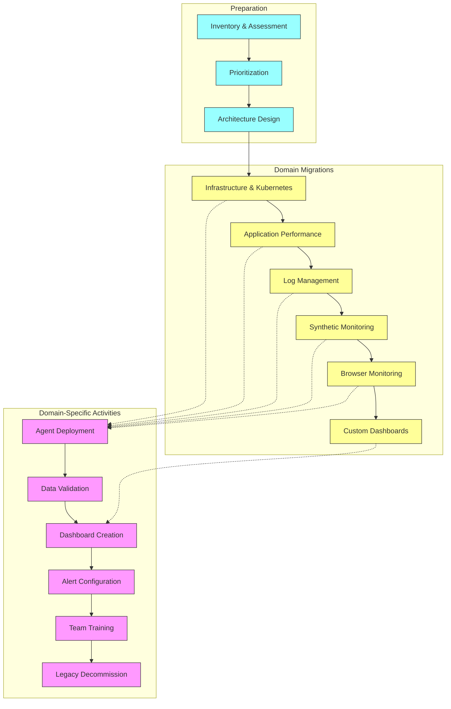

#### Domain Prioritization Matrix for Kubernetes Environments

| Domain | Migration Complexity | Value Delivery | Typical Sequence | Key Dependencies |
|--------|---------------------|----------------|------------------|------------------|
| **Infrastructure & Kubernetes** | Medium | Very High | First | None - typical starting point |
| **Application Performance** | Medium-High | High | Second | Infrastructure monitoring for context |
| **Log Management** | Medium | Medium-High | Third | Basic infrastructure visibility |
| **Synthetic Monitoring** | Low | Medium | Fourth | Application performance monitoring |
| **Browser Monitoring** | Low | Medium | Fifth | Application performance monitoring |
| **Custom Dashboards** | High | Very High | Throughout | Depends on data source domains |

#### When to Use Phased Migration

The Phased Migration model is ideal when:
- Different teams own different monitoring domains
- Certain domains provide higher immediate value
- Team bandwidth constraints limit parallel activity
- Progressive learning is important for success
- Some domains are more critical than others

### Hybrid Expansion Model

The Hybrid Expansion Model focuses on using New Relic to expand observability capabilities while maintaining specialized existing tools, particularly useful for organizations with substantial investments in domain-specific monitoring solutions.

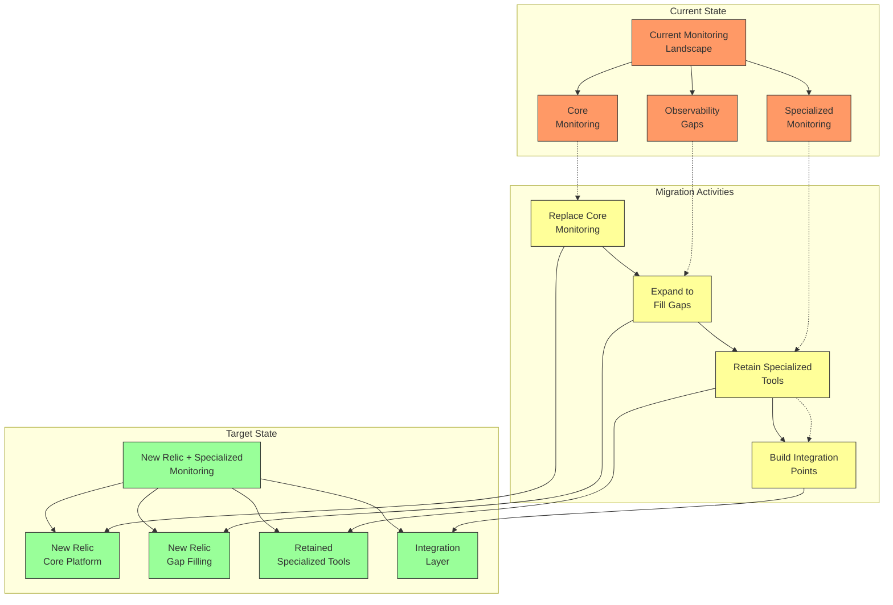

#### Specialized Tool Evaluation for Retention or Replacement

| Tool Category | Examples | Typical Decision | Integration Approach | Migration Complexity |
|---------------|----------|------------------|----------------------|----------------------|
| **Network Monitoring** | ThousandEyes, Kentik | **Retain** - Specialized capabilities | API integration for service impact events | Low-Medium |
| **Security Monitoring** | Falco, Wazuh, Snyk | **Retain** - Compliance requirements | Event forwarding for security context | Medium |
| **Database Monitoring** | Percona, pganalyze | **Case-by-case** - Depends on depth needed | Metric forwarding for key indicators | Medium-High |
| **Cost Management** | Kubecost, CloudHealth | **Retain** - Specialized capabilities | API integration for cost metrics | Low |
| **APM & Tracing** | Dynatrace, AppDynamics | **Replace** - New Relic core capability | Complete migration with historical data | High |
| **Infrastructure Monitoring** | Nagios, Zabbix | **Replace** - New Relic core capability | Parallel operation during transition | Medium |
| **Log Management** | Splunk Enterprise, Elastic | **Case-by-case** - Depends on usage | Forwarding critical logs to both systems | High |

#### When to Use Hybrid Expansion

The Hybrid Expansion model is ideal when:
- Organization has significant investment in specialized tools
- Certain monitoring domains have unique requirements
- Budget constraints limit complete replacement
- Specific compliance requirements necessitate specialized tools
- Observability gaps exist in current monitoring landscape

## Platform-Specific Migration Strategies

The approach to migrating from specific platforms to New Relic requires tailored strategies to address the unique characteristics of each source platform.

### Migrating from Prometheus to New Relic

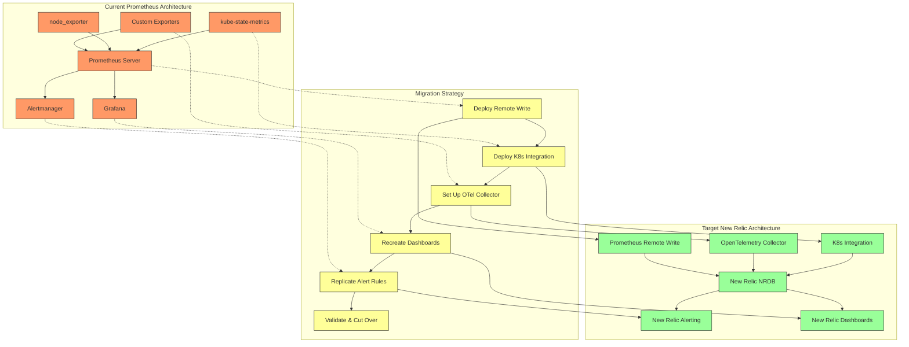

#### Prometheus Migration Guidance

| Component | Migration Approach | Challenges | Best Practices |
|-----------|-------------------|------------|----------------|
| **Metrics Collection** | Use Prometheus remote write or OpenTelemetry collector | Maintaining custom exporters functionality | Configure remote write with appropriate filters and sample rates |
| **PromQL to NRQL** | Convert key queries using NRQL equivalents | Syntax and function differences | Create NRQL translation guide for common queries |
| **Alert Rules** | Recreate critical alerts in New Relic | Matching alert thresholds and behaviors | Test alerts with historical data to verify parity |
| **Dashboards** | Recreate essential dashboards in New Relic | Matching visualization types | Focus on critical dashboards first, then create specialized views |
| **Recording Rules** | Replace with NRQL queries or NRQL Custom Events | Performance optimization differences | Assess necessity of each recording rule |
| **Retention/Cost** | Configure appropriate data retention policies | Prometheus retention vs. New Relic data ingest model | Apply metrics transformation to optimize ingest costs |

#### Prometheus Migration Quick Reference: PromQL to NRQL

| PromQL Pattern | NRQL Equivalent | Notes |
|----------------|-----------------|-------|
| `rate(http_requests_total{status="500"}[5m])` | `SELECT rate(count(http.requests), 5 minutes) FROM Metric WHERE status = '500'` | Use rate function with count aggregator |
| `sum by (pod_name) (container_memory_usage_bytes)` | `SELECT sum(container.memory.usage.bytes) FROM Metric FACET pod.name` | Use FACET for grouping by dimensions |
| `histogram_quantile(0.95, rate(http_request_duration_seconds_bucket[5m]))` | `SELECT percentile(duration, 95) FROM Transaction` | New Relic handles histograms differently |
| `increase(node_cpu_seconds_total{mode="idle"}[1h])` | `SELECT rate(sum(node.cpu.seconds), 1 hour) * 3600 FROM Metric WHERE mode = 'idle'` | Multiply by seconds in the interval |
| `topk(5, sum by (pod) (rate(container_cpu_usage_seconds_total[5m])))` | `SELECT sum(container.cpu.usage.seconds) FROM Metric FACET pod LIMIT 5` | Use LIMIT with appropriate FACET |

### Migrating from Datadog to New Relic

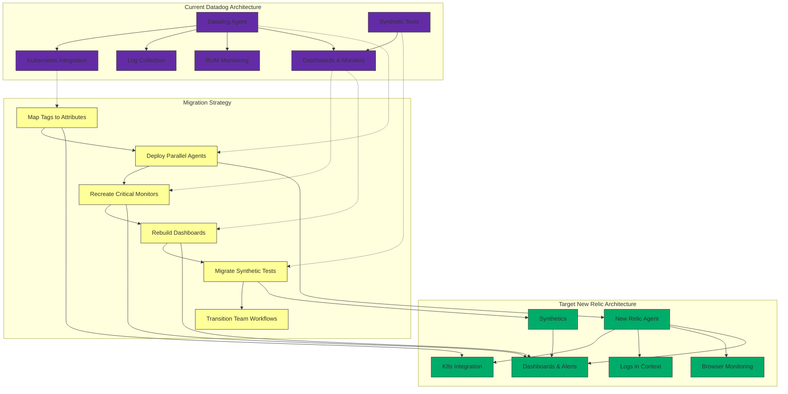

#### Datadog to New Relic Terminology Mapping

| Datadog Concept | New Relic Equivalent | Migration Considerations |
|-----------------|----------------------|--------------------------|
| **Tags** | Attributes | Map tagging strategy; ensure consistent hierarchy |
| **Monitors** | Alerts | Match alert conditions and notification channels |
| **APM Services** | Services | Ensure service discovery and naming consistency |
| **Custom Metrics** | Custom Events/Metrics | Evaluate cardinality impact on billing |
| **Dashboards** | Dashboards | Recreate critical dashboards using NRQL |
| **Log Pipelines** | Log Parsing Rules | Validate parsing logic functions similarly |
| **Synthetic Tests** | Synthetic Monitors | Match frequency, locations, and alerting |
| **RUM** | Browser Monitoring | Compare script inclusion and sampling rates |
| **Network Performance** | Network Monitoring | Validate similar coverage and metrics |

#### Datadog to New Relic Query Translation

| Datadog Query | New Relic NRQL | Notes |
|--------------|----------------|-------|
| `avg:kubernetes.cpu.usage.total{*}` | `SELECT average(k8s.container.cpu.usage.total) FROM Metric` | Namespace differs but metrics are similar |
| `sum:kubernetes.pods.running{kube_deployment:nginx} by {kube_cluster_name}` | `SELECT sum(k8s.pod.status) FROM Metric WHERE podStatus = 'Running' AND deploymentName = 'nginx' FACET clusterName` | Additional filtering in New Relic |
| `max:system.disk.in_use{*} by {host}` | `SELECT max(system.disk.usedPercent) FROM Metric FACET hostname` | Different metric naming convention |
| `avg:redis.mem.used{service:redis-cache} by {redis_role}` | `SELECT average(redis.info.memory.used) FROM Metric WHERE service = 'redis-cache' FACET redis.role` | Nested attributes in New Relic |

### Migrating from Elastic Stack to New Relic

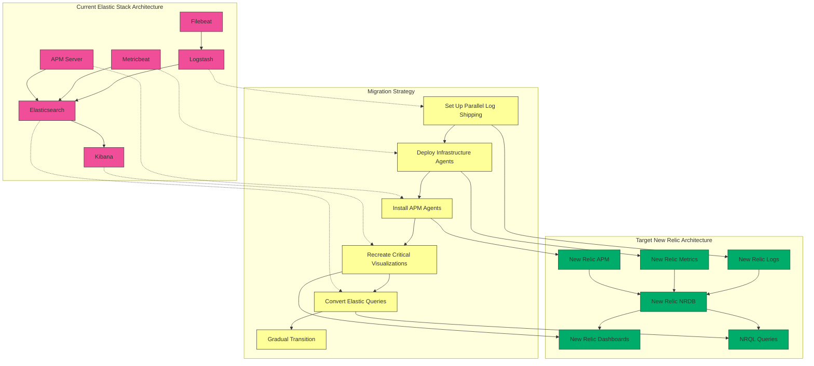

#### Elastic to New Relic Query Translation

| Elasticsearch Query | New Relic NRQL | Notes |
|--------------------|----------------|-------|
| `GET _search { "query": { "match": { "kubernetes.pod.name": "nginx" } } }` | `SELECT * FROM Log WHERE k8s.pod.name = 'nginx'` | Direct field mapping |
| `GET _search { "aggs": { "avg_latency": { "avg": { "field": "latency" } } } }` | `SELECT average(latency) FROM Transaction` | Aggregation translation |
| `GET _search { "query": { "range": { "timestamp": { "gte": "now-15m" } } } }` | `SELECT * FROM Log SINCE 15 minutes ago` | Time range syntax difference |
| `GET index/_search { "query": { "bool": { "must": [ {"match": {"service": "api"}}, {"match": {"level": "error"}} ] } } }` | `SELECT * FROM Log WHERE service = 'api' AND level = 'error'` | Boolean conditions |

#### Key Migration Considerations for Elastic Stack

| Component | Migration Approach | Challenges | Best Practices |
|-----------|-------------------|------------|----------------|
| **Log Collection** | Set up parallel log shipping | Maintaining advanced parsing logic | Use Logstash to forward to both systems during transition |
| **Metrics Collection** | Deploy NR Infrastructure agent | Mapping metric names and dimensions | Create a metrics mapping document |
| **APM Traces** | Transition to New Relic APM agents | Code instrumentation differences | Phased deployment by service |
| **Dashboards** | Recreate key Kibana visualizations in NR | Matching visualization capabilities | Focus on most used dashboards first |
| **Alerts** | Reimplement Elastic Watcher alerts in NRQL | Alert semantics differences | Test each alert with historical data |
| **Historical Data** | Determine historical data requirements | Operational vs. compliance needs | Consider data export for critical historical records |

## Migration Readiness Assessment

Before beginning migration, conduct a readiness assessment to identify gaps, risks, and preparation needs.

### Readiness Assessment Framework

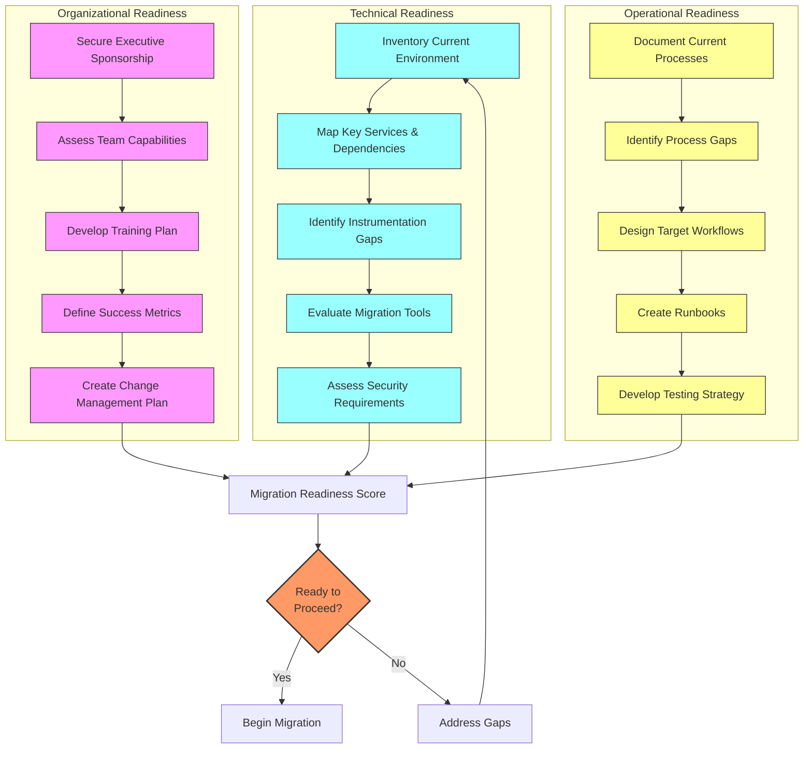

### Migration Readiness Questionnaire

```
# New Relic Migration Readiness Assessment

## Technical Readiness (Score 0-5 for each item)
- [ ] Complete inventory of current monitoring tools and coverage
- [ ] Mapping of service dependencies and relationships
- [ ] Identification of instrumentation gaps and requirements
- [ ] Evaluation of available migration tools and methods
- [ ] Assessment of security and compliance requirements

## Organizational Readiness (Score 0-5 for each item)
- [ ] Executive sponsorship and support secured
- [ ] Team skills and knowledge assessment completed
- [ ] Training plan developed and resources allocated
- [ ] Clear success metrics and KPIs defined
- [ ] Change management and communication plan established

## Operational Readiness (Score 0-5 for each item)
- [ ] Current monitoring and alerting processes documented
- [ ] On-call and incident response procedures mapped
- [ ] Target state workflows and processes designed
- [ ] Updated runbooks and documentation planned
- [ ] Testing and validation strategy developed

## Scoring
- Total Score: ___ / 75
- Technical Readiness: ___ / 25
- Organizational Readiness: ___ / 25
- Operational Readiness: ___ / 25

## Readiness Thresholds
- **Ready to Proceed**: 60-75 points
- **Proceed with Caution**: 45-59 points
- **Address Gaps Before Proceeding**: Below 45 points
```

### Critical Success Factors

| Factor | Indicators | Mitigation Strategies |
|--------|------------|----------------------|
| **Executive Sponsorship** | • Visible leadership support<br>• Allocated budget<br>• Prioritization over competing initiatives | • Regular executive briefings<br>• Clear ROI documentation<br>• Success metrics aligned with business goals |
| **Team Readiness** | • Skills gap assessment complete<br>• Training plan in place<br>• Resource allocation confirmed | • Early training sessions<br>• Identify champions in each team<br>• External expertise engagement |
| **Technical Preparation** | • Complete inventory of current state<br>• Clear target architecture<br>• Migration tooling evaluated | • Proof of concept deployment<br>• Thorough testing in dev environment<br>• Comprehensive technical documentation |
| **Operational Continuity** | • Alerting gaps identified<br>• Runbooks updated<br>• On-call procedures adjusted | • Parallel alerting during transition<br>• Incident response rehearsals<br>• Extended hypercare period |
| **Change Management** | • Communication plan established<br>• Timeline and milestones defined<br>• Impact assessment complete | • Regular stakeholder updates<br>• Clear rollback criteria<br>• Phased approach with early wins |

## Cost and Planning Considerations

Understanding the financial implications of migration is crucial for proper planning and budgeting.

### Migration Cost Components

```mermaid
graph TD
    Total[Total Migration Cost]
    
    License[Licensing Costs]
    Migration[Migration Effort]
    Overlap[Overlap Period]
    Training[Training & Enablement]
    Ongoing[Ongoing Operation]
    
    Total --> License
    Total --> Migration
    Total --> Overlap
    Total --> Training
    Total --> Ongoing
    
    License --> L1[New Relic Licensing]
    License --> L2[Legacy Contract Termination]
    
    Migration --> M1[Migration Planning]
    Migration --> M2[Implementation Labor]
    Migration --> M3[Validation Effort]
    
    Overlap --> O1[Dual System Operation]
    Overlap --> O2[Increased Infrastructure]
    
    Training --> T1[Formal Training]
    Training --> T2[Knowledge Transfer]
    Training --> T3[Productivity Impact]
    
    Ongoing --> G1[Operational Differences]
    Ongoing --> G2[Efficiency Gains]
    
    classDef total fill:#f96,stroke:#333,stroke-width:2px
    classDef category fill:#ff9,stroke:#333,stroke-width:1px
    classDef subcategory fill:#9f9,stroke:#333,stroke-width:1px
    
    class Total total
    class License,Migration,Overlap,Training,Ongoing category
    class L1,L2,M1,M2,M3,O1,O2,T1,T2,T3,G1,G2 subcategory
```

#### Migration Cost Estimation Framework

| Cost Category | Calculation Approach | Typical Range | Optimization Opportunities |
|---------------|----------------------|--------------|----------------------------|
| **Licensing Costs** | • New Relic licensing (based on data volume)<br>• Early termination costs for existing tools<br>• Discount negotiations | 25-40% of total cost | • Data sampling strategies<br>• Negotiating volume discounts<br>• Phased migration to reduce overlap |
| **Migration Effort** | • Planning effort (person-days × rate)<br>• Implementation labor (person-days × rate)<br>• External consulting if needed | 20-35% of total cost | • Automation of migration tasks<br>• Templating approaches<br>• Focusing on high-value components first |
| **Overlap Period** | • Dual licensing costs (months × monthly cost)<br>• Additional infrastructure costs<br>• Integration maintenance | 15-25% of total cost | • Shortening overlap period<br>• Selective data forwarding<br>• Early decommissioning of low-value components |
| **Training & Enablement** | • Formal training costs<br>• Internal knowledge transfer time<br>• Productivity impact during transition | 10-20% of total cost | • Train-the-trainer approach<br>• Leveraging free New Relic resources<br>• Creating targeted role-based training |
| **Ongoing Operational Changes** | • Operational differences in daily workflows<br>• Potential efficiency gains<br>• Long-term cost structure changes | Varies widely | • Automation opportunities<br>• Process optimization<br>• Adopting New Relic best practices |

#### Sample Migration Budget Template

```
# New Relic Migration Budget

## One-Time Costs
- Migration planning and design: $XX,XXX
- Implementation labor: $XX,XXX
- Dashboard & alert recreation: $XX,XXX
- External consulting/support: $XX,XXX
- Formal training: $XX,XXX
- Legacy contract termination fees: $XX,XXX

## Recurring Costs During Migration
- Legacy tool licensing (overlap period): $XX,XXX per month
- New Relic licensing: $XX,XXX per month
- Additional infrastructure: $XX,XXX per month
- Team productivity impact: XX person-hours per month valued at $XX,XXX

## Ongoing Cost Changes
- Pre-migration monitoring costs: $XX,XXX per month
- Post-migration monitoring costs: $XX,XXX per month
- Net monthly change: $XX,XXX per month (XX%)

## Return on Investment
- Expected monthly savings: $XX,XXX
- Migration cost recovery period: XX months
- 3-year total cost of ownership change: $XX,XXX (XX%)
- Efficiency gains: XX person-hours per month valued at $XX,XXX
```

## Case Studies

These anonymized case studies demonstrate successful migration journeys to New Relic:

### Financial Services: Datadog to New Relic

**Context**: A large financial institution needed to migrate from Datadog to New Relic to reduce monitoring costs while maintaining comprehensive Kubernetes observability.

**Migration Approach**:
- Implemented parallel systems model with 3-month overlap
- Focused initially on infrastructure and Kubernetes monitoring
- Created side-by-side dashboards for validation
- Developed detailed migration runbooks for each service
- Conducted extensive team training prior to cutover

**Results**:
- 40% reduction in annual monitoring costs
- Improved Kubernetes visibility with enhanced container insights
- Successfully migrated 500+ dashboards and 300+ alerts
- Zero critical incidents during migration period
- Completed full migration in 5 months vs. 8-month plan

### E-commerce Platform: Prometheus to New Relic

**Context**: A global e-commerce company sought to replace their self-managed Prometheus infrastructure with New Relic to reduce operational overhead.

**Migration Approach**:
- Leveraged remote write capabilities for initial data flow
- Maintained Grafana temporarily with data from both systems
- Gradually recreated critical dashboards in New Relic
- Used OpenTelemetry to standardize instrumentation
- Phased migration by cluster and environment

**Results**:
- Eliminated 120+ hours/month of Prometheus maintenance
- Improved data retention from 15 days to 13 months
- Enhanced cross-service correlation capabilities
- Reduced MTTR by 35% through improved tooling
- Achieved 99.8% monitoring coverage across services

### Healthcare Technology: Elastic Stack to New Relic

**Context**: A healthcare SaaS provider needed to migrate from a complex Elastic Stack deployment to New Relic to improve reliability and reduce operational complexity.

**Migration Approach**:
- Implemented phased migration model, starting with infrastructure
- Used Logstash to dual-ship logs during transition
- Created detailed mapping of Kibana visualizations to New Relic
- Developed custom OpenTelemetry collectors for specialized data
- Extended migration timeline for historical data concerns

**Results**:
- Reduced monitoring infrastructure by 80%
- Improved log search performance by 300%
- Enhanced correlation between logs, metrics, and traces
- Streamlined compliance reporting with improved data access
- Achieved 99.99% monitoring uptime vs. previous 98%

## Implementation Best Practices

Success with migrations requires careful planning and execution. Consider these key recommendations:

### Dashboard Migration Strategy

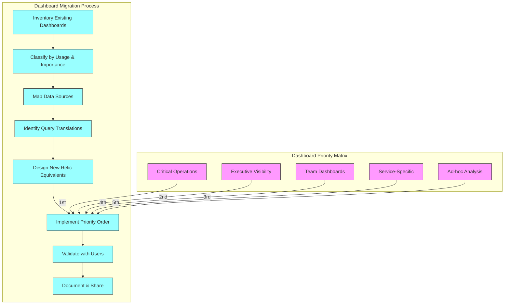

#### Dashboard Migration Guidelines

| Dashboard Type | Migration Priority | Approach | Success Metrics |
|----------------|-------------------|----------|-----------------|
| **Critical Operations** | Very High | • Exact recreation<br>• Extensive validation<br>• Side-by-side testing | • Identical alerting behavior<br>• Visual verification<br>• User acceptance |
| **Executive Dashboards** | High | • Focused on key business metrics<br>• Enhanced with additional context<br>• Polished presentation | • Executive sign-off<br>• Improved narrative quality<br>• Data accuracy verification |
| **Team Dashboards** | Medium | • Recreate essential elements<br>• Improve based on team feedback<br>• Focus on workflow support | • Team adoption metrics<br>• Positive user feedback<br>• Workflow efficiency |
| **Service-Specific** | Medium-Low | • Recreate with service owners<br>• Enhance with New Relic capabilities<br>• Focus on most-used views | • Service owner sign-off<br>• Improved troubleshooting capabilities<br>• Complete service visibility |
| **Ad-hoc Analysis** | Low | • Document query translations<br>• Create example templates<br>• Enable self-service creation | • Knowledge transfer completion<br>• User capabilities with NRQL<br>• Self-service metrics |

### Alert Migration Strategy

Alerts require careful migration to avoid missed incidents or false positives:

#### Alert Migration Process

1. **Inventory current alerts**
   - Document all alert definitions, thresholds, and destinations
   - Identify critical vs. non-critical alerts
   - Map alert ownership and escalation paths

2. **Analyze alert effectiveness**
   - Review alert history for noise and gaps
   - Identify most actioned alerts
   - Evaluate false positive rates

3. **Design New Relic alert structure**
   - Map alert conditions to NRQL
   - Design notification channels and workflows
   - Create alert policy hierarchy

4. **Implement with parallel notifications**
   - Configure New Relic alerts alongside existing
   - Send notifications to test channels initially
   - Validate alert behavior with historical data

5. **Transition gradually**
   - Move alerts by service or team
   - Maintain dual alerting for critical services
   - Monitor alert efficacy and tune as needed

#### Alert Migration Best Practices

- Maintain a detailed alert migration tracker
- Test each alert with historical data scenarios
- Document translation from source system query to NRQL
- Create clear ownership and escalation documentation
- Implement a "break glass" procedure for migration issues
- Consider alert rationalization during migration

### Team Enablement Strategy

Successful migrations require comprehensive team enablement:

#### Enablement Framework

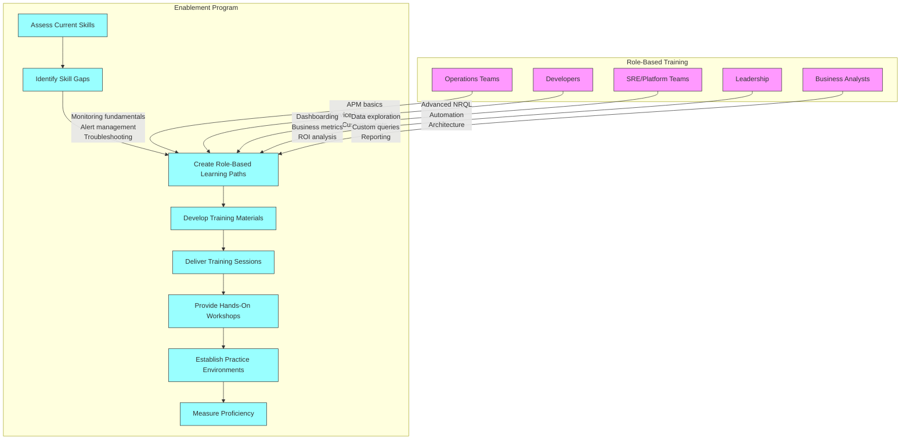

#### Enablement Content by Phase

| Migration Phase | Key Enablement Activities | Focus Areas | Delivery Methods |
|-----------------|--------------------------|-------------|------------------|
| **Pre-Migration** | • Awareness sessions<br>• New Relic fundamentals<br>• Comparison to current tools | • Platform overview<br>• Key differences in concepts<br>• Migration timeline and goals | • Town halls<br>• Online courses<br>• Documentation |
| **Early Migration** | • Hands-on technical training<br>• Role-specific workshops<br>• Query translation skills | • Basic dashboard creation<br>• Basic querying with NRQL<br>• Understanding entity structure | • Instructor-led training<br>• Hands-on labs<br>• Peer mentoring |
| **Mid-Migration** | • Advanced capabilities<br>• Query optimization<br>• Alert configuration | • Advanced dashboarding<br>• Complex queries<br>• Integration capabilities | • Advanced workshops<br>• Office hours<br>• Knowledge sharing |
| **Late Migration** | • Self-service enablement<br>• Best practices<br>• Extended capabilities | • Automation<br>• Performance optimization<br>• Business insights | • Communities of practice<br>• Self-paced learning<br>• Expert sessions |
| **Post-Migration** | • Continuous improvement<br>• New feature adoption<br>• Center of excellence | • Advanced use cases<br>• Optimization techniques<br>• Cross-team collaboration | • Innovation workshops<br>• User groups<br>• Advanced certification |

## Conclusion

Migrating to New Relic represents more than a technical infrastructure change—it's an opportunity to transform observability practices while ensuring operational continuity. By adopting a structured migration approach, organizations can minimize risk, control costs, and maximize the value of their New Relic implementation. The journey models, platform-specific strategies, and implementation guidance provided in this chapter offer a comprehensive framework for planning and executing a successful migration.

The key to success lies in recognizing that migration is not merely a technical exercise but a socio-technical transformation requiring careful attention to people, processes, and technology. By applying the frameworks and best practices outlined here, organizations can navigate the complexities of migration while ensuring that their Kubernetes and infrastructure observability capabilities are enhanced rather than disrupted during the transition.

Organizations should select the migration journey model that best aligns with their specific constraints, priorities, and risk tolerance. With proper planning, clear success metrics, and systematic execution, migrations to New Relic can deliver significant improvements in observability capabilities, operational efficiency, and cost-effectiveness while maintaining the critical monitoring capabilities that support business operations.

---

**Next Chapter**: [Decision Framework](02_Decision_Framework.md)
