# Hybrid Architecture Decision Framework

## Executive Summary

Adopting a hybrid observability architecture—combining New Relic with other monitoring tools—is a strategic approach for organizations with existing investments, specialized requirements, or multi-cloud strategies. This chapter presents a structured decision framework for evaluating when, why, and how to implement hybrid observability architectures with New Relic at the core. Rather than viewing hybrid architectures as transitional states, we explore how thoughtfully designed hybrid approaches can provide superior observability outcomes for complex Kubernetes environments.

Organizations face difficult decisions when evolving their observability strategy: continue with existing tools, migrate fully to New Relic, or adopt a hybrid approach. Each option carries different implications for operational efficiency, costs, and monitoring capabilities. This framework guides you through evaluating these factors systematically, providing practical decision trees, architecture patterns, and evaluation matrices specifically tailored for Kubernetes infrastructure monitoring with New Relic.

## Hybrid Architecture Decision Tree

Before diving into specific patterns, this decision tree helps organizations evaluate their current state and determine the most appropriate hybrid strategy:


## Hybrid Architecture Patterns

Four primary patterns have emerged as best practices for hybrid New Relic architectures in Kubernetes environments. Each pattern addresses different organizational needs and constraints.

### Pattern 1: Tiered Collection Architecture

This pattern segregates telemetry by importance and cost, using different systems for different tiers of data.


#### Tiered Data Selection Criteria

| Tier | Storage | Retention | Data Types | Selection Criteria | Example |
|------|---------|-----------|------------|-------------------|---------|
| Tier 1: Critical | New Relic | 13+ months | Key metrics, golden signals, SLIs | Business impact, alerting needs | Error rates, latency, saturation metrics |
| Tier 2: Operational | Prometheus + NR | 2-4 weeks | System metrics, detailed app metrics | Troubleshooting value, moderate cardinality | CPU per container, JVM metrics, middleware stats |
| Tier 3: Debug | Local storage | 1-7 days | High-cardinality metrics, debug logs, raw traces | High volume, transient utility | Debug logs, code profiling data, full traces |

#### When to Use Tiered Collection

This pattern is ideal when:
- Cost optimization is a primary concern
- You need long-term retention for critical metrics but short-term for high-volume data
- You have high-cardinality or high-volume metrics that would be expensive to store in New Relic
- Teams need local access to raw debug data

#### Implementation Considerations

- Define clear criteria for what goes into each tier
- Ensure consistent labeling across tiers for correlation
- Implement automation to adjust tier assignment as needed
- Create clear documentation for which data lives where

### Pattern 2: Parallel Systems Architecture

This pattern maintains separate monitoring systems simultaneously, either for migration purposes or for cross-validation.


#### Parallel Systems Transition Phases

| Phase | Duration | Old System Role | New Relic Role | Success Criteria |
|-------|----------|-----------------|---------------|------------------|
| 1: Initial Deploy | 2-4 weeks | Primary monitoring, alerting | Secondary validation | New Relic receives expected data volume and types |
| 2: Feature Parity | 1-3 months | Primary monitoring, alerting | Dashboard & alerting validation | New Relic alerts trigger for same conditions as old system |
| 3: Transition | 1-2 months | Validation and backup | Primary monitoring and alerting | Teams use New Relic as primary troubleshooting tool |
| 4: Legacy Sunset | 1-2 months | Reference only | Primary monitoring system | Old system can be safely decommissioned |

#### When to Use Parallel Systems

This pattern is ideal when:
- Risk mitigation during migration is paramount
- You have significant investment in existing monitoring
- Teams need time to adapt to new tools
- You need to validate New Relic against trusted baselines

#### Implementation Considerations

- Plan for increased resource usage during parallel operation
- Establish clear phase transition criteria
- Create side-by-side comparison dashboards
- Document differences in calculation or visualization

### Pattern 3: Best-of-Breed Integration

This pattern combines specialized monitoring tools with New Relic for comprehensive coverage across different domains.


#### Specialized Tool Integration Approaches

| Domain | Example Tools | Integration Method | Data Flow Direction | Primary Storage | Notes |
|--------|---------------|-------------------|---------------------|-----------------|-------|
| Network | ThousandEyes, Kentik | API integration, webhook alerts | Network tools → NR | New Relic | Focus on service-impacting events |
| Security | Falco, Wazuh, Snyk | Event forwarding, webhook alerts | Security tools → NR | SIEM with NR correlation | Focus on context, not raw data |
| Database | Percona, pganalyze | Metric forwarding, dimensional metrics | DB tools → NR | New Relic | Forward key performance indicators |
| Cost | Kubecost, CloudHealth | Metric API, cost dimensions | Cost tools → NR | Split storage | Keep raw data in cost tools |
| APM | Dynatrace, AppDynamics | API integration, alerting | Old APM → NR alerts | Application-specific | Focus on critical events |

#### When to Use Best-of-Breed Integration

This pattern is ideal when:
- You have specialized domains requiring deep expertise
- Certain tools offer capabilities New Relic doesn't provide
- Teams have invested in domain-specific skill development
- Compliance or security requirements mandate specific tools

#### Implementation Considerations

- Focus integration on events and key metrics, not raw data
- Maintain clear ownership boundaries for different domains
- Establish standard integration patterns for consistency
- Develop cross-tool correlation identifiers

### Pattern 4: Cloud-Native Hybrid Architecture

This pattern leverages native cloud monitoring services alongside New Relic for a comprehensive, cloud-tailored solution.


#### When to Use Cloud-Native Hybrid

This pattern is ideal when:
- You operate in multiple cloud environments
- You rely heavily on managed cloud services
- You want to leverage cloud provider cost optimizations
- You need to maintain cloud-specific expertise

#### Implementation Considerations

- Standardize naming conventions across cloud environments
- Implement centralized alerting through New Relic
- Use OpenTelemetry for consistent instrumentation
- Maintain cloud-specific dashboards alongside cross-cloud views

## Decision Framework

Choosing the right hybrid architecture requires systematic evaluation of your organization's needs, constraints, and goals. The following framework provides structured guidance for this decision process.

### Hybrid Architecture Decision Matrix

| Factor | Full New Relic | Tiered Collection | Parallel Systems | Best-of-Breed | Cloud-Native Hybrid |
|--------|---------------|-------------------|-----------------|--------------|---------------------|
| **Organization Factors** |||||
| Multi-team coordination | Simple | Moderate | Complex | Complex | Complex |
| Specialized team skills | Low | Moderate | High | High | Moderate |
| Existing tool investment | Low | Moderate | High | High | Moderate |
| Cloud maturity | Any | Moderate+ | Any | High | High |
| **Technical Factors** |||||
| Implementation complexity | Low | Moderate | High | Moderate | Moderate |
| Data consistency | High | Moderate | Varied | Varied | Moderate |
| Query complexity | Low | Moderate | High | Moderate | Moderate |
| Cross-domain correlation | High | Moderate | Low | Moderate | Moderate |
| **Business Factors** |||||
| Time to implement | Fast | Moderate | Slow | Moderate | Moderate |
| Total cost | Predictable | Optimized | High | Varied | Varied |
| Vendor lock-in | High | Moderate | Low | Low | Moderate |
| Specialized functionality | Limited | Moderate | High | High | High |

### Hybrid Strategy Selection Guide

| Primary Driver | Recommended Architecture | Key Considerations |
|----------------|-------------------------|-------------------|
| Cost Optimization | Tiered Collection | Identify high-cost metrics for local storage |
| Risk Reduction | Parallel Systems | Plan transition phases and validation metrics |
| Multi-Cloud Strategy | Cloud-Native Hybrid | Ensure consistent naming and classification |
| Legacy Integration | Parallel Systems | Establish cross-system correlation identifiers |
| Specialized Requirements | Best-of-Breed | Define clear domain boundaries |
| Team Autonomy | Tiered Collection | Create shared governance model |
| Data Sovereignty | Tiered Collection | Map data types to compliance requirements |
| M&A Integration | Parallel Systems | Agree on longer-term target architecture |

## Evaluation Framework

Before implementing a hybrid architecture, evaluate the approach against these key dimensions:

### Hybrid Architecture Evaluation Checklist

```
# Hybrid Architecture Evaluation Checklist

## Technical Feasibility
- [ ] Data collection methods for all required telemetry types are identified
- [ ] Integration points between systems are documented and tested
- [ ] Query capabilities across systems are verified
- [ ] Cross-system correlation of entities is possible
- [ ] Alerting responsibilities are clearly defined
- [ ] Dashboard integration approach is identified

## Operational Considerations
- [ ] Clear ownership for each component is established
- [ ] SLAs for each monitoring component are defined
- [ ] Monitoring of the monitoring system is designed
- [ ] Backup and disaster recovery for critical monitoring is planned
- [ ] Escalation paths for system issues are documented
- [ ] Knowledge transfer plan for cross-system expertise is created

## Cost Analysis
- [ ] TCO of hybrid approach vs. alternatives is calculated
- [ ] Cost attribution model for shared services is defined
- [ ] Cost optimization opportunities are identified
- [ ] License management approach is established
- [ ] Growth projections and cost implications are modeled

## Governance and Process
- [ ] Data retention policies for each system are defined
- [ ] Access control model across systems is designed
- [ ] Change management process for monitoring changes is established
- [ ] Compliance requirements for all data types are met
- [ ] Documentation standards for cross-system architecture are defined
- [ ] Training plan for teams is developed
```

### Hybrid Architecture Cost Model

```
Total Cost of Ownership = 
    Σ(Tool Licensing Costs) + 
    Σ(Infrastructure Costs) + 
    Σ(Integration Development Costs) + 
    Σ(Operational Costs) +
    Σ(Training Costs) -
    Σ(Efficiency Gains)

Where:

Tool Licensing Costs = 
    New Relic Costs (based on data ingest) +
    Secondary Tool Costs (based on respective models)

Infrastructure Costs =
    Storage Costs +
    Compute Costs +
    Network Egress Costs

Integration Development Costs =
    Initial Integration (engineering hours × rate) +
    Ongoing Maintenance (hours per month × rate × duration)

Operational Costs =
    Monitoring Management (FTE allocation × salary) +
    Incident Response Premium (incident count × average cost premium)

Training Costs =
    Training Materials +
    Training Time (team size × hours × hourly rate)

Efficiency Gains =
    Reduced MTTR (incident count × hours saved × hourly rate) +
    Automation Benefits (manual hours saved × hourly rate)
```

Example for 3-year projection of Tiered Collection hybrid architecture with 100 nodes:

```
New Relic Costs = $15/node/month × 100 nodes × 36 months = $54,000
Prometheus Costs = $0 license + $500/month infrastructure × 36 months = $18,000
Integration Costs = 80 hours × $100/hour + 5 hours/month × $100/hour × 36 months = $26,000
Operational Costs = 0.25 FTE × $120,000/year × 3 years = $90,000
Training Costs = $5,000 + 20 people × 8 hours × $50/hour = $13,000
Efficiency Gains = 12 incidents/month × 2 hours saved × $100/hour × 36 months = $86,400

Total 3-Year TCO = $54,000 + $18,000 + $26,000 + $90,000 + $13,000 - $86,400 = $114,600
```

## Case Studies

These anonymized case studies demonstrate successful hybrid architecture implementations:

### Financial Services Company

**Context**: A large financial institution with substantial existing investment in Dynatrace needed to expand observability across a new Kubernetes platform while controlling costs.

**Approach**: Implemented a tiered collection architecture with:
- New Relic APM for new services and critical business transactions
- Dynatrace maintained for legacy applications
- Prometheus for high-cardinality infrastructure metrics
- New Relic dashboards aggregating critical data across sources

**Results**:
- 65% reduction in monitoring costs compared to full Dynatrace expansion
- Improved visibility into Kubernetes clusters
- Phased migration path for legacy applications
- Unified alerting through New Relic

### E-commerce Platform

**Context**: A global e-commerce company operating across AWS, GCP, and Azure needed unified observability while leveraging cloud-native capabilities.

**Approach**: Deployed cloud-native hybrid architecture with:
- Cloud provider monitoring for infrastructure (CloudWatch, Stackdriver, Azure Monitor)
- New Relic for application performance and cross-cloud correlation
- OpenTelemetry for standardized instrumentation
- Cloud-specific specialists maintained expertise in native tooling

**Results**:
- 40% reduction in manual correlation work across clouds
- Improved troubleshooting for distributed transactions
- Leveraged cloud-specific monitoring strengths
- Unified on-call experience through New Relic alerting

### Healthcare Technology Provider

**Context**: A healthcare SaaS provider with strict compliance requirements needed specialized security monitoring alongside application observability.

**Approach**: Implemented a best-of-breed architecture with:
- New Relic as primary observability platform
- Specialized security tools for HIPAA compliance
- Database-specific monitoring tools for PHI access
- Integration of security events into New Relic for correlation

**Results**:
- Maintained specialized security capabilities
- Improved correlation between security events and application performance
- Streamlined compliance reporting
- Reduced context switching during incidents

## Implementation Guidance

Success with hybrid architectures requires careful implementation. Consider these key recommendations:

### Entity Resolution and Correlation

```mermaid
flowchart TD
    subgraph "Entity Correlation Strategy"
        E1[Define Entity Model]
        E2[Implement Consistent Naming]
        E3[Add Correlation Identifiers]
        E4[Create Entity Mapping]
        E5[Verify Cross-System Resolution]
        
        E1 --> E2
        E2 --> E3
        E3 --> E4
        E4 --> E5
    end
    
    subgraph "Entity Types"
        T1[Hosts/Nodes]
        T2[Services]
        T3[Containers]
        T4[Kubernetes Objects]
        T5[Cloud Resources]
    end
    
    subgraph "Correlation Methods"
        M1[Common Identifiers]
        M2[Labeling/Tagging]
        M3[Lookup Tables]
        M4[Graph Relationships]
        M5[OpenTelemetry Context]
    end
    
    E1 -.-> T1 & T2 & T3 & T4 & T5
    E3 -.-> M1 & M2 & M3 & M4 & M5
    
    classDef strategy fill:#f96,stroke:#333,stroke-width:1px
    classDef types fill:#9cf,stroke:#333,stroke-width:1px
    classDef methods fill:#f9f,stroke:#333,stroke-width:1px
    
    class E1,E2,E3,E4,E5 strategy
    class T1,T2,T3,T4,T5 types
    class M1,M2,M3,M4,M5 methods
```



Establish a consistent entity identification strategy across systems:
- Use consistent naming conventions for services, hosts, and containers
- Implement OpenTelemetry context propagation for distributed tracing
- Consider custom attributes to link entities across systems
- Create lookup tables for cross-system entity mapping

### Data Flow Optimization

Optimize the flow of data between systems:
- Apply filtering at the source to reduce unnecessary data transfer
- Use batching and compression for cross-system integrations
- Implement circuit breakers to prevent cascade failures
- Establish monitoring for integration health

### Query Federation

Design an approach for cross-system querying:
- Implement a query translation layer when needed
- Create templates for common cross-system queries
- Document query patterns for each system
- Consider materialized views for frequently accessed cross-system data

### Alerting Strategy

Develop a coherent alerting strategy:
- Designate a single alerting authority (usually New Relic)
- Forward critical alerts from secondary systems
- Implement de-duplication for redundant alerts
- Ensure alert context includes source system information

### Team Organization

Align team structure with the hybrid architecture:
- Consider a Center of Excellence model for cross-tool expertise
- Establish clear ownership for each component
- Create joint runbooks for cross-system troubleshooting
- Develop cross-training plans to prevent expertise silos

## Conclusion

Hybrid observability architectures are not merely transitional states but can be strategic, long-term approaches that leverage the strengths of multiple systems. By applying the decision framework, evaluation criteria, and implementation guidance presented in this chapter, organizations can develop hybrid architectures that deliver comprehensive Kubernetes observability while optimizing for their specific constraints and requirements.

The key to success with hybrid architectures is intentional design rather than organic growth. By clearly defining system boundaries, data flows, integration points, and team responsibilities, organizations can avoid the common pitfalls of fragmented observability while realizing the benefits of specialized tools alongside New Relic's comprehensive platform. The resulting architecture should be continuously evaluated and evolved as technologies, organizational needs, and the Kubernetes landscape change over time.

---

**Next Chapter**: [Query Comparison](../06_Query_Cookbook/01_Query_Comparison.md)
