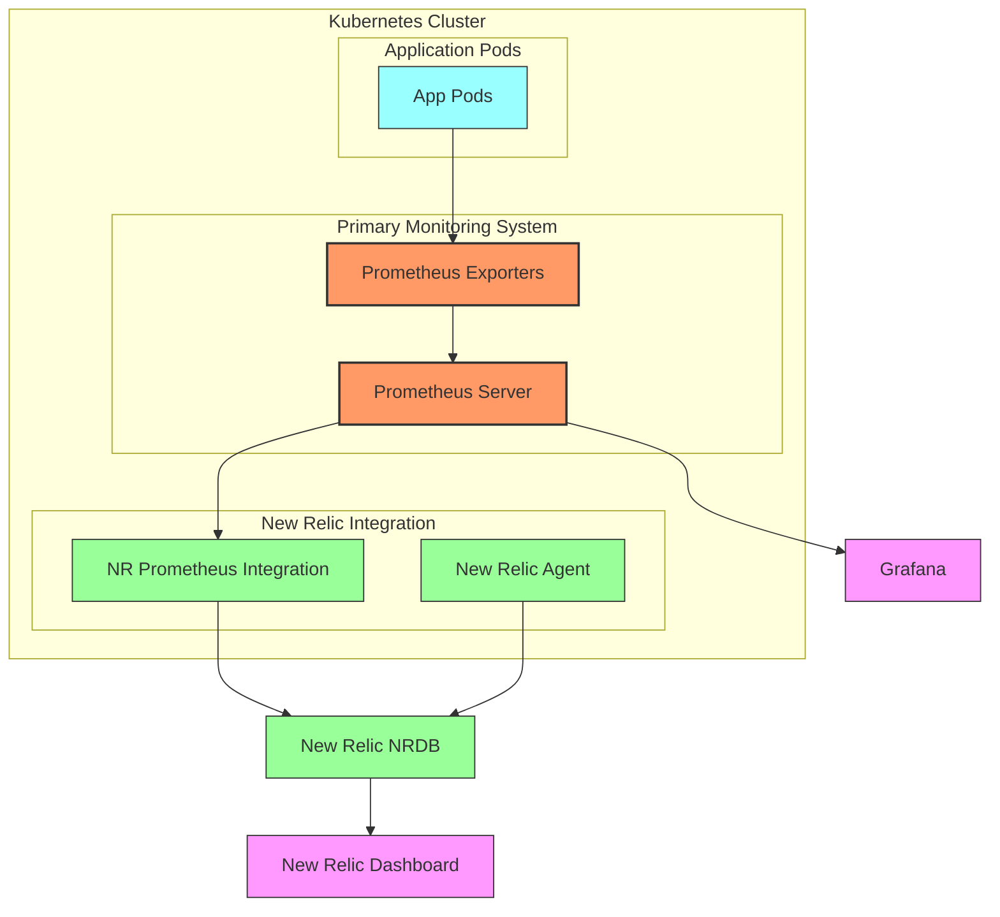
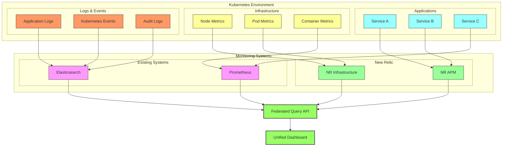
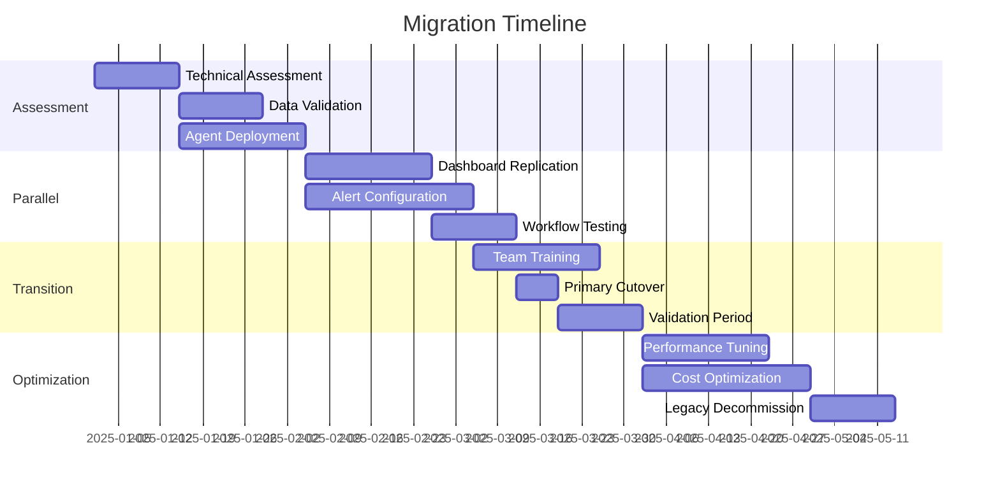

# Dual-Install Patterns

## Overview

§ Dual-install patterns represent a critical strategy for organizations transitioning to New Relic or maintaining hybrid observability architectures. In these scenarios, multiple monitoring agents coexist on the same hosts or containers, collecting telemetry in parallel. This chapter explores the technical considerations, performance implications, and implementation strategies for successfully running New Relic alongside other monitoring solutions in Kubernetes environments. While dual-install approaches are often viewed as transitional, the patterns presented here can also serve as sustainable long-term architectures that combine the strengths of multiple platforms.

§ As Kubernetes environments grow in complexity, organizations frequently need to combine the capabilities of different monitoring platforms. Whether migrating from an existing solution, maintaining specialized tools for specific workloads, or ensuring redundancy for critical systems, dual-install architectures must be carefully designed to avoid resource contention, data duplication, and operational confusion. This chapter provides practical guidance for implementing robust dual-install patterns that maximize visibility while minimizing overhead and cost.

## Dual-Install Scenarios

§ Organizations implement dual-install architectures for various reasons, each with different technical requirements and operational considerations:

### TB-32A: Dual-Install Scenarios and Requirements

| Scenario | Duration | Primary Goal | Key Requirements | Common Tools Paired with NR |
|----------|----------|--------------|------------------|----------------------------|
| Migration | Temporary (1-6 months) | System replacement | Data consistency validation | Datadog, Dynatrace, AppDynamics |
| Specialized Monitoring | Permanent | Complementary capabilities | Clear responsibility boundaries | Prometheus, Elastic, Splunk |
| Redundancy | Permanent | High reliability | Independent failure domains | Grafana Cloud, custom solutions |
| Multi-Team | Permanent | Team autonomy | Consistent correlation | Prometheus, Grafana, Thanos |
| Multi-Cloud | Permanent | Cloud-native integration | Cross-cloud entity resolution | CloudWatch, Stackdriver, Azure Monitor |
| Regulatory | Permanent | Compliance | Data sovereignty, audit controls | On-prem solutions, specialized audit tools |

## Technical Patterns

§ When implementing dual-install architectures, several distinct patterns can be applied based on technical requirements and constraints:

### Pattern 1: Side-by-Side Agent Deployment

§ In this pattern, multiple agents run independently on the same host or container, each reporting to their respective backends without direct interaction.

#### CF-32A: Side-by-Side Agent Deployment Helm Chart

```yaml
# values.yaml for dual-install Helm chart
global:
  namespace: monitoring
  
# New Relic configuration
newrelic:
  enabled: true
  cluster_name: production-east
  licenseKey: ${NEW_RELIC_LICENSE_KEY}
  
  # Resource limits to avoid contention
  resources:
    limits:
      cpu: 300m
      memory: 300Mi
    requests:
      cpu: 100m
      memory: 128Mi
  
  # Fine-tune collection to avoid duplication
  config:
    # Enable core infrastructure metrics
    infrastructure:
      enabled: true
    # Enable Kubernetes integration
    kubernetes:
      enabled: true
    # Disable logs to avoid duplication with existing system
    logging:
      enabled: false

# Secondary monitoring system configuration
prometheus:
  enabled: true
  
  # Resource limits for Prometheus
  resources:
    limits:
      cpu: 300m
      memory: 400Mi
    requests:
      cpu: 100m
      memory: 200Mi
  
  # Configure scrape intervals to reduce load
  scrapeInterval: 30s
  
  # Retention adjusted for dual-system scenario
  retention: 3d

# OpenTelemetry as a common instrumentation layer
opentelemetry:
  enabled: true
  
  # Configure multiple exporters
  collector:
    config:
      exporters:
        otlp/newrelic:
          endpoint: https://otlp.nr-data.net:4317
          headers:
            api-key: ${NEW_RELIC_LICENSE_KEY}
        prometheus:
          endpoint: "prometheus-server:9090"
      
      service:
        pipelines:
          traces:
            receivers: [otlp]
            processors: [batch]
            exporters: [otlp/newrelic]
          metrics:
            receivers: [otlp]
            processors: [batch]
            exporters: [otlp/newrelic, prometheus]
```

#### TB-32B: Side-by-Side Performance Impact Assessment

| Resource | Single Agent | Dual Agents | Optimization Techniques |
|----------|--------------|-------------|------------------------|
| CPU Usage | 50-100m | 100-200m | Increase scrape intervals, reduce duplicate collection |
| Memory Usage | 100-200MB | 200-400MB | Limit buffer sizes, reduce cardinality |
| Network Egress | 10-50MB/hour | 20-100MB/hour | Local aggregation, sampling |
| Disk IOPS | 10-30 IOPS | 20-60 IOPS | Limit logging, buffer writes |
| Container Restarts | <1/week | Potentially increased | Resource limits, health checks |
| System Call Volume | Moderate | Increased | Limit debug metrics, coordination |
| Security Considerations | Standard | Increased exposure | Restrict permissions, network policies |

### Pattern 2: Exporter-Based Integration

§ This pattern uses one system's exporters or integrations to feed data into another, reducing duplication while enabling cross-platform visibility.

#### DG-32A: Exporter-Based Integration Architecture



#### CF-32B: Prometheus Remote Write to New Relic Configuration

```yaml
# prometheus-config.yaml
global:
  scrape_interval: 30s
  evaluation_interval: 30s

# Remote write configuration for New Relic
remote_write:
  - url: https://prometheus-remote-write.newrelic.com/prometheus/v1
    write_relabel_configs:
      # Add cluster name as attribute
      - source_labels: [__name__]
        regex: (.*)
        target_label: cluster
        replacement: 'production-east'
      # Drop high-cardinality metrics
      - source_labels: [__name__]
        regex: go_.*|process_.*
        action: drop
    basic_auth:
      username: ${NEW_RELIC_LICENSE_KEY}
    queue_config:
      capacity: 500
      max_samples_per_send: 1000
      batch_send_deadline: 5s
      max_retries: 10
    metadata_config:
      send: true
      send_interval: 1m

# Standard Prometheus scrape configs
scrape_configs:
  - job_name: 'kubernetes-apiservers'
    kubernetes_sd_configs:
      - role: endpoints
    scheme: https
    tls_config:
      ca_file: /var/run/secrets/kubernetes.io/serviceaccount/ca.crt
    bearer_token_file: /var/run/secrets/kubernetes.io/serviceaccount/token
    relabel_configs:
      - source_labels: [__meta_kubernetes_namespace, __meta_kubernetes_service_name, __meta_kubernetes_endpoint_port_name]
        action: keep
        regex: default;kubernetes;https

  - job_name: 'kubernetes-nodes'
    scheme: https
    tls_config:
      ca_file: /var/run/secrets/kubernetes.io/serviceaccount/ca.crt
    bearer_token_file: /var/run/secrets/kubernetes.io/serviceaccount/token
    kubernetes_sd_configs:
      - role: node
    relabel_configs:
      - action: labelmap
        regex: __meta_kubernetes_node_label_(.+)
      - target_label: __address__
        replacement: kubernetes.default.svc:443
      - source_labels: [__meta_kubernetes_node_name]
        regex: (.+)
        target_label: __metrics_path__
        replacement: /api/v1/nodes/${1}/proxy/metrics

  - job_name: 'kubernetes-pods'
    kubernetes_sd_configs:
      - role: pod
    relabel_configs:
      - source_labels: [__meta_kubernetes_pod_annotation_prometheus_io_scrape]
        action: keep
        regex: true
      - source_labels: [__meta_kubernetes_pod_annotation_prometheus_io_path]
        action: replace
        target_label: __metrics_path__
        regex: (.+)
      - source_labels: [__address__, __meta_kubernetes_pod_annotation_prometheus_io_port]
        action: replace
        regex: ([^:]+)(?::\d+)?;(\d+)
        replacement: $1:$2
        target_label: __address__
      - action: labelmap
        regex: __meta_kubernetes_pod_label_(.+)
      - source_labels: [__meta_kubernetes_namespace]
        action: replace
        target_label: kubernetes_namespace
      - source_labels: [__meta_kubernetes_pod_name]
        action: replace
        target_label: kubernetes_pod_name
```

### Pattern 3: Federated Collection

§ This pattern distributes telemetry collection responsibilities across systems, with each handling specific data types or sources.

#### DG-32B: Federated Collection Architecture



#### TB-32C: Federated Collection Responsibility Matrix

| Telemetry Type | New Relic Responsibility | Secondary System Responsibility | Integration Point |
|----------------|--------------------------|--------------------------------|-------------------|
| Business Transactions | Primary collector | Secondary/validation | Cross-correlation by service name |
| Service Performance | Primary collector | - | - |
| Infrastructure Metrics | Basic metrics | Detailed/specialized metrics | Metric federation API |
| Container Metrics | Basic metrics | High-cardinality/debug | Remote write to New Relic |
| Application Logs | Error logs | Full log set | Log forwarding to New Relic |
| Audit Logs | - | Primary collector | Event API for critical events |
| Distributed Traces | Primary collector | - | - |
| Network Telemetry | - | Primary collector | Metric API for service-impacting issues |
| Security Events | - | Primary collector | Event API for critical events |

### Pattern 4: OpenTelemetry Multi-Export

§ This pattern uses OpenTelemetry as a vendor-neutral instrumentation layer with multiple backend exporters.

#### CF-32C: OpenTelemetry Multi-Export Configuration

```yaml
# otel-collector-config.yaml
receivers:
  otlp:
    protocols:
      grpc:
        endpoint: 0.0.0.0:4317
      http:
        endpoint: 0.0.0.0:4318

  # Additional receivers
  prometheus:
    config:
      scrape_configs:
        - job_name: 'kubernetes-pods'
          kubernetes_sd_configs:
            - role: pod
          relabel_configs:
            - source_labels: [__meta_kubernetes_pod_annotation_prometheus_io_scrape]
              action: keep
              regex: true

processors:
  batch:
    send_batch_size: 1000
    timeout: 10s
  
  # Add resource information
  resource:
    attributes:
      - action: insert
        key: service.namespace
        value: "production"
      - action: insert
        key: deployment.environment
        value: "production"

exporters:
  # New Relic exporter
  otlp/newrelic:
    endpoint: https://otlp.nr-data.net:4317
    headers:
      api-key: ${NEW_RELIC_LICENSE_KEY}
  
  # Prometheus-compatible exporter
  prometheus:
    endpoint: 0.0.0.0:8889
    namespace: otel
    send_timestamps: true
    metric_expiration: 180m
    resource_to_telemetry_conversion:
      enabled: true
  
  # Jaeger exporter for traces
  jaeger:
    endpoint: jaeger-collector:14250
    tls:
      insecure: true
  
  # Elasticsearch exporter for logs
  elasticsearch:
    endpoints: ["https://elasticsearch:9200"]
    user: "${ES_USERNAME}"
    password: "${ES_PASSWORD}"

service:
  pipelines:
    # Send metrics to both New Relic and Prometheus
    metrics:
      receivers: [otlp, prometheus]
      processors: [resource, batch]
      exporters: [otlp/newrelic, prometheus]
    
    # Send traces to both New Relic and Jaeger
    traces:
      receivers: [otlp]
      processors: [resource, batch]
      exporters: [otlp/newrelic, jaeger]
    
    # Send logs to both New Relic and Elasticsearch
    logs:
      receivers: [otlp]
      processors: [resource, batch]
      exporters: [otlp/newrelic, elasticsearch]
```

## Resource Optimization

§ One of the primary concerns with dual-install architectures is resource consumption. These optimization techniques help minimize overhead:

### TB-32D: Resource Optimization Techniques

| Resource | Optimization Technique | Configuration Example | Impact |
|----------|------------------------|----------------------|--------|
| **CPU** | Adjust collection intervals | `scrape_interval: 30s` instead of 15s | 30-50% reduction in CPU |
| | Limit agent core count | `GOMAXPROCS=2` environment variable | Predictable CPU ceiling |
| | Disable overlapping collectors | `enable_infra_metrics: false` | Eliminates duplication |
| **Memory** | Set explicit memory limits | `memory: 256Mi` resource limit | Prevents OOM and contention |
| | Reduce in-memory buffer sizes | `queue_size: 1000` instead of 5000 | 30-60% memory reduction |
| | Limit cardinality | Filter high-cardinality dimensions | Prevents memory explosion |
| **Network** | Compress transmissions | Enable gzip compression | 60-80% bandwidth reduction |
| | Batch operations | Increase batch size and timeout | Reduces connection overhead |
| | Reduce duplicate telemetry | Split collection responsibilities | Eliminates redundant traffic |
| **Disk** | Limit local storage | Set retention periods appropriately | Prevents disk pressure |
| | Use memory-buffered logging | Replace file logging with memory buffers | Reduces IOPS |
| | Stagger disk operations | Add jitter to collection intervals | Prevents I/O storms |

### CF-32D: Agent Resource Optimization Example

```yaml
# optimized-newrelic-agent.yaml
apiVersion: apps/v1
kind: DaemonSet
metadata:
  name: newrelic-bundle
  namespace: monitoring
spec:
  selector:
    matchLabels:
      name: newrelic-bundle
  template:
    metadata:
      labels:
        name: newrelic-bundle
    spec:
      serviceAccountName: newrelic
      hostPID: true
      hostNetwork: true
      dnsPolicy: ClusterFirstWithHostNet
      containers:
        - name: newrelic-infrastructure
          image: newrelic/infrastructure-k8s:latest
          env:
            - name: NRIA_LICENSE_KEY
              valueFrom:
                secretKeyRef:
                  name: newrelic-license
                  key: licenseKey
            # Optimize for dual-install
            - name: NRIA_VERBOSE
              value: "0"
            - name: NRIA_HTTP_TIMEOUT
              value: "30"
            # Limit scrape frequency to reduce overhead
            - name: NRIA_METRICS_SYSTEM_SAMPLE_RATE
              value: "30"
            - name: NRIA_METRICS_STORAGE_SAMPLE_RATE
              value: "120"
            - name: NRIA_METRICS_NETWORK_SAMPLE_RATE
              value: "60"
            # Disable overlapping collectors
            - name: NRIA_PASSTHROUGH_ENVIRONMENT
              value: "true"
            - name: NRIA_CUSTOM_ATTRIBUTES
              value: '{"dual_monitoring":"true"}'
            # Increase batch size for efficiency
            - name: NRIA_METRICS_MAX_SAMPLES_STORED
              value: "3000"
            # Memory optimization
            - name: GOMAXPROCS
              value: "2"
            - name: GOGC
              value: "20"
          resources:
            limits:
              memory: 256Mi
              cpu: 200m
            requests:
              memory: 128Mi
              cpu: 100m
          volumeMounts:
            - mountPath: /host
              name: host-volume
              readOnly: true
            - mountPath: /var/run/docker.sock
              name: docker-socket
      volumes:
        - name: host-volume
          hostPath:
            path: /
        - name: docker-socket
          hostPath:
            path: /var/run/docker.sock
```

## Data Consistency & Cross-Correlation

§ In dual-install environments, ensuring data consistency across systems is critical for effective troubleshooting and correlation.

### TB-32E: Cross-System Correlation Techniques

| Entity Type | Correlation Attribute | Implementation Approach | Querying Example |
|-------------|----------------------|------------------------|------------------|
| Hosts/Nodes | `host.name` | Set consistent hostname in both systems | `FROM Metric SELECT * WHERE host.name = 'prod-node-1'` |
| Containers | `container.id` | Use full container ID consistently | `SELECT * FROM ContainerSample WHERE containerId = 'abc123'` |
| Kubernetes Pods | `kubernetes.pod.uid` | Use pod UID rather than name | `SELECT * FROM K8sPodSample WHERE podUid = 'def456'` |
| Services | `service.name` | Standardize service naming convention | `FROM Metric SELECT * WHERE service.name = 'payment-service'` |
| Transactions | `trace.id` | Implement W3C Trace Context | `FROM Span SELECT * WHERE trace.id = 'ghi789'` |
| Logs | `entity.guid` + timestamp | Add entity.guid to structured logs | `FROM Log SELECT * WHERE entity.guid = 'jkl012' AND timestamp > X AND timestamp < Y` |

### CF-32E: OpenTelemetry Resource Convention for Cross-System Correlation

```yaml
# opentelemetry-convention.yaml
processors:
  resource:
    attributes:
      # Host correlation
      - action: insert
        key: host.id
        value: ${HOSTNAME}
      
      # K8s correlation
      - action: insert
        key: k8s.cluster.name
        value: "production-east"
      - action: insert
        key: k8s.namespace.name
        from_attribute: kubernetes.namespace.name
      - action: insert
        key: k8s.pod.uid
        from_attribute: kubernetes.pod.uid
        
      # Application correlation
      - action: insert
        key: service.namespace
        value: "payment"
      - action: insert
        key: service.name
        from_attribute: app.name
      - action: insert
        key: service.version
        from_attribute: app.version
        
      # Cross-system correlation
      - action: insert
        key: monitoring.system
        value: "dual"
      - action: insert
        key: correlation.id
        from_attribute: trace.id
```

## Query Federation Patterns

§ Dual-install architectures often require querying across systems to get a complete picture.

### CF-32F: Query Federation Code

```python
# query_federation.py - Simple federation layer for cross-system queries
import requests
import json
import concurrent.futures
from datetime import datetime, timedelta

# API configurations
NR_API_KEY = "NRAK-XXXXXXXXXXXXXXXXXXXX"
NR_ACCOUNT_ID = "1234567"
PROMETHEUS_URL = "http://prometheus:9090/api/v1/query"
ELASTICSEARCH_URL = "http://elasticsearch:9200/logs/_search"

def execute_newrelic_query(nrql, time_from=None, time_to=None):
    """Execute a NRQL query against New Relic"""
    headers = {
        "Api-Key": NR_API_KEY,
        "Content-Type": "application/json"
    }
    
    # Add time bounds if provided
    if time_from and time_to:
        nrql += f" SINCE '{time_from.isoformat()}' UNTIL '{time_to.isoformat()}'"
    
    url = f"https://api.newrelic.com/v2/accounts/{NR_ACCOUNT_ID}/query"
    payload = {"query": nrql}
    
    response = requests.post(url, headers=headers, json=payload)
    if response.status_code != 200:
        raise Exception(f"New Relic query failed: {response.text}")
    
    return response.json()

def execute_prometheus_query(query, time=None):
    """Execute a PromQL query against Prometheus"""
    params = {"query": query}
    if time:
        params["time"] = time.timestamp()
    
    response = requests.get(PROMETHEUS_URL, params=params)
    if response.status_code != 200:
        raise Exception(f"Prometheus query failed: {response.text}")
    
    return response.json()

def execute_elasticsearch_query(query, time_from=None, time_to=None):
    """Execute a query against Elasticsearch"""
    es_query = {
        "query": {
            "bool": {
                "must": [query]
            }
        },
        "size": 1000,
        "sort": [{"@timestamp": {"order": "desc"}}]
    }
    
    # Add time range if provided
    if time_from and time_to:
        es_query["query"]["bool"]["filter"] = [{
            "range": {
                "@timestamp": {
                    "gte": time_from.isoformat(),
                    "lte": time_to.isoformat()
                }
            }
        }]
    
    response = requests.post(ELASTICSEARCH_URL, json=es_query)
    if response.status_code != 200:
        raise Exception(f"Elasticsearch query failed: {response.text}")
    
    return response.json()

def federated_query(entity, time_from=None, time_to=None):
    """
    Perform a federated query across monitoring systems
    
    Args:
        entity: Dictionary with entity identifiers (host.name, k8s.pod.uid, etc.)
        time_from: Start time for query window
        time_to: End time for query window
    
    Returns:
        Combined results from all systems
    """
    if time_to is None:
        time_to = datetime.utcnow()
    
    if time_from is None:
        time_from = time_to - timedelta(hours=1)
    
    # Prepare queries for each system based on entity type
    queries = {}
    
    # Host-based entity
    if "host.name" in entity:
        host_name = entity["host.name"]
        queries["newrelic_metrics"] = f"SELECT average(cpuPercent) FROM SystemSample WHERE hostname = '{host_name}' TIMESERIES"
        queries["prometheus"] = f'node_cpu_seconds_total{{instance="{host_name}:9100"}}'
        queries["elasticsearch"] = {"term": {"host.name": host_name}}
    
    # Kubernetes pod entity
    elif "k8s.pod.uid" in entity:
        pod_uid = entity["k8s.pod.uid"]
        pod_name = entity.get("k8s.pod.name", "")
        queries["newrelic_metrics"] = f"SELECT average(cpuUsedCores) FROM K8sPodSample WHERE podUid = '{pod_uid}' TIMESERIES"
        queries["prometheus"] = f'container_cpu_usage_seconds_total{{pod="{pod_name}"}}'
        queries["elasticsearch"] = {"term": {"kubernetes.pod.uid": pod_uid}}
    
    # Service entity
    elif "service.name" in entity:
        service_name = entity["service.name"]
        queries["newrelic_metrics"] = f"SELECT average(duration) FROM Transaction WHERE serviceName = '{service_name}' TIMESERIES"
        queries["prometheus"] = f'http_server_requests_seconds_count{{service="{service_name}"}}'
        queries["elasticsearch"] = {"term": {"service.name": service_name}}
    
    # Execute queries in parallel
    results = {}
    with concurrent.futures.ThreadPoolExecutor() as executor:
        # New Relic queries
        nr_futures = {
            executor.submit(execute_newrelic_query, query, time_from, time_to): name
            for name, query in queries.items() if name.startswith("newrelic")
        }
        
        # Prometheus queries
        prom_futures = {
            executor.submit(execute_prometheus_query, query, time_to): name
            for name, query in queries.items() if name == "prometheus"
        }
        
        # Elasticsearch queries
        es_futures = {
            executor.submit(execute_elasticsearch_query, query, time_from, time_to): name
            for name, query in queries.items() if name == "elasticsearch"
        }
        
        # Combine all futures
        all_futures = {**nr_futures, **prom_futures, **es_futures}
        
        # Process results as they complete
        for future in concurrent.futures.as_completed(all_futures):
            name = all_futures[future]
            try:
                results[name] = future.result()
            except Exception as e:
                results[name] = {"error": str(e)}
    
    return results

def normalize_metrics(federated_results):
    """
    Normalize metric data from different systems to a common format
    
    Args:
        federated_results: Results from federated_query()
    
    Returns:
        Normalized time series data
    """
    normalized = {
        "timestamps": [],
        "metrics": {}
    }
    
    # Process New Relic metrics
    if "newrelic_metrics" in federated_results and "results" in federated_results["newrelic_metrics"]:
        nr_results = federated_results["newrelic_metrics"]["results"]
        if len(nr_results) > 0 and "timeSeries" in nr_results[0]:
            for point in nr_results[0]["timeSeries"]:
                normalized["timestamps"].append(point["beginTimeSeconds"])
                
                for metric_name, value in point.items():
                    if metric_name != "beginTimeSeconds" and metric_name != "endTimeSeconds":
                        if metric_name not in normalized["metrics"]:
                            normalized["metrics"][metric_name] = []
                        normalized["metrics"][metric_name].append(value)
    
    # Process Prometheus metrics
    if "prometheus" in federated_results and "data" in federated_results["prometheus"]:
        prom_results = federated_results["prometheus"]["data"]
        if "result" in prom_results and len(prom_results["result"]) > 0:
            for series in prom_results["result"]:
                metric_name = "prometheus_" + series["metric"].get("__name__", "metric")
                
                if "values" in series:
                    if metric_name not in normalized["metrics"]:
                        normalized["metrics"][metric_name] = []
                    
                    # Add timestamps if needed
                    for value in series["values"]:
                        timestamp = value[0]
                        if timestamp not in normalized["timestamps"]:
                            normalized["timestamps"].append(timestamp)
                        
                        normalized["metrics"][metric_name].append(float(value[1]))
    
    return normalized

# Example usage
if __name__ == "__main__":
    # Query for a specific host across systems
    entity = {"host.name": "prod-node-1"}
    results = federated_query(entity)
    
    # Normalize and combine metrics
    normalized = normalize_metrics(results)
    
    # Output results
    print(json.dumps(normalized, indent=2))
```

## Alert Management

§ Managing alerts effectively in dual-install environments is critical to avoid "alert storms" and ensure clear ownership.

### TB-32F: Alert Deduplication Strategy

| Alert Type | Primary System | Secondary System | Deduplication Approach |
|------------|----------------|------------------|------------------------|
| **Infrastructure** |
| Node Down | New Relic | Prometheus | Set 5-minute delay on secondary |
| High CPU | New Relic | Prometheus | Entity-based grouping, acknowledge across systems |
| Disk Space | New Relic | Prometheus | Severity-based filtering, secondary only sends critical |
| **Application** |
| Error Rate | New Relic | Datadog | Service-based deduplication window (15 min) |
| Latency | New Relic | Datadog | Dynamic thresholds with gap (NR: 100ms, DD: 150ms) |
| Apdex | New Relic | - | Single source of truth |
| **Specialized** |
| Security | - | Security tools | Forward as enriched event to New Relic |
| Compliance | - | Compliance tools | Separate notification channels |
| Cost Anomalies | - | FinOps tools | Daily digests rather than real-time |

### CF-32G: Alert Webhook Integration for Cross-System Acknowledgment

```yaml
# alert-coordinator.yaml
apiVersion: apps/v1
kind: Deployment
metadata:
  name: alert-coordinator
  namespace: monitoring
spec:
  replicas: 1
  selector:
    matchLabels:
      app: alert-coordinator
  template:
    metadata:
      labels:
        app: alert-coordinator
    spec:
      containers:
      - name: coordinator
        image: alert-coordinator:latest
        env:
        - name: NEW_RELIC_API_KEY
          valueFrom:
            secretKeyRef:
              name: monitoring-secrets
              key: new-relic-api-key
        - name: PROMETHEUS_URL
          value: "http://prometheus:9090"
        - name: PROMETHEUS_ALERTMANAGER_URL
          value: "http://alertmanager:9093"
        - name: DATADOG_API_KEY
          valueFrom:
            secretKeyRef:
              name: monitoring-secrets
              key: datadog-api-key
        - name: DATADOG_APP_KEY
          valueFrom:
            secretKeyRef:
              name: monitoring-secrets
              key: datadog-app-key
        ports:
        - containerPort: 8080
          name: http
        resources:
          limits:
            cpu: 200m
            memory: 256Mi
          requests:
            cpu: 100m
            memory: 128Mi
---
apiVersion: v1
kind: Service
metadata:
  name: alert-coordinator
  namespace: monitoring
spec:
  ports:
  - port: 80
    targetPort: 8080
    protocol: TCP
    name: http
  selector:
    app: alert-coordinator
```

```python
# alert_coordinator.py - Cross-system alert management
from flask import Flask, request, jsonify
import requests
import json
import hashlib
import time
import os
from datetime import datetime, timedelta

app = Flask(__name__)

# Configuration from environment
NR_API_KEY = os.environ.get("NEW_RELIC_API_KEY")
PROM_URL = os.environ.get("PROMETHEUS_URL")
PROM_AM_URL = os.environ.get("PROMETHEUS_ALERTMANAGER_URL")
DD_API_KEY = os.environ.get("DATADOG_API_KEY")
DD_APP_KEY = os.environ.get("DATADOG_APP_KEY")

# In-memory store for recent alerts (in production, use Redis)
alert_store = {}

def generate_alert_key(alert_data):
    """Generate a consistent key for deduplication."""
    # Extract entity information
    entity = {}
    labels = alert_data.get("labels", {})
    
    # Extract entity identifiers based on available information
    if "host" in labels:
        entity["host.name"] = labels["host"]
    elif "hostname" in labels:
        entity["host.name"] = labels["hostname"]
    elif "instance" in labels:
        entity["host.name"] = labels["instance"].split(":")[0]
    
    if "pod" in labels:
        entity["k8s.pod.name"] = labels["pod"]
    elif "pod_name" in labels:
        entity["k8s.pod.name"] = labels["pod_name"]
    
    if "service" in labels:
        entity["service.name"] = labels["service"]
    elif "app" in labels:
        entity["service.name"] = labels["app"]
    
    # Create a key with alert name and entity info
    alert_name = labels.get("alertname", "unknown")
    key_parts = [alert_name]
    
    for k in sorted(entity.keys()):
        key_parts.append(f"{k}:{entity[k]}")
    
    key_string = "|".join(key_parts)
    return hashlib.md5(key_string.encode()).hexdigest()

@app.route("/webhook/prometheus", methods=["POST"])
def prometheus_webhook():
    """Handle Prometheus AlertManager webhook."""
    data = request.json
    
    for alert in data.get("alerts", []):
        alert_key = generate_alert_key(alert)
        
        # Check if we've seen this alert recently
        if alert_key in alert_store:
            existing = alert_store[alert_key]
            
            # If the alert is already being handled by New Relic, acknowledge it
            if existing["source"] == "newrelic" and alert["status"] == "firing":
                # Silence the alert in Prometheus AlertManager
                silence_alert_in_prometheus(alert)
                return jsonify({"status": "acknowledged", "source": "newrelic"})
        
        # Store this alert
        alert_store[alert_key] = {
            "source": "prometheus",
            "timestamp": datetime.utcnow().isoformat(),
            "status": alert["status"],
            "data": alert
        }
        
        # Forward critical alerts to New Relic if not already there
        if alert["status"] == "firing" and alert.get("labels", {}).get("severity") == "critical":
            forward_to_newrelic(alert)
    
    return jsonify({"status": "processed"})

@app.route("/webhook/newrelic", methods=["POST"])
def newrelic_webhook():
    """Handle New Relic webhook."""
    data = request.json
    
    # Convert New Relic alert to standardized format
    alert = {
        "labels": {
            "alertname": data.get("condition_name", "New Relic Alert"),
            "severity": "critical" if data.get("severity") == "CRITICAL" else "warning"
        },
        "annotations": {
            "description": data.get("details", "")
        },
        "status": "firing" if data.get("current_state") == "open" else "resolved"
    }
    
    # Extract entity information
    entity = data.get("targets", [{}])[0].get("labels", {})
    for k, v in entity.items():
        alert["labels"][k] = v
    
    # Generate key and store alert
    alert_key = generate_alert_key(alert)
    alert_store[alert_key] = {
        "source": "newrelic",
        "timestamp": datetime.utcnow().isoformat(),
        "status": alert["status"],
        "data": data
    }
    
    # If Prometheus has the same alert firing, silence it
    silence_duplicate_alerts(alert_key, "prometheus")
    
    return jsonify({"status": "processed"})

@app.route("/webhook/datadog", methods=["POST"])
def datadog_webhook():
    """Handle Datadog webhook."""
    data = request.json
    
    # Convert Datadog alert to standardized format
    alert = {
        "labels": {
            "alertname": data.get("alert", {}).get("name", "Datadog Alert"),
            "severity": "critical" if data.get("priority") == "critical" else "warning"
        },
        "annotations": {
            "description": data.get("text", "")
        },
        "status": "firing" if data.get("alert", {}).get("status") == "Triggered" else "resolved"
    }
    
    # Extract entity information
    tags = data.get("tags", [])
    for tag in tags:
        if ":" in tag:
            key, value = tag.split(":", 1)
            alert["labels"][key] = value
    
    # Generate key and store alert
    alert_key = generate_alert_key(alert)
    alert_store[alert_key] = {
        "source": "datadog",
        "timestamp": datetime.utcnow().isoformat(),
        "status": alert["status"],
        "data": data
    }
    
    # If New Relic has the same alert firing, silence this one
    silence_duplicate_alerts(alert_key, "newrelic")
    
    return jsonify({"status": "processed"})

def forward_to_newrelic(alert):
    """Forward a Prometheus alert to New Relic."""
    # Convert to New Relic event format
    event = {
        "eventType": "PrometheusAlert",
        "alertName": alert.get("labels", {}).get("alertname", "Unknown Alert"),
        "severity": alert.get("labels", {}).get("severity", "info"),
        "description": alert.get("annotations", {}).get("description", ""),
        "status": alert.get("status", "unknown")
    }
    
    # Add all labels as attributes
    for k, v in alert.get("labels", {}).items():
        event[f"label.{k}"] = v
    
    # Send to New Relic Events API
    headers = {
        "Content-Type": "application/json",
        "Api-Key": NR_API_KEY
    }
    
    try:
        response = requests.post(
            "https://insights-collector.newrelic.com/v1/accounts/YOUR_ACCOUNT_ID/events",
            headers=headers,
            json=event
        )
        return response.status_code == 200
    except Exception as e:
        print(f"Error forwarding to New Relic: {e}")
        return False

def silence_alert_in_prometheus(alert):
    """Silence an alert in Prometheus AlertManager."""
    # Create a silence request
    matchers = []
    for k, v in alert.get("labels", {}).items():
        matchers.append({
            "name": k,
            "value": v,
            "isRegex": False
        })
    
    silence = {
        "matchers": matchers,
        "startsAt": datetime.utcnow().isoformat(),
        "endsAt": (datetime.utcnow() + timedelta(hours=2)).isoformat(),
        "createdBy": "alert-coordinator",
        "comment": "Silenced due to handling by New Relic"
    }
    
    try:
        response = requests.post(
            f"{PROM_AM_URL}/api/v2/silences",
            json=silence
        )
        return response.status_code == 200
    except Exception as e:
        print(f"Error silencing Prometheus alert: {e}")
        return False

def silence_duplicate_alerts(alert_key, primary_source):
    """Silence duplicate alerts when primary source is handling it."""
    if alert_key not in alert_store:
        return
    
    alert = alert_store[alert_key]
    if alert["source"] != primary_source or alert["status"] != "firing":
        return
    
    # Check for duplicates from other sources
    for key, other in alert_store.items():
        if key != alert_key and other["status"] == "firing":
            # Calculate similarity score between alerts
            if are_alerts_similar(alert["data"], other["data"]):
                if other["source"] == "prometheus":
                    silence_alert_in_prometheus(other["data"])
                elif other["source"] == "datadog":
                    silence_alert_in_datadog(other["data"])

def are_alerts_similar(alert1, alert2):
    """Compare two alerts to determine if they're likely duplicates."""
    # This would contain logic to compare entity, timing, and metrics
    # Simplified implementation for example
    return True

@app.route("/health", methods=["GET"])
def health_check():
    """Health check endpoint."""
    return jsonify({"status": "healthy"})

if __name__ == "__main__":
    # Clean up old alerts periodically
    def cleanup_old_alerts():
        while True:
            cutoff = datetime.utcnow() - timedelta(hours=24)
            keys_to_remove = []
            
            for key, alert in alert_store.items():
                alert_time = datetime.fromisoformat(alert["timestamp"])
                if alert_time < cutoff:
                    keys_to_remove.append(key)
            
            for key in keys_to_remove:
                del alert_store[key]
            
            time.sleep(3600)  # Clean up hourly
    
    import threading
    cleanup_thread = threading.Thread(target=cleanup_old_alerts, daemon=True)
    cleanup_thread.start()
    
    app.run(host="0.0.0.0", port=8080)
```

## Migration Strategies

§ Many dual-install architectures serve as transitional states for a complete migration to New Relic. These strategies help ensure a smooth transition.

### TB-32G: Migration Phase Guidelines

| Phase | Duration | New Relic Focus | Legacy System Role | Success Criteria |
|-------|----------|----------------|-------------------|------------------|
| **1. Assessment** | 2-4 weeks | Agent deployment, data validation | Primary monitoring | Data correctness verified |
| **2. Parallel** | 1-3 months | Dashboard replication, alert validation | Primary monitoring | New Relic-based workflow tested |
| **3. Transition** | 1-2 months | Primary monitoring | Secondary validation | Teams using New Relic for daily work |
| **4. Optimization** | Ongoing | Full observability | Special cases only | Legacy system decommissioning plan |

### DG-32C: Migration Timeline



## Case Studies

### Case Study 1: Financial Services Migration

§ A global bank successfully implemented a dual-install architecture to migrate from Dynatrace to New Relic while maintaining strict continuity requirements.

**Challenge**: The organization needed to maintain 99.99% monitoring coverage during the transition while adhering to regulatory requirements. Complete migration needed to be achieved within 6 months.

**Approach**:
1. Side-by-side agent deployment with workload partitioning
2. Service-by-service migration with 2-week validation periods
3. Alert federation with cross-system acknowledgment
4. Automated comparison of metrics between systems

**Results**:
- Zero monitoring gaps during 4-month migration
- 22% reduction in false positives due to improved alerting
- Successfully migrated 2,500+ hosts and 500+ applications
- Maintained continuous compliance with regulations

### Case Study 2: Retail Specialized Monitoring

§ A major e-commerce platform implemented a permanent dual-install architecture to combine specialized Prometheus monitoring with New Relic.

**Challenge**: The platform needed deep visibility into custom scheduling systems and payment processing while maintaining enterprise-wide observability.

**Approach**:
1. Federated collection architecture with domain-specific responsibility allocation
2. Custom OpenTelemetry collectors for specialized metrics
3. Integration of Prometheus long-term storage for compliance data
4. New Relic as the primary alerting and visualization platform

**Results**:
- 45% more efficient resource utilization compared to single-vendor approach
- Maintained specialized visibility into custom systems
- Simplified cross-team collaboration through unified dashboards
- Automated data lifecycle management across systems

## Conclusion

§ Dual-install architectures represent a sophisticated approach to Kubernetes observability, offering both transitional and long-term benefits. By thoughtfully designing these architectures with resource optimization, data consistency, and clear responsibility boundaries, organizations can achieve the best of both worlds: the comprehensive platform capabilities of New Relic combined with specialized or existing monitoring tools.

§ Whether implementing a side-by-side deployment for migration, a federated collection model for specialization, or an OpenTelemetry multi-export pattern for flexibility, the keys to success remain the same: consistent entity correlation, efficient resource utilization, and clear operational ownership. With these fundamentals in place, dual-install architectures can provide more robust observability than any single system alone, particularly for complex Kubernetes environments with diverse monitoring needs.

---

**Next Chapter**: [Cost/Performance Metrics](./34_Cost_Performance_Metrics.md)