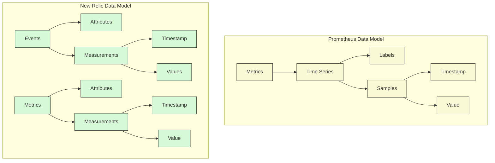
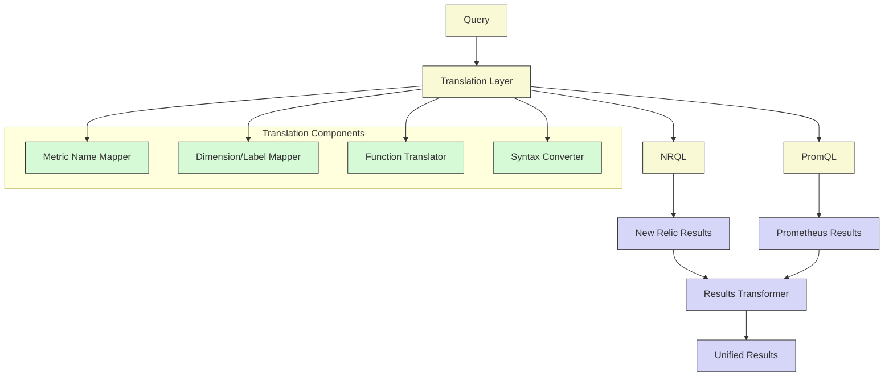
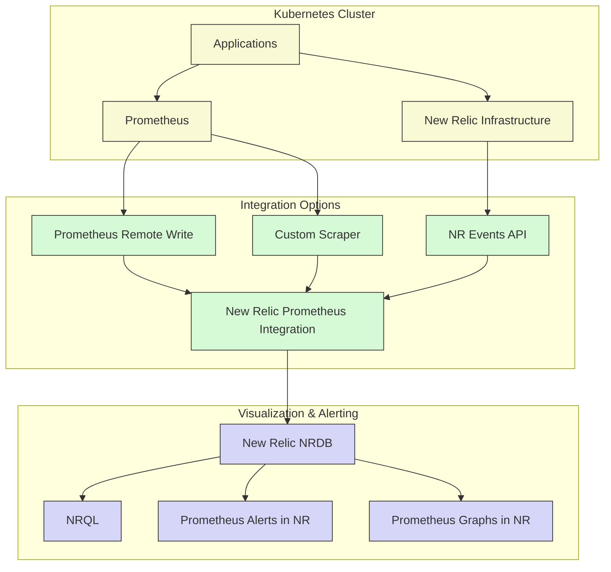

# NRQL vs. Prometheus PromQL: Query Comparison

## Executive Summary

This chapter provides a comprehensive comparison between New Relic Query Language (NRQL) and Prometheus Query Language (PromQL), the two predominant query languages in Kubernetes observability environments. Understanding the similarities, differences, and interoperability between these languages is essential for organizations operating hybrid monitoring architectures or migrating between systems. Through side-by-side comparisons, conversion patterns, and practical examples, this chapter equips readers with the knowledge to effectively utilize both languages in Kubernetes environments.

While both languages serve similar purposes in timeseries data analysis, they embody fundamentally different data models and processing paradigms. NRQL adopts a SQL-like approach optimized for dimensional metrics with advanced analytical capabilities, while PromQL implements a functional approach tailored for real-time operational monitoring. This chapter examines how to leverage the strengths of each language while mitigating their limitations, with a particular focus on Kubernetes monitoring use cases.

## Data Model Comparison

The fundamental data models of New Relic and Prometheus inform the design and capabilities of their respective query languages.



### Key Differences in Data Models

| Aspect | New Relic | Prometheus | Implications |
|--------|-----------|------------|--------------|
| **Core Data Type** | Events (including Metrics, Logs, Traces) | Time Series | NRQL queries are event-centric, PromQL queries are series-centric |
| **Dimensionality** | Attributes on events | Labels on time series | New Relic dimensions are unlimited, Prometheus targets a limited set |
| **Time Handling** | Timestamp is an event property | Timestamp is part of each sample | NRQL requires explicit time windowing, PromQL has implicit time windows |
| **Values** | Multiple values per event | Single value per time series sample | NRQL can correlate multiple measurements, PromQL operates on one value at a time |
| **Data Types** | Strings, numbers, booleans, arrays | Primarily numeric (float64) | NRQL supports richer query operations across data types |
| **Cardinality** | Optimized for high cardinality | Performance degrades with high cardinality | NRQL handles high-dimensional data better than PromQL |
| **Storage** | Column-oriented NRDB | Time Series Database (TSDB) | NRQL optimized for analytical queries, PromQL for fast time-based lookups |

## Query Structure Comparison

NRQL and PromQL have distinctly different syntax and structure, reflecting their different language paradigms.

### Basic Query Structure

| Purpose | NRQL | PromQL | Notes |
|---------|------|--------|-------|
| **Basic data selection** | `FROM Metric SELECT average(value) WHERE metricName = 'system.cpu.utilization'` | `avg(system_cpu_utilization)` | NRQL uses SQL-like FROM-SELECT, PromQL uses function-based approach |
| **Time range selection** | `FROM Metric SELECT ... SINCE 30 minutes ago` | `avg(system_cpu_utilization[30m])` | NRQL has explicit time clause, PromQL uses duration syntax |
| **Dimensional filtering** | `... WHERE container = 'nginx' AND namespace = 'production'` | `avg(system_cpu_utilization{container="nginx", namespace="production"})` | NRQL uses WHERE clauses, PromQL uses label matchers |
| **Aggregation** | `... FACET container, namespace` | `avg by (container, namespace) (system_cpu_utilization)` | NRQL uses FACET, PromQL uses by/without clauses |
| **Calculation** | `... * 100` | `... * 100` | Both support mathematical operations |
| **Rate calculation** | `SELECT rate(count(*), 1 minute)` | `rate(metric_counter_total[1m])` | PromQL has specialized rate functions, NRQL uses general-purpose rate |
| **Percentiles** | `SELECT percentile(duration, 95)` | `histogram_quantile(0.95, sum by(le) (rate(http_request_duration_seconds_bucket[5m])))` | NRQL has built-in percentile function, PromQL uses histogram calculations |

### Advanced Structure

| Feature | NRQL | PromQL | Notes |
|---------|------|--------|-------|
| **Combining metrics** | `FROM Metric SELECT average(metric1)/average(metric2)` | `avg(metric1) / avg(metric2)` | NRQL requires explicit SELECT, PromQL is more concise |
| **Subqueries** | `FROM (...query...) SELECT ...` | `avg_over_time(rate(metric[5m])[30m:1m])` | NRQL uses nested queries, PromQL has specialized subquery syntax |
| **Join capability** | `FROM Metric SELECT ... JOIN ...` | Not available | NRQL supports joins, PromQL doesn't |
| **Window functions** | `SELECT latest(value), earliest(value)` | Custom calculations with offset | NRQL has built-in window functions, PromQL requires workarounds |
| **Pattern matching** | `WHERE metricName LIKE 'system.%'` | `{__name__=~"system_.+"}` | NRQL uses SQL patterns, PromQL uses regular expressions |
| **Alerting syntax** | Separate NRQL alert conditions | Built into PromQL with alerting rules | Prometheus combines query and alerting logic |

## Query Comparison for Kubernetes Monitoring

Here are side-by-side comparisons of common Kubernetes monitoring queries in both languages.

### Container CPU Usage

**NRQL:**
```sql
FROM Metric SELECT average(kubernetes.container.cpuUsage) 
WHERE clusterName = 'production' 
FACET namespace, podName, containerName 
TIMESERIES
```

**PromQL:**
```
avg by (namespace, pod, container) (
  rate(container_cpu_usage_seconds_total{cluster="production"}[5m])
)
```

### Memory Usage vs. Limits

**NRQL:**
```sql
FROM Metric SELECT 
  average(kubernetes.container.memoryUsageBytes) / 1024 / 1024 AS 'Usage (MB)', 
  average(kubernetes.container.memoryLimitBytes) / 1024 / 1024 AS 'Limit (MB)' 
WHERE clusterName = 'production' 
FACET namespace, podName, containerName 
TIMESERIES
```

**PromQL:**
```
avg by (namespace, pod, container) (
  container_memory_usage_bytes{cluster="production"} / 1024 / 1024
)

avg by (namespace, pod, container) (
  container_memory_limits{cluster="production"} / 1024 / 1024
)
```

### Pod Restart Count

**NRQL:**
```sql
FROM Metric SELECT 
  latest(kubernetes.pod.restartCount) - earliest(kubernetes.pod.restartCount) 
WHERE clusterName = 'production' 
FACET namespace, podName 
SINCE 1 hour ago
```

**PromQL:**
```
rate(kube_pod_container_status_restarts_total{cluster="production"}[1h])
```

### Node Resource Utilization

**NRQL:**
```sql
FROM Metric SELECT 
  average(kubernetes.node.cpuUsage) AS 'CPU Usage',
  average(kubernetes.node.memoryUsageBytes) / average(kubernetes.node.memoryCapacityBytes) * 100 AS 'Memory %' 
WHERE clusterName = 'production' 
FACET nodeName 
TIMESERIES
```

**PromQL:**
```
avg by (node) (
  rate(node_cpu_seconds_total{mode!="idle", cluster="production"}[5m])
)

avg by (node) (
  node_memory_MemTotal_bytes{cluster="production"} - node_memory_MemAvailable_bytes{cluster="production"}
) / 
avg by (node) (
  node_memory_MemTotal_bytes{cluster="production"}
) * 100
```

### Service Latency by Percentile

**NRQL:**
```sql
FROM Metric SELECT 
  percentile(http.server.duration, 50, 90, 95, 99) 
WHERE serviceName = 'api-gateway' AND clusterName = 'production' 
FACET namespace 
TIMESERIES
```

**PromQL:**
```
histogram_quantile(0.50, sum by(le, namespace) (rate(http_server_duration_seconds_bucket{service="api-gateway", cluster="production"}[5m])))
histogram_quantile(0.90, sum by(le, namespace) (rate(http_server_duration_seconds_bucket{service="api-gateway", cluster="production"}[5m])))
histogram_quantile(0.95, sum by(le, namespace) (rate(http_server_duration_seconds_bucket{service="api-gateway", cluster="production"}[5m])))
histogram_quantile(0.99, sum by(le, namespace) (rate(http_server_duration_seconds_bucket{service="api-gateway", cluster="production"}[5m])))
```

## Query Translation Patterns

When working in hybrid environments or during migrations, translating between NRQL and PromQL is often necessary. Here are some common translation patterns.

### Basic Metric Queries

| Pattern | NRQL | PromQL | Translation Notes |
|---------|------|--------|------------------|
| **Simple metric** | `FROM Metric SELECT average(metric)` | `avg(metric)` | Map NRQL metric names to PromQL metric names |
| **Filtered metric** | `FROM Metric SELECT average(metric) WHERE attr = 'value'` | `avg(metric{label="value"})` | Map attribute names to label names |
| **Multi-dimensioned metric** | `FROM Metric SELECT average(metric) FACET dim1, dim2` | `avg by (label1, label2) (metric)` | Map FACET dimensions to by clause |
| **Time window** | `FROM Metric SELECT ... SINCE 30 minutes ago UNTIL 5 minutes ago` | `avg_over_time(metric[25m] offset 5m)` | Calculate time window differences |
| **Rate calculation** | `FROM Metric SELECT rate(count(*), 1 minute)` | `rate(metric[1m])` | Use PromQL rate for counters |

### Complex Translations

| Pattern | NRQL | PromQL | Translation Notes |
|---------|------|--------|------------------|
| **Ratio calculation** | `FROM Metric SELECT average(metric1)/average(metric2)` | `avg(metric1) / avg(metric2)` | Simple division is similar |
| **Delta calculation** | `FROM Metric SELECT latest(value) - earliest(value)` | `avg_over_time(metric[time]) - avg_over_time(metric[time] offset time)` | Use offset for time comparison |
| **Percentile calculation** | `FROM Metric SELECT percentile(metric, 95)` | `histogram_quantile(0.95, sum by(le) (rate(metric_bucket[5m])))` | Requires histogram metrics in Prometheus |
| **Top N query** | `FROM Metric SELECT average(metric) FACET dimension LIMIT 5` | PromQL with post-processing | No direct equivalent in PromQL |
| **Event correlation** | `FROM Metric SELECT ... WHERE condition FROM Log SELECT ...` | Not available | Must use separate queries in Prometheus |

### Automated Translation Framework

For organizations with complex hybrid environments, developing an automated translation layer can be beneficial:



## Function Comparison

Both languages provide functions for metric analysis, but with different approaches and capabilities.

### Aggregation Functions

| Purpose | NRQL | PromQL | Notes |
|---------|------|--------|-------|
| **Average** | `average(metric)` | `avg(metric)` | Similar functionality |
| **Sum** | `sum(metric)` | `sum(metric)` | Identical |
| **Minimum** | `min(metric)` | `min(metric)` | Identical |
| **Maximum** | `max(metric)` | `max(metric)` | Identical |
| **Count** | `count(*)` | `count(metric)` | NRQL counts events, PromQL counts series |
| **Percentiles** | `percentile(metric, 95)` | `histogram_quantile(0.95, ...)` | PromQL requires histogram metrics |
| **Standard Deviation** | `stddev(metric)` | No direct equivalent | Must be calculated in PromQL |
| **Histogram** | `histogram(metric, 10)` | `histogram_quantile()` series | Different approaches to histograms |

### Time Functions

| Purpose | NRQL | PromQL | Notes |
|---------|------|--------|-------|
| **Rate** | `rate(count(*), 1 minute)` | `rate(metric[1m])` | PromQL rate only for counters |
| **Increase** | `latest(metric) - earliest(metric)` | `increase(metric[time])` | PromQL has specialized function |
| **Time comparison** | `COMPARE WITH 1 week ago` | No direct equivalent | Requires multiple queries in PromQL |
| **Moving average** | `average(metric)` with time window | `avg_over_time(metric[time])` | Different time window syntax |
| **Derivative** | `derivative(metric, 1 minute)` | `deriv(metric[time])` | Similar functionality |
| **Prediction** | `predict(metric)` | `predict_linear()` | Different prediction models |

### Special Functions

| Purpose | NRQL | PromQL | Notes |
|---------|------|--------|-------|
| **Filter outliers** | `filter(where metric < x)` | Filtering with threshold | Different approaches |
| **Resampling** | `TIMESERIES AUTO` | Vector processing | Built into NRQL |
| **String operations** | `concat()`, `substring()` | Limited support | NRQL has better string handling |
| **Metadata access** | `metricName`, attributes | Labels | Different metadata models |
| **Result limiting** | `LIMIT 10` | No direct equivalent | Requires post-processing in PromQL |
| **Result ordering** | `ORDER BY x DESC` | No direct equivalent | Requires post-processing in PromQL |

## Strengths and Limitations

Understanding the strengths and limitations of each language helps in selecting the appropriate language for specific use cases.

### NRQL Strengths

1. **SQL-like Familiarity**: Easier learning curve for those familiar with SQL
2. **Multi-data type Support**: Can query metrics, logs, and traces with the same language
3. **Advanced Analytics**: Better support for complex analytical queries
4. **High Cardinality Handling**: Better performance with high-dimensional data
5. **Joins and Correlations**: Can join data across different sources
6. **Rich Functions**: More built-in functions for complex calculations
7. **Time Comparisons**: Easy syntax for historical comparisons
8. **Long-term Storage**: Better for historical analysis and trend detection

### NRQL Limitations

1. **Query Complexity**: Can be verbose for simple operational checks
2. **Real-time Monitoring**: Slightly higher latency than PromQL
3. **Specialized Functions**: Lacks some time-series specific functions
4. **Alerting Integration**: Less tightly integrated with alerting
5. **Open-Source Ecosystem**: Smaller community and fewer integrations

### PromQL Strengths

1. **Operational Focus**: Optimized for real-time monitoring
2. **Concise Syntax**: More compact for common monitoring queries
3. **Rate and Counter Functions**: Better handling of counter-type metrics
4. **Alerting Integration**: Tightly integrated with Prometheus alerting
5. **Open-Source Ecosystem**: Large community and many integrations
6. **Label-based Model**: Consistent approach to dimensional data
7. **Time Window Handling**: More intuitive for time-based operations
8. **Real-time Performance**: Lower latency for recent data

### PromQL Limitations

1. **Complex Analytics**: Limited capabilities for advanced analysis
2. **High Cardinality**: Performance degrades with high-dimensional data
3. **Data Types**: Primarily focused on numeric data
4. **Historical Analysis**: Less optimized for long-term data
5. **Query Composition**: More difficult to compose complex queries
6. **Cross-data Correlation**: Cannot easily join different data types
7. **String Handling**: Limited string operation support
8. **Metadata Querying**: Less flexible for metadata-based queries

## Common Query Recipes

This section provides ready-to-use query recipes for monitoring Kubernetes environments in both languages.

### Resource Monitoring

#### CPU Usage by Namespace

**NRQL:**
```sql
FROM Metric SELECT average(kubernetes.container.cpuUsage) 
WHERE clusterName = 'production' 
FACET namespace 
TIMESERIES AUTO
```

**PromQL:**
```
sum by (namespace) (
  rate(container_cpu_usage_seconds_total{cluster="production"}[5m])
)
```

#### Memory Pressure Detection

**NRQL:**
```sql
FROM Metric SELECT 
  average(kubernetes.container.memoryUsageBytes) / average(kubernetes.container.memoryLimitBytes) * 100 AS 'Memory Utilization %'
WHERE clusterName = 'production' AND kubernetes.container.memoryLimitBytes > 0
FACET namespace, podName 
TIMESERIES AUTO
```

**PromQL:**
```
sum by (namespace, pod) (
  container_memory_usage_bytes{cluster="production"}
) /
sum by (namespace, pod) (
  container_memory_limits{cluster="production"}
) * 100
```

### Service Health

#### Error Rate by Service

**NRQL:**
```sql
FROM Metric SELECT 
  filter(count(*), WHERE httpResponseCode >= 500) / count(*) * 100 AS 'Error Rate %'
WHERE serviceName IS NOT NULL AND clusterName = 'production'
FACET serviceName 
TIMESERIES AUTO
```

**PromQL:**
```
sum by (service) (
  rate(http_requests_total{code=~"5..", cluster="production"}[5m])
) /
sum by (service) (
  rate(http_requests_total{cluster="production"}[5m])
) * 100
```

#### Apdex Score

**NRQL:**
```sql
FROM Metric SELECT 
  (filter(count(*), WHERE duration <= 0.1) + filter(count(*), WHERE duration > 0.1 AND duration <= 0.5) / 2) / count(*) AS 'Apdex' 
WHERE serviceName IS NOT NULL AND clusterName = 'production'
FACET serviceName 
TIMESERIES AUTO
```

**PromQL:**
```
(
  sum by (service) (rate(http_request_duration_seconds_bucket{le="0.1", cluster="production"}[5m]))
  +
  sum by (service) (
    rate(http_request_duration_seconds_bucket{le="0.5", cluster="production"}[5m])
    -
    rate(http_request_duration_seconds_bucket{le="0.1", cluster="production"}[5m])
  ) / 2
) /
sum by (service) (rate(http_request_duration_seconds_count{cluster="production"}[5m]))
```

### Infrastructure Health

#### Node Resource Saturation

**NRQL:**
```sql
FROM Metric SELECT 
  average(kubernetes.node.cpuUsage) * 100 AS 'CPU %',
  average(kubernetes.node.memoryUsageBytes) / average(kubernetes.node.memoryCapacityBytes) * 100 AS 'Memory %',
  average(kubernetes.node.fsUsage) * 100 AS 'Disk %'
WHERE clusterName = 'production'
FACET nodeName 
TIMESERIES AUTO
```

**PromQL:**
```
# CPU
(1 - avg by (node) (rate(node_cpu_seconds_total{mode="idle", cluster="production"}[5m]))) * 100

# Memory
(1 - node_memory_MemAvailable_bytes{cluster="production"} / node_memory_MemTotal_bytes{cluster="production"}) * 100

# Disk
(1 - node_filesystem_avail_bytes{mountpoint="/", cluster="production"} / node_filesystem_size_bytes{mountpoint="/", cluster="production"}) * 100
```

#### Network Traffic by Pod

**NRQL:**
```sql
FROM Metric SELECT 
  rate(sum(kubernetes.container.networkRxBytes), 1 minute) / 1024 / 1024 AS 'Receive MB/s',
  rate(sum(kubernetes.container.networkTxBytes), 1 minute) / 1024 / 1024 AS 'Transmit MB/s'
WHERE clusterName = 'production'
FACET namespace, podName 
TIMESERIES AUTO
```

**PromQL:**
```
# Receive
sum by (namespace, pod) (
  rate(container_network_receive_bytes_total{cluster="production"}[1m])
) / 1024 / 1024

# Transmit
sum by (namespace, pod) (
  rate(container_network_transmit_bytes_total{cluster="production"}[1m])
) / 1024 / 1024
```

## Advanced Query Techniques

This section covers advanced techniques unique to each language.

### NRQL Advanced Techniques

#### 1. Funnel Analysis

```sql
FROM Transaction SELECT funnel(
  session, 
  WHERE name = 'WebTransaction/Action/home' AS 'Home',
  WHERE name = 'WebTransaction/Action/search' AS 'Search',
  WHERE name = 'WebTransaction/Action/product' AS 'Product View',
  WHERE name = 'WebTransaction/Action/checkout' AS 'Checkout'
) WHERE appName = 'ECommerce' SINCE 1 day ago
```

#### 2. Anomaly Detection

```sql
FROM Metric SELECT anomalous(average(kubernetes.container.cpuUsage), 'baseline', 3) 
WHERE clusterName = 'production' 
FACET namespace, podName 
TIMESERIES AUTO
```

#### 3. Cohort Analysis

```sql
FROM PageView SELECT cohorts(userId, duration, 1 day) 
WHERE appName = 'Mobile' SINCE 14 days ago
```

#### 4. Uniques and Cardinality

```sql
FROM Metric SELECT uniqueCount(podName) 
WHERE clusterName = 'production' 
FACET namespace, serviceName 
TIMESERIES AUTO
```

### PromQL Advanced Techniques

#### 1. Prediction and Trends

```
predict_linear(node_filesystem_free_bytes{mountpoint="/"}[6h], 24 * 3600)
```

#### 2. Selectors and Matchers

```
sum by (namespace) (kube_pod_info{cluster="production", namespace=~".*api.*"})
```

#### 3. Binary Operators

```
(node_memory_MemTotal_bytes - node_memory_MemFree_bytes - node_memory_Cached_bytes) / node_memory_MemTotal_bytes > 0.8
```

#### 4. Vector Matching

```
sum by (pod) (rate(container_cpu_usage_seconds_total[5m])) / on (pod) kube_pod_container_resource_limits{resource="cpu"}
```

## Performance Optimization

Query performance is critical for responsive dashboards and timely alerts. This section provides optimization techniques for both languages.

### NRQL Performance Tips

1. **Use appropriate time window**: Limit SINCE/UNTIL to necessary timeframes
2. **Limit FACET cardinality**: Avoid FACETs with hundreds of unique values
3. **Filter early**: Apply WHERE clauses to reduce data processed
4. **Avoid excessive JOINs**: Joins can be resource-intensive
5. **Use TIMESERIES AUTO**: Let New Relic determine optimal resolution
6. **Leverage indexed attributes**: Query on indexed fields when possible
7. **Use aggregation**: Prefer aggregated metrics over raw events
8. **Avoid nested queries**: Break complex queries into dashboard components

### PromQL Performance Tips

1. **Optimize time ranges**: Keep ranges as narrow as possible 
2. **Avoid high cardinality**: Limit the cardinality of by clauses
3. **Use efficient functions**: Prefer specialized functions where available
4. **Reduce label matching**: Minimize regex and complex matchers
5. **Use recording rules**: Pre-compute expensive expressions
6. **Avoid expensive operations**: PromQL's sort, topk are expensive
7. **Test query performance**: Use Prometheus's graph UI to measure query timing
8. **Increase step interval**: Use larger steps for historical data

## Integration Patterns

In hybrid monitoring environments, integration between New Relic and Prometheus is common. This section covers patterns for effective integration.

### Data Flow Architectures



### Integration Methods

1. **Prometheus Remote Write**: Configure Prometheus to write directly to New Relic
2. **OpenTelemetry Collector**: Use OTel to collect and forward to both systems
3. **Federated Querying**: Query both systems and combine results
4. **New Relic Prometheus Integration**: Use New Relic's built-in integration
5. **Grafana Integration**: Use Grafana to visualize both data sources

### Implementation Considerations

- **Metric Naming Consistency**: Establish consistent naming between systems
- **Dimension/Label Mapping**: Create a mapping between dimensions and labels
- **Federated Dashboards**: Design dashboards with data from both sources
- **Alerting Strategy**: Decide primary alerting system and integration pattern
- **Data Resolution**: Align data collection frequencies
- **Retention Policies**: Determine appropriate retention in each system

## Case Studies

### Large-scale Kubernetes Monitoring

A global financial services company used a hybrid approach with New Relic and Prometheus:

- **Prometheus**: Used for real-time operational monitoring and local alerting
- **New Relic**: Used for long-term analysis, business metrics, and cross-service correlation
- **Integration**: Implemented remote write from Prometheus to New Relic
- **Query Usage**: Operations teams used PromQL for day-to-day, Data teams used NRQL for analysis

Key metrics:
- 500+ node Kubernetes cluster
- 5000+ pods across multiple namespaces
- 50+ service teams

Query patterns:
- PromQL for real-time troubleshooting and local alerting
- NRQL for cross-service analysis and business impact assessment

### E-commerce Migration

A retail company migrating from Prometheus to New Relic implemented a phased approach:

- **Phase 1**: Basic metrics in both systems with dashboards comparison
- **Phase 2**: Advanced NRQL queries for business metrics
- **Phase 3**: Complete transition to New Relic with Prometheus as backup

Key learning points:
- Created translation layer for common PromQL queries
- Developed templates for service teams to migrate dashboards
- Implemented automated testing to verify consistent results

## Conclusion

Both NRQL and PromQL offer powerful capabilities for Kubernetes monitoring, each with distinct strengths. NRQL excels in complex analytical queries, high-cardinality environments, and multi-data correlation, while PromQL provides concise syntax for operational monitoring and tight integration with the Prometheus ecosystem.

Organizations operating in hybrid environments benefit from understanding both languages and leveraging them appropriately. The query patterns, translations, and optimization techniques presented in this chapter provide a practical framework for effective monitoring in complex Kubernetes environments, whether using New Relic, Prometheus, or both in combination.

By mastering these query languages, teams can extract maximum value from their observability data, enabling faster troubleshooting, better capacity planning, and more informed business decisions.

---

**Next Chapter**: [Performance Analysis](./02_Performance_Analysis.md)