# Performance Analysis Queries for Kubernetes

## Executive Summary

This chapter provides a comprehensive collection of advanced NRQL queries designed for deep performance analysis of Kubernetes environments. Performance analysis in containerized environments presents unique challenges—ephemeral workloads, multi-layered dependencies, and distributed architectures make traditional monitoring approaches insufficient. To address these challenges, this chapter offers specialized query patterns that leverage New Relic's dimensional data model and analytical capabilities to provide actionable insights into Kubernetes performance issues across infrastructure, applications, and services.

Moving beyond basic monitoring, these query patterns are designed to identify bottlenecks, correlate performance across system layers, detect anomalies, and support root cause analysis. Each query is explained with practical implementation guidance, expected visualization approach, and interpretation considerations. While the focus is on NRQL, comparative examples are provided for hybrid environments using Prometheus alongside New Relic. Whether you're troubleshooting a production incident, conducting capacity planning, or optimizing application performance, these query patterns provide the analytical foundation necessary for effective Kubernetes performance engineering.

## Foundational Query Patterns

Before diving into specific domains, these foundational query patterns establish a consistent approach to Kubernetes performance analysis.

### Multi-dimensional Performance Aggregation

This pattern creates a hierarchical view of performance metrics across Kubernetes layers.

```sql
FROM Metric SELECT
  average(kubernetes.container.cpuUsage) * 100 AS 'CPU %',
  average(kubernetes.container.memoryUsageBytes)/1024/1024/1024 AS 'Memory (GB)'
WHERE clusterName = '${cluster}'
FACET namespace, deploymentName, podName
LIMIT MAX
```

Key characteristics of this pattern:
- Organizes metrics by Kubernetes hierarchy (namespace → deployment → pod)
- Applies consistent unit conversion for human readability
- Uses parameterization for flexible dashboard implementation
- Provides multi-dimensional analysis of resource usage

### Resource Saturation Analysis


### Resource Utilization vs. Limits

This pattern compares actual utilization against configured limits to identify potential contention.

```sql
FROM Metric SELECT
  average(kubernetes.container.cpuUsage)/average(kubernetes.container.cpuLimits) * 100 AS 'CPU Utilization %',
  average(kubernetes.container.memoryUsageBytes)/average(kubernetes.container.memoryLimitBytes) * 100 AS 'Memory Utilization %'
WHERE clusterName = '${cluster}' AND kubernetes.container.cpuLimits > 0 AND kubernetes.container.memoryLimitBytes > 0
FACET namespace, deploymentName
TIMESERIES AUTO
```

Key metrics to analyze:
- **Near Limit (>80%)**: Indicates potential resource contention
- **Exceeding Soft Limits**: Can lead to throttling
- **Consistently Low (<30%)**: Suggests over-provisioning
- **High Variability**: Indicates potential for autoscaling optimization

### Golden Signals Correlation

```sql
FROM Metric, Transaction SELECT
  filter(count(*), WHERE httpResponseCode >= 400)/count(*) * 100 AS 'Error Rate %',
  average(duration) * 1000 AS 'Latency (ms)',
  rate(count(*), 1 minute) AS 'Requests/Min',
  average(kubernetes.container.cpuUsage) * 100 AS 'CPU %',
  average(kubernetes.container.memoryUsageBytes)/average(kubernetes.container.memoryLimitBytes) * 100 AS 'Memory %'
WHERE clusterName = '${cluster}' AND serviceName = '${service}'
TIMESERIES AUTO
```

This pattern correlates application-level golden signals with infrastructure metrics to identify resource-related performance issues.

## Node-Level Performance Analysis

Node-level analysis is critical for identifying infrastructure bottlenecks that impact multiple workloads.

### Node Resource Saturation

```sql
FROM Metric SELECT
  average(k8s.node.cpu.utilization) * 100 AS 'CPU Utilization %',
  average(k8s.node.memory.utilization) * 100 AS 'Memory Utilization %',
  average(system.disk.utilization) * 100 AS 'Disk Utilization %',
  average(system.net.transmitBytesPerSecond)/1024/1024 AS 'Network Tx (MB/s)',
  average(system.net.receiveBytesPerSecond)/1024/1024 AS 'Network Rx (MB/s)'
WHERE clusterName = '${cluster}'
FACET nodeName
TIMESERIES AUTO
```

### Node Comparison with Anomaly Detection

```sql
FROM Metric SELECT
  average(k8s.node.cpu.utilization) * 100 AS 'CPU Utilization %',
  anomalous(average(k8s.node.cpu.utilization) * 100, 'baseline', 3) AS 'CPU Anomaly Score'
WHERE clusterName = '${cluster}'
FACET nodeName
TIMESERIES AUTO
```

This pattern identifies nodes that deviate from the cluster baseline, which may indicate:
- Hardware issues
- Noisy neighbor problems
- Unbalanced workload distribution
- Incorrect node affinity configurations

### Node Capacity Analysis

```mermaid
graph TD
    subgraph "Node Capacity Analysis"
        CP[Capacity Planning]
        UT[Utilization Tracking]
        TR[Trend Analysis]
        CP --> TR
        UT --> TR
    end
    
    subgraph "Capacity Planning Metrics"
        TE[Total/Effective Capacity]
        RE[Reserved Capacity]
        RE --> System[System Overhead]
        RE --> Daemon[DaemonSet Requirements]
        RE --> Buffer[Safety Buffer]
        AL[Allocatable Capacity]
        TE --> AL
        RE --> AL
    end
    
    subgraph "Utilization Analysis"
        RU[Resource Usage]
        RQ[Resource Requests]
        RL[Resource Limits]
        AR[Allocation Ratio]
        RU --> AR
        RQ --> AR
        RL --> AR
    end
    
    subgraph "Key Indicators"
        SR[Saturation Ratio]
        FR[Fragmentation Ratio]
        UR[Utilization Ratio]
        EF[Efficiency Score]
    end
    
    TR --> SR & FR & UR & EF
    
    classDef process fill:#f9f9d6,stroke:#333,stroke-width:1px
    classDef metrics fill:#d6f9d6,stroke:#333,stroke-width:1px
    classDef analysis fill:#d6e6f9,stroke:#333,stroke-width:1px
    classDef indicators fill:#f9d6e6,stroke:#333,stroke-width:1px
    
    class CP,UT,TR process
    class TE,RE,System,Daemon,Buffer,AL metrics
    class RU,RQ,RL,AR analysis
    class SR,FR,UR,EF indicators
```



### Node Pressure Conditions

```sql
FROM Metric SELECT
  latest(kubernetes.node.pressureCondition.cpu) AS 'CPU Pressure',
  latest(kubernetes.node.pressureCondition.memory) AS 'Memory Pressure',
  latest(kubernetes.node.pressureCondition.disk) AS 'Disk Pressure',
  latest(kubernetes.node.pressureCondition.pid) AS 'PID Pressure'
WHERE clusterName = '${cluster}'
FACET nodeName
TIMESERIES AUTO
```

This query pattern identifies control plane resource pressure conditions, which are critical early warning indicators of node-level issues.

## Pod and Container Analysis

Pod and container-level analysis focuses on the specific workloads running in your Kubernetes environment.

### Container Resource Efficiency

```sql
FROM Metric SELECT
  average(kubernetes.container.cpuUsage)/average(kubernetes.container.cpuRequests) * 100 AS 'CPU Usage/Requests %',
  average(kubernetes.container.memoryUsageBytes)/average(kubernetes.container.memoryRequestBytes) * 100 AS 'Memory Usage/Requests %'
WHERE clusterName = '${cluster}' AND kubernetes.container.cpuRequests > 0 AND kubernetes.container.memoryRequestBytes > 0
FACET namespace, deploymentName
TIMESERIES AUTO
```

This query helps identify over or under-provisioned containers by comparing actual usage to requested resources, supporting more efficient resource allocation.

### Container Throttling Detection

```sql
FROM Metric SELECT
  rate(sum(kubernetes.container.cpuThrottledSeconds), 1 minute) AS 'Throttled Seconds/Min',
  rate(sum(kubernetes.container.cpuThrottledSeconds), 1 minute) / 60 * 100 AS 'Throttling %'
WHERE clusterName = '${cluster}'
FACET namespace, podName, containerName
TIMESERIES AUTO
```

Throttling indicates CPU limits are constraining performance, requiring either:
- Increase in CPU limits
- Application optimization
- Workload distribution changes

### Memory Pressure Analysis

```sql
FROM Metric SELECT
  average(kubernetes.container.memoryWorkingSetBytes)/average(kubernetes.container.memoryLimitBytes) * 100 AS 'Working Set %',
  average(kubernetes.container.memoryWorkingSetBytes)/average(kubernetes.container.memoryRequestBytes) * 100 AS 'Working Set/Requests %',
  rate(sum(kubernetes.container.memoryMajorPageFaults), 1 minute) AS 'Major Page Faults/Min',
  count(kubernetes.container.oomKill) AS 'OOM Kills'
WHERE clusterName = '${cluster}'
FACET namespace, podName, containerName
TIMESERIES AUTO
```

This pattern helps identify memory-related issues with containers:
- Working Set approaching limits indicates potential OOM kills
- High page fault rates indicate potential swap activity
- OOM kills indicate immediate need for memory limit increases

### Restart Pattern Analysis

```sql
FROM Metric SELECT
  rate(sum(kubernetes.pod.restartCount), 1 hour) AS 'Restarts/Hour',
  latest(kubernetes.pod.restartCount) AS 'Total Restarts',
  latest(kubernetes.pod.status) AS 'Current Status'
WHERE clusterName = '${cluster}'
FACET namespace, podName
TIMESERIES AUTO
```

Analyzing restart patterns helps identify:
- Crash loops indicating application errors
- Resource pressure causing containers to be killed
- Probe failures indicating unhealthy applications
- Node issues causing pod evictions

## Service-Level Performance Analysis

Service-level analysis focuses on the performance characteristics of your application services.

### Service Golden Signals Dashboard


### Service Latency Analysis

```sql
FROM Transaction SELECT
  percentile(duration, 50, 90, 95, 99) * 1000 AS 'Latency (ms)'
WHERE appName = '${app}' AND serviceName = '${service}'
FACET segmentName
TIMESERIES AUTO
```

This query breaks down latency by segment, helping identify which parts of the service chain contribute most to overall latency.

### Service Dependency Map Query

```sql
FROM Span SELECT
  count(*) AS 'Calls',
  average(duration) * 1000 AS 'Avg Duration (ms)',
  percentage(count(*), WHERE error IS TRUE) AS 'Error %'
WHERE clusterName = '${cluster}' AND serviceName = '${service}'
FACET serviceName, name
LIMIT MAX
```

This query creates service dependency metrics that can be visualized as a service map, helping to identify:
- High-latency dependencies
- Error-prone service interactions 
- Call frequency between services

### Apdex Analysis

```sql
FROM Transaction SELECT
  filter(count(*), WHERE duration <= 0.1)/count(*) + filter(count(*), WHERE duration > 0.1 AND duration <= 0.5)/(count(*) * 2) AS 'Apdex Score',
  filter(count(*), WHERE duration <= 0.1)/count(*) AS 'Satisfied %',
  filter(count(*), WHERE duration > 0.1 AND duration <= 0.5)/count(*) AS 'Tolerating %',
  filter(count(*), WHERE duration > 0.5)/count(*) AS 'Frustrated %'
WHERE appName = '${app}'
FACET serviceName
TIMESERIES AUTO
```

Apdex provides a standardized measurement of user satisfaction with application performance:
- Score > 0.94: Excellent user experience
- Score 0.85-0.94: Good user experience
- Score 0.70-0.85: Fair user experience
- Score < 0.70: Poor user experience

## Kubernetes Workload Analysis

These queries focus on the broader Kubernetes workload characteristics.

### Deployment Scaling Analysis

```sql
FROM Metric SELECT
  latest(kubernetes.deployment.desiredReplicas) AS 'Desired Replicas',
  latest(kubernetes.deployment.availableReplicas) AS 'Available Replicas',
  latest(kubernetes.hpa.currentReplicas) AS 'Current Replicas',
  latest(kubernetes.hpa.desiredReplicas) AS 'HPA Desired',
  latest(kubernetes.hpa.maxReplicas) AS 'HPA Max',
  latest(kubernetes.hpa.minReplicas) AS 'HPA Min'
WHERE clusterName = '${cluster}'
FACET namespace, deploymentName
TIMESERIES AUTO
```

This query pattern allows analysis of autoscaler behavior and deployment scaling patterns to:
- Identify scaling limitations
- Understand autoscaling trigger patterns
- Detect deployment failures
- Optimize HPA configurations

### Resource Requests vs. Limits Analysis

```sql
FROM Metric SELECT
  average(kubernetes.container.cpuRequests) AS 'CPU Requests',
  average(kubernetes.container.cpuLimits) AS 'CPU Limits',
  average(kubernetes.container.cpuRequests)/average(kubernetes.container.cpuLimits) * 100 AS 'CPU Requests/Limits %',
  average(kubernetes.container.memoryRequestBytes)/1024/1024/1024 AS 'Memory Requests (GB)',
  average(kubernetes.container.memoryLimitBytes)/1024/1024/1024 AS 'Memory Limits (GB)',
  average(kubernetes.container.memoryRequestBytes)/average(kubernetes.container.memoryLimitBytes) * 100 AS 'Memory Requests/Limits %'
WHERE clusterName = '${cluster}'
FACET namespace, deploymentName
LIMIT MAX
```

This analysis helps identify:
- QoS class implications (Guaranteed, Burstable, BestEffort)
- Potential resource contention
- Over-allocation of resources
- Inconsistent resource configurations

### Pod Disruption Analysis

```sql
FROM Metric SELECT
  count(kubernetes.pod.phase) WHERE kubernetes.pod.phase = 'Pending' AS 'Pending Pods',
  count(kubernetes.pod.phase) WHERE kubernetes.pod.phase = 'Failed' AS 'Failed Pods',
  count(kubernetes.pod.phase) WHERE kubernetes.pod.phase = 'Unknown' AS 'Unknown Pods',
  sum(kubernetes.pod.containerStatusWaiting) AS 'Waiting Containers',
  sum(kubernetes.pod.containerStatusTerminated) AS 'Terminated Containers'
WHERE clusterName = '${cluster}'
FACET namespace
TIMESERIES AUTO
```

This pattern identifies disruptions to pod scheduling and execution, which could indicate:
- Resource constraints preventing scheduling
- ConfigMap or Secret mounting issues
- Image pull failures
- Container runtime issues
- Node taints or affinity conflicts

## Performance Anomaly Detection

These query patterns focus on identifying abnormal behavior in your Kubernetes environment.

### Baseline Deviation Analysis

```sql
FROM Metric SELECT
  average(kubernetes.container.cpuUsage) * 100 AS 'CPU %',
  anomalous(average(kubernetes.container.cpuUsage) * 100, 'baseline', 3) AS 'CPU Anomaly Score'
WHERE clusterName = '${cluster}'
FACET namespace, deploymentName
TIMESERIES AUTO
```

This pattern uses New Relic's anomaly detection to identify workloads deviating from their normal baseline behavior, which may indicate:
- Application performance issues
- Unexpected load patterns
- Resource constraints
- Configuration changes impact

### Z-Score Analysis

```sql
FROM Metric SELECT
  average(kubernetes.container.cpuUsage) AS avg_cpu,
  stddev(kubernetes.container.cpuUsage) AS sd_cpu,
  (latest(kubernetes.container.cpuUsage) - average(kubernetes.container.cpuUsage)) / stddev(kubernetes.container.cpuUsage) AS 'CPU Z-Score'
WHERE clusterName = '${cluster}'
FACET namespace, deploymentName
LIMIT MAX
```

Z-score analysis identifies statistically significant deviations from normal behavior:
- Z-score > 2: Unusual behavior (95% confidence)
- Z-score > 3: Very unusual behavior (99.7% confidence)
- Z-score > 4: Extremely unusual behavior (99.99% confidence)

### Outlier Detection

```sql
FROM Metric SELECT
  average(kubernetes.container.cpuUsage) * 100 AS 'CPU %',
  average(kubernetes.container.memoryUsageBytes)/1024/1024/1024 AS 'Memory (GB)'
WHERE clusterName = '${cluster}'
FACET podName
WITH OUTLIERS
LIMIT MAX
```

The `WITH OUTLIERS` clause identifies pods with resource usage patterns that significantly deviate from their peers.

### Change Point Detection

```sql
SELECT filter(average(kubernetes.container.cpuUsage) * 100, WHERE changePoint(average(kubernetes.container.cpuUsage)) IS TRUE) AS 'CPU Change Points'
FROM Metric
WHERE clusterName = '${cluster}'
FACET namespace, deploymentName
TIMESERIES AUTO
```

This pattern identifies significant shifts in resource usage patterns that might indicate:
- Deployment of new code
- Configuration changes
- Workload characteristic changes
- Environmental factors

## Cross-System Correlation

These query patterns correlate data across different parts of the system stack.

### Node-to-Pod Impact Analysis

```sql
FROM Metric SELECT
  average(k8s.node.cpu.utilization) * 100 AS 'Node CPU %',
  average(kubernetes.container.cpuUsage) * 100 AS 'Container CPU %',
  average(duration) * 1000 AS 'Transaction Duration (ms)'
FROM Transaction, Metric
WHERE clusterName = '${cluster}' AND nodeName = '${node}'
FACET serviceName, podName
TIMESERIES AUTO
```

This pattern correlates node-level metrics with container and service performance to identify how infrastructure issues impact application performance.

### Database-to-Service Correlation

```sql
FROM Metric, Transaction, SlowQuery SELECT
  rate(count(SlowQuery), 1 minute) AS 'Slow Queries/Min',
  average(Transaction.duration) * 1000 AS 'Service Latency (ms)',
  average(Metric.kubernetes.container.cpuUsage) * 100 AS 'Container CPU %'
WHERE Transaction.serviceName = '${service}' AND SlowQuery.databaseName = '${database}'
TIMESERIES AUTO
```

This analysis correlates database performance with service performance to identify database-related bottlenecks.

### Error Correlation Matrix

```sql
FROM TransactionError, Metric SELECT
  count(*) AS 'Error Count',
  average(Metric.kubernetes.container.cpuUsage) * 100 AS 'CPU %',
  average(Metric.kubernetes.container.memoryUsageBytes)/average(Metric.kubernetes.container.memoryLimitBytes) * 100 AS 'Memory %'
WHERE TransactionError.serviceName = '${service}' AND Metric.serviceName = '${service}'
FACET TransactionError.errorType, podName
TIMESERIES AUTO
```

This pattern correlates error occurrences with resource utilization to identify resource-related error triggers.

## Network Performance Analysis

Network performance is critical in Kubernetes environments due to the distributed nature of containerized applications.

### Kubernetes Network Analysis


### Container Network Throughput

```sql
FROM Metric SELECT
  rate(sum(kubernetes.container.networkRxBytes), 1 minute)/1024/1024 AS 'Network Rx (MB/min)',
  rate(sum(kubernetes.container.networkTxBytes), 1 minute)/1024/1024 AS 'Network Tx (MB/min)'
WHERE clusterName = '${cluster}'
FACET namespace, podName, containerName
TIMESERIES AUTO
```

### Service Mesh Performance

```sql
FROM Span SELECT
  count(*) AS 'Request Count',
  average(duration) * 1000 AS 'Avg Duration (ms)',
  filter(count(*), WHERE error IS TRUE)/count(*) * 100 AS 'Error %'
WHERE clusterName = '${cluster}' AND meshType = 'istio'
FACET serviceName, destinationServiceName
TIMESERIES AUTO
```

This pattern analyzes service mesh telemetry to understand communication patterns between services.

### DNS Performance Analysis

```sql
FROM Metric SELECT
  average(k8s.dns.request.duration) * 1000 AS 'DNS Request Duration (ms)',
  rate(sum(k8s.dns.request.count), 1 minute) AS 'Requests/Min',
  filter(sum(k8s.dns.request.count), WHERE k8s.dns.request.rcode != 'NOERROR')/sum(k8s.dns.request.count) * 100 AS 'DNS Error %'
WHERE clusterName = '${cluster}'
FACET k8s.dns.request.type
TIMESERIES AUTO
```

DNS performance is critical for service discovery in Kubernetes:
- High DNS latency impacts overall service performance
- DNS errors can cause service connectivity issues
- High DNS query rates might indicate inefficient client-side caching

## Storage Performance Analysis

Storage performance can be a significant bottleneck in Kubernetes environments.

### Persistent Volume Performance

```sql
FROM Metric SELECT
  average(kubernetes.volume.availableBytes)/average(kubernetes.volume.capacityBytes) * 100 AS 'Available %',
  average(kubernetes.volume.fsUsage) * 100 AS 'Usage %',
  rate(sum(kubernetes.volume.readBytes), 1 minute)/1024/1024 AS 'Read MB/min',
  rate(sum(kubernetes.volume.writeBytes), 1 minute)/1024/1024 AS 'Write MB/min'
WHERE clusterName = '${cluster}'
FACET namespace, podName, persistentVolumeName
TIMESERIES AUTO
```

### I/O Wait Analysis

```sql
FROM Metric SELECT
  average(system.diskio.ioWaitPercent) * 100 AS 'I/O Wait %',
  average(system.diskio.readBytesPerSecond)/1024/1024 AS 'Read MB/s',
  average(system.diskio.writeBytesPerSecond)/1024/1024 AS 'Write MB/s',
  average(system.diskio.readOperationsPerSecond) AS 'Read IOPS',
  average(system.diskio.writeOperationsPerSecond) AS 'Write IOPS'
WHERE clusterName = '${cluster}'
FACET nodeName, deviceName
TIMESERIES AUTO
```

I/O wait percentage greater than 10% typically indicates storage bottlenecks that may impact application performance.

### Storage Class Performance Comparison

```sql
FROM Metric SELECT
  average(kubernetes.volume.fsUsage) * 100 AS 'Usage %',
  rate(sum(kubernetes.volume.readOperations), 1 minute) AS 'Read Ops/Min',
  rate(sum(kubernetes.volume.writeOperations), 1 minute) AS 'Write Ops/Min',
  rate(sum(kubernetes.volume.readBytes), 1 minute)/1024/1024 AS 'Read MB/min',
  rate(sum(kubernetes.volume.writeBytes), 1 minute)/1024/1024 AS 'Write MB/min'
WHERE clusterName = '${cluster}'
FACET kubernetes.volume.storageClass
TIMESERIES AUTO
```

This pattern helps compare performance characteristics across different storage classes to inform storage provisioning decisions.

## Performance Optimization Insights

These query patterns are designed to provide actionable insights for performance optimization.

### Resource Efficiency Analysis

```sql
FROM Metric SELECT
  average(kubernetes.container.cpuUsage)/average(kubernetes.container.cpuRequests) * 100 AS 'CPU Usage/Requests %',
  average(kubernetes.container.memoryUsageBytes)/average(kubernetes.container.memoryRequestBytes) * 100 AS 'Memory Usage/Requests %'
WHERE clusterName = '${cluster}' AND kubernetes.container.cpuRequests > 0 AND kubernetes.container.memoryRequestBytes > 0
FACET namespace, deploymentName
TIMESERIES AUTO
```

Key interpretation guidelines:
- **< 50%**: Significantly over-provisioned, can reduce requests
- **50-70%**: Moderately over-provisioned, potential for optimization
- **70-90%**: Well-balanced allocation
- **> 90%**: Under-provisioned, at risk of resource contention

### Autoscaling Effectiveness

```sql
FROM Metric SELECT
  latest(kubernetes.hpa.currentMetricValue)/latest(kubernetes.hpa.targetMetricValue) * 100 AS 'Current/Target %',
  latest(kubernetes.hpa.currentReplicas) AS 'Current Replicas',
  latest(kubernetes.hpa.desiredReplicas) AS 'Desired Replicas',
  filter(count(*), WHERE kubernetes.hpa.currentReplicas = kubernetes.hpa.maxReplicas)/count(*) * 100 AS 'Time at Max Capacity %'
WHERE clusterName = '${cluster}'
FACET namespace, hpaName
TIMESERIES AUTO
```

This pattern evaluates HPA effectiveness:
- Current vs. target metrics indicates scaling pressure
- Time at max capacity suggests potential under-provisioning
- Frequent scaling suggests potential configuration issues

### Right-sizing Recommendation Engine

```sql
FROM Metric SELECT
  max(kubernetes.container.cpuUsage) * 1.2 AS 'Recommended CPU Requests',
  max(kubernetes.container.memoryUsageBytes) * 1.2 / 1024 / 1024 / 1024 AS 'Recommended Memory Requests (GB)',
  max(kubernetes.container.cpuUsage) * 1.5 AS 'Recommended CPU Limits',
  max(kubernetes.container.memoryUsageBytes) * 1.5 / 1024 / 1024 / 1024 AS 'Recommended Memory Limits (GB)',
  average(kubernetes.container.cpuRequests) AS 'Current CPU Requests',
  average(kubernetes.container.memoryRequestBytes) / 1024 / 1024 / 1024 AS 'Current Memory Requests (GB)',
  average(kubernetes.container.cpuLimits) AS 'Current CPU Limits',
  average(kubernetes.container.memoryLimitBytes) / 1024 / 1024 / 1024 AS 'Current Memory Limits (GB)'
WHERE clusterName = '${cluster}'
FACET namespace, deploymentName
LIMIT MAX
SINCE 7 days ago
```

This pattern generates resource optimization recommendations based on actual usage patterns:
- Requests set to 120% of observed maximum usage
- Limits set to 150% of observed maximum usage
- Analysis over a 7-day period to capture typical usage patterns

## Advanced Performance Troubleshooting

These query patterns support advanced troubleshooting for complex performance issues.

### Cold Start Analysis

```sql
FROM Transaction SELECT
  count(*) AS 'Total Transactions',
  filter(count(*), WHERE (duration > average(duration) * 2) AND podCreationTime < (timestamp - 300000)) / count(*) * 100 AS 'Cold Start %',
  average(duration) * 1000 AS 'Average Duration (ms)',
  average(duration) * 1000 WHERE podCreationTime > (timestamp - 300000) AS 'New Pod Duration (ms)',
  average(duration) * 1000 WHERE podCreationTime < (timestamp - 300000) AS 'Warm Pod Duration (ms)'
WHERE clusterName = '${cluster}'
FACET serviceName
TIMESERIES AUTO
```

This pattern analyzes container cold start performance, which is particularly important for:
- Serverless workloads
- Auto-scaled applications
- Performance during deployments
- Cost optimization

### Garbage Collection Impact

```sql
FROM Metric SELECT
  rate(sum(jvm.gc.collectionTime), 1 minute)/1000 AS 'GC Time (sec/min)',
  rate(sum(jvm.gc.collectionCount), 1 minute) AS 'GC Count/Min',
  average(kubernetes.container.memoryUsageBytes)/1024/1024 AS 'Memory Usage (MB)',
  average(kubernetes.container.cpuUsage) * 100 AS 'CPU %'
WHERE clusterName = '${cluster}' AND language = 'java'
FACET serviceName, podName
TIMESERIES AUTO
```

This pattern correlates JVM garbage collection metrics with container resource utilization to identify GC-related performance issues.

### Thread State Analysis

```sql
FROM Metric SELECT
  latest(thread.count) AS 'Total Threads',
  latest(thread.daemon.count) AS 'Daemon Threads',
  latest(thread.deadlock.count) AS 'Deadlocked Threads',
  latest(thread.runnable.count) AS 'Runnable Threads',
  latest(thread.blocked.count) AS 'Blocked Threads',
  latest(thread.waiting.count) AS 'Waiting Threads'
WHERE clusterName = '${cluster}'
FACET serviceName, podName
TIMESERIES AUTO
```

Thread state analysis helps identify potential:
- Deadlocks
- Thread leaks
- Concurrency bottlenecks
- Thread pool saturation

### Hot Method Analysis

```sql
FROM Metric SELECT
  sum(method.selfTimeInSeconds) AS 'Total Self Time (s)',
  average(method.selfTimeInSeconds) AS 'Avg Self Time (s)',
  count(*) AS 'Execution Count'
WHERE clusterName = '${cluster}' AND serviceName = '${service}'
FACET methodName, className
LIMIT 20
```

This pattern identifies methods that consume the most CPU time, providing targets for code optimization.

## Comparative Performance Analysis

These query patterns support comparing performance across different environments, versions, or configurations.

### A/B Deployment Comparison

```sql
FROM Transaction SELECT
  count(*) AS 'Transaction Count',
  average(duration) * 1000 AS 'Avg Duration (ms)',
  percentile(duration, 95) * 1000 AS 'p95 Duration (ms)',
  filter(count(*), WHERE error IS TRUE)/count(*) * 100 AS 'Error Rate %'
WHERE appName = '${app}' AND serviceName = '${service}'
FACET deploymentVersion
TIMESERIES AUTO
```

This pattern compares performance metrics between different versions of a deployment, supporting:
- Blue/green deployment validation
- Canary release analysis
- Performance regression detection

### Node Type Performance Comparison

```sql
FROM Metric SELECT
  average(kubernetes.container.cpuUsage) * 100 AS 'CPU %',
  average(kubernetes.container.memoryUsageBytes)/1024/1024/1024 AS 'Memory (GB)',
  average(duration) * 1000 AS 'Transaction Duration (ms)'
FROM Transaction, Metric
WHERE clusterName = '${cluster}' AND serviceName = '${service}'
FACET nodeType
TIMESERIES AUTO
```

This pattern compares service performance across different node types to inform infrastructure decisions.

### Namespace Performance Benchmark

```sql
FROM Metric SELECT
  average(kubernetes.container.cpuUsage) * 100 AS 'CPU %',
  average(kubernetes.container.memoryUsageBytes)/average(kubernetes.container.memoryLimitBytes) * 100 AS 'Memory %',
  average(duration) * 1000 AS 'Transaction Duration (ms)',
  filter(count(*), WHERE httpResponseCode >= 400)/count(*) * 100 AS 'Error Rate %'
FROM Transaction, Metric
WHERE clusterName = '${cluster}'
FACET namespace
TIMESERIES AUTO
```

This pattern allows benchmarking performance across different namespaces, which can represent:
- Different environments (dev, test, prod)
- Different teams
- Different application domains

## Case Studies in Performance Analysis

### E-commerce Platform: Checkout Performance

A major e-commerce company was experiencing intermittent checkout slowdowns during peak traffic periods. Using New Relic for performance analysis, they:

1. Identified the issue using golden signals correlation:
```sql
FROM Transaction SELECT
  average(duration) * 1000 AS 'Checkout Duration (ms)',
  percentile(duration, 99) * 1000 AS 'p99 Duration (ms)',
  filter(count(*), WHERE error IS TRUE)/count(*) * 100 AS 'Error Rate %'
WHERE appName = 'ECommerce' AND transactionType = 'Web' AND name = 'WebTransaction/Action/checkout'
TIMESERIES AUTO
```

2. Correlated with infrastructure metrics:
```sql
FROM Transaction, Metric SELECT
  average(Transaction.duration) * 1000 AS 'Checkout Duration (ms)',
  average(Metric.kubernetes.container.cpuUsage) * 100 AS 'CPU %',
  average(Metric.kubernetes.container.memoryUsageBytes)/average(Metric.kubernetes.container.memoryLimitBytes) * 100 AS 'Memory %'
WHERE Transaction.appName = 'ECommerce' AND Transaction.name = 'WebTransaction/Action/checkout'
TIMESERIES AUTO
```

3. Analyzed database impact:
```sql
FROM Transaction, SlowQuery SELECT
  rate(count(SlowQuery), 1 minute) AS 'Slow Queries/Min',
  average(Transaction.duration) * 1000 AS 'Checkout Duration (ms)'
WHERE Transaction.appName = 'ECommerce' AND Transaction.name = 'WebTransaction/Action/checkout'
TIMESERIES AUTO
```

Results revealed:
- Database connection pool saturation during peak periods
- CPU throttling on payment service pods
- HPA not responding quickly enough to traffic spikes

After implementing fixes:
- Increased connection pool size and optimized slow queries
- Adjusted CPU limits and requests for payment service
- Modified HPA settings for faster scaling
- Checkout latency reduced by 60% during peak periods
- Error rate decreased from 2.3% to 0.2%

### FinTech Application: Memory Leak Detection

A financial services application was experiencing gradual performance degradation and eventual crashes. New Relic analysis revealed:

1. Memory growth pattern:
```sql
FROM Metric SELECT
  average(kubernetes.container.memoryUsageBytes)/1024/1024 AS 'Memory Usage (MB)'
WHERE clusterName = 'prod' AND serviceName = 'transaction-processor'
FACET podName
TIMESERIES AUTO
```

2. Garbage collection impact:
```sql
FROM Metric SELECT
  rate(sum(jvm.gc.collectionTime), 1 minute)/1000 AS 'GC Time (sec/min)',
  average(kubernetes.container.cpuUsage) * 100 AS 'CPU %'
WHERE clusterName = 'prod' AND serviceName = 'transaction-processor'
FACET podName
TIMESERIES AUTO
```

3. Thread analysis:
```sql
FROM Metric SELECT
  latest(thread.count) AS 'Total Threads'
WHERE clusterName = 'prod' AND serviceName = 'transaction-processor'
FACET podName
TIMESERIES AUTO
```

The investigation revealed:
- Memory usage grew linearly over time
- GC frequency and duration increased dramatically before crashes
- Thread count grew continuously without bounds

Root cause: A connection leak in the third-party payment gateway client library that failed to release resources properly.

Resolution:
- Implemented connection pooling with proper release mechanisms
- Added circuit breaker pattern
- Created memory usage alerts for early detection
- Result: 99.99% uptime restored and 30% latency reduction

## Conclusion

Performance analysis in Kubernetes environments requires a multi-dimensional approach that spans infrastructure, containers, services, and applications. The query patterns presented in this chapter provide a comprehensive toolkit for identifying, analyzing, and resolving performance issues across these domains.

Effective performance analysis is both an art and a science—requiring both technical query skills and interpretive expertise. By leveraging New Relic's powerful NRQL capabilities, organizations can move beyond basic monitoring to implement sophisticated performance analysis that supports proactive optimization, rapid troubleshooting, and data-driven capacity planning.

The key to successful performance engineering in Kubernetes environments is the ability to correlate metrics across layers, detect anomalies before they impact users, and derive actionable insights from observability data. The patterns provided in this chapter serve as a foundation for building a mature performance engineering practice that ensures optimal application performance and resource efficiency in complex containerized environments.

---

**Next Chapter**: [Performance Analysis](../03_NR_Proprietary/01_Agent_Runtime.md)
