# Prometheus Architecture & Integration

## Executive Summary

Prometheus has emerged as the de facto standard for Kubernetes monitoring in open source environments. This chapter provides a deep technical analysis of Prometheus architecture, its strengths and limitations, and integration approaches with New Relic. We examine the fundamental design choices that shape Prometheus's capabilities, its performance characteristics at scale, and how to effectively combine Prometheus with New Relic to leverage the strengths of both platforms.

As organizations adopt Kubernetes, they frequently deploy Prometheus as their initial monitoring solution due to its native integration and community support. However, as environments grow, limitations in Prometheus's architecture for long-term storage, cross-cluster visibility, and high-cardinality workloads become apparent. This chapter guides architects and operators through understanding these limitations and implementing hybrid architectures that maintain the benefits of local Prometheus deployments while addressing enterprise-scale challenges through integration with New Relic's dimensional data model.

## Prometheus Architecture Deep-Dive

Prometheus implements a pull-based monitoring system with a time series database (TSDB) designed for operational monitoring of dynamic container environments.

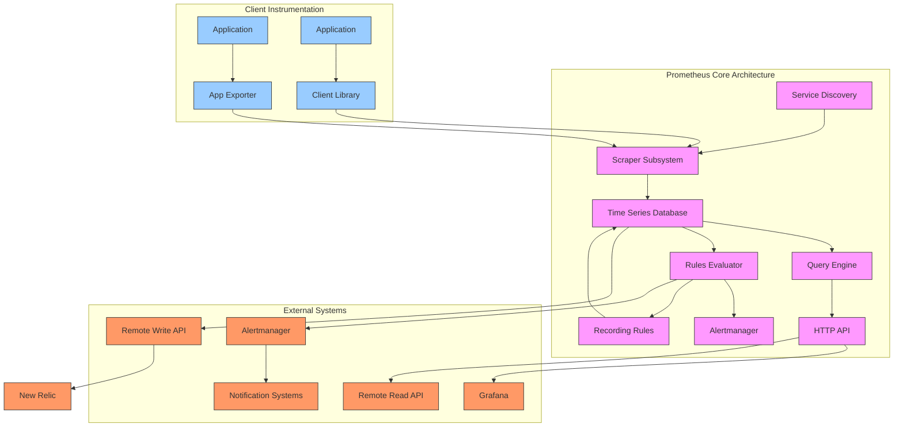

### Core Components

1. **Service Discovery**: Dynamically discovers targets to monitor in Kubernetes and other environments
2. **Scraper**: Pulls metrics from instrumented applications and exporters
3. **TSDB**: Stores time series data in a custom, memory-mapped storage format
4. **Query Engine**: Processes PromQL queries against the TSDB
5. **Rules Evaluator**: Executes alerting and recording rules
6. **HTTP API**: Serves queries, targets, and metadata

### Storage Architecture

Prometheus employs a custom time series database (TSDB) with several unique characteristics:

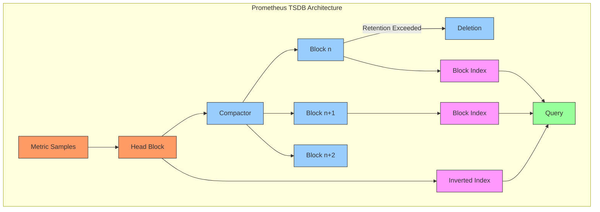

Key storage characteristics:

- **Block-based storage**: Data stored in 2-hour blocks
- **Write-ahead log**: Recent data kept in memory-mapped WAL
- **Columnar storage**: Series data stored by metric name and labels
- **Local-only design**: Primary storage is local disk
- **Retention by deletion**: Old blocks deleted based on retention policy

### PromQL Language Model

Prometheus's query language (PromQL) is a functional language designed for time series operations:

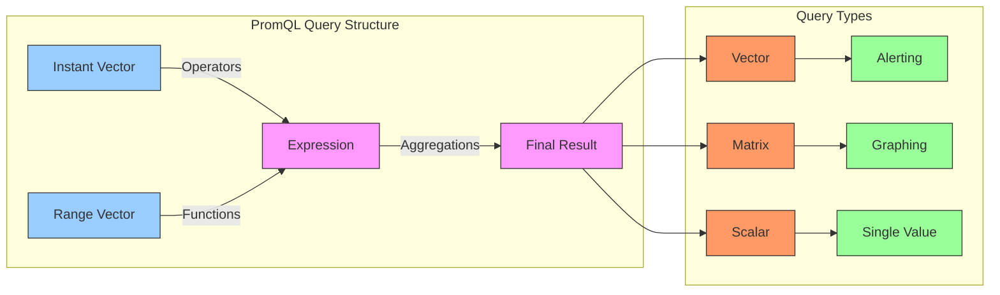

## Performance Characteristics

Prometheus performance varies significantly based on deployment configuration, cardinality, and query patterns.

### Resource Requirements by Scale

| Deployment Size | Active Series | Scrape Interval | CPU Usage | Memory Usage | Disk Usage | Query Performance |
|-----------------|---------------|-----------------|-----------|--------------|------------|-------------------|
| Small | <100K | 15s | 0.5-1 core | 2-4 GB | 1-2 GB/day | <100ms |
| Medium | 100K-500K | 15-30s | 2-4 cores | 8-16 GB | 4-8 GB/day | 100-500ms |
| Large | 500K-2M | 30s | 4-8 cores | 32-64 GB | 15-30 GB/day | 0.5-2s |
| Very Large | >2M | 60s | 8-16+ cores | 64-128+ GB | 30-60+ GB/day | 2-10s+ |

### Key Performance Factors

1. **Cardinality Growth**: Series count is the primary determinant of resource usage
2. **Retention Setting**: Default 15-day retention; longer periods increase disk usage linearly
3. **Query Complexity**: Aggregate queries over long time ranges can be resource-intensive
4. **Label Cardinality**: High-cardinality labels multiply resource requirements
5. **Scrape Frequency**: More frequent scraping increases CPU and storage requirements

### Performance Bottlenecks

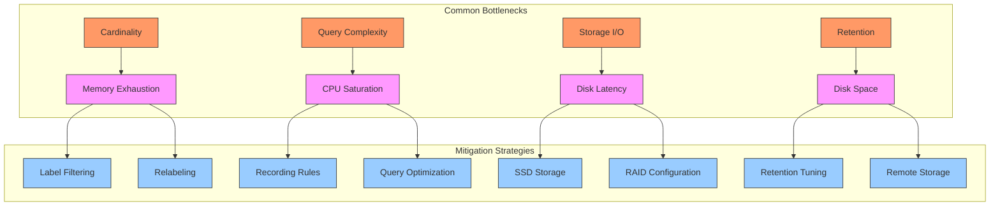

## Scaling Prometheus

Several approaches have emerged to scale Prometheus beyond single-instance limitations:

### Horizontal Sharding

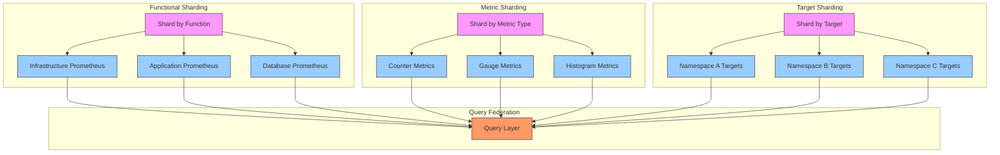

### High-Availability Options

| HA Approach | Implementation | Strengths | Weaknesses |
|-------------|----------------|-----------|------------|
| **Thanos** | Sidecar-based architecture with object storage | Global query view, unlimited retention | Complex setup, eventual consistency |
| **Cortex** | Microservice architecture with shared storage | Multi-tenancy, horizontal scaling | Operational complexity, stateful components |
| **Prometheus Federation** | Pull metrics from multiple Prometheus servers | Simple setup, hierarchical | Limited scalability, duplicate storage |
| **M3DB** | Distributed TSDB backend | High performance, strong consistency | Requires separate infrastructure |
| **VictoriaMetrics** | Drop-in replacement with clustering | High compression, fast queries | Less community support |

### Thanos Architecture

Thanos extends Prometheus for long-term storage and global querying:

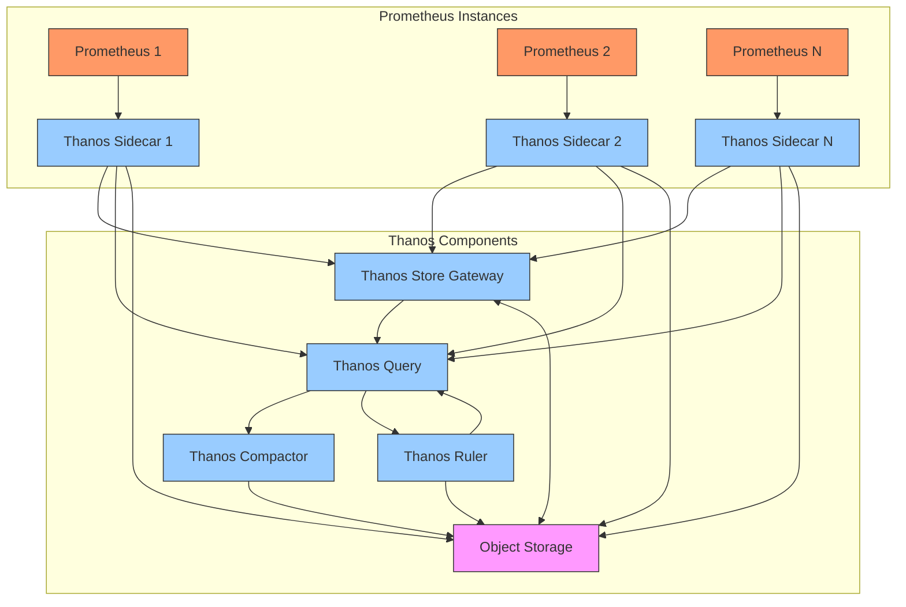

## New Relic Integration Options

Several approaches exist for integrating Prometheus with New Relic, each with different trade-offs:

### Integration Architecture Comparison

| Integration Method | Implementation | Data Flow | Pros | Cons |
|--------------------|----------------|----------|------|------|
| **Remote Write** | Direct from Prometheus | Prometheus → New Relic | Simple setup, real-time | High cardinality limitations |
| **OpenTelemetry Collector** | Via OTel pipeline | Prometheus → OTel → New Relic | Flexible filtering, enrichment | Additional component |
| **Prometheus Exporter** | New Relic exposes /metrics | New Relic → Prometheus | Local visibility, no egress costs | Duplicate storage |
| **Grafana Integration** | Via Grafana datasources | Parallel paths to each platform | Unified visualization | No data integration |
| **Prometheus NerdGraph API** | Push via PromQL API | Custom code → New Relic | Complete control | Development overhead |

### Remote Write Integration

The most direct integration method is Prometheus Remote Write:

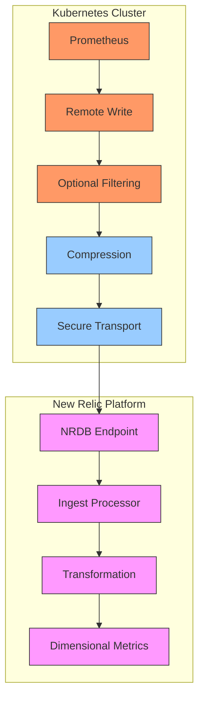

#### Remote Write Configuration

```yaml
# Prometheus remote_write configuration
remote_write:
  - url: https://metric-api.newrelic.com/prometheus/v1/write?prometheus_server=YOUR_PROMETHEUS_SERVER_NAME
    bearer_token: YOUR_NEW_RELIC_LICENSE_KEY
    
    # Optional: Control which metrics are sent
    write_relabel_configs:
      # Include only metrics with specific names
      - source_labels: [__name__]
        regex: 'node_.*|container_.*|kube_.*'
        action: keep
      
      # Exclude high-cardinality or noisy metrics
      - source_labels: [__name__]
        regex: 'container_memory_working_set_bytes|kube_pod_container_status_last_terminated_reason'
        action: drop
        
      # Limit high-cardinality labels
      - regex: 'id|pod_id|container_id'
        action: labeldrop

    queue_config:
      # Tune for better performance
      capacity: 10000
      max_samples_per_send: 5000
      batch_send_deadline: 5s
      
      max_shards: 10
      min_backoff: 30ms
      max_backoff: 5s
```

### OpenTelemetry Collector Integration

For more sophisticated processing, the OpenTelemetry Collector provides enhanced capabilities:

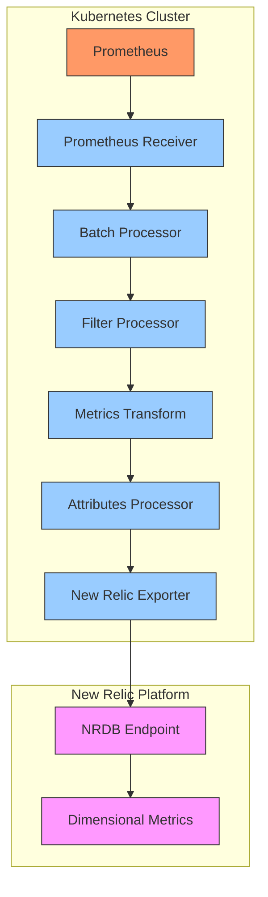

#### OTel Collector Configuration

```yaml
# OpenTelemetry Collector configuration
receivers:
  prometheus:
    config:
      scrape_configs:
        - job_name: 'federate'
          scrape_interval: 15s
          honor_labels: true
          metrics_path: '/federate'
          params:
            'match[]':
              - '{job=~".+"}'
          static_configs:
            - targets: ['prometheus-server:9090']

processors:
  batch:
    send_batch_size: 10000
    timeout: 10s
  
  # Filter high-cardinality metrics
  filter:
    metrics:
      exclude:
        match_type: regexp
        metric_names:
          - 'container_memory_working_set_bytes'
          - 'kube_pod_container_status_last_terminated_reason'
  
  # Transform metrics to New Relic format
  metricstransform:
    transforms:
      - include: 'kube_pod_status_phase'
        action: update
        new_name: 'k8s.pod.status.phase'
        operations:
          - action: add_label
            new_label: clusterName
            new_value: 'production-east'
  
  # Standard attribute processing
  attributes:
    actions:
      - key: pod
        action: rename
        new_key: podName
      - key: namespace
        action: rename
        new_key: namespaceName

exporters:
  # New Relic exporter
  newrelic:
    apikey: ${NEWRELIC_LICENSE_KEY}
    timeout: 30s
    metrics_url_override: "https://metric-api.newrelic.com/metric/v1"

service:
  pipelines:
    metrics:
      receivers: [prometheus]
      processors: [batch, filter, metricstransform, attributes]
      exporters: [newrelic]
```

## Data Model Translation

A key challenge in Prometheus integration is mapping between Prometheus's simple label-based model and New Relic's dimensional data model.

### Metric Naming Convention Translation

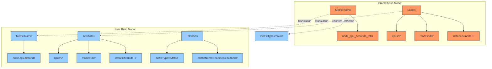

### Metric Type Mapping

| Prometheus Type | New Relic Type | Transformation | Example |
|-----------------|----------------|----------------|---------|
| Counter | Count | Rate calculation | `rate(http_requests_total[5m])` → `rate(sum(http.requests), 5 minutes)` |
| Gauge | Gauge | Direct mapping | `node_memory_MemAvailable_bytes` → `node.memory.available.bytes` |
| Histogram | Distribution | Bucket conversion | Histogram buckets → percentile calculations |
| Summary | Summary | Quantile mapping | Pre-calculated quantiles → individual metrics |

### Naming Convention Translation

| Prometheus Pattern | New Relic Pattern | Example Transformation |
|-------------------|-------------------|------------------------|
| `snake_case` | `dot.notation` | `container_cpu_usage_seconds` → `container.cpu.usage.seconds` |
| `_total` suffix | No suffix, count type | `http_requests_total` → `http.requests` (count type) |
| Unit in name | Unit as attribute | `node_memory_bytes` → `node.memory` with `units: bytes` |
| Verb underscore object | Object dot verb | `process_cpu_seconds` → `process.cpu.seconds` |

## Deployment Models

Different integration models are appropriate for different environments and requirements:

### 1. Prometheus First, New Relic Aggregation

In this model, Prometheus is the primary monitoring system, with select metrics forwarded to New Relic:

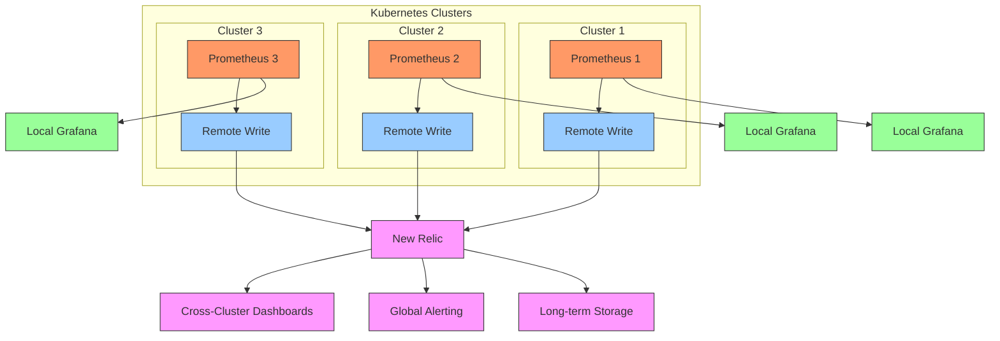

**Best for:**
- Existing Prometheus investments
- Teams comfortable with PromQL
- Need for local, low-latency monitoring
- Requirement for cross-cluster visibility

### 2. New Relic First, Prometheus Exporters

In this model, New Relic is the primary monitoring system, with Prometheus used for specialized local monitoring:

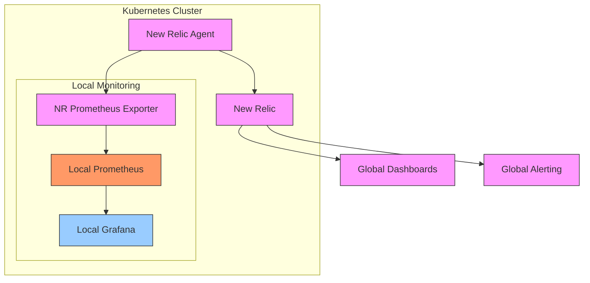

**Best for:**
- New Relic-first environments
- Need for specialized local monitoring
- Compliance with open standards
- Air-gapped or limited connectivity environments

### 3. Side-by-Side Model

In this model, both systems operate independently with optional cross-system visualization:

```mermaid
graph TD
    subgraph "Kubernetes Cluster"
        APP[Applications] --> ME[/metrics Endpoint]
        
        ME --> P[Prometheus]
        ME --> NRA[New Relic Agent]
        
        P --> PA[Prometheus Alertmanager]
        P --> PG[Prometheus Grafana]
        
        NRA --> NR[New Relic]
    end
    
    NR --> ND[New Relic Dashboards]
    NR --> NA[New Relic Alerts]
    
    PG <-.->|Optional| NFG[New Relic Grafana Integration]
    ND <-.->|Optional| NFG
    
    classDef app fill:#9cf,stroke:#333,stroke-width:1px
    classDef prometheus fill:#f96,stroke:#333,stroke-width:1px
    classDef newrelic fill:#f9f,stroke:#333,stroke-width:1px
    classDef integration fill:#9f9,stroke:#333,stroke-width:1px
    
    class APP,ME app
    class P,PA,PG prometheus
    class NRA,NR,ND,NA newrelic
    class NFG integration
```

**Best for:**
- Transitional environments
- Teams with mixed preferences
- Comparison and validation needs
- Gradual migration strategies

## Performance Benchmarks

Comparative performance between Prometheus and New Relic across key dimensions:

### Query Performance Comparison

| Query Type | Prometheus | New Relic | Notes |
|------------|------------|-----------|-------|
| **Point-in-time, single metric** | Very Fast (10-50ms) | Fast (50-200ms) | Prometheus excels at simple, real-time queries |
| **Range query, 1 hour** | Fast (50-200ms) | Fast (100-250ms) | Comparable performance |
| **Range query, 1 day** | Medium (200-500ms) | Fast (150-300ms) | New Relic's advantage grows with range |
| **Range query, 1 week** | Slow (500-2000ms) | Medium (300-500ms) | New Relic significantly better for historical data |
| **High-cardinality filter** | Very Slow (1-10s) | Medium (300-800ms) | New Relic handles high cardinality better |
| **Cross-metric correlation** | Slow (1-5s) | Medium (300-600ms) | New Relic's dimensional model advantages |
| **Aggregation across labels** | Medium (200-500ms) | Fast (100-300ms) | New Relic optimized for complex analytics |

### Storage Efficiency Comparison

| Metric | Prometheus | New Relic | Notes |
|--------|------------|-----------|-------|
| **Storage per 1M series-day** | 1-2 GB | 0.6-1.2 GB | New Relic more efficient at scale |
| **Compression ratio** | 3-5× | 5-10× | New Relic's columnar storage advantage |
| **Retention capability** | Days to weeks | Months to years | New Relic designed for long-term storage |
| **High-cardinality handling** | Poor (series explosion) | Good (dimensional model) | Critical difference for large deployments |
| **Query performance at scale** | Degrades with size | Consistent | New Relic maintains performance at scale |

## Implementation Best Practices

### Remote Write Optimization

1. **Selective Metric Forwarding**: Only send metrics needed for long-term analysis or cross-cluster visibility
2. **Label Filtering**: Drop high-cardinality labels before forwarding
3. **Rate Limiting**: Configure appropriate queue sizes and batch settings
4. **Consistent Naming**: Establish clear naming conventions between systems
5. **Health Monitoring**: Monitor the remote_write queue for backpressure

### Capacity Planning

| Component | Sizing Guideline | Example Calculation |
|-----------|-------------------|---------------------|
| **Prometheus Memory** | (Active Series × 2-3 bytes) × 2 overhead | 1M series × 6 bytes = 6GB |
| **Prometheus Storage** | Active Series × Bytes per Sample × Samples per Series | 1M × 1.5 bytes × 5760 samples = 8.6GB/day |
| **Remote Write Bandwidth** | Series × Sample Size × Frequency × Compression | 100K series × 10 bytes × 6/min × 0.1 = 100KB/s |
| **OTel Collector Memory** | 50MB base + (TPS × 100 bytes) | 50MB + (1000 TPS × 100 bytes) = 150MB |
| **OTel Collector CPU** | 0.5 core + (0.1 core per 1000 TPS) | 0.5 + (10000 TPS × 0.1/1000) = 1.5 cores |

### Operational Runbook for Integration

1. **Pre-integration Assessment**
   - Inventory metric cardinality and volume
   - Identify critical vs. optional metrics
   - Establish integration SLOs

2. **Deployment Steps**
   - Test in non-production first
   - Deploy with conservative rate limits
   - Gradually increase forwarding volume
   - Validate data accuracy in both systems

3. **Monitoring the Integration**
   - Track remote_write queue metrics
   - Monitor network bandwidth usage
   - Verify metric arrival in New Relic
   - Compare metric values between systems

4. **Troubleshooting Common Issues**
   - Queue backpressure: Adjust batch sizes and timeouts
   - Series mismatch: Check relabeling configurations
   - Data gaps: Check connectivity and authentication
   - Value discrepancies: Verify rate() calculations

## Case Studies

### Global Financial Services Company

**Challenge**: 
- 50+ Kubernetes clusters across 3 cloud providers
- Local Prometheus in each cluster hitting scaling limits
- Need for 13-month retention for compliance
- High-cardinality workloads causing series explosion

**Solution**:
- Maintained Prometheus in each cluster for real-time monitoring
- Implemented selective remote_write to New Relic
- Created unified cross-cluster dashboards in New Relic
- Used New Relic for long-term trend analysis and compliance

**Results**:
- 70% reduction in Prometheus resource usage
- Simplified compliance reporting with 13-month data
- Unified visibility across all environments
- Maintained existing Prometheus workflows for teams

### E-commerce Platform

**Challenge**:
- Seasonal traffic spikes overwhelming Prometheus
- Thanos deployment adding operational complexity
- Inconsistent alerting across environments
- Need for business KPI correlation with infrastructure

**Solution**:
- Simplified Prometheus deployment with shorter retention
- Implemented OTel Collector for metric processing
- Centralized alerting in New Relic
- Built cross-domain dashboards combining metrics and business data

**Results**:
- 40% reduction in monitoring infrastructure costs
- Eliminated Thanos operational overhead
- Improved mean time to detection by 35%
- Enabled business impact analysis of infrastructure issues

## Future Directions

Both Prometheus and New Relic continue to evolve their approaches to Kubernetes monitoring:

### Prometheus Ecosystem Trends

1. **OpenMetrics Standard**: Evolving the Prometheus exposition format into a formal standard
2. **Exemplars Support**: Linking metrics to traces for enhanced debugging
3. **Agent Mode**: Developing pull and push capabilities in a single agent
4. **PromLabs**: Commercial support and enterprise features
5. **Prometheus Agent**: Lightweight forwarding agent without full TSDB

### New Relic Prometheus Integration Roadmap

1. **Native PromQL Support**: Running PromQL queries directly against NRDB
2. **Enhanced Remote Write**: Higher performance and reliability
3. **Bidirectional Federation**: Query between systems in either direction
4. **Metadata Synchronization**: Improved target and label discovery
5. **Grafana Integration**: Better support for Grafana dashboards using New Relic data

## Conclusion

Prometheus and New Relic represent complementary approaches to Kubernetes monitoring. Prometheus excels at local, real-time visibility with a simple deployment model, while New Relic provides superior scalability, long-term storage, and cross-system correlation. By understanding the architectural differences and integration options, organizations can implement hybrid approaches that maximize the strengths of both platforms.

The integration patterns presented in this chapter enable organizations to maintain the local visibility and open-source flexibility of Prometheus while addressing enterprise requirements for scalability, cross-cluster visibility, and long-term analytics through New Relic. Whether migrating from Prometheus to New Relic or building a hybrid architecture from the start, these patterns provide a foundation for comprehensive Kubernetes observability at any scale.

---

**Next Chapter**: [Loki & Tempo Integration](02_Loki_Tempo.md)
