# Loki & Tempo: Modern Observability Stack

## Executive Summary

This chapter provides a comprehensive technical analysis of Grafana Loki and Tempo, two critical components in the modern open-source observability stack that complement Prometheus for complete Kubernetes monitoring. We examine the unique architectural approaches these tools take to logs and traces, their operational characteristics at scale, and integration patterns with New Relic. As organizations adopt cloud-native architectures, the combination of Prometheus, Loki, and Tempo (the PLT stack) has emerged as a compelling open-source alternative to commercial platforms. However, enterprises frequently encounter challenges with scale, cross-system correlation, and operational complexity.

The content explores Loki's innovative label-based approach to log aggregation that significantly reduces storage requirements compared to traditional solutions, and Tempo's cost-effective approach to distributed tracing that enables 100% sampling without prohibitive costs. Rather than positioning these tools as competitors to New Relic, we focus on complementary deployment models that leverage the strengths of both open-source and commercial approaches. The chapter guides architects and operators through technical implementation details, performance considerations, and practical integration patterns that enable a seamless observability experience spanning Grafana's open-source ecosystem and New Relic's unified platform.

## Grafana Loki Architecture

Loki implements a unique approach to log storage that leverages concepts from Prometheus, focusing on efficient indexing and retrieval rather than full-text search.

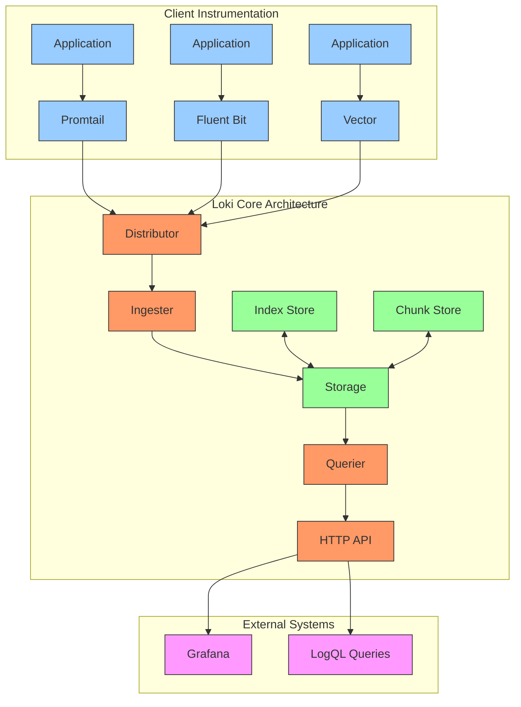

### Core Components

1. **Distributor**: Receives and validates incoming log streams and distributes them to ingesters
2. **Ingester**: Builds chunks of compressed logs, maintains in-memory index, and flushes to storage
3. **Storage**: Manages interaction with backend storage for both index and chunks
4. **Querier**: Executes LogQL queries against the storage backend
5. **Index Store**: Maintains label-based indexes for efficient log retrieval
6. **Chunk Store**: Stores compressed log content separately from index

### Storage Architecture

Loki's storage architecture separates index from log content, dramatically reducing storage and operational costs:

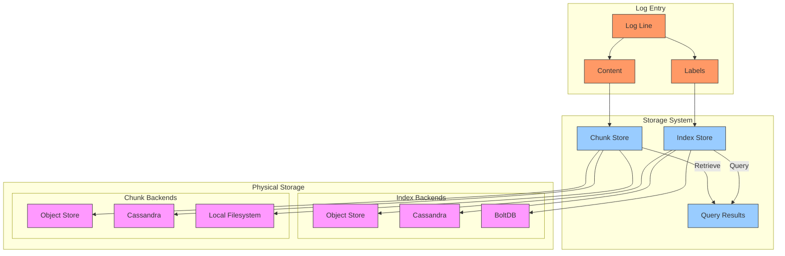

Key storage characteristics:

- **Log Chunks**: Logs grouped by stream and time window, heavily compressed
- **Label Indexing**: Only labels are indexed, not content
- **Time-Based Partitioning**: Data organized in time chunks for efficient retrieval
- **Multi-Backend Support**: Flexible storage options for different scales
- **Stream Sharding**: Logs are sharded by label hash for scalability

### LogQL Query Language

LogQL provides a Prometheus-like query language for log data:

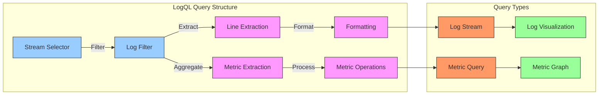

LogQL examples:

```sql
-- Basic stream selection
{container="frontend", namespace="production"}

-- Log filtering
{app="nginx"} |= "error" |~ "timeout|failed" != "ignorable"

-- Advanced filtering with regex
{app="payment-service"} |~ "user_id=(\\w+)" 

-- Extracting metrics from logs
sum(rate({app="payment-service"} |= "transaction_completed" | json | unwrap duration_ms [1m])) by (service)

-- Pattern extraction and aggregation
{app="api"} | pattern "<ip> - <user> [<timestamp>] \"<method> <uri> <protocol>\" <status> <bytes>" | count_over_time([1m]) by (status)
```

## Grafana Tempo Architecture

Tempo provides a novel approach to distributed tracing, focusing on cost-effective storage for 100% sampling without the traditional trade-offs.

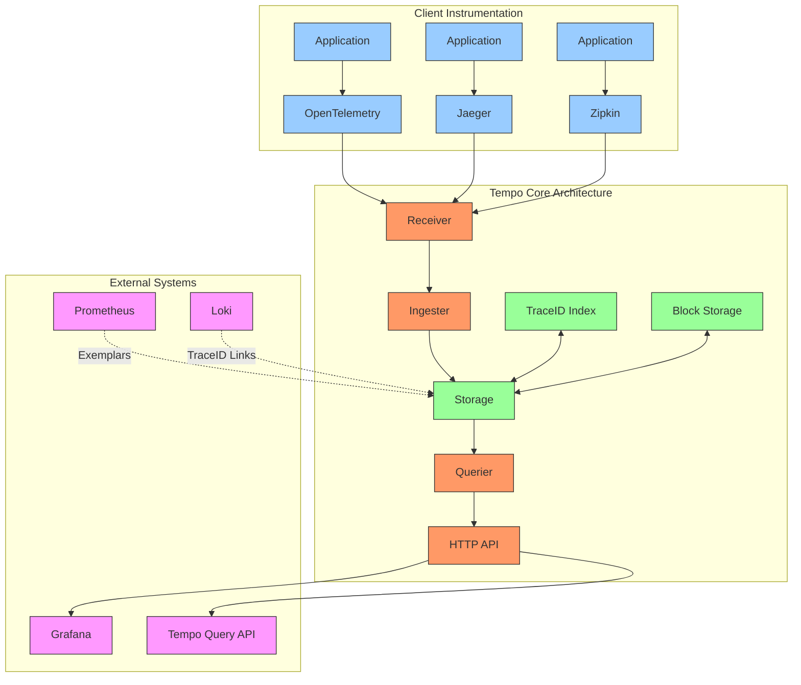

### Core Components

1. **Receiver**: Accepts traces in multiple formats (OTLP, Jaeger, Zipkin)
2. **Ingester**: Batches spans into blocks and prepares for storage
3. **Storage**: Organizes trace data in efficiently compressed blocks
4. **Querier**: Retrieves and reconstructs traces for visualization
5. **TraceID Index**: Maintains a lightweight index for finding traces by ID
6. **Block Storage**: Stores full trace data in highly compressed format

### Storage Architecture

Tempo's storage architecture is designed for maximum cost efficiency with trade-offs in query flexibility:

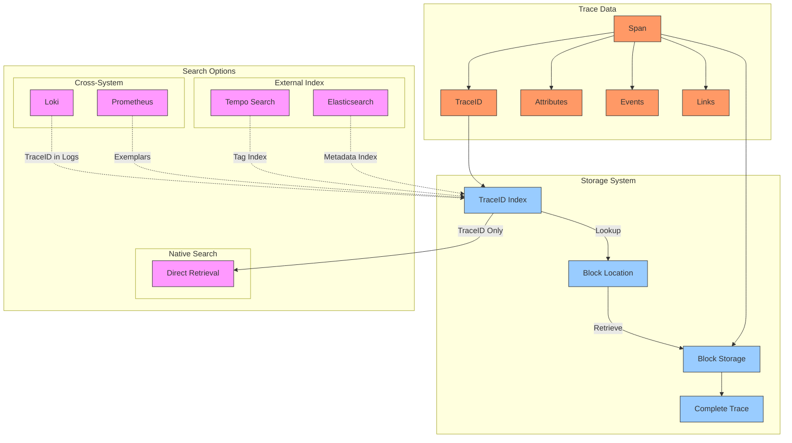

Key storage characteristics:

- **TraceID-Only Index**: Only indexes trace IDs, not contents or metadata
- **Block-Based Storage**: Traces stored in compressed blocks for high efficiency
- **Object Storage Focus**: Optimized for cloud object stores like S3
- **External Search Options**: Optional integration with search systems
- **Cross-System References**: Integration with Prometheus and Loki for discovery

### Trace Data Model

The Tempo data model follows the OpenTelemetry trace specification:

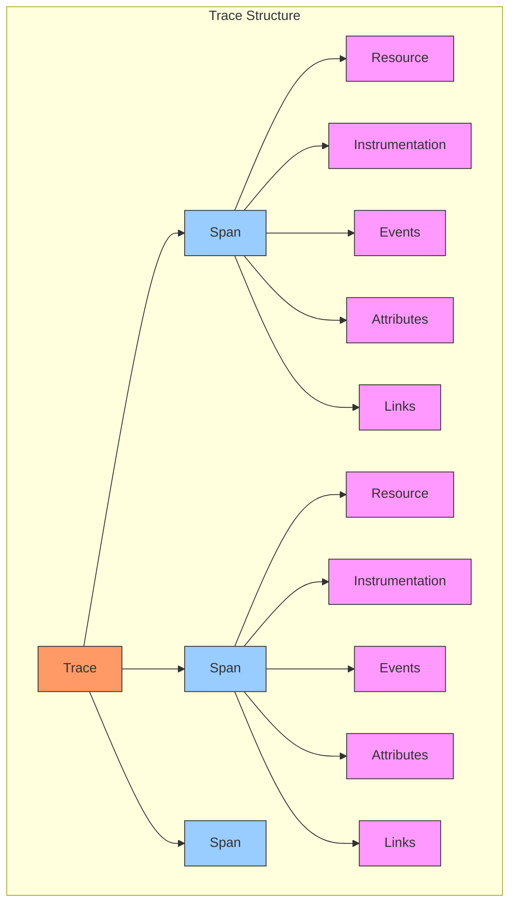

## Performance Characteristics

Both Loki and Tempo are designed for cloud-native environments with performance characteristics optimized for different trade-offs.

### Loki Performance Metrics

| Deployment Size | Log Volume | Ingest Rate | CPU Usage | Memory Usage | Storage Efficiency | Query Performance |
|-----------------|------------|-------------|-----------|--------------|-------------------|-------------------|
| Small | <10GB/day | <5K lines/sec | 2-4 cores | 4-8 GB | 10-20× compression | <500ms |
| Medium | 10-100GB/day | 5-50K lines/sec | 8-16 cores | 16-32 GB | 8-15× compression | 0.5-2s |
| Large | 100GB-1TB/day | 50-500K lines/sec | 16-32+ cores | 32-96 GB | 6-12× compression | 2-10s |
| Enterprise | >1TB/day | >500K lines/sec | 32+ cores | 96+ GB | 5-10× compression | 5-30s+ |

Key performance factors for Loki:

1. **Cardinality Management**: Label cardinality directly impacts index size and query performance
2. **Chunk Size Configuration**: Balances ingest performance against query performance
3. **Retention Settings**: Configurable by stream for cost optimization
4. **Query Scope**: Narrow time ranges and specific label selectors improve performance
5. **Index vs. Chunk Configuration**: Different storage backends have different performance profiles

### Tempo Performance Metrics

| Deployment Size | Trace Volume | Ingest Rate | CPU Usage | Memory Usage | Storage Efficiency | Query Performance |
|-----------------|--------------|-------------|-----------|--------------|-------------------|-------------------|
| Small | <1M spans/min | <10K spans/sec | 2-4 cores | 4-8 GB | 20-40× compression | <100ms |
| Medium | 1-10M spans/min | 10-100K spans/sec | 4-8 cores | 8-16 GB | 15-30× compression | 100-500ms |
| Large | 10-100M spans/min | 100K-1M spans/sec | 8-16+ cores | 16-32 GB | 10-20× compression | 0.5-2s |
| Enterprise | >100M spans/min | >1M spans/sec | 16+ cores | 32+ GB | 5-15× compression | 1-5s |

Key performance factors for Tempo:

1. **Block Configuration**: Block size and compaction strategy affect storage and query performance
2. **Indexing Strategy**: TraceID-only by default, with optional external indexing
3. **Storage Backends**: Object storage is recommended for scalability and cost
4. **Protocol Overhead**: Multiple ingestion protocols with different efficiency profiles
5. **Compression Settings**: Configurable compression ratio vs. query performance trade-offs

## Scaling Strategies

Both Loki and Tempo support horizontal scaling for large deployments.

### Loki Scaling Architecture

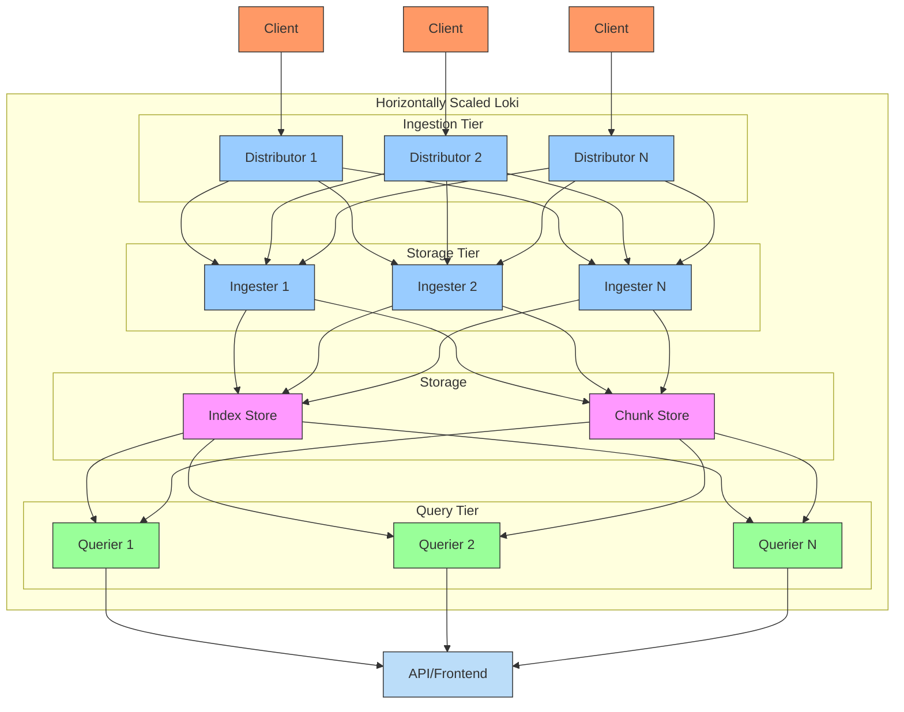

### Tempo Scaling Architecture

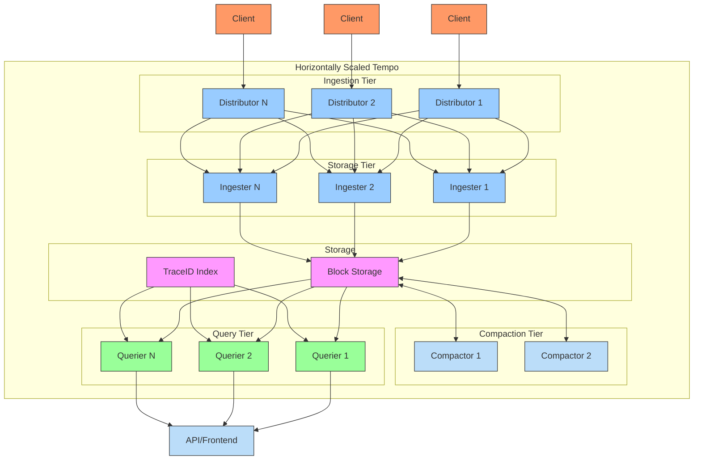

## New Relic Integration Options

Multiple approaches exist for integrating Loki and Tempo with New Relic, each with different characteristics.

### Loki Integration Options

| Integration Method | Implementation | Data Flow | Pros | Cons |
|--------------------|----------------|----------|------|------|
| **OpenTelemetry Collector** | OTel pipeline with multi-output | App → OTel → Loki & NR | Single pipeline, flexible routing | Additional component |
| **Promtail with HTTP Output** | Promtail with dual outputs | Logs → Promtail → Loki & NR | Simple client-side solution | Limited transformation |
| **Fluentd/Fluent Bit** | Fluentd with multiple outputs | App → Fluentd → Loki & NR | Rich transformation capabilities | Higher resource usage |
| **Log Forwarding** | Forward Loki logs to New Relic | App → Loki → NR | Centralized log processing | Potential duplication |
| **Grafana Integration** | Grafana with multiple data sources | Parallel paths to visualization | Unified visualization | No data integration |

### Tempo Integration Options

| Integration Method | Implementation | Data Flow | Pros | Cons |
|--------------------|----------------|----------|------|------|
| **OpenTelemetry Collector** | OTel pipeline with multi-output | App → OTel → Tempo & NR | Consistent instrumentation | Additional component |
| **Native OpenTelemetry** | Application with multiple exporters | App → Tempo & NR | Direct from source, no middleware | In-application configuration |
| **Tempo with Forwarding** | Tempo with external trace forwarding | App → Tempo → NR | Centralized trace processing | Full trace duplication |
| **Grafana Integration** | Grafana with multiple data sources | Parallel paths to visualization | Unified visualization | No data integration |
| **Sampling Strategy** | Different sampling rates to each system | App → Sampling → Tempo & NR | Optimized cost model | Complex implementation |

### OpenTelemetry Collector Integration Pattern

The most flexible approach uses the OpenTelemetry Collector for routing telemetry data:

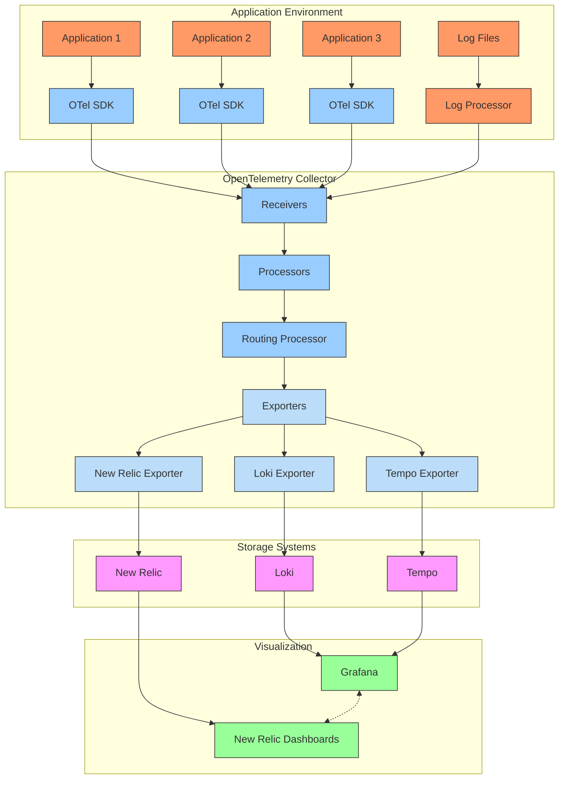

## Sample OpenTelemetry Integration Configuration

```yaml
# otel-collector-config.yaml
receivers:
  otlp:
    protocols:
      grpc:
        endpoint: 0.0.0.0:4317
      http:
        endpoint: 0.0.0.0:4318
  
  filelog:
    include: [/var/log/containers/*.log]
    start_at: end
    include_file_path: true
    operators:
      - type: json_parser
      - type: regex_parser
        regex: '^(?P<time>\S+) (?P<stream>stdout|stderr) (?P<logtag>\w) (?P<message>.*)$'
      - type: timestamp
        parse_from: time
        layout: '2006-01-02T15:04:05.999999999Z'

processors:
  batch:
    send_batch_size: 10000
    send_batch_max_size: 20000
    timeout: 5s
  
  # Add consistent metadata
  resource:
    attributes:
      - key: environment
        value: production
      - key: cluster
        value: k8s-east-1
  
  # Route different data types to different outputs
  routing:
    default_exporters:
      - logging
    from_attribute: telemetry.sdk.name
    table:
      - value: opentelemetry
        exporters: [otlp/tempo, otlp/newrelic]
      - value: filelogstoragequeue
        exporters: [loki, otlp/newrelic]

exporters:
  logging:
    verbosity: basic

  # Tempo exporter for traces
  otlp/tempo:
    endpoint: tempo:4317
    tls:
      insecure: true
  
  # Loki exporter for logs
  loki:
    endpoint: http://loki:3100/loki/api/v1/push
    tenant_id: operations
    labels:
      resource:
        container: container
        namespace: namespace
        pod: pod
      attributes:
        level: level
        event: event_name
  
  # New Relic exporter for all telemetry
  otlp/newrelic:
    endpoint: https://otlp.nr-data.net:4317
    headers:
      api-key: ${NEW_RELIC_LICENSE_KEY}

service:
  pipelines:
    traces:
      receivers: [otlp]
      processors: [batch, resource, routing]
      exporters: [otlp/tempo, otlp/newrelic]
    
    logs:
      receivers: [filelog]
      processors: [batch, resource, routing]
      exporters: [loki, otlp/newrelic]
```

## Data Model Transformations

### Loki to New Relic Log Mapping

| Loki Concept | New Relic Concept | Transformation | Example |
|--------------|-------------------|----------------|---------|
| Stream Labels | Log Attributes | Direct mapping | `{container="nginx"}` → `container: "nginx"` |
| Log Line | Message | Extraction with attributes | JSON parsing with attributes |
| LogQL Filter | NRQL WHERE | Conversion to NRQL | `{app="web"} |= "error"` → `WHERE app = 'web' AND message LIKE '%error%'` |
| Derived Fields | Parsed Attributes | Dynamic parsing | `| json` → Automatic JSON extraction |
| Label Cardinality | Entity + Attribute model | Maintain dimension consistency | Use consistent attribute naming |
| Timestamp | timestamp | Direct mapping | ISO 8601 → NRDB timestamp |
| Log Levels | Log levels | Standardization | Map to standard log levels |

### Tempo to New Relic Trace Mapping

| Tempo Concept | New Relic Concept | Transformation | Example |
|---------------|-------------------|----------------|---------|
| Trace | Distributed Trace | Direct mapping | Full trace structure preserved |
| Span | Span | Direct mapping | Span attributes maintained |
| Span Events | Span Events | Direct mapping | Events preserved with timestamps |
| Resource Attributes | Entity Attributes | Context preservation | Service name mapping |
| Span Links | Span Links | Direct mapping | Cross-trace relationships preserved |
| TraceID | TraceID | Direct mapping | Consistent ID for correlation |
| SpanID | SpanID | Direct mapping | Consistent ID for correlation |
| Parent-Child | Parent-Child | Direct mapping | Hierarchy preserved |
| Service Name | Entity Name | Service discovery | `service.name` → New Relic entity |

## Deployment Models

Different integration models suit different organizational requirements:

### 1. Side-by-Side Deployment

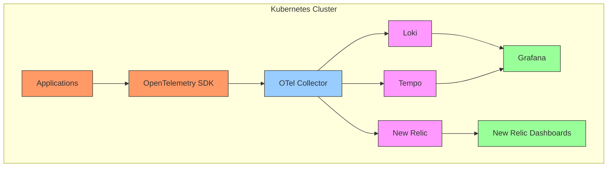

**Best for:**
- Teams requiring both local and cloud visibility
- Transitions from open-source to commercial solutions
- Development vs. production environment differences
- Scenarios requiring both self-hosted and SaaS capabilities

### 2. Selective Routing Model

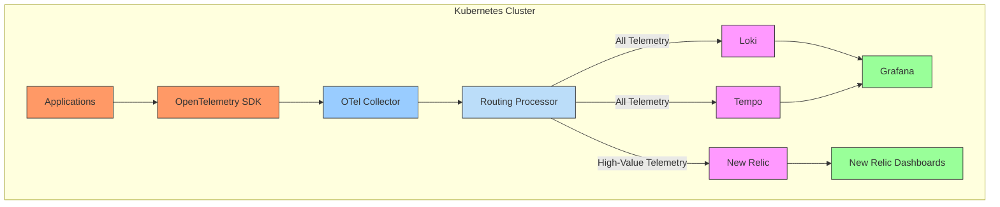

**Best for:**
- Cost-optimized hybrid deployments
- Production vs. non-production environments
- Critical service separation
- Compliance with data residency requirements

### 3. Unified Visualization Model

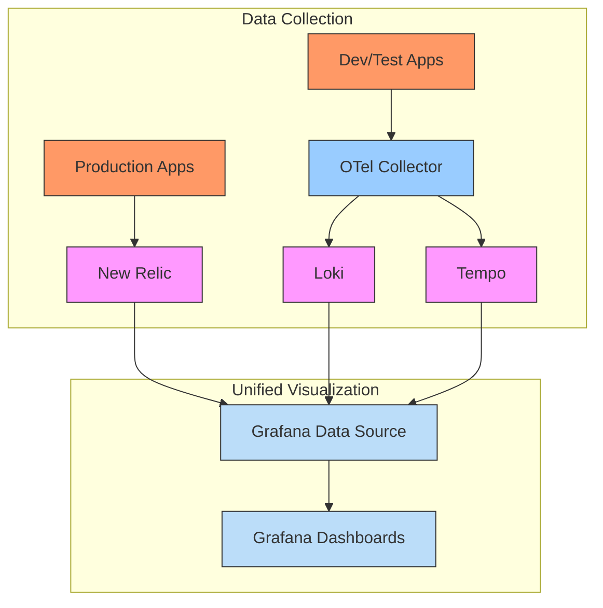

**Best for:**
- Unified visualization requirements
- Multi-vendor environments
- Complex hybrid architectures
- Teams with strong Grafana expertise

## Performance Comparison

### Log Management Performance

| Metric | Loki | New Relic Logs | Notes |
|--------|------|----------------|-------|
| **Ingest Throughput** | 50K-500K lines/sec per node | Unlimited (cloud-scale) | New Relic auto-scales with volume |
| **Query Performance (simple)** | 0.5-2s | 0.5-3s | Comparable for basic queries |
| **Query Performance (complex)** | 5-30s | 2-10s | New Relic better for complex analytics |
| **Storage Efficiency** | Very high (10-20× compression) | High (5-10× compression) | Loki's label-based approach more efficient |
| **Long-term Retention Cost** | Medium-Low | Medium | Loki optimized for cold storage |
| **Search Capability** | Limited (label-first) | Full-text + structured | New Relic offers more flexible search |
| **Correlation with Other Data** | Manual via TraceID | Automatic | New Relic's unified backend advantage |
| **Scaling Complexity** | Medium-High | Low (managed service) | Operational overhead difference |

### Distributed Tracing Performance

| Metric | Tempo | New Relic APM | Notes |
|--------|-------|---------------|-------|
| **Ingest Throughput** | 10K-1M spans/sec | Unlimited (cloud-scale) | Both handle high volumes |
| **Query Performance** | 0.1-2s (TraceID only) | 0.5-3s (flexible search) | Tempo faster for ID lookups, NR better for search |
| **Storage Efficiency** | Very high (15-30× compression) | High (10-20× compression) | Tempo more storage-efficient |
| **Sampling Requirements** | Designed for 100% sampling | Flexible sampling support | Tempo optimized for full sampling |
| **Search Capabilities** | Limited (TraceID only) | Comprehensive | NR provides stronger search capabilities |
| **Span Limit Per Trace** | Very high | High | Both handle complex traces |
| **Correlation with Other Data** | Via exemplars/logs | Automatic | New Relic's native correlation |
| **Visualization Capabilities** | Good (Grafana) | Excellent (built-in) | New Relic offers more analysis tools |

## Case Studies: Complementary Deployments

### Global Financial Institution

**Challenge**: 
- Need for 100% trace sampling for regulatory compliance
- Multi-cloud Kubernetes environment
- Data residency requirements in multiple regions
- Cost constraints for full observability

**Solution**:
- Tempo deployed in each regional cluster for 100% trace capture
- Critical services instrumented with dual export to New Relic
- Loki for full log capture with filtered forwarding to New Relic
- Grafana dashboards integrated with both local and New Relic data

**Results**:
- 100% compliance with regulatory requirements
- 40% reduction in observability data transfer costs
- Complete local debugging capabilities
- Global visibility for critical services

### E-commerce Platform

**Challenge**:
- Massive scale with seasonal traffic spikes
- Different observability requirements across teams
- Existing investment in Grafana dashboards
- Need for business KPI correlation

**Solution**:
- Core services sending telemetry to both Loki/Tempo and New Relic
- Development environments using only Loki/Tempo
- Production infrastructure exclusively monitored in New Relic
- Grafana unified views across both systems

**Results**:
- DevOps teams maintained familiar tools
- Business users gained access to correlated KPI dashboards
- 60% reduction in mean time to resolution
- Seasonal scaling without observability platform management

## Integration Implementation Patterns

### Unified Agent Configuration

For environments requiring dual telemetry:

```yaml
# promtail-dual-output.yaml
clients:
  - url: http://loki:3100/loki/api/v1/push
    tenant_id: operations
    batchwait: 1s
    batchsize: 1048576

  - url: https://log-api.newrelic.com/log/v1
    tenant_id: newrelic
    batchwait: 1s
    batchsize: 1048576
    bearer_token: ${NEW_RELIC_LICENSE_KEY}
    external_labels:
      cluster: production-east
      environment: production

scrape_configs:
  - job_name: kubernetes-pods
    kubernetes_sd_configs:
      - role: pod
    relabel_configs:
      - source_labels: [__meta_kubernetes_pod_annotation_prometheus_io_scrape]
        action: keep
        regex: true
      - source_labels: [__meta_kubernetes_pod_container_name]
        target_label: container
      - source_labels: [__meta_kubernetes_namespace]
        target_label: namespace
      - source_labels: [__meta_kubernetes_pod_name]
        target_label: pod
    pipeline_stages:
      - json:
          expressions:
            level: level
            message: message
            timestamp: time
      - timestamp:
          source: timestamp
          format: RFC3339
      - labels:
          level:
```

### Cross-System Query Translation

Mappings between LogQL and NRQL:

| LogQL | NRQL | Notes |
|-------|------|-------|
| `{app="frontend"}` | `FROM Log SELECT * WHERE app = 'frontend'` | Basic label selection |
| `{app="frontend"} \|= "error"` | `FROM Log SELECT * WHERE app = 'frontend' AND message LIKE '%error%'` | Text matching |
| `{app="frontend"} \| json` | `FROM Log SELECT * WHERE app = 'frontend'` | NR automatic JSON parsing |
| `sum(rate({app="frontend"} \|= "error" [5m]))` | `FROM Log SELECT rate(count(*), 5 minutes) WHERE app = 'frontend' AND message LIKE '%error%'` | Rate calculation |
| `{app="frontend"} \| pattern "<method> <uri>"` | `FROM Log SELECT * WHERE app = 'frontend' EXTRACT pattern('<method> <uri>')` | Pattern extraction |

## Future Directions

### Loki Evolution

1. **Improved Search Capabilities**: Enhancements to non-label-based search
2. **LogQL Extensions**: More powerful query functions and analytics
3. **Native Alerting**: Enhanced alerting capabilities without Grafana
4. **Multi-Tenancy Improvements**: Better isolation and resource controls
5. **Storage Optimizations**: Further compression and efficiency improvements

### Tempo Evolution

1. **Advanced Search**: Enhanced trace search without external dependencies
2. **Metric Generation**: Automatic metrics derived from trace data
3. **Advanced Sampling**: Intelligent tail-based sampling options
4. **Cross-Trace Analytics**: Better support for trace-to-trace analysis
5. **Enhanced Visualizations**: More analysis capabilities in Grafana

### Integration Roadmap

1. **OpenTelemetry Advances**: Better semantic conventions and metadata
2. **Cross-Platform Correlation**: Improved entity correlation across systems
3. **Grafana Plugin Enhancements**: Better New Relic data source capabilities
4. **Unified Exemplars**: Cross-system exemplar support
5. **Standardized Query Language**: More compatible query approaches

## Conclusion

Loki and Tempo represent innovative approaches to log and trace management that prioritize storage efficiency and operational simplicity over the comprehensive features of commercial platforms like New Relic. Organizations can leverage these tools alongside New Relic to create hybrid observability architectures that balance cost, capability, and operational requirements.

Rather than viewing these tools as competing solutions, the most successful implementations recognize their complementary strengths. Loki and Tempo excel at cost-effective, high-volume collection with minimal operational overhead, particularly suitable for development environments and non-critical workloads. New Relic provides superior search, analytics, and cross-signal correlation capabilities essential for production monitoring and business-critical services.

The integration patterns presented in this chapter enable organizations to implement structured, tiered observability approaches that allocate resources efficiently while maintaining comprehensive visibility. By understanding the architectural differences, data models, and integration options, teams can design observability strategies that deliver the right level of insight at the right cost for each environment.

---

**Next Chapter**: [Datadog Deep-Dive](../08_Datadog_DeepDive/01_Cluster_Agent.md)
