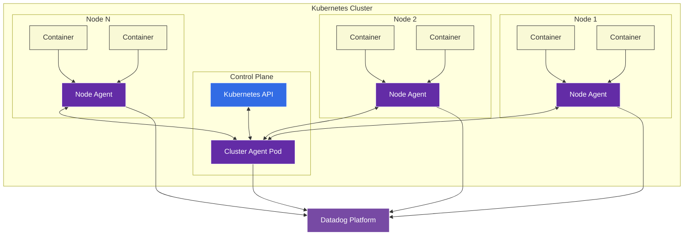
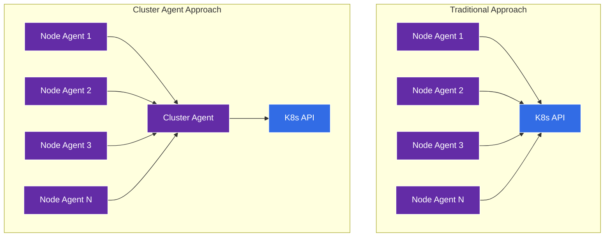
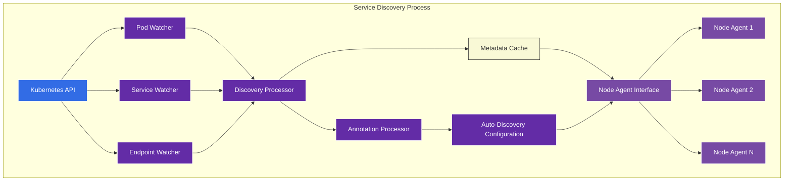
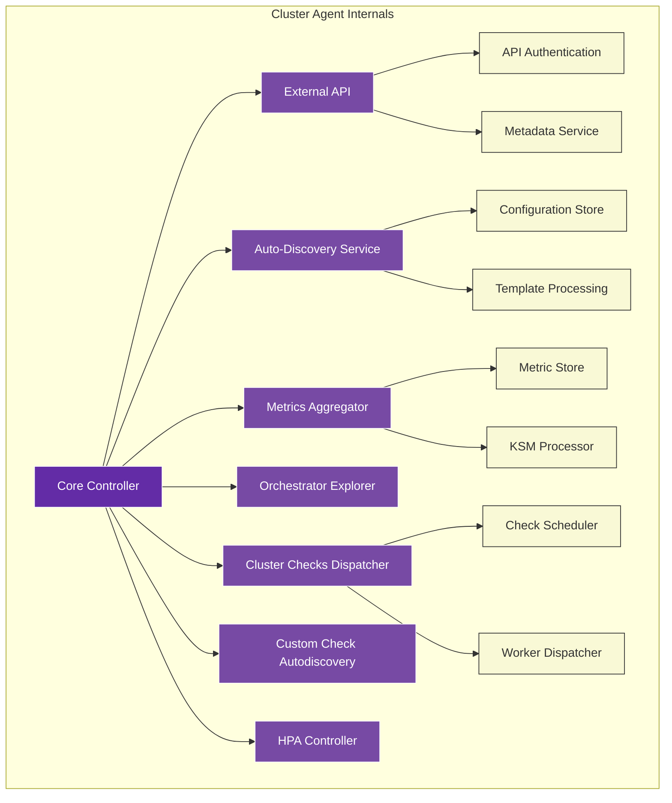
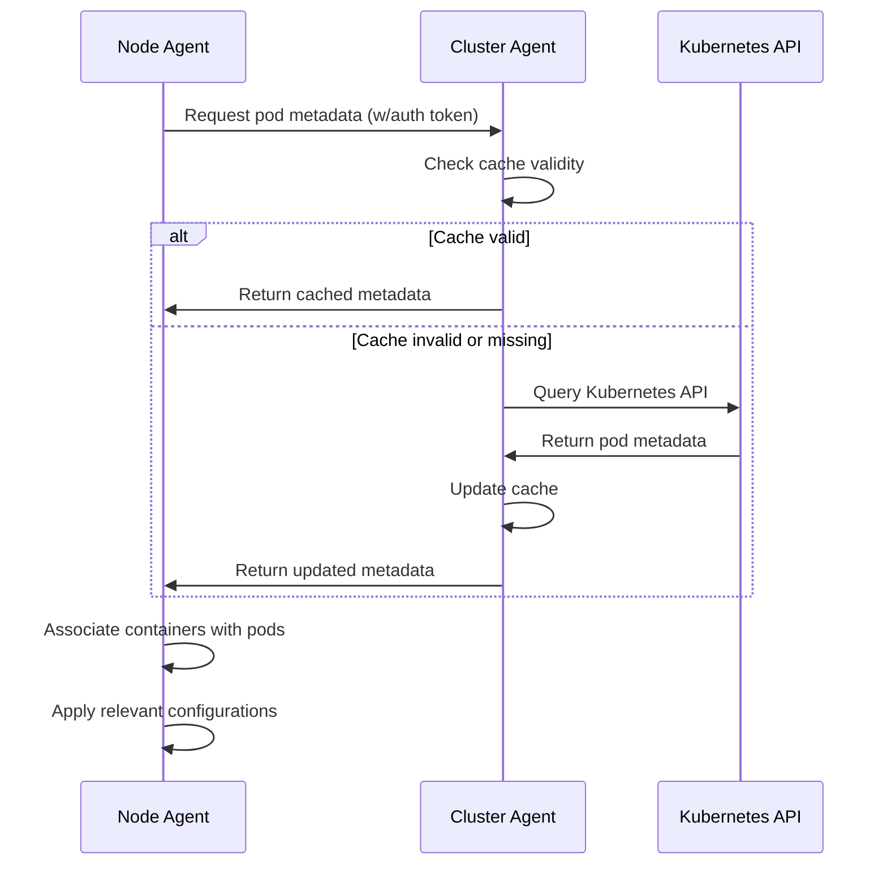
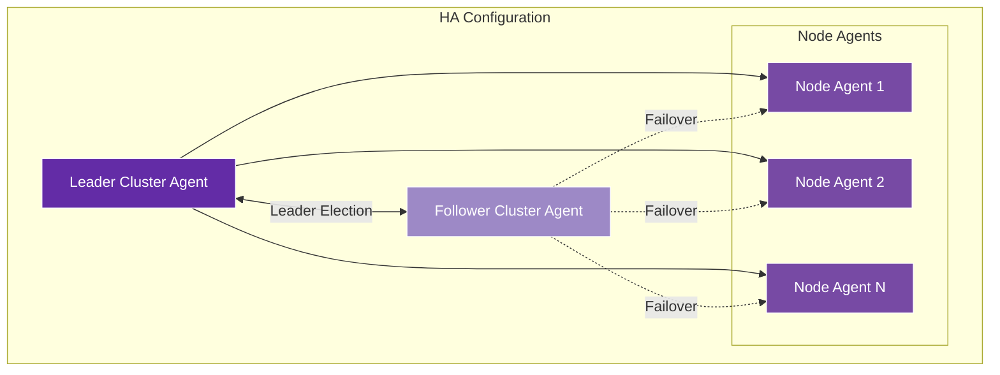
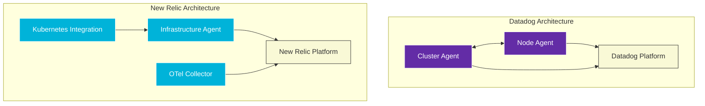
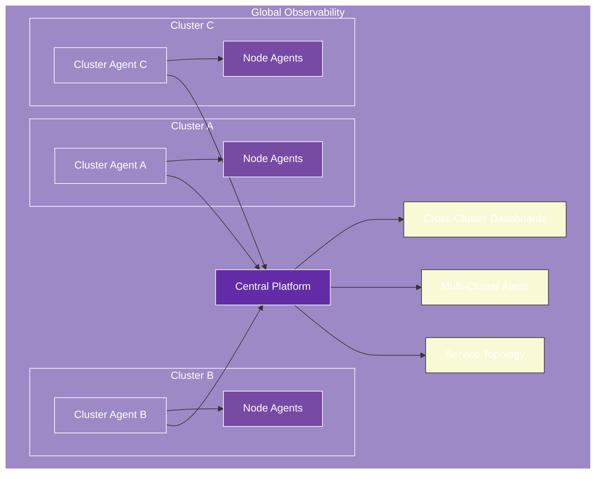
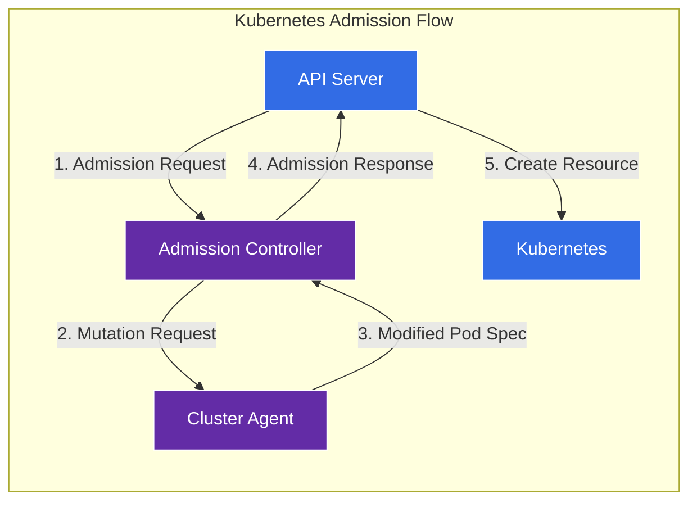
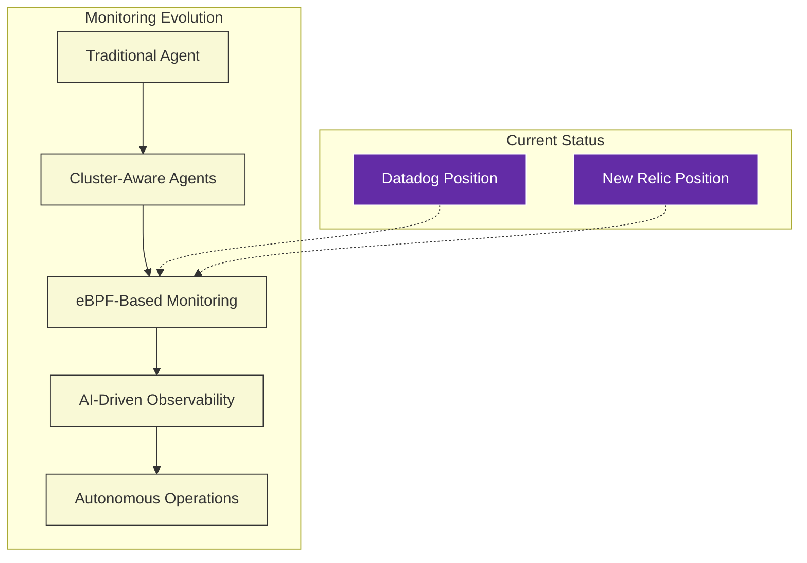

# Datadog Cluster Agent Architecture

## Executive Summary

The Datadog Cluster Agent represents a sophisticated approach to Kubernetes monitoring, designed to address challenges of scale, resource efficiency, and observability in large container environments. This chapter provides a deep technical analysis of the Cluster Agent's architecture, capabilities, and operational characteristics in comparison to New Relic's Kubernetes monitoring approach. We examine the fundamental design choices, performance implications, and integration patterns that define Datadog's cluster-level monitoring strategy.

As organizations scale their Kubernetes deployments, traditional per-node agent approaches face increasing challenges with resource overhead, duplicate telemetry, and incomplete visibility. Datadog's Cluster Agent and New Relic's similar capabilities represent different approaches to solving these problems. This chapter equips architects and operators with a comprehensive understanding of both approaches, enabling informed decisions about monitoring architecture and highlighting opportunities for complementary deployment in complex environments.

## Core Architecture Overview

The Datadog Cluster Agent implements a hierarchical monitoring architecture that centralizes certain monitoring functions at the cluster level.



### Core Components of the Cluster Agent Architecture

| Component | Function | Deployment Method | Scaling Approach |
|-----------|----------|-------------------|------------------|
| **Cluster Agent** | Centralized metadata collection, API interaction | Single Deployment (HA optional) | Vertical scaling |
| **Node Agent** | Host and container-level metrics | DaemonSet | One per node |
| **Admission Controller** | Auto-instrumentation, tag injection | Deployment/Webhook | Horizontal scaling |
| **Trace Agent** | APM trace processing | Sidecar or DaemonSet | Workload dependent |
| **Process Agent** | Process-level visibility | DaemonSet (optional) | One per node |
| **Network Performance Monitoring** | Network flow analysis | System-probe DaemonSet | One per node |
| **Kube State Metrics** | State metrics handling | Built into Cluster Agent | N/A |

## Cluster Agent Capabilities

The Cluster Agent provides several key capabilities that differentiate it from traditional per-node monitoring approaches:

### 1. Metadata Aggregation

The Cluster Agent centralizes the collection of Kubernetes metadata, reducing API server load:



Benefits of centralized metadata collection:
- Reduces API server load by up to 90%
- Prevents rate limiting in large clusters
- Ensures consistent metadata across all agents
- Enables efficient caching of slow-changing data

### 2. Cluster-Level Metrics

The Cluster Agent collects metrics that only make sense at the cluster level:

| Metric Type | Examples | Collection Method | Benefits |
|-------------|----------|-------------------|----------|
| **Control Plane** | API server latency, etcd performance | Direct API queries | Early detection of control plane issues |
| **Resource Quotas** | Namespace quotas, limits | Metadata API | Capacity planning, governance |
| **HPA Metrics** | Custom metrics, scaling ratios | Metrics API | Autoscaling performance analysis |
| **Admission Control** | Admission rates, rejections | Webhook metrics | Security and policy enforcement visibility |
| **Cluster State** | Node availability, scheduling capacity | Aggregated metrics | Overall cluster health assessment |

### 3. Advanced Service Discovery

The Cluster Agent implements sophisticated service discovery to track dynamic container environments:



The service discovery system supports:
- Auto-discovery of containers based on labels and annotations
- Dynamic configuration updates without restarts
- Efficient distribution of discovery information to node agents
- Custom check deployment based on discovered services

### 4. Orchestrator Explorer

The Orchestrator Explorer provides a comprehensive view of Kubernetes resources:

| Resource Type | Data Collected | Update Frequency | Use Cases |
|---------------|----------------|------------------|-----------|
| **Pods** | Status, health, containers, volumes | 15 seconds | Pod lifecycle analysis |
| **Deployments** | Replicas, conditions, strategy | 30 seconds | Deployment health tracking |
| **ReplicaSets** | Ownership, scaling events | 30 seconds | Scaling analysis |
| **Services** | Endpoints, selectors, type | 1 minute | Service discovery validation |
| **Nodes** | Capacity, conditions, taints | 1 minute | Node health monitoring |
| **Jobs/CronJobs** | Execution status, schedules | 1 minute | Batch job monitoring |
| **ConfigMaps/Secrets** | Metadata (not content) | 5 minutes | Configuration change tracking |

## Technical Deep-Dive

### Cluster Agent Internals

The Cluster Agent is built on a modular, Go-based architecture:



### Communication Protocol

The Cluster Agent uses a secure API for communication with node agents:

1. **Authentication**: Node agents authenticate using a pre-shared key
2. **Data Format**: Protocol Buffers for efficient serialization
3. **Transport**: HTTPS with mutual TLS
4. **Caching**: Response caching with versioned invalidation
5. **Compression**: gzip compression for larger payloads

Example communication flow for metadata retrieval:



### Resource Requirements

The Cluster Agent is designed to be efficient, with controlled resource usage:

| Cluster Size | CPU Usage | Memory Usage | Bandwidth | Recommended Limits |
|--------------|-----------|--------------|-----------|-------------------|
| Small (<50 nodes) | 0.1-0.2 cores | 200-300 MB | 1-5 MB/min | 0.5 cores, 512 MB |
| Medium (50-200 nodes) | 0.2-0.5 cores | 300-600 MB | 5-15 MB/min | 1 core, 1 GB |
| Large (200-500 nodes) | 0.5-1.0 cores | 600-1200 MB | 15-30 MB/min | 2 cores, 2 GB |
| Very Large (500+ nodes) | 1.0-2.0 cores | 1.2-2.5 GB | 30-60 MB/min | 4 cores, 4 GB |

### High Availability Configuration

For production environments, the Cluster Agent supports high availability deployment:



High availability is implemented through:
- Kubernetes leader election mechanism
- Shared cache through ConfigMap or external store
- Automatic failover on leader unhealthiness
- Health probes for quick detection of issues

## Comparison with New Relic Kubernetes Monitoring

New Relic and Datadog implement different approaches to Kubernetes monitoring:

### Architectural Comparison



| Aspect | Datadog Approach | New Relic Approach | Key Differences |
|--------|------------------|-------------------|-----------------|
| **Deployment Model** | Hierarchical (Cluster Agent + Node Agents) | Parallel components | Datadog more centralized |
| **Control Plane Monitoring** | Direct via Cluster Agent | Integration with kube-state-metrics | Similar capabilities |
| **Data Collection** | Proprietary protocol | OpenTelemetry-compatible | NR more standards-based |
| **Metadata Aggregation** | Centralized in Cluster Agent | Distributed with coordination | Datadog more efficient at scale |
| **Auto-Instrumentation** | Admission Controller | Kubernetes Pixie integration | Different technologies |
| **API Server Load** | Very low (centralized queries) | Low to moderate | Datadog advantage at large scale |
| **Extensibility** | Custom checks | Flex integrations | Similar capabilities |
| **Multi-Cluster Management** | Cluster Agent per cluster | Integration per cluster | Similar approach |

### Performance Comparison

| Metric | Datadog | New Relic | Notes |
|--------|---------|-----------|-------|
| **Agent CPU usage per node** | 50-200m | 100-300m | Datadog slightly more efficient |
| **Agent memory per node** | 200-500 MB | 150-400 MB | New Relic slightly more efficient |
| **Control plane impact** | Very low | Low | Datadog advantage at scale |
| **Metadata refresh rate** | 15-60s configurable | 30-120s configurable | Datadog slightly more responsive |
| **Setup complexity** | Moderate (multiple components) | Simple (fewer components) | New Relic easier to deploy |
| **Scalability limit** | 5000+ nodes | 2000+ nodes | Datadog scales further |

### Feature Matrix

| Feature | Datadog | New Relic | Implementation Differences |
|---------|---------|-----------|----------------------------|
| **Control Plane Metrics** | ✓ | ✓ | Similar metrics, different collection |
| **Pod/Container Metrics** | ✓ | ✓ | Equivalent capabilities |
| **Custom Metrics** | ✓ | ✓ | DD uses StatsD, NR uses dimensional metrics |
| **Network Monitoring** | ✓ | ✓ | DD more detailed, NR integrated with eBPF |
| **Process Monitoring** | ✓ | ✓ | DD more detailed by default |
| **Log Integration** | ✓ | ✓ | Similar capabilities |
| **APM Integration** | ✓ | ✓ | Different instrumentation approaches |
| **Auto-Instrumentation** | ✓ | ✓ | Different technologies |
| **Service Maps** | ✓ | ✓ | Different visualization approaches |
| **Cross-Cluster Visibility** | ✓ | ✓ | Similar capabilities |

## Deployment Patterns

### Datadog Standard Deployment for Production

```yaml
# Simplified Datadog Cluster Agent deployment
apiVersion: apps/v1
kind: Deployment
metadata:
  name: datadog-cluster-agent
  namespace: datadog
spec:
  replicas: 2  # HA configuration
  selector:
    matchLabels:
      app: datadog-cluster-agent
  template:
    metadata:
      labels:
        app: datadog-cluster-agent
    spec:
      serviceAccountName: datadog-cluster-agent
      containers:
      - name: cluster-agent
        image: datadog/cluster-agent:latest
        imagePullPolicy: Always
        resources:
          limits:
            cpu: 1000m
            memory: 1Gi
          requests:
            cpu: 200m
            memory: 256Mi
        env:
        - name: DD_API_KEY
          valueFrom:
            secretKeyRef:
              name: datadog-secret
              key: api-key
        - name: DD_APP_KEY
          valueFrom:
            secretKeyRef:
              name: datadog-secret
              key: app-key
        - name: DD_CLUSTER_NAME
          value: "prod-cluster-1"
        # Cluster Agent specific configs
        - name: DD_CLUSTER_AGENT_ENABLED
          value: "true"
        - name: DD_COLLECT_KUBERNETES_EVENTS
          value: "true"
        - name: DD_LEADER_ELECTION
          value: "true"
        - name: DD_CLUSTER_AGENT_KUBERNETES_SERVICE_NAME
          value: datadog-cluster-agent
        # Advanced configurations
        - name: DD_ORCHESTRATOR_EXPLORER_ENABLED
          value: "true"
        - name: DD_ORCHESTRATOR_EXPLORER_CONTAINER_SCRUBBING_ENABLED
          value: "true"
        # External metrics for HPA
        - name: DD_EXTERNAL_METRICS_PROVIDER_ENABLED
          value: "true"
        # Admission Controller enablement
        - name: DD_ADMISSION_CONTROLLER_ENABLED
          value: "true"
        - name: DD_ADMISSION_CONTROLLER_MUTATE_UNLABELLED
          value: "true"
        # Cluster Checks
        - name: DD_CLUSTER_CHECKS_ENABLED
          value: "true"
        ports:
        - containerPort: 5005
          name: agentport
          protocol: TCP
        livenessProbe:
          httpGet:
            path: /live
            port: 5005
          initialDelaySeconds: 15
          periodSeconds: 15
          timeoutSeconds: 5
        readinessProbe:
          httpGet:
            path: /ready
            port: 5005
          initialDelaySeconds: 15
          periodSeconds: 15
          timeoutSeconds: 5
```

### New Relic Equivalent Deployment

```yaml
# Simplified New Relic Kubernetes integration deployment
apiVersion: apps/v1
kind: Deployment
metadata:
  name: newrelic-kubernetes-integration
  namespace: newrelic
spec:
  replicas: 1
  selector:
    matchLabels:
      app: newrelic-kubernetes-integration
  template:
    metadata:
      labels:
        app: newrelic-kubernetes-integration
    spec:
      serviceAccountName: newrelic-kubernetes-integration
      containers:
      - name: kubernetes-integration
        image: newrelic/kubernetes-integration:latest
        resources:
          limits:
            cpu: 500m
            memory: 512Mi
          requests:
            cpu: 100m
            memory: 128Mi
        env:
        - name: NRIA_LICENSE_KEY
          valueFrom:
            secretKeyRef:
              name: newrelic-secret
              key: license
        - name: CLUSTER_NAME
          value: "prod-cluster-1"
        - name: KUBE_STATE_METRICS_URL
          value: "http://kube-state-metrics.kube-system:8080/metrics"
        - name: DISCOVERY_CACHE_TTL
          value: "30"
        - name: SCRAPE_INTERVAL
          value: "30"
        # Configuration settings
        - name: CONTROLLER_MONITORING_ENABLED
          value: "true"
        - name: NODE_NAME
          valueFrom:
            fieldRef:
              fieldPath: spec.nodeName
        volumeMounts:
        - name: config-volume
          mountPath: /etc/newrelic-infra/integrations.d/
      volumes:
      - name: config-volume
        configMap:
          name: nri-kubernetes-config
```

## Advanced Use Cases

### 1. Custom Metrics Collection

Both Datadog and New Relic support custom metrics collection, but with different approaches:

| Datadog Approach | New Relic Approach | Considerations |
|------------------|-------------------|----------------|
| **StatsD Protocol** | **Dimensional Metrics** | NR model offers more flexibility for high-cardinality data |
| **DogStatsD Extensions** | **Metric API** | DD offers simpler client libraries |
| **Custom Checks** | **Flex Integrations** | Similar capabilities with different configuration approaches |
| **Agent Integrations** | **OTel Collectors** | NR leverages open standards |

### 2. Advanced HPA Scaling

Datadog's Cluster Agent can provide custom metrics for Horizontal Pod Autoscaling:

```yaml
# Example HPA using Datadog metrics
apiVersion: autoscaling/v2
kind: HorizontalPodAutoscaler
metadata:
  name: frontend-scaling
spec:
  scaleTargetRef:
    apiVersion: apps/v1
    kind: Deployment
    name: frontend
  minReplicas: 2
  maxReplicas: 10
  metrics:
  - type: External
    external:
      metric:
        name: datadog.frontend.request_rate
        selector:
          matchLabels:
            service: frontend
      target:
        type: AverageValue
        averageValue: 100
```

This capability is enabled by the Cluster Agent's External Metrics Provider, which:
- Registers as a Kubernetes metrics API provider
- Fetches metrics from Datadog on demand
- Caches results for performance
- Supports complex queries and aggregations

### 3. Multi-Cluster Observability

For organizations running multiple Kubernetes clusters, both Datadog and New Relic offer cross-cluster visibility:



Key multi-cluster capabilities:
- **Consistent Tagging**: Uniform identification across environments
- **Cross-Cluster Correlation**: Tracing requests across cluster boundaries
- **Unified Dashboards**: Single-pane-of-glass views
- **Comparative Analytics**: Performance benchmarking between clusters
- **Aggregated Alerts**: Cluster-aware alerting policies

### 4. Security Monitoring

Datadog's Cluster Agent enables security monitoring capabilities:

| Capability | Implementation | Benefit |
|------------|----------------|---------|
| **Sensitive Data Scrubbing** | Built-in scrubbing rules | Prevents inadvertent PII collection |
| **Compliance Monitoring** | Rule-based checks | Tracks compliance with security standards |
| **Configuration Audit** | CIS benchmark checks | Identifies security misconfigurations |
| **Threat Detection** | Behavioral anomaly detection | Identifies potential security threats |
| **Container Security** | Image vulnerability scanning | Detects vulnerable packages |

### 5. Admission Controller

Datadog provides an Admission Controller for automatic instrumentation and security enforcement:



The Admission Controller enables:
- **Auto-Instrumentation**: Automatic APM setup for applications
- **Standard Tagging**: Consistent tagging across all workloads
- **Secret Management**: Injection of credentials without hardcoding
- **Security Policies**: Enforcement of security standards
- **Resource Management**: Validation of resource requests/limits

## Performance Optimization 

### Datadog Agent Optimization Techniques

| Technique | Implementation | Impact |
|-----------|----------------|--------|
| **Collection Intervals** | Configurable per check | Balance between freshness and resource usage |
| **Resource Limits** | Container resource configuration | Prevents agent impact on host resources |
| **Cardinality Control** | Tag filtering | Prevents metric explosion |
| **Cache Optimization** | Tunable cache TTLs | Balance between freshness and API load |
| **Network Optimization** | Compression and batching | Reduces network overhead |

### Optimizing for Large-Scale Deployments

For very large Kubernetes clusters (1000+ nodes), consider these optimizations:

1. **Vertical Scaling**: Allocate more resources to the Cluster Agent
2. **Shard by Namespace**: Deploy multiple Cluster Agents with namespace filtering
3. **Optimize Collection Intervals**: Increase intervals for non-critical metrics
4. **Implement Tag Filtering**: Limit high-cardinality tags
5. **Enable Resource Quotas**: Prevent agent resource starvation

Example configuration for a large cluster:

```yaml
# Cluster Agent optimization for large clusters
env:
  # Increase cache TTLs
  - name: DD_KUBERNETES_METADATA_TAG_UPDATE_FREQ
    value: "60"  # seconds
  - name: DD_EXTERNAL_METRICS_PROVIDER_CACHE_DURATION
    value: "90"  # seconds
  # Optimize collection
  - name: DD_ORCHESTRATOR_EXPLORER_COLLECTION_INTERVAL
    value: "10"  # seconds
  # Control cardinality
  - name: DD_KUBERNETES_COLLECT_METADATA_TAGS
    value: "false"
  - name: DD_KUBERNETES_COLLECT_LABELS_AS_TAGS
    value: "false"
  # Enable debugging if needed
  - name: DD_LOG_LEVEL
    value: "info"
resources:
  limits:
    cpu: 2000m
    memory: 2Gi
  requests:
    cpu: 500m
    memory: 512Mi
```

## Operational Considerations

### Monitoring the Monitors

It's essential to monitor the health of your monitoring infrastructure. Both Datadog and New Relic provide internal metrics:

| Metric Category | Key Metrics | Warning Signs |
|-----------------|------------|---------------|
| **Agent Health** | CPU usage, memory usage, restarts | High resource usage, frequent restarts |
| **Collection Performance** | Collection time, success rate | Increasing collection times, failures |
| **API Communication** | Request rate, error rate, latency | Increasing errors or latency |
| **Data Volume** | Metrics sent, events generated | Unexpected spikes, continuous growth |
| **Cache Efficiency** | Cache hit rate, cache size | Low hit rates, growing cache size |

### Troubleshooting Common Issues

| Issue | Symptoms | Common Causes | Resolution |
|-------|----------|--------------|------------|
| **Agent Memory Leaks** | Steadily increasing memory usage | Plugin leaks, high cardinality | Upgrade agents, reduce cardinality |
| **API Rate Limiting** | Metadata gaps, collection errors | Too many agents, high query rate | Deploy Cluster Agent, increase interval |
| **Missing Metrics** | Gaps in dashboards, no data for certain resources | Collection failures, filtering issues | Check agent logs, verify permissions |
| **High CPU Usage** | Agent CPU spikes, host performance impact | Too many checks, high collection frequency | Reduce check frequency, optimize configs |
| **Authentication Issues** | Connection failures, no data flow | Invalid API key, certificate issues | Verify credentials, check TLS config |

### Runbook: Cluster Agent Troubleshooting

1. **Verify Deployment Status**
   ```bash
   kubectl get deployment datadog-cluster-agent -n datadog
   kubectl describe deployment datadog-cluster-agent -n datadog
   ```

2. **Check Agent Logs**
   ```bash
   kubectl logs -l app=datadog-cluster-agent -n datadog
   ```

3. **Verify Node Agent Communication**
   ```bash
   kubectl exec -it <node-agent-pod> -n datadog -- agent status
   ```

4. **Check API Communication**
   ```bash
   kubectl exec -it <cluster-agent-pod> -n datadog -- agent status
   ```

5. **Verify RBAC Permissions**
   ```bash
   kubectl auth can-i list pods --as=system:serviceaccount:datadog:datadog-cluster-agent
   ```

6. **Restart if Necessary**
   ```bash
   kubectl rollout restart deployment datadog-cluster-agent -n datadog
   ```

## Cost Considerations

### Comparative Cost Analysis

| Factor | Datadog | New Relic | Notes |
|--------|---------|-----------|-------|
| **Pricing Model** | Host-based + custom metrics | Ingest-based | Different optimization strategies |
| **Infrastructure Costs** | Agent resource usage | Agent resource usage | Similar infrastructure costs |
| **Cardinality Impact** | High tags increase custom metrics | High attributes increase data ingest | Cardinality control important for both |
| **Retention Costs** | Built into subscription | Affected by data volume | NR more sensitive to retention settings |
| **Scaling Costs** | Linear with host count | Linear with data volume | Different growth patterns |

### Optimization Strategies

| Strategy | Datadog Approach | New Relic Approach |
|----------|------------------|---------------------|
| **Cardinality Control** | Limit custom tags | Filter high-cardinality attributes |
| **Sampling** | Configure StatsD sampling | Configure metric sampling |
| **Filtering** | Use exclusion filters | Use filtering processors |
| **Collection Frequency** | Adjust check intervals | Adjust collection intervals |
| **Resource Allocation** | Tune agent resources | Tune agent resources |

## Future Trends

Datadog and New Relic continue to evolve their Kubernetes monitoring capabilities:

### Emerging Capabilities

| Trend | Datadog Direction | New Relic Direction | Industry Impact |
|-------|-------------------|---------------------|----------------|
| **eBPF Integration** | Enhanced system probe | eBPF-based monitoring | Deeper system visibility without overhead |
| **GitOps Integration** | CI/CD observability | Deployment tracking | Connecting changes to performance |
| **AI/ML Analysis** | Expanded anomaly detection | AIOps capabilities | Automated root cause analysis |
| **Cost Optimization** | Kubernetes cost analysis | FinOps integration | Connecting performance to cost |
| **Security Integration** | CSPM expansion | Security monitoring | Unified security and performance monitoring |

### Technology Adoption Trends



## Conclusion

The Datadog Cluster Agent represents a sophisticated approach to Kubernetes monitoring that addresses the challenges of scale, efficiency, and comprehensive visibility. Its hierarchical architecture, with centralized metadata collection and distributed metric gathering, provides significant advantages for large-scale deployments while minimizing impact on the Kubernetes control plane.

New Relic's alternative approach, focusing on open standards and dimensional metrics, offers complementary strengths with easier deployment and better integration with the broader observability ecosystem. Organizations should evaluate both approaches based on their specific requirements, existing investments, and scale of operation.

For most enterprises, the decision between Datadog and New Relic for Kubernetes monitoring will depend not only on technical capabilities but also on integration with existing tooling, team expertise, and cost considerations. In some cases, a hybrid approach leveraging strengths from both platforms may provide the optimal solution, particularly in complex, multi-cluster environments where different teams may have different monitoring preferences.

---

**Next Chapter**: [Tag Cardinality](02_Tag_Cardinality.md)
