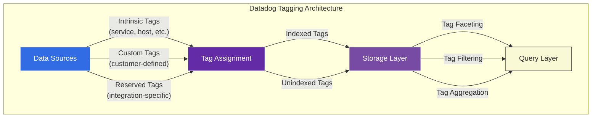
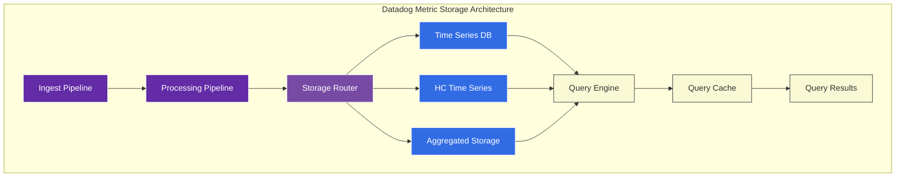
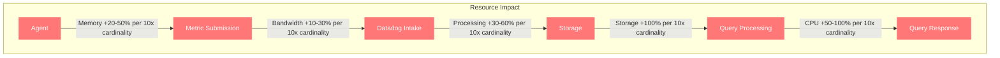
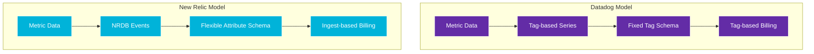
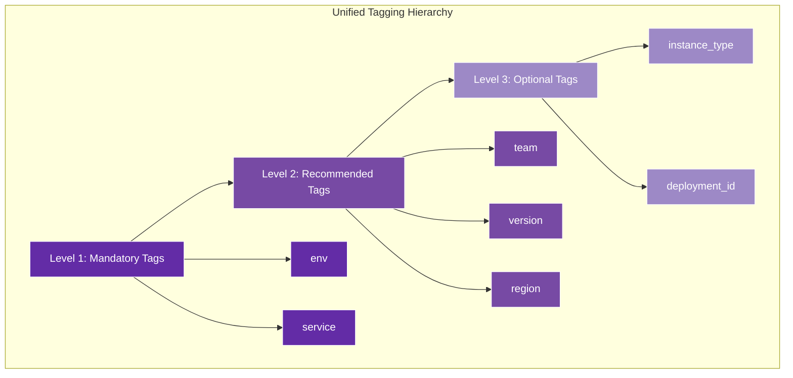
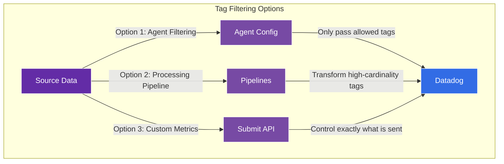
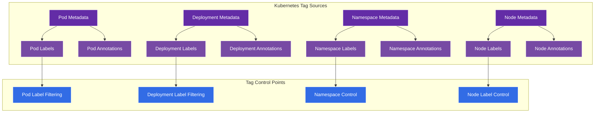
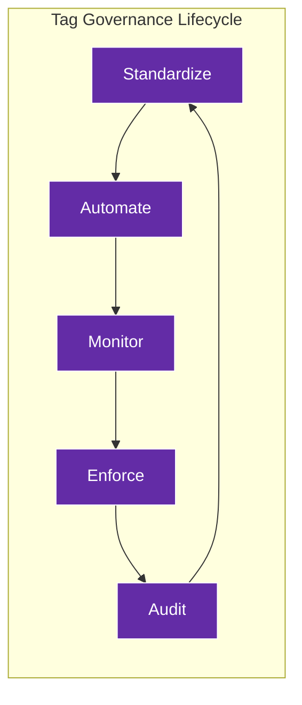
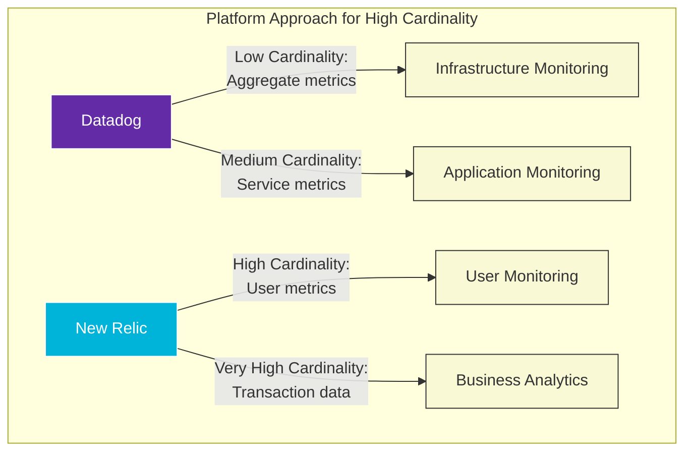

# Tag Cardinality Management in Datadog

## Executive Summary

Tag cardinality management represents one of the most critical architectural considerations when implementing Datadog in enterprise environments. This chapter provides a comprehensive analysis of Datadog's tagging system, cardinality limitations, management techniques, and architectural implications, juxtaposed with New Relic's dimensional data model. We examine the technical underpinnings, performance characteristics, and economic implications of high-cardinality environments in Datadog deployments.

As organizations scale their observability implementations, unmanaged tag cardinality can lead to significant performance degradation, excessive costs, and reduced analytical effectiveness. Datadog and New Relic implement fundamentally different approaches to handling high-cardinality data, each with distinct advantages and limitations. This chapter equips architects and operators with the technical knowledge to implement effective cardinality management strategies, optimize tagging practices, and design scalable observability architectures that balance analytical power with operational efficiency.

## Datadog Tagging Architecture

Datadog's tagging system serves as the foundation for its unified observability platform, enabling correlation across metrics, logs, and traces.

### Core Tagging Principles



### Tagging Implementation

Datadog tags follow a key:value format with specific syntactical requirements:

| Tag Component | Requirements | Examples | Notes |
|---------------|--------------|----------|-------|
| **Keys** | Letters, numbers, underscores, hyphens | `env`, `service_name`, `pod-id` | Case-insensitive, limited to 200 characters |
| **Values** | Letters, numbers, underscores, hyphens, colons, periods, slashes | `production`, `auth_service`, `us-east-1` | Case-sensitive, limited to 200 characters |
| **Separators** | Colon (`:`) between key and value | `env:production` | Alternative equal sign (`=`) also accepted |
| **Special Characters** | Not allowed | Avoid spaces, quotes, and special chars | Replaced or dropped during processing |
| **Tag Count** | Varies by data type | See cardinality limits table | Different limits for metrics vs. logs/APM |

### Cardinality Limits by Data Type

| Data Type | Max Tags per Entry | Max Unique Tag Values¹ | Notes |
|-----------|-------------------|------------------------|-------|
| **Metrics** | 100 | 50,000² | Most restrictive cardinality limits |
| **Logs** | 100 | 300,000³ | Higher cardinality allowance than metrics |
| **APM** | 50 | 300,000³ | Similar to logs, but fewer tags per span |
| **RUM** | 50 | 300,000³ | Browser-side monitoring has client constraints |
| **Synthetics** | 20 | 300,000³ | Limited tag usage in synthetic tests |
| **Infrastructure** | 80 | 300,000³ | Host and container metadata as tags |

¹ Per organization across all data types  
² Soft limit per metric; exceeding requires support intervention  
³ Soft limit per tag key across organization  

## Technical Deep-Dive: Tag Cardinality

### Cardinality Mechanics

Datadog's internal architecture handles tags differently based on the data type and intended use:

```mermaid
graph TD
    subgraph "Metric Tag Processing"
        M1[Metric Data Point]
        M2[Tag Extraction]
        M3[Tag Normalization]
        M4[Unique Series Creation]
        M5[TSDB Storage]
        
        M1 --> M2 --> M3 --> M4 --> M5
    end
    
    subgraph "Log Tag Processing"
        L1[Log Entry]
        L2[Tag Extraction]
        L3[Tag Normalization]
        L4[Index Selection]
        L5[Document Storage]
        
        L1 --> L2 --> L3 --> L4 --> L5
    end
    
    subgraph "APM Tag Processing"
        A1[Span]
        A2[Tag Extraction]
        A3[Tag Normalization]
        A4[Context Enrichment]
        A5[Trace Storage]
        
        A1 --> A2 --> A3 --> A4 --> A5
    end
    
    classDef metrics fill:#632CA6,stroke:#fff,stroke-width:1px,color:#fff
    classDef logs fill:#774AA4,stroke:#fff,stroke-width:1px,color:#fff
    classDef apm fill:#326CE5,stroke:#fff,stroke-width:1px,color:#fff
    
    class M1,M2,M3,M4,M5 metrics
    class L1,L2,L3,L4,L5 logs
    class A1,A2,A3,A4,A5 apm
```



### Metric Tag Architecture

For metrics, each unique combination of metric name and tag set creates a distinct time series:

1. **Series Formation**: `<metric_name>{<tag_key_1>:<tag_value_1>,<tag_key_2>:<tag_value_2>,...}`
2. **Storage Model**: Optimized columnar storage for fast time-based queries
3. **Indexing Strategy**: Inverted index on tag keys and values
4. **Query Processing**: Query rewriting to leverage tag indices

The multiplicative effect of tags on metrics creates a "cardinality explosion" risk:

<!-- TB-DD-TAG-1: Tag Combination Growth -->

| Base Metric | Tag 1<br>(10 values) | Tag 2<br>(20 values) | Tag 3<br>(50 values) | Tag 4<br>(100 values) | Total Series | Storage Impact |
|-------------|---------------------|---------------------|---------------------|----------------------|--------------|----------------|
| 1 metric | ✓ | - | - | - | 10 series | ~20 KB |
| 1 metric | ✓ | ✓ | - | - | 200 series | ~400 KB |
| 1 metric | ✓ | ✓ | ✓ | - | 10,000 series | ~20 MB |
| 1 metric | ✓ | ✓ | ✓ | ✓ | 1,000,000 series | ~2 GB |
| 10 metrics | ✓ | ✓ | ✓ | - | 100,000 series | ~200 MB |
| 10 metrics | ✓ | ✓ | ✓ | ✓ | 10,000,000 series | ~20 GB |

*Storage impact estimated at ~2KB per series including metadata and 15-day retention*

### Internal Database Architecture

Datadog's internal storage architecture handles high-cardinality data through specialized components:



Datadog employs various techniques to handle high-cardinality data:

1. **Specialized High-Cardinality Storage**: Separate storage for high-cardinality metrics
2. **Tiered Storage Model**: Different retention periods based on cardinality
3. **Automatic Aggregation**: Pre-aggregation for high-cardinality series
4. **Dynamic Sampling**: Variable sampling rates for high-volume metrics
5. **Tag Value Compression**: Dictionary encoding for common tag values

## Performance Impact of High Cardinality

### Query Performance Degradation

High tag cardinality directly impacts query performance in Datadog:

| Cardinality Level | Series Count | Avg. Query Time | Cache Effectiveness | Dashboard Load |
|-------------------|--------------|-----------------|---------------------|----------------|
| Low (<10K series) | 1,000-10,000 | 100-300ms | High (90%+ hit rate) | 1-3 seconds |
| Medium (10K-100K) | 10,000-100,000 | 300-800ms | Medium (60-90% hit rate) | 3-8 seconds |
| High (100K-1M) | 100,000-1,000,000 | 0.8-2 seconds | Low (30-60% hit rate) | 8-15 seconds |
| Very High (>1M) | >1,000,000 | 2-10+ seconds | Very low (<30% hit rate) | 15-30+ seconds |
| Extreme (>10M) | >10,000,000 | 10+ seconds or timeouts | Ineffective (<10% hit rate) | 30+ seconds or failures |

The relationship between cardinality and query performance follows a non-linear degradation curve, particularly affecting:

1. **Aggregation Operations**: `sum`, `avg`, `percentile` across many series
2. **Group By Clauses**: Especially with high-cardinality dimensions
3. **Time Range Expansion**: Queries across longer time periods
4. **Complex Composite Queries**: Multiple metrics with transformations

### Agent and Backend Resource Consumption

High cardinality impacts resource consumption throughout the pipeline:



| Component | Low Cardinality | Medium Cardinality | High Cardinality | Very High Cardinality |
|-----------|-----------------|--------------------|--------------------|------------------------|
| **Agent CPU** | 1-5% core | 5-15% core | 15-30% core | 30-100%+ core |
| **Agent Memory** | 100-200 MB | 200-500 MB | 500-1200 MB | 1.2-4+ GB |
| **Network Bandwidth** | 0.5-2 MB/min | 2-10 MB/min | 10-50 MB/min | 50-200+ MB/min |
| **Intake Processing** | Minimal | Moderate | High | Very high/throttling |
| **Query Response Time** | 100-300ms | 300-1000ms | 1-5 seconds | 5-30+ seconds |

## Datadog vs. New Relic: Cardinality Model Comparison

Datadog and New Relic implement fundamentally different approaches to handling high-cardinality data:

### Architectural Differences



This fundamental architectural difference creates distinct cardinality characteristics:

| Aspect | Datadog Approach | New Relic Approach | Implications |
|--------|------------------|-------------------|--------------|
| **Data Model** | Tag-based series model | Dimensional event model (NRDB) | NR handles high cardinality more naturally |
| **Storage Design** | Optimized time-series DB | Columnar telemetry database | Different performance characteristics |
| **Cardinality Limits** | Strict technical limits | Economic rather than technical limits | Different scaling constraints |
| **Query Language** | Specialized metric query language | SQL-like query language (NRQL) | Impacts query flexibility |
| **Cost Model** | Host-based plus custom metrics | Data ingest-based | Different economic incentives |

### Cardinality Management Comparison

| Capability | Datadog Implementation | New Relic Implementation | Comparison |
|------------|------------------------|-----------------------------|------------|
| **Default Tag Handling** | Strict cardinality limits | Flexible dimensional model | NR more accommodating of high cardinality |
| **High-Cardinality Solutions** | Tag filtering, exclusion, custom metrics | Native dimensional model | NR has architectural advantage |
| **Retention Handling** | Cardinality-based retention | Consistent retention policies | DD more complex retention management |
| **Schema Management** | Static tag approach | Dynamic attribute approach | NR more flexible schema |
| **Query Performance** | Degrades with cardinality | More resilient to high cardinality | NR better high-cardinality query performance |
| **Billing Impact** | Custom metrics pricing | Data ingest pricing | Different economic optimization strategies |

### Performance Comparison

Comparative query performance with increasing cardinality:

| Cardinality Level | Datadog Response Time | New Relic Response Time | Performance Differential |
|-------------------|---------------------|------------------------|--------------------------|
| Low (<10K series) | 100-300ms | 200-400ms | Similar (DD slightly faster) |
| Medium (10K-100K) | 300-800ms | 300-600ms | Similar (NR slightly faster) |
| High (100K-1M) | 0.8-2 seconds | 0.6-1.2 seconds | NR 30-40% faster |
| Very High (>1M) | 2-10+ seconds | 1-3 seconds | NR 60-70% faster |
| Extreme (>10M) | 10+ seconds or timeouts | 2-6 seconds | NR 70-80% faster |

## Datadog Tag Management Strategies

### 1. Unified Tagging Strategy

Datadog recommends a unified tagging strategy to ensure consistency across data types:



#### Recommended Tag Structure for Enterprise Deployments

| Category | Standard Tags | Example Values | Purpose |
|----------|--------------|----------------|---------|
| **Environment** | `env` | `prod`, `staging`, `dev` | Environment segregation |
| **Service** | `service` | `auth-api`, `payment-processor` | Service identification |
| **Deployment** | `version`, `build_id` | `v1.2.3`, `b12345` | Deployment tracking |
| **Ownership** | `team`, `cost_center`, `product` | `platform`, `finance`, `checkout` | Organizational alignment |
| **Infrastructure** | `zone`, `region`, `cluster` | `us-east-1a`, `gcp-central`, `k8s-1` | Infrastructure location |
| **Application** | `tier`, `component` | `web`, `api`, `db`, `cache` | Application architecture |
| **Container** | `pod`, `deployment`, `namespace` | `auth-pod-1`, `api-deploy`, `production` | Kubernetes context |

### 2. Tag Cardinality Control

Implement cardinality controls in the agent configuration:

```yaml
# Datadog Agent config.yaml example
# Control tag cardinality at the source
datadog_config:
  tags:
    - "env:production"
    - "service:payment-api"
    - "team:platform"
  tag_value_split_separator: ","
  
  # Exclude high-cardinality tags
  exclude_process_tags:
    - "command"
  
  # Filter high-cardinality container labels
  container_include_metrics:
    - "image_name:datadog/agent"
  container_exclude_metrics:
    - "name:.*"
  
  # Kubernetes pod label filtering
  kubernetes_pod_labels_as_tags:
    app: "kube_app"
    version: "kube_version"
  # Exclude other pod labels
  kubernetes_pod_annotations_as_tags: {}
```

### 3. High-Cardinality Handling

Multiple techniques are available to manage high-cardinality tags in Datadog:

#### Tag Filtering Strategies



| Approach | Implementation | Advantages | Disadvantages |
|----------|---------------|------------|---------------|
| **Agent Exclusion** | Configure agent to exclude high-cardinality tags | Simple, effective at source | Limited flexibility, requires agent restart |
| **Tag Processor Pipeline** | Create processing rules to transform tags | No agent changes, centralized control | Added complexity, processing latency |
| **Submission API Control** | Custom code to control tag submission | Complete control | Development overhead, maintenance burden |
| **Tag Value Mapping** | Replace high-cardinality values with buckets | Preserves analytics capability | Added complexity, information loss |
| **Sampling** | Submit subset of high-cardinality metrics | Cost-effective | Potential data loss, sampling bias |

#### Example: Tag Transformation Pipeline

```yaml
# Tag processor pipeline
processors:
  - name: "High-Cardinality Control"
    type: "string_mapper"
    # Process request_path tag
    sources:
      - "request_path"
    # Map to a lower-cardinality tag
    target: "endpoint"
    mappings:
      # Extract patterns from paths
      - source: "^/api/users/\\d+$"
        target: "/api/users/{id}"
      - source: "^/api/orders/\\d+/items$"
        target: "/api/orders/{id}/items"
      # Default pattern for unmapped paths
      - source: ".*"
        target: "other_endpoint"
```

## Cost Implications of High Cardinality

### Economic Impact Model

Datadog's pricing model creates specific cardinality cost implications:

<!-- TB-DD-TAG-2: Cost Impact Analysis -->

| Scenario | Host Count | Base Metrics | Custom Metrics | Cost Component | Monthly Cost* |
|----------|------------|--------------|----------------|----------------|---------------|
| **Small, Low Cardinality** | 50 | 2,000 | 2,000 | Host-based | $750 |
| **Small, High Cardinality** | 50 | 2,000 | 200,000 | Host + Custom Metrics | $5,750+ |
| **Medium, Low Cardinality** | 500 | 20,000 | 20,000 | Host-based | $7,500 |
| **Medium, High Cardinality** | 500 | 20,000 | 2,000,000 | Host + Custom Metrics | $57,500+ |
| **Large, Low Cardinality** | 2,000 | 80,000 | 80,000 | Host-based | $30,000 |
| **Large, High Cardinality** | 2,000 | 80,000 | 8,000,000 | Host + Custom Metrics | $230,000+ |

*Cost estimates based on standard pricing; actual costs may vary with negotiated contracts and discounts.

### Cost Optimization Strategies

| Strategy | Implementation | Cost Savings Potential | Operational Impact |
|----------|---------------|------------------------|---------------------|
| **Cardinality Reduction** | Eliminate unnecessary tags | 30-70% cost reduction | Minimal impact with proper planning |
| **Tag Standardization** | Implement consistent tagging | 10-30% cost reduction | Requires organizational discipline |
| **Metric Filtering** | Limit high-cardinality metrics | 20-50% cost reduction | May reduce analytical capability |
| **Custom Metrics Optimization** | Consolidate similar metrics | 10-40% cost reduction | Requires application changes |
| **Sampling Approach** | Sample high-volume metrics | 40-80% cost reduction | Trade-off with data completeness |

## Advanced Tag Cardinality Controls

### 1. Kubernetes Integration Optimization

Kubernetes environments can easily generate excessive tag cardinality:



Kubernetes tag optimization configuration:

```yaml
# Cluster Agent kubernetes_pod_labels_as_tags
kubernetes_pod_labels_as_tags:
  app: "kube_app"
  version: "kube_version"
  environment: "kube_env"
  # Only include specific labels, excluding others

# Control orchestrator explorer cardinality
orchestrator_explorer:
  container_scrubbing:
    enabled: true
    skip_containers:
      - "image:datadog/agent"
      - "image:datadog/cluster-agent"
    skip_images:
      - "registry.internal/.*"
    skip_labels:
      - "sandbox.k8s.io/runtime.*"
      - "alpha.kubernetes.io/provided-node-ip"
      - "controller-revision-hash"
      - "pod-template-generation"
      - "pod-template-hash"
```

### 2. Log-to-Metric Integration

When generating metrics from logs, cardinality control is critical:

```yaml
# Log-to-metric pipeline with cardinality control
logs_to_metrics:
  - log_source: "nginx"
    name: "nginx.request.count"
    type: "count"
    # Control cardinality with limited tag extraction
    tags:
      status: "status"
      method: "method"
      # Intentionally exclude high-cardinality path/URL tags
```

### 3. Cardinality Explorer

Datadog provides tooling to identify cardinality contributors:

| Tool | Purpose | Use Case |
|------|---------|----------|
| **Metrics Summary** | Identifies high-volume metrics | Find metrics generating the most points |
| **Tag Configuration** | Reviews tag assignments | Audit and modify tagging strategy |
| **Tag Cardinality Stats** | Shows unique values per tag | Identify high-cardinality tags |
| **Active Metrics** | Lists all active metrics | Discover unused metrics to remove |
| **Custom Metrics** | Shows billing impact | Understand which metrics drive costs |

## Implementation Best Practices

### 1. Tag Governance Framework

Establish formal tag governance processes:



| Governance Area | Implementation | Tools | Stakeholders |
|-----------------|----------------|-------|------------|
| **Standards Definition** | Create tagging standards document | Wiki, version control | Platform, SRE, DevOps teams |
| **Automation** | Implement via IaC, GitOps | Terraform, Ansible, Helm | DevOps, SRE teams |
| **Monitoring** | Track cardinality metrics | Datadog dashboards, custom monitors | SRE, Operations |
| **Enforcement** | CI/CD validation, admission controllers | Policy engines, OPA, Kyverno | Security, Platform teams |
| **Auditing** | Regular compliance reviews | Custom reports, dashboards | Operations, FinOps teams |

### 2. Cardinality Alerting

Implement proactive cardinality monitoring:

```nrql
# Example monitor query for cardinality growth
query {
  from(query: 'sum:custom_metrics.count{*} by {service}.fill(null, 0)') {
    group_by(@service) {
      count_distinct(@service) > 1000
    }
  }
}
```

| Alert Type | Monitor Target | Threshold Example | Response Action |
|------------|----------------|-------------------|----------------|
| **Warning: Cardinality Growth** | Week-over-week growth | >20% increase | Review recent changes |
| **Critical: Cardinality Spike** | Day-over-day growth | >50% increase | Immediate investigation |
| **Warning: Tag Count** | Tags per metric | >20 tags | Review tagging practices |
| **Critical: High-Cardinality Tag** | Unique values per tag | >1000 values | Implement value mapping |
| **Warning: Custom Metrics Count** | Total custom metrics | >80% of contract | Optimize metric submission |

### 3. Advanced Filtering Patterns

Implement sophisticated filtering for complex environments:

| Filtering Pattern | Example | Use Case |
|-------------------|---------|----------|
| **Regex Tag Filtering** | `kubernetes_pod_labels_as_tags: {"app\.kubernetes\.io/.*": "kube_app_$1"}` | Extract specific label patterns |
| **Tag Value Remapping** | Mapping high-cardinality IDs to groups | User IDs to user types |
| **Conditional Tagging** | Only tag specific services with version | Version tracking for key services |
| **Hierarchical Inclusion** | Include only critical namespace metadata | Kubernetes control |
| **Denylist Approach** | Block specific high-cardinality sources | Avoid problematic sources |

## New Relic Integration Considerations

For organizations using both Datadog and New Relic, consider these integration strategies:

| Scenario | Approach | Benefits | Considerations |
|----------|----------|----------|---------------|
| **Dual Monitoring** | Use consistent tagging across platforms | Unified analysis | Tag maintenance overhead |
| **Migration Strategy** | Map Datadog tags to New Relic attributes | Smooth transition | Schema conversion complexity |
| **Hybrid Model** | Use each platform's strengths | Optimized cost and capability | Operational complexity |
| **Unified Dashboarding** | Map metrics between platforms | Single view across tools | Integration maintenance |
| **Cost Optimization** | Selective instrumentation per platform | Lowest overall cost | Potential visibility gaps |

The New Relic dimensional model offers advantages for high-cardinality data:



## Conclusion

Effective tag cardinality management represents a critical success factor for Datadog implementations at scale. By implementing deliberate tagging strategies, cardinality controls, and ongoing governance, organizations can avoid the performance degradation, excessive costs, and reduced analytical capability that result from unmanaged tag proliferation.

The fundamental architectural differences between Datadog's tag-based series model and New Relic's dimensional data model create distinct approaches to high-cardinality data. While Datadog offers powerful capabilities within its tagging system, organizations should carefully align their tagging strategy with both their analytical requirements and economic constraints.

For complex observability environments, a hybrid approach that leverages the strengths of both platforms—using Datadog for infrastructure and application monitoring with controlled cardinality, and New Relic for high-cardinality business and user analytics—may provide an optimal balance of capability, performance, and cost.

---

**Next Section**: [09_FinOps/01_Unit_Cost.md](../09_FinOps/01_Unit_Cost.md)
