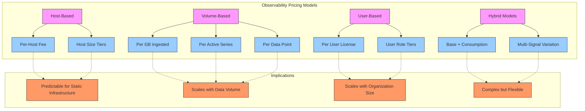
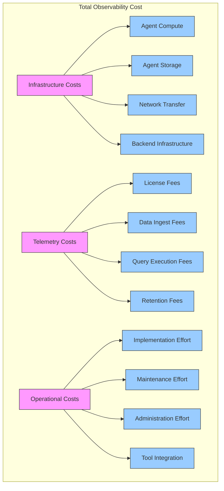
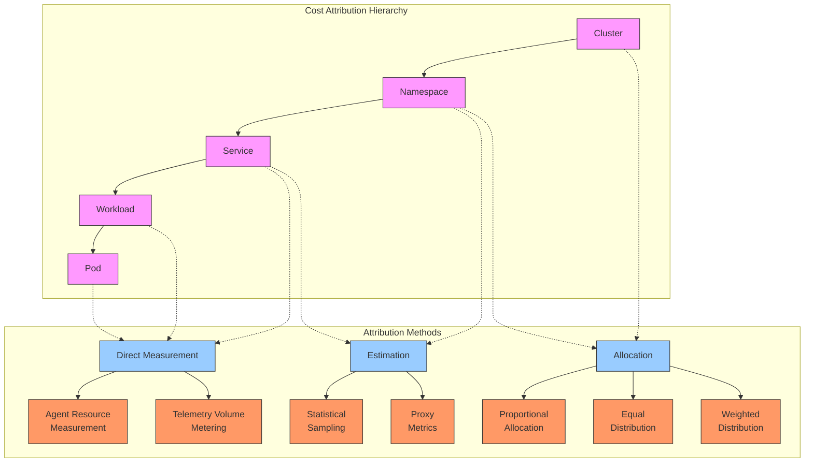
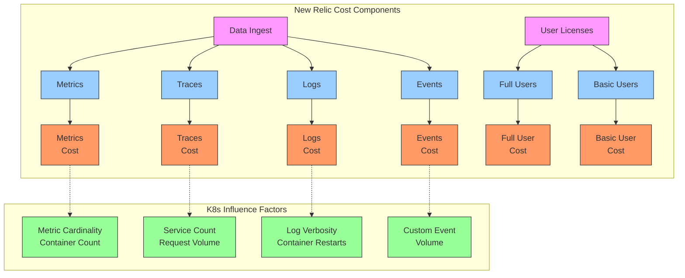
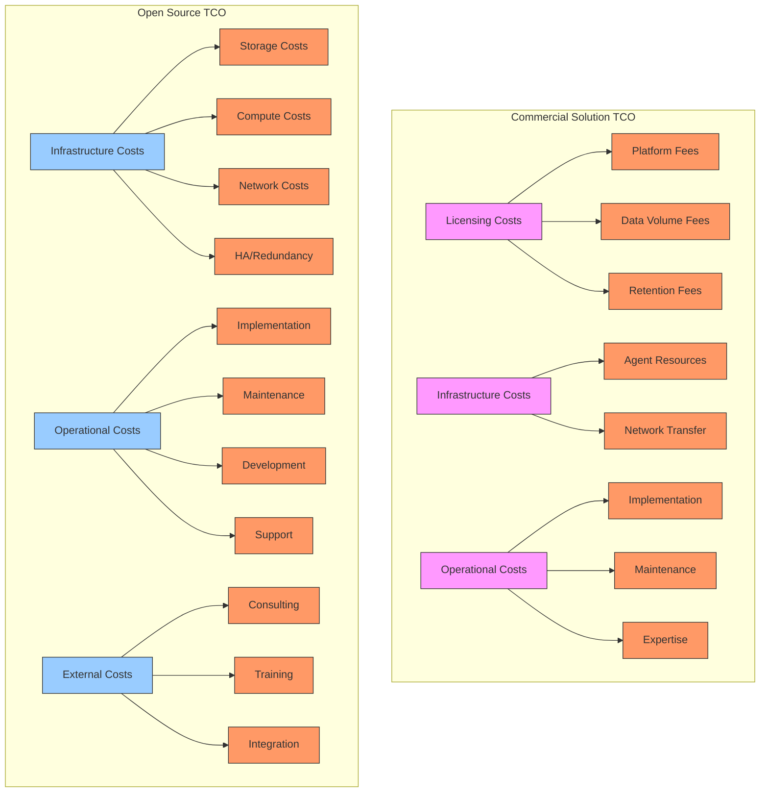
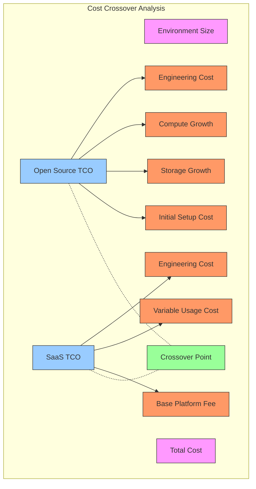
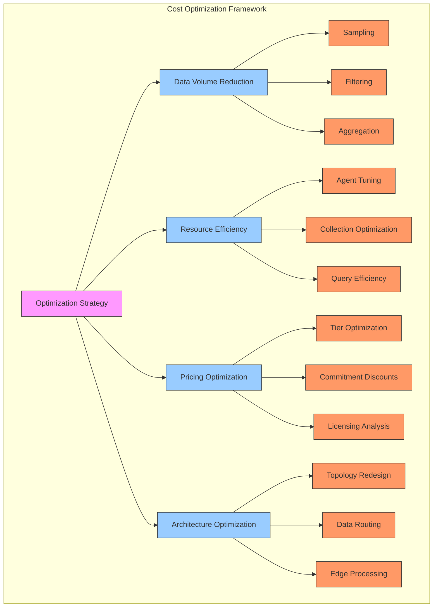

# FinOps Unit Cost Modeling

## Executive Summary

As organizations scale their observability practices, understanding and optimizing the cost structure becomes increasingly important. This chapter explores the financial aspects of observability, focusing on unit economics, cost attribution models, and optimization strategies. We examine how different pricing models impact total cost of ownership across various scales and usage patterns, with particular emphasis on Kubernetes environments where resource utilization can be dynamic and complex.

Observability platforms like New Relic, Prometheus, Datadog, and others employ different pricing models that fundamentally impact how costs scale with usage. By understanding these models and developing robust unit cost calculations, organizations can make informed decisions about observability strategies, accurately forecast costs as they scale, and identify specific optimization opportunities. This chapter provides a comprehensive framework for analyzing observability costs, strategies for cost attribution, and practical approaches to optimizing the price-to-value ratio of your monitoring infrastructure.

## Observability Pricing Models

Different observability platforms employ distinct pricing models, each with unique implications for cost scaling.



### Pricing Model Comparison

| Pricing Model | Key Characteristic | Primary Vendors | Best For | Challenges |
|---------------|-------------------|----------------|----------|------------|
| **Host-Based** | Fixed per-host fee | Datadog, Dynatrace | Static VM environments | Container explosion |
| **Volume-Based** | Pay for data ingested | New Relic, Elastic | Variable workloads | Cost predictability |
| **User-Based** | Pay per seat/user | Grafana Enterprise | Small teams, wide deployment | Team growth |
| **Series-Based** | Pay per active series | Prometheus (commercial) | Low-cardinality metrics | High-cardinality explosion |
| **Hybrid** | Mix of base + consumption | Splunk, Sumo Logic | Complex requirements | Optimization complexity |

### Pricing Model Impact on Container Environments

Traditional host-based pricing models face challenges in containerized environments due to:

1. **Container Density**: Many containers per host increases effective per-container cost
2. **Ephemeral Workloads**: Short-lived containers still consume billable metrics
3. **Horizontal Scaling**: Costs can grow non-linearly as applications scale out
4. **Multi-Tenancy**: Difficult to attribute costs to specific teams or applications

## Unit Cost Modeling

To effectively manage observability costs, organizations need clear unit economics models.

### Core Cost Components



### Unit Cost Formula for Volume-Based Pricing

The unit cost model for a volume-based pricing system like New Relic:

```
Total Monthly Cost = 
    Base Fee + 
    (Ingest Volume GB × Ingest Cost per GB) + 
    (Retention Volume GB × Retention Cost per GB) + 
    Infrastructure Costs
```

Where:
- **Base Fee**: Minimum platform fee (if applicable)
- **Ingest Volume**: Total data ingested monthly
- **Ingest Cost**: Cost per GB ingested
- **Retention Volume**: Data retained beyond standard retention
- **Retention Cost**: Cost per GB for extended retention
- **Infrastructure Costs**: Agent resource consumption costs

### Unit Cost Formula for Host-Based Pricing

The unit cost model for a host-based pricing system like Datadog:

```
Total Monthly Cost = 
    (Host Count × Host Fee) + 
    (Custom Metrics × Metric Fee) + 
    (Log Volume GB × Log Fee per GB) + 
    Infrastructure Costs
```

Where:
- **Host Count**: Number of monitored hosts
- **Host Fee**: Per-host monitoring fee
- **Custom Metrics**: Count of custom metrics beyond included amount
- **Metric Fee**: Fee per custom metric
- **Log Volume**: Total log data ingested
- **Log Fee**: Per GB fee for log data
- **Infrastructure Costs**: Agent resource consumption costs

### Unit Cost Normalization for Kubernetes

For Kubernetes environments, normalize costs to more meaningful units:

```
Cost per Pod = 
    Total Monthly Cost / Average Active Pod Count

Cost per Service = 
    Total Monthly Cost / Number of Monitored Services

Cost per Namespace = 
    Total Monthly Cost / Number of Monitored Namespaces
```

This normalization allows for meaningful comparisons as your environment scales.

## Cost Attribution Models

Proper cost attribution is essential for accountability and optimization.

### Kubernetes Cost Attribution Hierarchy



### Implementing Cost Attribution

| Level | Attribution Method | Implementation Approach | Data Sources |
|-------|-------------------|------------------------|--------------|
| **Cluster** | Dedicated accounts/projects | One observability account per cluster | Account-level billing |
| **Namespace** | Label-based segmentation | Standard namespace labels | Metric filtering by namespace |
| **Service** | Telemetry volume measurement | Custom attributes for service identification | Service-level volume analysis |
| **Workload** | Direct measurement | Instrumentation and agent resource tracking | Agent metrics, trace volumes |
| **Pod** | Resource consumption | Container resource usage | Kubernetes metrics |

### Cost Allocation Keys

Various metrics can serve as allocation keys for shared observability costs:

| Allocation Key | Calculation Method | Pros | Cons |
|----------------|-------------------|------|------|
| **Pod Count** | Cost × (Team Pod Count / Total Pod Count) | Simple, stable | Ignores pod resource differences |
| **Container CPU** | Cost × (Team CPU Request / Total CPU Request) | Correlates with workload size | May not reflect actual telemetry volume |
| **Telemetry Volume** | Cost × (Team Telemetry GB / Total Telemetry GB) | Directly ties to consumption | Requires telemetry tagging |
| **Trace Count** | Cost × (Team Trace Count / Total Trace Count) | Reflects application activity | Can favor inefficient applications |
| **Request Count** | Cost × (Team Request Count / Total Request Count) | Ties to business value | Requires consistent instrumentation |

## New Relic Cost Structure Analysis

New Relic's consumption-based pricing model has specific implications for Kubernetes monitoring.

### New Relic Billing Components



### Cost Breakdown by Signal Type

In a typical Kubernetes environment, the cost distribution across signals often follows this pattern:

| Signal Type | Typical % of Total Cost | K8s-Specific Drivers | Optimization Potential |
|-------------|------------------------|---------------------|------------------------|
| **Metrics** | 40-60% | Container count, cardinality | High |
| **Logs** | 20-40% | Log verbosity, container restarts | Very High |
| **Traces** | 10-30% | Service count, transaction volume | Medium |
| **Events** | 5-15% | Custom events, alerts | Low |
| **User Licenses** | Varies | Team size | Low |

### K8s-Specific Telemetry Cost Drivers

Kubernetes environments have unique characteristics that drive observability costs:

1. **Metric Cardinality**: Label combinations create high-cardinality metrics
2. **Container Churn**: Ephemeral containers generate transient telemetry
3. **System Components**: Kubernetes system components generate substantial telemetry
4. **Multi-Cluster**: Duplicate metrics across clusters increase overall volume
5. **Verbose Logging**: Default log configurations can be unnecessarily verbose

## Unit Cost Comparison: Open Source vs. Commercial

Comparing the fully-loaded costs of open source and commercial observability solutions.

### TCO Model Components



### Cost Comparison Table

| Component | Open Source (Prometheus Stack) | SaaS (New Relic) | Notes |
|-----------|------------------------------|------------------|-------|
| **License Cost** | $0 | Variable: ~$0.25-0.30/GB ingested | Commercial scales with usage |
| **Storage** | ~$0.10/GB-month | Included | OSS requires dedicated storage |
| **Compute** | ~$50-200/node-month | Minimal agent overhead | OSS needs dedicated infrastructure |
| **Implementation** | 2-3x more engineer-hours | 1x engineer-hours | OSS requires more setup |
| **Maintenance** | Ongoing engineering time | Minimal | OSS requires continual maintenance |
| **Scalability Cost** | Non-linear growth | Linear growth | OSS becomes expensive at scale |
| **Retention Cost** | Linear storage growth | Tiered pricing | Long retention expensive for both |
| **High Availability** | 3x infrastructure cost | Included | OSS requires redundant setup |

### TCO Formula for Open Source

```
Annual OSS TCO = 
    Infrastructure Costs + 
    Implementation Costs + 
    Maintenance Costs + 
    Scalability Costs + 
    Opportunity Costs

Where:
Infrastructure Costs = 
    Storage Costs + 
    Compute Costs + 
    Network Costs + 
    HA Redundancy Costs
```

### TCO Formula for Commercial SaaS

```
Annual SaaS TCO = 
    Licensing Costs + 
    Agent Infrastructure Costs + 
    Implementation Costs + 
    Operational Costs

Where:
Licensing Costs = 
    Platform Fees + 
    Data Volume Fees + 
    Retention Fees + 
    User License Fees
```

### Crossover Analysis

For many organizations, a "crossover point" exists where commercial solutions become more cost-effective than self-managed open source:



Typical crossover factors for Kubernetes environments:
- **Cluster Count**: 3-5 production clusters
- **Node Count**: 50-200 nodes
- **Engineer Cost**: Fully-loaded engineering costs > $150K/year
- **Data Volume**: 5-10 TB monthly telemetry volume

## Cost Optimization Strategies

Practical approaches to optimize observability costs while maintaining value.

### Optimization Framework



### Kubernetes-Specific Optimization Techniques

| Optimization Technique | Implementation | Impact | Tradeoffs |
|------------------------|----------------|--------|-----------|
| **Label Filtering** | Remove high-cardinality labels | 10-50% metric reduction | Reduced dimensionality |
| **Container Filtering** | Exclude system containers | 15-30% metric reduction | Less visibility into system components |
| **Log Level Adjustment** | Change default log levels | 40-80% log reduction | Reduced debugging information |
| **Trace Sampling** | Implement adaptive sampling | 70-95% trace reduction | Statistical visibility vs. completeness |
| **Metric Resolution** | Reduce collection frequency | 50-80% metric reduction | Lower temporal resolution |
| **Aggregation** | Pre-aggregate metrics | 40-70% metric reduction | Loss of raw data granularity |

### Practical Implementation Examples

#### OTel Collector Filtering Example

```yaml
# OpenTelemetry Collector filtering configuration
processors:
  filter:
    metrics:
      exclude:
        match_type: regexp
        metric_names:
          - 'container\.memory\.working_set.*'
          - 'container\.cpu\..*'
          - 'kubernetes\.pod\..*'
        resource_attributes:
          - key: k8s.namespace.name
            value: kube-system
  metricstransform:
    transforms:
      - include: '.*'
        action: update
        operations:
          - action: drop_dimensions
            dimension_pairs:
              - dimension1: container.id
              - dimension1: pod.uid
```

#### Log Level Configuration

```yaml
# Kubernetes log level configuration
apiVersion: v1
kind: ConfigMap
metadata:
  name: logging-config
data:
  log-config.yaml: |
    level: warn
    development: false
    disableCaller: true
    disableStacktrace: true
    sampling:
      initial: 5
      thereafter: 100
```

#### Trace Sampling Configuration

```yaml
# OpenTelemetry Collector trace sampling
processors:
  probabilistic_sampler:
    hash_seed: 22
    sampling_percentage: 10
  tail_sampling:
    decision_wait: 10s
    num_traces: 100
    expected_new_traces_per_sec: 10
    policies:
      - name: error-policy
        type: status_code
        status_code:
          status_codes: [ERROR]
      - name: rate-limiting
        type: rate_limiting
        rate_limiting:
          spans_per_second: 100
```

### Data Governance Framework

Implementing data governance policies is essential for cost control:

1. **Telemetry Standards**: Define standard labels, metrics, and logging practices
2. **Collection Policies**: Establish guidelines for what to collect and at what granularity
3. **Retention Policies**: Define how long to keep different types of telemetry
4. **Access Controls**: Limit access to costly queries and data exports
5. **Chargeback Model**: Implement cost attribution to drive team accountability

## Measuring ROI on Observability

Organizations should quantify the value of their observability investments.

### ROI Formula for Observability

```
Observability ROI = (Value Generated - Total Cost) / Total Cost

Where:
Value Generated = 
    Incident Reduction Value + 
    MTTR Improvement Value + 
    Prevention Value + 
    Operational Efficiency Value
```

### Quantifying Observability Value

| Value Category | Calculation Method | Measurement Approach |
|----------------|-------------------|---------------------|
| **Incident Reduction** | (Incident Count Before - Incident Count After) × Avg. Incident Cost | Track incident rates before/after implementation |
| **MTTR Improvement** | (MTTR Before - MTTR After) × Hourly Cost × Incident Count | Measure resolution time trends |
| **Prevention Value** | Problems Prevented × Estimated Impact | Track proactive fixes from monitoring insights |
| **Efficiency Value** | Time Savings × Engineer Hourly Cost | Survey teams on time saved |
| **Availability Improvement** | Revenue × (Availability After - Availability Before) | Calculate availability impact on revenue |

### ROI by Kubernetes Context

| Kubernetes Context | Key Value Drivers | Measurement Approach |
|-------------------|-------------------|---------------------|
| **Development** | Faster debugging, fewer defects | Developer time savings, defect rates |
| **Production** | Reduced downtime, faster resolution | Availability metrics, MTTR |
| **Platform** | Resource optimization, capacity planning | Infrastructure cost savings |
| **Security** | Early detection, faster response | Security incident metrics |
| **Cost Management** | Resource optimization, waste reduction | Direct infrastructure savings |

## New Relic-Specific Cost Optimization

Strategies specifically tailored to New Relic's consumption-based pricing model.

### New Relic Data Reduction Strategies

| Strategy | Implementation | Impact | Notes |
|----------|----------------|--------|-------|
| **Metric Rules** | Configure drop_attributes and drop_data rules | 20-50% metrics reduction | Managed in New Relic UI |
| **Infinite Tracing** | Configure tail-based sampling | 80-95% trace reduction | Preserves important traces |
| **Log Patterns** | Enable log patterns feature | 40-70% log reduction | Automatically groups similar logs |
| **NRQL Insights** | Optimize NRQL queries | Indirect cost reduction | More efficient queries reduce resource needs |
| **Low-Data Mode** | Enable low-data mode on Kubernetes integration | 30-50% metric reduction | Simplified metric collection |

### Implementing Low-Data Mode

```yaml
# New Relic Kubernetes integration low-data mode
apiVersion: v1
kind: ConfigMap
metadata:
  name: nri-bundle-config
  namespace: newrelic
data:
  newrelic-infrastructure-config: |
    low_data_mode: true
    fedramp: false
  nri-kubernetes-config: |
    cluster_name: production
    low_data_mode: true
    verbose: false
    scrape_services: false
    scrape_endpoints: false
    insecure_skip_verify: false
```

### Attribute Filtering Strategy

```yaml
# New Relic attribute filtering
attributes:
  include:
    - service.name
    - service.namespace
    - k8s.cluster.name
    - k8s.namespace.name
    - k8s.deployment.name
    - k8s.pod.name
    - container.name
  exclude:
    - container.id
    - k8s.pod.uid
    - thread.id
    - thread.name
    - gc.*
    - memory.allocations.*
    - db.*  # unless using database monitoring
```

### Dynamic Optimization Script

```python
# Python script to analyze and optimize New Relic data ingest
import requests
import json
import numpy as np
import pandas as pd

# API configuration
API_KEY = "YOUR_NEW_RELIC_API_KEY"
ACCOUNT_ID = "YOUR_ACCOUNT_ID"
GRAPHQL_URL = "https://api.newrelic.com/graphql"

# Query to get data ingest by type
ingest_query = """
{
  actor {
    account(id: ACCOUNT_ID) {
      dataUsage {
        dailyIngest {
          bytesIngested
          date
          metricBytesIngested
          logBytesIngested
          traceBytesIngested
          eventBytesIngested
        }
      }
    }
  }
}
"""

# Query to get top metrics by volume
metrics_query = """
{
  actor {
    account(id: ACCOUNT_ID) {
      nrql(query: "SELECT bytecountestimate()/10e8 as GB FROM Metric FACET metricName LIMIT 100") {
        results
      }
    }
  }
}
"""

# Function to execute GraphQL query
def execute_query(query):
    headers = {
        "API-Key": API_KEY,
        "Content-Type": "application/json"
    }
    data = {
        "query": query.replace("ACCOUNT_ID", ACCOUNT_ID)
    }
    response = requests.post(GRAPHQL_URL, headers=headers, json=data)
    return response.json()

# Analyze data ingest
ingest_data = execute_query(ingest_query)
daily_ingest = ingest_data["data"]["actor"]["account"]["dataUsage"]["dailyIngest"]

# Convert to DataFrame
df_ingest = pd.DataFrame(daily_ingest)
df_ingest["date"] = pd.to_datetime(df_ingest["date"])

# Calculate percentage by signal type
df_ingest["metricPercentage"] = df_ingest["metricBytesIngested"] / df_ingest["bytesIngested"] * 100
df_ingest["logPercentage"] = df_ingest["logBytesIngested"] / df_ingest["bytesIngested"] * 100
df_ingest["tracePercentage"] = df_ingest["traceBytesIngested"] / df_ingest["bytesIngested"] * 100
df_ingest["eventPercentage"] = df_ingest["eventBytesIngested"] / df_ingest["bytesIngested"] * 100

# Get top metrics by volume
metrics_data = execute_query(metrics_query)
metrics_results = metrics_data["data"]["actor"]["account"]["nrql"]["results"]

# Convert to DataFrame
df_metrics = pd.DataFrame(metrics_results)

# Identify optimization opportunities
print("=== New Relic Data Ingest Analysis ===")
print(f"Average daily ingest: {df_ingest['bytesIngested'].mean() / 10e8:.2f} GB")
print("\nPercentage by signal type:")
print(f"Metrics: {df_ingest['metricPercentage'].mean():.1f}%")
print(f"Logs: {df_ingest['logPercentage'].mean():.1f}%")
print(f"Traces: {df_ingest['tracePercentage'].mean():.1f}%")
print(f"Events: {df_ingest['eventPercentage'].mean():.1f}%")

print("\nTop 10 metrics by volume:")
top_metrics = df_metrics.sort_values("GB", ascending=False).head(10)
for idx, row in top_metrics.iterrows():
    print(f"{row['metricName']}: {row['GB']:.2f} GB")

print("\nOptimization Recommendations:")
if df_ingest['metricPercentage'].mean() > 60:
    print("- Consider metric filtering for high-volume metrics")
    print("- Enable low-data mode for Kubernetes integration")
    print("- Reduce metric collection frequency")

if df_ingest['logPercentage'].mean() > 40:
    print("- Enable log patterns feature")
    print("- Increase log sampling rate")
    print("- Adjust log levels to WARNING or higher")

if df_ingest['tracePercentage'].mean() > 30:
    print("- Implement trace sampling")
    print("- Use Infinite Tracing with tail-based sampling")
    print("- Filter unnecessary spans")
```

## Case Studies

### Enterprise SaaS Platform Optimization

**Context**: A large enterprise SaaS provider with 20 Kubernetes clusters (2000+ nodes) across multiple cloud providers.

**Challenge**: 
- Monthly observability costs increasing rapidly with growth
- 80TB+ monthly telemetry volume
- Unclear cost attribution across business units
- Duplicate monitoring tools increasing complexity

**Solution**:
1. **Baseline Assessment**:
   - Complete telemetry inventory across signal types
   - Detailed cost attribution model by namespace
   - Identification of redundant monitoring

2. **Implementation**:
   - Centralized governance with standardized labels
   - Implemented OTel Collector with filtering
   - Deployed low-data mode across non-production
   - Adjusted log and trace sampling rates
   - Implemented cross-team chargeback model

3. **Results**:
   - 68% reduction in overall telemetry volume
   - 62% cost reduction while expanding coverage
   - Improved accountability through chargeback
   - Simplified tooling by standardizing on New Relic

### E-commerce Cost-Driven Architecture

**Context**: Fast-growing e-commerce platform with seasonal traffic patterns.

**Challenge**:
- Unpredictable monitoring costs during peak seasons
- Holiday traffic causing 5x normal observability costs
- Need for detailed monitoring during critical periods
- Limited budget for year-round comprehensive monitoring

**Solution**:
1. **Dynamic Observability Architecture**:
   - Tiered observability model based on environment criticality
   - Dynamic sampling rates tied to business metrics
   - Seasonal monitoring plans with different granularity
   - Budget-aware alerting and dashboard design

2. **Implementation**:
   - Automated scaling of collection based on traffic
   - Pre-aggregation of metrics in high-volume periods
   - Environment-specific collection strategies
   - Selective retention policies by data importance

3. **Results**:
   - Predictable costs aligned to business value
   - 45% annual cost reduction with maintained coverage
   - Better visibility during critical periods
   - Improved correlation between cost and business impact

## Conclusion

Effective unit cost modeling and optimization is essential for sustainable observability at scale, particularly in dynamic Kubernetes environments. By understanding the fundamental economic models, implementing proper cost attribution, and applying targeted optimization techniques, organizations can maximize the value of their observability investments while controlling costs.

The key principles for observability FinOps include:

1. **Understand Your Model**: Different pricing models have different optimization strategies
2. **Measure Everything**: You can't optimize what you don't measure
3. **Attribute Costs**: Drive accountability through proper cost attribution
4. **Optimize Strategically**: Focus on high-impact optimization opportunities
5. **Balance Value and Cost**: Ensure cost reductions don't compromise observability goals
6. **Automate Governance**: Implement automated policies for sustainable optimization

By following these principles and applying the strategies outlined in this chapter, organizations can build cost-effective observability practices that scale efficiently with their Kubernetes environments while providing the insights needed for reliable operations.

---

**Next Chapter**: [Cost Visualization](02_Cost_Visualization.md)
