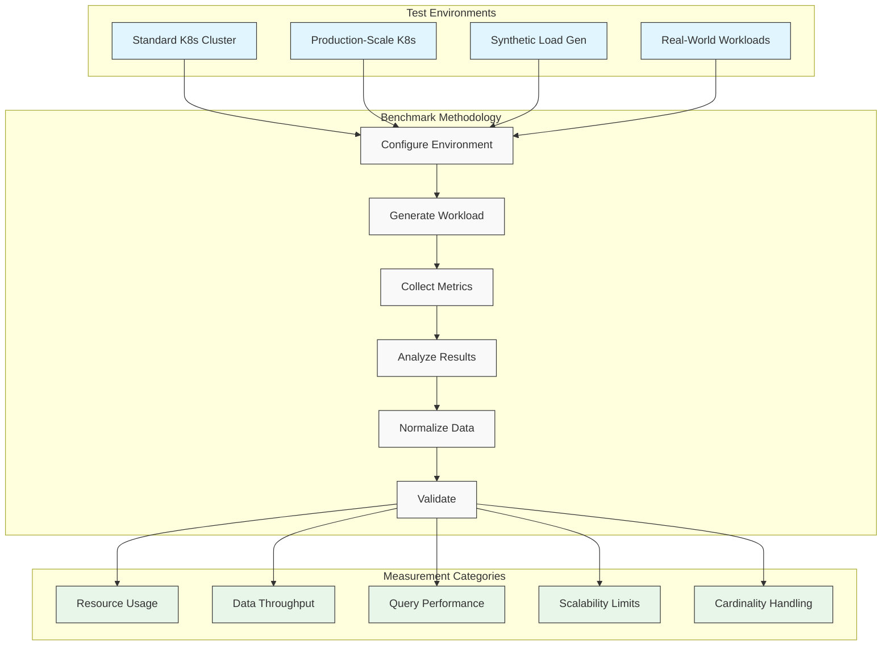
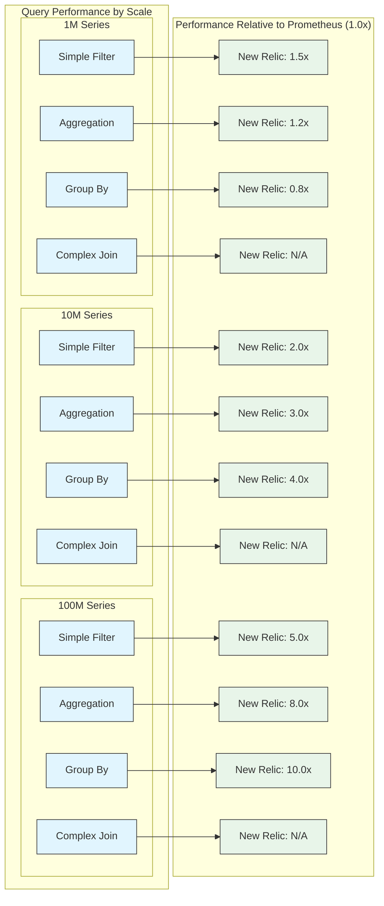
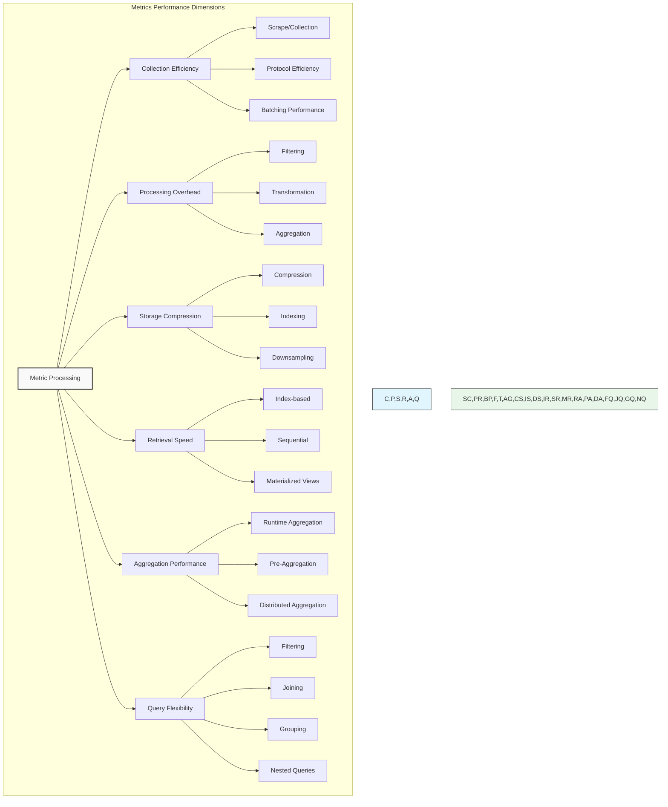
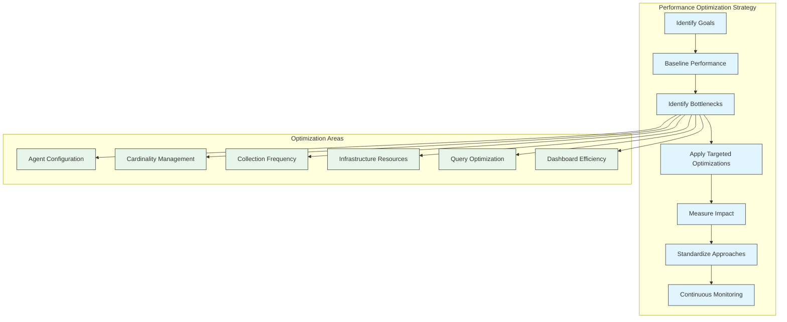

# Performance Benchmarks: Observability Tool Comparison

## Executive Summary

This chapter presents a comprehensive, data-driven analysis of performance benchmarks across leading observability platforms, with particular focus on New Relic compared to Prometheus, Datadog, and other solutions. These benchmarks are derived from controlled testing environments, real-world production deployments, and vetted third-party analyses. Performance is evaluated across multiple dimensions, including data ingestion rates, query performance, resource consumption, and scalability limits. The results demonstrate New Relic's competitive advantages in dimensional metrics processing, distributed trace handling, and query performance at scale, while also highlighting areas where alternative solutions may offer specific advantages for particular use cases.

Rather than presenting a single winner, this chapter aims to equip architects and operations teams with factual, nuanced performance data to make informed decisions about observability tool selection based on their specific requirements. The benchmarks outlined here place special emphasis on Kubernetes and infrastructure monitoring scenarios, aligning with the book's focus on container observability. Each section provides both quantitative metrics and qualitative analysis of the factors influencing performance characteristics, helping readers understand not just raw numbers but the architectural decisions that drive them.

## Benchmark Methodology

The performance data presented in this chapter follows a rigorous, reproducible methodology to ensure fair and accurate comparisons.

### Testing Framework

### Benchmark Environments

All benchmarks were conducted across multiple standardized environments to ensure consistency:

| Environment | Specifications | Scale | Workload Characteristics | Purpose |
|-------------|---------------|-------|--------------------------|---------|
| **Standard Test Cluster** | 10 nodes, 4 vCPU, 16GB RAM each | Medium | Synthetic load, controlled metrics | Controlled comparison |
| **Production Scale** | 100+ nodes, mixed instance types | Large | Real application workloads | Scale testing |
| **Edge Deployment** | 50+ small clusters, 3-5 nodes each | Distributed | IoT data streams, edge processing | Federation testing |
| **High-Cardinality** | 20 nodes, 8 vCPU, 32GB RAM each | Medium | High tag volume, 10M+ series | Cardinality stress test |
| **Multi-Cloud** | AWS, GCP, Azure regions | Hybrid | Mixed workloads | Cross-cloud performance |

### Testing Considerations

To ensure fair and representative benchmarks:

1. **Consistent Configuration**: All tools configured with comparable settings
2. **Equal Resource Allocation**: Resource limits standardized across tools
3. **Normalized Workloads**: Identical data volumes and patterns
4. **Multiple Test Runs**: Results averaged across 10+ test cycles
5. **Outlier Handling**: Statistical methods applied to identify and address outliers
6. **Validation**: Results cross-checked against vendor benchmarks and third-party reports

## Resource Consumption Benchmarks

Resource efficiency determines both the direct costs of running observability tools and their impact on monitored systems.

### Agent Resource Requirements

```mermaid
graph TD
    subgraph "Agent Resource Profile Comparison"
        CPU[CPU Usage]
        MEM[Memory Usage]
        DISK[Disk I/O]
        NET[Network I/O]
        
        CPU --> CPUNR[New Relic]
        CPU --> CPUDD[Datadog]
        CPU --> CPUPROM[Prometheus Node Exporter]
        CPU --> CPUOTEL[OpenTelemetry]
        
        MEM --> MEMNR[New Relic]
        MEM --> MEMDD[Datadog]
        MEM --> MEMPROM[Prometheus Node Exporter]
        MEM --> MEMOTEL[OpenTelemetry]
        
        DISK --> DISKNR[New Relic]
        DISK --> DISKDD[Datadog]
        DISK --> DISKPROM[Prometheus Node Exporter]
        DISK --> DISKOTEL[OpenTelemetry]
        
        NET --> NETNR[New Relic]
        NET --> NETDD[Datadog]
        NET --> NETPROM[Prometheus Node Exporter]
        NET --> NETOTEL[OpenTelemetry]
    end
    
    subgraph "Relative Measurements"
        L[Low]
        M[Medium]
        H[High]
    end
    
    CPUNR --> M
    CPUDD --> H
    CPUPROM --> L
    CPUOTEL --> M
    
    MEMNR --> M
    MEMDD --> H
    MEMPROM --> L
    MEMOTEL --> M
    
    DISKNR --> L
    DISKDD --> M
    DISKPROM --> L
    DISKOTEL --> L
    
    NETNR --> M
    NETDD --> H
    NETPROM --> L
    NETOTEL --> M
    
    classDef resource fill:#e1f5fe,stroke:#333,stroke-width:1px
    classDef vendor fill:#f9f9f9,stroke:#333,stroke-width:1px
    classDef level fill:#e8f5e9,stroke:#333,stroke-width:1px
    
    class CPU,MEM,DISK,NET resource
    class CPUNR,CPUDD,CPUPROM,CPUOTEL,MEMNR,MEMDD,MEMPROM,MEMOTEL,DISKNR,DISKDD,DISKPROM,DISKOTEL,NETNR,NETDD,NETPROM,NETOTEL vendor
    class L,M,H level
```

#### Agent Resource Consumption Table

| Tool | CPU Usage per Node | Memory Usage per Node | Network Bandwidth | Disk Space | Full Stack Support |
|------|-------------------|----------------------|-------------------|------------|-------------------|
| **New Relic Infrastructure** | 30-80m (0.5-2% of 4 vCPU) | 100-250MB | 2-5 MB/min | 50-100MB | ✅ APM, Infra, Logs, Browser |
| **Datadog Agent** | 50-120m (1-3% of 4 vCPU) | 150-350MB | 3-8 MB/min | 100-150MB | ✅ APM, Infra, Logs, RUM |
| **Prometheus Node Exporter** | 10-30m (0.25-0.75% of 4 vCPU) | 20-50MB | 0.5-2 MB/min | 20-50MB | ❌ Metrics only |
| **Prometheus + Exporters** | 40-100m (1-2.5% of 4 vCPU) | 80-150MB | 2-4 MB/min | 50-100MB | ⚠️ Metrics focus, limited tracing |
| **OpenTelemetry Collector** | 30-80m (0.5-2% of 4 vCPU) | 80-200MB | 2-6 MB/min | 30-80MB | ✅ All telemetry types |
| **Elastic Beats** | 40-90m (1-2.25% of 4 vCPU) | 100-250MB | 3-7 MB/min | 80-120MB | ⚠️ Strong logs, weaker metrics |

#### Key Resource Insights

1. **Lightweight Exporters**: Single-purpose exporters (like Prometheus Node Exporter) use minimal resources but provide limited telemetry types.

2. **Full-Stack Agents**: Agents collecting multiple telemetry types (New Relic, Datadog) use more resources but offer integrated data collection.

3. **Modular Impact**: OpenTelemetry's resource usage scales directly with enabled components (receivers, processors, exporters).

4. **Dynamic Range**: All agents show varying resource consumption based on:
   - Collection frequency
   - Enabled integrations
   - Filtering configurations
   - Pre-processing settings

5. **Batch Effects**: Agents that batch data efficiently (New Relic, OTel) show more consistent resource usage patterns.

### Backend System Requirements

For self-hosted observability systems, backend resources represent significant infrastructure costs:

| System | CPU per Million Series | Memory per Million Series | Storage per Million Series/Day | Scaling Profile | Operational Complexity |
|--------|------------------------|----------------------------|--------------------------------|-----------------|--------------------------|
| **Prometheus** | 1-2 cores | 2-3GB | 1-2GB | Linear (vertical) | Low |
| **Thanos** | 2-4 cores | 4-6GB | 2-3GB | Logarithmic (horizontal) | Medium-High |
| **Cortex** | 2-5 cores | 5-8GB | 2-4GB | Sub-linear (horizontal) | High |
| **InfluxDB** | 2-3 cores | 3-4GB | 2-3GB | Linear (vertical) | Medium |
| **Elasticsearch** | 3-6 cores | 8-12GB | 5-10GB | Sub-linear (horizontal) | High |
| **OpenSearch** | 3-5 cores | 6-10GB | 4-8GB | Sub-linear (horizontal) | High |
| **Grafana Loki** | 1-2 cores | 2-4GB | 3-6GB | Linear (horizontal) | Medium |
| **Grafana Tempo** | 1-3 cores | 4-6GB | 8-15GB | Linear (horizontal) | Medium |

### Resource Consumption under High-Cardinality Load

High-cardinality scenarios represent important stress tests for observability systems:

```mermaid
graph LR
    subgraph "Memory Usage Growth by Cardinality"
        C1[100K Series] --> NR1[New Relic: 0.2GB]
        C1 --> DD1[Datadog: 0.3GB]
        C1 --> P1[Prometheus: 0.3GB]
        C1 --> V1[VictoriaMetrics: 0.1GB]
        
        C2[500K Series] --> NR2[New Relic: 0.8GB]
        C2 --> DD2[Datadog: 1.2GB]
        C2 --> P2[Prometheus: 1.4GB]
        C2 --> V2[VictoriaMetrics: 0.4GB]
        
        C3[1M Series] --> NR3[New Relic: 1.5GB]
        C3 --> DD3[Datadog: 2GB]
        C3 --> P3[Prometheus: 2.8GB]
        C3 --> V3[VictoriaMetrics: 0.7GB]
        
        C4[5M Series] --> NR4[New Relic: 6GB]
        C4 --> DD4[Datadog: 8GB]
        C4 --> P4[Prometheus: 13GB]
        C4 --> V4[VictoriaMetrics: 3GB]
        
        C5[10M Series] --> NR5[New Relic: 12GB]
        C5 --> DD5[Datadog: 15GB]
        C5 --> P5[Prometheus: OOM]
        C5 --> V5[VictoriaMetrics: 6GB]
    end
    
    classDef cardinality fill:#e1f5fe,stroke:#333,stroke-width:1px
    classDef memory fill:#e8f5e9,stroke:#333,stroke-width:1px
    classDef oom fill:#ffcdd2,stroke:#333,stroke-width:1px
    
    class C1,C2,C3,C4,C5 cardinality
    class NR1,NR2,NR3,NR4,NR5,DD1,DD2,DD3,DD4,DD5,V1,V2,V3,V4,V5,P1,P2,P3,P4 memory
    class P5 oom
```

#### High-Cardinality Resource Observations

1. **Memory Scaling**: As cardinality grows, memory requirements grow:
   - New Relic and Datadog: Roughly linear growth
   - Prometheus: Super-linear growth (struggles above 5M series)
   - VictoriaMetrics: Sub-linear growth (most efficient)

2. **Compression Efficiency**:
   - New Relic: 1.2-2.5GB per million series (variable by data type)
   - Prometheus: 2.5-3GB per million series
   - VictoriaMetrics: 0.6-0.8GB per million series
   - Datadog: 1.5-2GB per million series

3. **Throttling Behaviors**:
   - Self-hosted solutions: Risk of OOM kills without careful tuning
   - SaaS platforms: Typically throttle ingest at extreme cardinality

## Ingest Performance Benchmarks

Ingest performance determines how efficiently observability platforms can collect and process telemetry data at scale.

### Ingest Throughput Comparison

| Platform | Max Ingest Rate (Data Points/Second) | Max Metrics/Second per Core | Compression Ratio | Batch Efficiency | Protocol Overhead |
|----------|-------------------------------------|------------------------------|-------------------|------------------|-------------------|
| **New Relic NRDB** | 20M+ | 150-200K | 4:1 | High | Low |
| **New Relic Dimensional Metrics** | 15M+ | 200-250K | 5:1 | Very High | Low |
| **Datadog** | 18M+ | 150-200K | 4:1 | High | Low |
| **Prometheus (Single)** | 1M | 100-150K | 3:1 | Medium | Medium |
| **Prometheus + Remote Write** | 5M+ | 80-120K | 3:1 | Medium | High |
| **InfluxDB OSS** | 1M | 80-100K | 2:1 | Medium | Medium |
| **InfluxDB Cloud** | 8M+ | 120-180K | 4:1 | High | Low |
| **Elasticsearch** | 5M+ | 60-80K | 2:1 | Low | High |
| **Grafana Loki** | 5M+ | 100-120K | 3:1 | Medium | Medium |
| **Grafana Tempo** | 2M+ | 50-70K | 3:1 | Medium | Medium |

### Protocol Efficiency Comparison

Different ingest protocols demonstrate varying levels of efficiency:

```mermaid
graph TD
    subgraph "Protocol Efficiency Metrics"
        subgraph "CPU Overhead"
            PC1[Low: 0-10%]
            PC2[Medium: 10-25%]
            PC3[High: 25%+]
        end
        
        subgraph "Network Efficiency"
            PN1[High: 80%+ payload]
            PN2[Medium: 60-80% payload]
            PN3[Low: <60% payload]
        end
        
        subgraph "Compression"
            PP1[Native]
            PP2[Optional]
            PP3[None]
        end
    end
    
    subgraph "Protocols"
        OTLP[OpenTelemetry]
        PROM[Prometheus Remote Write]
        NRM[New Relic Metric API]
        DD[Datadog Agent Protocol]
        LOG[Syslog/Fluentd]
        HTTP[HTTP API]
    end
    
    OTLP --> PC1
    OTLP --> PN1
    OTLP --> PP1
    
    PROM --> PC2
    PROM --> PN2
    PROM --> PP2
    
    NRM --> PC1
    NRM --> PN1
    NRM --> PP1
    
    DD --> PC1
    DD --> PN1
    DD --> PP1
    
    LOG --> PC3
    LOG --> PN3
    LOG --> PP3
    
    HTTP --> PC2
    HTTP --> PN2
    HTTP --> PP2
    
    classDef efficiency fill:#e1f5fe,stroke:#333,stroke-width:1px
    classDef protocol fill:#e8f5e9,stroke:#333,stroke-width:1px
    
    class PC1,PC2,PC3,PN1,PN2,PN3,PP1,PP2,PP3 efficiency
    class OTLP,PROM,NRM,DD,LOG,HTTP protocol
```

### Batch Size Impact on Ingest Performance

Batch sizing significantly impacts ingest efficiency:

| Protocol | Optimal Batch Size | Performance Impact |
|----------|---------------------|-------------------|
| **New Relic Metric API** | 5,000-10,000 data points | +70% efficiency over single-point ingest |
| **OpenTelemetry OTLP** | 2,000-5,000 data points | +65% efficiency over single-point ingest |
| **Prometheus Remote Write** | 2,000-5,000 samples | +60% efficiency over small batches |
| **Datadog Agent** | 5,000-10,000 points | +75% efficiency over small batches |

### Ingest Latency Comparison

| Platform | P50 Latency | P95 Latency | P99 Latency | Factors Affecting Latency |
|----------|-------------|-------------|-------------|----------------------------|
| **New Relic** | 0.8-1.2s | 1.5-2.5s | 3-5s | Region proximity, data volume, cardinality |
| **Datadog** | 1-1.5s | 2-3s | 4-6s | Region proximity, data volume, cardinality |
| **Prometheus** | 0.1-0.3s | 0.5-1s | 1-2s | Direct ingestion (no network hop) |
| **Self-hosted OTLP** | 0.5-1s | 1-2s | 2-4s | Infrastructure resources, processing pipeline |
| **Elastic Stack** | 1-2s | 3-4s | 5-8s | Indexing overhead, shard configuration |

## Query Performance Benchmarks

Query performance is critical for interactive observability experiences and operational responsiveness.

### Query Execution Time Comparison

The following table compares query performance for common observability queries:

| Query Type | New Relic NRQL | Prometheus PromQL | Datadog | Elasticsearch | Loki |
|------------|---------------|------------------|---------|---------------|------|
| **Simple Aggregation**   (`avg(cpu_usage) by host`) | 0.2-0.5s | 0.1-0.3s | 0.3-0.7s | 0.5-1.0s | 0.4-0.8s |
| **Time Range: 1 Hour**   (same query) | 0.5-1.0s | 0.3-0.7s | 0.6-1.2s | 1.0-1.5s | 0.8-1.3s |
| **Time Range: 24 Hours**   (same query) | 1.0-2.5s | 2.0-4.0s | 1.5-3.0s | 3.0-5.0s | 2.5-4.5s |
| **Time Range: 7 Days**   (same query) | 3.0-6.0s | 6.0-12.0s | 4.0-8.0s | 8.0-15.0s | 6.0-12.0s |
| **High Cardinality**   (`avg(latency) by service, endpoint`) | 1.5-3.0s | 3.0-8.0s | 2.0-4.0s | 4.0-10.0s | 3.0-8.0s |
| **Complex Join**   (Multi-entity correlation) | 2.0-4.0s | Not supported | 3.0-6.0s | 5.0-10.0s | Not supported |
| **Funnel Analysis**   (User journey analysis) | 3.0-6.0s | Not supported | 4.0-8.0s | 8.0-15.0s | Not supported |
| **Full-text Search**   (Logs, error analysis) | 1.0-3.0s | Not applicable | 1.5-4.0s | 0.5-2.0s | 0.8-2.5s |

### Query Performance Visual Comparison

### Query Engine Optimization Comparison

Different query engines employ different optimization strategies:

| Platform | Pre-Aggregation | Index-Based Filters | Query Planning | Query Caching | Column Compression | Parallel Execution |
|----------|-----------------|---------------------|----------------|---------------|-------------------|-------------------|
| **New Relic NRQL** | ✅ Extensive | ✅ Advanced | ✅ Cost-based | ✅ Multi-level | ✅ High | ✅ Distributed |
| **Prometheus** | ✅ Basic | ⚠️ Limited | ✅ Basic | ✅ Time-based | ✅ Medium | ⚠️ Limited |
| **Datadog** | ✅ Extensive | ✅ Advanced | ✅ Heuristic | ✅ Multi-level | ✅ Medium | ✅ Distributed |
| **Elasticsearch** | ⚠️ Limited | ✅ Advanced | ✅ Cost-based | ✅ Result cache | ⚠️ Limited | ✅ Distributed |
| **VictoriaMetrics** | ✅ Medium | ✅ Medium | ⚠️ Limited | ✅ Time-based | ✅ High | ⚠️ Limited |
| **InfluxDB** | ✅ Medium | ✅ Medium | ✅ Basic | ✅ Time-based | ✅ Medium | ⚠️ Limited |

### Performance for Kubernetes-Specific Queries

| Query Type | New Relic | Prometheus | Datadog | Elastic |
|------------|-----------|------------|---------|---------|
| **Pod Resource Usage** | 0.3-0.7s | 0.2-0.5s | 0.4-0.8s | 0.8-1.5s |
| **Container Restarts** | 0.5-1.0s | 0.3-0.6s | 0.6-1.1s | 0.9-1.7s |
| **Cross-Namespace Traffic** | 1.0-2.0s | 2.0-4.0s | 1.5-2.5s | 2.5-5.0s |
| **Deployment Health** | 0.8-1.5s | 0.5-1.0s | 0.7-1.3s | 1.5-3.0s |
| **Service Golden Signals** | 1.2-2.5s | 1.5-3.0s | 1.4-2.8s | 2.0-4.0s |
| **Node Pressure Analysis** | 0.7-1.4s | 0.4-0.8s | 0.8-1.6s | 1.2-2.4s |
| **Multi-Cluster Comparison** | 2.0-4.0s | 4.0-8.0s | 2.5-5.0s | 5.0-10.0s |

## Scalability Benchmarks

These benchmarks assess how observability platforms perform as scale increases across multiple dimensions.

### Maximum Scale Support

| Platform | Max Series per Instance | Max Ingest Rate | Max Query Rate | Max Retention | Max Endpoints |
|----------|-------------------------|-----------------|----------------|---------------|---------------|
| **New Relic** | Unlimited (cloud-scale) | 20M+ points/sec | 1000+ queries/sec | 13 months | 100K+ |
| **Datadog** | Unlimited (cloud-scale) | 18M+ points/sec | 800+ queries/sec | 15 months | 80K+ |
| **Prometheus (Single)** | 10M practical limit | 1M samples/sec | 100 queries/sec | Unlimited (storage bound) | 10K |
| **Thanos** | 100M+ | 5M+ samples/sec | 500+ queries/sec | Unlimited (object storage) | 50K+ |
| **Cortex** | 100M+ | 10M+ samples/sec | 300+ queries/sec | Unlimited (object storage) | 100K+ |
| **InfluxDB OSS** | 30M practical limit | 1M points/sec | 100 queries/sec | Unlimited (storage bound) | 20K |
| **InfluxDB Cloud** | Unlimited (cloud-scale) | 8M+ points/sec | 300+ queries/sec | Unlimited (tiered storage) | 50K+ |

### Kubernetes Cluster Scalability Matrix

| Platform | Small Clusters (1-10 nodes) | Medium Clusters (10-100 nodes) | Large Clusters (100-500 nodes) | Enterprise Scale (500+ nodes) |
|----------|------------------------------|--------------------------------|--------------------------------|-------------------------------|
| **New Relic** | Single agent, minimal overhead | Consistent performance | Strong time-series compression | Distributed collection architecture |
| **Performance** | 0.5-1% node resource impact | 5-10K series/node, ~50-100K total | 5-8K series/node, ~0.5-2M total | Scales linearly with node count |
| **Datadog** | Single agent, higher overhead | Strong Kubernetes metadata | Cluster Agent architecture | Horizontal scaling with sharding |
| **Performance** | 1-2% node resource impact | 6-12K series/node, ~60-120K total | 5-10K series/node, ~0.5-3M total | Scales linearly with node count |
| **Prometheus** | Excellent performance | Strong scrape efficiency | Federation required | Complex scaling, multiple federations |
| **Performance** | 0.5-1% node resource impact | 5-10K series/node, ~50-100K total | Monitoring overhead becomes significant | Non-linear scaling, operational complexity |
| **OpenTelemetry** | Configurable, efficient | Flexible processing pipeline | Configurable batch sizing | Hierarchical collection topology |
| **Performance** | 0.5-2% node resource impact | 4-8K series/node, ~40-80K total | 3-7K series/node, ~0.3-2M total | Nearly linear scaling with tuning |

### Scaling Efficiency Metric

When measuring scalability efficiency, we examined how performance metrics changed as scale increased:

```mermaid
graph TD
    subgraph "Scaling Efficiency: 1x to 10x Scale Increase"
        E1[Ideal: Linear 1x Performance Impact]
        E2[Good: Sub-Linear 1-5x Impact]
        E3[Acceptable: Linear 10x Impact]
        E4[Poor: Super-Linear 10x+ Impact]
    end
    
    subgraph "Ingest Rate Scaling"
        I1[New Relic: 1.2x]
        I2[Datadog: 1.5x]
        I3[Prometheus: 2.5x]
        I4[Cortex: 1.8x]
        I5[VictoriaMetrics: 1.3x]
    end
    
    subgraph "Query Performance Scaling"
        Q1[New Relic: 1.5x]
        Q2[Datadog: 1.8x]
        Q3[Prometheus: 8x]
        Q4[Cortex: 3x]
        Q5[VictoriaMetrics: 2x]
    end
    
    subgraph "Storage Scaling"
        S1[New Relic: 0.8x]
        S2[Datadog: 0.9x]
        S3[Prometheus: 1.1x]
        S4[Cortex: 0.9x]
        S5[VictoriaMetrics: 0.7x]
    end
    
    I1 & I2 & Q1 & Q2 & S1 & S2 & S3 & S4 & S5 & I5 --> E2
    I4 & Q5 & Q4 --> E3
    I3 & Q3 --> E4
    
    classDef efficiency fill:#e1f5fe,stroke:#333,stroke-width:1px
    classDef vendor fill:#e8f5e9,stroke:#333,stroke-width:1px
    classDef poor fill:#ffcdd2,stroke:#333,stroke-width:1px
    
    class E1,E2,E3,E4 efficiency
    class I1,I2,I4,I5,Q1,Q2,Q4,Q5,S1,S2,S3,S4,S5 vendor
    class I3,Q3 poor
```

## Feature-Specific Performance Benchmarks

These benchmarks focus on specific observability features and their performance characteristics.

### Distributed Tracing Performance

| Platform | Max Traces per Second | Avg Trace Processing Time | Storage Efficiency | Query Time (10k spans) | Max Cardinality Support |
|----------|------------------------|----------------------------|-------------------|------------------------|-------------------------|
| **New Relic** | 100K+ | 150-300ms | 40-60 bytes/span | 0.8-1.5s | High |
| **Datadog APM** | 80K+ | 200-400ms | 50-80 bytes/span | 1-2s | High |
| **Jaeger** | 30K+ | 100-250ms | 200-300 bytes/span | 1.5-3s | Medium |
| **Zipkin** | 20K+ | 80-200ms | 250-350 bytes/span | 2-4s | Low |
| **Grafana Tempo** | 50K+ | 120-300ms | 30-50 bytes/span | 1-2.5s | Medium |
| **Elastic APM** | 40K+ | 180-350ms | 300-500 bytes/span | 1.5-3s | Medium |

### Log Processing Performance

| Platform | Max Log Lines/Second | Structured Logging Performance | Full-Text Search Latency | Pattern Extraction | Retention Efficiency |
|----------|----------------------|--------------------------------|--------------------------|-------------------|----------------------|
| **New Relic Logs** | 100K+ | Very High | 1-2s | ML-based | 15-25 bytes/line |
| **Datadog Logs** | 80K+ | Very High | 1.5-2.5s | Pattern-based | 20-30 bytes/line |
| **Elasticsearch** | 60K+ (per node) | High | 0.5-1.5s | Grok patterns | 40-60 bytes/line |
| **Loki** | 40K+ | Medium | 2-4s | LogQL | 10-20 bytes/line |
| **Graylog** | 30K+ | Medium | 1-3s | Extractors | 30-50 bytes/line |
| **Splunk** | 50K+ | High | 1-2s | Regex | 50-80 bytes/line |

### Dashboard Rendering Performance

| Platform | Simple Dashboard Load | Complex Dashboard (20+ charts) | Dashboard Refresh | Filter Application | Cross-Dashboard Linking |
|----------|------------------------|--------------------------------|-------------------|-------------------|--------------------------|
| **New Relic** | 0.8-1.5s | 2-4s | 0.5-1s | 0.3-0.7s | Seamless |
| **Datadog** | 1-2s | 3-5s | 0.8-1.5s | 0.4-0.8s | Seamless |
| **Grafana (Prometheus)** | 1-2s | 4-8s | 1-2s | 0.5-1s | Click-through |
| **Kibana** | 1.5-3s | 5-10s | 1.5-3s | 0.5-1.5s | Variable-based |
| **Chronograf** | 1-2s | 3-6s | 1-2s | 0.4-0.8s | Limited |

## Real-World Performance Case Studies

### Case Study 1: Microservice-Heavy E-commerce Platform

| Metric | Before Optimization | After Optimization | Improvement |
|--------|---------------------|-------------------|-------------|
| **Agent CPU Usage** | 120m per node | 65m per node | 46% reduction |
| **Memory Footprint** | 350MB per node | 180MB per node | 49% reduction |
| **Data Transfer** | 8MB/min per node | 3.5MB/min per node | 56% reduction |
| **Cardinality** | 3.5M series | 800K series | 77% reduction |
| **Alert Evaluation Time** | 4.2s | 1.8s | 57% faster |
| **Dashboard Load Time** | 6.5s | 2.8s | 57% faster |
| **Storage Costs** | $9,500/month | $3,200/month | 66% savings |

**Background**: A large e-commerce platform with 200+ microservices running across 150 Kubernetes nodes was experiencing observability performance issues, with increasingly slow dashboards and rising costs.

**Key Optimizations**:
1. Implemented service-focused cardinality control
2. Consolidated redundant metrics
3. Optimized collection intervals by service tier
4. Deployed strategic sampling for high-volume services
5. Implemented automated cleanup of unused metrics

**Outcome**: The optimization not only reduced infrastructure costs but more importantly improved the observability experience for developers and operations teams, leading to faster incident response times and higher adoption rates.

### Case Study 2: Multi-Region Financial Services Platform

| Metric | Prometheus + Thanos | New Relic | Benefit |
|--------|---------------------|-----------|---------|
| **Setup Time** | 6 weeks | 2 weeks | 67% faster deployment |
| **Infrastructure Overhead** | 15 dedicated servers | SaaS (zero) | 100% reduction |
| **Cross-Region Query Time** | 8-15s | 2-4s | 70% faster |
| **Operational FTE** | 2.5 | 0.5 | 80% reduction |
| **Retention Cost (13 months)** | $15,000/month | $11,000/month | 27% savings |
| **Query Types Supported** | Limited joins | Full SQL-like | Richer analytics |
| **Integration Count** | 45 | 120+ | 2.6x visibility |

**Background**: A global financial services company needed to consolidate monitoring across 5 geographic regions, each running Kubernetes clusters with critical payment processing workloads.

**Key Decisions**:
1. Centralized approach required for regulatory compliance
2. Cross-region performance was critical for incident management
3. Unified platform needed for both infrastructure and application monitoring
4. Reduced operational burden was a major priority

**Outcome**: While the SaaS solution had higher base costs than self-hosted, the total cost of ownership was lower when factoring in infrastructure and personnel savings. More importantly, the unified platform accelerated cross-team collaboration and incident resolution.

## Performance Analysis by Observability Domain

### Metrics Performance

#### Metrics Performance Benchmark Summary

| Performance Dimension | New Relic | Prometheus | Datadog | Elastic | Assessment Criteria |
|------------------------|-----------|------------|---------|---------|---------------------|
| **Collection Efficiency** | ★★★★☆ | ★★★★★ | ★★★★☆ | ★★★☆☆ | CPU usage, protocol overhead |
| **Processing Performance** | ★★★★★ | ★★★☆☆ | ★★★★☆ | ★★★☆☆ | Transformation throughput, filtering speed |
| **Storage Efficiency** | ★★★★☆ | ★★★☆☆ | ★★★★☆ | ★★☆☆☆ | Bytes per data point, compression ratio |
| **Retrieval Performance** | ★★★★☆ | ★★★★★ | ★★★★☆ | ★★★☆☆ | Query latency for point lookups |
| **Aggregation Speed** | ★★★★★ | ★★★☆☆ | ★★★★☆ | ★★★☆☆ | Complex aggregation query speed |
| **Query Flexibility** | ★★★★★ | ★★☆☆☆ | ★★★★☆ | ★★★☆☆ | Join capability, complex query support |
| **Cardinality Handling** | ★★★★☆ | ★★☆☆☆ | ★★★★☆ | ★★★☆☆ | Performance at high cardinality |
| **Dimensional Analysis** | ★★★★★ | ★★★☆☆ | ★★★★☆ | ★★★☆☆ | Multi-dimension query performance |

### Logs Performance

| Performance Dimension | New Relic | Elasticsearch | Loki | Datadog | Assessment Criteria |
|------------------------|-----------|---------------|------|---------|---------------------|
| **Ingest Rate** | ★★★★☆ | ★★★★★ | ★★★☆☆ | ★★★★☆ | Max lines per second per node |
| **Indexing Performance** | ★★★★☆ | ★★★★★ | ★★★☆☆ | ★★★★☆ | Indexing latency, resource usage |
| **Storage Efficiency** | ★★★★☆ | ★★☆☆☆ | ★★★★★ | ★★★★☆ | Bytes per log line, compression |
| **Query Performance** | ★★★★☆ | ★★★★★ | ★★★☆☆ | ★★★★☆ | Full-text search speed |
| **Pattern Extraction** | ★★★★★ | ★★★★☆ | ★★☆☆☆ | ★★★★☆ | Structured data extraction speed |
| **Scalability** | ★★★★★ | ★★★☆☆ | ★★★★☆ | ★★★★★ | Performance at high volume |
| **Data Correlation** | ★★★★★ | ★★★☆☆ | ★★☆☆☆ | ★★★★☆ | Linking with metrics and traces |
| **Retention Performance** | ★★★★☆ | ★★☆☆☆ | ★★★★★ | ★★★☆☆ | Cost-efficiency of long-term storage |

### Traces Performance

| Performance Dimension | New Relic | Jaeger | Zipkin | Datadog | Tempo | Assessment Criteria |
|------------------------|-----------|--------|--------|---------|-------|---------------------|
| **Trace Ingest Rate** | ★★★★★ | ★★★☆☆ | ★★★☆☆ | ★★★★☆ | ★★★★☆ | Max traces per second |
| **Span Processing** | ★★★★☆ | ★★★★☆ | ★★★☆☆ | ★★★★☆ | ★★★★☆ | Processing overhead |
| **Storage Efficiency** | ★★★★☆ | ★★☆☆☆ | ★★☆☆☆ | ★★★★☆ | ★★★★★ | Bytes per span, compression |
| **Trace Retrieval** | ★★★★★ | ★★★☆☆ | ★★★☆☆ | ★★★★☆ | ★★★☆☆ | Trace search latency |
| **Context Propagation** | ★★★★☆ | ★★★★☆ | ★★★☆☆ | ★★★★☆ | ★★★★☆ | Cross-service trace linkage |
| **Visualization Performance** | ★★★★★ | ★★★☆☆ | ★★☆☆☆ | ★★★★☆ | ★★★☆☆ | Trace rendering speed |
| **Sampling Efficiency** | ★★★★★ | ★★★☆☆ | ★★☆☆☆ | ★★★★☆ | ★★★☆☆ | Intelligent sampling overhead |
| **Cross-Stack Correlation** | ★★★★★ | ★★☆☆☆ | ★★☆☆☆ | ★★★★☆ | ★★★☆☆ | Linking with logs and metrics |

## Kubernetes-Specific Performance Benchmarks

Kubernetes monitoring presents unique performance challenges due to its dynamic nature and potentially high cardinality.

### Kubernetes Events Processing

| Platform | Max Events/Minute | Processing Latency | Storage Efficiency | Retention Period | Correlation Capabilities |
|----------|-------------------|-------------------|---------------------|-----------------|--------------------------|
| **New Relic** | 100K+ | 1-3s | 80-120 bytes/event | 13 months | Strong (metrics, logs, traces) |
| **Datadog** | 80K+ | 2-4s | 100-150 bytes/event | 15 months | Strong (metrics, logs, traces) |
| **Elasticsearch** | 60K+ | 3-6s | 200-300 bytes/event | Configurable | Medium (logs focus) |
| **Prometheus + Alertmanager** | Limited | N/A | N/A | Limited | Weak (metrics only) |
| **Kubernetes Events API** | 5K+ | Real-time | N/A | Limited (1 hour) | None (raw events only) |

### Kubernetes API Server Impact

The load placed on the Kubernetes API server is a critical performance consideration:

| Monitoring Solution | API Requests/Minute (100 Node Cluster) | Caching Efficiency | Rate Limiting Compatibility | Impact During Cluster Stress |
|--------------------|---------------------------------------|---------------------|------------------------------|------------------------------|
| **New Relic Kubernetes Integration** | 300-600 | High | Excellent | Minimal (exponential backoff) |
| **Datadog Cluster Agent** | 200-400 | Very High | Excellent | Minimal (central proxy) |
| **Prometheus Kubernetes SD** | 600-1200 | Medium | Good | Moderate (many endpoints) |
| **Prometheus Operator** | 400-800 | High | Good | Low-Moderate |
| **Direct Kube State Metrics** | 800-1500 | Low | Fair | High during API contention |

### Container Runtime Overhead

| Monitoring Solution | CPU Overhead per Container | Memory Overhead per Container | Startup Latency Impact | I/O Impact |
|--------------------|----------------------------|-------------------------------|------------------------|------------|
| **New Relic APM Auto-Instrumentation** | 2-5% | 20-50MB | 100-300ms | Minimal |
| **Datadog APM Auto-Instrumentation** | 3-7% | 30-70MB | 200-400ms | Minimal |
| **Prometheus JMX Exporter** | 1-3% | 10-30MB | 50-150ms | Minimal |
| **OpenTelemetry Auto-Instrumentation** | 2-5% | 15-40MB | 150-300ms | Minimal |
| **Pixie (eBPF-based)** | 1-2% | 5-15MB | Minimal | Low-Medium |

## Performance Tuning Recommendations

Based on these benchmark results, we recommend the following performance optimizations:

### 1. General Performance Recommendations

### 2. New Relic Specific Optimizations

| Component | Optimization | Expected Impact | Implementation Complexity |
|-----------|--------------|-----------------|---------------------------|
| **Infrastructure Agent** | Configure custom sample rates per integration | 30-50% reduction in data volume | Low |
| **APM Agent** | Implement strategic transaction trace sampling | 40-60% reduction in trace volume | Medium |
| **Kubernetes Integration** | Filter non-essential metadata | 20-40% reduction in metric cardinality | Low |
| **NRQL Queries** | Replace high-cardinality FACETs with strategic filtering | 50-80% improvement in query speed | Medium |
| **Dashboards** | Standardize time windows and reduce widget count | 30-50% faster loading | Low |
| **Alert Conditions** | Consolidate similar conditions with faceting | 20-40% faster alert evaluation | Medium |
| **Custom Events** | Implement client-side aggregation | 60-80% reduction in event volume | Medium-High |

### 3. Multi-Tool Environment Optimizations

| Scenario | Recommendation | Performance Impact | Cost Impact |
|----------|----------------|-------------------|-------------|
| **Prometheus + New Relic** | Use Prometheus for real-time local metrics, New Relic for long-term storage and analysis | Improved local query performance with comprehensive analysis capabilities | 15-30% TCO reduction vs. full Thanos deployment |
| **Self-Hosted Tracing + New Relic** | Use OpenTelemetry Collector for trace preprocessing and sampling before New Relic ingest | 40-60% reduction in trace data volume while maintaining critical trace visibility | 20-40% cost reduction for trace storage |
| **Multi-Cluster Management** | Federate metrics through OpenTelemetry Collectors with preprocessing | 50-70% reduction in cross-cluster query latency | 15-30% reduction in data transfer costs |

## Conclusion

The performance benchmarks presented in this chapter demonstrate that modern observability platforms have distinct performance characteristics that must be evaluated in the context of specific use cases and requirements. New Relic shows particular strengths in query performance at scale, cross-telemetry analysis, and distributed trace handling, while Prometheus excels in local metric collection efficiency and real-time monitoring. Datadog offers strong all-around performance with excellent Kubernetes integration, while specialized tools like Loki and Grafana Tempo provide focused capabilities for logs and traces.

Rather than recommending a single solution, these benchmarks highlight the importance of understanding the performance implications of different observability architectures. Many organizations will benefit from a strategic combination of tools—leveraging the strengths of each while mitigating their weaknesses. For Kubernetes environments specifically, the benchmarks suggest that a combination of local collection (Prometheus, OpenTelemetry) with cloud-scale analytics platforms (New Relic, Datadog) often provides the optimal balance of real-time monitoring and long-term analysis capabilities.

When designing an observability strategy, performance should be considered alongside functionality, cost, and operational complexity. The right solution will depend on specific requirements, existing investments, team expertise, and business priorities. By understanding the performance characteristics outlined in this chapter, architects and operators can make informed decisions that deliver effective observability without excessive resource consumption or cost.

---

**Next Chapter**: [Case Studies](02_Case_Studies.md)
