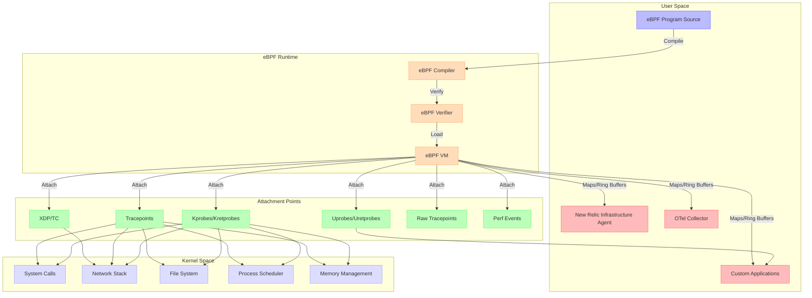
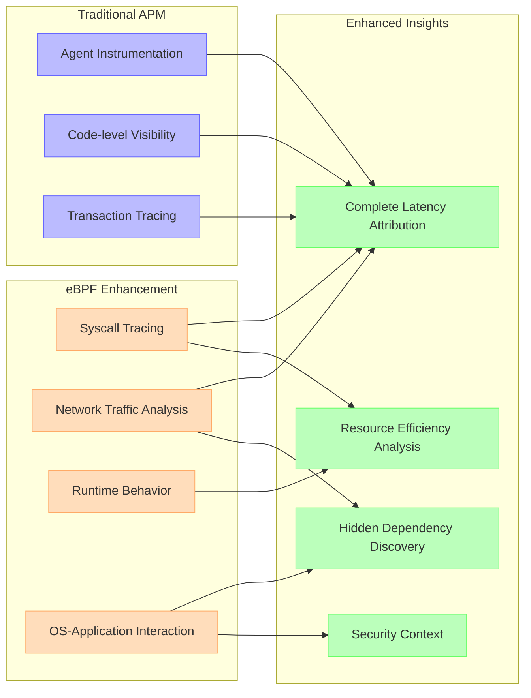
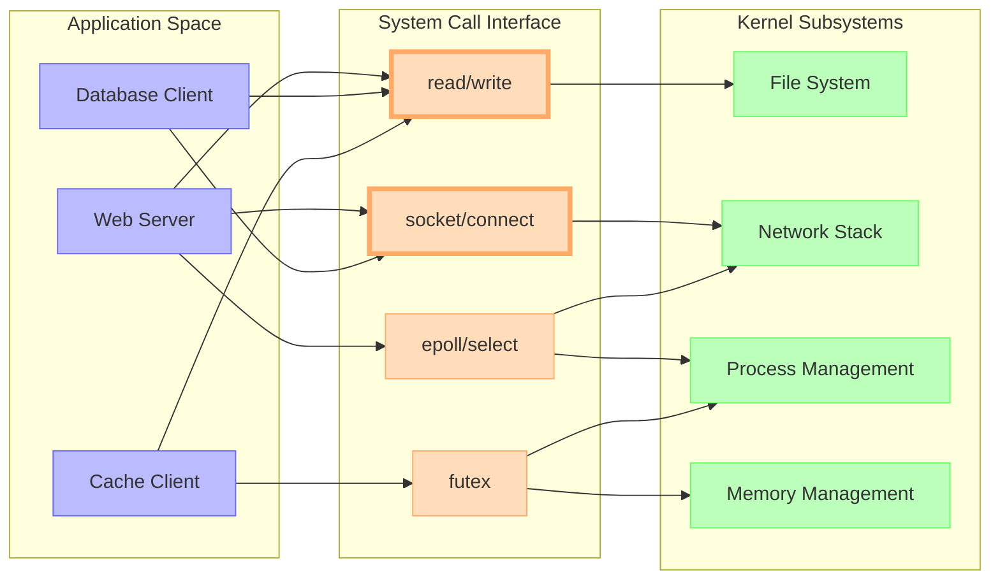
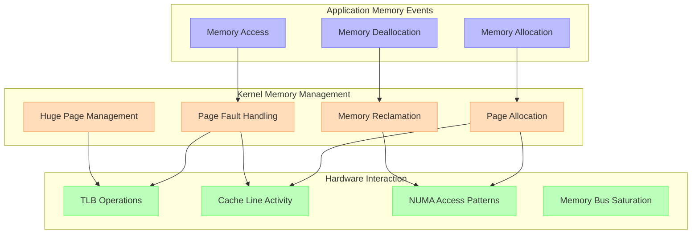
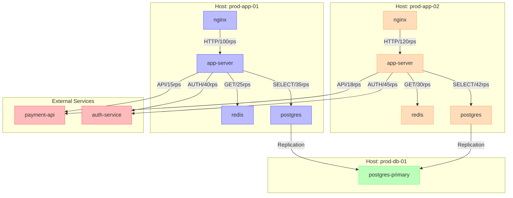
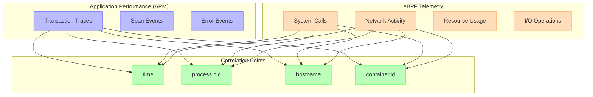

# eBPF & Host Telemetry

## Introduction

Extended Berkeley Packet Filter (eBPF) represents a revolutionary approach to kernel observability, enabling unprecedented visibility into system behavior with minimal overhead. This chapter explores how eBPF integrates with New Relic and other observability tools to provide deep insights into host performance, security, and application behavior.

## eBPF Fundamentals

eBPF allows programs to run safely within the Linux kernel, capturing detailed telemetry without modifying kernel code or loading custom modules. This powerful capability enables:

1. **Fine-grained performance analysis**: CPU, memory, I/O, and network behavior at process and system levels
2. **Security observability**: System call auditing, network activity monitoring, and anomaly detection
3. **Application tracing**: Request flows, latency breakdown, and dependency tracking without instrumentation
4. **Network observability**: Packet analysis, connection tracking, and protocol-specific insights

### eBPF Architecture

<!-- DG-58A: eBPF Probe Path Diagram -->

### Key eBPF Integration Points

| Attachment Point | Description | Observability Use Cases |
|------------------|-------------|-------------------------|
| **Kprobes/Kretprobes** | Dynamic instrumentation of kernel functions | • Syscall performance • Disk I/O tracking • Memory allocations |
| **Tracepoints** | Static instrumentation points in kernel | • Scheduler events • Network events • File system operations |
| **XDP/TC** | Network packet processing hooks | • DDoS protection • Network traffic analysis • Protocol-specific metrics |
| **Uprobes/Uretprobes** | User-space function instrumentation | • Application function profiling • Library call analysis • Custom application tracing |
| **Perf Events** | Hardware and software performance counters | • CPU performance monitoring • Cache utilization • Memory bus activity |
| **LSM (Linux Security Modules)** | Security enforcement hooks | • Security policy auditing • Privilege escalation detection • Container escape monitoring |

## New Relic eBPF Integration

New Relic's integration with eBPF technology provides enhanced visibility across three main areas:

### 1. Infrastructure Monitoring

The New Relic Infrastructure agent leverages eBPF to collect detailed system telemetry:

| Capability | Metrics Collected | Visualization |
|------------|-------------------|---------------|
| **Process Drill-Down** | • CPU usage by thread • Memory allocation patterns • File descriptor usage • Syscall frequency | Process activity heatmap |
| **I/O Analysis** | • Per-process I/O operations • Disk latency distribution • File system cache effectiveness • Block device saturation | I/O operation flame graphs |
| **Network Flow Visibility** | • Connection establishment rate • Connection duration • Throughput by process • Protocol error rates | Network topology map |
| **Resource Contention** | • Lock contention • CPU run queue latency • Memory pressure indicators • I/O wait analysis | Resource contention heat map |

### 2. Application Performance Enhancement

eBPF extends APM capabilities without requiring additional instrumentation:

<!-- DG-58B: eBPF APM Enhancement Flow -->

### 3. Security Observability

eBPF provides critical security telemetry for threat detection and analysis:

| Security Dimension | eBPF Data Points | Alert Indicators |
|--------------------|------------------|------------------|
| **Process Execution** | • Process creation events • Binary execution • Command line arguments • Parent-child relationships | • Unusual binary execution paths • Known malicious patterns • Privilege escalation sequences |
| **File System Activity** | • File access patterns • Permission changes • Sensitive file operations • File integrity indicators | • Access to sensitive configurations • Unexpected permission changes • Binary/configuration modifications |
| **Network Behavior** | • Connection establishment • Data transfer volumes • DNS queries • Protocol anomalies | • Connections to suspicious IPs • Unusual data transfer patterns • Anomalous protocol behavior |
| **Container Boundaries** | • Namespace transitions • Capability usage • Mount operations • Resource access patterns | • Container escape attempts • Unexpected privileged operations • Suspicious mount activity |

## Kubernetes Observability with eBPF

When deployed in Kubernetes environments, eBPF provides unique visibility into:

### Cluster-Level Performance

```mermaid
graph TD
    subgraph "Control Plane"
        A[API Server]
        B[etcd]
        C[Scheduler]
        D[Controller Manager]
    end
    
    subgraph "Node Components"
        E[kubelet]
        F[kube-proxy]
        G[Container Runtime]
        H[Node Resources]
    end
    
    subgraph "Workloads"
        I[Pod Resources]
        J[Inter-Pod Communication]
        K[Pod-Service Communication]
        L[Ingress/Egress Traffic]
    end
    
    subgraph "eBPF Telemetry"
        M[Control Plane Metrics]
        N[Node Performance]
        O[Network Flow Maps]
        P[Workload Interactions]
    end
    
    A --> M
    B --> M
    C --> M
    D --> M
    
    E --> N
    F --> N
    G --> N
    H --> N
    
    I --> P
    J --> O
    K --> O
    L --> O
    
    style M fill:#fbb,stroke:#f66
    style N fill:#fbb,stroke:#f66
    style O fill:#fbb,stroke:#f66
    style P fill:#fbb,stroke:#f66
    
    style A fill:#bbf,stroke:#66f
    style B fill:#bbf,stroke:#66f
    style C fill:#bbf,stroke:#66f
    style D fill:#bbf,stroke:#66f
    
    style E fill:#bfb,stroke:#6f6
    style F fill:#bfb,stroke:#6f6
    style G fill:#bfb,stroke:#6f6
    style H fill:#bfb,stroke:#6f6
    
    style I fill:#fdb,stroke:#fa6
    style J fill:#fdb,stroke:#fa6
    style K fill:#fdb,stroke:#fa6
    style L fill:#fdb,stroke:#fa6
```

### Pod-Level Network Visibility

eBPF provides detailed network flow mapping without service mesh overhead:

| Metric Category | Traditional Visibility | eBPF-Enhanced Visibility |
|-----------------|------------------------|--------------------------|
| **Connection Establishment** | Endpoints only | • Full TCP handshake timing • Connection setup latency • Retransmit patterns • Connection tracking table visibility |
| **Traffic Analysis** | Volume metrics only | • Protocol breakdown • Packet size distribution • Header analysis • Throughput vs. goodput |
| **Service Communication** | Black-box latency | • DNS resolution time • TLS handshake duration • HTTP header processing time • Response generation time |
| **Error Detection** | Status codes only | • TCP retransmissions • Silent packet drops • Protocol errors • Timeout root causes |

## Host Observability Beyond Metrics

### System Call Tracing and Analysis

System call tracing provides visibility into application-kernel interactions:

<!-- DG-58C: System Call Flow Map -->

### Block I/O and File System Analysis

Detailed I/O analysis helps identify performance bottlenecks:

| I/O Dimension | Key Metrics | Visualization Technique |
|---------------|-------------|-------------------------|
| **Latency Distribution** | • Block I/O latency percentiles • Queue time vs. device time • Request size impact | Heatmap by operation size and type |
| **I/O Stack Breakdown** | • VFS layer time • Block layer time • Device driver time • Hardware time | Stacked bar charts by layer |
| **I/O Patterns** | • Sequential vs. random access • Read/write ratio • Block size distribution • IO depth | Access pattern visualization |
| **Cache Effectiveness** | • Page cache hit ratio • Dirty page writeback rate • Cache eviction pressure • Read-ahead effectiveness | Time-series correlation with application latency |

### Memory Subsystem Visibility

eBPF provides deeper visibility into memory behavior:

## Implementing eBPF-Enhanced Observability

### New Relic Implementation Options

| Implementation Approach | Description | Best For |
|-------------------------|-------------|----------|
| **Enhanced Infrastructure Agent** | Built-in eBPF capabilities in the standard New Relic Infrastructure agent | • General-purpose monitoring • Broad system visibility • Low operational complexity |
| **Custom eBPF Programs with NR Ingest** | Specialized eBPF programs sending telemetry to New Relic ingest endpoints | • Targeted deep analysis • Custom security monitoring • Specialized application visibility |
| **OTel Collector with eBPF Receiver** | OpenTelemetry collector with eBPF receiver sending to New Relic | • Standardized instrumentation • Multi-destination telemetry • Integration with existing OTel pipeline |

### eBPF Program Deployment Matrix

| Deployment Mechanism | Pros | Cons | Best For |
|----------------------|------|------|----------|
| **BCC (BPF Compiler Collection)** | • Full programming flexibility • Python interface • Access to all eBPF features | • Requires kernel headers • Development complexity • Higher resource usage | Custom observability solutions |
| **bpftrace** | • Simple one-liners • Quick debugging • DTrace-like syntax | • Limited programmatic capability • Less performant for production use | Ad-hoc investigation |
| **libbpf + CO-RE (Compile Once – Run Everywhere)** | • Kernel version independence • High performance • Production ready | • C programming required • Steeper learning curve | Production deployments |
| **Cilium/Hubble** | • Kubernetes-native • Network policy enforcement • Pre-built observability | • Primarily network-focused • Requires specific CNI | Kubernetes environments |
| **New Relic eBPF integration** | • Zero configuration • Managed lifecycle • Automatic correlation | • Less customizable • Limited to supported features | Enterprise monitoring |

### Performance and Overhead Considerations

eBPF programs introduce minimal but measurable overhead:

| Resource | Typical Overhead | Optimization Technique |
|----------|------------------|------------------------|
| **CPU** | 0.5-3% | • Limit probe frequency • Use sampling where appropriate • Optimize map access patterns |
| **Memory** | 50-200MB | • Control map sizes • Limit event buffering • Manage perf buffer sizes |
| **I/O** | Negligible | • Batch event processing • Throttle event emission • Filter events at source |
| **Network** | 1-5% of monitored traffic | • Control export frequency • Apply early filtering • Compress exported data |

## New Relic Visualization and Analysis

### Interactive System Topology

New Relic's visualization capabilities leverage eBPF data to create interactive system maps:

### Advanced Analysis Techniques

| Analysis Type | Description | Visualization | NRQL Example |
|---------------|-------------|---------------|--------------|
| **Syscall Heatmaps** | Visualize system call patterns across processes | Time-based heatmap | `SELECT syscall, count(*) FROM SyscallSample FACET process, syscall TIMESERIES` |
| **Network Flow Analysis** | Map network connections and identify bottlenecks | Network topology with edge weights | `SELECT sum(bytes_sent) FROM NetworkSample FACET source_process, destination_process, destination_port` |
| **Latency Breakdown** | Detailed analysis of where time is spent | Stacked area chart | `SELECT average(latency_ns) FROM SyscallSample FACET syscall_group WHERE process = 'nginx' TIMESERIES` |
| **Resource Contention** | Identify processes competing for resources | Contention matrix | `SELECT count(*) FROM ContentionSample FACET waiting_process, holding_process WHERE resource_type = 'lock'` |

## Integration with Other Observability Signals

### Correlation with APM

eBPF data provides context to application performance:

<!-- DG-58D: eBPF-APM Correlation -->

### Cross-Signal Analysis

| Scenario | Signals to Correlate | Insights Gained |
|----------|----------------------|-----------------|
| **Slow Database Queries** | • APM database spans • eBPF syscall latency • eBPF disk I/O • Infrastructure metrics | • Is slowness in application code, query execution, or I/O? • Are there filesystem cache misses? • Is there disk contention from other processes? |
| **Network Latency Issues** | • APM external service calls • eBPF network flow data • eBPF TCP state metrics • Infrastructure network metrics | • Is latency in connection establishment or data transfer? • Are there retransmits or packet drops? • Is DNS resolution causing delays? |
| **Memory Pressure** | • APM memory metrics • eBPF memory allocation events • eBPF page fault tracking • Infrastructure memory metrics | • Is the application allocating excessively? • Is the kernel reclaiming memory aggressively? • Are there specific allocation patterns causing fragmentation? |

## Building Custom eBPF Observability

### Case Study: Custom Latency Attribution

A custom eBPF program can provide detailed breakdowns of where time is spent in the system:

| Component | Measured Dimension | Value to Observability |
|-----------|-------------------|------------------------|
| **Application** | • Function execution time • Lock contention • Memory allocation patterns | Identify code-level bottlenecks |
| **Syscall Interface** | • System call latency • Parameter patterns • Error rates | Understand application-kernel boundary |
| **File System** | • VFS operations • File access patterns • Cache effectiveness | Optimize data access patterns |
| **Network Stack** | • Protocol processing time • Buffer utilization • Connection state transitions | Tune network parameters |
| **Block I/O** | • Queue time • Device service time • Request merging effectiveness | Optimize storage configuration |
| **Scheduler** | • Run queue latency • Context switch overhead • CPU affinity effects | Improve CPU utilization |

### Security Monitoring with eBPF

eBPF enables enhanced security observability:

| Security Dimension | eBPF Capability | Security Insight |
|--------------------|----------------|------------------|
| **Process Execution** | Track exec() syscalls with full command line | Detect unexpected process execution |
| **File Access** | Monitor open(), read(), write() with path information | Identify access to sensitive files |
| **Network Activity** | Track connect(), accept(), send(), and recv() calls | Detect unauthorized connections |
| **User Behavior** | Monitor setuid(), setgid(), and capability changes | Identify privilege escalation |
| **Container Boundaries** | Track namespace operations and privilege changes | Detect container escape attempts |

## Future Directions

eBPF technology continues to evolve rapidly:

| Emerging Capability | Description | Potential Impact |
|--------------------|-------------|------------------|
| **BTF (BPF Type Format)** | Kernel type information embedded in kernel image | Eliminates need for kernel headers, simplifying deployment |
| **BPF LSM (Linux Security Modules)** | Security policy enforcement with eBPF | More flexible and dynamic security monitoring |
| **BPF Iterators** | Efficient iteration over kernel objects | Lower-overhead enumeration of system state |
| **kprobe Multi** | Attach to multiple kprobe points with single program | More efficient system-wide tracing |
| **Sleepable BPF Programs** | Allow eBPF programs to sleep | More complex programs with I/O operations |

## Conclusion

eBPF technology transforms Linux observability by providing unprecedented visibility with minimal overhead. When integrated with New Relic:

1. **Deep System Insights**: Visibility into kernel, system calls, and hardware interactions
2. **Enhanced Correlation**: Connect application behavior to underlying system activity
3. **Reduced Blind Spots**: Observe previously hidden interactions between components
4. **Minimal Overhead**: Gain these insights with negligible performance impact

Organizations implementing eBPF-enhanced observability can identify subtle performance issues, detect security anomalies, and understand complex system behaviors that would otherwise remain hidden.
