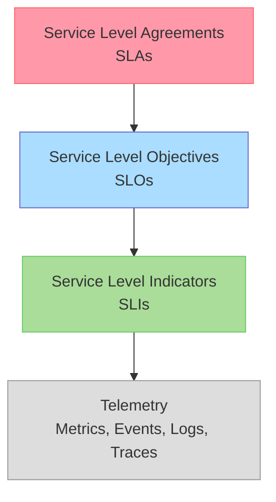
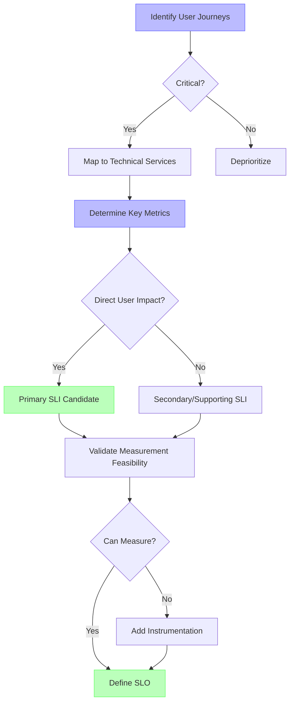
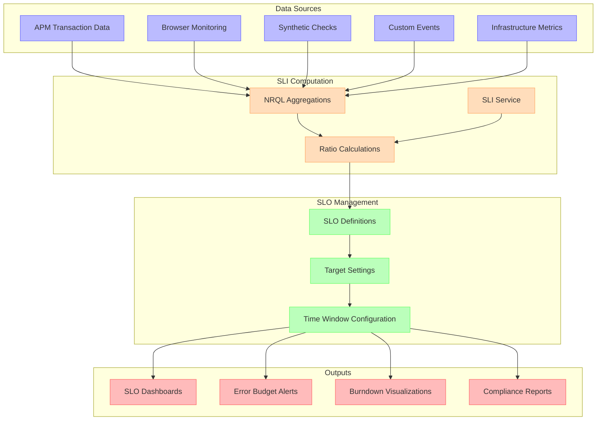
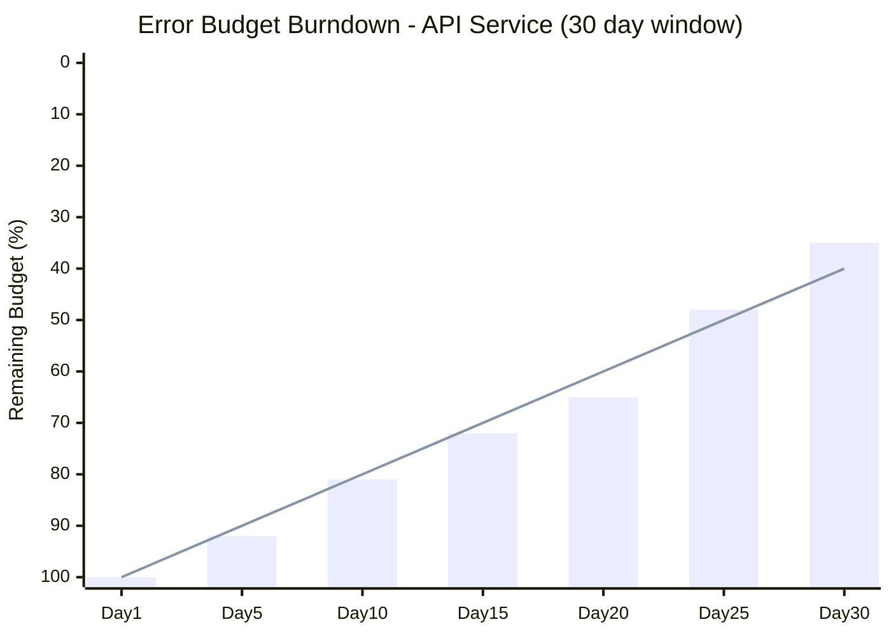
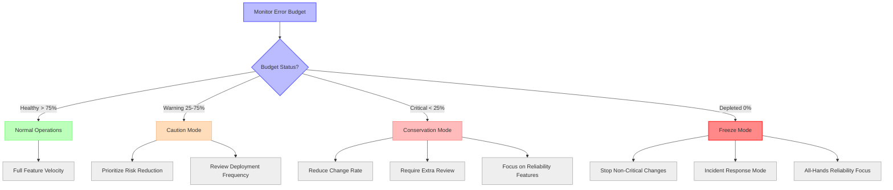
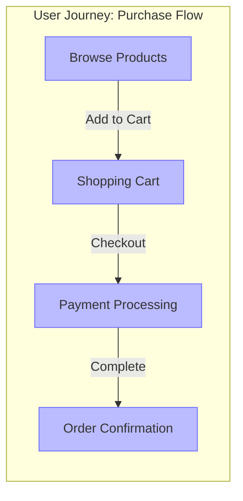
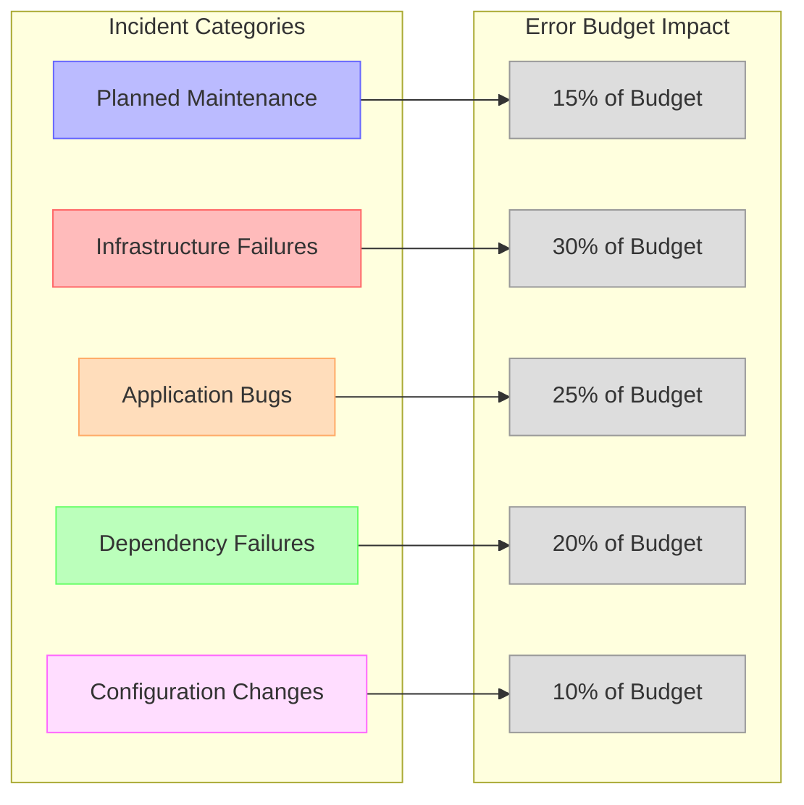
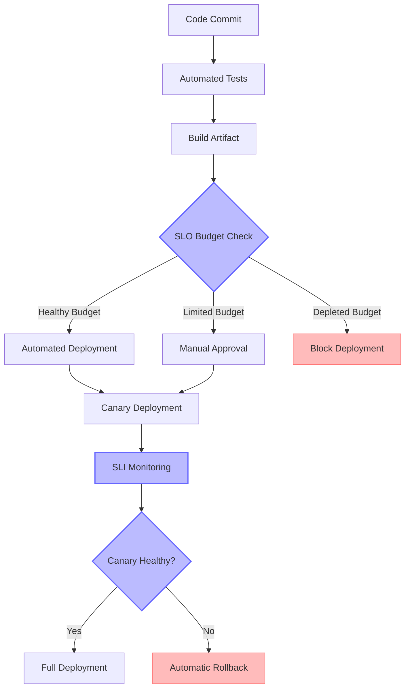
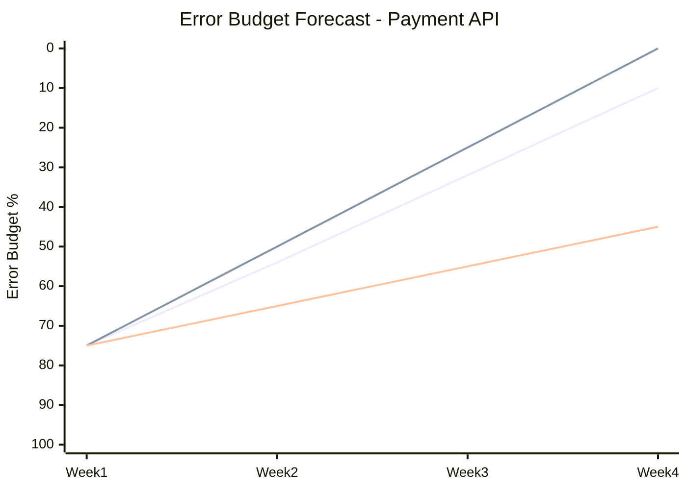
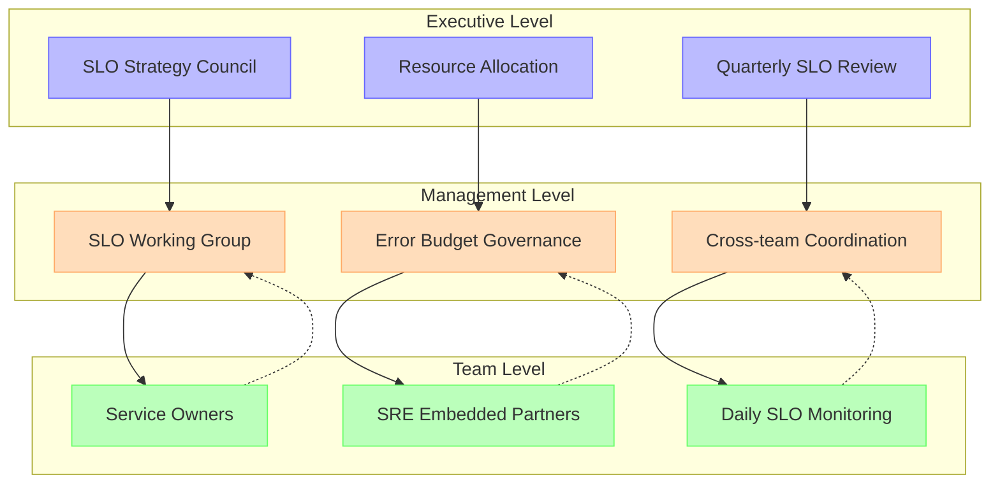

# SLOs & Error Budgets

## Introduction

Service Level Objectives (SLOs) and Error Budgets provide a systematic approach to balancing reliability and innovation velocity. This chapter explores how to implement effective SLOs using New Relic's observability platform, with a focus on practical implementation patterns, measurement techniques, and organizational alignment.

## SLO Fundamentals

### The SLO Pyramid

### Key Definitions

| Term | Definition | Example |
|------|------------|---------|
| **SLA** | Contract defining consequences for service quality, usually with financial penalties | "99.9% monthly uptime or 10% refund" |
| **SLO** | Internal reliability target, stricter than SLAs | "99.95% monthly availability" |
| **SLI** | Measurement of service quality aspects | "% of HTTP requests with < 300ms latency" |
| **Error Budget** | Allowed amount of unreliability within SLO | "0.05% downtime = ~22 minutes per month" |

### SLO Types and Examples

| SLO Type | Description | Example SLIs | Target Range |
|----------|-------------|--------------|--------------|
| **Availability** | Service responds when needed | • Success rate (non-5xx responses) • Health check pass rate | 99.0% - 99.99% |
| **Latency** | Service responds quickly enough | • Requests completed within threshold • p95 response time | 95% - 99.9% |
| **Throughput** | Service handles required load | • Requests/second capability • Successful transactions/minute | Varies by service |
| **Correctness** | Service responds with right data | • Data validation success rate • Business logic error rate | 99.9% - 100% |
| **Freshness** | Data is sufficiently up-to-date | • Data age within threshold • Update frequency met | Varies by use case |
| **Coverage** | Service handles expected scope | • % of required functionality available • Geographic availability | 95% - 100% |

## Implementing SLOs in New Relic

### SLI Selection Framework

Choosing the right SLIs is critical for effective SLOs:

### SLO Implementation Methods in New Relic

| Method | Description | Best For | Limitations |
|--------|-------------|----------|------------|
| **NRQL-based SLOs** | Use NRQL queries to define SLIs and calculate SLO attainment | • Custom business logic • Complex conditions • Composite metrics | • Requires careful query optimization • Manual error budget calculation |
| **New Relic SLO Entity** | Native SLO creation using built-in UI and entity | • Standardized SLOs • Error budget visualization • Integrated alerts | • Less flexibility for complex metrics • Limited to standard patterns |
| **APM Service Levels** | Service-specific SLOs directly in APM | • Application-focused SLOs • Developer accessibility • Quick implementation | • Limited to APM-instrumented services • Standardized SLIs only |
| **Synthetic Monitoring SLOs** | SLOs based on synthetic monitor results | • End-user perspective • Geographic variation • Public-facing services | • Simulation, not real user traffic • Limited transaction coverage |

### SLO Data Flow Architecture

<!-- DG-59A: SLO Data Flow Architecture -->

## Example SLO Implementations

### Common SLO Patterns

| Service Type | Recommended SLO | SLI Implementation | Target |
|--------------|-----------------|-------------------|--------|
| **API Service** | Availability | `percentage(count(*), WHERE statusCode < 500) FROM Transaction WHERE appName = 'API-Service'` | 99.9% |
| **API Service** | Latency | `percentage(count(*), WHERE duration < 0.5) FROM Transaction WHERE appName = 'API-Service'` | 95.0% |
| **Web Application** | Page Load Time | `percentage(count(*), WHERE duration < 3) FROM PageView WHERE appName = 'WebApp'` | 90.0% |
| **Database** | Query Performance | `percentage(count(*), WHERE duration < 0.1) FROM Transaction WHERE appName = 'Database' AND transactionType = 'Web'` | 99.0% |
| **Background Job** | Completion Rate | `percentage(count(*), WHERE statusCode = 'SUCCESS') FROM Transaction WHERE transactionType = 'Background'` | 99.5% |
| **Streaming System** | Freshness | `percentage(count(*), WHERE (now() - timestamp) < 60) FROM KafkaLagSample` | 99.0% |

### SLO Time Windows

| Window Type | Use Case | Pros | Cons |
|-------------|----------|------|------|
| **Calendar** | Matching billing cycles | • Aligns with SLAs • Clear reporting boundaries | • Abrupt budget resets • Encourages end-of-period risk |
| **Rolling** | Continuous improvement | • Smooth transitions • Consistent incentives | • Complex calculations • Harder to report |
| **Multi-window** | Balanced approach | • Short and long-term visibility • Early warning capability | • Implementation complexity • Multiple targets to track |

### Error Budget Visualization

<!-- DG-59B: Error Budget Burndown Chart -->

*Legend: Blue bars represent remaining error budget. Red line represents ideal linear burn rate.*

## Error Budget Policies

### Error Budget Policy Framework

<!-- DG-59C: Error Budget Policy Decision Tree -->

### Error Budget Policy Components

| Component | Description | Example |
|-----------|-------------|---------|
| **Budget Calculation** | How to measure consumed budget | `(1 - SLO attainment) / (1 - SLO target)` |
| **Measurement Window** | Time period for budget calculation | Rolling 30-day window |
| **Alerting Thresholds** | When to notify about budget status | • Warning: 50% consumed • Critical: 75% consumed • Depleted: 100% consumed |
| **Response Actions** | Required actions based on budget | • <25% used: Normal operations • 25-75% used: Increased scrutiny • >75% used: Only reliability improvements |
| **Escalation Path** | Who is notified at each threshold | • Warning: Team Lead • Critical: Engineering Manager • Depleted: CTO/VP Engineering |
| **Exemption Process** | How to handle exceptions | Documented approval process with justification |
| **Replenishment** | How budget is reset/restored | Automatic reset on calendar month boundary |

### Sample Error Budget Response Matrix

| Budget Status | Engineering Focus | Release Process | On-Call Response | Meeting Cadence |
|---------------|-------------------|----------------|------------------|-----------------|
| **Healthy (>75%)** | • Feature development • Planned reliability work | • Normal CI/CD • Self-service deployments | • Normal rotation • Standard escalation | • Regular sprint planning • Normal SLO review |
| **Warning (25-75%)** | • Critical features • Increased reliability focus | • Increased testing • Additional review gates | • Senior engineer shadow • Lower escalation threshold | • Weekly budget review • Risk analysis for features |
| **Critical (<25%)** | • Only high-value features • Major reliability improvements | • Deployment windows • Manual approval required | • Additional on-call staff • Proactive monitoring | • Daily status checks • Executive updates |
| **Depleted (0%)** | • Only reliability fixes • Incident remediation | • Emergency changes only • Executive sign-off | • All-hands support • War room activated | • Daily incident response • Post-mortem planning |

## Advanced SLO Patterns

### User Journey SLOs

Complex user journeys can be modeled as composite SLOs:

| Journey Step | SLO Type | Target | Weight in Composite |
|--------------|----------|--------|---------------------|
| Browse Products | Page Load Time < 2s | 95% | 10% |
| Browse Products | Search Results < 1s | 95% | 15% |
| Shopping Cart | Cart Update < 500ms | 99% | 20% |
| Payment Processing | Processing Time < 3s | 99.5% | 30% |
| Order Confirmation | E2E Success Rate | 99.9% | 25% |

### Tiered SLOs

Different user segments can have distinct SLO targets:

| User Tier | Latency SLO | Availability SLO | Justification |
|-----------|------------|------------------|---------------|
| **Premium** | 95% < 200ms | 99.99% | • Revenue impact • Contractual requirements • Strategic relationships |
| **Standard** | 90% < 500ms | 99.9% | • Majority of user base • Reasonable expectations • Cost-effective delivery |
| **Free Tier** | 85% < 1000ms | 99.5% | • Limited business impact • Acceptable degradation • Cost optimization |

### Maturity-Based SLO Implementation

| Maturity Stage | SLO Approach | Error Budget Usage | Organizational Integration |
|----------------|--------------|-------------------|----------------------------|
| **Initial** | • Basic uptime monitoring • Simple availability SLOs | • Manual tracking • Post-incident analysis | • Individual champions • Limited visibility |
| **Defined** | • Standard latency and availability SLOs • Consistent implementation | • Regular reporting • Informal policies | • Team-level adoption • Engineering awareness |
| **Managed** | • Custom SLIs for business metrics • User journey mapping | • Automated tracking • Formal error budget policies | • Engineering-wide practice • Management buy-in |
| **Optimized** | • Business-aligned objectives • Adaptive targets • Predictive modeling | • Dynamic allocation • Automated enforcement • ML-driven forecasting | • Executive visibility • Cross-functional alignment • Cultural cornerstone |

## SLO Analytics and Optimization

### Comparative SLO Analysis

| Service | SLO Target | Actual Performance | Error Budget Used | Time to Exhaustion |
|---------|------------|-------------------|-------------------|-------------------|
| **API Gateway** | 99.9% | 99.97% | 30% | 21 days |
| **User Service** | 99.5% | 99.82% | 36% | 19 days |
| **Payment Service** | 99.95% | 99.92% | 60% | 12 days |
| **Product Catalog** | 99.8% | 99.91% | 45% | 16 days |
| **Recommendation Engine** | 99.0% | 99.7% | 30% | 21 days |

### SLO Impact Analysis

<!-- DG-59D: SLO Impact Analysis -->

### SLO Optimization Techniques

| Technique | Description | Implementation | Benefits |
|-----------|-------------|----------------|----------|
| **Target Adjustment** | Tune SLO targets based on user impact data | • Analyze user behavior at different performance levels • Correlate with business metrics | • More realistic targets • Better alignment with user experience |
| **Seasonal Variation** | Adjust targets for known traffic patterns | • Define calendar-aware SLOs • Set different targets by day/week/season | • More accurate budget consumption • Better capacity planning |
| **Progressive SLOs** | Steadily increase targets as service matures | • Start with conservative targets • Increase gradually with improvement | • Realistic initial goals • Continuous improvement path |
| **Business-Weighted SLOs** | Weight SLO components by business impact | • Assign value to transactions • Weight SLO calculations accordingly | • Focus on highest-impact reliability • Better business alignment |

## Integrating SLOs with DevOps Practices

### CI/CD Integration

### DevOps Integration Matrix

| DevOps Phase | SLO Integration | Error Budget Application | New Relic Integration |
|--------------|----------------|--------------------------|----------------------|
| **Planning** | • SLO-aligned feature priorities • Reliability work allocation | • Budget status influences work mix • Risk assessment for features | • SLO dashboards in planning • Historical trends analysis |
| **Development** | • SLO testing in development • Pre-commit SLI validation | • Feature complexity limited by budget • Technical debt prioritization | • Local testing with SLI validation • Development environment monitoring |
| **Integration** | • SLO regression testing • Performance impact analysis | • Reject changes that threaten SLOs • Additional testing when budget low | • CI pipeline SLO validation • Automated test reporting |
| **Deployment** | • Deployment velocity tied to budget • Canary analysis with SLIs | • Progressive deployment gates • Automatic rollback triggers | • Deployment markers • Change tracking correlation |
| **Operations** | • SLO-based alerting • Incident priority from SLO impact | • Incident response prioritization • Problem management focus | • Incident correlation • SLO impact visualization |
| **Feedback** | • SLO-based retrospectives • Continuous target refinement | • Budget consumption analysis • Reliability investment planning | • Long-term trend analysis • Business impact correlation |

## Advanced Alerting with SLOs

### Multi-Signal Alerting Matrix

| Alert Type | Triggering Condition | Response Action | Target Audience |
|------------|---------------------|-----------------|-----------------|
| **Burn Rate Alert** | Budget consumption rate exceeds sustainable pace | • Investigate recent changes • Prepare mitigation options | SRE Team |
| **Step Function Alert** | Sudden significant drop in SLI | • Immediate investigation • Potential rollback | On-Call Engineer |
| **Forecast Alert** | Projected to exhaust budget before window end | • Review upcoming changes • Increase testing requirements | Engineering Manager |
| **Recovery Time Alert** | Time to restore SLO compliance exceeds threshold | • Escalate incident response • Activate additional resources | Incident Commander |
| **Comparative Alert** | Significant deviation from historical patterns | • Analyze pattern changes • Look for environmental factors | Performance Engineer |

### Error Budget Forecast Visualization

<!-- DG-59E: Error Budget Forecast -->

*Legend: Blue line represents actual consumption. Red line represents predicted consumption at current burn rate. Green line represents target consumption.*

## Operational Excellence with SLOs

### SLO Review Process

| Review Type | Frequency | Participants | Key Questions | Outputs |
|-------------|-----------|--------------|--------------|---------|
| **Tactical Review** | Weekly | SRE Team | • Current budget status? • Recent incidents? • Upcoming risks? | • Alert adjustments • Short-term actions |
| **Engineering Review** | Monthly | SRE + Dev Teams | • Systemic reliability issues? • Technical debt impact? • Feature vs. reliability balance? | • Reliability initiatives • Development guidelines |
| **Strategic Review** | Quarterly | Leadership + SRE | • Business impact of reliability? • Resource allocation? • Target adjustments needed? | • SLO target revisions • Investment decisions |
| **Customer Impact Review** | Quarterly | Product + SRE + Support | • Customer complaints vs. SLOs? • User satisfaction correlation? • Revenue/retention impact? | • Product roadmap input • SLI refinements |

### SLO Governance Model

## Case Studies

### E-Commerce Platform SLO Implementation

| Challenge | Solution | Results |
|-----------|----------|---------|
| **Balancing feature velocity with reliability** | • Implemented tiered SLOs by service criticality • Created error budget policies linked to deployment gates | • 42% reduction in customer-impacting incidents • Maintained feature development velocity |
| **Black Friday preparedness** | • Seasonal SLOs with adjusted targets • Error budget spending plans for peak periods | • 99.98% availability during peak sales period • No major incidents during holiday season |
| **Microservice dependencies** | • Service-level SLOs with upstream/downstream awareness • Dependency-weighted error budgets | • Better cross-team alignment • Improved incident response coordination |

### Financial Services SLO Implementation

| Challenge | Solution | Results |
|-----------|----------|---------|
| **Regulatory compliance requirements** | • SLAs translated to stricter internal SLOs • Compliance-focused SLI selection | • Met 100% of regulatory reporting requirements • Simplified audit preparation |
| **Different customer tiers** | • Customer-segment specific SLOs • Prioritized error budget spending | • Improved premium customer experience • Optimized resource allocation |
| **Trading hour criticality** | • Time-of-day adaptive SLOs • Market-hours weighted alerting | • 99.995% availability during trading hours • Maintenance work safely scheduled |

## Conclusion

SLOs and error budgets provide a structured framework for balancing reliability and innovation. When implemented effectively with New Relic, they enable:

1. **Data-Driven Reliability**: Replace subjective reliability discussions with objective measurements
2. **Balanced Innovation**: Create a clear framework for managing the pace of change
3. **Business Alignment**: Connect technical metrics to user experience and business outcomes
4. **Cultural Transformation**: Build a shared language for engineering and business stakeholders

Organizations that adopt SLOs typically see measurable improvements in both system reliability and development velocity by focusing reliability investments where they matter most.

The next chapter explores trace correlation and exemplars, which provide deeper insights into the performance characteristics captured by SLOs.
