# Trace Correlation & Exemplars

## Introduction

Modern observability requires connecting disparate telemetry signals to provide a comprehensive view of system behavior. This chapter explores advanced techniques for correlating traces, metrics, logs, and events within New Relic's platform, focusing on exemplars, context propagation, and unified analysis methods.

## The Correlation Challenge

Traditional siloed monitoring creates disconnected views that make troubleshooting complex systems difficult:

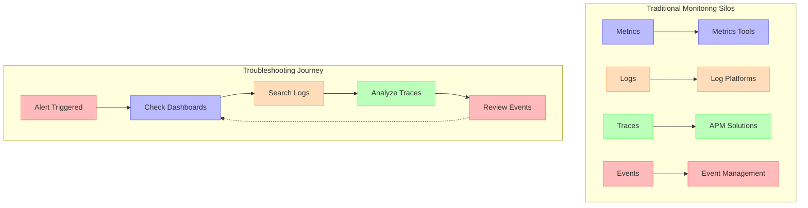

## Correlation Techniques Overview

| Correlation Method | Description | Best For | Implementation Complexity |
|-------------------|-------------|----------|---------------------------|
| **Exemplars** | Representative trace samples attached to metrics | • High-cardinality exploration<br>• Performance outlier analysis<br>• Metric-to-trace navigation | Medium |
| **Trace Context** | Propagating trace identifiers across service boundaries | • Distributed transactions<br>• End-to-end visibility<br>• Service boundary mapping | Medium-High |
| **Common Dimensions** | Shared attributes across all telemetry types | • Cross-signal filtering<br>• Environment segmentation<br>• Entity correlation | Low |
| **Entity Synthesis** | Automated grouping of related telemetry | • Service mapping<br>• Dependency analysis<br>• Topology visualization | Low |
| **Log Linking** | Embedding trace IDs in structured logs | • Error investigation<br>• Root cause analysis<br>• Debug context | Low-Medium |
| **Span Events** | Converting spans to queryable events | • Advanced span analytics<br>• Customer journey analysis<br>• Business transaction tracking | Medium |

## Exemplars: Connecting Metrics to Traces

Exemplars provide a mechanism to attach trace samples to aggregated metrics, allowing direct correlation between high-level metrics and individual detailed traces.

### Exemplar Architecture

<!-- DG-60A: Exemplar Data Flow -->

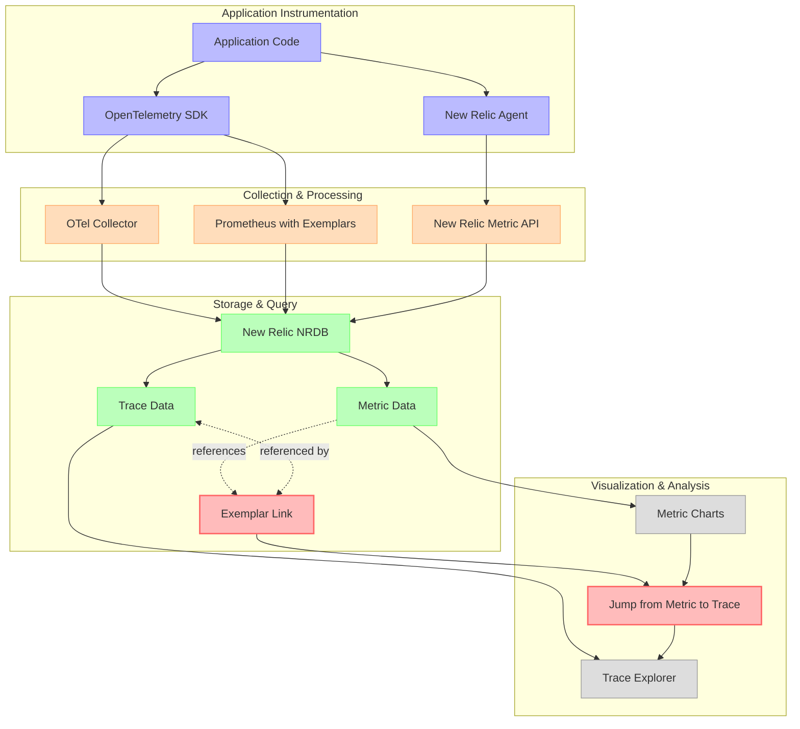

### Exemplar Data Model

In New Relic, exemplars tie metrics to representative trace samples:

| Exemplar Component | Description | Example Value |
|--------------------|-------------|---------------|
| **Metric Name** | Identifier of the metric | `http_server_duration_seconds` |
| **Metric Value** | Observed measurement | `0.342` |
| **Timestamp** | When measurement occurred | `2023-08-15T14:23:18.123Z` |
| **Trace ID** | Unique identifier for the trace | `4bf92f3577b34da6a3ce929d0e0e4736` |
| **Span ID** | Identifier for the specific span | `00f067aa0ba902b7` |
| **Attributes** | Additional contextual information | `{"http.status_code": 200, "http.method": "GET"}` |

### Exemplar Visualization

<!-- DG-60B: Exemplar Visualization -->

```mermaid
xychart-beta
    title "HTTP Response Time with Exemplars"
    x-axis [9:00, 9:30, 10:00, 10:30, 11:00, 11:30, 12:00]
    y-axis "Response Time (ms)" 0 --> 500
    line [120, 145, 180, 310, 210, 150, 125]
    
    annotate(3, 180, "x")
    annotate(4, 310, "x")
    annotate(5, 210, "x")
```

*Legend: X marks represent exemplars that can be clicked to view the corresponding trace.*

## Context Propagation

### W3C Trace Context Standard

The W3C Trace Context standard provides a unified approach to propagating context across service boundaries:

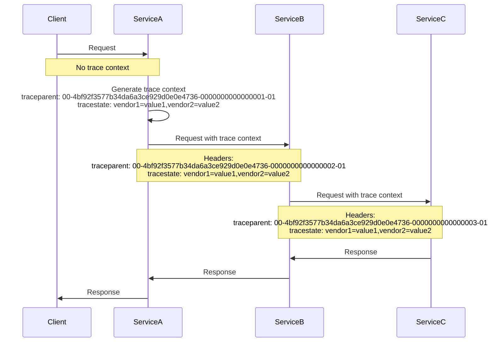

### Context Propagation Models

| Model | Description | Best For | Challenges |
|-------|-------------|----------|------------|
| **HTTP Headers** | Context in standard HTTP headers | • RESTful services<br>• HTTP-based APIs<br>• Web applications | • Header size limits<br>• Non-HTTP protocols |
| **Message Attributes** | Context in message metadata | • Kafka/RabbitMQ<br>• Event streaming<br>• Messaging systems | • Protocol-specific implementation<br>• Legacy system support |
| **Database Comments** | Context embedded in SQL comments | • Database queries<br>• ORM integration<br>• Legacy applications | • Database support<br>• Query parser limitations |
| **Binary Protocols** | Custom context protocols | • gRPC<br>• Thrift<br>• Custom RPC mechanisms | • Implementation complexity<br>• Standard compliance |

### Cross-Domain Issues

Challenges when crossing organizational or network boundaries:

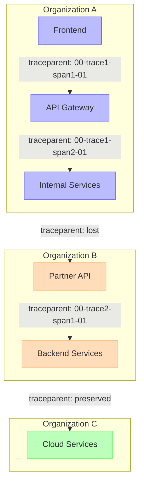

## Log-Trace Correlation

### Structured Logging with Trace Context

Effective log correlation embeds trace identifiers in structured log entries:

| Log Field | Purpose | Example Value |
|-----------|---------|---------------|
| `trace.id` | Full trace identifier | `"trace.id": "4bf92f3577b34da6a3ce929d0e0e4736"` |
| `span.id` | Current execution span | `"span.id": "00f067aa0ba902b7"` |
| `parent.id` | Parent span identifier | `"parent.id": "ff11bbcc22dd44ee"` |
| `service.name` | Originating service | `"service.name": "payment-processor"` |
| `timestamp` | Event timestamp (ISO8601) | `"timestamp": "2023-08-15T14:23:18.123Z"` |
| `log.level` | Severity level | `"log.level": "ERROR"` |
| `message` | Human-readable message | `"message": "Payment authorization failed"` |
| `error.type` | Error classification | `"error.type": "AuthorizationException"` |
| `customer.id` | Business context | `"customer.id": "cust_12345"` |

### Log-Trace Correlation Patterns

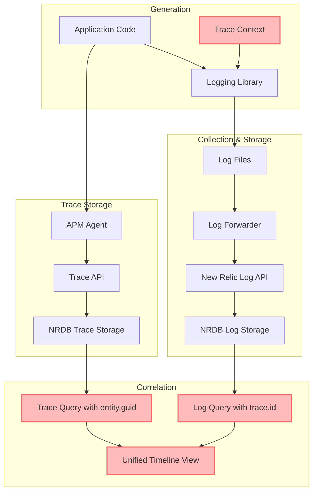

## Metric-to-Trace Correlation

### Time-Windowed Correlation

Connecting metrics to related traces within the same time window:

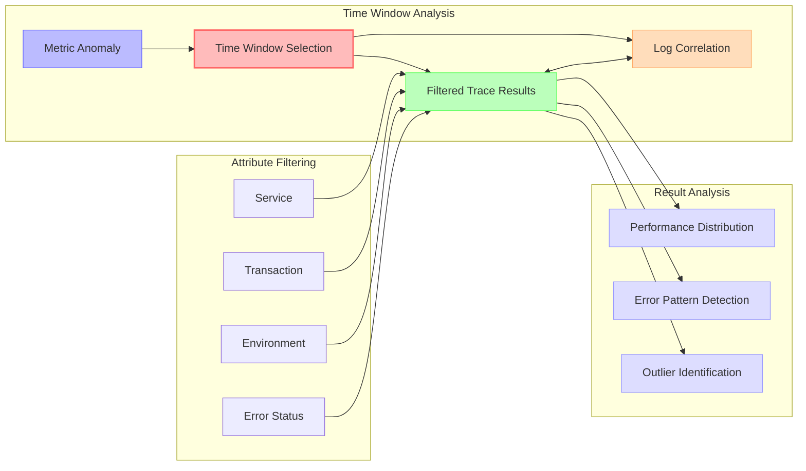

### Entity Correlation

Using entity relationships to navigate from metrics to traces:

| Entity Type | Correlation Path | Example Query |
|-------------|------------------|---------------|
| **Service** | Service metrics → Service entity → Service traces | `FROM Metric SELECT average(duration) FACET entity.name WHERE entity.type = 'SERVICE'` → `FROM Span SELECT * WHERE entity.guid = 'MjM4MjcwMnxBUE18QVBQTElDQVRJT058MjE1MDM5Nzkz'` |
| **Host** | Host metrics → Host entity → Services → Traces | `FROM SystemSample SELECT average(cpuPercent) FACET hostname` → `FROM Span SELECT * WHERE entity.name IN (SELECT service FROM ServiceInstance WHERE hostname = 'web-01')` |
| **Container** | Container metrics → Container entity → Service traces | `FROM K8sContainerSample SELECT average(cpuCoresUtilization) FACET containerName` → `FROM Span SELECT * WHERE entity.name IN (FROM K8sPodSample SELECT service WHERE containerName = 'payment-api')` |

## Unified Analysis Techniques

### The MELT Correlation Workflow

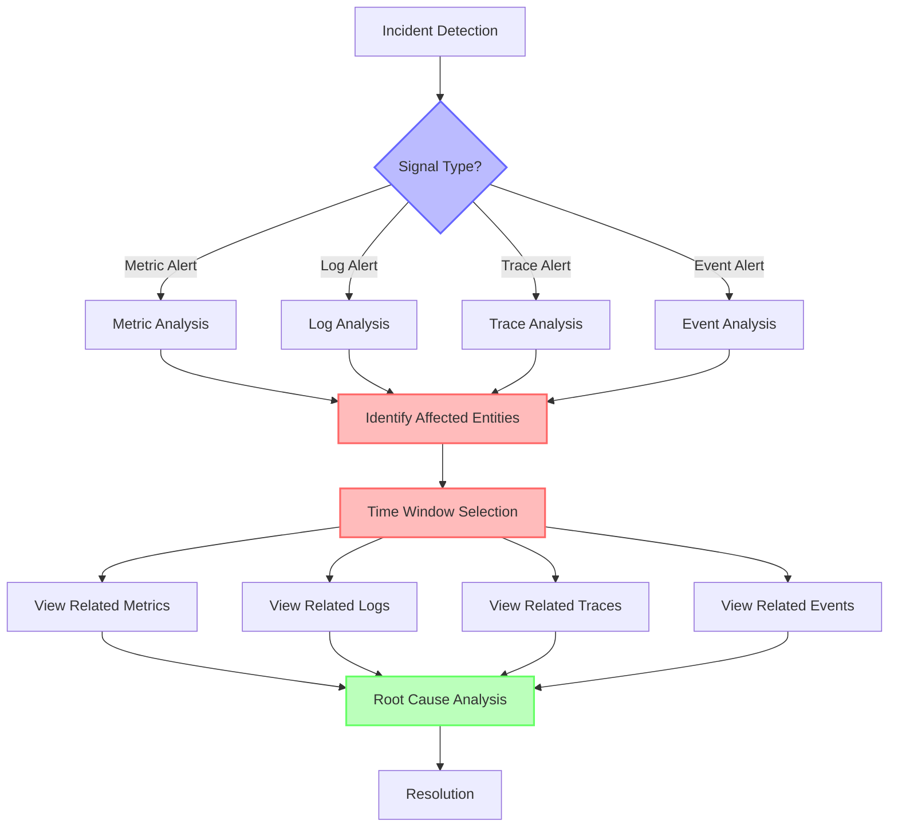

### Entity Timeline Visualization

<!-- DG-60C: Entity Timeline Visualization -->

```mermaid
gantt
    title Correlated Timeline for Payment Service (12:00-12:15)
    dateFormat  HH:mm
    axisFormat %H:%M
    
    section Deployments
    Deploy v2.1.5     :milestone, m1, 12:02, 0s
    
    section Metrics
    CPU Spike         :crit, cpu, 12:05, 2m
    Memory Increase   :active, mem, 12:06, 5m
    
    section Logs
    Error Rate Increase :crit, err, 12:05, 3m
    OOM Warnings      :warn, warn, 12:07, 2m
    
    section Traces
    Slow Payment Traces :crit, slow, 12:05, 4m
    DB Connection Errors :crit, dberr, 12:08, 3m
    
    section Alerts
    Response Time Alert :milestone, a1, 12:06, 0s
    Error Rate Alert   :milestone, a2, 12:07, 0s
```

## Advanced Correlation Use Cases

### Distributed Root Cause Analysis

Tracing a problem through a complex distributed system:

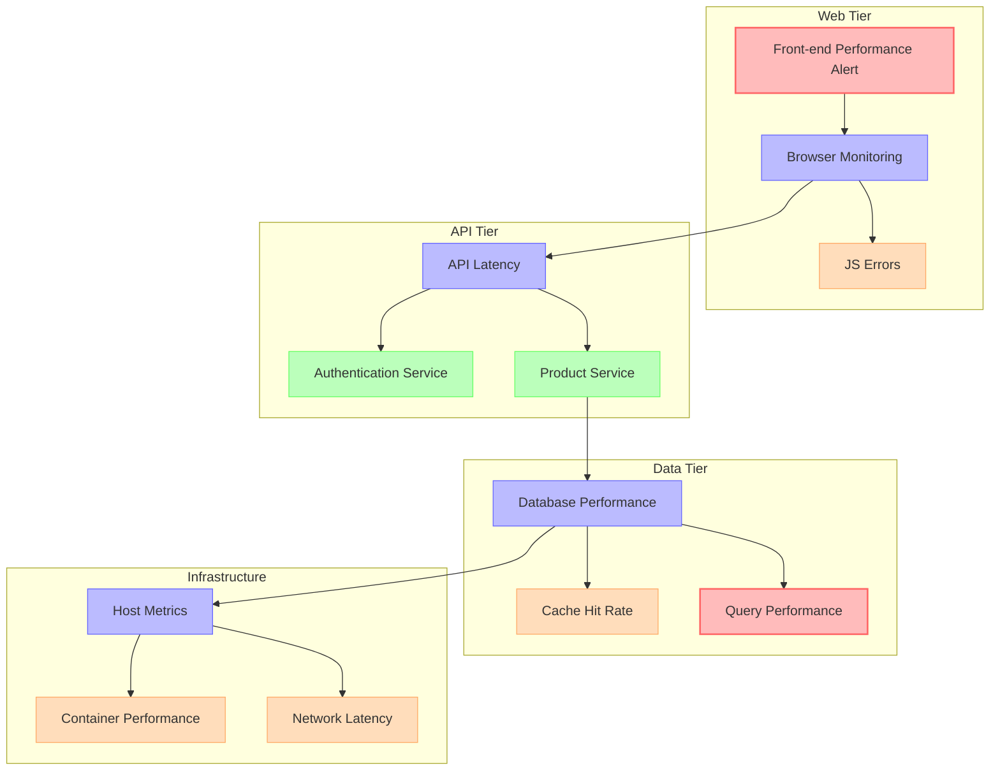

### Business Transaction Tracing

Tracking business transactions across technical services:

| Business Step | Technical Services | Correlation Mechanism | Signal Types |
|---------------|---------------------|------------------------|--------------|
| **Browse Products** | • Web Frontend<br>• Product Catalog API<br>• Recommendation Engine | • User session ID<br>• Common attributes<br>• Trace context | • Browser events<br>• API traces<br>• Service metrics |
| **Add to Cart** | • Web Frontend<br>• Cart Service<br>• Inventory Service | • User ID<br>• Cart ID<br>• Trace correlation | • Frontend events<br>• Backend traces<br>• Inventory checks |
| **Checkout** | • Checkout UI<br>• Order Service<br>• Payment Gateway<br>• Fulfillment Service | • Order ID<br>• Payment ID<br>• Distributed tracing | • Frontend logs<br>• Payment traces<br>• Order events<br>• Fulfillment metrics |
| **Order Tracking** | • Tracking UI<br>• Order Status Service<br>• Logistics API | • Order ID<br>• Shipment ID<br>• Tracking number | • Status logs<br>• Tracking events<br>• Fulfillment metrics |

### User Session Correlation

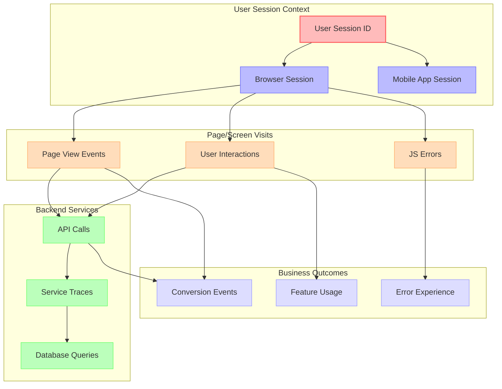

## Implementation Best Practices

### Unified Attribute Naming

| Dimension | Standard Attribute Name | Example Values | Used In |
|-----------|-------------------------|---------------|---------|
| **Environment** | `environment` | `production`, `staging`, `development` | All signals |
| **Service** | `service.name` | `payment-api`, `user-service` | All signals |
| **Instance** | `service.instance.id` | `pod-name`, `host:port` | All signals |
| **User Context** | `user.id`, `session.id` | `user_12345`, `sess_abcdef` | Logs, Traces, Events |
| **Transaction** | `transaction.name` | `WebTransaction/Controller/payment/process` | APM, Traces, Logs |
| **Container** | `container.id`, `k8s.pod.name` | `abc123def456`, `payment-api-789xyz` | Infrastructure, Logs, Traces |
| **Deployment** | `deployment.id`, `version` | `d-123abc`, `2.3.5` | All signals |
| **Business Context** | `customer.id`, `order.id` | `cust_12345`, `ord_6789` | Logs, Traces, Events |

### Instrumentation Strategy

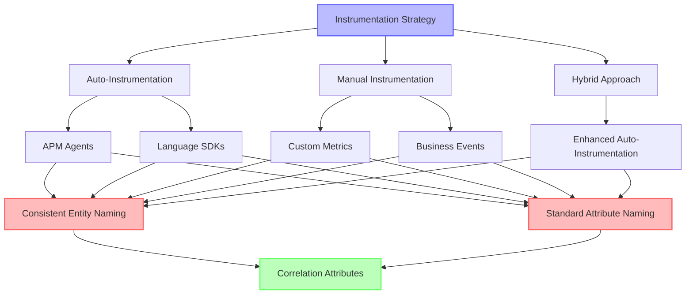

### Implementation Recommendation Matrix

| System Type | Correlation Strategy | Implementation | Overhead |
|-------------|---------------------|----------------|----------|
| **High-Volume APIs** | Sampling with exemplars | • OTel with head-based sampling<br>• Strategic exemplar points<br>• Reduced attribute cardinality | Low |
| **Critical Business Flows** | Full tracing with log linking | • Full distributed tracing<br>• Comprehensive log correlation<br>• Business context propagation | Medium-High |
| **Background Services** | Metrics with on-demand traces | • Detailed metric collection<br>• Conditional trace sampling<br>• Triggered by anomalies | Low |
| **Databases & Caches** | Targeted instrumentation | • Query-level metrics<br>• Slow query tracing<br>• Consistent entity relationships | Low-Medium |
| **Microservice Mesh** | Service-oriented correlation | • Service mesh integration<br>• Consistent service naming<br>• Topology-aware correlation | Medium |

## Advanced Visualization Techniques

### Unified Timeline View

Showing all signal types on a single timeline:

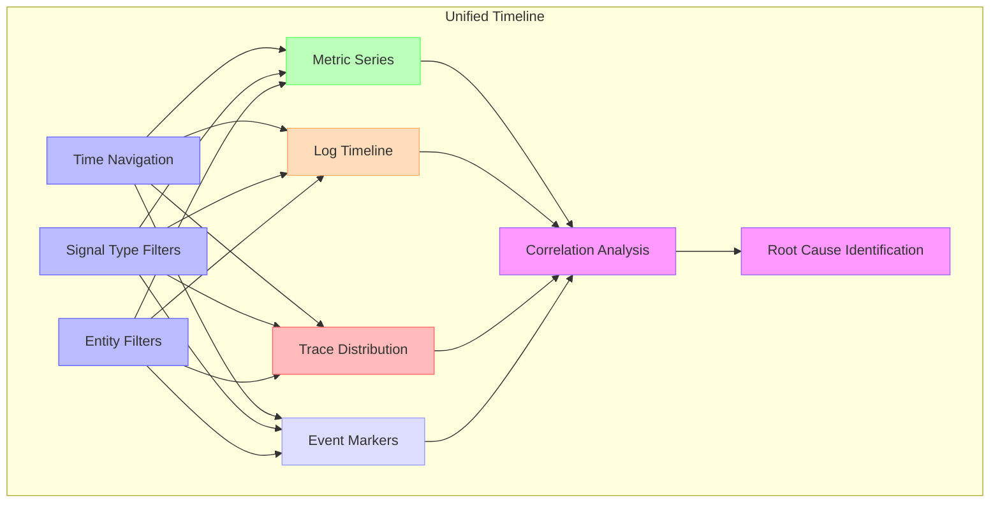

### Service Graph with Signal Overlay

<!-- DG-60D: Service Graph with Signal Overlay -->

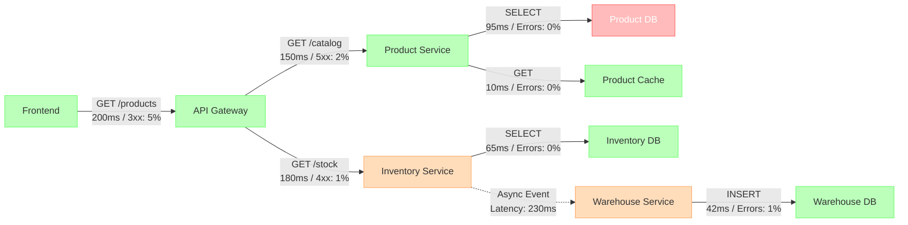

*Legend: Green nodes are healthy, yellow have warnings, red have critical issues.*

## Case Studies

### E-Commerce Checkout Optimization

| Challenge | Correlation Approach | Outcome |
|-----------|----------------------|---------|
| **Inconsistent checkout experience** | • Customer session as correlation key<br>• Full journey tracing<br>• Log correlation on order IDs | • 42% reduction in checkout abandonment<br>• Identified payment gateway timeouts<br>• Fixed inventory check race conditions |
| **Mobile vs. web performance disparity** | • Platform-specific correlation<br>• API latency exemplars<br>• Network path tracing | • 65% improved mobile performance<br>• Discovered mobile CDN routing issues<br>• Optimized API responses for mobile clients |
| **Regional performance variations** | • Geographic correlation attributes<br>• Edge to origin tracing<br>• Cross-region logging correlation | • Consistent global performance<br>• Improved CDN configuration<br>• Regional data sovereignty compliance |

### Financial Services Distributed Tracing

| Challenge | Correlation Approach | Outcome |
|-----------|----------------------|---------|
| **Transaction reconciliation errors** | • Transaction ID correlation<br>• Cross-system tracing<br>• Database query correlation | • 99.99% reconciliation accuracy<br>• Early detection of mismatches<br>• Automated recovery mechanisms |
| **Compliance reporting gaps** | • Unified audit trail<br>• Regulated transaction tracing<br>• Complete event timeline correlation | • Full regulatory compliance<br>• Automated audit report generation<br>• Reduced compliance overhead |
| **Batch processing reliability** | • Job-level correlation<br>• Process step tracing<br>• Error pattern analysis | • 78% improvement in batch reliability<br>• Predictive failure detection<br>• Automated recovery procedures |

## Correlation in Kubernetes Environments

### Pod Lifecycle Correlation

Tracking connections between container events and application behavior:

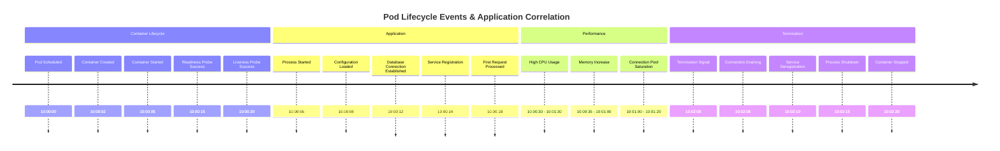

### Kubernetes Signal Correlation Matrix

| K8s Signal | Related Metrics | Related Logs | Related Traces | Business Impact |
|------------|-----------------|--------------|----------------|-----------------|
| **Pod Restart** | • Container restarts<br>• OOM events<br>• Resource utilization | • Container crash logs<br>• Previous termination logs<br>• Kubelet logs | • Interrupted transactions<br>• Connection errors<br>• Timeout patterns | • Transaction failures<br>• API errors<br>• Data integrity issues |
| **Node Pressure** | • Node resource metrics<br>• Eviction thresholds<br>• System load | • Node condition logs<br>• Kubelet events<br>• System logs | • Increased latency<br>• Resource contention<br>• Queue backpressure | • Service degradation<br>• Capacity limitations<br>• Inconsistent performance |
| **Network Policy** | • Connection metrics<br>• Packet drops<br>• DNS resolution time | • CNI logs<br>• Kube-proxy logs<br>• Connection rejection logs | • Connection failures<br>• Timeout errors<br>• Retry patterns | • Service disruptions<br>• Integration failures<br>• Partial outages |
| **Deployment Rollout** | • Scaling metrics<br>• Availability transition<br>• Resource allocation | • Deployment controller logs<br>• ReplicaSet events<br>• Scheduler decisions | • Service initialization<br>• Connection establishment<br>• Warmup patterns | • Feature availability<br>• Gradual capacity changes<br>• User experience shifts |

## Future Directions in Correlation

### AI-Enhanced Correlation

| Capability | Description | Benefits | Challenges |
|------------|-------------|----------|------------|
| **Anomaly Grouping** | Automatically group related anomalies across signals | • Reduced alert noise<br>• Faster incident triage<br>• Common cause identification | • False correlations<br>• Training data requirements<br>• Explainability |
| **Causality Detection** | Identify causal relationships between signals | • Root cause prioritization<br>• Impact prediction<br>• Preventative actions | • Complex dependencies<br>• Time-lag variations<br>• Statistical significance |
| **Pattern Recognition** | Identify recurring patterns across historical data | • Faster diagnosis<br>• Predictive remediation<br>• Knowledge transfer | • Signal noise<br>• Pattern evolution<br>• Context sensitivity |
| **Natural Language Interface** | Query correlated data using conversational language | • Democratized analysis<br>• Reduced query complexity<br>• Faster investigation | • Query interpretation<br>• Domain specificity<br>• Result presentation |

### Emerging Correlation Standards

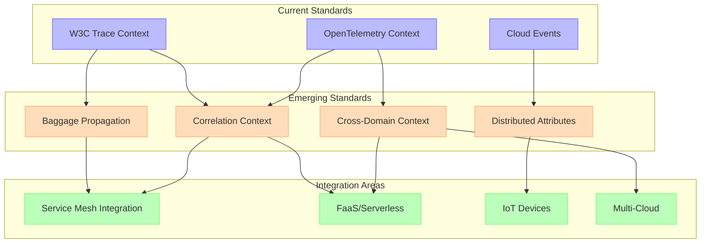

## Conclusion

Effective trace correlation and exemplars transform observability from siloed telemetry collection into a unified analytical framework. Key takeaways include:

1. **Unified Context**: Propagating consistent identifiers across all telemetry types creates a comprehensive view of system behavior
2. **Exemplar Integration**: Connecting high-level metrics to detailed traces bridges the gap between summary statistics and individual transactions
3. **Cross-Signal Navigation**: Building pathways between metrics, logs, traces, and events accelerates root cause analysis
4. **Standardized Attributes**: Adopting consistent naming conventions and correlation identifiers simplifies integration
5. **Business Context**: Extending technical correlation to include business identifiers connects technical performance to user outcomes

Organizations that implement effective correlation strategies typically see significant reductions in Mean Time to Detection (MTTD) and Mean Time to Resolution (MTTR), often reducing troubleshooting time by 50-70% for complex distributed issues.

The techniques described in this chapter provide a foundation for advanced observability practices that align technical monitoring with business outcomes and user experiences.
