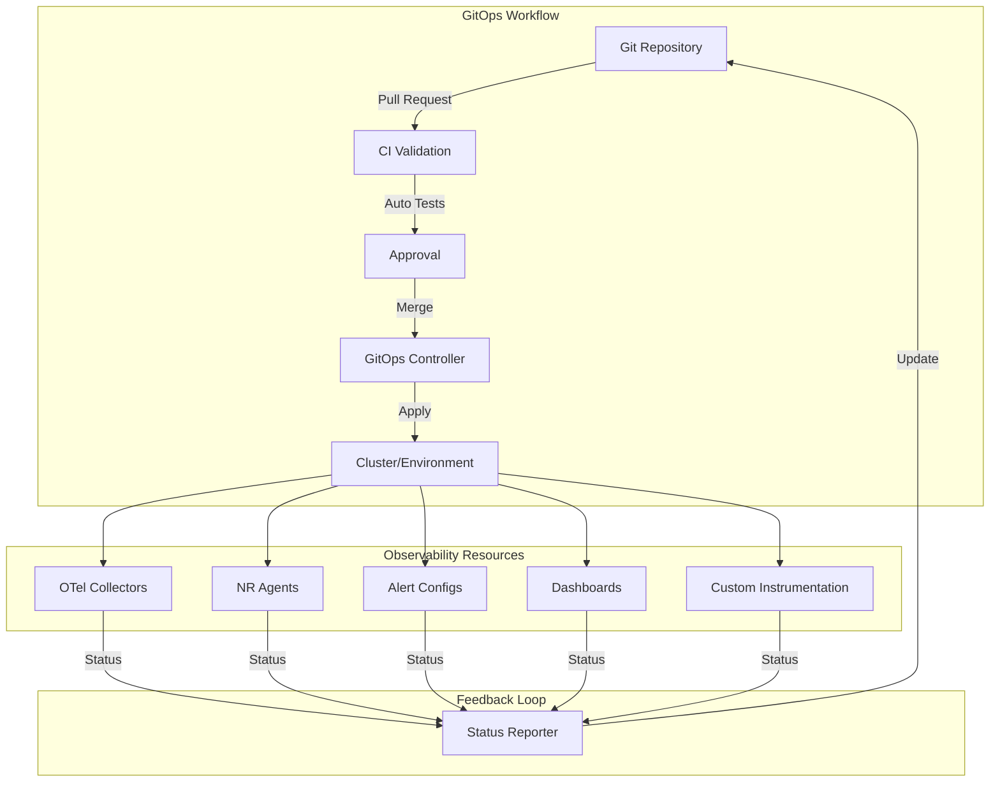
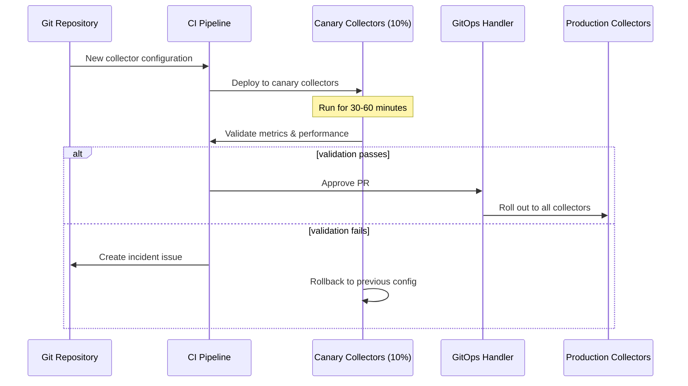
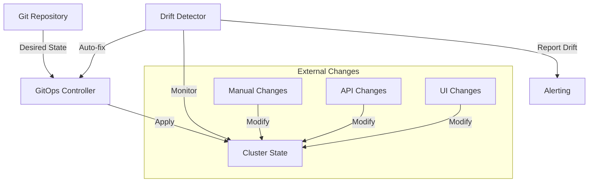

# GitOps Integration for Observability

## Introduction

Adopting GitOps practices for observability infrastructure offers significant advantages in consistency, auditability, and scalability across environments. This chapter explores how to implement GitOps workflows specifically for New Relic and OpenTelemetry deployments, focusing on repeatable patterns that integrate with existing CI/CD pipelines.

## GitOps Principles for Observability

GitOps extends beyond application deployment to encompass the entire observability stack, including:

1. Agent and collector configurations
2. Custom instrumentation definitions
3. Alerting and dashboard definitions
4. Sampling and filtering rules
5. Retention and aggregation policies



## Repository Structure

A well-organized repository structure enables scalable, multi-environment observability management:

```
observability/
├── base/                       # Base configurations
│   ├── otel-collectors/
│   │   ├── kustomization.yaml
│   │   └── collector-config.yaml
│   ├── nr-infrastructure/
│   │   ├── kustomization.yaml
│   │   └── agent-config.yaml
│   └── prometheus/
│       ├── kustomization.yaml
│       └── prometheus.yaml
├── environments/
│   ├── dev/
│   │   ├── kustomization.yaml    # References and patches base
│   │   └── sampling-patch.yaml   # Higher sampling rate for dev
│   ├── staging/
│   │   ├── kustomization.yaml
│   │   └── collector-patch.yaml  # Environment-specific changes
│   └── production/
│       ├── kustomization.yaml
│       └── resource-patch.yaml   # Production resource settings
└── dashboards-as-code/
    ├── golden-signals.jsonnet    # Grafana/NR dashboard definitions
    ├── slo-dashboard.jsonnet
    └── infrastructure.jsonnet
```

## ArgoCD Application Sets

ArgoCD ApplicationSets provide a powerful way to deploy consistent observability across multiple clusters:

<!-- CF-63A: ArgoCD AppSet for observability -->

```yaml
apiVersion: argoproj.io/v1alpha1
kind: ApplicationSet
metadata:
  name: otel-collector
  namespace: argocd
spec:
  generators:
  - clusters:
      selector:
        matchLabels:
          environment: production
  template:
    metadata:
      name: '{{name}}-otel-collector'
    spec:
      project: observability
      source:
        repoURL: https://github.com/your-org/observability-configs.git
        targetRevision: HEAD
        path: environments/production
      destination:
        server: '{{server}}'
        namespace: observability
      syncPolicy:
        automated:
          prune: true
          selfHeal: true
        syncOptions:
        - CreateNamespace=true
        retry:
          limit: 5
          backoff:
            duration: 5s
            factor: 2
            maxDuration: 3m
```

## Configuration Templates with Kustomize

Kustomize provides a powerful way to manage environment-specific variations without duplication:

### Base OTel Collector Configuration

```yaml
# base/otel-collectors/collector-config.yaml
apiVersion: opentelemetry.io/v1alpha1
kind: OpenTelemetryCollector
metadata:
  name: default
spec:
  mode: deployment
  serviceAccount: otel-collector
  replicas: 2
  config: |
    receivers:
      otlp:
        protocols:
          grpc:
            endpoint: 0.0.0.0:4317
          http:
            endpoint: 0.0.0.0:4318
    
    processors:
      batch:
        send_batch_size: 10000
        timeout: 10s
      
      memory_limiter:
        check_interval: 5s
        limit_mib: 1000

    exporters:
      otlp:
        endpoint: https://otlp.nr-data.net:4317
        headers:
          api-key: ${NEWRELIC_LICENSE_KEY}

    service:
      pipelines:
        traces:
          receivers: [otlp]
          processors: [memory_limiter, batch]
          exporters: [otlp]
        metrics:
          receivers: [otlp]
          processors: [memory_limiter, batch]
          exporters: [otlp]
```

### Production-Specific Patch

```yaml
# environments/production/collector-patch.yaml
apiVersion: opentelemetry.io/v1alpha1
kind: OpenTelemetryCollector
metadata:
  name: default
spec:
  replicas: 3
  config: |
    processors:
      batch:
        send_batch_size: 20000
        timeout: 5s
      
      memory_limiter:
        limit_mib: 2000
```

## Secret Management

Secure management of API keys and credentials is critical for observability infrastructure:

### External Secrets Operator Integration

```yaml
apiVersion: external-secrets.io/v1beta1
kind: ExternalSecret
metadata:
  name: newrelic-credentials
  namespace: observability
spec:
  refreshInterval: 1h
  secretStoreRef:
    name: vault-backend
    kind: ClusterSecretStore
  target:
    name: newrelic-keys
    creationPolicy: Owner
  data:
  - secretKey: license_key
    remoteRef:
      key: observability/newrelic
      property: license_key
  - secretKey: insights_key
    remoteRef:
      key: observability/newrelic
      property: insights_key
```

## Progressive Deployment Patterns

### Canary Deployment for Collector Updates

When updating collector configurations, a canary approach can validate changes before full rollout:



## Version Controlled Dashboards and Alerts

### Grafonnet for Dashboard-as-Code

```jsonnet
// dashboards-as-code/golden-signals.jsonnet
local grafana = import 'grafonnet/grafana.libsonnet';
local dashboard = grafana.dashboard;
local row = grafana.row;
local prometheus = grafana.prometheus;
local template = grafana.template;
local graphPanel = grafana.graphPanel;

dashboard.new(
  'Kubernetes Golden Signals',
  description='Auto-generated golden signals dashboard for Kubernetes workloads',
  tags=['kubernetes', 'golden-signals'],
  editable=true,
  time_from='now-3h',
  refresh='1m',
)
.addTemplate(
  template.new(
    name='namespace',
    datasource='Prometheus',
    query='label_values(kube_namespace_labels, namespace)',
    current='default',
    refresh=2,
  )
)
.addTemplate(
  template.new(
    name='workload',
    datasource='Prometheus',
    query='label_values(kube_deployment_labels{namespace="$namespace"}, deployment)',
    current='',
    refresh=2,
  )
)
.addRow(
  row.new(title='Traffic')
  .addPanel(
    graphPanel.new(
      'Request Rate',
      datasource='Prometheus',
      description='Requests per second',
      format='ops',
      min=0,
    )
    .addTarget(
      prometheus.target(
        'sum(rate(http_requests_total{namespace="$namespace", deployment="$workload"}[5m]))',
        legendFormat='requests/sec',
      )
    )
  )
)
// Additional rows for Error Rate, Latency, and Saturation omitted for brevity
```

### Terraform for New Relic Alerting-as-Code

```terraform
# alerts-as-code/golden-signals-alerts.tf
resource "newrelic_alert_policy" "golden_signals" {
  name = "Golden Signals - ${var.environment}"
}

resource "newrelic_nrql_alert_condition" "error_rate" {
  policy_id                      = newrelic_alert_policy.golden_signals.id
  type                           = "static"
  name                           = "High Error Rate"
  description                    = "Alert when error rate exceeds threshold"
  enabled                        = true
  violation_time_limit_seconds   = 3600
  fill_option                    = "static"
  fill_value                     = 0.0
  aggregation_window             = 60
  aggregation_method             = "event_flow"
  aggregation_delay              = 120
  expiration_duration            = 120
  open_violation_on_expiration   = true
  close_violations_on_expiration = true

  nrql {
    query = "FROM Metric SELECT rate(count(errorCount), 1 minute) / rate(count(responseCount), 1 minute) * 100 WHERE service = '${var.service_name}' AND environment = '${var.environment}' FACET service"
  }

  critical {
    operator              = "above"
    threshold             = 5.0
    threshold_duration    = 300
    threshold_occurrences = "all"
  }

  warning {
    operator              = "above"
    threshold             = 2.0
    threshold_duration    = 300
    threshold_occurrences = "all"
  }
}

# Additional alert conditions for latency, saturation, and traffic omitted for brevity
```

## Automated Validation

Implementing automated validation for observability configurations reduces risk and ensures quality:

### Pre-Commit Validation

```yaml
# .pre-commit-config.yaml
repos:
- repo: https://github.com/adrienverge/yamllint.git
  rev: v1.26.3
  hooks:
  - id: yamllint
    args: [--config-file, .yamllint.yml]

- repo: https://github.com/open-telemetry/opentelemetry-collector-contrib
  rev: v0.81.0
  hooks:
  - id: otelcol-config-validate
    entry: otelcol-config-validate
    files: ^(base|environments)/.*collector.*\.ya?ml$
    
- repo: https://github.com/jsonnet-bundler/jsonnet-bundler
  rev: v0.4.0
  hooks:
  - id: jb
    entry: jsonnet
    args: [lint]
    files: \.jsonnet$
```

### CI Pipeline Testing

```yaml
# .github/workflows/validate-observability.yml
name: Validate Observability Configs

on:
  pull_request:
    paths:
      - 'base/**'
      - 'environments/**'
      - 'dashboards-as-code/**'

jobs:
  validate:
    runs-on: ubuntu-latest
    steps:
      - uses: actions/checkout@v3
      
      - name: Set up OTel tools
        run: |
          curl -L https://github.com/open-telemetry/opentelemetry-collector/releases/latest/download/otelcol_linux_amd64 -o otelcol
          chmod +x otelcol
          
      - name: Validate OTel Collector configs
        run: |
          for config in $(find . -name "*collector-config.yaml"); do
            echo "Validating $config"
            cat $config | ./otelcol --config=stdin validate
          done
      
      - name: Validate Grafana dashboards
        run: |
          pip install jsonschema
          for dashboard in $(find dashboards-as-code -name "*.jsonnet"); do
            echo "Validating $dashboard"
            jsonnet $dashboard | jsonschema -i - dashboard-schema.json
          done
```

## Drift Detection and Reconciliation

### Continuous Reconciliation Loop



### Drift Detection with Prometheus Rules

```yaml
apiVersion: monitoring.coreos.com/v1
kind: PrometheusRule
metadata:
  name: observability-drift-alerts
  namespace: monitoring
spec:
  groups:
  - name: observability-drift
    rules:
    - alert: OtelCollectorConfigDrift
      expr: |
        count(kube_configmap_info{namespace="observability", configmap=~"otel-collector-.*"})
        != 
        count(kube_configmap_metadata_resource_version{namespace="observability", configmap=~"otel-collector-.*"})
      for: 10m
      labels:
        severity: warning
      annotations:
        summary: "OTel Collector configuration drift detected"
        description: "Configuration drift detected in OTel Collector ConfigMaps. This may indicate manual changes outside of GitOps workflow."
```

## Run-Book for GitOps Implementation

<!-- RB-63A: GitOps Implementation Run-Book -->

| Step | Action | Verification | Fallback |
|------|--------|--------------|----------|
| 1 | Inventory current observability configurations | Map all existing collectors, agents, dashboards | N/A |
| 2 | Create Git repository structure | Validate with team review | N/A |
| 3 | Import existing configurations | Verify equivalence with current state | Keep parallel systems until validated |
| 4 | Setup CI/CD validation pipeline | Test with known-good and known-bad configs | Manual validation |
| 5 | Deploy GitOps controller | Verify connectivity to Git and clusters | Manual application of configs |
| 6 | Deploy canary environment | Verify metrics flow and dashboards | Rollback to previous infrastructure |
| 7 | Gradually deploy to production | Monitor performance metrics at each step | Incremental rollback |
| 8 | Implement drift detection | Verify alerts on manual changes | Regular audits |
| 9 | Train team on new workflow | Validate through PR exercises | Pair programming sessions |
| 10 | Decommission manual configuration processes | Verify all changes flow through Git | Maintain emergency direct access |

## Common Challenges and Solutions

### Managing Environment-Specific Secrets

Challenge: Securely handling credentials across environments.

Solution: Use sealed secrets or external secrets operators integrated with your GitOps workflow:

```yaml
apiVersion: bitnami.com/v1alpha1
kind: SealedSecret
metadata:
  name: newrelic-license
  namespace: observability
spec:
  encryptedData:
    license_key: AgBy8hCJ29...truncated for brevity...
```

### Handling Large Configuration Files

Challenge: OTel collector configurations can become unwieldy as they grow.

Solution: Use Helm or Kustomize to modularize configurations:

```yaml
# base/otel-collectors/kustomization.yaml
apiVersion: kustomize.config.k8s.io/v1beta1
kind: Kustomization
resources:
  - deployment.yaml
configMapGenerator:
  - name: otel-collector-config
    files:
      - config=collector-config.yaml
      - receivers=receivers.yaml
      - processors=processors.yaml
      - exporters=exporters.yaml
      - service=service.yaml
```

### Maintaining Dashboard Consistency

Challenge: Preventing dashboard sprawl and maintaining consistency.

Solution: Implement dashboard templates and standards in code:

```jsonnet
// dashboards-as-code/lib/standardPanels.libsonnet
{
  errorRatePanel(datasource, serviceSelector): {
    title: 'Error Rate',
    type: 'graph',
    datasource: datasource,
    targets: [
      {
        expr: 'sum(rate(http_server_requests_seconds_count{status=~"5..",%(serviceSelector)s}[5m])) / sum(rate(http_server_requests_seconds_count{%(serviceSelector)s}[5m])) * 100' % { serviceSelector: serviceSelector },
        legendFormat: 'Error %',
      },
    ],
    yaxes: [
      {
        format: 'percent',
        min: 0,
      },
      {
        show: false,
      },
    ],
    thresholds: [
      {
        value: 1,
        colorMode: 'critical',
        op: 'gt',
        line: true,
        fill: false,
      },
    ],
  },
  // Additional standard panels...
}
```

## Conclusion

Implementing GitOps for observability infrastructure provides significant benefits:

1. **Consistency**: Eliminates configuration drift between environments
2. **Auditability**: Changes are tracked with clear authorship and rationale
3. **Validation**: Automated testing prevents invalid configurations
4. **Scalability**: Easily replicate patterns across services and environments
5. **Rollback**: Simple recovery from problematic changes

The patterns and examples in this chapter provide a foundation for implementing GitOps across New Relic and OpenTelemetry deployments, enabling teams to manage observability as code with the same rigor as application deployments.
