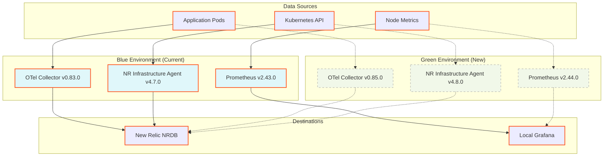
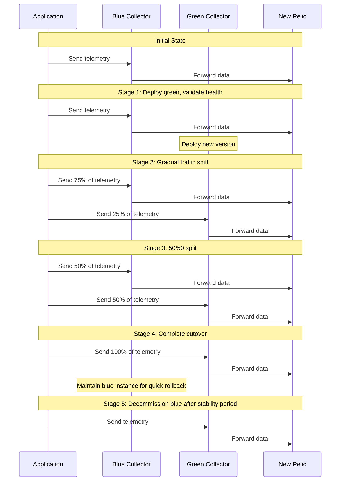

# Blue-Green Deployments for Observability

## Introduction

Maintaining continuous visibility during observability infrastructure updates is critical for production environments. This chapter presents blue-green deployment patterns specifically designed for New Relic agents, OpenTelemetry collectors, and other observability components, ensuring zero telemetry gaps during upgrades.

## Blue-Green Fundamentals for Observability

Unlike application deployments, observability blue-green deployments must account for:

1. **Data continuity**: Preventing gaps in metric collection during transitions
2. **Duplicate telemetry**: Avoiding double-counting during overlap periods
3. **Stateful considerations**: Managing persistence needs of components
4. **Backward compatibility**: Ensuring new collectors work with existing instrumentation



## Deployment Strategies for Key Components

### OpenTelemetry Collector Blue-Green

The OpenTelemetry Collector operates as both a receiver and sender, requiring special consideration for zero-gap upgrades.

#### Parallel Collectors Pattern



#### Implementation with Kubernetes

```yaml
# Blue deployment (current version)
apiVersion: apps/v1
kind: Deployment
metadata:
  name: otel-collector-blue
  labels:
    app: otel-collector
    version: blue
spec:
  replicas: 2
  selector:
    matchLabels:
      app: otel-collector
      version: blue
  template:
    metadata:
      labels:
        app: otel-collector
        version: blue
    spec:
      containers:
      - name: otel-collector
        image: otel/opentelemetry-collector-contrib:0.83.0
        ports:
        - containerPort: 4317
        - containerPort: 4318
        volumeMounts:
        - name: otel-collector-config
          mountPath: /etc/otelcol-contrib/config.yaml
          subPath: config.yaml
      volumes:
      - name: otel-collector-config
        configMap:
          name: otel-collector-config-blue
---
# Green deployment (new version)
apiVersion: apps/v1
kind: Deployment
metadata:
  name: otel-collector-green
  labels:
    app: otel-collector
    version: green
spec:
  replicas: 2  # Start with same capacity
  selector:
    matchLabels:
      app: otel-collector
      version: green
  template:
    metadata:
      labels:
        app: otel-collector
        version: green
    spec:
      containers:
      - name: otel-collector
        image: otel/opentelemetry-collector-contrib:0.85.0
        ports:
        - containerPort: 4317
        - containerPort: 4318
        volumeMounts:
        - name: otel-collector-config
          mountPath: /etc/otelcol-contrib/config.yaml
          subPath: config.yaml
      volumes:
      - name: otel-collector-config
        configMap:
          name: otel-collector-config-green
```

### Service Configuration

```yaml
# Initial service pointing to blue
apiVersion: v1
kind: Service
metadata:
  name: otel-collector
spec:
  selector:
    app: otel-collector
    version: blue  # Initially points to blue
  ports:
  - name: otlp-grpc
    port: 4317
    targetPort: 4317
  - name: otlp-http
    port: 4318
    targetPort: 4318
```

### Traffic Shifting

Using a Service Mesh like Istio allows for precise traffic control during migration:

```yaml
apiVersion: networking.istio.io/v1alpha3
kind: VirtualService
metadata:
  name: otel-collector
spec:
  hosts:
  - otel-collector
  http:
  - route:
    - destination:
        host: otel-collector
        subset: blue
      weight: 75
    - destination:
        host: otel-collector
        subset: green
      weight: 25
---
apiVersion: networking.istio.io/v1alpha3
kind: DestinationRule
metadata:
  name: otel-collector
spec:
  host: otel-collector
  subsets:
  - name: blue
    labels:
      version: blue
  - name: green
    labels:
      version: green
```

## New Relic Infrastructure Agent Updates

The Infrastructure agent requires special consideration due to its privileged access and node-level deployment.

### DaemonSet Blue-Green Pattern

```yaml
# Blue DaemonSet (current version)
apiVersion: apps/v1
kind: DaemonSet
metadata:
  name: newrelic-infra-blue
  labels:
    app: newrelic-infra
    version: blue
spec:
  selector:
    matchLabels:
      app: newrelic-infra
      version: blue
  template:
    metadata:
      labels:
        app: newrelic-infra
        version: blue
    spec:
      hostNetwork: true
      dnsPolicy: ClusterFirstWithHostNet
      serviceAccountName: newrelic-infra
      containers:
      - name: newrelic-infra
        image: newrelic/infrastructure:4.7.0
        env:
        - name: NRIA_LICENSE_KEY
          valueFrom:
            secretKeyRef:
              name: newrelic-license
              key: license
        # Other settings omitted for brevity
        
# Green DaemonSet (new version)
apiVersion: apps/v1
kind: DaemonSet
metadata:
  name: newrelic-infra-green
  labels:
    app: newrelic-infra
    version: green
spec:
  selector:
    matchLabels:
      app: newrelic-infra
      version: green
  template:
    metadata:
      labels:
        app: newrelic-infra
        version: green
    spec:
      hostNetwork: true
      dnsPolicy: ClusterFirstWithHostNet
      serviceAccountName: newrelic-infra
      containers:
      - name: newrelic-infra
        image: newrelic/infrastructure:4.8.0
        env:
        - name: NRIA_LICENSE_KEY
          valueFrom:
            secretKeyRef:
              name: newrelic-license
              key: license
        # Configuration for deduplication
        - name: NRIA_DISPLAY_NAME
          valueFrom:
            fieldRef:
              fieldPath: spec.nodeName
        - name: NRIA_CUSTOM_ATTRIBUTES
          value: '{"deployment":"green"}'
```

### Handling Host-Level Resource Contention

Running multiple infrastructure agents on the same node requires resource management:

```yaml
spec:
  template:
    spec:
      containers:
      - name: newrelic-infra
        resources:
          limits:
            cpu: 200m
            memory: 200Mi
          requests:
            cpu: 100m
            memory: 100Mi
        # Prevent port conflicts
        env:
        - name: NRIA_HTTP_SERVER_PORT
          value: "8999"  # Different port for green deployment (default is 8001)
```

## Deduplication Strategies

Running parallel collectors or agents can lead to duplicate data in New Relic. Strategies to prevent this include:

### 1. Unique Entity Names

```yaml
env:
- name: OTEL_RESOURCE_ATTRIBUTES
  value: "service.instance.id=$(POD_NAME)-blue,service.version=v1-blue"
```

### 2. Sampling Coordination

```yaml
# Blue collector sampling at 50%
processors:
  probabilistic_sampler:
    hash_seed: 42
    sampling_percentage: 50

# Green collector sampling at 50% with different seed
processors:
  probabilistic_sampler:
    hash_seed: 84  # Different seed ensures different traces are sampled
    sampling_percentage: 50
```

### 3. Metric Aggregation Awareness

For metrics with delta or cumulative aggregation temporality, ensure collectors do not double-count:

```yaml
processors:
  metricstransform:
    transforms:
      - include: .*
        action: update
        operations:
          - action: add_label
            new_label: collector_id
            new_value: blue
```

## Blue-Green Deployment Run-Book

<!-- RB-64A: Blue-Green Deployment Run-Book -->

| Phase | Actions | Verification Steps | Rollback Procedure |
|-------|---------|-------------------|-------------------|
| **Preparation** | • Create duplicate configs<br>• Prepare resource allocation<br>• Set up monitoring for both versions | • Validate new configuration<br>• Verify resource availability<br>• Test rollback procedure | N/A |
| **Green Deployment** | • Deploy green version alongside blue<br>• Configure with minimal workload (0-5%) | • Verify green deployment is running<br>• Confirm telemetry flowing from green<br>• Check for errors in green logs | Delete green deployment |
| **Initial Validation** | • Run synthetic transactions<br>• Verify completeness of telemetry<br>• Compare blue vs. green metrics | • Green shows expected metrics<br>• No unexpected errors or gaps<br>• Performance comparable to blue | Delete green deployment |
| **Progressive Traffic Shift** | • Increase traffic to green:<br>&nbsp;&nbsp;- 25% → 50% → 75% → 100%<br>• Monitor at each step for 15-30 minutes | • Metrics maintain expected patterns<br>• Query performance stays consistent<br>• No unexpected spikes in resource usage | Adjust traffic split back to previous state |
| **Full Green Operation** | • Route 100% traffic to green<br>• Keep blue running but idle | • All telemetry flows through green<br>• Dashboards and alerts function correctly<br>• No gaps in collected data | Immediately shift traffic back to blue |
| **Blue Decommissioning** | • After stability period (24-48h)<br>• Scale down and remove blue | • Continuous verification of green stability<br>• No resource contention issues | Rapidly redeploy blue if issues emerge |

### Critical Metrics to Monitor During Transition

| Metric | Warning Threshold | Critical Threshold | Meaning |
|--------|-------------------|-------------------|---------|
| `otelcol_processor_dropped_spans` | > 0 | > 100 per minute | Data loss in collector |
| `otelcol_exporter_queue_size` | > 1000 | > 5000 | Backpressure building |
| `nrintegration.status` | Any `DISCONNECTED` | > 5 min `DISCONNECTED` | Agent connectivity issues |
| `k8s_pod_memory_working_set_bytes` | > 80% of limit | > 90% of limit | Resource pressure |
| `OpenTelemetry_SpanExportRatio` | < 0.98 | < 0.95 | Data export efficiency |

## Special Considerations for Different Components

### Agent-Based Instrumentation

For applications using APM agents:

```yaml
# Configure APM agent to send to both collectors during transition
newrelic:
  collectors:
    - collector-blue.observability:4317  # Primary
    - collector-green.observability:4317  # Secondary (backup) 
```

### Prometheus Deployments

For Prometheus, use recording rules to mark metrics with deployment version:

```yaml
groups:
- name: deployment_markers
  rules:
  - record: deployment_info
    expr: up{job="prometheus"}
    labels:
      deployment_color: "blue"  # or "green"
```

## Data Validation During Transition

Verify data consistency between blue and green deployments:

```sql
-- NRQL to compare data volume between deployments
SELECT count(*) FROM Metric WHERE collector_id = 'blue' TIMESERIES 5 minutes SINCE 1 hour ago
COMPARE WITH 
SELECT count(*) FROM Metric WHERE collector_id = 'green' TIMESERIES 5 minutes SINCE 1 hour ago

-- NRQL to detect missing data patterns
SELECT uniqueCount(metricName) FROM Metric WHERE collector_id = 'blue' 
FACET metricName LIMIT 100
COMPARE WITH
SELECT uniqueCount(metricName) FROM Metric WHERE collector_id = 'green'
FACET metricName LIMIT 100
```

## Handling Custom Integrations and Extensions

Integrations often require special handling during blue-green deployments:

| Integration Type | Blue-Green Approach | Special Considerations |
|------------------|---------------------|------------------------|
| Flex Integrations | Run in both environments with deduplication IDs | May need to adjust polling frequencies to prevent double-collection |
| Logs Forwarders | Configure with version tags | Ensure proper offset tracking to prevent duplicate or missing logs |
| Custom Exporters | Deploy each version to respective collector | Verify compatibility with both collector versions |
| Dashboards & Alerts | Create temporary versions that can see both sources | Use `collector_id` in queries to distinguish sources |

## Cloud Provider-Specific Patterns

### AWS

For AWS environments, consider using separate parameter paths in AWS SSM for blue/green configurations:

```yaml
apiVersion: secrets-store.csi.x-k8s.io/v1
kind: SecretProviderClass
metadata:
  name: aws-secrets-blue
spec:
  provider: aws
  parameters:
    objects: |
      - objectName: "/observability/blue/*"
        objectType: "ssmparameter"
```

### Azure

For Azure, use slot deployments for non-containerized agents:

```powershell
# Deploy infrastructure agent to staging slot
New-AzWebAppSlot -ResourceGroupName "ObservabilityRG" -Name "app-service-name" -Slot "staging"
Set-AzWebAppSlot -ResourceGroupName "ObservabilityRG" -Name "app-service-name" -Slot "staging" -AppSettings @{
    "NEW_RELIC_LICENSE_KEY" = "$licenseKey";
    "NEW_RELIC_APP_NAME" = "MyApp-Green";
}

# Test staging slot, then swap
Switch-AzWebAppSlot -ResourceGroupName "ObservabilityRG" -Name "app-service-name" -SourceSlotName "staging" -DestinationSlotName "production"
```

## Post-Migration Cleanup

After successful migration, clean up resources to prevent drift and reduce costs:

```bash
# Example cleanup script
kubectl delete deployment otel-collector-blue
kubectl delete configmap otel-collector-config-blue
kubectl delete daemonset newrelic-infra-blue

# Update labels to remove color distinction
kubectl label service otel-collector color-
kubectl annotate deployments.apps otel-collector-green deployment.kubernetes.io/revision-
```

## Conclusion

Blue-green deployments for observability infrastructure require careful planning and execution. By treating telemetry systems with the same deployment rigor as application workloads, teams can ensure continuous visibility while safely evolving their monitoring capabilities.

Key takeaways:
1. **Plan for data continuity**: Ensure no gaps during transition
2. **Implement deduplication**: Prevent double-counting of metrics and events
3. **Validate thoroughly**: Verify both quantitative (volume, cardinality) and qualitative (correctness) aspects
4. **Maintain rollback capability**: Keep blue environment ready until green proves stable

These patterns provide a foundation for reliable observability infrastructure updates, enabling teams to adopt new capabilities while maintaining operational insight.
