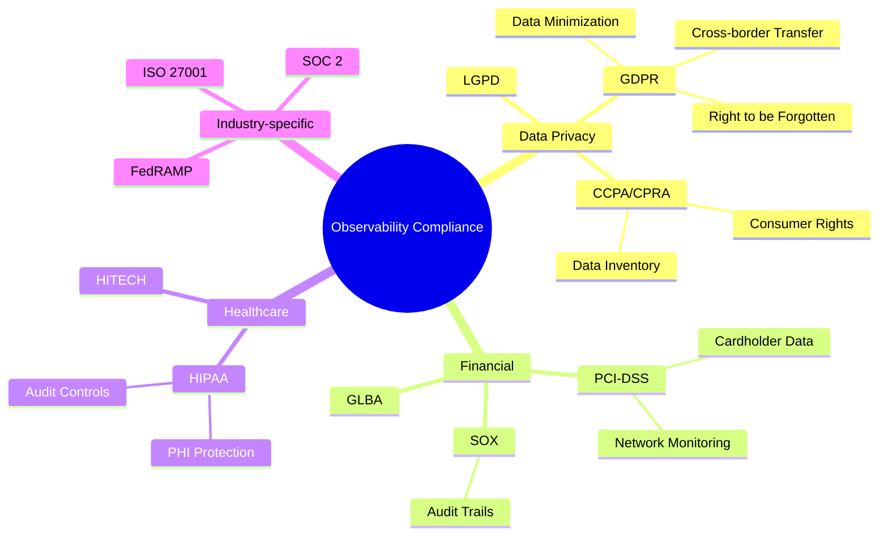
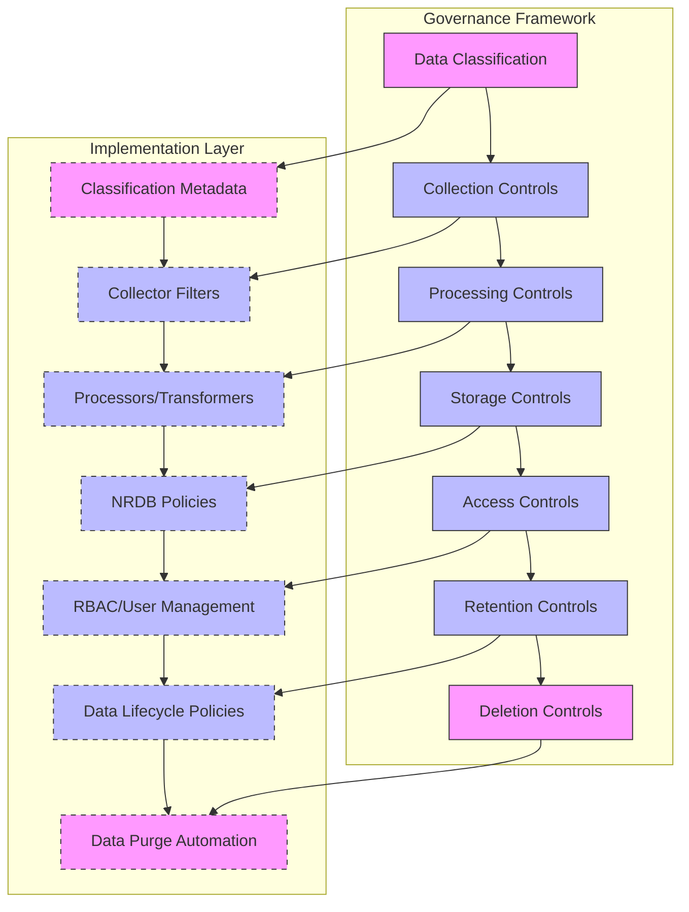
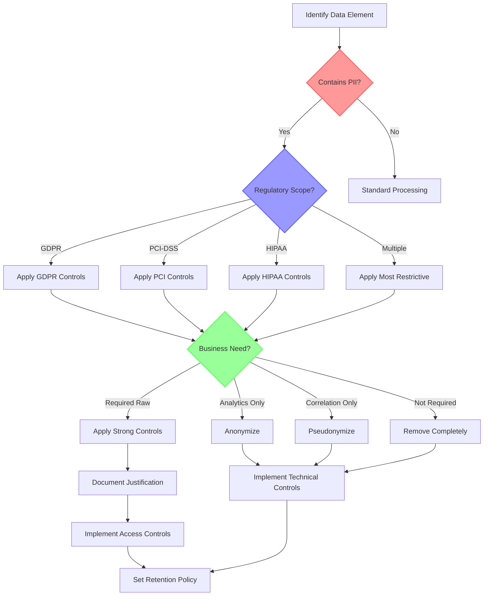
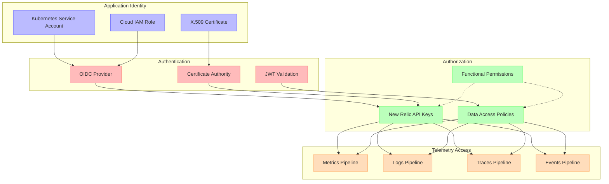
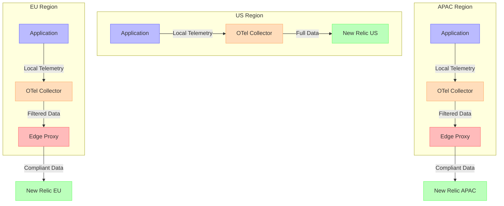
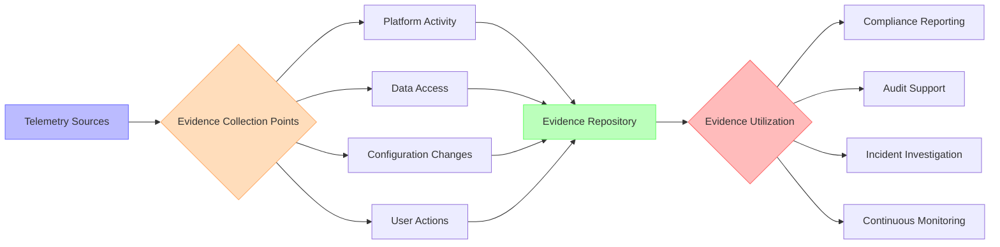

# Compliance Framework for Observability

## Introduction

Organizations operating under regulatory frameworks must ensure that their observability practices align with compliance requirements. This chapter outlines a comprehensive framework for implementing compliant observability with New Relic, addressing data governance, access controls, and audit capabilities.

## Regulatory Landscape for Observability Data

Observability data often contains information subject to various regulations:

1. **Personal Data**: Customer identifiers, IP addresses, user behaviors
2. **Operational Data**: System configurations, security states, access patterns
3. **Financial Data**: Transaction metrics, payment processing latencies
4. **Health Information**: Service performance affecting patient care systems

### Key Regulations Affecting Observability

## Compliance Matrix for Observability Systems

<!-- TB-68A: Compliance Matrix -->

The following matrix maps regulatory requirements to specific observability implementation controls:

| Compliance Requirement | Applicable Regulations | New Relic Implementation | Verification Method |
|------------------------|------------------------|--------------------------|-------------------|
| **Data Classification** | GDPR, CCPA, HIPAA, PCI-DSS | • Attribute tagging • Data dictionary • PII detection | • Data inventory audit • Classification report |
| **Data Residency** | GDPR, LGPD, FedRAMP | • Region selection • Data center selection • Edge collection | • Infrastructure verification • Network flow analysis |
| **Retention Controls** | GDPR, SOX, HIPAA | • Retention policies • Data lifecycle management • Data purging | • Retention policy audit • Data age verification |
| **Access Controls** | PCI-DSS, SOC 2, HIPAA | • RBAC implementation • SSO integration • User access reviews | • Access matrix review • Permission testing • User entitlement reports |
| **Audit Trails** | SOX, HIPAA, PCI-DSS | • Platform audit logs • Query audit trails • Configuration change tracking | • Audit log completeness test • Chain of custody verification |
| **Encryption** | HIPAA, PCI-DSS, GDPR | • TLS/SSL for transmission • Data encryption at rest • Key management | • Encryption verification • Certificate validation |
| **Anonymization** | GDPR, CCPA, HIPAA | • PII obfuscation • Data masking • Aggregation techniques | • Data sampling review • Reconstruction testing |
| **Breach Notification** | GDPR, HIPAA, CCPA | • Anomaly detection • Access alerting • Unusual query monitoring | • Alert verification testing • Response time measurement |
| **Data Subject Requests** | GDPR, CCPA, LGPD | • Data search capabilities • Deletion workflows • Export processes | • DSR response testing • Process time measurement |
| **Vendor Management** | GDPR, SOC 2, HIPAA | • Vendor assessment • NR compliance documentation • Sub-processor tracking | • Vendor audit review • Documentation completeness |

## Data Governance Architecture

Implementing proper data governance requires a structured approach across the telemetry pipeline:

## Data Classification Implementation

### Classification Taxonomy

Establish a consistent classification schema for all telemetry data:

| Classification Level | Description | Examples | Handling Requirements |
|----------------------|-------------|----------|----------------------|
| **Public** | Non-sensitive operational data | • Service uptime • Public endpoint response times • Open-source component versions | • Standard retention • Broad access permitted • No special handling |
| **Internal** | Business operational data | • Internal API performance • Non-production environments • Resource utilization | • Standard encryption • Employee-only access • Aggregation for external sharing |
| **Confidential** | Business sensitive data | • Customer metrics (anonymized) • Business process performance • Production configuration | • Enhanced access controls • Limited data sharing • Approval for access changes |
| **Restricted** | Regulated or sensitive data | • Transaction values • User behavior patterns • Health system performance | • Strict access controls • Enhanced encryption • Audit logging • Limited retention |
| **Highly Restricted** | Personal or regulated data | • PII indicators • IP addresses • Session identifiers • Payment processing data | • Maximum protection • Masking/anonymization • Minimal retention • Full audit trail |

## PII Management

### PII Detection and Handling Matrix

| PII Type | Detection Method | Handling Technique | Implementation Approach |
|----------|------------------|-------------------|------------------------|
| Email Addresses | Pattern matching | Tokenization | • Replace with consistent token • Preserve domain for business analysis |
| IP Addresses | Field identification | Partial masking | • Mask last octet • Geographic aggregation |
| Financial Data | Semantic analysis | Complete removal | • Drop high-risk fields • Replace with coarse categories |
| Session IDs | Field identification | One-way hashing | • Hash with consistent salt • Preserve correlation capability |
| User IDs | Dictionary lookups | Pseudonymization | • Replace with consistent pseudonym • Maintain separation from identity store |
| Geolocation | Pattern recognition | Generalization | • Reduce precision to city/region level • Convert to categorical data |
| Timestamps | Field identification | Time-window bucketing | • Round to hour/day • Convert to relative time periods |

### PII Handling Decision Tree

## Access Control Framework

### Role-Based Access Control Matrix

| Role | Data Classification Access | Functional Capabilities | Administrative Rights |
|------|----------------------------|-------------------------|----------------------|
| **Executive** | • Public: Full • Internal: Full • Confidential: Aggregated • Restricted: Dashboards only • Highly Restricted: None | • View dashboards • Run saved queries • Access reports | • None |
| **Platform Admin** | • Public: Full • Internal: Full • Confidential: Full • Restricted: Limited • Highly Restricted: None | • All query capabilities • Configure data sources • Manage users and roles • Define data classification | • User management • System configuration • Integration management |
| **DevOps Engineer** | • Public: Full • Internal: Full • Confidential: Limited • Restricted: None • Highly Restricted: None | • Query telemetry data • Configure alerts • Manage dashboards • Deploy instrumentation | • Dashboard creation • Alert configuration |
| **Security Analyst** | • Public: Full • Internal: Full • Confidential: Full • Restricted: Partial • Highly Restricted: Masked only | • Query security telemetry • Configure security alerts • Review audit logs • Investigate incidents | • Security policy configuration • Audit log access |
| **Compliance Officer** | • Public: Metadata only • Internal: Metadata only • Confidential: Metadata only • Restricted: Metadata only • Highly Restricted: Metadata only | • View data inventory • Access compliance reports • Review data classifications • Monitor retention policies | • Compliance policy configuration • Retention policy management |
| **Developer** | • Public: Full • Internal: Full • Confidential: Limited to own apps • Restricted: None • Highly Restricted: None | • Query app telemetry • Create dashboards • Configure basic alerts • Implement instrumentation | • None |

### Workload Identity Model

## Data Residency Implementation

### Regional Data Flow Architecture

### Data Residency Decision Matrix

| Data Type | EU Requirements | US Requirements | APAC Requirements | Implementation Approach |
|-----------|----------------|-----------------|-------------------|------------------------|
| **Metrics** | • Store in EU • No PII in dimensions | • No special requirements | • Varies by country • Some require local storage | • Regional collectors • Filter high-risk dimensions • Deploy region-specific instances |
| **Logs** | • Store in EU • Mask PII • Data subject controls | • Sector-specific (HIPAA, etc.) • Varies by state | • Strict localization in some countries • Content filtering | • Regional log storage • Edge processing for masking • Field-level filtering |
| **Traces** | • Store in EU • Strip PII from spans • Limited retention | • No special requirements • Sector-specific controls | • Local processing required • Export controls in some regions | • Distributed tracing with regional boundaries • Trace truncation at borders • PII scrubbing before storage |
| **User Sessions** | • Explicit consent required • Right to access/delete • Minimize collection | • Opt-out mechanism • Privacy policy disclosure | • Consent requirements • Government access considerations | • Consent management integration • Session data minimization • Geographical routing logic |

## Audit and Evidence Collection

### Audit Capabilities Matrix

| Auditable Activity | Control Objective | New Relic Capability | Evidence Artifacts |
|--------------------|-------------------|----------------------|-------------------|
| **Data Access** | Prevent unauthorized access | • API key audit logs • User access logs • Query logs | • Access log reports • User entitlement reviews • Alert notifications |
| **Data Modification** | Maintain data integrity | • Configuration change tracking • Dashboard version history • NRQL mutation logs | • Change audit reports • Configuration snapshots • Rollback history |
| **Configuration Changes** | Control system behavior | • Alert configuration history • Integration change logs • User permission changes | • Change request records • Before/after comparisons • Approval workflows |
| **Retention Compliance** | Meet regulatory requirements | • Retention policy logs • Data purge confirmations • Data age metrics | • Retention compliance reports • Purge execution logs • Data inventory aging |
| **Security Events** | Detect potential breaches | • Authentication failures • Unusual query patterns • Administrative actions | • Security incident tickets • Trend analysis reports • Response time measurements |

### Evidence Collection Architecture

## Compliance Implementation Checklist

<!-- RB-68A: Compliance Implementation Checklist -->

| Category | Implementation Task | Validation Method | Owner | Priority |
|----------|---------------------|-------------------|-------|----------|
| **Planning** | Complete data inventory and classification | Classification validation workshop | Data Governance Team | High |
| **Planning** | Document regulatory requirements by data type | Regulatory mapping review | Compliance Officer | High |
| **Planning** | Define compliance architecture and controls | Architecture review board | Security Architect | High |
| **Technical** | Configure data collection filters for PII | Sample data review | DevOps Team | Critical |
| **Technical** | Implement data residency controls | Network flow analysis | Cloud Team | Critical |
| **Technical** | Configure retention policies | Policy verification testing | Platform Team | High |
| **Technical** | Set up role-based access controls | Permission matrix validation | Security Team | Critical |
| **Technical** | Enable comprehensive audit logging | Log completeness testing | Platform Team | High |
| **Technical** | Implement data subject request workflows | Process testing | Data Governance Team | Medium |
| **Technical** | Configure data purge automation | Purge verification test | Platform Team | Medium |
| **Process** | Document compliance procedures | Procedure review | Compliance Officer | Medium |
| **Process** | Train teams on compliance requirements | Knowledge assessment | Training Team | Medium |
| **Process** | Establish regular compliance reviews | Audit calendar creation | Compliance Officer | Medium |
| **Process** | Create incident response procedure | Tabletop exercise | Security Team | High |
| **Validation** | Perform compliance readiness assessment | Gap analysis | External Auditor | High |
| **Validation** | Conduct penetration testing | Vulnerability assessment | Security Team | High |
| **Validation** | Complete data protection impact assessment | DPIA review | Privacy Officer | Medium |
| **Validation** | Run end-to-end compliance scenarios | Scenario validation | Compliance Officer | Medium |

## Regional Compliance Requirements

### GDPR-Specific Implementation

| GDPR Requirement | New Relic Implementation | Validation Method |
|------------------|--------------------------|-------------------|
| **Lawful Basis for Processing** | • Documentation of legitimate interest • Technical controls mapping | • Legal review • Control testing |
| **Data Minimization** | • Attribute filtering • Sampling configurations • PII scrubbing | • Data inventory review • Sample analysis |
| **Storage Limitation** | • Retention policies • Automated purging • Data lifecycle management | • Retention testing • Age verification |
| **Security of Processing** | • Encryption configurations • Access controls • Security monitoring | • Security assessment • Control validation |
| **Right to Erasure** | • NRQL deletion capabilities • Data subject workflow • Identifier mapping | • DSR simulation • Process validation |
| **Cross-Border Transfers** | • EU data center selection • Standard contractual clauses • Transfer impact assessment | • Data flow analysis • Legal documentation review |

### PCI-DSS Specific Implementation

| PCI-DSS Requirement | New Relic Implementation | Validation Method |
|----------------------|--------------------------|-------------------|
| **Protect Cardholder Data** | • Field masking • Data classification • Restricted access | • Data sampling review • Control testing |
| **Maintain Vulnerability Program** | • Security monitoring • Integration with vulnerability management | • Monitoring validation • Alert testing |
| **Strong Access Controls** | • Fine-grained RBAC • MFA integration • Least privilege design | • Access review • Permission testing |
| **Network Monitoring** | • Network telemetry collection • Baselines and anomaly detection | • Alert validation • Coverage assessment |
| **Regular Testing** | • Telemetry verification • Control validation procedures | • Test execution • Results documentation |
| **Information Security Policy** | • Policy integration • Observability governance | • Policy review • Alignment validation |

## Compliance Monitoring Dashboard

The following key metrics should be included in a compliance monitoring dashboard:

| Metric Category | Key Metrics | Visualization Type | Alert Threshold |
|-----------------|------------|-------------------|-----------------|
| **Data Protection** | • PII detection count • Masked field volume • Filtering effectiveness | Line chart + Heatmap | • >0 unmasked PII • >5% filtering bypass |
| **Access Control** | • Authentication failures • Privileged access events • Permission changes | Bar chart + Timeline | • >3 failures per user • Unusual time patterns |
| **Data Lifecycle** | • Retention policy compliance • Data age distribution • Purge completion status | Gauge + Distribution | • >0% retention violations • Failed purge jobs |
| **Audit Coverage** | • Logged events volume • Audit log completeness • Coverage by system | Completeness heatmap | • <95% coverage • Log interruptions |
| **Regulatory Events** | • Data subject requests • Compliance incidents • Audit findings | Timeline + Counter | • >24h DSR response • Open findings >30 days |

## Conclusion

Implementing a comprehensive compliance framework for observability requires balancing regulatory requirements with operational needs. By integrating compliance controls into the telemetry pipeline and establishing proper governance, organizations can maintain full observability while adhering to their regulatory obligations.

Key takeaways:

1. **Design for Compliance**: Embed compliance requirements into the observability architecture from the beginning
2. **Data Classification**: Implement consistent classification to drive appropriate controls
3. **Layered Controls**: Apply technical, administrative, and physical controls appropriate to data sensitivity
4. **Continuous Validation**: Regularly test and verify the effectiveness of compliance measures
5. **Documentation**: Maintain clear documentation of compliance controls for audit readiness

By following this framework, organizations can implement New Relic and other observability tools in ways that satisfy even the most stringent regulatory requirements.
