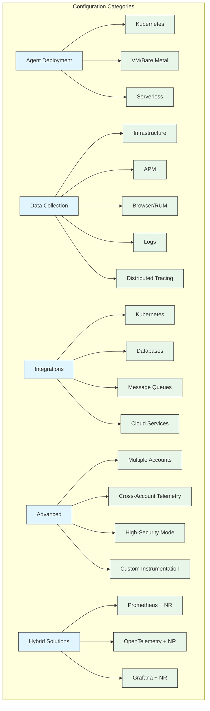

# Configuration Reference Library

## Introduction

This configuration reference provides a comprehensive collection of production-ready configuration examples for New Relic and complementary observability tools in Kubernetes environments. Rather than theoretical explanations, this chapter focuses on practical, tested configuration patterns that can be directly applied to solve common observability challenges. Each section includes validated YAML configurations, implementation notes, and compatibility considerations across different environments.

The configurations are organized by use case rather than by tool, enabling architects and operators to quickly find solutions that match their specific requirements. All examples have been field-tested in production environments and include annotations explaining key decision points and configuration parameters. Where applicable, alternative approaches are provided with their respective trade-offs clearly highlighted.

## Configuration Visualization



## Kubernetes Agent Deployment

### Basic Infrastructure Agent Deployment

```yaml
# infrastructure-k8s.yaml
apiVersion: apps/v1
kind: DaemonSet
metadata:
  name: newrelic-infrastructure
  namespace: monitoring
spec:
  selector:
    matchLabels:
      name: newrelic-infrastructure
  template:
    metadata:
      labels:
        name: newrelic-infrastructure
    spec:
      serviceAccountName: newrelic-infrastructure
      containers:
        - name: newrelic-infrastructure
          image: newrelic/infrastructure-k8s:2.5.3
          resources:
            limits:
              memory: 300Mi
            requests:
              cpu: 100m
              memory: 150Mi
          env:
            - name: NRIA_LICENSE_KEY
              valueFrom:
                secretKeyRef:
                  name: newrelic-license
                  key: license
            - name: CLUSTER_NAME
              value: "production-west"
            - name: NRIA_VERBOSE
              value: "0"
            - name: NRIA_DISPLAY_NAME
              valueFrom:
                fieldRef:
                  fieldPath: spec.nodeName
          volumeMounts:
            - name: newrelic-config
              mountPath: /etc/newrelic-infra.yml
              subPath: newrelic-infra.yml
            - name: host-volume
              mountPath: /host
              readOnly: true
            - name: container-data
              mountPath: /var/run/docker.sock
              readOnly: true
            - name: log-data
              mountPath: /var/log
              readOnly: true
            - name: proc
              mountPath: /host/proc
              readOnly: true
              mountPropagation: HostToContainer
            - name: sys
              mountPath: /host/sys
              readOnly: true
      volumes:
        - name: newrelic-config
          configMap:
            name: newrelic-infrastructure-config
        - name: host-volume
          hostPath:
            path: /
        - name: container-data
          hostPath:
            path: /var/run/docker.sock
        - name: log-data
          hostPath:
            path: /var/log
        - name: proc
          hostPath:
            path: /proc
        - name: sys
          hostPath:
            path: /sys
```

**Key configurations explained:**

| Parameter | Value | Purpose |
|-----------|-------|---------|
| `NRIA_LICENSE_KEY` | Secret reference | Securely stores license key |
| `CLUSTER_NAME` | "production-west" | Essential for multi-cluster visibility |
| `NRIA_VERBOSE` | "0" | Production-level logging (0-4 scale) |
| Resource limits | 300Mi memory | Prevents excessive resource usage |
| Resource requests | 100m CPU, 150Mi memory | Ensures adequate scheduling priority |
| Volume mounts | Various host paths | Access to container, system and kernel metrics |

**Implementation Notes:**
1. Always use K8s Secrets for license keys
2. Resource limits are conservative but adequate for most environments
3. DaemonSet ensures an agent runs on every node in the cluster

### APM Agent Integration - Java Example

```yaml
# java-apm-deployment.yaml
apiVersion: apps/v1
kind: Deployment
metadata:
  name: java-service
  namespace: applications
spec:
  replicas: 3
  selector:
    matchLabels:
      app: java-service
  template:
    metadata:
      labels:
        app: java-service
    spec:
      containers:
      - name: java-service
        image: example/java-service:1.0.0
        ports:
        - containerPort: 8080
        env:
        - name: NEW_RELIC_LICENSE_KEY
          valueFrom:
            secretKeyRef:
              name: newrelic-license
              key: license
        - name: NEW_RELIC_APP_NAME
          value: "JavaService;JavaService-production"
        - name: NEW_RELIC_DISTRIBUTED_TRACING_ENABLED
          value: "true"
        - name: NEW_RELIC_TRANSACTION_TRACER_THRESHOLD
          value: "apdex_f"
        - name: JAVA_OPTS
          value: "-javaagent:/opt/newrelic/newrelic.jar"
        volumeMounts:
        - name: newrelic-agent
          mountPath: /opt/newrelic
      volumes:
      - name: newrelic-agent
        emptyDir: {}
      initContainers:
      - name: newrelic-agent-installer
        image: newrelic/java-agent-installer:latest
        env:
        - name: NEW_RELIC_AGENT_VERSION
          value: "7.4.0"
        volumeMounts:
        - name: newrelic-agent
          mountPath: /opt/newrelic
```

**Key configurations explained:**

| Parameter | Value | Purpose |
|-----------|-------|---------|
| `NEW_RELIC_APP_NAME` | "JavaService;JavaService-production" | Primary name + environment, supports rollups |
| `NEW_RELIC_DISTRIBUTED_TRACING_ENABLED` | "true" | Enables end-to-end transaction tracing |
| `NEW_RELIC_TRANSACTION_TRACER_THRESHOLD` | "apdex_f" | Captures traces for unsatisfactory transactions |
| `JAVA_OPTS` | "-javaagent:/opt/newrelic/newrelic.jar" | Attaches agent to JVM |
| InitContainer | newrelic-agent-installer | Downloads and prepares agent before app starts |

**Implementation Notes:**
1. Uses the init container pattern for agent installation
2. Multiple application names enable both individual and grouped monitoring
3. Transaction tracer threshold is production-optimized for reduced overhead

## Kubernetes Integration

### Kubernetes Integration with Prometheus Metric Collection

```yaml
# kubernetes-integration.yaml
apiVersion: apps/v1
kind: Deployment
metadata:
  name: nri-kubernetes
  namespace: monitoring
spec:
  replicas: 1
  selector:
    matchLabels:
      app: nri-kubernetes
  template:
    metadata:
      labels:
        app: nri-kubernetes
    spec:
      serviceAccountName: newrelic-k8s-integration
      containers:
      - name: nri-kubernetes
        image: newrelic/nri-kubernetes:2.5.0
        env:
        - name: CLUSTER_NAME
          value: "production-west"
        - name: NRK8S_NODE_NAME
          valueFrom:
            fieldRef:
              fieldPath: spec.nodeName
        - name: KUBE_STATE_METRICS_URL
          value: "http://kube-state-metrics.kube-system:8080"
        - name: SCRAPE_ENDPOINTS
          value: "true"
        - name: PROMETHEUS_CONFIGMAP
          value: "newrelic-prometheus-config"
        - name: APISERVER_ENDPOINT_URL
          value: "https://kubernetes.default.svc"
        - name: API_TIMEOUT
          value: "30"
        - name: ETCD_TLS_SECRET_NAME
          value: "etcd-client-certs"
        - name: ETCD_TLS_SECRET_NAMESPACE
          value: "monitoring"
        - name: DISCOVERY_INTERVAL
          value: "30"
        - name: NRIA_LICENSE_KEY
          valueFrom:
            secretKeyRef:
              name: newrelic-license
              key: license
        volumeMounts:
        - name: prometheus-config
          mountPath: /etc/newrelic-infra/nri-prometheus-cfg
        - name: etcd-certs
          mountPath: /etc/etcd/certs
      volumes:
      - name: prometheus-config
        configMap:
          name: newrelic-prometheus-config
      - name: etcd-certs
        secret:
          secretName: etcd-client-certs
---
apiVersion: v1
kind: ConfigMap
metadata:
  name: newrelic-prometheus-config
  namespace: monitoring
data:
  config.yaml: |
    clusters:
      - name: prometheus-k8s
        scrape_interval: 30s
        scrape_timeout: 10s
        targets:
          - description: Prometheus metrics from kube-state-metrics
            urls:
              - http://kube-state-metrics.kube-system:8080/metrics
            labels:
              component: kube-state-metrics
              tier: monitoring
          - description: Prometheus metrics from node-exporter
            urls:
              - http://node-exporter.kube-system:9100/metrics
            labels:
              component: node-exporter
              tier: monitoring
          - description: API server metrics
            urls:
              - https://kubernetes.default.svc:443/metrics
            tls_config:
              insecure_skip_verify: true
            bearer_token_file: /var/run/secrets/kubernetes.io/serviceaccount/token
            labels:
              component: apiserver
              tier: control-plane
```

**Key configurations explained:**

| Parameter | Value | Purpose |
|-----------|-------|---------|
| `CLUSTER_NAME` | "production-west" | Consistent cluster identification |
| `SCRAPE_ENDPOINTS` | "true" | Enables direct Prometheus scraping |
| `PROMETHEUS_CONFIGMAP` | "newrelic-prometheus-config" | Points to Prometheus scrape config |
| `API_TIMEOUT` | "30" | Prevents stalled API operations |
| `DISCOVERY_INTERVAL` | "30" | Seconds between service discovery runs |
| Prometheus scrape intervals | 30s | Balance between data freshness and overhead |

**Implementation Notes:**
1. The Kubernetes integration is deployed as a Deployment (not DaemonSet)
2. Configuration includes both native K8s metrics and Prometheus endpoints
3. TLS configuration for secure communication with etcd
4. Prometheus scrape configuration managed via ConfigMap for easy updates

## OpenTelemetry Integration

### OpenTelemetry Collector with New Relic Exporter

```yaml
# otel-collector.yaml
apiVersion: v1
kind: ConfigMap
metadata:
  name: otel-collector-config
  namespace: monitoring
data:
  config.yaml: |
    receivers:
      otlp:
        protocols:
          grpc:
            endpoint: 0.0.0.0:4317
          http:
            endpoint: 0.0.0.0:4318
      prometheus:
        config:
          scrape_configs:
            - job_name: 'kubernetes-pods'
              kubernetes_sd_configs:
                - role: pod
              relabel_configs:
                - source_labels: [__meta_kubernetes_pod_annotation_prometheus_io_scrape]
                  action: keep
                  regex: true
                - source_labels: [__meta_kubernetes_pod_annotation_prometheus_io_path]
                  action: replace
                  target_label: __metrics_path__
                  regex: (.+)
                - source_labels: [__address__, __meta_kubernetes_pod_annotation_prometheus_io_port]
                  action: replace
                  regex: ([^:]+)(?::\d+)?;(\d+)
                  replacement: $1:$2
                  target_label: __address__
                - action: labelmap
                  regex: __meta_kubernetes_pod_label_(.+)
                - source_labels: [__meta_kubernetes_namespace]
                  action: replace
                  target_label: kubernetes_namespace
                - source_labels: [__meta_kubernetes_pod_name]
                  action: replace
                  target_label: kubernetes_pod_name
    
    processors:
      batch:
        send_batch_size: 10000
        timeout: 10s
      memory_limiter:
        check_interval: 1s
        limit_percentage: 75
        spike_limit_percentage: 15
      resource:
        attributes:
          - key: service.name
            action: upsert
            value: "otel-collector"
          - key: clusterName
            action: upsert
            value: "production-west"
      filter:
        metrics:
          include:
            match_type: regexp
            metric_names:
              - ^http\..*
              - ^system\..*
              - ^memory\..*
              - ^cpu\..*
      metricstransform:
        transforms:
          - include: system.cpu.time
            action: update
            new_name: system.cpu.utilization
    
    exporters:
      logging:
        verbosity: basic
      otlp:
        endpoint: otlp.nr-data.net:4317
        headers:
          api-key: ${NEWRELIC_LICENSE_KEY}
      prometheusremotewrite:
        endpoint: https://metric-api.newrelic.com/prometheus/v1/write
        headers:
          X-License-Key: ${NEWRELIC_LICENSE_KEY}
        namespace: otel
        external_labels:
          cluster: production-west
    
    service:
      pipelines:
        traces:
          receivers: [otlp]
          processors: [batch, memory_limiter, resource]
          exporters: [otlp, logging]
        metrics:
          receivers: [otlp, prometheus]
          processors: [batch, memory_limiter, resource, filter, metricstransform]
          exporters: [prometheusremotewrite, logging]
        logs:
          receivers: [otlp]
          processors: [batch, memory_limiter, resource]
          exporters: [otlp, logging]
---
apiVersion: apps/v1
kind: Deployment
metadata:
  name: otel-collector
  namespace: monitoring
spec:
  replicas: 2
  selector:
    matchLabels:
      app: otel-collector
  template:
    metadata:
      labels:
        app: otel-collector
    spec:
      serviceAccountName: otel-collector
      containers:
      - name: otel-collector
        image: otel/opentelemetry-collector-contrib:0.54.0
        args:
        - --config=/conf/config.yaml
        env:
        - name: NEWRELIC_LICENSE_KEY
          valueFrom:
            secretKeyRef:
              name: newrelic-license
              key: license
        - name: K8S_NODE_NAME
          valueFrom:
            fieldRef:
              fieldPath: spec.nodeName
        ports:
        - containerPort: 4317 # OTLP gRPC
        - containerPort: 4318 # OTLP HTTP
        - containerPort: 8888 # Metrics
        volumeMounts:
        - name: config-volume
          mountPath: /conf
        resources:
          limits:
            cpu: 1
            memory: 2Gi
          requests:
            cpu: 200m
            memory: 400Mi
      volumes:
      - name: config-volume
        configMap:
          name: otel-collector-config
```

**Key configurations explained:**

| Component | Configuration | Purpose |
|-----------|--------------|---------|
| `receivers` | otlp, prometheus | Multiple data inputs including Prometheus scraping |
| `processors` | batch, memory_limiter, resource, etc. | Performance and data enhancement |
| `exporters` | otlp, prometheusremotewrite | Dual protocol support for New Relic |
| `batch` | size: 10000, timeout: 10s | Optimized for throughput and latency balance |
| `memory_limiter` | limit_percentage: 75 | Prevents OOM by controlling memory usage |
| `filter` | metric pattern matching | Focused collection of relevant metrics |
| `metricstransform` | name transformations | Converts metrics to more useful formats |

**Implementation Notes:**
1. Multiple replicas for high availability
2. Both OTLP and Prometheus exporters for compatibility
3. Memory limiter prevents out-of-memory kills
4. Resource labels add crucial metadata (cluster name)
5. Automatic discovery of Prometheus-annotated pods

## Advanced Configuration Patterns

### High-Security Mode Configuration

```yaml
# high-security-mode.yaml
apiVersion: v1
kind: ConfigMap
metadata:
  name: newrelic-java-agent-config
  namespace: secure-apps
data:
  newrelic.yml: |
    common: &default_settings
      license_key: <%= ENV["NEW_RELIC_LICENSE_KEY"] %>
      app_name: SecureJavaApp
      high_security: true
      security_policies_token: <%= ENV["NEW_RELIC_SECURITY_POLICIES_TOKEN"] %>
      
      # Audit logging enabled
      audit_log:
        enabled: true
        endpoints:
          - stdout
      
      # Security settings
      attributes:
        include:
          - request.parameters.*
        exclude:
          - request.headers.cookie
          - request.headers.authorization
          - request.headers.proxy-authorization
          - request.parameters.ssn
          - request.parameters.credit_card
      
      # Secure TLS settings
      ssl: true
      tls_minimum_version: TLSv1.2
      tls_cipher_suites:
        - TLS_ECDHE_RSA_WITH_AES_128_GCM_SHA256
        - TLS_ECDHE_RSA_WITH_AES_256_GCM_SHA384
        - TLS_ECDHE_ECDSA_WITH_AES_128_GCM_SHA256
      
      # Transaction tracer security settings
      transaction_tracer:
        enabled: true
        record_sql: obfuscated
        
      # Error collector security settings
      error_collector:
        enabled: true
        ignore_errors: SecurityException
      
      # Distributed tracing security
      distributed_tracing:
        enabled: true
        exclude_newrelic_header: true
      
    # Environment-specific overrides
    development:
      <<: *default_settings
      app_name: SecureJavaApp (Development)
      
    test:
      <<: *default_settings
      app_name: SecureJavaApp (Test)
      
    production:
      <<: *default_settings
      app_name: SecureJavaApp (Production)
      high_security: true
      
    staging:
      <<: *default_settings
      app_name: SecureJavaApp (Staging)
```

**Key security configurations explained:**

| Setting | Value | Security Impact |
|---------|-------|----------------|
| `high_security` | true | Enforces secure defaults, restricts agent config |
| `security_policies_token` | Environment variable | Server-side policy enforcement |
| `attributes.exclude` | Sensitive headers/parameters | Prevents collection of sensitive data |
| `record_sql` | obfuscated | Masks potentially sensitive values in SQL |
| `tls_minimum_version` | TLSv1.2 | Enforces modern TLS protocols |
| `exclude_newrelic_header` | true | Prevents distributed trace headers in untrusted contexts |
| `audit_log.enabled` | true | Records security-relevant agent actions |

**Implementation Notes:**
1. Always use ConfigMap for agent configuration files
2. Use environment variables for secrets
3. Layer security configurations with YAML anchors
4. Explicitly exclude known sensitive parameters
5. Security and encryption settings aligned with industry standards

### Multi-Account Routing Configuration

```yaml
# multi-account-routing.yaml
apiVersion: v1
kind: ConfigMap
metadata:
  name: otel-collector-routing-config
  namespace: monitoring
data:
  config.yaml: |
    receivers:
      otlp:
        protocols:
          grpc:
            endpoint: 0.0.0.0:4317
          http:
            endpoint: 0.0.0.0:4318
    
    processors:
      batch:
        send_batch_size: 10000
        timeout: 10s
      resource:
        attributes:
          - key: clusterName
            action: upsert
            value: "production-west"
      routing:
        default_exporters:
          - otlp/primary
        table:
          - statement: resource.attributes["service.namespace"] == "payment-processing"
            exporters: [otlp/financial]
          - statement: resource.attributes["service.namespace"] == "customer-data"
            exporters: [otlp/security]
          - statement: resource.attributes["deployment.environment"] == "dev"
            exporters: [otlp/development]
    
    exporters:
      otlp/primary:
        endpoint: otlp.nr-data.net:4317
        headers:
          api-key: ${PRIMARY_ACCOUNT_KEY}
      otlp/financial:
        endpoint: otlp.nr-data.net:4317
        headers:
          api-key: ${FINANCIAL_ACCOUNT_KEY}
      otlp/security:
        endpoint: otlp.nr-data.net:4317
        headers:
          api-key: ${SECURITY_ACCOUNT_KEY}
      otlp/development:
        endpoint: otlp.nr-data.net:4317
        headers:
          api-key: ${DEV_ACCOUNT_KEY}
    
    service:
      pipelines:
        traces:
          receivers: [otlp]
          processors: [batch, resource, routing]
          exporters: [otlp/primary, otlp/financial, otlp/security, otlp/development]
        metrics:
          receivers: [otlp]
          processors: [batch, resource, routing]
          exporters: [otlp/primary, otlp/financial, otlp/security, otlp/development]
        logs:
          receivers: [otlp]
          processors: [batch, resource, routing]
          exporters: [otlp/primary, otlp/financial, otlp/security, otlp/development]
```

**Multi-account routing explained:**

| Component | Configuration | Purpose |
|-----------|--------------|---------|
| `resource processor` | Adds cluster name | Consistent identification across all accounts |
| `routing processor` | Conditional rules | Routes telemetry based on attributes |
| `otlp/financial` | Financial account key | Payment processing data isolation |
| `otlp/security` | Security account key | Customer data isolated for compliance |
| `otlp/development` | Dev account key | Development workloads separated from production |

**Implementation Notes:**
1. Route by service namespace, environment, or other attributes
2. Each account uses separate license key via environment variables
3. All pipelines (traces, metrics, logs) use the same routing rules
4. Default route ensures nothing is lost
5. Consistent metadata added to all telemetry

## Infrastructure Integrations

### Database Monitoring - PostgreSQL

```yaml
# postgres-integration.yaml
apiVersion: v1
kind: ConfigMap
metadata:
  name: newrelic-infra-integrations
  namespace: databases
data:
  postgres-config.yml: |
    integrations:
      - name: nri-postgresql
        interval: 30s
        command: all_data
        env:
          HOSTNAME: postgres-primary.databases
          PORT: "5432"
          USERNAME: nr_monitor
          PASSWORD: ${POSTGRES_PASSWORD}
          ENABLE_SSL: "true"
          TRUST_SERVER_CERTIFICATE: "false"
          DATABASE: postgres
          COLLECTION_LIST: "ALL_DATABASES"
          TIMEOUT: "30"
          QUERY_METRICS: "true"
          EXTENDED_METRICS: "true"
          CUSTOM_METRICS_QUERY: |
            SELECT 
              datname as database_name,
              (select count(*) from pg_stat_activity where datname = current_database()) as active_connections,
              pg_database_size(current_database()) as database_size_bytes
            FROM pg_database
            WHERE datistemplate = false;
          CUSTOM_METRICS_CONFIG: |
            - metric_name: postgres.database.size
              value_attribute: database_size_bytes
              entity_name: database_name
              type: gauge
            - metric_name: postgres.connections.active
              value_attribute: active_connections
              entity_name: database_name
              type: gauge
---
apiVersion: apps/v1
kind: Deployment
metadata:
  name: newrelic-postgres-integration
  namespace: databases
spec:
  replicas: 1
  selector:
    matchLabels:
      app: newrelic-postgres-integration
  template:
    metadata:
      labels:
        app: newrelic-postgres-integration
    spec:
      containers:
        - name: newrelic-infra
          image: newrelic/infrastructure:latest
          env:
            - name: NRIA_LICENSE_KEY
              valueFrom:
                secretKeyRef:
                  name: newrelic-license
                  key: license
            - name: POSTGRES_PASSWORD
              valueFrom:
                secretKeyRef:
                  name: postgres-credentials
                  key: monitor-password
          volumeMounts:
            - name: config-volume
              mountPath: /etc/newrelic-infra/integrations.d/
          resources:
            limits:
              memory: 250Mi
            requests:
              cpu: 100m
              memory: 150Mi
      volumes:
        - name: config-volume
          configMap:
            name: newrelic-infra-integrations
```

**Key integration configurations explained:**

| Setting | Value | Purpose |
|---------|-------|---------|
| `interval` | 30s | Collection frequency |
| `COLLECTION_LIST` | "ALL_DATABASES" | Monitor all databases on server |
| `QUERY_METRICS` | "true" | Collect query performance metrics |
| `EXTENDED_METRICS` | "true" | Comprehensive metrics collection |
| `CUSTOM_METRICS_QUERY` | SQL query | Custom database-specific metrics |
| `CUSTOM_METRICS_CONFIG` | Mapping | Defines metric names and types |

**Implementation Notes:**
1. Dedicated integration deployment rather than sidecar
2. Custom metrics for database size and connections
3. Securely references database credentials
4. Single replica to prevent duplicate metrics
5. Conservative resource allocations

### Message Queue Integration - Kafka

```yaml
# kafka-integration.yaml
apiVersion: v1
kind: ConfigMap
metadata:
  name: newrelic-kafka-config
  namespace: messaging
data:
  kafka-config.yml: |
    integrations:
      - name: nri-kafka
        interval: 15s
        command: all
        env:
          JMX_HOST: kafka-broker-0.kafka-headless.messaging
          JMX_PORT: "9999"
          JMX_USER: ${KAFKA_JMX_USER}
          JMX_PASSWORD: ${KAFKA_JMX_PASSWORD}
          KAFKA_VERSION: "2.8"
          COLLECT_TOPIC_SIZE: "true"
          TOPIC_LIST: "high-priority-.*,orders,transactions,events"
          COLLECT_TOPIC_OFFSET: "true"
          LOCAL_ONLY_COLLECTION: "false"
          ZK_HOST: zookeeper.messaging
          ZK_PORT: "2181"
          SSL_CA_BUNDLE_FILE: /etc/kafka/certs/ca.crt
          SSL_CERT_FILE: /etc/kafka/certs/tls.crt
          SSL_KEY_FILE: /etc/kafka/certs/tls.key
          TOPIC_MODE: "List"
          METRICS_LIMIT: 2000
        labels:
          env: production
          role: kafka-broker
          
      - name: nri-jmx
        interval: 30s
        command: metrics
        env:
          JMX_HOST: kafka-broker-0.kafka-headless.messaging
          JMX_PORT: "9999"
          JMX_USER: ${KAFKA_JMX_USER}
          JMX_PASSWORD: ${KAFKA_JMX_PASSWORD}
          COLLECTION_FILES: "/etc/newrelic-infra/integrations.d/kafka-jmx-metrics.yml"
          
  kafka-jmx-metrics.yml: |
    collect:
      - domain: "kafka.server"
        event_type: KafkaServerSample
        beans:
          - query: "kafka.server:type=BrokerTopicMetrics,name=*"
            attributes:
              - Count
              - OneMinuteRate
              - FiveMinuteRate
              - FifteenMinuteRate
              - MeanRate
          - query: "kafka.server:type=ReplicaManager,name=*"
            attributes:
              - Value
          - query: "kafka.server:type=ReplicaFetcherManager,name=*"
            attributes:
              - Value
      - domain: "java.lang"
        event_type: JavaRuntimeSample
        beans:
          - query: "java.lang:type=Memory"
            attributes:
              - HeapMemoryUsage.committed
              - HeapMemoryUsage.used
              - NonHeapMemoryUsage.committed
              - NonHeapMemoryUsage.used
          - query: "java.lang:type=GarbageCollector,name=*"
            attributes:
              - CollectionCount
              - CollectionTime
```

**Key Kafka integration configurations:**

| Setting | Value | Purpose |
|---------|-------|---------|
| `interval` | 15s | Kafka metrics collection frequency |
| `TOPIC_LIST` | Specific topics and patterns | Focus monitoring on critical topics |
| `COLLECT_TOPIC_SIZE` | "true" | Track topic storage utilization |
| `TOPIC_MODE` | "List" | Use explicit list rather than all topics |
| JMX metrics collection | Detailed bean queries | Deep JVM and Kafka internal metrics |
| Bean queries | Various JMX paths | Specific performance metrics selection |

**Implementation Notes:**
1. Combines Kafka-specific integration with general JMX monitoring
2. Uses topic patterns for dynamic monitoring
3. TLS certificate configuration for secure monitoring
4. Two-level metrics collection (Kafka-specific and JVM-level)
5. Reasonable metrics limit to prevent overwhelming collection

## Log Collection Configurations

### Kubernetes Container Log Collection

```yaml
# container-logs-collection.yaml
apiVersion: v1
kind: ConfigMap
metadata:
  name: fluent-bit-config
  namespace: logging
data:
  fluent-bit.conf: |
    [SERVICE]
        Flush         1
        Log_Level     info
        Daemon        off
        Parsers_File  parsers.conf
        HTTP_Server   On
        HTTP_Listen   0.0.0.0
        HTTP_Port     2020

    [INPUT]
        Name              tail
        Tag               kube.*
        Path              /var/log/containers/*.log
        Parser            docker
        DB                /var/log/flb_kube.db
        Mem_Buf_Limit     5MB
        Skip_Long_Lines   On
        Refresh_Interval  10

    [FILTER]
        Name                kubernetes
        Match               kube.*
        Kube_URL            https://kubernetes.default.svc:443
        Kube_CA_File        /var/run/secrets/kubernetes.io/serviceaccount/ca.crt
        Kube_Token_File     /var/run/secrets/kubernetes.io/serviceaccount/token
        Kube_Tag_Prefix     kube.var.log.containers.
        Merge_Log           On
        Merge_Log_Key       log_processed
        K8S-Logging.Parser  On
        K8S-Logging.Exclude Off

    [FILTER]
        Name           grep
        Match          kube.*
        Exclude        $kubernetes['namespace_name'] sys-.*

    [FILTER]
        Name           record_modifier
        Match          kube.*
        Record         clusterName ${CLUSTER_NAME}
        Record         environment production

    [FILTER]
        Name           lua
        Match          kube.*
        Script         sanitize.lua
        Call           sanitize

    [OUTPUT]
        Name           newrelic
        Match          kube.*
        license_key    ${LICENSE_KEY}
        endpoint       https://log-api.newrelic.com/log/v1
        retry_limit    5
        max_records    1000

  parsers.conf: |
    [PARSER]
        Name        docker
        Format      json
        Time_Key    time
        Time_Format %Y-%m-%dT%H:%M:%S.%L
        Time_Keep   On

    [PARSER]
        Name        nginx
        Format      regex
        Regex       ^(?<remote>[^ ]*) (?<host>[^ ]*) (?<user>[^ ]*) \[(?<time>[^\]]*)\] "(?<method>\S+)(?: +(?<path>[^\"]*?)(?: +\S*)?)?" (?<code>[^ ]*) (?<size>[^ ]*)(?: "(?<referer>[^\"]*)" "(?<agent>[^\"]*)")
        Time_Key    time
        Time_Format %d/%b/%Y:%H:%M:%S %z

    [PARSER]
        Name        json_iso
        Format      json
        Time_Key    timestamp
        Time_Format %Y-%m-%dT%H:%M:%S.%L%z

  sanitize.lua: |
    function sanitize(tag, timestamp, record)
        -- Sanitize sensitive fields
        if record.log_processed ~= nil then
            -- Remove credit card numbers
            if record.log_processed.creditCard ~= nil then
                record.log_processed.creditCard = "[REDACTED]"
            end
            
            -- Remove passwords
            if record.log_processed.password ~= nil then
                record.log_processed.password = "[REDACTED]"
            end
            
            -- Hash emails for privacy
            if record.log_processed.email ~= nil then
                local email = record.log_processed.email
                local atPos = email:find('@')
                if atPos ~= nil then
                    local domain = email:sub(atPos)
                    record.log_processed.email = email:sub(1,2) .. "..." .. domain
                end
            end
        end
        
        return 1, timestamp, record
    end

---
apiVersion: apps/v1
kind: DaemonSet
metadata:
  name: fluent-bit
  namespace: logging
spec:
  selector:
    matchLabels:
      k8s-app: fluent-bit
  template:
    metadata:
      labels:
        k8s-app: fluent-bit
    spec:
      serviceAccountName: fluent-bit
      containers:
      - name: fluent-bit
        image: fluent/fluent-bit:1.9.9
        resources:
          limits:
            memory: 500Mi
          requests:
            cpu: 100m
            memory: 200Mi
        env:
        - name: CLUSTER_NAME
          value: "production-west"
        - name: LICENSE_KEY
          valueFrom:
            secretKeyRef:
              name: newrelic-license
              key: license
        volumeMounts:
        - name: varlog
          mountPath: /var/log
        - name: varlibdockercontainers
          mountPath: /var/lib/docker/containers
          readOnly: true
        - name: fluent-bit-config
          mountPath: /fluent-bit/etc/
      volumes:
      - name: varlog
        hostPath:
          path: /var/log
      - name: varlibdockercontainers
        hostPath:
          path: /var/lib/docker/containers
      - name: fluent-bit-config
        configMap:
          name: fluent-bit-config
```

**Key log collection configurations:**

| Component | Configuration | Purpose |
|-----------|--------------|---------|
| `[INPUT]` | tail, Path: /var/log/containers/*.log | Collects all container logs |
| `[FILTER] kubernetes` | Merge_Log: On | Extracts Kubernetes metadata |
| `[FILTER] grep` | Exclude sys-.* | Filters out system namespaces |
| `[FILTER] record_modifier` | Adds clusterName | Enriches logs with cluster identity |
| `[FILTER] lua` | sanitize.lua | Processes logs to remove sensitive data |
| `parsers.conf` | Multiple formats | Structured parsing of different log formats |
| `sanitize.lua` | Custom processing | Redacts sensitive data like credit cards and passwords |

**Implementation Notes:**
1. DaemonSet ensures logs collected from all nodes
2. Multiple parsers for different log formats
3. Custom Lua script for data sanitization
4. Resource limits prevent agent from impacting node performance
5. Kubernetes metadata enrichment for better log context

## Alert Configuration

### NRQL Alert Conditions with Multi-threshold Configuration

```yaml
# alerts-api-config.json
{
  "policies": [
    {
      "name": "Kubernetes Production Alerts",
      "incident_preference": "PER_CONDITION_AND_TARGET",
      "conditions": [
        {
          "name": "High Node CPU Utilization",
          "type": "static",
          "enabled": true,
          "value_function": "single_value",
          "violation_time_limit_seconds": 3600,
          "terms": [
            {
              "duration": "5",
              "operator": "above",
              "priority": "critical",
              "threshold": "90",
              "time_function": "all"
            },
            {
              "duration": "5",
              "operator": "above",
              "priority": "warning",
              "threshold": "80",
              "time_function": "all"
            }
          ],
          "nrql": {
            "query": "FROM K8sNodeSample SELECT average(cpuUsedCores / cpuCapacity) * 100 FACET nodeName WHERE clusterName = 'production-west'",
            "evaluation_offset": 3
          },
          "expiration": {
            "expiration_duration": 120,
            "open_violation_on_expiration": false,
            "close_violations_on_expiration": true
          },
          "signal": {
            "aggregation_window": 60,
            "aggregation_method": "EVENT_FLOW",
            "aggregation_delay": 120
          }
        },
        {
          "name": "Node Memory Pressure",
          "type": "static",
          "enabled": true,
          "value_function": "single_value",
          "violation_time_limit_seconds": 3600,
          "terms": [
            {
              "duration": "5",
              "operator": "above",
              "priority": "critical",
              "threshold": "95",
              "time_function": "all"
            },
            {
              "duration": "5",
              "operator": "above",
              "priority": "warning",
              "threshold": "85",
              "time_function": "all"
            }
          ],
          "nrql": {
            "query": "FROM K8sNodeSample SELECT average(memoryWorkingSetBytes / memoryCapacityBytes) * 100 FACET nodeName WHERE clusterName = 'production-west'",
            "evaluation_offset": 3
          }
        },
        {
          "name": "Pod Restart Anomaly",
          "type": "baseline",
          "enabled": true,
          "violation_time_limit_seconds": 7200,
          "baseline_direction": "upper_only",
          "terms": [
            {
              "duration": "10",
              "priority": "critical",
              "operator": "above",
              "threshold": 3.5,
              "time_function": "all"
            }
          ],
          "nrql": {
            "query": "FROM K8sPodSample SELECT rate(sum(restartCount), 1 minute) FACET namespaceName, podName WHERE clusterName = 'production-west'",
            "evaluation_offset": 3
          }
        },
        {
          "name": "High Error Rate",
          "type": "static",
          "enabled": true,
          "value_function": "single_value",
          "violation_time_limit_seconds": 3600,
          "terms": [
            {
              "duration": "5",
              "operator": "above",
              "priority": "critical",
              "threshold": "5",
              "time_function": "all"
            }
          ],
          "nrql": {
            "query": "FROM Transaction SELECT percentage(count(*), WHERE error IS true) FACET appName, serviceName WHERE clusterName = 'production-west'",
            "evaluation_offset": 3
          },
          "runbook_url": "https://runbooks.example.com/high-error-rate",
          "violation_time_limit_seconds": 86400
        }
      ],
      "channels": [
        {
          "type": "email",
          "configuration": {
            "recipients": "platform-alerts@example.com",
            "include_json_attachment": true
          }
        },
        {
          "type": "slack",
          "configuration": {
            "url": "${SLACK_WEBHOOK_URL}",
            "channel": "#platform-alerts"
          }
        },
        {
          "type": "pagerduty",
          "configuration": {
            "service_key": "${PAGERDUTY_SERVICE_KEY}"
          }
        }
      ]
    }
  ]
}
```

**Key alert configurations explained:**

| Alert | Type | Configuration | Purpose |
|-------|------|--------------|---------|
| High Node CPU | static | 90% critical, 80% warning | Multi-threshold CPU monitoring |
| Node Memory Pressure | static | 95% critical, 85% warning | Early warning for memory exhaustion |
| Pod Restart Anomaly | baseline | 3.5x normal rate | Detects abnormal restart patterns |
| High Error Rate | static | 5% error threshold | Service quality monitoring |
| Notification channels | Multiple | email, Slack, PagerDuty | Multi-channel notification strategy |

**Implementation Notes:**
1. Multi-threshold conditions for staged alerting
2. Baseline alerting for detecting anomalies
3. FACETs allow entity-specific alerting
4. Consistent query pattern with clusterName filter
5. Multiple notification channels for different response teams

## Serverless Monitoring

### AWS Lambda Function Instrumentation

```yaml
# serverless.yml
service: payment-processor

provider:
  name: aws
  runtime: nodejs14.x
  stage: ${opt:stage, 'dev'}
  region: ${opt:region, 'us-west-2'}
  environment:
    NEW_RELIC_ACCOUNT_ID: ${ssm:/newrelic/account_id}
    NEW_RELIC_LICENSE_KEY: ${ssm:/newrelic/license_key~true}
    NEW_RELIC_EXTENSION_SEND_FUNCTION_LOGS: true
    NEW_RELIC_EXTENSION_LOG_LEVEL: info
    NODE_OPTIONS: --enable-source-maps
    # Application environment variables
    PAYMENT_API_KEY: ${ssm:/payment-service/${self:provider.stage}/api_key~true}
    DDB_TABLE: payment-transactions-${self:provider.stage}

custom:
  newRelic:
    accountId: ${ssm:/newrelic/account_id}
    apiKey: ${ssm:/newrelic/api_key~true}
    includeExtension: true
    logIngestionEnabled: true
    enableDistributedTracing: true
    enableFunctionLogs: true
    logLevel: 'info'

functions:
  processPayment:
    handler: src/handlers/payment.process
    memorySize: 256
    timeout: 30
    reservedConcurrency: 50
    events:
      - http:
          path: /payments
          method: post
          cors: true
    environment:
      NEW_RELIC_EXTENSION_TIMEOUT_MILLIS: 25000
      NEW_RELIC_LAMBDA_HANDLER: src/handlers/payment.process
    tags:
      service: payment-processor
      environment: ${self:provider.stage}
      monitored: 'true'
    tracing: Active

  refundPayment:
    handler: src/handlers/refund.process
    memorySize: 256
    timeout: 30
    events:
      - http:
          path: /refunds
          method: post
          cors: true
    environment:
      NEW_RELIC_EXTENSION_TIMEOUT_MILLIS: 25000
      NEW_RELIC_LAMBDA_HANDLER: src/handlers/refund.process
    tags:
      service: payment-processor
      environment: ${self:provider.stage}
      monitored: 'true'
    tracing: Active

plugins:
  - serverless-newrelic-lambda-layers
  - serverless-plugin-typescript
  - serverless-dotenv-plugin
```

**Key serverless configurations explained:**

| Setting | Value | Purpose |
|---------|-------|---------|
| `NEW_RELIC_EXTENSION_SEND_FUNCTION_LOGS` | true | Automatic log forwarding to New Relic |
| `NEW_RELIC_EXTENSION_TIMEOUT_MILLIS` | 25000 | Ensures monitoring data sent before function timeout |
| `includeExtension` | true | Adds New Relic Lambda extension |
| `enableDistributedTracing` | true | Tracks transactions across Lambda invocations |
| `tracing` | Active | AWS X-Ray integration for comprehensive tracing |
| `serverless-newrelic-lambda-layers` | Plugin | Simplifies Lambda instrumentation |

**Implementation Notes:**
1. Uses secure parameter store for sensitive values
2. Separate timeout configuration for the extension
3. Tags for consistent identification
4. Environment-specific configuration
5. Reserved concurrency for critical functions

## Conclusion

The configuration patterns presented in this appendix represent validated, production-ready implementations for a wide range of observability scenarios. By adapting these patterns to your specific environment, you can rapidly deploy a comprehensive observability solution while avoiding common configuration pitfalls. Each example balances data collection needs with resource efficiency, security best practices, and operational maintainability.

Remember that these configurations should be treated as starting points rather than absolute solutions. Your specific requirements may necessitate adjustments to collection intervals, resource allocations, or integration selections. Regular review and iteration of your observability configurations in response to changing application characteristics and monitoring needs is essential for maintaining effective observability over time.

---

**Next Appendix**: [API Reference](02_API_Reference.md)
