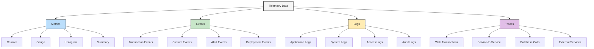

# Comprehensive Glossary of Observability Terms

## Introduction

This glossary provides detailed definitions for specialized terminology used throughout this book. Beyond simple definitions, each section includes contextual information about how these terms interrelate in modern observability architectures and New Relic's specific implementations.

## Visualization: The Observability Landscape

```mermaid
graph TD
    root[Observability Domain] --> A[Data Collection]
    root --> B[Data Storage]
    root --> C[Data Analysis]
    root --> D[Data Visualization]
    
    A --> A1[Agent-Based]
    A --> A2[Agentless]
    A --> A3[Manual Instrumentation]
    A --> A4[Auto-Instrumentation]
    
    B --> B1[Time Series DB]
    B --> B2[Document Stores]
    B --> B3[Columnar Storage]
    B --> B4[Object Storage]
    
    C --> C1[Query Languages]
    C --> C2[Statistical Analysis]
    C --> C3[Anomaly Detection]
    C --> C4[Correlation Analysis]
    
    D --> D1[Dashboards]
    D --> D2[Alerts]
    D --> D3[Service Maps]
    D --> D4[Topology Views]
    
    style root fill:#f9f9f9,stroke:#333,stroke-width:2px
    style A fill:#e1f5fe,stroke:#333
    style B fill:#e8f5e9,stroke:#333
    style C fill:#fff3e0,stroke:#333
    style D fill:#f3e5f5,stroke:#333
```

## Core Terminology

### A

**Aggregation**
: The process of combining multiple data points into a single value using mathematical functions like sum, average, or percentile. In New Relic, aggregation occurs at both collection time (for dimensional metrics) and query time (for NRDB).

**Agent**
: Software that collects telemetry data from hosts, containers, or applications. New Relic offers various agents including infrastructure agents, language agents (Java, .NET, etc.), and Kubernetes integration.

**Alert Condition**
: A specific threshold or anomaly detection setting that triggers a notification. In New Relic, alert conditions can be defined using NRQL queries or predefined condition types.

**APM (Application Performance Monitoring)**
: The monitoring and management of performance and availability of software applications. New Relic APM provides insights into application response times, throughput, error rates, and transaction traces.

**Attribute**
: A key-value pair providing metadata about a telemetry signal. In New Relic, attributes can be attached to events, metrics, logs, and traces, enhancing filtering and analysis capabilities.

### B

**Backend**
: In observability contexts, refers to the server-side components of an application or the data processing and storage systems that power an observability platform.

**Batch Processing**
: The technique of processing collected data in groups rather than individually, often used to optimize throughput and reduce overhead in data pipelines.

**Blue-Green Deployment**
: A deployment strategy that maintains two identical production environments, allowing for seamless switchover and fallback. Observability tools like New Relic can monitor these transitions and validate success criteria.

**Brownfield**
: Existing infrastructure or applications that need to be instrumented for observability, as opposed to greenfield deployments that include observability from inception.

### C

**Canary Deployment**
: A deployment strategy where changes are gradually rolled out to a small subset of users or servers before full deployment, with observability tools monitoring for unexpected behavior.

**Cardinality**
: The number of unique combinations of dimensions or attributes in a dataset. High cardinality can significantly impact the performance and cost of observability systems.

**Cluster**
: A group of servers that function as a single system. In Kubernetes, a cluster consists of at least one control plane and multiple worker nodes.

**Collector**
: Software component that receives, processes, and forwards telemetry data. In OpenTelemetry, collectors provide capabilities like buffering, filtering, and protocol translation.

**Container**
: A lightweight, standalone executable package that includes everything needed to run an application. Container metrics are a key focus in Kubernetes observability.

**Context Propagation**
: The process of passing trace context (trace ID, span ID, etc.) across service boundaries to maintain distributed tracing capabilities.

**CPU Throttling**
: A condition where container CPU usage is artificially limited by Kubernetes resource constraints, potentially causing performance degradation that requires observability to detect.

**CRI (Container Runtime Interface)**
: A Kubernetes API that enables kubelet to use different container runtimes. New Relic Infrastructure agent can collect metrics from various CRI implementations.

**Custom Instrumentation**
: The practice of adding application-specific metrics, events, logs, or traces beyond what's provided by automatic instrumentation.

### D

**Dashboard**
: A visual display of metrics, logs, and other telemetry data. New Relic offers both pre-built and customizable dashboards.

**Data Model**
: The structure and organization of telemetry data. New Relic uses a dimensional data model for metrics and an event-based model for NRDB.

**Data Pipeline**
: A series of data processing elements where the output of one element is the input to the next. In observability, pipelines transform and route telemetry data.

**Dimensional Metrics**
: Metrics that are tagged with key-value pairs (dimensions) to provide additional context. New Relic's Dimensional Metric API and OpenTelemetry metrics use this approach.

**Distributed System**
: A system whose components are located on different networked computers, which communicate and coordinate their actions by passing messages to one another.

**Distributed Tracing**
: The method of tracking and observing service requests as they flow through distributed systems. New Relic Distributed Tracing helps identify latency issues and understand service dependencies.

### E

**eBPF (extended Berkeley Packet Filter)**
: A technology that can run sandboxed programs in the Linux kernel, used by advanced observability tools to capture system events with minimal overhead.

**Endpoint**
: A remote computing device that communicates with a network, such as a server, API, or service endpoint. In observability, endpoints are monitored for availability and performance.

**Entity**
: A monitored component in your environment. In New Relic, entities include applications, hosts, containers, and services, which are automatically discovered and visualized.

**Error Budget**
: A quantitative measure of acceptable system downtime or error rates, often associated with SLOs. New Relic error budgets help teams make data-driven decisions about reliability investments.

**Event**
: A record of a discrete occurrence in a system. In New Relic, events are stored in NRDB and can represent transactions, deployments, alerts, or custom-defined happenings.

### F

**Facet**
: A dimension or attribute used to categorize and group data. In NRQL, the FACET clause allows splitting results by specific attributes.

**Filter**
: A condition used to select a subset of data based on attributes or values. Both New Relic and OpenTelemetry provide filtering capabilities in their data processing pipelines.

**Flame Graph**
: A visualization technique used to represent hierarchical data, particularly useful for CPU profiling and distributed trace analysis.

**Frontend**
: In observability contexts, refers to client-side application components or the user interface of an observability platform like New Relic One.

### G

**Golden Metrics**
: Essential metrics that provide fundamental insights into service health, typically focusing on throughput, error rate, and latency. New Relic's entity overviews surface these key indicators.

**Golden Signals**
: Similar to Golden Metrics, a term popularized by Google's SRE practices, referring to latency, traffic, errors, and saturation as key indicators of service health.

**Granularity**
: The level of detail or time resolution in collected data, such as 1-second, 10-second, or 1-minute data points. Higher granularity provides more detail but increases data volume.

### H

**Health Check**
: A monitoring procedure to determine the status of a service or component. Kubernetes uses health checks to manage container lifecycle, while observability platforms use them to detect service degradation.

**Histogram**
: A representation of the distribution of numerical data, particularly useful for understanding performance patterns. New Relic's metric system supports histogram collection and analysis.

**Host**
: A physical or virtual server that runs applications and services. The New Relic Infrastructure agent provides detailed host monitoring capabilities.

### I

**Infrastructure as Code (IaC)**
: The practice of managing infrastructure through code rather than manual processes. Observability setups are increasingly defined through IaC.

**Ingestion**
: The process of receiving and initially processing telemetry data. New Relic's ingestion systems handle millions of data points per second.

**Instrumentation**
: The process of adding code to applications or systems to collect telemetry data. New Relic offers both automatic and manual instrumentation options.

**Integration**
: A pre-built connection between an observability platform and a specific technology. New Relic offers hundreds of integrations with common technologies and services.

### K

**Kubernetes**
: An open-source platform for automating deployment, scaling, and operations of application containers. New Relic provides comprehensive monitoring for Kubernetes environments.

**Kube State Metrics**
: A service that listens to the Kubernetes API server and generates metrics about the state of objects. These metrics are collected by New Relic's Kubernetes integration.

## Visualization: The MELT Data Model

### L

**Label**
: In Kubernetes and Prometheus contexts, a key-value pair attached to objects for identification and selection. Similar to dimensions or attributes in New Relic.

**Latency**
: The time delay between an action and its result, often measured in milliseconds. Monitoring latency is crucial for understanding user experience and service performance.

**Log Management**
: The practice of collecting, parsing, storing, and analyzing log data. New Relic's Log Management provides centralized analysis and correlation with metrics and traces.

### M

**Margin of Error**
: The amount of random sampling error in monitoring results, important to consider when dealing with sampling or aggregation in observability data.

**Metadata**
: Data that provides information about other data, such as attributes describing a metric or context for a log entry.

**Metric**
: A numerical measurement of system behavior over time. New Relic supports both dimensional metrics and event-based metrics (through NRQL queries).

**Microservices**
: An architectural style that structures an application as a collection of loosely coupled services. Observability is particularly important in microservice architectures.

**Monitoring**
: The process of collecting and analyzing data about system performance and behavior to ensure availability and optimal operation.

### N

**Namespace**
: A mechanism for organizing resources within a Kubernetes cluster. In observability contexts, namespaces help organize and isolate monitoring data.

**Network Topology**
: The arrangement of elements in a communication network. New Relic Service Maps and Entity Explorer visualize application and service topologies.

**Node**
: In Kubernetes contexts, a worker machine that runs containerized applications. New Relic monitors node performance and resource utilization.

**Notification Channel**
: A method for delivering alerts, such as email, Slack, or webhooks. New Relic supports numerous notification channels for alerting.

**NRDB (New Relic Database)**
: New Relic's telemetry database that stores events, metrics, logs, and traces for fast querying and analysis.

**NRQL (New Relic Query Language)**
: A SQL-like query language used to retrieve and analyze data from NRDB.

### O

**Observability**
: The extent to which internal states of a system can be inferred from its external outputs. More comprehensive than monitoring, observability enables understanding of complex, dynamic systems.

**OOM (Out of Memory)**
: A condition where a process is terminated due to memory exhaustion. New Relic can help identify and troubleshoot OOM events in containerized environments.

**OpenTelemetry (OTel)**
: An open-source observability framework for cloud-native software. New Relic supports OpenTelemetry as both a source and destination for telemetry data.

**OTLP (OpenTelemetry Protocol)**
: The protocol used by OpenTelemetry to transmit telemetry data. New Relic accepts OTLP directly via its endpoints.

### P

**PaaS (Platform as a Service)**
: A category of cloud computing services that provides a platform for customers to develop, run, and manage applications. Many PaaS offerings include built-in observability features.

**Percentile**
: A measure indicating the value below which a given percentage of observations falls. For example, the 95th percentile response time is the time below which 95% of requests complete.

**Pod**
: The smallest deployable unit in Kubernetes, consisting of one or more containers. New Relic monitors pod performance, health, and resource utilization.

**Polling**
: A technique where a system periodically checks other systems for data or status updates, common in infrastructure monitoring.

**Prometheus**
: An open-source monitoring and alerting toolkit, popular in Kubernetes environments. New Relic can ingest Prometheus metrics and PromQL-compatible queries.

## Table: Query Language Comparison

| Feature | NRQL (New Relic) | PromQL (Prometheus) | Datadog Query | LogQL (Loki) |
|---------|------------------|---------------------|---------------|--------------|
| **Basic Selection** | `SELECT x FROM Metric` | `metric_name` | `sum:metric_name{*}` | `{app="frontend"}` |
| **Filtering** | `WHERE condition` | `{label="value"}` | `{tag:value}` | `{label="value"}` |
| **Aggregation** | `SELECT sum(x)` | `sum(metric_name)` | `sum:metric_name{*}` | `sum(rate({app="frontend"}[5m]))` |
| **Grouping** | `FACET dimension` | `by (label)` | `by {tag}` | `by (label)` |
| **Time Window** | `SINCE 30 minutes AGO` | `[30m]` | `.rollup(30)` | `[30m]` |
| **Rate Calculation** | `SELECT rate(count(*), 1 minute)` | `rate(metric[5m])` | `per_second(count:metric{*})` | `rate({app="frontend"}[5m])` |
| **Percentiles** | `SELECT percentile(duration, 95)` | `histogram_quantile(0.95, sum(rate(histogram_bucket[5m])) by (le))` | `p95:metric{*}` | Not directly supported |
| **Math Operations** | `SELECT x / y * 100` | `(metric1 / metric2) * 100` | `(metric1 / metric2) * 100` | Limited support |
| **JOINs** | Supported | Not supported | Not supported | Not supported |
| **Sub-queries** | Supported | Limited support | Limited support | Limited support |

### Q

**Query**
: A request for data or information from a database or data store. NRQL queries are the primary method for extracting insights from New Relic data.

**Query Optimizations**
: Techniques to improve query performance, such as data pre-aggregation or query rewriting. New Relic implements numerous optimizations in its query engine.

**Queue**
: A line of items waiting to be processed. Monitoring queue depth and processing times is important for many system components.

### R

**Rate**
: The frequency at which events occur per unit of time, such as requests per second or errors per minute. Common metric type in observability.

**Real User Monitoring (RUM)**
: The practice of collecting performance data from actual user interactions with websites or applications. New Relic Browser provides RUM capabilities.

**Resilience**
: A system's ability to maintain acceptable performance during failures or stress. Observability helps measure and improve resilience.

**Resource**
: An entity that can be provisioned, managed, and monitored, such as compute, memory, storage, or network. Resource utilization is a fundamental observability concern.

**Retention**
: The duration for which monitoring data is stored before being discarded or archived. New Relic has different retention policies based on data type and account tier.

**Root Cause Analysis (RCA)**
: The process of identifying the primary cause of a problem or incident. New Relic's correlation capabilities assist with RCA.

### S

**Sampling**
: The practice of collecting a subset of data rather than all available data, often used to reduce overhead. New Relic employs intelligent sampling for high-volume data sources.

**Scalability**
: A system's ability to handle growing amounts of work by adding resources. Observability platforms must scale with the systems they monitor.

**Service**
: A software component that provides specific functionality, often part of a microservice architecture. Services are primary entities in modern observability.

**Service Level Indicator (SLI)**
: A metric that serves as a measure of the level of service provided. Common SLIs include availability, latency, and error rate.

**Service Level Objective (SLO)**
: A target value or range for an SLI. New Relic SLO features help teams set and monitor objectives.

**Service Map**
: A visual representation of services and their interactions. New Relic Service Maps automatically discover and visualize application topologies.

**Span**
: A unit of work or operation within a trace, representing a single operation within a transaction. Spans include timing data and contextual information.

**Synthetic Monitoring**
: The practice of creating scripted interactions to simulate user behavior and monitor application performance and availability. New Relic Synthetics provides these capabilities.

### T

**Tag**
: A label attached to an entity for identification or categorization. In New Relic, tags facilitate entity search, filtering, and faceting.

**Telemetry**
: The collection and transmission of monitoring data from remote or inaccessible systems. Encompasses metrics, events, logs, and traces (MELT).

**Threshold**
: A predefined level at which an action is triggered, such as an alert. New Relic allows static and dynamic thresholds for alerting.

**Time Series**
: A sequence of data points indexed in time order, fundamental to monitoring and observability. New Relic stores and analyzes billions of time series.

**Topology**
: The arrangement of components in a system and their relationships. New Relic automatically discovers and visualizes application and infrastructure topologies.

**Trace**
: A record of a transaction's path through a distributed system. New Relic Distributed Tracing follows transactions across service boundaries.

**Transaction**
: A unit of work performed by a service or application, often spanning multiple components. Transactions are a fundamental concept in APM.

### V

**Visualization**
: The graphical representation of data to aid understanding and analysis. New Relic provides numerous visualization types including charts, tables, and maps.

### W

**Waterfall Chart**
: A visualization that shows the sequential operations in a process and their durations. Used in New Relic to display transaction traces and page load components.

**Webhook**
: An HTTP callback that occurs when something happens, used to integrate monitoring systems with other tools and services. New Relic supports webhooks for alert notifications and other events.

**Workload**
: A group of entities that work together to deliver a digital service. New Relic Workloads provide a unified view of service health across multiple entities.

## Final Notes

This glossary is designed to be both a reference and a learning tool. Terms often relate to multiple areas of observability and may have specific implementations or nuances within New Relic's product suite. For the most current understanding of New Relic-specific terminology, consult the official documentation.

The observability landscape continues to evolve, with new technologies and approaches emerging regularly. This glossary will be updated in future editions to reflect these changes.
